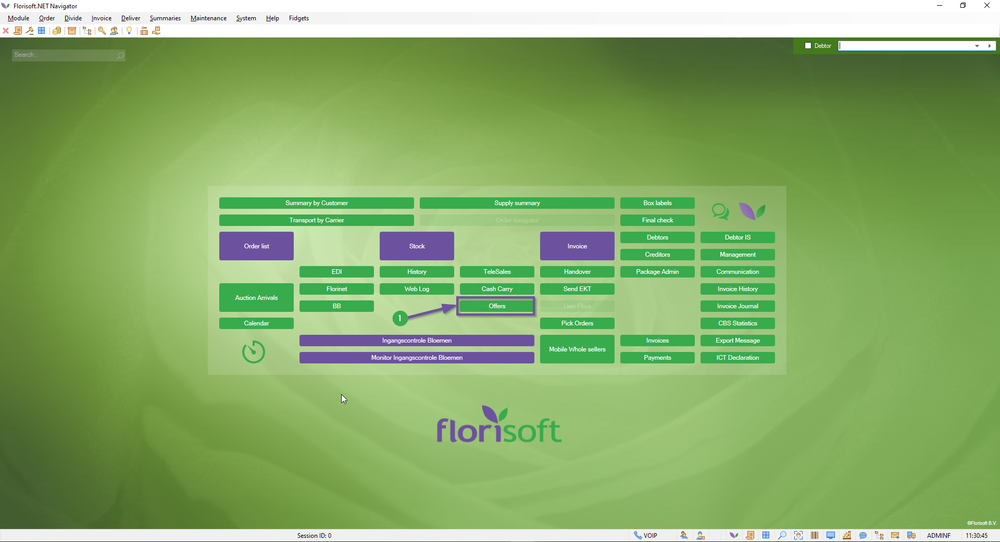
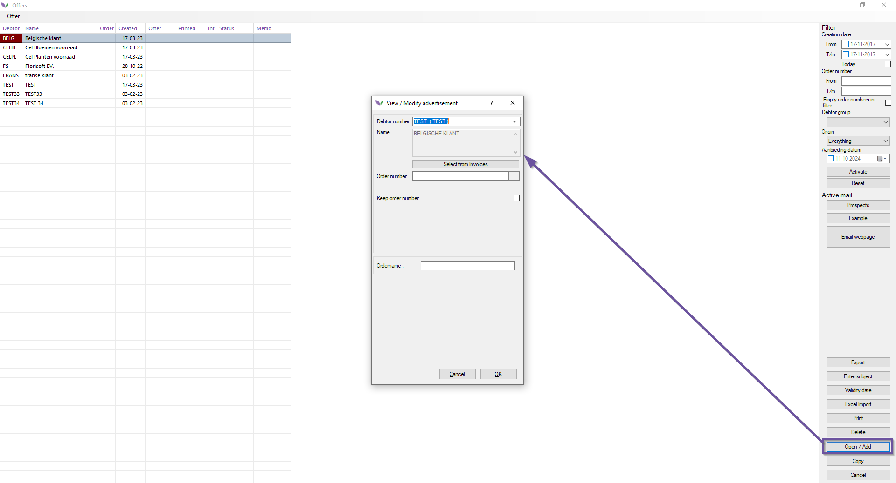
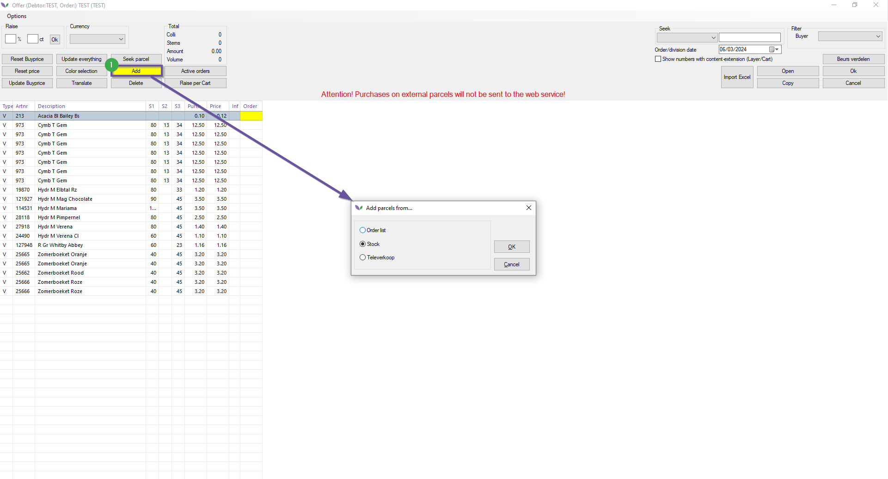
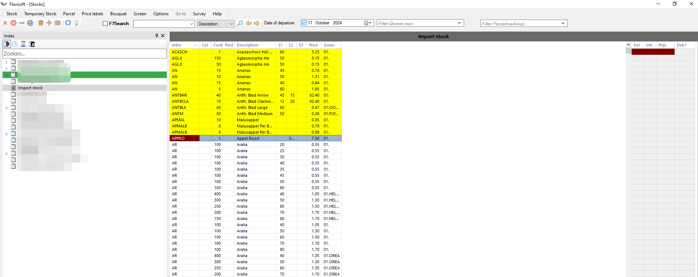
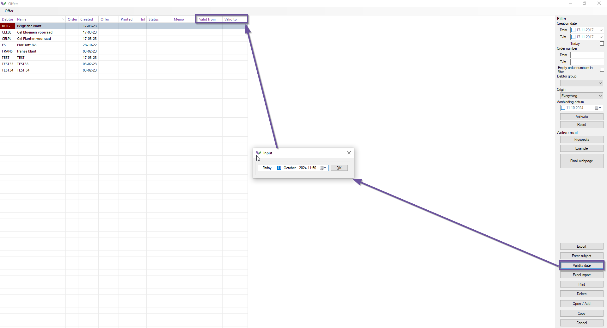
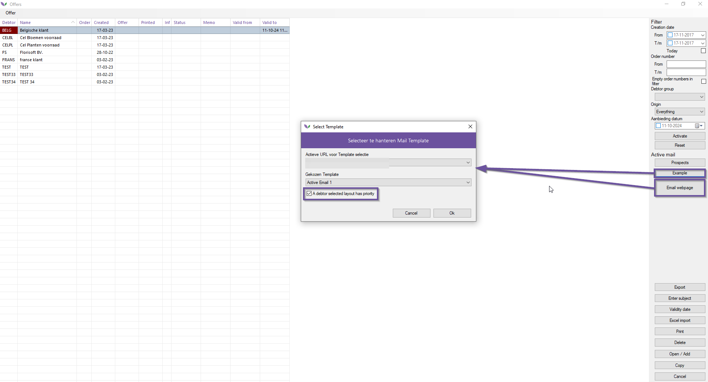
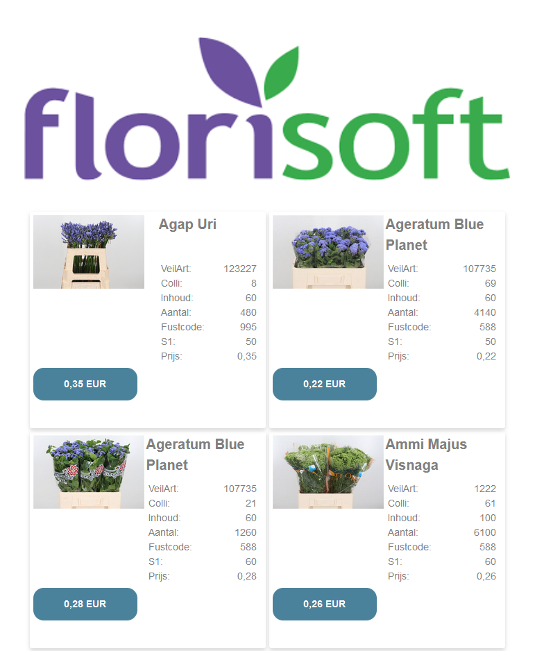

# Florisoft manual for sending offers using Florisoft Active E-Mail

In the dynamic world of the flower and plant sector, the use of internet applications has proven to be a true formula for success. We see a clear trend in which trade is increasingly shifting to online platforms. In both purchasing and sales, we are increasingly confronted with these technological developments.

Florisoft saw this trend coming years ago and has been actively developing and integrating internet applications within Florisoft .Net ever since. In response to the growing demand from the industry, we developed an Internet e-mail system that integrates seamlessly with the underlying logistics and financial processes within Florisoft .Net. This allows wholesalers in flowers and plants to modernise their business and give it a contemporary look.

After a thorough development and testing process, we present Florisoft .Net Active Email. This module enables you to send attractive promotional emails that are fully integrated with Florisoft .Net and your webshop. This means you can always count on an up-to-date stock link and prices including commission, as defined in Florisoft.

To use Florisoft .Net Active Email, you must also have Florisoft .Net Offer Lists and a Florisoft .Net Webshop. Together, these modules form a powerful toolkit to take your business to the next level in this rapidly evolving digital world. This manual provides a step-by-step guide to the effective use of Florisoft .Net Active Email so that you can take full advantage of the capabilities this module has to offer.

# Pre-Requisites & Preperations

* **Activation of the ‘Special Offers’ module:** The ‘Special Offers’ module must be activated in Florisoft. This module allows you to create and manage offers, which can then be used in Active Email campaigns.

* **Activation of the ‘Active Email’ Module:** The ‘Active Email’ module must be activated in. This module provides the functionality to create and send active emails.

* **Installation and Activation of Websockets:** Websockets must be correctly installed and enabled within the server environment. Check that Websockets are active by navigating to Health Monitor on the Florishop and checking that the ‘Blazor’ status is set to ‘Supported’. If the status indicates ‘not supported’, contact the helpdesk immediately for further assistance.

## Table of contents

[Pre-Requisites & Preperations](#pre-requisites--preperations)

## Creating offers in Florisoft Backoffice

<b>Click here for the example image!</b>

### Selecting a customer (debtor)

To start we need to select the customer (debtor) we need to create the offer for. Click on **open/add** to select the desired customer (debtor). 

<b>Click here for the example image!</b>

### Adding products

After selecting the debtor we can add products to the offer. Click on the **add** button and select the source of the products. You can choose parcels from both stock(s) and orderlist(s) in a offer. 

<b>Click here for the example image!</b>

### Select product from the source

Select the source of the products you want select, i.e. the stock. Then select the parcels you want to add to the offer from using the spacebar. There is no need to save the selection before closing the stock/orderlist screen. 

<b>Click here for the example image!</b>

### Assigning the right price & discount

In the offers overview you should now see a list of the previously selected parcels. Here you can manipulate the prices and other data. The price entered into the "**price**" column will be the price shown to the customer in the special offers e-mail and on hte webshop. Click on **Ok** to close the screen and save the changes. 

### Setting up the offer period

Use the button **Validity date** to set the validity range for the selected offer. This changes the **valid from** and **valid to** columns on your screen, if these columns are not visible on your screen at first press **F3** on your keyboard and enable the columns **valid to** and **valid from**. You can do this by checking the **on** checkbox. 

<b>Click here for the example image!</b>

### Sending the offer

You can show an example of an offer on screen by pressing the **Example** button. Select the desired lay-out first and if everything is as it should be, send the offer using the **Email Webpage** button. This functionality makes use of the debtor's configuration.

<b>Click here for the example image!</b>

### Optional : Configuring the standard lay-out for a debtor

#### Standard lay-out per debtor

You can select a default lay-out for each debtor. Select the lay-out choice by checking the checkbox "**a debtor selected layout has priority**.

<b>Click here for the example image!</b>

#### Copying offers

If you want to use the same offer for another debtor, select the newly created offer and click on the **Copy** button. Now select the relevant debitor or debtor groups.

<b>Click here for the example image!</b>

**Appendix : Example of an offer** : Below you will find an example of what an offer might look like. 

<b>Click here for the example image!</b>

## Giving shape to an active-email layout in your Florishop

### Opening the mail configuration in Florishop

Log into your florishop with a management account. Open de management function and click on the "*Mail Configuration*" under the tab "*Configuration*" in the navigation menu. 

<b>Click here for the example image!</b>

### Managing the mail configuration

The management screen for **Mail configuration** should now be opened, in which you do the following :

#### 1. Show an example template

Click on the option **Edit template** to show the existing template(s).

#### 2. Edit templates

Click on the option **Edit templates** to edit existing templates.

#### 3. Delete templates

Click on the option **Delete templates** to delete unwanted templates.

#### 4. Create new template

Click on the option **New template** to create a new template.

#### 5. Manage visible characterisics

Click on the option **Manage visible characteristics** to show characteristics in the parcel cards. It is possible to add/delete and edit to order of sorting characteristics. 

<b>Click here for the example image!</b>

### Creating and or editing a template

Select the option **New template** or **Edit template** depending or the desired action. First select a theme for which you want to create a new template and choose from the 3 different templates.

### Saving changes

Save the changes in the Mail Configuration. Now go to the Florisoft Backoffice. A new template will now be selectable when sending an active e-mail ([see](#sending-the-offer)) or select the default lay-out for each debtor ([see](#optional--configuring-the-standard-lay-out-for-a-debtor)).

## Using the Sales module for Offers (Optional)

The florishop sales module offers account managers the option to do their daily operations on the Florishop. Functionalities that were only available in the Florisoft backofffice are now available in the webshop. This offers various advantages such as accessibility, insights into customer behaviour and making purchasing items easier for customers. 

You can find further documentation on the Sales module [here](https://github.com/florisoft/User.Manuals/blob/main/FLORISHOP%20ADDONS/Florishop%20Addon%20Sales%20(M126)/M126%20-%20Manual%20FloriShop%20addon%20Sales%20-%20EN.md).

### Showing offers

*Follow the steps below:*

|Step|Explanation|
|:-:|:--|
|**1**|Log in to the Florishop using a sales user account.|
|**2**|Go to the section **Manage offers**.|

<b>Click here for the example image!</b>

All offers will be shown here including the ones created in the backoffice. You can then filter on valid offers meaning offers that are ongoing at the current date.

### Creating a new offer

*Follow the steps below*:

|Step|Explanation|
|:-:|:--|
|**1**|Click on the plus button to create a new offer. 

<b>Click here for the example image!</b>

|
|**2**|Use the selection mode to navigate to the open stocks.|
|**3**|Clcik on **accept selection** after you have filled the offers list.

<b>Click here for the example image!</b>

|

### Publishing the offer

*Folow the steps below:*

|Step|Explanation|
|:-:|:--|
|**1**|After you have assembled the offer it can be published.

<b>Click here for the example image!</b>

|
|**2**|Select the desired option to send the offer using e-mail, whatsapp or using a link to the offer.

<b>Click here for the example image!</b>

|

### Copying the offer to another debtor

|Step|Explanation|
|:-:|:--|
|**1**|It is also possible to copy an offer to another debtor by essentialy reusing it.

<b>Click here for the example image!</b>

|

## Commonly used system settings for OFfers

- **AanbiedingEmailDefOnderwerp**    
Default offers e-mail subject line, default = Aanbieding

- **AANBIEDING0AANTALLENWEBPAGEN**  
Send offers with 0 quantities in the offers' webpage. Default = True

- **AANBIEDING0PRIJSUPDATEN**  
Change price in offer even if its updated to 0, Default = False

- **AANBIEDINGBCCEN**   
All e-mail addresses you send to via the offer module become BCC addresses and the to e-mail address is set equal to the from e-mail address  

- **AanbiedingDebiteurValuta**    
When creating or copying offers set the valuta of the offer to what is configured in the debtor's settings. Default = False

- **AANBIEDINGEIGENKOLLI**  
Get colli amount for a pacel from a offer row and not from the parcel itself, Default = false

- **AanbiedingEmailAfzender**  
Sender e-mail address for an offer. Default = <empty>
Requires:
AanbiedingMailAccount, AanbiedingMailPassword, AanbiedingMailPoort & AanbiedingMailServer

- **AANBIEDINGENOPLOPENDORDNR**  
Use ascending iterative order numbers for offers, Default = False

  
- **AANBIEDINGKOPIERENORDNRMEE**  
Copy order numbers when copying the offers, Default = false

- **AANBIEDINGONDERWERPMOET**  
Subjects for an offer need to be manually filled were they to be sent. Default = false

- **AANBIEDINGUPDATEPRIJSUPDATEINK**  
Updated price determines using the price groups for the customer new base price (ink column), Default = true

- **AANBIEDINGURLACTIVEEMAIL**  
Offers - URL. The URL to the offer generated via the ‘Copy offer url’ via a line in the grid, is completed with the ‘ActiveEmailLogin=true’ segment. Default = false

- **AANBIEDINGURLPRODUCTGROEP**  
The URL to the offer contains a product group (such as ALL___) (such as returnurl=~/Stock/PRODUCT GROUP/AAN_/PRODUCT GROUP___). default = false

- **AANBIEDINGURLVOORRAADGROEP**  
An offer's URL contain the stock group like returnurl=~/stock/STOCKGROUP/AAN_... . default = true

- **AANBIEDINGVERDEELVIAKOPPELING**  
Ability to make divisions via stock connections in the change-offers screen. This is non-default behaviour, Default = false

- **AANBIEDINGVERLEDENUITBOEKEN**  
Ability to choose past division dates when entering offers directly onto a stock. Default = true

- **DEBINSTELLINGENVOORAANBPRIJS**  
Maintain debtor settings for surcharges/price changes in the offers, Default = true

- **UPDATEINKENPRIJSBIJKOPIEREN**  
When copying an offer, execute the functions Update Ink and Update price for new offers. Default = false

- **VERKOPERINVOERAANBIEDINGEN**
Enter Seller when opening an offer, Default = False

- **VERWIJDEREIGENAANBIEDINGEN**  
You may only change your own offers and not somebody else's, default = False

- **VRAAGUPDATEPRIJZENCOPYAANB**  
Request if prices need to be updated when copying the offers. Default = False

