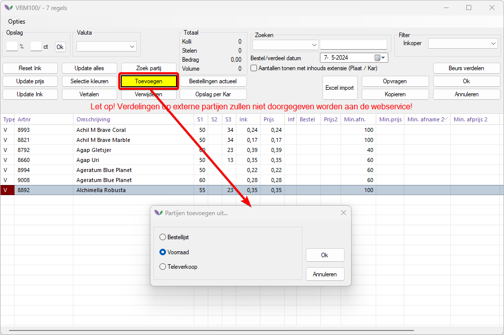

# Florisoft Handleiding voor het versturen van aanbiedingen van Active E-Mail in Florisoft

In de dynamische wereld van de bloemen- en plantensector is het gebruik van internettoepassingen een ware succesformule gebleken. We zien een duidelijke trend waarin de handel steeds meer verschuift naar online platforms. Bij zowel inkoop als verkoop worden we steeds vaker geconfronteerd met deze technologische ontwikkelingen.

Florisoft heeft deze trend jaren geleden al zien aankomen en heeft sindsdien actief gewerkt aan het ontwikkelen en integreren van internettoepassingen binnen Florisoft .Net. Als reactie op de groeiende vraag vanuit de branche hebben we een internet e-mailsysteem ontwikkeld dat naadloos integreert met de achterliggende logistieke en financiële processen binnen Florisoft .Net. Hiermee bieden we groothandelaren in bloemen en planten de mogelijkheid om hun bedrijf te moderniseren en te voorzien van een eigentijdse uitstraling.

Na een grondig ontwikkel- en testtraject presenteren we Florisoft .Net Active Email. Deze module stelt je in staat om aantrekkelijke aanbiedingsmails te versturen die volledig geïntegreerd zijn met Florisoft .Net en je webshop. Dit betekent dat je altijd kunt rekenen op een actuele voorraadkoppeling en prijzen inclusief commissie, zoals gedefinieerd in Florisoft.

Om gebruik te maken van Florisoft .Net Active Email, dien je ook te beschikken over Florisoft .Net Aanbiedingslijsten en een Florisoft .Net Webshop. Deze modules vormen samen een krachtige toolkit waarmee je jouw bedrijf naar een hoger niveau kunt tillen in deze snel evoluerende digitale wereld.
Deze handleiding biedt een stapsgewijze uitleg voor het effectief gebruik van Florisoft .Net Active Email, zodat je optimaal kunt profiteren van de mogelijkheden die deze module te bieden heeft. 

## Vereisten / Voorbereiding

- **Activering van de module "Special offers"**: *De module 'Special Offers' moet geactiveerd zijn in Florisoft. Deze module stelt je in staat om aanbiedingen te creëren en te beheren, die vervolgens gebruikt kunnen worden in de Active Email-campagnes.*

- **Activering van de Module 'Active Email':** *De module 'Active Email' moet geactiveerd zijn in. Deze module biedt de functionaliteit om active e-mails te creëren en te verzenden.*

- **Installatie en Activering van Websockets:** *Websockets moeten correct geïnstalleerd en ingeschakeld zijn binnen de server omgeving. Controleer of Websockets actief zijn door te navigeren naar Healt Monitor op de Florishop en te controleren of de ‘Blazor’ status op Supported staat. Indien de status "not supported" aangeeft, neem dan onmiddellijk contact op met de helpdesk voor verdere assistentie.*

## Inhoud

In deze handleiding komen de onderstaande onderwerpen aan bod, gebruik de onderstaande links om direct naar een hoofdstuk te gaan.

- [Vereisten / voorbereiding](#vereisten--voorbereiding)  
- [Aanbiedinen maken in de backoffice van Florisoft](#aanbiedingen-maken-in-de-backoffice-van-florisoft)   
    - [Selecteren van de debiteur](#selecteren-van-de-debiteur)
    - [Toevoegen van producten](#toevoegen-van-producten)
    - [Selecteren van producten uit de bron](#selecteren-van-producten-uit-de-bron)  
    - [Toewijzen van de juiste prijs/korting](#toewijzen-van-de-juiste-prijskorting)
    - [Instellen van de aanbiedingsperiode](#instellen-van-de-aanbiedingsperiode)
    - [Verzenden van de aanbieding](#verzenden-van-de-aanbieding)
    - [Optioneel: instellen van een standaard lay-out per debiteur](#optioneel-instellen-van-een-standaard-lay-out-per-debiteur)  
        - [Standaard lay-out per debiteur](#standaard-lay-out-per-debiteur)
        - [Aanbieding kopiëren](#aanbieding-kopiëren)
- [Vormgeven van active Email in de Florishop](#vormgeven-van-active-email-in-de-florishop)
    - [Openen van mail configuration in Florishop](#openen-van-mail-configuration-in-florishop)
    - [Beheren van Mail Configuration in Florishop](#beheren-van-mail-configuration)
        - [Voorbeeld sjabloon bekijken](#voorbeeld-sjabloon-bekijken)
        - [Wijzigingen van sjablonen](#wijzigen-van-sjablonen)
        - [Verwijderen van sjablonen](#verwijderen-van-sjablonen)
        - [Nieuw sjabloon aanmaken](#nieuw-sjabloon-aanmaken)
        - [Beheren van zichtbare kenmerken](#beheren-van-zichtbare-kenmerken)
    - [Aanmaken of wijzigingen van een sjabloon](#aanmaken-of-wijzigen-van-een-sjabloon)
    - [Opslaan](#opslaan)
- [Gebruik van de 'Sales' module voor aanbiedingen (Optioneel)](#gebruik-van-de-sales-module-voor-aanbiedingen-optioneel)
    - [Aanbiedingen beheren](#aanbiedingen-beheren)
    - [Toevoegen van producten aan de aanbieding](#toevoegen-van-producten-aan-de-aanbieding)
    - [Publiceren van de aanbieding](#publiceren-van-de-aanbieding)
    - [Kopiëren van de aanbieding naar andere debiteuren](#kopiëren-van-de-aanbieding-naar-andere-debiteuren)
- [Meest gehanteerde systeeminstellingen voor 'Aanbiedingen'](#meest-gehanteerde-systeeminstellingen-voor-aanbiedingen)

## Aanbiedingen maken in de backoffice van Florisoft

### Selecteren van de debiteur

Om te beginnen selecteren we voor welke debiteur we de aanbieding willen maken. Klik op de **'Opvragen'** knop om de gewenste debiteur te kiezen.

<b>Klik hier voor uw voorbeeld!</b>

### Toevoegen van producten

Na het selecteren van de debiteur kunnen we producten toevoegen aan de aanbieding. Druk op de **'Toevoegen'** knop en selecteer de bron waaruit je de producten wilt kiezen. Je kunt partijen uit zowel de voorraad als de bestellijst in één aanbieding gebruiken.

<b>Klik hier voor uw voorbeeld!</b>

### Selecteren van producten uit de bron

Kies de bron waaruit je de producten wilt selecteren, bijvoorbeeld uit de voorraad. Selecteer vervolgens met de spatiebalk de partijen die je aan de aanbieding wilt toevoegen. Je hoeft de selectie niet op te slaan voordat je het voorraad- of bestellijstscherm sluit.

<b>Klik hier voor uw voorbeeld!</b>

### Toewijzen van de juiste prijs/korting

In het aanbiedingsoverzicht zie je de geselecteerde partijen terug. Hier kun je de prijzen en andere gegevens aanpassen. De prijs die je invoert in de **'Prijs'** kolom is de prijs die de klant zal zien in de aanbieding en op de webshop. Klik op **'OK'** om het scherm te sluiten en de wijzigingen op te slaan.

### Instellen van de aanbiedingsperiode

Geef met de knop **'Geldigheid datum'** aan tot wanneer de aanbieding geldig is. Je kunt ook aangeven vanaf wanneer de aanbieding geldig is in de **'Geldig van'** kolom.

<b>Klik hier voor uw voorbeeld!</b>

### Verzenden van de aanbieding

Toon een voorbeeld van de aanbieding op het scherm door op de 'Voorbeeld' knop te drukken. Selecteer eerst de gewenste lay-out. Als alles naar wens is, verstuur dan de aanbieding met de 'Email Webpage' knop. Deze functie gebruikt de gegevens die zijn ingesteld voor de debiteur.

<b>Klik hier voor uw voorbeeld!</b>

### Optioneel: instellen van een standaard lay-out per debiteur

#### Standaard lay-out per debiteur

Je kunt ook een standaard lay-out per debiteur instellen. Kies bij de lay-out keuze voor verzending de optie 'Debiteur ingestelde lay-out heeft voorrang'.

<b>Klik hier voor uw voorbeeld!</b>

#### Aanbieding kopiëren

Als je dezelfde aanbieding voor andere klanten wilt gebruiken, selecteer dan de reeds aangemaakte aanbieding en klik op de 'Kopiëren' knop. Selecteer vervolgens de andere debiteuren of debiteurgroepen.

<b>Klik hier voor uw voorbeeld!</b>

**Bijlage: Voorbeeld van de aanbieding.** Hieronder vind je een voorbeeld van hoe de aanbieding eruit kan zien.

<b>Klik hier voor uw voorbeeld!</b>

**Bijlage:** Active Email lay-out voorbeeld
-- TODO!

<b>Klik hier voor uw voorbeeld!</b>

Meer informatie over het maken van een active email lay-out in hoofdstuk [hoofdstuk invoegen] 

## Vormgeven van Active Email in de Florishop

### Openen van Mail Configuration in Florishop

Log in op de Florishop met het beheer account. Open de beheer functie en zoek en klik op "Mail Configuration" onder het tabje “Configuratie” in het navigatiemenu. 

<b>Klik hier voor uw voorbeeld!</b>

### Beheren van Mail Configuration

Het beheerscherm voor **"Mail Configuration"** wordt geopend waarin verschillende handelingen kunnen worden uitgevoerd:

<b>Klik hier voor uw voorbeeld!</b>

#### Voorbeeld sjabloon bekijken

Klik op de optie **"Voorbeeld sjabloon bekijken"** om een voorbeeld van de sjabloon te bekijken.

#### Wijzigen van sjablonen

Klik op de optie **"Wijzigen Sjablonen"** om bestaande sjablonen aan te passen.

#### Verwijderen van sjablonen

Klik op de optie **"Verwijderen Sjablonen"** om ongewenste sjablonen te verwijderen.

#### Nieuw sjabloon aanmaken

Klik op de optie **"Nieuw Sjabloon"** om een nieuw sjabloon aan te maken. Meer informatie in paragraaf … 

#### Beheren van zichtbare kenmerken

Klik op de optie **"Beheren Zichtbare Kenmerken"** om kenmerken te tonen die in de partijkaart worden weergegeven. Het is mogelijk om sorteringskenmerken toe te voegen, te verwijderen of de volgorde van tonen te wijzigen.

<b>Klik hier voor uw voorbeeld!</b>

### Aanmaken of wijzigen van een sjabloon

Selecteer de optie **"Nieuw Sjabloon"** of **"Wijzigen Sjablonen"** afhankelijk van de gewenste actie. Kies eerst een thema waarvoor je sjabloon wilt maken en kies vervolgens uit drie verschillende templates.

### Opslaan

Sla de wijzigingen op in de Mail Configuration. Ga vervolgens terug naar de Florisoft Backoffice. Een nieuwe sjabloon zal nu selecteer baar zijn bij het verzenden van de active email ( zie ook [hier](#verzenden-van-de-aanbieding) ) of als standaard lay-out per debiteur (zie ook [hier](#standaard-lay-out-per-debiteur))

## Gebruik van de "Sales" module voor Aanbiedingen (Optioneel)

De Florishop Sales Module biedt accountmanagers de mogelijkheid om hun werkzaamheden met de shop uit te voeren. Functionaliteiten die voorheen alleen beschikbaar waren in Florisoft worden nu ook via de shop toegankelijk gemaakt, wat verschillende voordelen met zich meebrengt, zoals toegankelijkheid, inzicht in klantgedrag en gemakkelijker inkopen voor klanten.

Verdere toelichting in: 

[Handleiding Florishop Sales Addon](https://github.com/florisoft/User.Manuals/blob/main/FLORISHOP%20ADDONS/Florishop%20Addon%20Sales%20(M126)/M126%20-%20Handleiding%20FloriShop%20addon%20sales%20-%20NL.md)

### Aanbiedingen beheren

*Volg de onderstaande stappen:*

|Stap|Uitleg|
|:-:|:--|
|**1**|Log in met een sales user account in uw Florishop|
|**2**|Ga naar de sectie "**Aanbiedingen beheren**"|

<b>Klik hier voor uw voorbeeld!</b>

 Hier worden alle aanbiedingen weergegeven, inclusief degenen die in de backoffice zijn gegenereerd. Je kunt filteren op geldige aanbiedingen, dat wil zeggen aanbiedingen waarvan de huidige datum binnen de geldigheidsdatum van de aanbieding valt.

### Aanmaken van een nieuwe aanbieding

*Volg de onderstaande stappen:*

|Stap|Uitleg|
|:-:|:--|
|**1**|Klik op het plusje om een nieuwe aanbieding te maken.

<b>Klik hier voor uw voorbeeld!</b>

|
|**2**|Zorg ervoor dat de juiste debiteur is geselecteerd voor wie de aanbieding is bedoeld.|
|**3**|Vul het ordernummer, de titel en de geldigheidsdatum van de aanbieding in.

<b>Klik hier voor uw voorbeeld!</b>

|

### Toevoegen van producten aan de aanbieding

*Volg de onderstaande stappen:*

|Stap|Uitleg|
|:-:|:--|
|**1**|Gebruik de selectiemodus om naar de openstaande voorraden te navigeren.

<b>Klik hier voor uw voorbeeld!</b>

|
|**2**|Gebruik de selectiemodus om naar de openstaande voorraden te navigeren.|
|**3**|Klik op **"Accepteer selectie"** nadat de aanbiedingenlijst is gevuld.

<b>Klik hier voor uw voorbeeld!</b>

|

### Publiceren van de aanbieding

*Volg de onderstaande stappen:*

|Stap|Uitleg|
|:-:|:--|
|**1**|Nadat de aanbieding is samengesteld, kan deze worden gepubliceerd.

<b>Klik hier voor uw voorbeeld!</b>

|
|**2**|Kies de gewenste optie om de aanbieding te verzenden via Mail, Whatsapp of een aanbiedingslink.

<b>Klik hier voor uw voorbeeld!</b>

|

### Kopiëren van de aanbieding naar andere debiteuren

|Stap|Uitleg|
|:-:|:--|
|**1**|Het is ook mogelijk om de aanbieding te kopiëren naar andere debiteuren voor gemakkelijke hergebruik.

<b>Klik hier voor uw voorbeeld!</b>

|

## Meest gehanteerde systeeminstellingen voor ‘Aanbiedingen’:

- **AanbiedingEmailDefOnderwerp**    
Aanbiedings-email standaard onderwerp. Default = Aanbieding  

- **AANBIEDING0AANTALLENWEBPAGEN**  
Aanbiedingen met nul aantallen sturen in de webpage van de aanbiedingen, Default = true

- **AANBIEDING0PRIJSUPDATEN**  
Update prijs in de aanbieding ook prijs wijzigen als deze 0 is, Default = false  

- **AANBIEDINGBCCEN**   
Alle e-mailadressen waarnaar je verstuurt via de aanbieding module worden BCC adressen en de naar e-maildres wordt gelijk gezet aan de van e-mailadres  

- **AanbiedingDebiteurValuta**    
Bij het aanmaken of kopieren van aanbiedingen, standaard de aanbieding valuta zetten wat bij de debiteur ingesteld staat. Default = False

- **AANBIEDINGEIGENKOLLI**  
Kolli aantal van een partij uit de aanbieding regel halen en niet van de partij zelf, Default = false

- **AanbiedingEmailAfzender**  
Afzender e-mail adres voor de aanbiedingen. Default = <Leeg>
Ook benodigd:
AanbiedingMailAccount, AanbiedingMailPassword, AanbiedingMailPoort & AanbiedingMailServer

- **AANBIEDINGENOPLOPENDORDNR**  
Oplopende ordernummer voor de aanbiedingen gebruiken, Default = False
  
- **AANBIEDINGKOPIERENORDNRMEE**  
Ordernummer meenemen bij het kopieren van de aanbiedingen, Default = false

- **AANBIEDINGONDERWERPMOET**  
Onderwerp van de aanbiedingen moeten handmatig gevuld zijn mochten ze gemaild worden. Default = false.

- **AANBIEDINGUPDATEPRIJSUPDATEINK**  
Update prijs bepaald via de prijsgroepen van de klant een nieuwe basis prijs (ink kolom), default = true

- **AANBIEDINGURLACTIVEEMAIL**  
Aanbiedingen - URL. De URL naar de aanbieding gegenereerd via de 'Kopieer aanbieding url' via een regel in het grid, wordt aangevuld met het 'ActiveEmailLogin=true' segment. Default = false

- **AANBIEDINGURLPRODUCTGROEP**  
De URL naar de aanbieding bevat een productgroep (zoals ALL___) (zoals returnurl=~/Voorraad/VOORRAADGROEP/AAN_/PRODUCTGROEP___). default = false

- **AANBIEDINGURLVOORRAADGROEP**  
De URL naar de aanbieding bevat een voorraadgroep zoals returnurl=~/Voorraad/VOORRAADGROEP/AAN_... . default = true

- **AANBIEDINGVERDEELVIAKOPPELING**  
Vanuit het Aanbiedingen-wijzigen scherm ook verdelen via de voorraadkoppeling. Standaard is dit niet in gebruik. Default = false

- **AANBIEDINGVERLEDENUITBOEKEN**  
De verdeeldatum in het verleden kunnen kiezen als je in de aanbiedingen direct een bestelling invoert voor de voorraad. Default = true

- **DEBINSTELLINGENVOORAANBPRIJS**  
Debiteurinstellingen hanteren voor opslagen/prijswijzigingen in de aanbieding, Default = true

- **UPDATEINKENPRIJSBIJKOPIEREN**  
Bij het kopieren van de aanbiedingen, de functie Update Ink en Update Prijs uitvoeren voor de nieuwe aanbiedingen, Default = false

- **VERKOPERINVOERAANBIEDINGEN**
Verkoper invoeren bij openen Aanbiedingen, Default = False

- **VERWIJDEREIGENAANBIEDINGEN**  
Je mag alleen maar je eigen aanbiedingen verwijderen en niet die van iemand anders, default = false  

- **VRAAGUPDATEPRIJZENCOPYAANB**  
Vraag of bij het kopiëren van aanbiedingen of de prijzen moeten worden geüpdatet. Default = false
