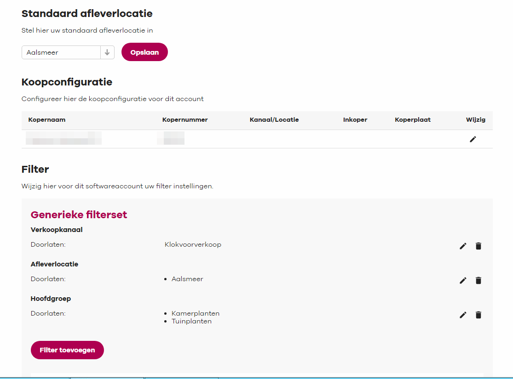
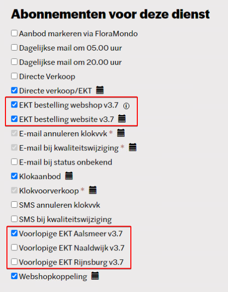
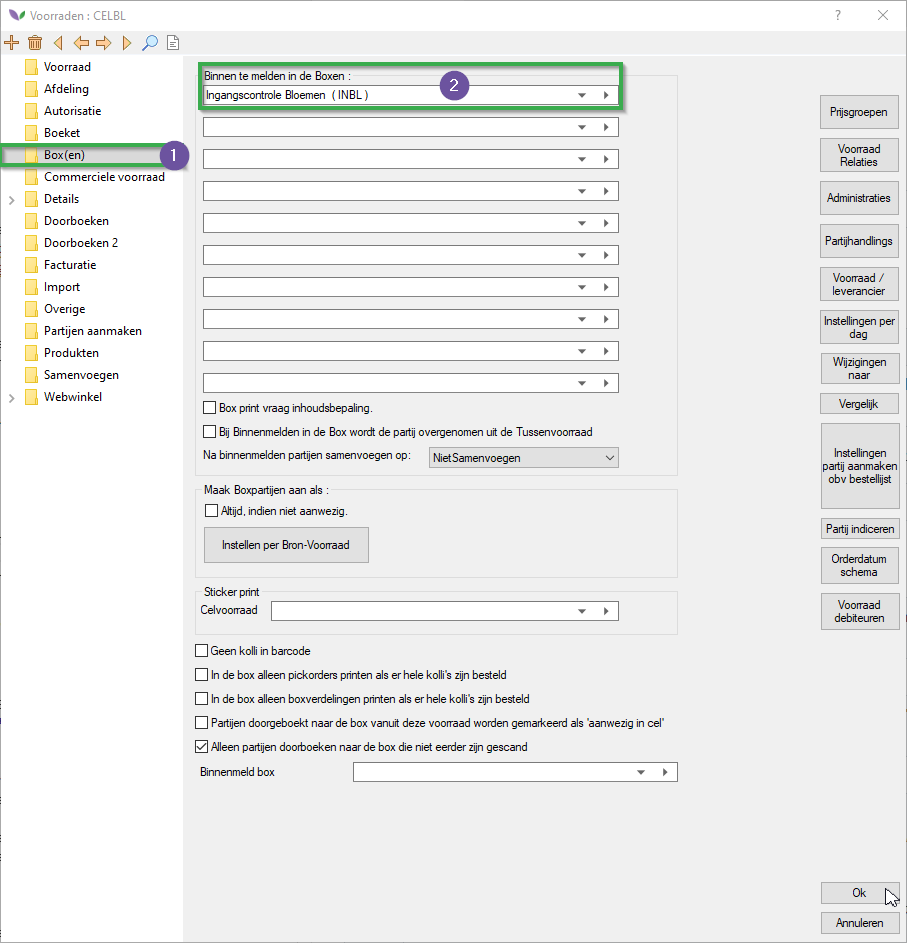
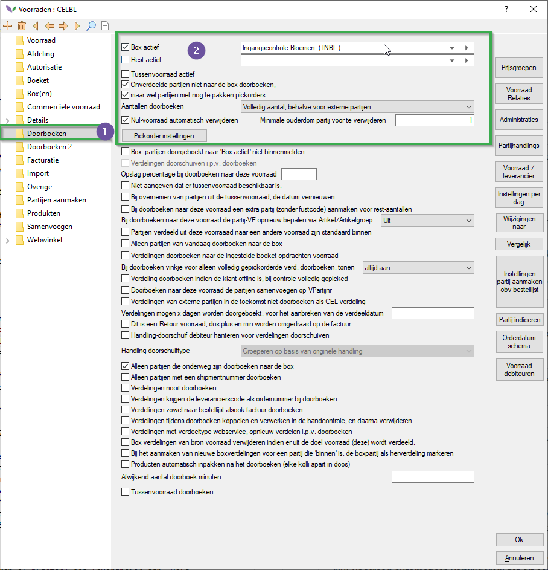
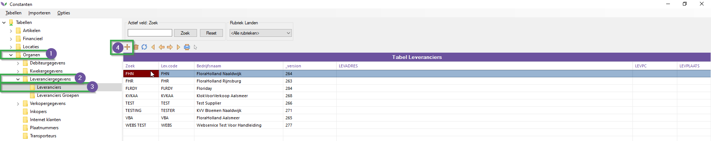
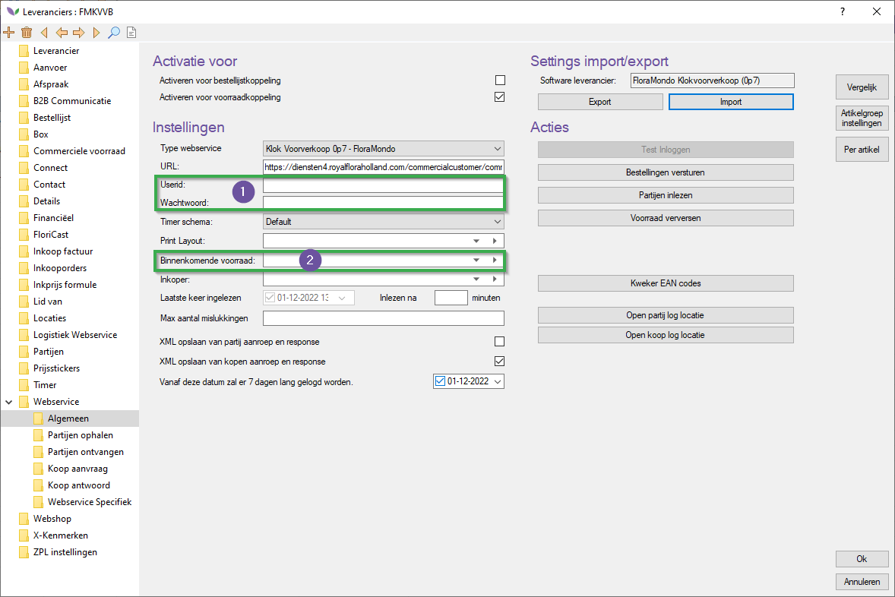
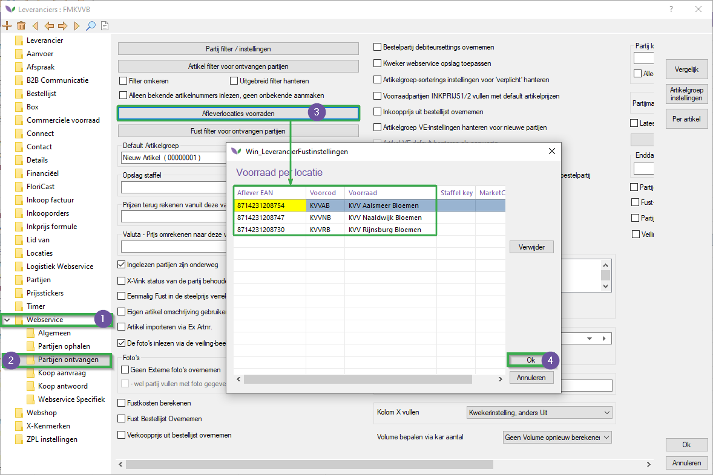
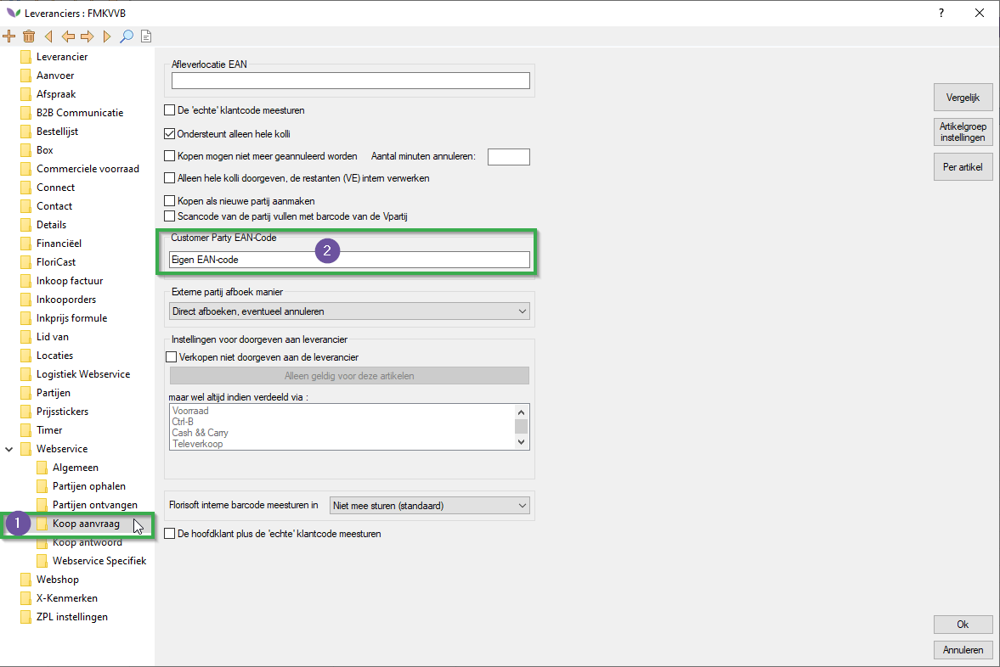

# Florisoft Manual Floramondo Pre-sales clock

Welcome to the Florisoft Clock Pre-Sales manual. This manual describes the step-by-step process of implementing the Clock Pre-sales module in Florisoft.

## Table of contents

[Pre-arranged by you](#pre-arranged-by-you)  
[Settings in your FloraHolland account](#floraholland-account-settings)  
[Setting up Florisoft](#setting-up-florisoft)  
[Creatings Stocks](#creating-suppliers)  
[Creating Suppliers](#creating-suppliers)

## Prerequisites

#### FloraMondo webservice account(s)  

* If one wants to pick up both flowers and plants through the link, two web service accounts are required. One account for the flowers and one account for the plants. This so that we can read in Florisoft the flowers and plants in different stocks.

* If the customer wants to pick up only flowers or only plants, one Web service account is sufficient.

#### FloraHolland image bank download account

* For downloading the photos into Florisoft.

## FloraHolland account settings

#### Webservice account settings

*Follow the steps below*

|Step|Explanation|
|:--|:--|
|**1**|Log in to FloraHolland using the link below:  https://floramondo.royalfloraholland.com/settings/accounts.|
|**2**|At the Web service account, click the "Settings" button.

<b>Click here for your example image!</b>

|
|**3**|Next, a page will open where filters can be set for this web service account. Change the following settings here: - **Default delivery location**  - **Filter:** adds a filter on the sales channel.|
|**4**|The filter can filter on: - **Sales channel**: *always select clock pre-sales*. - **Delivery locations**: *Multiple delivery locations can be added here.*  - **Main (product) group**: *Choose one of the following product groups: (house/garden)- plants.

<b>Click here for your example image!*</b>

|
|**5**|Do you want to import both flowers and plants? Then create a second web service account for this.|

### Service contracts

To ensure that appropriate EKT messages are sent after purchasing, service contracts require a number of subscriptions to be activated. This can be done here: https://portal.royalfloraholland.com/nl-NL/diensten/mijn-dienstcontracten.

*Follow the steps below*:

|Step|Explanation|
|:--|:--|
|**1**|Go to the link below and login to your FloraHolland account: https://portal.royalfloraholland.com/nl-NL/diensten/mijn-dienstcontracten.|
|**2**|Activate the options below: (depends on delivery location):  - **EKT bestelling webshop v3.7**  - **EKT bestelling website v3.7** - **Voorlopige EKT Aalsmeer v3.7**  *See the image below:*

<b>Click here for your example image!</b>

|
|**3**|After you save the changes, you may get the message below:

<b>Click here for your example image!</b>

|
|**4**|*Under 'Addresses for service messages', insert your EKT e-mail address to receive the preliminary and final EKTs*|

## Setting up Florisoft

### Creating stocks

*Create Florisoft inventory by product group and delivery location. Do you collect both flowers and plants from the delivery locations: Aalsmeer, Naaldwijk and Rijnsburg? Then create 6 stocks:*

1. CPS Aalsmeer Flowers
2. CPS Aalsmeer Plants
3. CPS Naaldwijk Flowers
4. CPS Naaldwijk Plants
5. CPS Rijnsburg Flowers
6. CPS Rijnsburg Plant

*You'll do this by performing the following steps:*

|Step|Explanation|
|:--|:--|
|**1**|Open the constants screen and navigate to the following path:  **Location**→**Stocks**→**Stocks**

<b>Click here for your example image!!</b>

|
|**2**|Then click on the plus icon (+) to create a new stock.|
|**3**|Fill in the standard required information on creation start screen and save the new stock by pressing '**Ok**' and confirm the creation.|

*Once you have created the stocks, follow the steps below:*

|Step|Explanation|
|:--|:--|
|**1**|Open a stock and navigate to the folder **Authorization**

<b>Click here for your example image!</b>

|
|**2**|In this screen, make sure the timer user is authorized to see the stocks.|
|**3**|Navigate to the folder **Box(es)**.|
|**4**|Set the first dropdown under the tab '*Mark as arrived in the following boxes*' to '*Ingangscontrole Bloemen INBL*'.    Do also check the checkbox "Alleen partijen doorboken naar de box niet eerder zijn gescand". These settings are important to your entry control.

<b>Click here for your example image!</b>

|
|**5**|Navigate to the folder **Carry out**|
|**6**|Change the following settings: - **Box active**: enable this. - **Dropdown**: set the dropdown to: *Ingangscontrole Bloemen* - **Don't carry out undivided parcels to the box**: set to enabled. - **but do so with parcels with active pickorders**: set to enabled - **Carry out numbers**: set the dropdown to '*Full quantity, except for external parcels*' - **Remove zero-stock automatically**: set to enabled - **Minimal age for a parcel to be removed**: set this to 1

<b>Click here for your example image!</b>

|
|**7**|Navigate to the folder **Webshop→General**|
|**8**|To be able to list the stock on the webshop the following setting needs to activated: '*This stock is available on the webshop*'. 

<b>Click here for your example image!</b>

|

### Creating supplier(s)

*Create a supplier for both main groups (flowers or plants). To do this, follow the steps below:*

|Step|Explanation|
|:--|:--|
|**1**|Open the constants screen and navigate to the following path:  **Community→Supplier data→Suppliers**

<b>Click here for your example image!</b>

|
|**2**|Then click on the plus (+) icon.|
|**3**|Fill in the basic details and close the vendor to save it.|

*Open a supplier and follow the steps below accordingly:*

|Step|Explanation|
|:--|:--|
|**1**|Navigate to the folder **Webservice→General**|
|**2**|Click on the *Import*, this opens a new smaller screen.|
|**3**|Select the "*Import default coupling*" option and press the Ok button. 

<b>Click here for your example image!</b>

|
|**4**|Dit opent weer een nieuw keuzescherm kies voor de optie: '*FloraMondo Klokvoorverkoop (0p7)*' and press **Ok**.

<b>Click here for your example image!</b>

|
|**5**|You have just imported settings for using a FloraMondo connection. You just need to fill in the following settings: - **Userid**: userID for the webservice account  - **Wachtwoord**: Password for the webservice account  - **Incoming stock**: stock where the incoming stock will be put.

<b>Click here for your example image!</b>

|
|**6**|Navigate to the folder: **Webservice→Parcel response**|
|**7**|Click on the button **Afleverlocaties voorraden** this opens a new screen. This screen allows you to set the parcel product group (plants or flowers) destination based on the EAN code for the delivery location. 

<b>Click here for your example image!</b>

|
|**8**|Navigate to the folder **Webservice→Buy request**|
|**9**|Fill out the field **Customer party EAN-Code** with your own EAN code.

<b>Click here for your example image!</b>

|
|**10**|Once you have entered this information, the link can be read in. Please note that the clock presale offer only comes online from 12:00 onwards. Therefore, no parcels will be read in before this time.|
|**11**|Navigate to the folder **Webservice→Partijen ophalen**|
|**12**|When receiving the connections parcels for the first time the setting '*Always get full stock instead of modifications*' needs to be enabled.

<b>Click here for your example image!</b>

|
|**13**|Navigate back to the **Webservice→General** folder.|
|**14**|If you have everything set up you can now press the '*Receive parcels*' button. *This may take a while, do not touch Florisoft while retrieving!*

<b>Click here for your example image!!</b>

|
|**15**|If everything is set up correctly, the message below appears after the first read.|
|**16**|**IMPORTANT:** *Turn off the 'Always get full stock instead of modifications' setting after this. This is because the clock presale supply is too large to retrieve in one go. By setting that only modifications are retrieved, Florisoft knows where it left off and will retrieve the next batch of batches. If this setting is left on, Florisoft will always try to read the same batch of batches and therefore will never read the complete supply.*

<b>Click here for your example image!!</b>

|
|**17**|To ensure that the link will continue to be read by the timer, restart the timer. After that, the link will be automatically updated through the timer.|