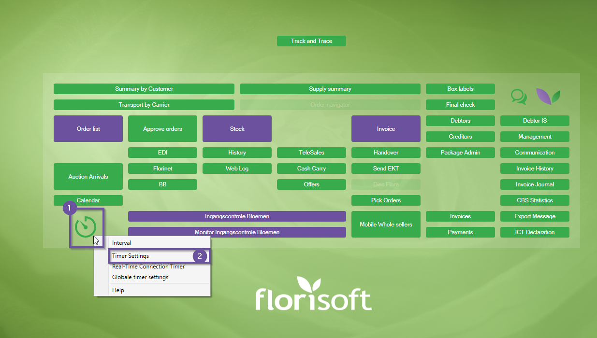
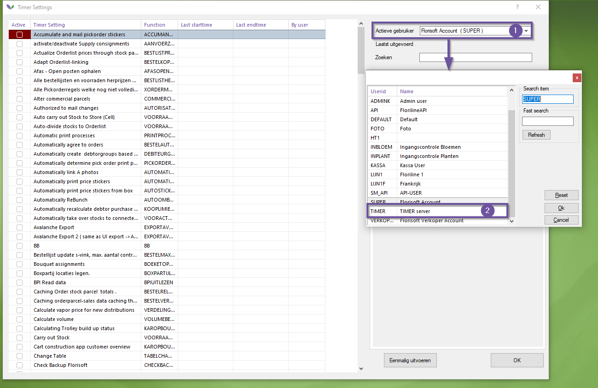
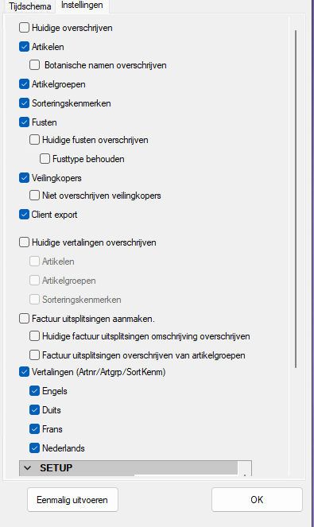
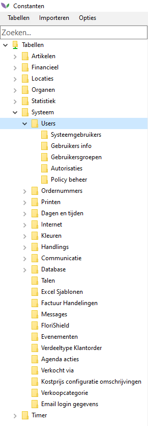
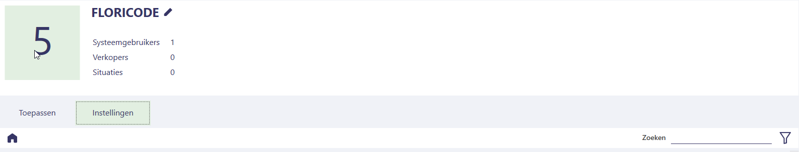
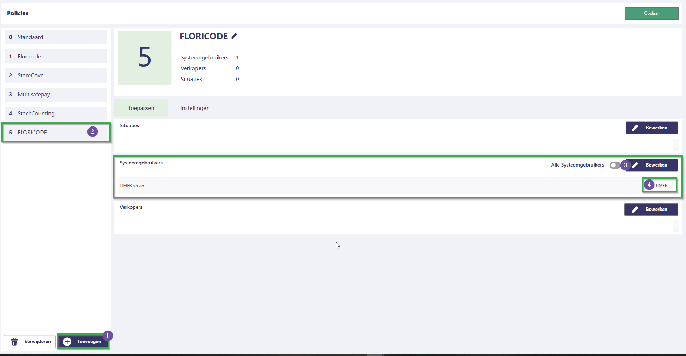
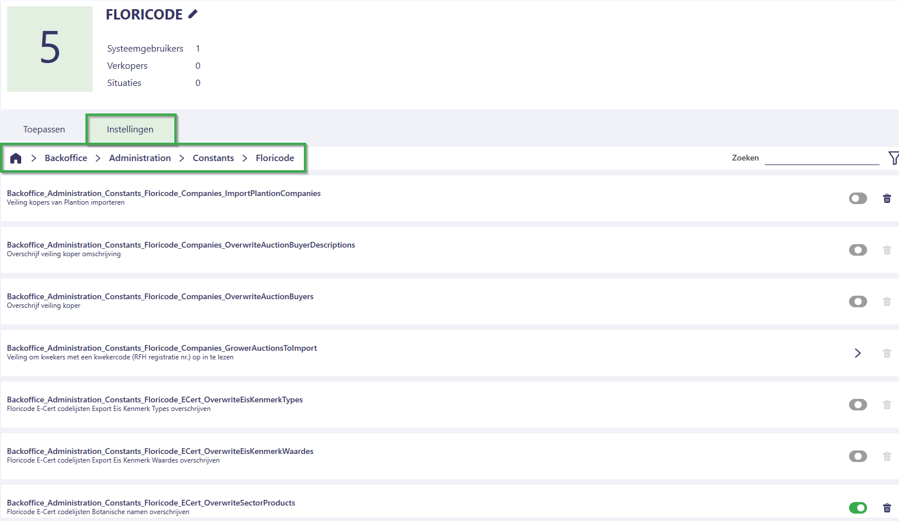
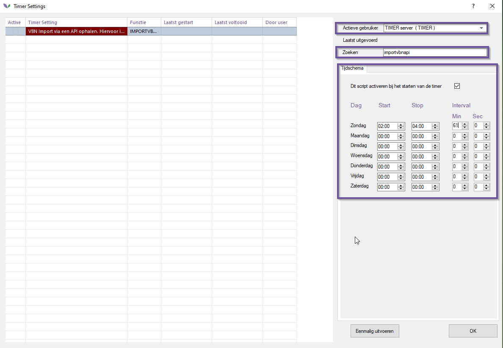
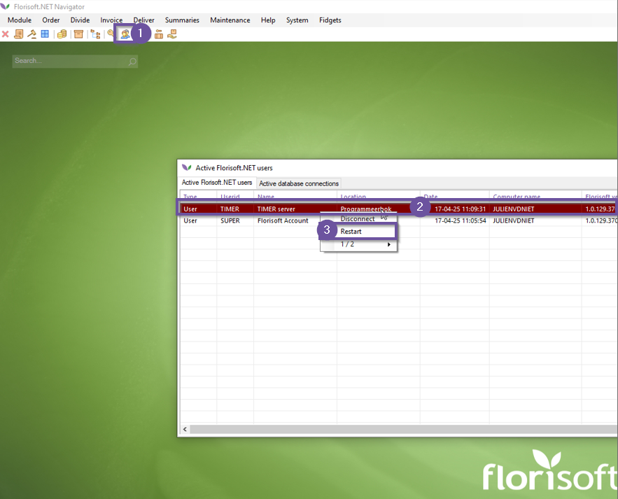

# Florisoft Handleiding Setup Floricode API

Vanaf 1 april 2025 heeft de stichting Floricode de FTP-server offline gehaald.
Dit betekent dat de Floricode standaarden enkel op te halen zijn via hun API.
Florisoft kan middels de Floricode modules met deze API werken waardoor uw standaarden synchroon blijven lopen met dat van Floricode.

In deze handleiding leest u hoe u de werking met de Floricode API configureert in uw backoffice.

## Benodigdheden

Om te kunnen werken met de Floricode API dient u te beschikken over de volgende benodigdheden :

- Floricode API Abonnement
- Floricode API login (clientId en clientSecret)

De onderstaande tabel geeft weer welke Floricode producten en Florisoft modules nodig zijn voor welke functionaliteiten. 

|Functionaliteit|Florisoft Module|Floricode Product(en)|
|:--|:--|:--|
|Artikelen, artikelgroepen en sorteringskenmerken|Product and feature type codes|Product- en kenmerkcodes|
|Kwekers en veilingkopers|Company codes|Bedrijfscodes|
|Afleverlocaties, kwekers en veilingkopers|Company and location codes|Locatie- en bedrijfscodes|
|Fustcodes|Logistic means codes|Logistieke middelen codes|
|Botanische namen en Client Export-kenmerken|e-CertNL codes|E-Cert codelijsten|
|Uitsplitsingscodes|Goods codes|Goederen codes|
|Kwekercertificaten|Sustainability certificicates|Certificatenregister|

## Checken van huidige configuratie

Om de configuratie van de nieuwe modules zo eenvoudig mogelijk te maken zijn de nieuwe policies grotendeels hetzelfde gebleven als de FTP timer instellingen.
In het geval dat u al gebruik maakte van de uitgefaseerde Floricode FTP-server modules is het verstandig om deze instellingen te kopiëren naar de API policies.

De onderstaande stappen geven aan waar u deze instellingen kan vinden zodat u deze kan screenshotten.

|Stap|Uitleg|
|:-:|:--|
|**1**|In uw Florisoft navigator klikt u met de rechtermuisknop op het timer icoon.

<b>Klik hier voor uw voorbeeld!</b>

|
|**2**|Klik in het contextmenu op de optie *Timer Settings*.

<b>Klik hier voor uw voorbeeld!</b>

|
|**3**|Klik in het timer settings scherm op de dropdown **Actieve gebruiker** en selecteer hier de timer gebruiker (meestal TIMER).

<b>Klik hier voor uw voorbeeld!</b>

|
|**4**|De timersettings in het menu zijn nu die van de draaiende timer gebruiker.|
|**5**|Gebruik vervolgens de zoekfunctie om te zoeken naar de timer functie **IMPORTVBN**.|
|**6**|Maak een screenshot van deze instellingen en bewaar het screenshot op een makkelijk te onthouden locatie.

<b>Klik hier voor uw voorbeeld!</b>

|
|**7**|Sluit vervolgens het timer settings scherm.|

## Configuratie

Met de onderstaande stappen configureert u het nieuwe Floricode API timer proces in Florisoft, zorg ervoor dat u uw Floricode clientId en clientSecret bij de hand hebt.

De onderste tabel geeft referenties naar welke Policy gelijk staat aan welke timerproces instelling.

|Stap|Uitleg|
|:-:|:--|
|**1**|Vanuit de navigator opent u het constanten scherm en navigeert u naar het pad : **Systeem→Users→Policy Beheer**

<b>Klik hier voor uw voorbeeld!</b>

|
|**2**|Dit opent het policy scherm, maak hierin een nieuwe policy aan. Weet u niet hoe policies werken leest u in [deze handleiding](https://github.com/florisoft/User.Manuals/blob/main/BASIS/Policy%20Management/Handleiding%20Policy%20Management%20NL.md) hoe u policies aanmaakt en beheert.|
|**3**|Ken onder het tabje **Toepassen** de policy toe aan de gebruiker **Timer** (of een andere gebruiker waar een timer gedraait wordt).

<b>Klik hier voor uw voorbeeld!</b>

|
|**4**|Ga vervolgens naar het tabje **Instellingen**.

<b>Klik hier voor uw voorbeeld!</b>

|
|**5**|In het tabje **Instellingen** navigeert u naar het volgende pad : **IniSettings→FsSsytem→Import**|
|**6**|Pas hier vervolgens de volgende policies aan :  **IniSettings_FsSystem_Import_FloricodeClientId :** *hier het floricode clientId*. **IniSettings_FsSystem_Import_FloricodeClientSecret** : hier het Floricode client secret.|
|**7**|Klik vervolgens op het Huis icoon in het policy pad scherm om het policy pad te resetten.|
|**8**|In het tabje **Instellingen** navigeert u vervolgens naar het volgende pad : **Backoffice→Administration→Constants→Floricode**

<b>Klik hier voor uw voorbeeld!</b>

|
|**9**|Heeft u de stappen uit het vorige hoofdstuk kunnen volgen en heeft u een screenshot bij de hand, gebruik dit screenshot dan in combinatie met de tabel in het volgende hoofdstuk om de juiste policies aan te zetten.|
|**9.a**|Indien u de stappen uit het vorige hoofdstuk niet kon volgen kan u nog steeds gebruiken van de tabel in het volgende hoofdstuk. Bepaal dan vanuit welke Florisoft modules u afneemt welke policies geconfigureerd moeten worden.  Ben je niet zeker over hoe dit werkt kan dit geconfigureerd worden door uw consultant of een van onze support medewerker. |
|**10**|Heeft u de policies geconfigureerd, sla dan de wijzigingen in de nieuwe policies op.|
|**8**|Sluit vervolgens het policy beheer scherm en ga terug naar de Florisoft navigator|
|**11**|In de Floriosft Navigator klikt u met de rechtermuisknop op het timer icoon en kies voor de optie, *timer settings*.

<b>Klik hier voor uw voorbeeld!</b>

|
|**12**|Kies vervolgens in de dropdown **Actieve gebruiker** de *Timer* gebruiker, u ziet nu de timer settings van de timer.

<b>Klik hier voor uw voorbeeld!</b>

|
|**13**|Gebruik de zoekfunctie om te zoeken naar de timer functie **IMPORTVBNAPI**, activeer het vinkje "*Dit script activeren bij het starten van de timer*"

<b>Klik hier voor uw voorbeeld!</b>

|
|**14**|Configureer vervolgens een passend tijdsschema, dit proces kan vrij intensief zijn (afhankelijk van de ingestelde policies) advies daarom is om het timerproces `s nachts te draaien.

<b>Klik hier voor uw voorbeeld!</b>

|
|**13**|Sluit het timer settings scherm door op de **Ok** knop te drukken.|
|**15**|In de florisoft navigator opent u vervolgens het **Actieve gebuikers** scherm, klik hier met de rechtermuisknop op de regel van de timer gebruiker. Kies vervolgens voor de optie herstart, dit herstart de timer gebruiker waardoor de zojuist gemaakte wijzingen doorgevoerd worden.

<b>Klik hier voor uw voorbeeld!</b>

|

### Timer setting → Policy

| Timer setting | Policy | Policy Functie omschrijving |
|:--|:--|:--|
| *Nieuw* | **UnauthorizedErrorEmails** | Autorisatie-foutmeldingen mailen naar... |
| VBN/VBNPlantionVeilingKopers | **Companies_ImportPlantionCompanies** | Veiling kopers van Plantion importeren |
| VBN/VBNOverschrVeilingkopers | **Companies_OverwriteAuctionBuyerDescriptions** | Overschrijf veiling koper omschrijving |
| VBN/VBNHuidigeOverschrijven | **Companies_OverwriteAuctionBuyers** | Overschrijf veiling koper |
| ImportKewkersVeilingen | **Companies_GrowerAuctionsToImport** | Standaard veiling codes "01", "02", "03" |
| VBN/VBNHuidigeOverschrijven | **ECert_OverwriteEisKenmerkTypes** | Floricode E-Cert codelijsten Export Eis Kenmerk Types overschrijven |
| VBN/VBNHuidigeOverschrijven | **ECert_OverwriteEisKenmerkWaardes** | Floricode E-Cert codelijsten Export Eis Kenmerk Waardes overschrijven |
| *Nieuw* | **ECert_OverwriteVerklaringen** | Floricode E-Cert codelijsten verklaring teksten overschrijven |
| *Nieuw* | **ECert_OverwriteNVWACertificateFeature** | Floricode NVWA certificaat kenmerken overschrijven |
| Factuur uitsplitsingen aanmaken/Huidige factuur uitsplitsingen omschrijving overschrijven | **GoodsCodes_OverwriteCnGoods** | Overschrijf goederencodes |
| Factuur uitsplitsingen aanmaken/Factuur uitsplitsingen overschrijven van artikelgroepen | **GoodsCodes_OverwriteProductGroupToCnGoods** | Overschrijf artikel groep land splitscodes |
| Setup/VBNArtikelenAanmaken | **Products_AppendNewArticles** | Geimporteerde VBN artikelen aanmaken als artikel, Geimporteerde VBN sorteringen aanmaken als scode of xcode |
| Artikelen/Botanische namen overschrijven | **Products_OverwriteBotanicalNames** | Botanische naam van artikelen vullen |
| VBN/Huidige overschrijven | **Products_OverwriteExistingArticles** | Overschrijf huidige artikel gegevens |
| VBN/Huidige overschrijven | **Products_OverwriteExistingFeatures** | Overschrijf huidige kenmerk gegevens |
| Setup/VBNArtikelenAanmaken | **Products_AppendNewArticleGroups** | Geimporteerde VBN artikelgroepen aanmaken als artikelgroep |
| VBN/Huidige overschrijven | **Products_OverwriteExistingArticleGroups** | Overschrijf huidige artikelgroep gegeven |
| Setup/ArticleGroupCountrySpecDefault | **Products_ArticleGroupCountrySpecDefault** | Products_ArticleGroupCountrySpecDefault |
| Setup/VBNARtikelGroepNieuwEMails | **Products_NewArticleGroupEmails** | Nieuwe aangemaakte artikelgroepen mailen naar |
| Fusten/HuidigeFustenOverschrijven | **Products_OverwriteExistingPackages** | Overschrijf huidige fust gegevens |
| Fusten/Huidige fusten overschrijven/Fusttype behouden | **Products_KeepPackageType** | Verpakking materiaal niet overschrijven |
| Setup/VBNARtikelGroepNieuwEMails | **Products_NewPackagesEmails** | Nieuwe aangemaakt fusten mailen naar |
| Huidige vertalingen overschrijven/Artikelen | **Products_OverwriteTranslations** | Alle vertalingen overschrijven van in plaats van alleen lege vullen |
| Huidige vertalingen overschrijven/Artikelgroepen | **Products_OverwriteArticleGroupTranslations** | Tijdens overschrijven van vertalingen de artikelgroep vertalingen overschrijven |
| Huidige vertalingen overschrijven/Sorteringskenmerken | **Products_OverwriteFeatureTranslations** | Tijdens overschrijven van vertalingen de kenmerk vertalingen overschrijven |
| Vertalingen (Artnr/Artgrp/SortKenm)/Nederlands | **Products_ImportDutchTranslations** | Importeer Nederlandse vertalingen |
| Vertalingen (Artnr/Artgrp/SortKenm)/Engels | **Products_ImportEnglishTranslations** | Importeer Engelse vertalingen |
| Vertalingen (Artnr/Artgrp/SortKenm)/Duits | **Products_ImportGermanTranslations** | Importeer Duitse vertalingen |
| Vertalingen (Artnr/Artgrp/SortKenm)/Frans | **Products_ImportFrenchTranslations** | Importeer Franse vertalingen |

