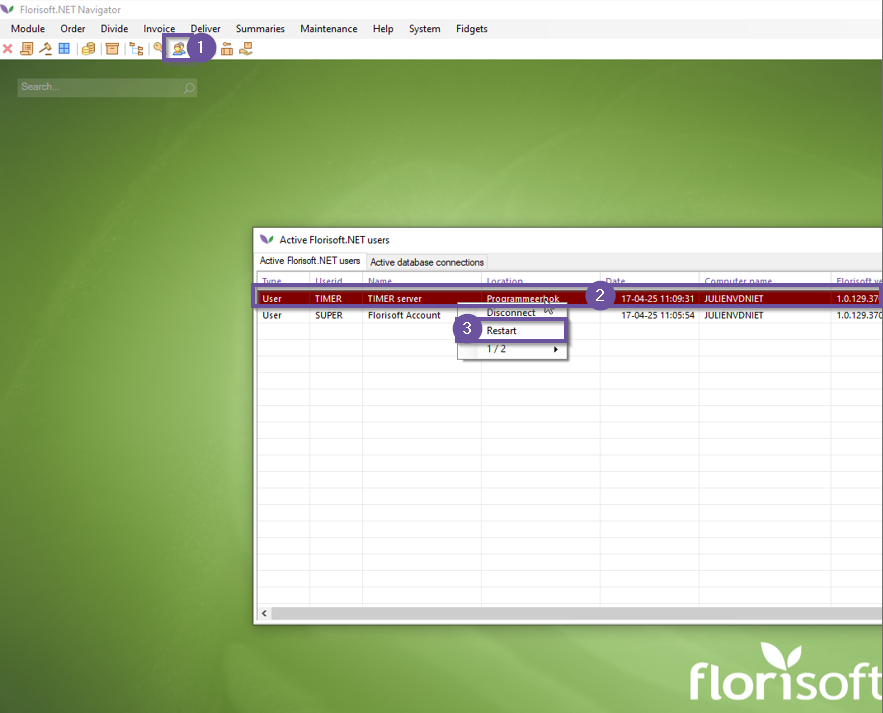

# Florisoft Manual Setup Floricode API

From April 1st 2025, the Floricode foundation has taken the FTP server offline.
This means that Floricode standards can only be retrieved through their API.
Florisoft can work with this API through the Floricode modules, keeping your standards in sync with Floricode's.

This guide tells you how to configure operation with the Floricode API in your back office.

## Prerequisites

To work with the Floricode API, you must have the following prerequisites :

- Floricode API Subscription
- Floricode API login (clientId and clientSecret)

The table below shows which Floricode products and Florisoft modules are required for which functionalities. 

|Functionality|Florisoft Module|Floricode Product(s)|
|:--|:--|:--|
|Articles, article groups & feature type codes|Product and feature type codes|Product and feature type codes|
|Growers and Auction buyers|Company codes|Company codes|
|Delivery locations, growers and auction buyers|Company and location codes|Company and location codes|
|Package codes|Logistic means codes|Logistic means codes|
|Botnaical names and Client Export features|e-CertNL codes|e-CertNL codes|
|Goods codes|Goods codes|Goods codes|
|Grower certificates|Sustainability certificicates|Sustainability certificicates|

## Checking the current configuration

To make the configuration of the new modules as easy as possible, the new policies have largely remained the same as the FTP timer settings.
In case you were already using the phased-out Floricode FTP server modules, it is wise to copy these settings to the API policies.

The steps below show you where to find these settings so you can screenshot them.

|Step|Explanation|
|:-:|:--|
|**1**|In your Florisoft navigator, right-click on the timer icon.|
|**2**|In the context menu, click the *Timer Settings* option.|
|**3**|In the timer settings screen, click the **Active user** dropdown and select the timer user (usually TIMER) here.|
|**4**|The timer settings in the menu are now those of the running timer user.|
|**5**|Then use the search function to search for the timer function **IMPORTVBN**.|
|**6**|Take a screenshot of these settings and save the screenshot in an easy-to-remember location.|
|**7**|Next, close the timer settings screen.|

## Configuration

The following steps help you configure the new Floricode API timer process in Florisoft, make sure you have your Floricode clientId and clientSecret handy.

The bottom table provides references to which Policy equals which timer process setting.

|Step|Explanation|
|:-:|:--|
|**1**|From the navigator, open the constants screen and navigate to the path : **System→Users→Policy Management**|
|**2**|This opens the policy screen, create a new policy in it. If you do not know how policies work, read how to create and manage policies in [this manual](https://github.com/florisoft/User.Manuals/blob/main/BASIS/Policy%20Management/Handleiding%20Policy%20Management%20EN.md).|
|**3**|Under the **Apply** tab, assign the policy to the user **Timer** (or any other user where a timer is being run).|
|**4**|Then go to the **Settings** tab, and navigate to the path : **IniSettings→FsSystem→import**|
|**5**|Here you'll want to change the following policies :   **IniSettings_FsSystem_Import_FloricodeClientId :** *here you'll want to copy-paste your floricode client Id*. **IniSettings_FsSystem_Import_FloricodeClientSecret** : *here you'll want to copy-paste your floricode client secret.*|
|**6**|Click on **house** icon to reset the policy path. |
|**7**|Then in the **Settings** tab, navigate to the following path : **Backoffice→Administration→Constants→Floricode**|
|**8**|If you were able to follow the steps in the previous chapter and have a screenshot handy, use this screenshot in combination with the table in the next chapter to turn on the appropriate policies.|
|**8.a**|Indien u de stappen uit het vorige hoofdstuk niet kon volgen kan u nog steeds gebruiken van de tabel in het volgende hoofdstuk. Bepaal dan vanuit welke Florisoft modules u afneemt welke policies geconfigureerd moeten worden.  Ben je niet zeker over hoe dit werkt kan dit geconfigureerd worden door uw consultant of een van onze support medewerker. |
|**9**|Once you have configured the policies, save the changes to the new policies.|
|**10**|Then close the policy management screen and return to the Florisoft navigator|
|**11**|In the Floriosft Navigator, right-click on the timer icon and choose the option, *timer settings*.|
|**12**|Next, in the **Active user** dropdown, select the *Timer* user, you will now see the timer settings of the timer.|
|**13**|Use the search function to search for the timer function **IMPORTVBNAPI**, activate the checkmark ‘*Activate this script when the timer starts*’.|
|**14**|Configureer vervolgens een passend tijdsschema, dit proces kan vrij intensief zijn (afhankelijk van de ingestelde policies) advies daarom is om het timerproces `s nachts te draaien.|
|**15**|Sluit het timer settings scherm door op de **Ok** knop te drukken.|
|**16**|In de florisoft navigator opent u vervolgens het **Actieve gebuikers** scherm, klik hier met de rechtermuisknop op de regel van de timer gebruiker. Kies vervolgens voor de optie herstart, dit herstart de timer gebruiker waardoor de zojuist gemaakte wijzingen doorgevoerd worden.

<b>Klik hier voor uw voorbeeld!</b>

|

### Timer setting → Policy

|Timer setting|Policy|Policy Function Description|
|:--|:--|:--|
|VBN/VBNPlantionVeilingKopers|**Companies_ImportPlantionCompanies**||
|VBN/VBNOverschrVeilingkopers|**Companies_OverwriteAuctionBuyerDescriptions**||
|VBN/VBNHuidigeOverschrijven|**Companies_OverwriteAuctionBuyers**||
|ImportKewkersVeilingen|**Companies_GrowerAuctionsToImport**|Standaard veiling codes "01", "02", "03"|
|VBN/VBNHuidigeOverschrijven|**ECert_OverwriteEisKenmerkTypes**||
|VBN/VBNHuidigeOverschrijven|**ECert_OverwriteEisKenmerkWaardes**||
|\*Nieuw\*|**ECert_OverwriteVerklaringen**||
|\*Nieuw\*|**ECert_OverwriteNVWACertificateFeature**||
|Factuur uitsplitsingen aanmaken/Huidige factuur uitsplitsingen omschrijving overschrijven|**GoodsCodes_OverwriteCnGoods**||
|Factuur uitsplitsingen aanmaken/Factuur uitsplitsingen overschrijven van artikelgroepen|**GoodsCodes_OverwriteProductGroupToCnGoods**||
|Setup/VBNArtikelenAanmaken|**Product_AppendNewArticles**||
|Artikelen/Botanische namen overschrijven|**Products_OverwriteBotanicalNames**||
|VBN/Huidige overschrijven|**Products_OverwriteExistingArticles**||
|VBN/Huidige overschrijven|**Products_OverwriteExistingFeatures**||
|Setup/VBNArtikelenAanmaken|**Products_Append_NewArticleGroups**||
|VBN/Huidige overschrijven|**Products_OverwriteExistingArticleGroups**||
|Setup/ArticleGroupCountrySpecDefault|**Products_ArticleGroupCountrySpecDefault**|| <!- New!- -->
|Setup/VBNARtikelGroepNieuwEMails|**Products_NewArticleGroupEmails**||<!- New!- -->
|Fusten/HuidigeFustenOverschrijven|**Products_OverwriteExistingPackages**||
|Fusten/Huidige fusten overschrijven/Fusttype behouden|**Products_Products_KeepPackageType**||
|Setup/VBNARtikelGroepNieuwEMails|**Products_NewPackageEmails**||<!- New!- -->
|Huidige vertalingen overschrijven/Artikelen|**Products_OverwriteTranslations**||
|Huidige vertalingen overschrijven/Artikelgroepen|**Products_OverwriteArticleGroupTranslations**||
|Huidige vertalingen overschrijven/Sorteringskenmerken|**Products_OverwriteFeatureTranslations**||
|Vertalingen (Artnr/Artgrp/SortKenm)/Nederlands|**Products_ImportDutchTranslations**||
|Vertalingen (Artnr/Artgrp/SortKenm)/Engels|**Products_ImportEnglishTranslations**||
|Vertalingen (Artnr/Artgrp/SortKenm)/Duits|**Products_ImportGermanTranslations**||
|Vertalingen (Artnr/Artgrp/SortKenm)/Frans|**Products_ImportFrenchTranslations**||