# Florisoft Handleiding Instellen Floricode API

In deze handleiding leer je hoe je je Floricode API abbonement koppelt aan Florisoft. 

## Benodigdheden

Om de onderstaande stappen te volgen zorg is het belangrijk dat je over de volgende dingen beschikt:

- Floricode API abbonement
- Floricode API logingegevens (gebruikersnaam en wachtwoord)

Volg de onderstaande stappen:

|Stap|Uitleg|
|:-:|:--|
|**1**|In uw florisoft navigator, klikt u op onderhoud en vervolgens op setup systeem.

<b>Klik hier voor uw voorbeeld!</b>
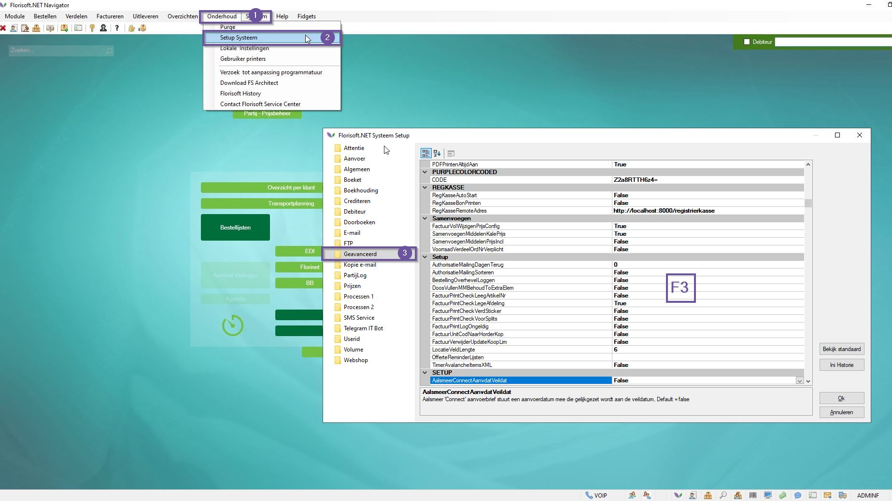
|
|**2**|Klik vervolgens op de map **Geavanceerd** en vul de toegangscode in.

<b>Klik hier voor uw voorbeeld!</b>

|
|**3**|Klik in de tabel en druk op de **F3** toets om te zoeken naar de benodigde instellingen:  **FLORICODECLIENTID**: je floricode gebruikersnaam  **FLORICODECLIENTSECRET**: je floricode wachtwoord.

<b>Klik hier voor uw voorbeeld!</b>
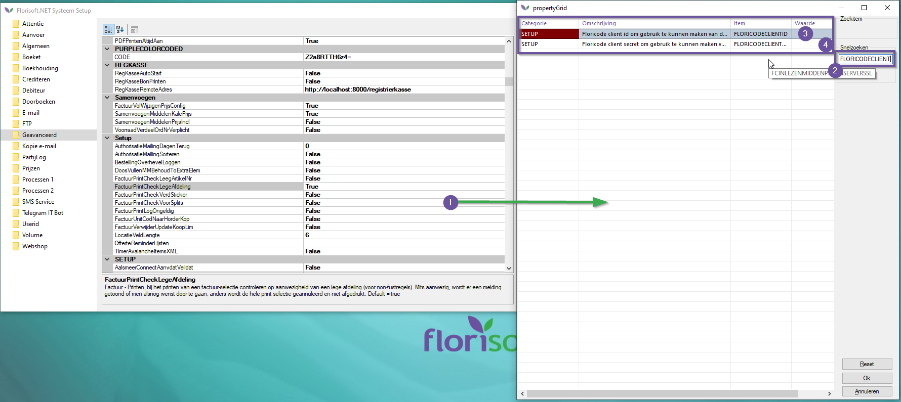
|
|**4**|Vul de instellingen met de bijhorende waarden.|
|**5**|Sluit het setup scherm.|
|**6**|Open vervolgens de timer settings (doe dit op het TIMER account), dit doe je door met de rechtermuisknop op de timer knop te drukken, en vervolgens te klikken op *Timer settings*.

<b>Klik hier voor uw voorbeeld!</b>
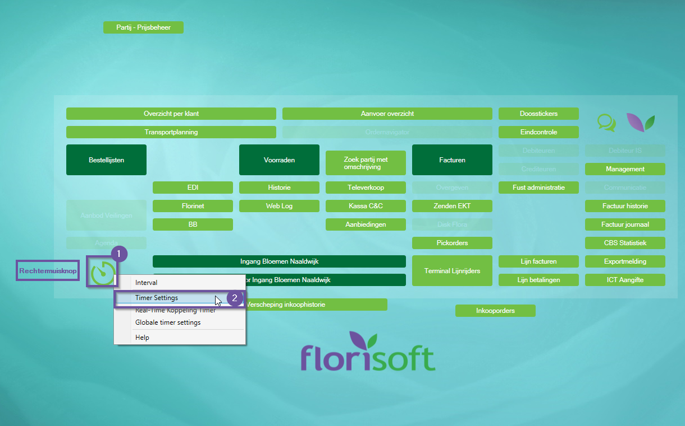
|
|**7**|Gebruik de zoekfunctie om te zoeken naar het timer proces: **IMPORTVBNAPI**|
|**8**|Activeer dit timer proces en zorg ervoor dat dit op regelematig tijdsschema draait.

<b>Klik hier voor uw voorbeeld!</b>
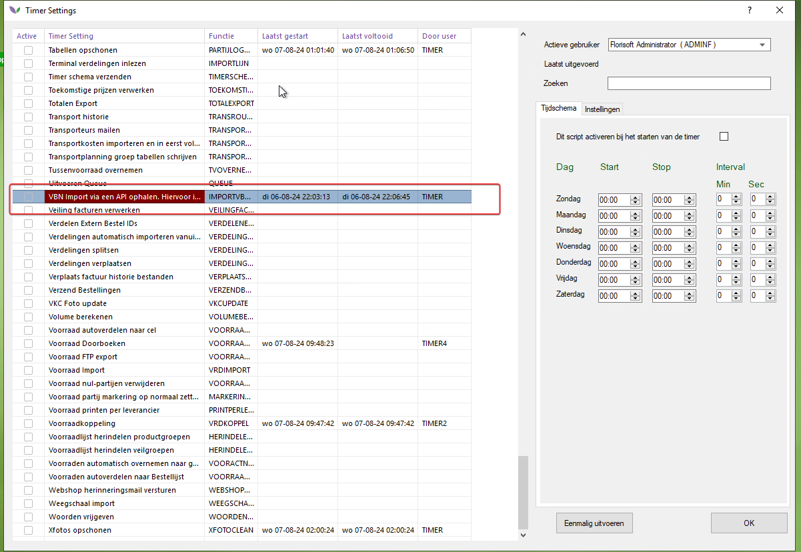
|
|**9**|Druk op de knop **Eenmalig uitvoeren** om de certificaten op te halen. |
|**13**|**Let op**! Dit werkt alleen als er een EAN code ingevuld staat bij de kweker, deze kunnen dan vervolgens gevonden in kwekerstabel de certificaten gevonden kunnen worden.|
|**14**|Open vervolgens weer de systeem setup vanuit de navigator (**onderhoud→setup systeem**) ga dan naar het mapje **geavanceerd**. Zoek dan vervolgens naar de instelling **KWEKEREANVULLENINLEZENEKT**, zet deze op **True**.

<b>Klik hier voor uw voorbeeld!</b>

 |
|**15**|Open vervolgens weer het constantenscherm en navigeer naar het volgende pad: **Systeem→Users→Policy Beheer**, dit opent het policy scherm.  Lees in [deze handleiding](https://github.com/florisoft/User.Manuals/blob/main/CLOUD%20APPLICATIONS/Server%20Management%20API%20(M212)/M212%20-%20API%20Policies%20NL.md) hoe je policies aanmaakt en aanpast.

<b>Klik hier voor uw voorbeeld!</b>
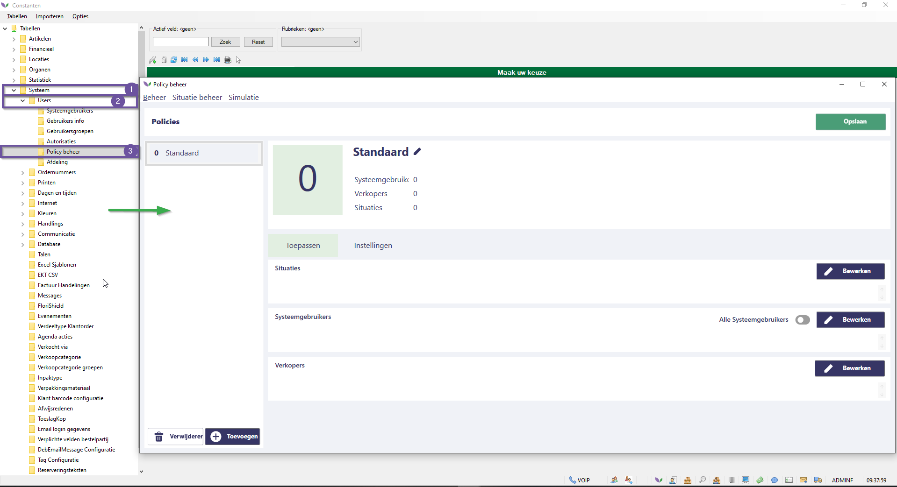
 |
|**16**|Zoek naar instelling **Backoffice_Sales_Stock_GrowerCertificate_StocksToCheck**, met deze policy stel je in welke vooraden de geldigheid van certificaten gecontroleerd moeten worden.

<b>Klik hier voor uw voorbeeld!</b>
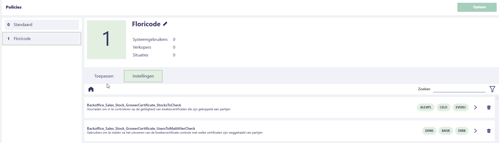
|
|**17**|De instelling **Backoffice_Sales_Stock_GrowerCertificate_UsersToMailAfterCheck**, dit geeft aan welke Florisoft gebruikers gemaild moeten worden nadat ene certificaat weggehaald wordt van een partij.  **Let op!** Dit vereist wel dat er een emailadres ingesteld staat bij de relevante user.

<b>Klik hier voor uw voorbeeld!</b>

||
|**18**|**Backoffice_Sales_Stock_ValidGrowerCertificate** :  Omdat een kweker meerdere certificaten kan hebben maar we er hiervan maar 1 kunnen tonen in de kolom 'Geldig Certificaat' in de voorraad kunnen we in deze policy een hierarchie aangeven voor welk certificaat moet worden getoond.

<b>Klik hier voor uw voorbeeld!</b>

|
|**19**|Zet de instelling **IniSettings_FSSystem_SETUP_ValideerS97Certificaat** aan.

<b>Klik hier voor uw voorbeeld!</b>
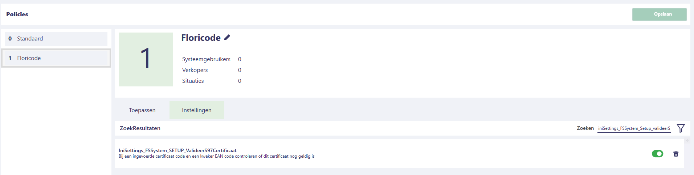
||
|**20**|Zorg ervoor dat het overkoepelende policy object gekoppeld staat aan de timer gebruiker. :warning:

<b>Klik hier voor uw voorbeeld!</b>
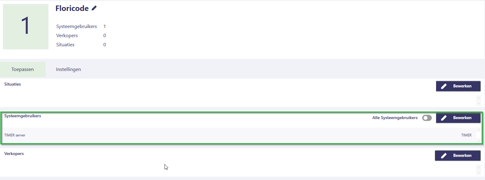
|
|**21**|Open op de florisoft timer gebruiker nogmaals de timer instellingen (rechtermuisknop op het timericoon), |
|**22**|Gebruik de zoekfunctie om te zoeken naar het timerproces **KwekerCertificaatPartijControle**.

<b>Klik hier voor uw voorbeeld!</b>

||
|**23**|Stel dit timerproces in zodat het met enige regelmaat uitgevoerd wordt.

<b>Klik hier voor uw voorbeeld!</b>
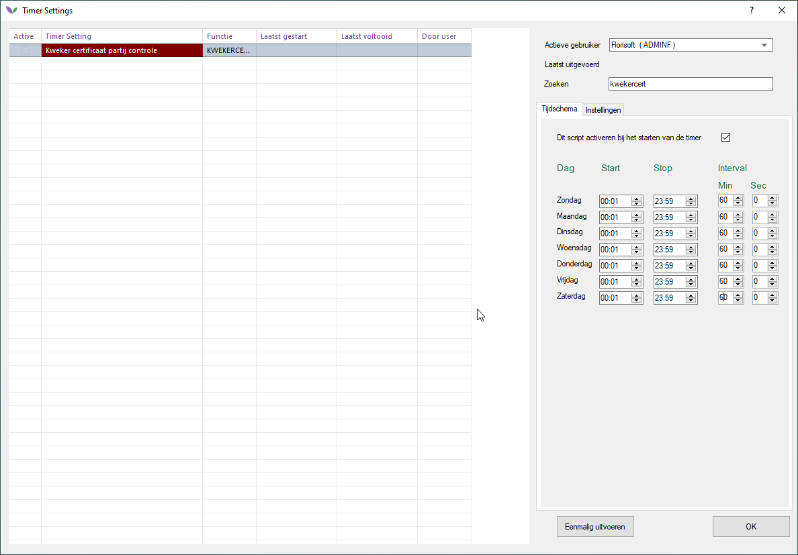
||
|**10**|Certificaten zijn nu terug te vinden in uw systeem. Open het constanten scherm en navigeer naar het volgende pad: **Organen→Kwekersgegevens→Kwekers**  Open een kweker, en druk op de knop **certifcaten**. (rechtsonderin)|
|**11**|Ook zijn de certificaten in te zien in de voorraad, open een voorraad (in het voorraadscherm). Klik met de rechtermuisknop op een voorraadpartij en klik op de optie **Kweker Certificaten**

<b>Klik hier voor uw voorbeeld!</b>
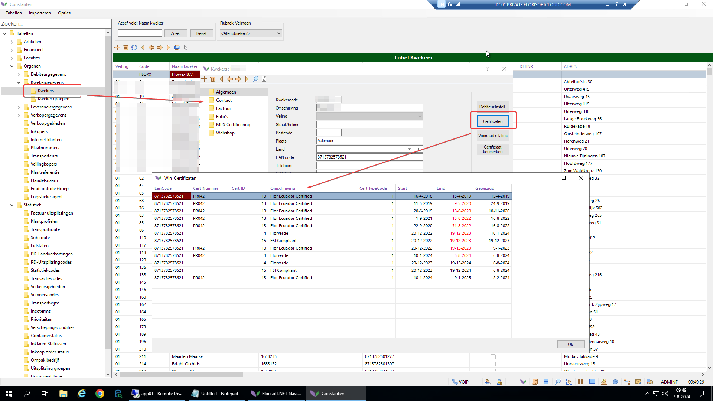
|
|**12**|In deze schermen zie je de certificaat informatie waaronder het ID, en wanneer het certificaat geldig is. Dit kun je ook terug laten komen in factuur layouts. 

<b>Klik hier voor uw voorbeeld!</b>
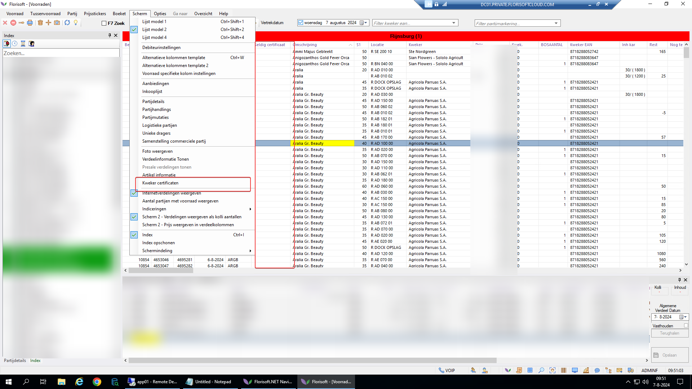
|