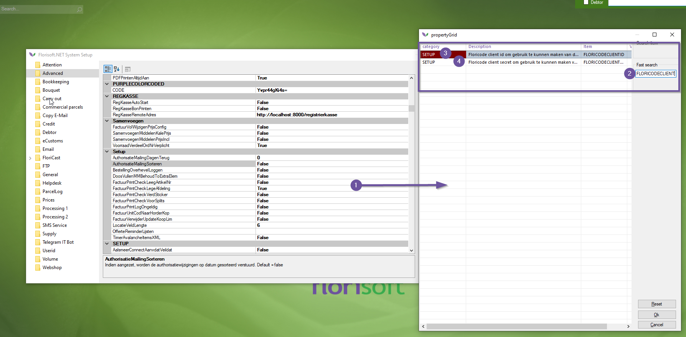
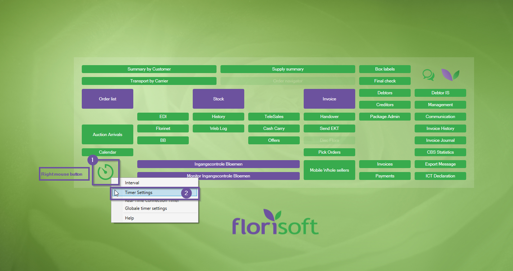
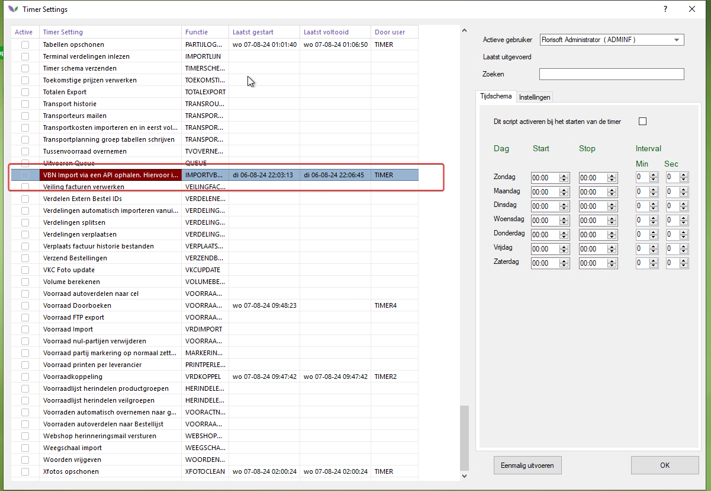
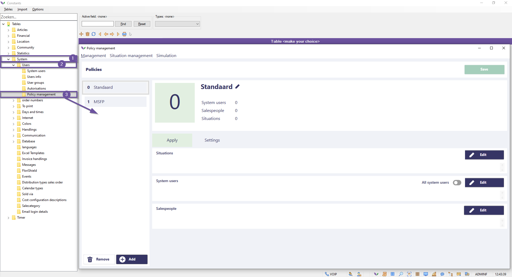
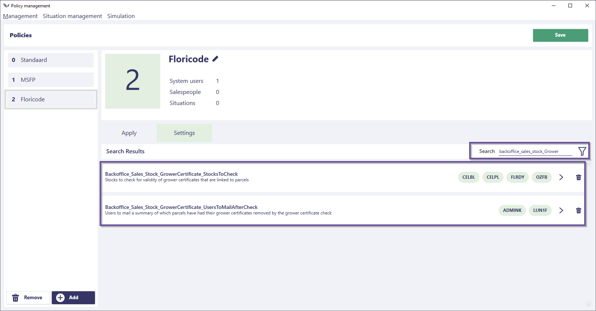
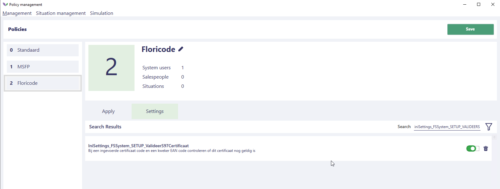
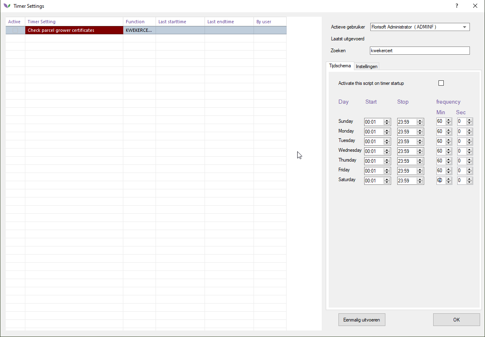
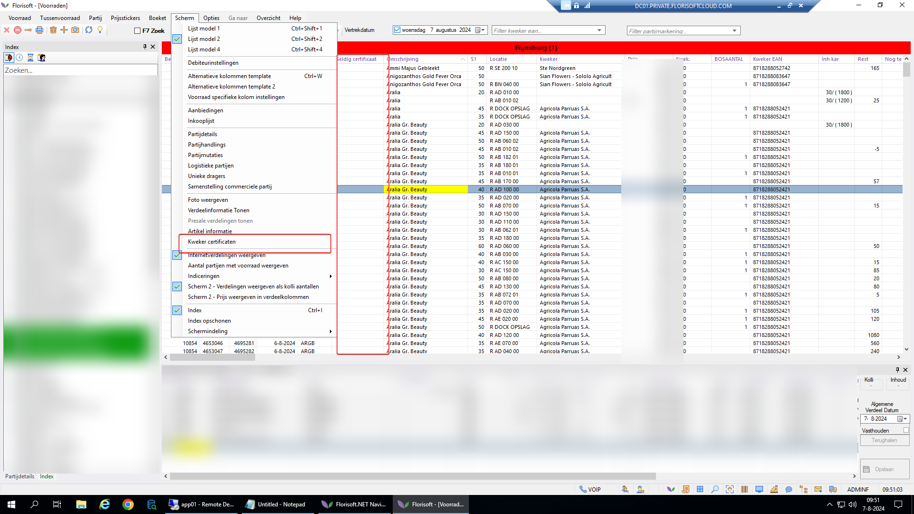

# Florisoft manual set up Floricode API

In this user manual, you will learn how to link your Floricode API subscription to Florisoft.

## Requirements

To follow the steps below, it is important that you have the following:

- Floricode API subscription
- Floricode API login credentials (username and password)

Follow the steps below:

|Step|Explanation|
|:-:|:--|
|**1**|In your Florisoft navigator, click on maintenance and then on setup system.

<b>Click here for your example!</b>

|
|**2**|Then click on the **Advanced** folder and enter the access code.

<b>Click here for your example!</b>

|
|**3**|Click in the table and press the **F3** key to search for the required settings:  **FLORICODECLIENTID**: your Floricode username  **FLORICODECLIENTSECRET**: your Floricode password.

<b>Click here for your example!</b>

|
|**4**|Fill in the settings with the corresponding values.|
|**5**|Close the setup screen.|
|**6**|Then open the timer settings (do this on the TIMER account), by right-clicking on the timer button, and then clicking on *Timer settings*.

<b>Click here for your example!</b>

|
|**7**|Use the search function to search for the timer process: **IMPORTVBNAPI**|
|**8**|Activate this timer process and ensure that it runs on a regular schedule.

<b>Click here for your example!</b>

|
|**9**|Press the **Run Once** button to retrieve the certificates. |
|**13**|**Note**! This only works if an EAN code is entered for the grower; these can then be found in the grower table where the certificates can be found.|
|**14**|Then reopen the system setup from the navigator (**maintenance→setup system**) and go to the **Advanced** folder. Then search for the setting **KWEKEREANVULLENINLEZENEKT** and set it to **True**.

<b>Click here for your example!</b>

 |
|**15**|Then reopen the constants screen and navigate to the following path: **System→Users→Policy Management**, this opens the policy screen.  Read in [this guide](https://github.com/florisoft/User.Manuals/blob/main/BASIS/Policy%20Management/Manual%20Policy%20Management%20EN.md) how to create and adjust policies.

<b>Click here for your example!</b>

 |
|**16**|Search for the setting **Backoffice_Sales_Stock_GrowerCertificate_StocksToCheck**, with this policy you specify which stocks should have the validity of certificates checked.

<b>Click here for your example!</b>

|
|**17**|The setting **Backoffice_Sales_Stock_GrowerCertificate_UsersToMailAfterCheck**, this specifies which Florisoft users should be emailed after a certificate is removed from a batch.  **Note!** This does require that an email address is set up for the relevant user.

<b>Click here for your example!</b>

||
|**18**|**Backoffice_Sales_Stock_ValidGrowerCertificate**: Because a grower may have multiple certificates, but only one can be shown in the 'Valid Certificate' column in the stock, this policy allows you to specify a hierarchy for which certificate should be displayed.

<b>Click here for your example!</b>

|
|**19**|Enable the setting **IniSettings_FSSystem_SETUP_ValideerS97Certificaat**.

<b>Click here for your example!</b>

||
|**20**|Ensure that the overarching policy object is linked to the timer user. :warning:

<b>Click here for your example!</b>

|
|**21**|On the Florisoft timer user, reopen the timer settings (right-click on the timer icon), |
|**22**|Use the search function to search for the timer process **KwekerCertificaatPartijControle**.

<b>Click here for your example!</b>

||
|**23**|Set this timer process to run regularly.

<b>Click here for your example!</b>

||
|**24**|Certificates can now be found in your system. Open the constants screen and navigate to the following path: **Organs→Grower Data→Growers**  Open a grower, and press the **Certificates** button. (bottom right)|
|**25**|Certificates can also be viewed in the stock; open a stock (in the stock screen). Right-click on a stock batch and click on the option **Grower Certificates**.

<b>Click here for your example!</b>

|
|**26**|In these screens, you can see the certificate information including the ID, and when the certificate is valid. This can also be reflected in invoice layouts. 

<b>Click here for your example!</b>

|
