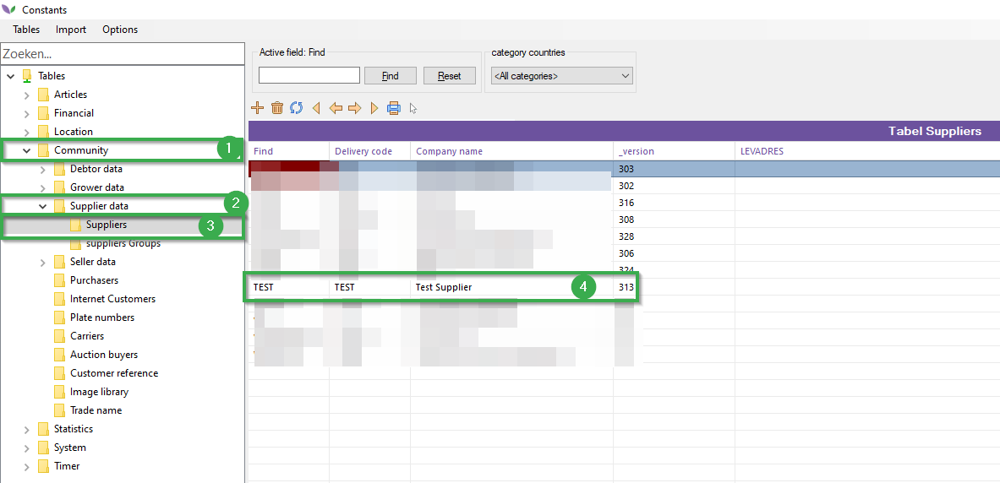
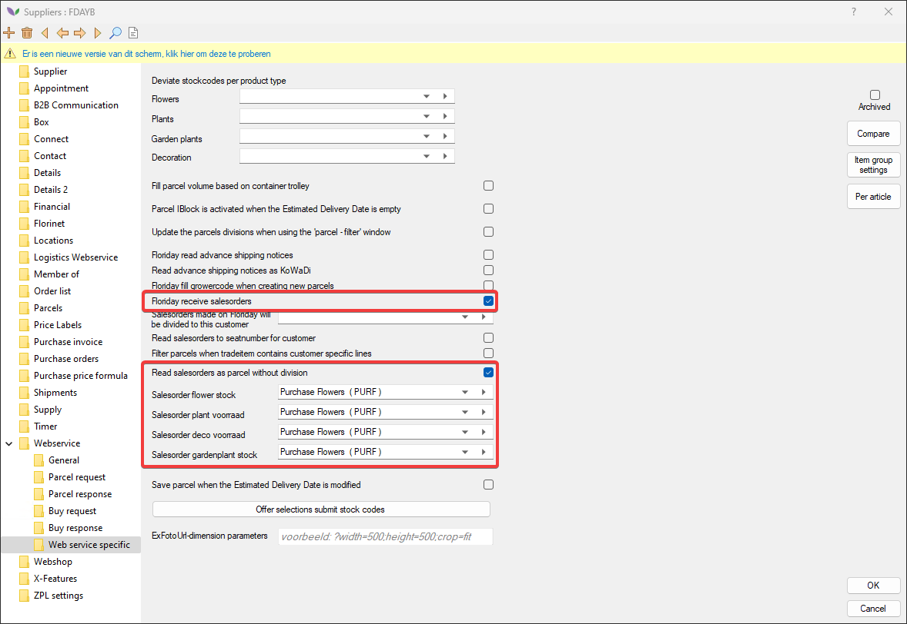
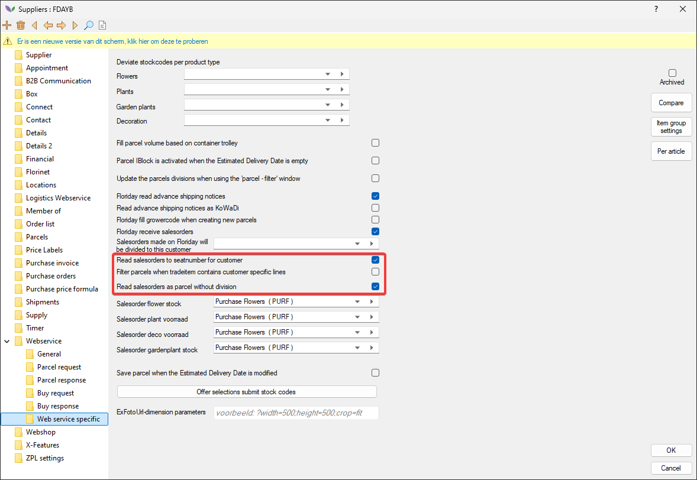

# Floriday Client Sales Orders Manual

To use this module, you will need to enable settings for each supplier.
Follow the steps below:

|Step|Explanation|
|:--|:--|
|**1**|Open the constants screen from your navigator and navigate to the following path: **Community→Supplier data→Suppliers** Then open a supplier.

<b>Click here for your example image!</b>

|
|**2**|In the supplier card, navigate to the following path (in the folder structure): **Webservice→Webservice specific**|
|**3**|Enable the setting **Floriday receive salesorders** here. (#1)

<b>Click here for your example image!</b>

|
|**4**|Enable the setting **Read salesorders as parcel without division**. This allows you to receive SalesOrders into the specified stocks below this setting.|
|**5**|Then set the stocks to which the Floriday sales orders will be read in.

<b>Click here for your example image!</b>

|
|**6**|Optional: it is also possible to have SalesOrders divided directly based on seatnumber. The seatnumber known in Floriday is sent in the nextLegIdentifier segment in the SalesOrder. Florisoft searches whether this seatnumber is known in the constants -> organs -> platenumbers and checks whether it should be divided directly to a debtor. The SalesOrder is then read into the set stocks and divided directly to that debtor. Set the stocks and enable the following options: **Read salesorders to seatnumber for customer** and the option from step 4 is required **Read salesorders as parcel without division**.

<b>Click here for an example!</b>

|
