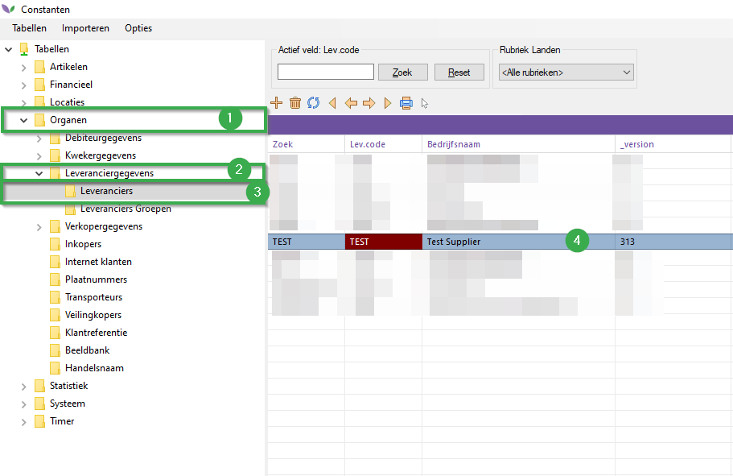
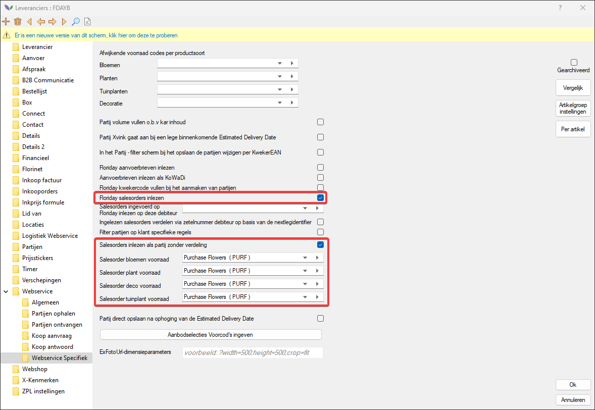
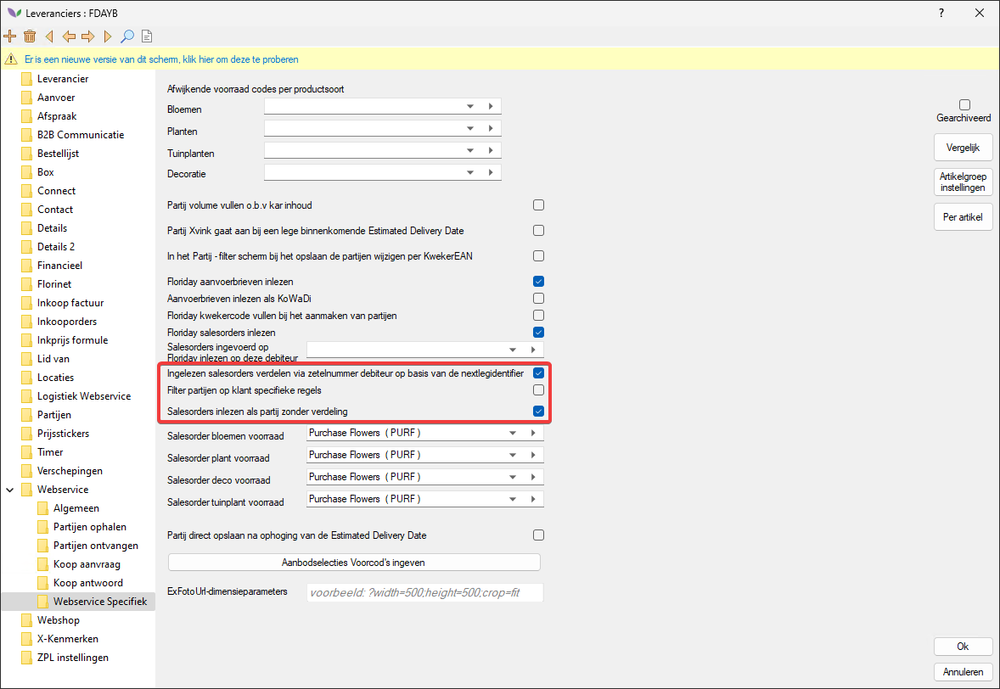

# Handleiding Floriday Client Sales Orders

Om gebruik te maken van deze module zal u per leverancier een instellingen aanzetten.
Volg hiervoor de onderstaande stappen:

|Stap|Uitleg|
|:--|:--|
|**1**|Open vanuit uw navigator het constanten scherm en navigeer naar het volgende pad:br>**Organen→Leveranciergegevens→Leveranciers** Open vervolgens een leverancier.

<b>Klik hier voor uw voorbeeld afbeelding!</b>

|
|**2**|In de leverancierkaart navigeer je vervolgens naar het volgende pad (in de mappenstructuur):<Br**>**Webservice→Webservice specifiek**|
|**3**|Zet hier de instelling **Floriday salesorders inlezen** aan. (#1)

<b>Klik hier voor uw voorbeeld afbeelding!</b>

|
|**4**|Zet hier de instelling **Salesorders inlezen als partij zonder verdeling** aan. Hiermee kun je SalesOrders inlezen in de aangegeven onderstaande voorraden.|
|**5**|Stel vervolgens de voorraden in waarop de Floriday salesorders ingelezen worden.

<b>Klik hier voor uw voorbeeld afbeelding!</b>

|
|**6**|Optioneel: het is ook mogelijk om SalesOrders direct door te laten verdelen op basis van zetelnummer. Het zetelnummer welke bekend is in Floriday wordt meegestuurd in het segment nextLegIdentifier in de SalesOrder. Florisoft zoekt of dit zetelnummer bekend is in de constanten -> organen -> plaatnummers en checked of deze direct doorverdeeld moet worden naar een debiteur. De SalesOrder wordt dan ingelezen in de ingestelde voorraden en wordt direct naar die debiteur verdeeld. Stel de voorraden in en zet hiervoor de volgende opties aan: **Ingelezen salesorders verdelen via zetelnummer debiteur op basis van de nextLegIdentifier** en de optie uit stap 4 is benodigd **Salesorders inlezen als partij zonder verdeling**.

<b>Klik hier voor uw voorbeeld afbeelding!</b>

|
