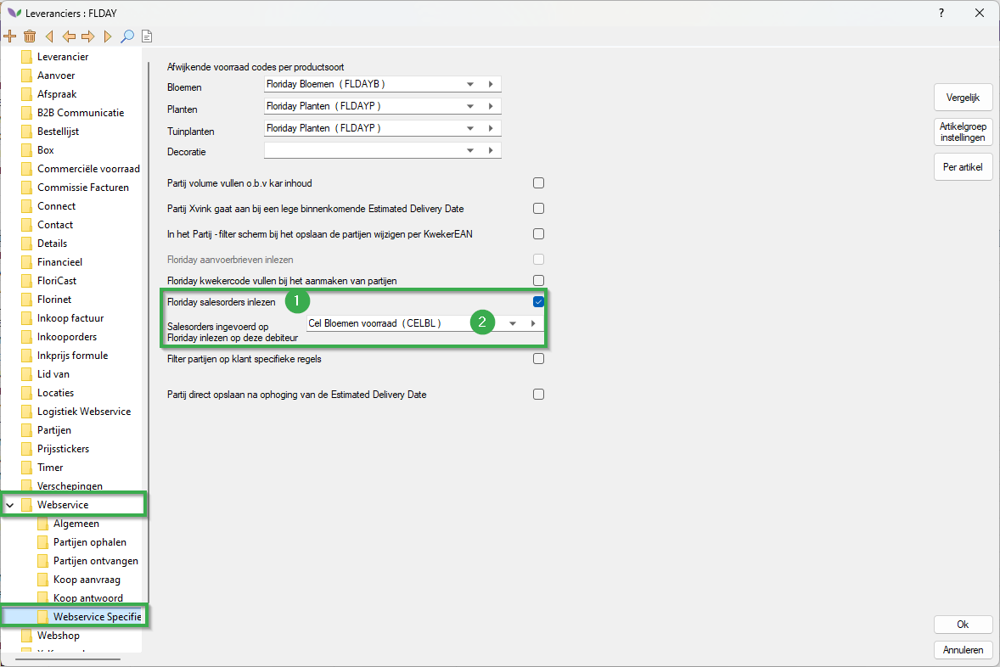

# Handleiding Floriday Client Sales Orders

Om gebruik te maken van deze module zal u per leverancier een instellingen aanzetten.
Volg hiervoor de onderstaande stappen:

|Stap|Uitleg|
|:--|:--|
|**1**|Open vanuit uw navigator het constanten scherm en navigeer naar het volgende pad:br>**Organen→Leveranciergegevens→Leveranciers** Open vervolgens een leverancier.

<b>Klik hier voor uw voorbeeld afbeelding!</b>

|
|**2**|In de leverancierkaart navigeer je vervolgens naar het volgende pad (in de mappenstructuur):<Br**>**Webservice→Webservice specifiek**|
|**3**|Zet hier de instelling **Floriday receive salesorders** aan. (#1)

<b>Klik hier voor uw voorbeeld afbeelding!</b>

|
|**4**|Stel vervolgens de debiteur in waarop de Floriday salesorders ingelezen worden.

<b>Klik hier voor uw voorbeeld afbeelding!</b>

|