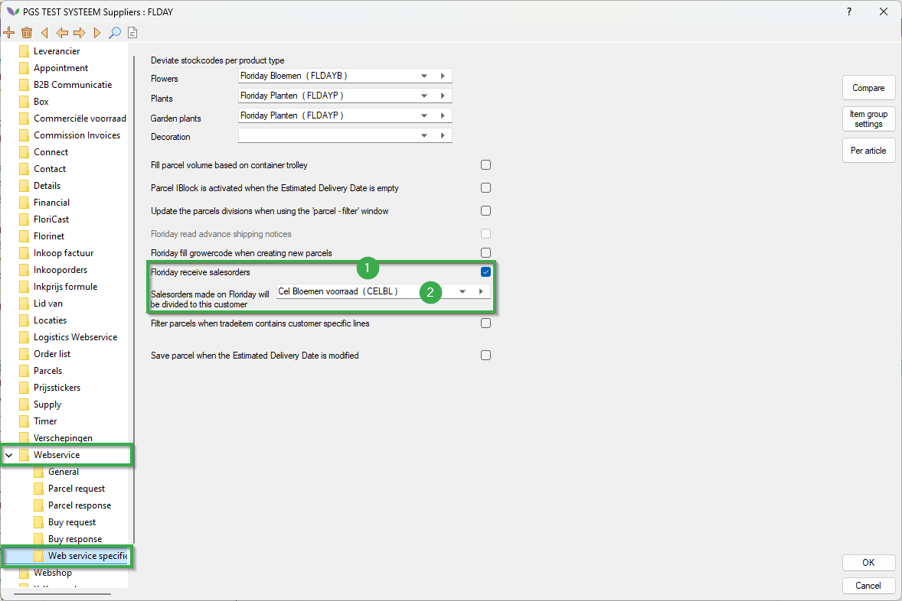

# Floriday Sales Orders Manual

To use this module, you will need to enable settings for each supplier.
Follow the steps below:

|Step|Explanation|
|:--|:--|
|**1**|Open the constants screen from your navigator and navigate to the following path: **Community→Supplier data→Suppliers** Then open a supplier.

<b>Click here for your example image!</b>

|
|**2**|In the supplier card, navigate to the following path (in the folder structure): **Webservice→Webservice specific**|
|**3**|Enable the setting **Floriday receive salesorders** here. (#1)

<b>Click here for your example image!</b>

|
|**4**|Then set the debtor to which the Floriday sales orders will be read using the setting "**Salesorders made on Floriday will be devided to this customer**" (#2).

<b>Click here for your example image!</b>

|
