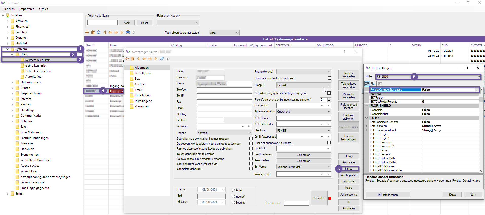
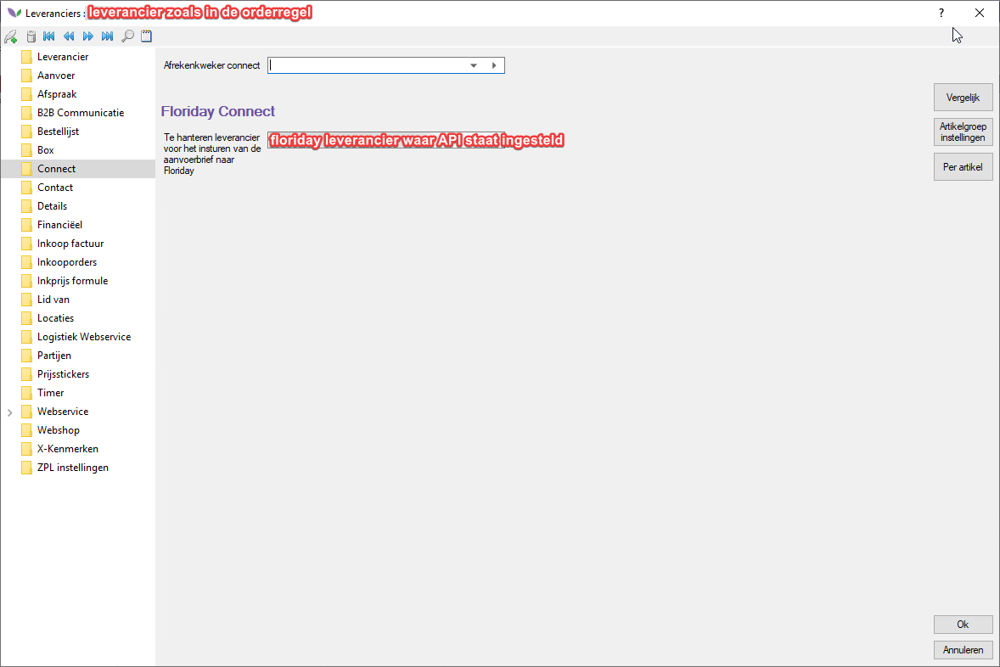
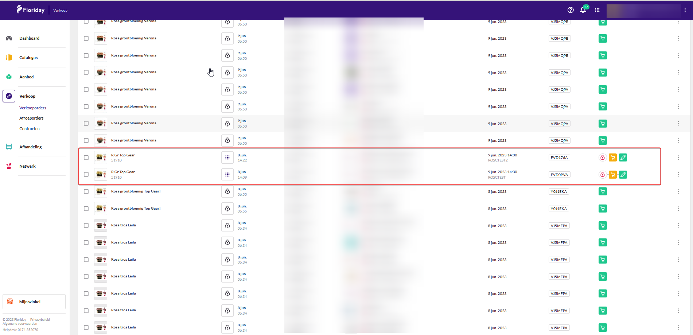
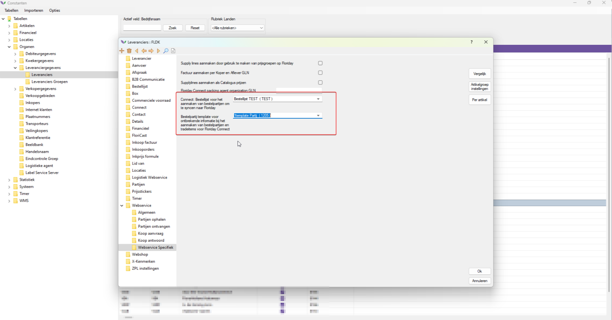

# Handleiding Floriday Connect NL - M165

Welkom bij de Floriday Connect API handleiding. Met deze module kunt u verkooporders in sturen naar Floriday via de API. In deze handleiding leest u over de benodigde instellingen en welke informatie u moet verzamelen voor het versturen van verkooporders.

## Benodigde instelling

*Om gebruik te maken van de functionaliteiten van deze module dient u de FS2000 instelling **FloridayConnectTransactie** aan te zetten op de gebruiker.  Door de onderstaande stappen te volgen leert u hoe u dit doet:*

|Stap|Uitleg|
|:-:|:--|
|**1**|Open uw constantenscherm en navigeer naar het volgende pad: **Systeem→Users→Systeemgebruikers**|
|**2**|Open een gebruiker en klik in de systeemgebruikerskaart op de knop **Inifiles**.|
|**3**|Zorg dat de dropdown het instellingenbestand **FS2000** geselecteerd heeft.|
|**4**|Zoek vervolgens naar de instelling **FloridayConnectTransactie**, dit kan u ook doen door op de F3 toets te drukken en gebruik te maken van de zoekfunctie.|
|**5**|Zet de instelling op **TRUE** en sla uw wijzigingen op.|

<b>Klik hier voor uw voorbeeld!</b>

## Benodigde informatie klaar zetten

De naar Floriday te verzenden factuur heeft een aantal informatievelden nodig voor de volledige werking. Deze module werkt op basis van het ingevulde **LEVCOD** veld in de te gebruiken orderregels.

In het geval een factuurregel een andere leverancierscode heeft dan de Floriday leverancier koppel je de Floriday leverancier aan de 'gewone leverancier. 

*U kan dit instellen door de onderstaande stappen te volgen:*

|Stap|Uitleg|
|:-:|:--|
|**1**|Open het constantenscherm en naviger naar het volgende pad: **Organen→Leveranciersgegevens→Leveranciers**|
|**2**|Open de desbetreffende leverancier en ga naar de subfolder **Connect**.|
|**3**|Gebruik de dropdown under het kopje **Floriday Connect** om de juiste afwijkende leverancier te selecteren.

<b>Klik hier voor uw voorbeeld!</b>

|

*Zorg ervoor dat de volgende informatie goed staat ingesteld:*

|Informatieveld|Waar te vinden en in te stellen|
|:-:|:--|
|**Debiteur GLN adres**|Constanten→Organen→Debiteurgegevens→Debiteuren→Debiteurkaart/Adressen: GLN Code|
|**FloridayOrganizationID**|dit is een timerproces dat u eenmaal per dag dient te draaien.|
|**Floriday Kweker API**|Constanten→Organen→Leveranciergegevens→Leveranciers→Leveranicerkaart/Webservice: Type webservice|
|**Leverancier warehouse**|Constanten→Organen→Leveranciergegevens→Leveranciers→Leveranicerkaart/Webservice: Default warehouse|
|**Debiteur aflevertijden**|Constanten→Organen→Debiteurgegevens→Debiteuren→Debiteurkaart/Internet/Webservice: Afleverlocaties, aflever- en besteltijden per weekdag|
|**Debiteur leverlocatie**|Constanten→Organen→Debiteurgegevens→Debiteuren→Debiteurkaart/Adressen/Afleveradres: GLN Code|

*Bij het correct invullen van deze informatievelden kan er per orderregel een verzoek naar Floriday worden verstuurd. De onderstaande afbeelding geeft een voorbeeld van een verstuurde orderregel in de Floriday omgeving.*

<b>Klik hier voor uw voorbeeld!</b>

## Benodige informatie op de orderregels

Voor het insturen van een aanvoerbrief op deze manier wordt de check of alle gegevens op de partijen vooraf gedaan ( in tegenstelling tot de 'oude' manier waar deze check achteraf gebeurde ( aperak/PTYVWD ). Om deze check uit te voeren hebben alle partijen die we willen afrekenen een TradeItemID nodig. Dit TradeItemID komt voort uit een bestelpartij, het komt er dus op neer dat alle factuurregels een bestelpartijnummer nodig hebben, de kolom hiervoor kun je aanzetten in het factuur wijzigen scherm.

Dit TradeItemID komt dus voort uit een bestelpartij, deze bestelpartij moet worden gesycnhroniseerd zijn naar de Catalogus op het Floriday kwekers platform. We hebben 2 manieren om een TradeItemID te verkrijgen:

Inrichten van de floriday module voor het aanbieden van partijen. Ook voor het plaatsen van aanbod op floriday is een TradeItem vereist, dit doen we door de bestellijst met aanbod open te zetten in de toegankelijke bestellijsten op de Floriday debiteur.

Wanneer je niet wilt aanbieden maar alleen wil afrekenen via Floriday kunnen we ook een TradeItem aanmaken bij het insturen van de aanvoerbrief, dit gaat als volgt:

Op de leverancier waar we de API key hebben ingevuld kun je in het tabje Webservice --> Webservice Specifiek de bestellijst aangeven waarin de bestelpartijen moeten worden aangemaakt indien ze niet bestaan. Wanneer een factuurregel nog geen bestelpartijnr heeft maken we deze hier aan en daarnaa proberen we hem meteen te synchroniseren naar Floriday om een TradeItemID te verkrijgen. Wanneer een orderregel al wel een bestelpartijnummer proberen we de partij meteen te syncen. 
Om een bestelpartij succesvol op floriday te krijgen moet de partij aan een aantal criteria voldoen:

- De partij moet een foto hebben.
- De sorteringskernmerken moeten gevuld zijn zoals verplicht volgens Floricode.
- Het aantal fusten per laag moet gevuld zijn.
- Het aantal lagen per kar moet gevuld zijn.
- Land (land van herkomst)
- Srt (kwaliteitscode)
- Omschrijving
- Fustcode (met een officiele VBN fustcode)
- Inhoud Bos
- Inhoud Fust
- Leverancier
- Op het bijbehorende artikel moet de productsoort ingevuld zijn

Let op: bunchesperpackage segment van Floriday wordt bepaald op basis van inhkolli / inhbos (en de waarde ervan moet liggen tussen 1 en 9999). Mocht je dus de volgende melding krijgen: The field BunchesPerPackage must be between 1 and 9999, dan kloppen de waardes van inhkolli en inhbos dus niet.

Het kan best voorkomen dat een partij die je probeert te syncen niet aan aan van deze criteria voldoet, voor deze situaties kunnen we een template partij invullen ook in het tabje Webservice --> Webservice Specifiek op de Floriday leverancier.
Hiervoor maak je dus een voorbeeld bestelpartij aan met daarin alle benodigde gegevens gevuld, wanneer we proberen te syncen en we missen gegevens dan zullen deze uit de template partij worden gehaald.

<b>Klik hier voor uw voorbeeld!</b>

