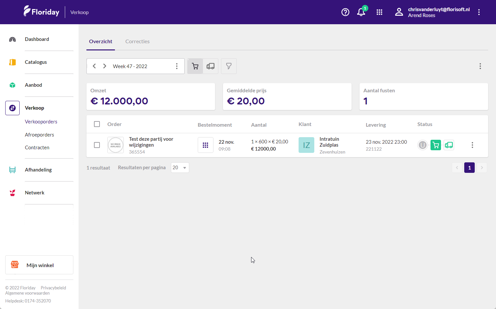

# Handleiding Floriday Connect - M165

Welkom bij de Floriday Connect API handleiding. Met deze module kunt u verkooporders in sturen naar Floriday via de API. In deze handleiding leest u over de benodigde instellingen en welke informatie u moet verzamelen voor het versturen van verkooporders.

## Benodigde instelling

*Om gebruik te maken van de functionaliteiten van deze module dient u de FS2000 instelling **FloridayConnectTransactie** aan te zetten op de gebruiker.  Door de onderstaande stappen te volgen leert u hoe u dit doet:*

|Stap|Uitleg|
|:-:|:--|
|**1**|Open uw constantenscherm en navigeer naar het volgende pad: **Systeem→Users→Systeemgebruikers**|
|**2**|Open een gebruiker en klik in de systeemgebruikerskaart op de knop **Inifiles**.|
|**3**|Zorg dat de dropdown het instellingenbestand **FS2000** geselecteerd heeft.|
|**4**|Zoek vervolgens naar de instelling **FloridayConnectTransactie**, dit kan u ook doen door op de F3 toets te drukken en gebruik te maken van de zoekfunctie.|
|**5**|Zet de instelling op **TRUE** en sla uw wijzigingen op.|

<b>Klik hier voor uw voorbeeld!</b>

## Benodigde informatie klaar zetten

De naar Floriday te verzenden factuur heeft een aantal informatievelden nodig voor de volledige werking. Deze module werkt op basis van het ingevulde **LEVCOD** veld in de te gebruiken orderregels.

In het geval een factuurregel een andere leverancierscode heeft dan de Floriday leverancier koppel je de Floriday leverancier aan de 'gewone leverancier. 

*U kan dit instellen door de onderstaande stappen te volgen:*

|Stap|Uitleg|
|:-:|:--|
|**1**|Open het constantenscherm en naviger naar het volgende pad: **Organen→Leveranciersgegevens→Leveranciers**|
|**2**|Open de desbetreffende leverancier en ga naar de subfolder **Connect**.|
|**3**|Gebruik de dropdown under het kopje **Floriday Connect** om de juiste afwijkende leverancier te selecteren.

<b>Klik hier voor uw voorbeeld!</b>

|

*Zorg ervoor dat de volgende informatie goed staat ingesteld:*

|Informatieveld|Waar te vinden en in te stellen|
|:-:|:--|
|**Debiteur GLN adres**|Constanten→Organen→Debiteurgegevens→Debiteuren→Debiteurkaart/Adressen: GLN Code|
|**FloridayOrganizationID**|dit is een timerproces dat u eenmaal per dag dient te draaien.|
|**Floriday Kweker API**|Constanten→Organen→Leveranciergegevens→Leveranciers→Leveranicerkaart/Webservice: Type webservice|
|**Leverancier warehouse**|Constanten→Organen→Leveranciergegevens→Leveranciers→Leveranicerkaart/Webservice: Default warehouse|
|**Debiteur aflevertijden**|Constanten→Organen→Debiteurgegevens→Debiteuren→Debiteurkaart/Internet/Webservice: Afleverlocaties, aflever- en besteltijden per weekdag|
|**Debiteur leverlocatie**|Constanten→Organen→Debiteurgegevens→Debiteuren→Debiteurkaart/Adressen/Afleveradres: GLN Code|

*Bij het correct invullen van deze informatievelden kan er per orderregel een verzoek naar Floriday worden verstuurd. De onderstaande afbeelding geeft een voorbeeld van een verstuurde orderregel in de Floriday omgeving.*

<b>Klik hier voor uw voorbeeld!</b>

