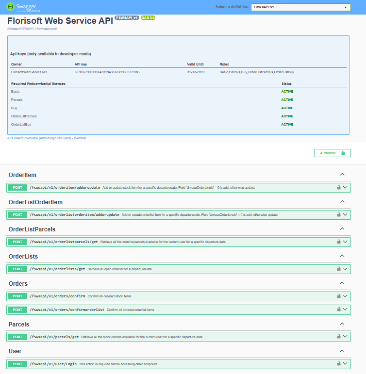
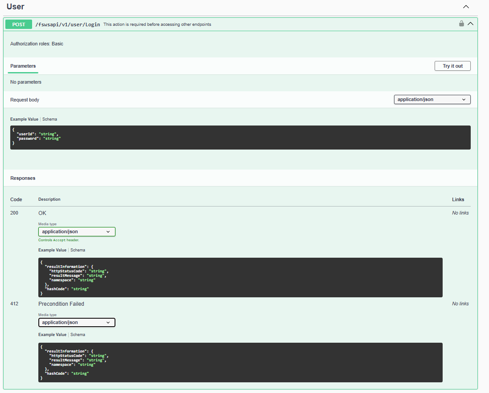
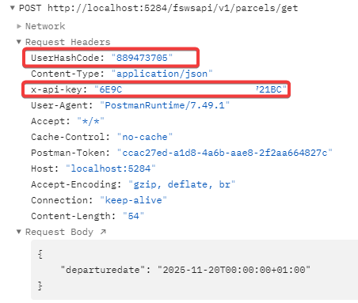
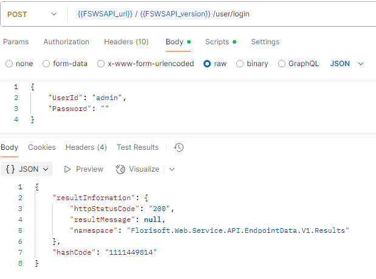
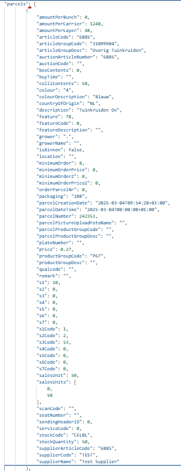
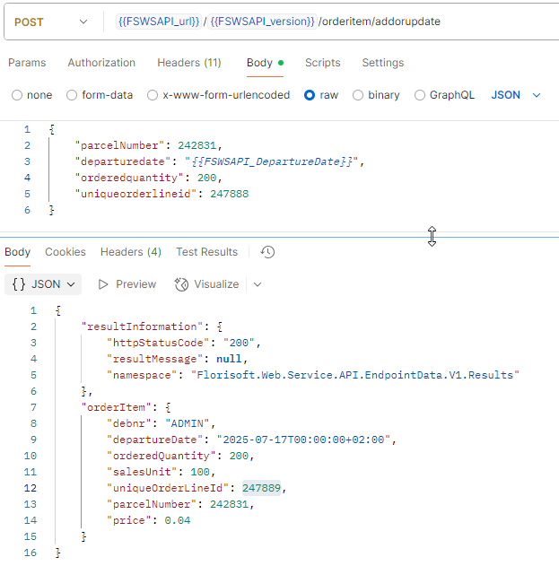
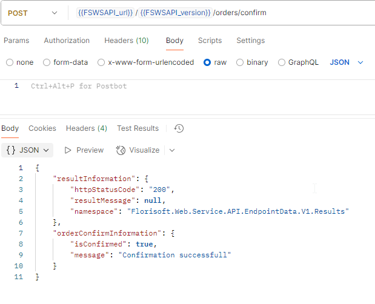
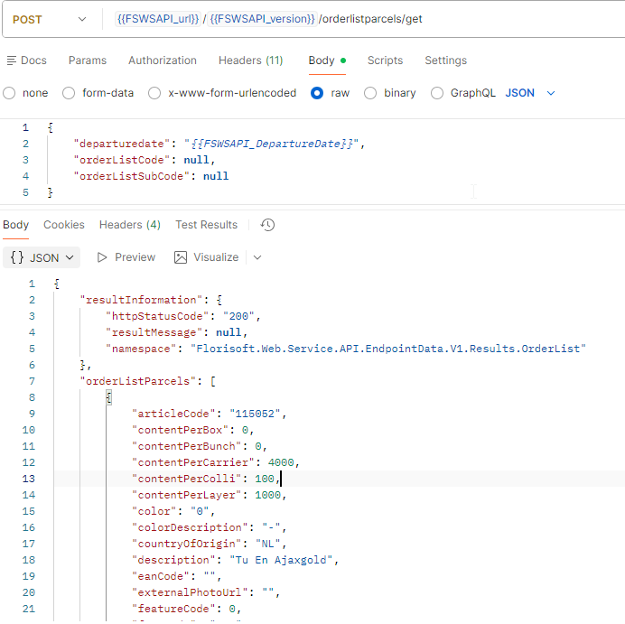
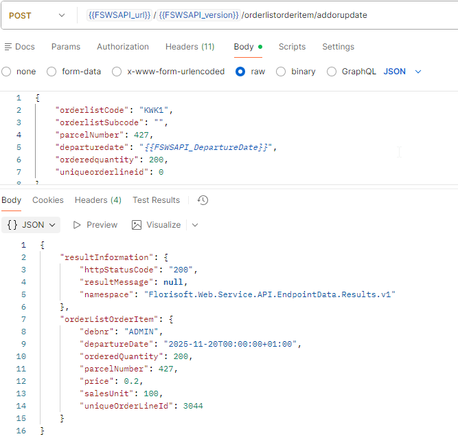
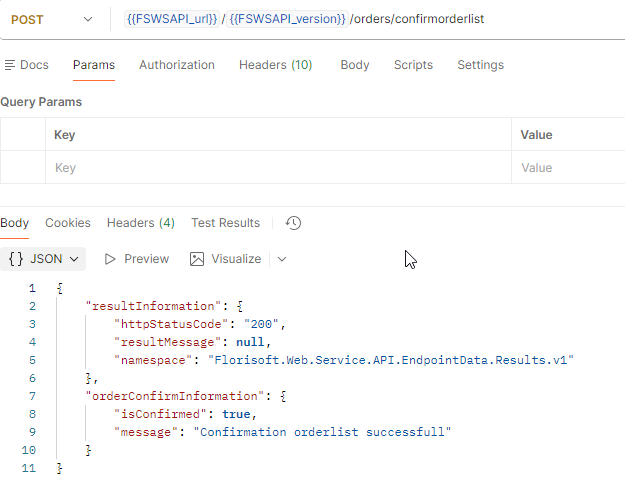

**<u>Florisoft Webservice API V1.0</u>**

# Content

[Introduction [1](#introduction)]

[Prerequisites [1](#prerequisites)]

[Swagger [2](#swagger)]

[Endpoints [3](#endpoints)]

[General use [3](#general-use)]

[User/Login [4](#userlogin)]

[Parcels/Get [5](#parcelsget)]

[OrderItem/AddOrUpdate
[8](#orderitemaddorupdate)]

[Orders/Confirm [9](#ordersconfirm)]

[OrderlistParcels/Get [10](#orderlistparcelsget)]

[OrderlistOrderItem/AddOrUpdate
[12](#orderlistorderitemaddorupdate)]

[Orders/ConfirmOrderlist
[13](#ordersconfirmorderlist)]

# Introduction

This manual provides a technical description of the Florisoft Webservice
API module. The endpoints in this API can be used to login, retrieve
parcel data, place orders, and confirm them.

# Prerequisites

-   The API is running is set up and running in a IIS environment

-   The user is setup with the proper rights to access the correct stock
    / parcels.

-   An API key is needed to access the API.

-   Per set of endpoints a license is needed.

    -   Basic: Needed for the basic working of the API(like Login)

    -   Parcels: Retrieve information about stock parcels. (optional)

    -   Buy: Buy and confirm stock items. (optional)

    -   OrderlistParcels: Retrieve information about orderlist parcels.
        (optional)

    -   OrderlistBuy: Buy and confirm orderlist items. (optional)

# Swagger

When the API is running you can browse to the root of the website and a
swagger page with all the available endpoints are shown.

Per endpoints you will find all the information needed to build the
request and also how the response will look like. Here is a screenshot
of the login endpoint:

With this interface you can, after providing the correct API KEY, test
the endpoints.

# Endpoints

## General use

In every API call the API key should be supplied in the request header
with the name “**x-api-key**”

The login endpoint should be used as the first call. After a successful
call to this endpoint the response will contain a hash code. This hash
code needs to be sent in all the subsequent endpoint calls in the
request header with the name “**UserHashCode**”

The endpoint URLs should be preceded with the correct root path.  
Let’s assume that the API is running on the localhost with port 7179
then the URL to access the login endpoint must be:
**https://localhost:7179/fswsapi/v1/user/login**

The dates that must be used in some of the endpoints should be in the
format

**"yyyy-MM-ddTHH:mm:sszzz"**

For example: 2025-07-17T00:00:00+02:00

Screenshot of a sample requestheader and requestbody

## User/Login

/fswsapi/v1/user/Login

With this endpoint you can login to the API with a user id and password
and this should be used BEFORE accessing the other endpoints.

Needed request parameters:

-   UserId

-   Password

When the login is successful the response will contain the hash code
needed in all the subsequent calls.

Reasons why the login will not succeed are:

-   The user id / password is not found of not correct.

-   The user is blocked for delivery (LEVSTOP)

-   The user has no access to the webservice API (TOEGANGWS)

## Parcels/Get

/fswsapi/v1/parcels/get

With this endpoint you can retrieve of the stock parcels available for
this user and for the provided departure date.

Needed requestbody parameter:

-   DepartureDate (use the format as described in General Use)

The response will contain a complete collection of parcels available for
this user. When no parcel is available, then this collection is empty.

All the fields in a stock parcel response:

## OrderItem/AddOrUpdate

/fswsapi/v1/orderitem/addorupdate

With this endpoint you can add, change or remove ordered stock items.

Needed requestbody parameters:

-   ParcelNumber

-   DepartureDate (use the format as described in General Use)

-   OrderedQuantity

-   UniqueOrderLineId

The parcelNumber should be filled with the ParcelNumber returned in the
parcels/Get response

The UniqueOrderLineId should be filled with 0 when the item is first
ordered. For every change of this item the UniqueOrderLineId should be
filled with the value returned in the addorupdate response.

## Orders/Confirm

/fswsapi/v1/orders/confirm

With this endpoint you will confirm all the ordered stock items

## OrderlistParcels/Get

/fswsapi/v1/orderlistparcels/get

With this endpoint you can retrieve of the orderlist parcels available
for this user and for the provided departure date.

Needed requestbody parameter:

-   DepartureDate (use the format as described in General Use)

The response will contain a complete collection of parcels available for
this user. When no parcel is available, then this collection is empty.

All the fields in a orderlist parcel response:

## OrderlistOrderItem/AddOrUpdate

/fswsapi/v1/orderlistorderitem/addorupdate

With this endpoint you can add, change or remove order items.

Needed requestbody parameters:

-   OrderlistCode

-   OrderlistSubcode

-   ParcelNumber

-   DepartureDate (use the format as described in General Use)

-   OrderedQuantity

-   UniqueOrderLineId

The OrderlistCode should be filled with the OrderlistCode returned in
the orderlistparcels/Get response.

The OrderlistSubcode should be filled with the OrderlistSubCode returned
in the orderlistparcels/Get response.

The parcelNumber should be filled with the ParcelNumber returned in the
orderlistparcels/Get response.

The UniqueOrderLineId should be filled with 0 when the item is first
ordered. For every change of this item the UniqueOrderLineId should be
filled with the value returned in the addordupdate response.

## Orders/ConfirmOrderlist

/fswsapi/v1/orders/confirmOrderlist

With this endpoint you will confirm all the ordered orderlist items

