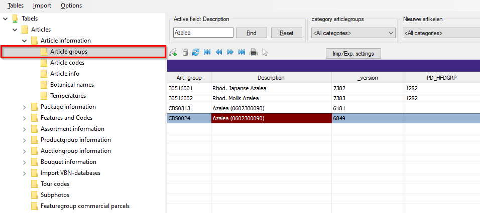
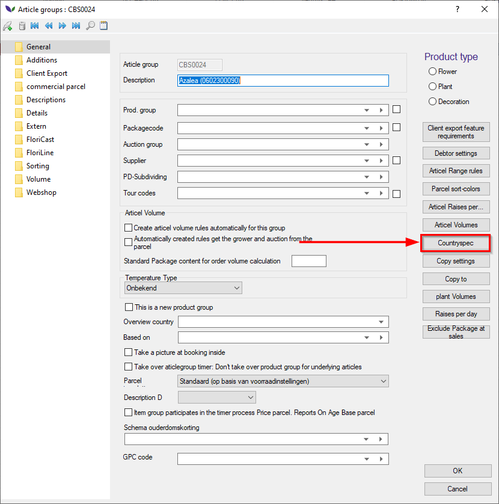

# **Florisoft Export Multi User Manual**

Welcome to the Florisoft manual for the Export Multi User module. This module is required when you export your product to other countries. The module Export contains all the required information which you have to send to the CBS (Statistics the Netherlands) and the Bedrijfsschap (The Dutch Agricultural Wholesale Board/Flowers and Plants). Besides sending the required documents, the module Export contains the possibility to accomplish your ICT declaration and creating your PD forms (Plant Protection Service of the Netherlands). 

The manual will contain multiple chapter explaining the different aspects of the Export module. Starting with chapter 1, where the breakdown of product groups will be explained.

## 1 Product breakdown
You can set various breakdowns per productgroup per country. You must create a separate invoice breakdown for this per country that you want to break down. 

In this example we split Azalea with the country of origin Turkey from other countries of origin.

Start by accesing the Florisoft application and navigate to Constants -> Statistics -> Invoice Split codes. In this case there already is a Azalea in the system. Now add a new splitcode for Azalea Turkey by pressing the feather on top of the screen. Except for the splitcode and description, all other values should be the same as the original"

You can now indicate a split code per article group, per country of origin. Navigate to Constants -> Articles -> Article information -> Article groups. Now find and dubble click on the corresponding article group.

Once in the next screen press the "Countryspec" button.

Here are already split codes. To be able to split per country of origin, we have to click on the detail button. This way you can indicate per country how the articles should be divided. NOTE: Before you press the detail button, you must select the country you want to set it for. In the example above, we open a detail screen of the Netherlands.

Type the splitcode you have made behind the country of origin. In this example we have made an extra splitcode for the Azalea Turkey which we would like to split.

Now, when Azaleas will be distributed to a debtor and there is a batch with Azaleas with country of origin Turkey, they will be split on the invoice.

## ICT Declaration
In order to make your declaration, a few things should be set straight.

From the Florisoft Navigator, head to ICT Declaration.

Fill in the start and end date (nr.1).

Select the type of administration (nr.2) and the country (nr.3).

Also enter the corresponding debtor (nr.4).

You can also choose between standard export and King export (nr.5). If you select the King export, you can select the export folder wehere the file will ba saved. If you choose to keep the standard export, Florisoft will ask you in what way you wish to download the declaration. Select your preffered way.

## PD Forms
