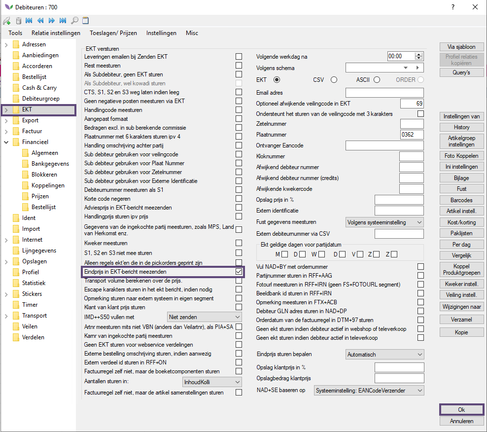
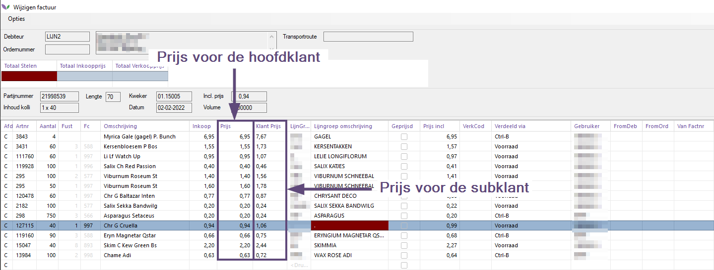
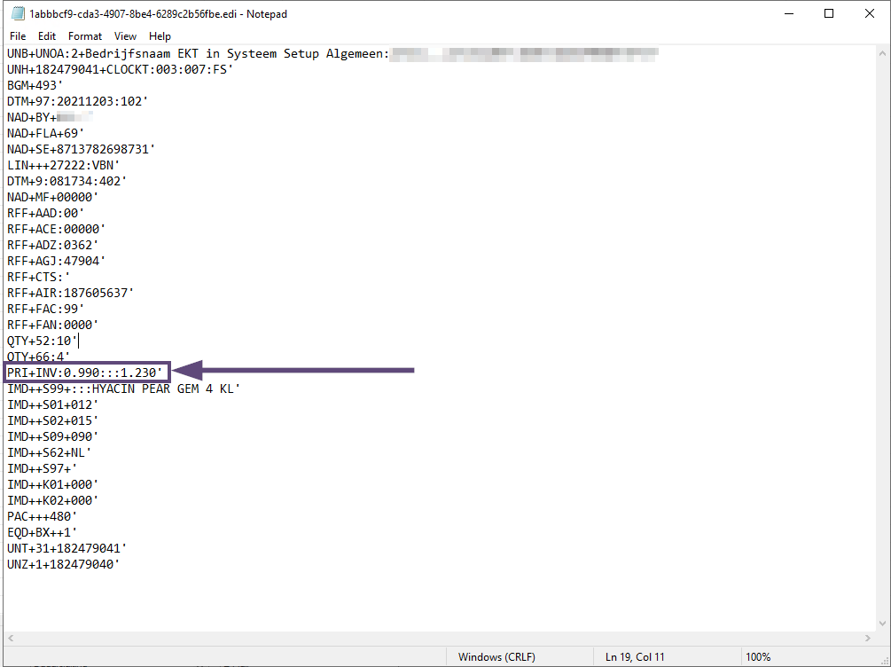

# Handleiding EKT End-Customer Prices Server M66

## Inhoud
[Inleiding](#1-inleiding)
[Debiteurinstelling activeren](#2-debiteurinstelling-activeren)
[Verdelen met eindprijzen subklanten](#3-verdelen-met-eindprijzen-subklanten)

## 1. Inleiding
In deze handleiding wordt de (technische) werking van de module EKT eindprijzen (server kant) beschreven. De focus ligt in dit document voornamelijk op de logica van deze module.

Veel webshops worden door hoofdklanten gebruikt die daarachter hun eigen automatisering hanteren. Zowel de systemen van de hoofd- als de subklant moeten worden voorzien van correcte informatie, met name eindprijsinformatie voor de subklant. De module EKT eindprijzen server maakt dit mogelijk.

## 2. Debiteurinstelling activeren
Om ervoor te zorgen dat de uitgerekende prijs (via de prijsconfiguratie) voor de eindklant wordt verstuurd in de EKT dient het vinkje Eindprijs in EKT-bericht meezenden geactiveerd te worden. Zie onderstaand screenshot:

<b>Klik hier voor de voorbeeld foto</b>

&nbsp;

>**Let op: het vinkje Eindprijs in EKT-bericht meezenden moet alleen geactiveerd worden voor de hoofdklanten. Op de subklanten moet dit vinkje niet aan staan.**

Klik op de knop Ok in het debiteurenscherm om bovenstaande instelling te activeren.

>**Let op: herstart eventuele webshop(s) om bovenstaande instellingen te activeren.**

## 3. Verdelen met eindprijzen subklanten

Verdelen kan in Florisoft op verschillende manieren: vanuit de voorraad, Ctrl+B, Televerkoop en webshop. Onafhankelijk van het verdeeltype worden de prijzen voor zowel de hoofd als de subklant uitgerekend aan de hand van de ingestelde prijsconfiguratie.

Zie onderstaand screenshot voor een voorbeeld van een factuurregel van een hoofdklant waarbij de eindprijs voor de subklant wordt weergegeven in de kolom Klantprijs. De prijs voor de hoofdklant is zichtbaar in de kolom Prijs.

<b>Klik hier voor de voorbeeld foto</b>

Bij het versturen van de betreffende factuurregels middels EKT ziet dit er als volgt uit:

<b>Klik hier voor de voorbeeld foto</b>

Duidelijk is te zien dat het PRI+INV segment uit twee segmenten bestaat: de prijs voor de hoofdklant (0,99 in bovenstaand voorbeeld) en 1,23 voor de eindklant.

Op het momement dat het systeem van de hoofdklant correct geconfigureerd is voor het inlezen van deze prijzen kan hij bovenstaande informatie gebruiken voor het automatisch verwerken van orders inclusief de verdere financiele afhandeling.

Bovenstaande zes stappen hebben globaal de logica achter de module EKT eindprijzen server beschreven.
