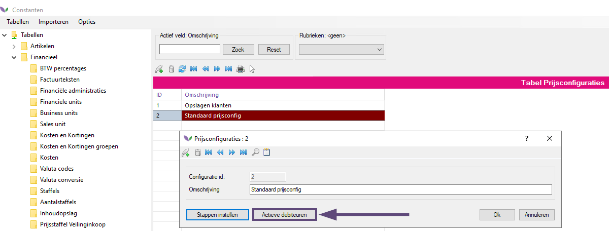
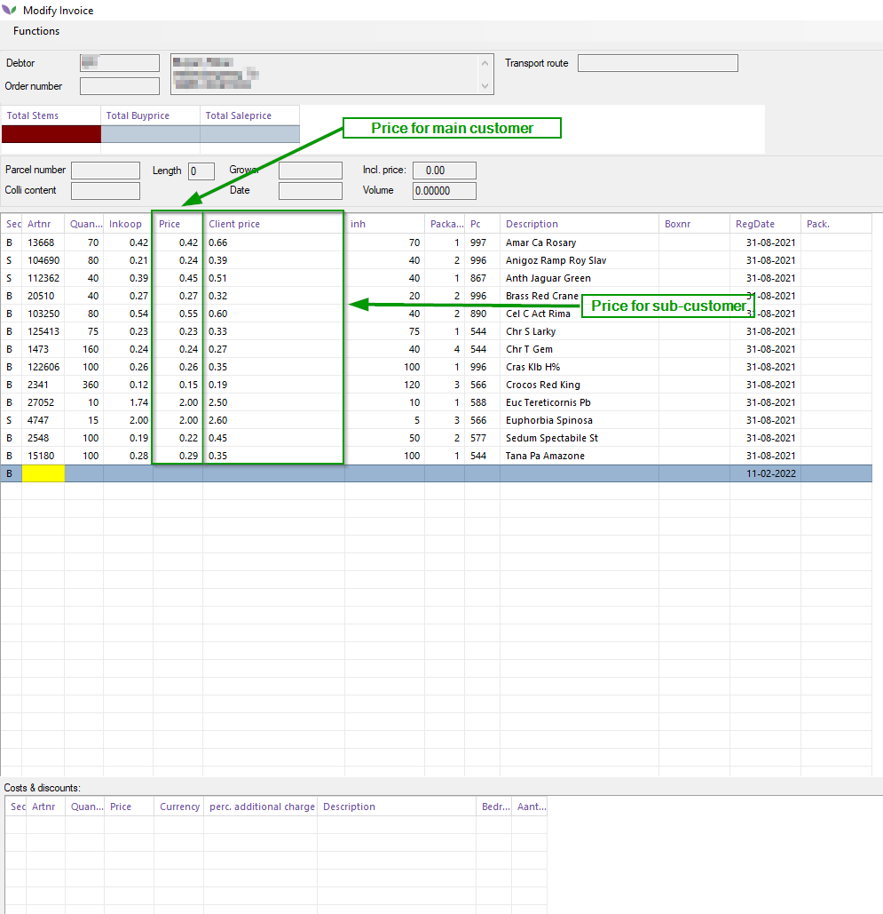
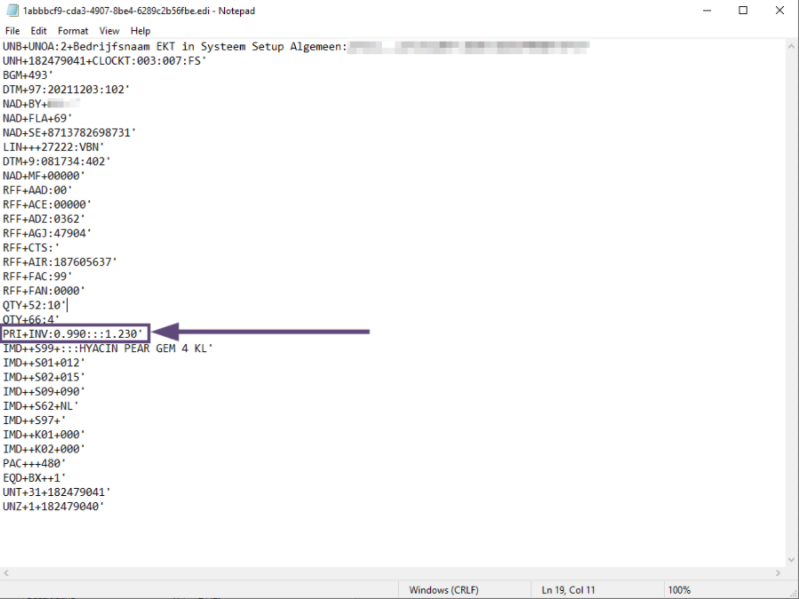

# Documentation EKT final prices Server

## Table of Contents
[Introduction](#1-introduction)
[Activate debtor setting](#2-activate-debtor-setting)
[Divide with final prices sub-customers](#3-divide-with-final-prices-sub-customers)

## 1. Introduction
This manual describes the (technical) operation of the EKT end prices module 9serverside). The focus in this document is mainly on the logic of this module.

Many webshops are used by main customers who use their own automation behind it. Both the main and sub-customer systems must be provided with correct information. especially final price information for the sub-customer. The EKT final prices server module makes this possible.

## 2. Activate debtor setting
To ensure that the calculated price (via the price configuration) for the end customer is sent in the EKT, the Send final price in EKT message must be checked on. See the screenshot below:

<b>Click here for the example picture</b>

&nbsp;.

>**Note: the Send final price in EKT message must only be activated for the main customers. This check should not be checked on the sub-customers.**

Click the Ok button in the debtor screen to activate the above setting. 

>**Note: restart any webshop(s) to activate the above settings.**

## 3. Divide with final prices sub-customers

Distribution can be done in Florisoft in different ways: from stock, Ctrl+B, Telesales and webshop. Regardles of the distribution type, the prices for both the main and the sub-customer are calculated on the basis of the set price configuration.

See the screenshot below for an example of a main customer invoice line where the final price for the sub-customer is displayed in the Client Price column. The price for the lead customer is vivisble in the Price column.

<b>Klik hier voor de voorbeeld foto\</b>

When sending the relevant invoice lines via EKT, this looks like this:

<b>Klik hier voor de voorbeeld foto\</b>

It can be clearly seen that the PRI+INV segment consists of two segments: the price for the main customer (0.99 in the example above) and 1.23 for the end customer.

As soon as the main customer's system is correctly configured for reading these prices, he can use the above information for the automatic processing of orders including further financial settlement.

The above six steps have broadly described the logic behind the EKT server end prices module.
