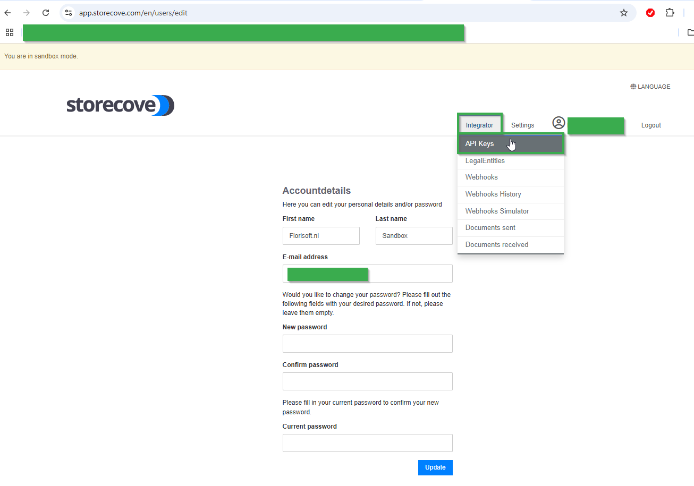
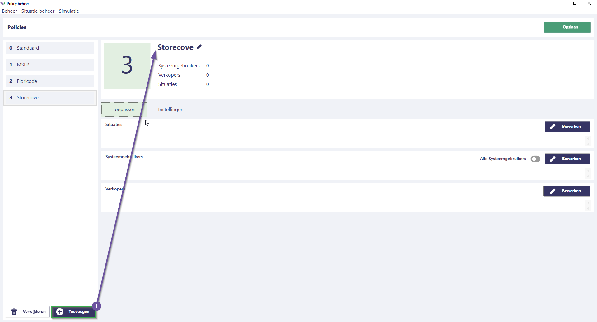
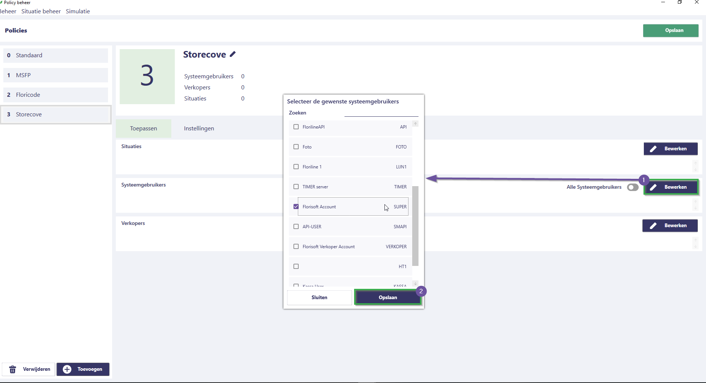
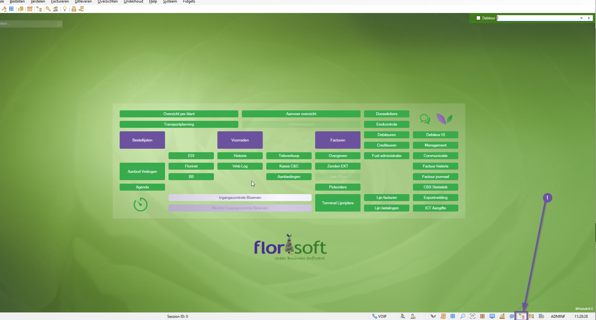
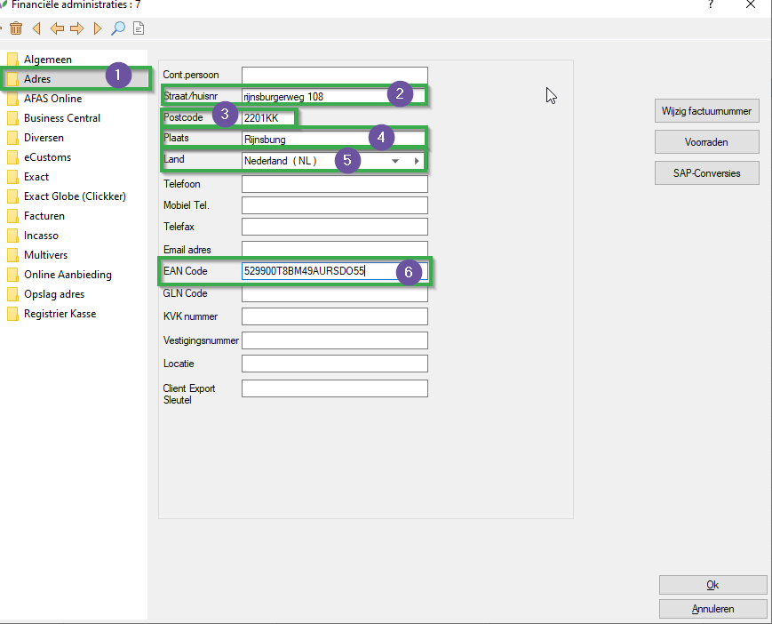
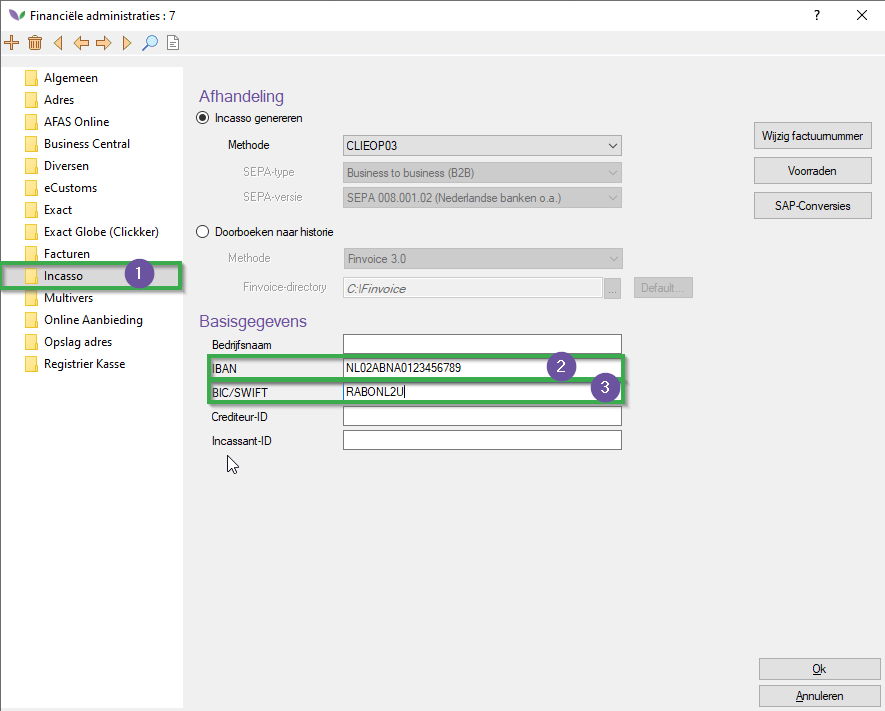
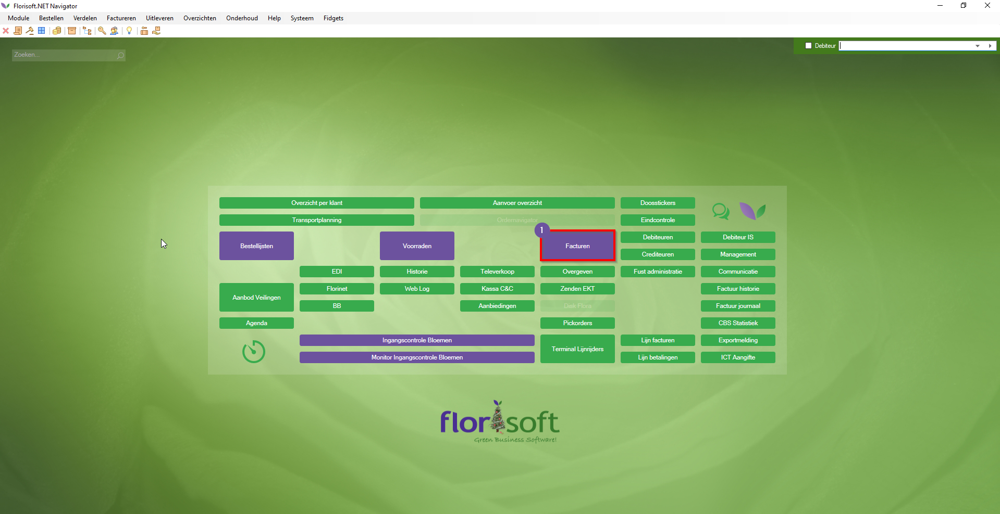

# Florisoft Handleiding External E-Invoicing (StoreCove) - M227

:warning: **Deze module is in ontwikkeling en moet nog verder worden getest om mogelijke fouten te voorkomen. Wees daarom voorzichtig!** :warning:

Welkom bij de handleiding voor External E-invoicing via StoreCove. Deze module biedt u de mogelijkheid om facturen te versturen via de externe partij StoreCove.  

In deze handleiding leest u hoe u uw StoreCove-account koppelt aan uw Florisoft ERP-backofficepakket via een policy, welke gegevens verplicht zijn voor het exporteren naar StoreCove en hoe u facturen exporteert vanuit het Florisoft Factuurscherm. 

## Benodigdheden

**Voordat u begint met de handleiding, is het belangrijk om na te gaan of u over de volgende zaken beschikt:**

* Een StoreCove-account (abonnement).
* De Florisoft-module **External E-Invoice Providers**. U kunt dit controleren door in uw navigator op het Florisoft-logo te klikken, vervolgens op de moduleknop te klikken en te controleren of de module **External E-Invoice Providers** een vinkje heeft.

## Vinden van de API-key op de accountpagina van StoreCove

:warning: **Let op: dit gedeelte kan verouderd zijn. StoreCove kan de website wijzigen, waardoor de API-key mogelijk elders vermeld staat.**

| Stap | Uitleg |
|:-:|:--|
| **1** | Ga naar uw StoreCove-account. Klik op de **Integrator**-header in uw accountpagina en vervolgens op **API Keys**. 

<b>Klik hier voor een voorbeeld!</b>

 |
| **2** | U wordt nu doorgestuurd naar de pagina: https://app.storecove.com/en/api_keys. Kopieer de API-key van deze pagina door op het klembord-icoon te klikken. Houd de API-key beschikbaar; deze heeft u nodig bij de volgende stappen. 

<b>Klik hier voor een voorbeeld!</b>

 |

## Instellen van de API-key in de policies

**Volg de onderstaande stappen:**

| Stap | Uitleg |
|:-:|:--|
| **1** | Open het constantenscherm via het navigatorscherm. 

<b>Klik hier voor een voorbeeld!</b>

 |
| **2** | Navigeer in het constantenscherm naar het volgende pad: **Systeem → Users → Policybeheer** |
| **3** | Maak hier een nieuwe policy aan en geef deze een passende naam. 

<b>Klik hier voor een voorbeeld!</b>

 |
| **4** | Wijs de policy toe aan de relevante systeemgebruikers met de **Bewerken**-knop en klik daarna op **Opslaan**. 

<b>Klik hier voor een voorbeeld!</b>

 |
| **5** | Gebruik de zoekfunctie om te zoeken naar de policy: **StoreCove**.  U krijgt de instelling: **Backoffice_Financial_Invoicing_InvoiceExport_Storecove_ApiKey**.  Vul bij deze policyinstelling de API-key in. 

<b>Klik hier voor een voorbeeld!</b>

 |
| **6** | Sla vervolgens de policy op door op de **Opslaan**-knop te klikken. |
| **7** | Wilt u meer weten over hoe policies werken en hoe u deze instelt? Raadpleeg dan de [Policy-handleiding](https://github.com/florisoft/User.Manuals/blob/main/BASIS/Policy%20Management/Handleiding%20Policy%20Management%20NL.md).

## Benodigde instellingen

De onderstaande subkoppen betreffen instellingen die moeten worden geconfigureerd voor <u>alle</u> relevante financiële administraties en debiteuren. Om een goede werking te waarborgen, is het belangrijk dat deze gegevens bij iedere debiteur en financiële administratie worden ingevuld.

### Financiële administraties

| Stap | Uitleg |
|:-:|:--|
| **1** | Open het constantenscherm (indien u dit nog niet had geopend). 

<b>Klik hier voor een voorbeeld!</b>

 |
| **2** | Navigeer in het constantenscherm naar: **Financieel → Financiële administraties**. 

<b>Klik hier voor een voorbeeld!</b>

 |
| **3** | Open een relevante financiële administratie. |
| **4** | Vul onder het tabblad **Algemeen** de volgende velden in:  - Bedrijfsnaam - BTW-nummer (moet overeenkomen met het **land** bij adresgegevens). 

<b>Klik hier voor een voorbeeld!</b>

 |
| **5** | Vul onder het tabblad **Adres** de volgende velden in:  - Straat - Plaats - Postcode - Land - EAN-code (**Let op:** Hier moet het StoreCove LegalEntityId worden ingevoerd. In de toekomst kan dit mogelijk een apart veld worden.) 

<b>Klik hier voor een voorbeeld!</b>

 |
| **6** | Vul onder het tabblad **Incasso** de volgende velden in:  - IBAN - BIC/SWIFT (wordt gebruikt voor identificatie van de administratie). 

<b>Klik hier voor een voorbeeld!</b>

 |

### Debiteuren

| Stap | Uitleg |
|:-:|:--|
| **1** | Open het constantenscherm (indien u dit nog niet had geopend). 

<b>Klik hier voor een voorbeeld!</b>

 |
| **2** | Navigeer in het constantenscherm naar: **Organen → Debiteurgegevens → Debiteuren**. 

<b>Klik hier voor een voorbeeld!</b>

 |
| **3** | Vul onder het tabblad **Adres** de volgende velden in:  - Bedrijfsnaam - Straat - Plaats - Postcode - Land

<b>Klik hier voor een voorbeeld!</b>

 |
| **4** | Vul onder het tabblad **Financieel** de volgende velden in:  - BTW-nummer debiteur (**Let op:** dit moet overeenkomen met het land ingevuld onder **Adres**).

<b>Klik hier voor een voorbeeld!</b>

|
| **5** | Sla de wijzigingen op. |

## Exporteren van facturen naar StoreCove

Volg hiervoor de onderstaande stappen: 

| Stap | Uitleg |
|:-:|:--|
| **1** | Open het facturenscherm via de Florisoft-navigator door op de **Facturen**-knop te drukken. 

<b>Klik hier voor een voorbeeld!</b>

 |
| **2** | Klik onder het tabblad **Export** in de functiebalk bovenin op de functie **Exporteer naar StoreCove** in het optiemenu. |

Dit proces kan even duren. U ziet mogelijk een laadscherm, wat normaal is. Het verwerken van een gemiddeld bericht duurt ongeveer 3-5 seconden.
