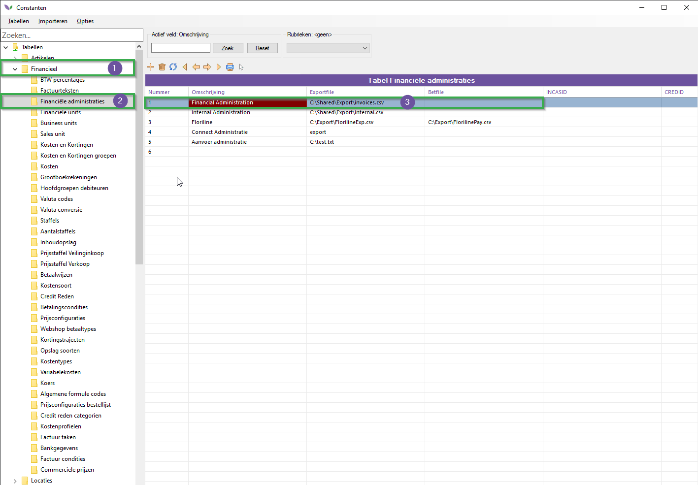
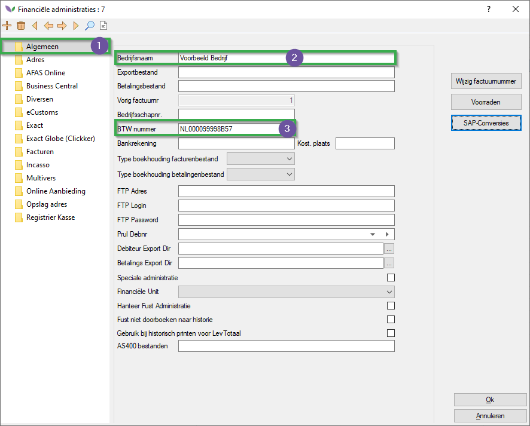

# Florisoft Handleiding External E-Invoicing (StoreCove) - M227

:warning: **Deze module is in ontwikkeling, en moet nog verder doorgetest worden voor het voorkomen van eventuele fouten, wees daarom voorzichtig!** :warning:

Welkom bij de handleiding voor External E-invoicing via StoreCove. Deze module geeft u de mogelijkheid om facturatie te doen via de externe partij StoreCove.  

In deze handleiding leest u hoe u uw StoreCove account koppelt aan uw Florisoft ERP backoffice pakket via een policy, welke gegevens verplicht zijn voor het exporteren naar StoreCove en hoe u vanuit het Florisoft Factuurscherm facturen exporteert. 

## Benodigdheden

**Voordat u begint met het volgen van de handleiding is het belangrijk om na te gaan dat u beschikt over de volgende items :**

* StoreCove account (abbonement)

* De Florisoft module **External E-Invoice providers**, u kan dit checken door in uw navigator op het Florisoft logo te klikken, dan op de modulen knop en vervolgens te checken of de module **External E-Invoice providers** een vinkje heeft.

## Vinden van de API-key op de account pagina van StoreCove

:warning: **Let op: dit stuk kan veroudert zijn, Storecove kan de site veranderen waardoor de API-key wellicht ergens anders vermeld staat**

|Stap|Uitleg|
|:-:|:--|
|**1**|Ga naar uw StoreCove account, in uw account pagina klik op de **Integrator** header en klik op **API Keys**.

<b>Klik hier voor uw voorbeeld!</b>

|
|**2**|U wordt nu gebracht naar de pagina : https://app.storecove.com/en/api_keys , kopieër de API-key van deze pagina aan de hand van het klembord icoon. Houd de API-key vast op uw klembord deze is straks nodig bij de volgende stappen.

<b>Klik hier voor uw voorbeeld!</b>

|

## Instellen van de API-key onder de policies

**Volg de onderstaande stappen :**

|Stap|Uitleg|
|:-:|:--|
|**1**|Open het constantenscherm vanuit het navigatorscherm.

<b>Klik hier voor uw voorbeeld!</b>

|
|**2**|In het constantenscherm navigeert u naar het volgende pad : **Systeem→Users→Policy beheer**|
|**3**|Maak hier een nieuwe policy aan geef dit een passende naam:

<b>Klik hier voor uw voorbeeld!</b>

|
|**4**|Wijs de policy vervolgens toe aan de relevante systeemgebruikers door middel van de **Bewerken** knop en druk daarna op **opslaan**.

<b>Klik hier voor uw voorbeeld!</b>

|
|**5**|Gebruik vervolgens de zoekfunctie om te zoeken naar de policy: **Storecove**  U krijgt vervolgens de instelling : **Backoffice_Financial_Invoicing_InvoiceExport_Storecove_ApiKey**  Vul bij deze policy instelling vervolgens de API-key in.

<b>Klik hier voor uw voorbeeld!</b>

|
|**6**|Sla vervolgens de policy op door op de **Opslaan** knop te klikken.|
|**7**|Wilt u meer weten over hoe policies werken en u deze instelt kunt u deze handleiding raadplegen [Policy handleiding](https://github.com/florisoft/User.Manuals/blob/main/BASIS/Policy%20Management/Handleiding%20Policy%20Management%20NL.md):

## Benodigde instellingen

De ondestaande subkoppen betreffen instellingen die ingesteld moeten worden voor <u>alle</u> relevante financiële administraties en debiteuren. Om een goede werking te waarborgen is het belangrijk dat dit bij elke debiteur en financiële administratie wordt ingevuld.

### Financiële administraties

|Stap|Uitleg|
|:-:|:--|
|**1**|Open het constanten scherm (indien u deze nog niet geopend had).

<b>Klik hier voor uw voorbeeld!</b>

|
|**2**|In het constantenscherm navigeert u naar: **Financieel→Financiële administraties**

<b>Klik hier voor uw voorbeeld!</b>

|
|**3**|Open vervolgens een relevante Financiële administratie. |
|**4**|Onder het tabje **algemeen** dient u de volgende invoervelden te hebben ingevuld:   - Bedrijfsnaam - BTW-nummer (moet pasen bij het **land** bij adresgegevens)

<b>Klik hier voor uw voorbeeld!</b>

|
|**5**|Navigeer naar het tabje **Adres**, hier dient u de volgende invoervelden te hebben ingevuld:  - Straat - Plaats - Postcode - Land - EAN-code (**Let op:** Hier moet het Storecove LegalEntityId ingevoerd worden. In de toekomst kan/zal dit wellicht een apart veld worden.)

<b>Klik hier voor uw voorbeeld!</b>

|
|**6**|Navigeer naar het tabje **Incasso**, hier dient u de volgende invoervelden te hebben ingevuld:  - IBAN - BIC/SWIFT (Dit wordt gebruikt ter identificatie van de administratie.)

<b>Klik hier voor uw voorbeeld!</b>

|

### Debiteuren

|Stap|Uitleg|
|:-:|:--|
|**1**|Open het constanten scherm (indien u deze nog niet geopend had).

<b>Klik hier voor uw voorbeeld!</b>

|
|**2**|In het constantenscherm navigeert u naar: **Organen→Debiteurgegevens→Debiteuren**

<b>Klik hier voor uw voorbeeld!</b>

|
|**3**|Navigeer naar het tabje **Adres**, hier dient u de volgende invoervelden te hebben ingevuld:  - Bedrijfsnaam - Straat - Plaats - Postcode - Land|
|**4**|Navigeer naar het tabje **Financieel**, hier dient u de volgende invoervelden te hebben ingevuld:  - BTWnr debiteur (**let op:** dit moet passen bij het land ingevuld onder **adres**)|
|**5**|Sla de wijzigingen op.|

## Exporteren van facturen naar StoreCove

Volg hiervoor de onderstaande stappen : 

|Stap|Uitleg|
|:-:|:--|
|**1**|Open het facturenscherm vanuit de Florisoft navigator door op de **Facturen** knop te drukken.

<b>Klik hier voor uw voorbeeld!</b>

|
|**2**|Onder het tabje **export** in de functiebalk bovenin, klik in het optie menu van export op de functie **Exporteer naar StoreCove**. |

Dit kan even duren, het kan zijn dat u een laadschermpje te zien krijgt, dit is normaal. Het kan tussen de 3-5 seconden duren voordat een gemiddeld bericht verwerkt is. 