# Florisoft Manual External E-Invoicing (StoreCove) - M227

:warning: **This module is under development and still needs to be tested further to avoid potential errors. Please proceed with caution!** :warning:

Welcome to the manual for External E-Invoicing via StoreCove. This module allows you to send invoices via the external provider StoreCove.  

In this manual, you will learn how to connect your StoreCove account to your Florisoft ERP back-office package via a policy, what information is required for exporting to StoreCove, and how to export invoices from the Florisoft Invoice Screen. 

## Prerequisites

**Before you begin, make sure you have the following:**  

* A StoreCove account (subscription).
* The Florisoft module **External E-Invoice Providers**. You can check this by clicking on the Florisoft logo in your navigator, then clicking the module button, and checking if the module **External E-Invoice Providers** is enabled.

## Finding the API Key & Legal Entity Id on the StoreCove Account Page

:warning: **Note: This section may be outdated. StoreCove may change the website, which could place the API key elsewhere.**

| Step | Description |
|:-:|:--|
| **1** | Go to your StoreCove account. Click on the **Integrator** header on your account page and then on **API Keys**. 

<b>Click here for an example!</b>
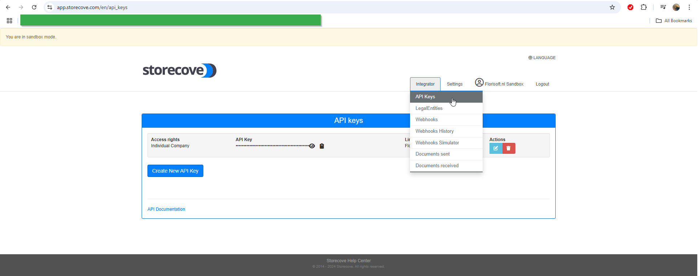
 |
| **2** | You will be redirected to the page: https://app.storecove.com/en/api_keys. Copy the API key from this page by clicking on the clipboard icon. Keep the API key handy; you will need it in the following steps. 

<b>Click here for an example!</b>

 |
|**3**|To the left of the legal entity there should be an Id followed by a set of numbers; this is the legal entity id. Copy and paste (the numbers) this to a notepad file, this way you will have easy access for later.|

## Setting the API Key in Policies

**Follow these steps:**

| Step | Description |
|:-:|:--|
| **1** | Open the constants screen via the navigator screen. 

<b>Click here for an example!</b>

 |
| **2** | Navigate in the constants screen to the following path: **System → Users → Policy Management** |
| **3** | Create a new policy and give it an appropriate name. 

<b>Click here for an example!</b>
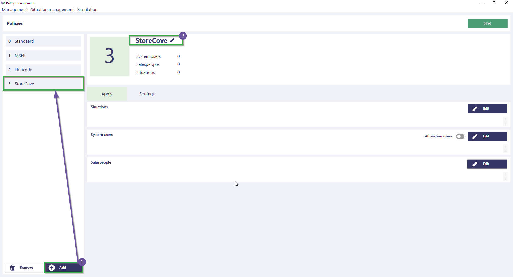
 |
| **4** | Assign the policy to the relevant system users using the **Edit** button and then click **Save**. 

<b>Click here for an example!</b>
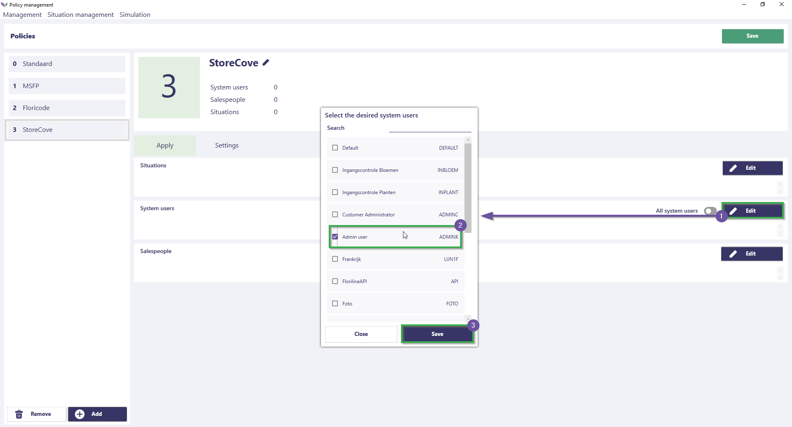
 |
| **5** | Use the search function to find the policy: **StoreCove**.  You will see the setting: **Backoffice_Financial_Invoicing_InvoiceExport_Storecove_ApiKey**.  Enter the API key in this policy setting. 

<b>Click here for an example!</b>
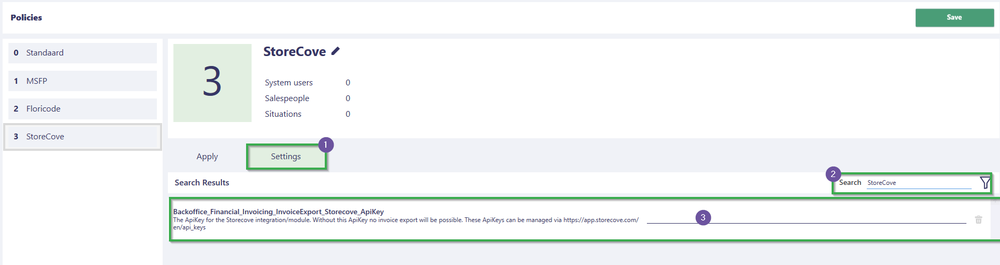
 |
| **6** | Then save the policy by clicking the **Save** button. |
| **7** | Want to know more about how policies work and how to configure them? Refer to the [Policy Manual](https://github.com/florisoft/User.Manuals/blob/main/BASIS/Policy%20Management/Handleiding%20Policy%20Management%20NL.md).

## Required Settings

The following subsections concern settings that must be configured for <u>all</u> relevant financial administrations and debtors. To ensure proper functionality, it is essential that this information is filled in for each debtor and financial administration.

### Financial Administrations

| Step | Description |
|:-:|:--|
| **1** | Open the constants screen (if you haven't already). 

<b>Click here for an example!</b>
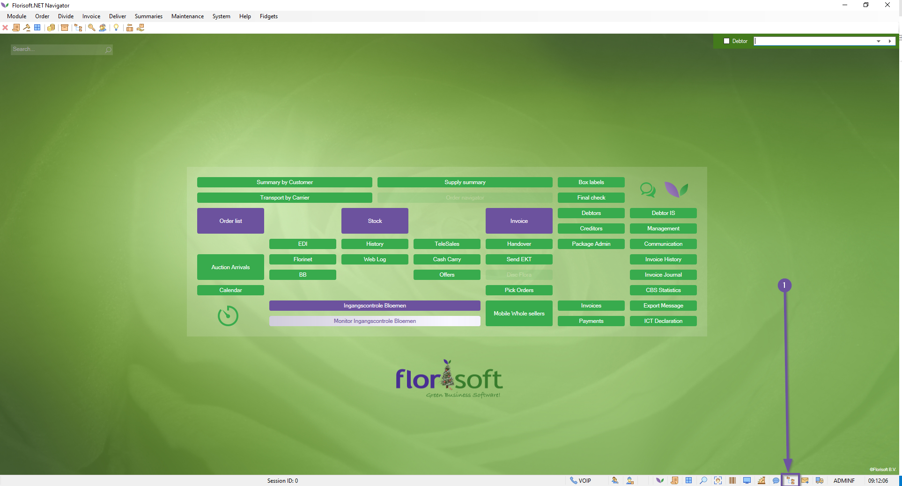
 |
| **2** | Navigate in the constants screen to: **Financial → Financial Administrations**. 

<b>Click here for an example!</b>
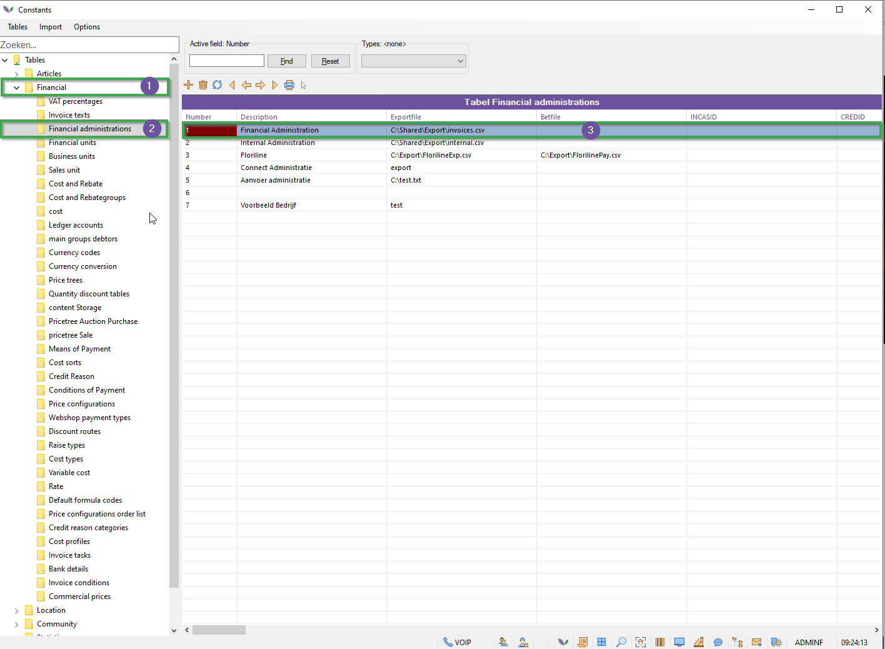
 |
| **3** | Open a relevant financial administration. |
| **4** | Under the **General** tab, fill in the following fields:  - Company Name - VAT-Number (must match the **country** in the address details). 

<b>Click here for an example!</b>
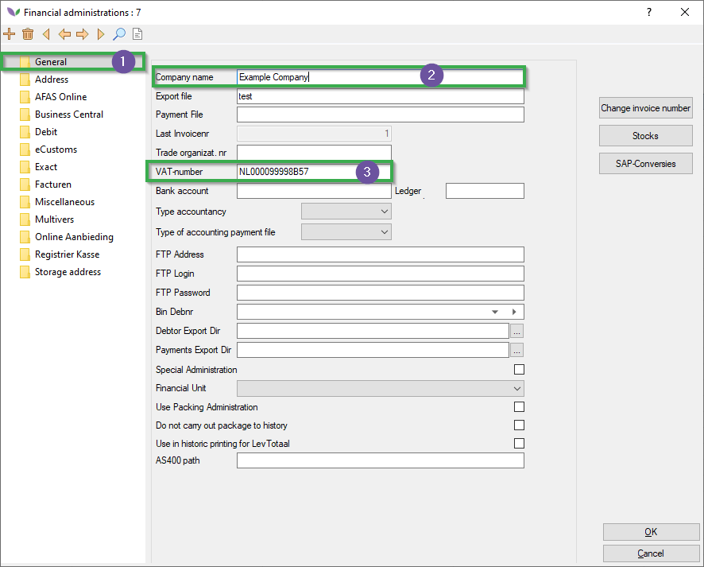
 |
| **5** | Under the **Address** tab, fill in the following fields:  - Street/housenr - City - Postal Code - Place - Country - EAN Code (**Note:** The StoreCove LegalEntityId must be entered here. In the future, this may become a separate field.) 

<b>Click here for an example!</b>
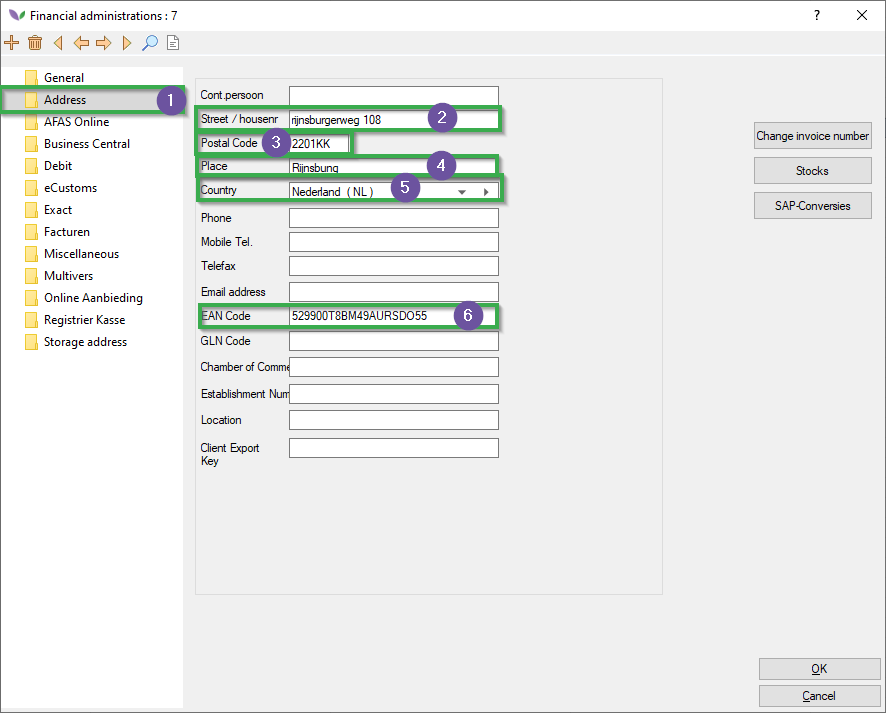
 |
| **6** | Under the **Debit** tab, fill in the following fields:  - IBAN - BIC/SWIFT (used for identifying the administration). 

<b>Click here for an example!</b>
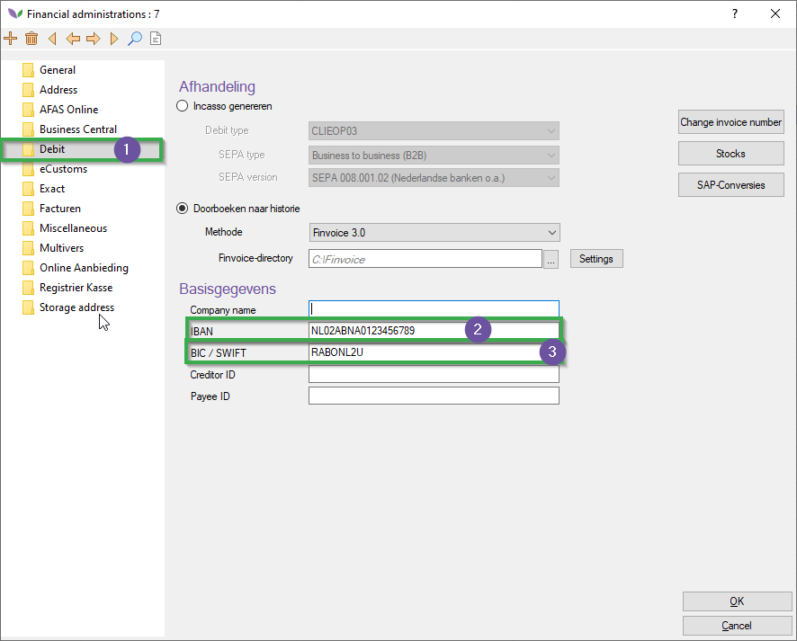
 |

### Debtors

| Step | Description |
|:-:|:--|
| **1** | Open the constants screen (if you haven't already). 

<b>Click here for an example!</b>

 |
| **2** | Navigate in the constants screen to: **Community → Debtor Data → Debtors**. 

<b>Click here for an example!</b>
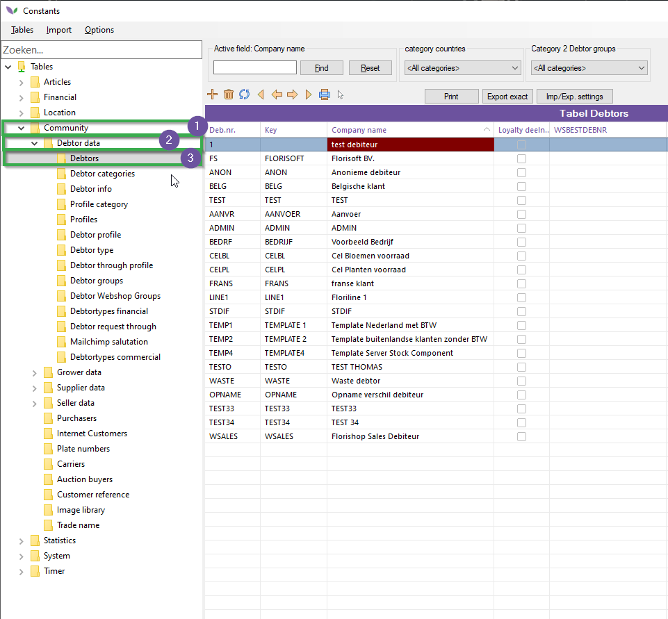
 |
| **3** | Under the **Addresses** tab, fill in the following fields:  - Company Name - Street/Housenr - Place - Zip Code - Country - EAN code - GLN code - KvK - IBAN

<b>Click here for an example!</b>
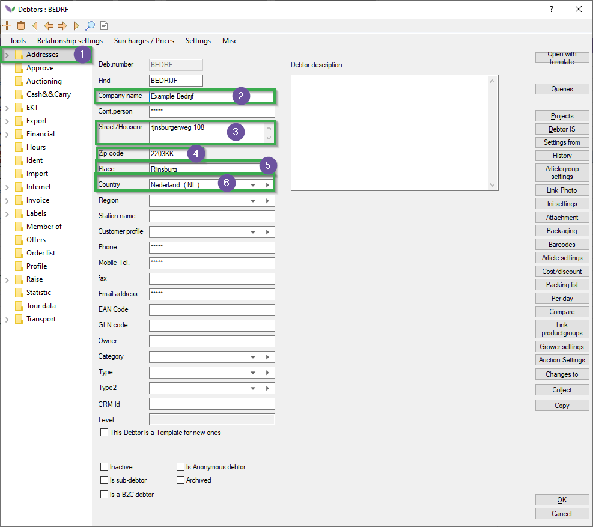
|
| **4** | Under the **Financial** tab, fill in the following fields:  - VATnr Debtor(**Note:** This must match the country entered under **Address**).

<b>Click here for an example!</b>
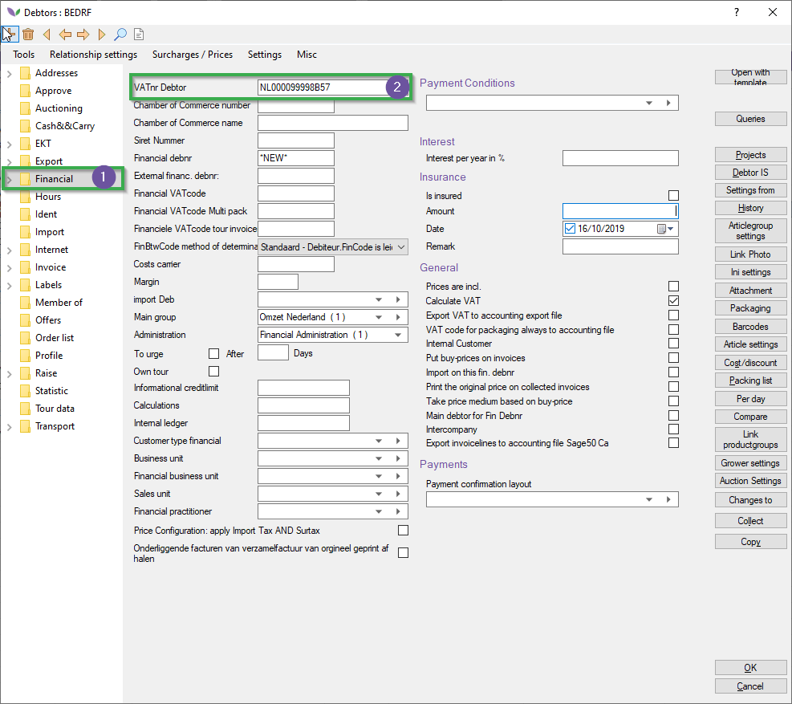
|
| **5** | Save the changes. |

## Exporting Invoices to StoreCove

Follow these steps:

| Step | Description |
|:-:|:--|
| **1** | Open the invoice screen via the Florisoft navigator by pressing the **Invoices** button. 

<b>Click here for an example!</b>
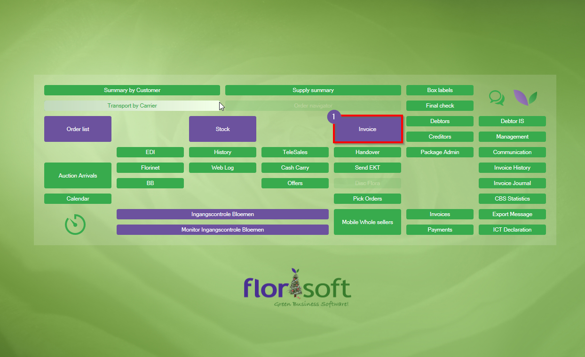
 |
| **2** | Under the **Export** tab in the top function bar, click on the **Export to StoreCove** function in the options menu. |

This process may take a moment. You may see a loading screen, which is normal. Processing an average message takes about 3-5 seconds.
