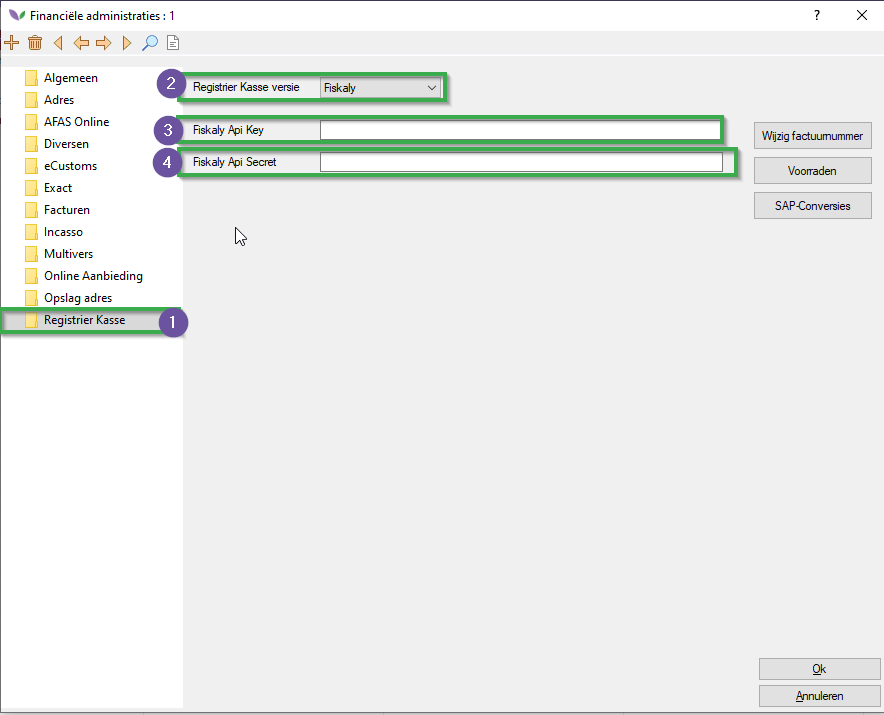
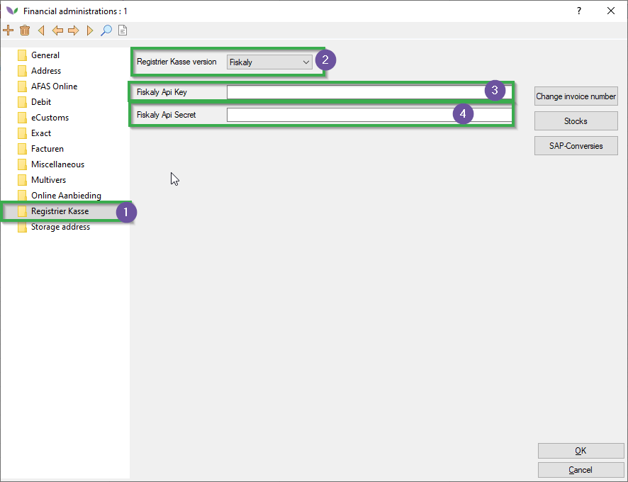
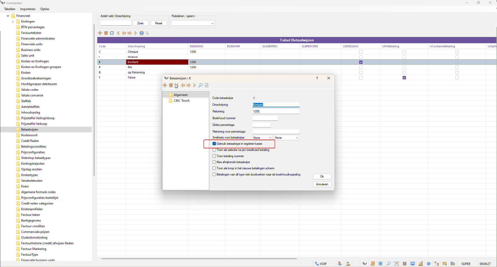

# Florisoft Handleiding Fiscalization (M218)

Met deze module kunnen uw uit te voeren kassa registraties voldoen aan het Duitse KassenSichV.

## Vereisten

Om gebruik te maken van deze functionaliteit zal de module Fiskaly API actief moeten zijn in uw systeem.

## Financiële administratie

Volg de onderstaande stappen voor elk van de financiële administraties waar ingestuurd dient te worden.

|Stap|Uitleg|
|:-:|:--|
|**1**|Open uw constantenscherm en navigeer naar het pad: **Financieel→Financiële administraties** open vervolgens de relevante finadmins.|
|**2**|In de financiële administratie navigeert u naar het tabje **Registrier Kasse**.|
|**3**|Zet de Registrier kasse versie op de optie "**Fiskaly**".|
|**4**|Vul hier de volgende velden in: **API Key**, **API Secret**

<b>Klik hier voor uw voorbeeld!</b>

|
|**5**|Herhaal deze stappen voor elke relevante financiële administratie.|

## Systeemgebruikers

Op de Florisoft gebruikers waar de betalingen op afgehandeld worden moeten er in de gebruikersinstellingen de financiële administratie worden ingesteld. 

*Volg hiervoor de onderstaande stappen:*

|Stap|Uitleg|
|:-:|:--|
|**1**|In het constantenscherm navigeert u naar het pad: **Systeem→Users→Systeemgebruikers**|
|**2**|Stel bij de instelling de **Fin.Admin** de relevante Financiële Administratie in.

<b>Klik hier voor uw voorbeeld!</b>

|
|**3**|Sla uw wijzigingen op.|

## Betaalwijze

Pas wanneer de gebruiker aan een financiële administratie is gekoppeld komt de onderstaande betaalwijze beschikbaar. Deze zet u vervolgens aan op de relevante betaalwijzen.

|Stap|Uitleg|
|:-:|:--|
|**1**|In het constantenscherm navigeer naar het pad: **Financieel→Betaalwijzen**|
|**2**|Zet vervolgens de instelling **Gebruik betaalwijze in registrier kasse** aan.

<b>Klik hier voor uw voorbeeld!</b>

|

## Printen QR-Code

Voor gebruikers waarop de Financiële administratie staat ingesteld met Fiskaly zal bij het printen van facturen vanuit Cash & Carry en vanuit het betalingen invoeren scherm worden geprobeerd de betalingen door te sturen naar de Fiskaly API en een qr-code terug te krijgen voor het ingestuurde bedrag en klaar te zetten als variabele in cBonQRCode deze kan direct in de layout worden opgenomen als te printen QR Code. Voor de eerste print op een dag zal het systeem moeten worden geïnitialiseerd per financiële administratie (tijdens testen een extra 6 seconden)