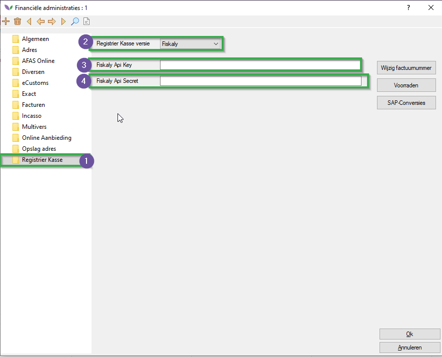
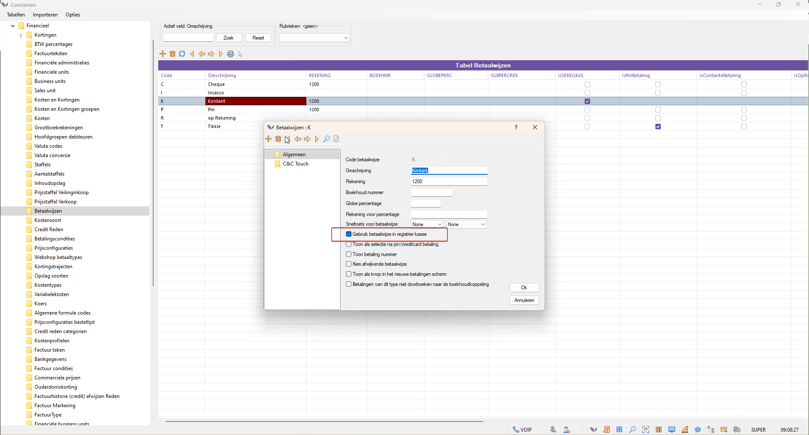

# Florisoft Manual Fiscalization (M218)

With this module, your cash register registrations can comply with the German KassenSichV.

## Requirements

To use this functionality, the Fiskaly API module must be active in your system.

## Financial Administration

Follow the steps below for each of the financial administrations that need to be submitted.

| Step | Explanation |
|:-:|:--|
| **1** | Open your constants screen and navigate to the path: **Financial→Financial administrations**, then open the relevant financial administrations. |
| **2** | In the financial administration, navigate to the tab **Registrier Kasse Version** to the **Fiskaly** option. |
|**3**|Set the Registrier |
| **4** | Fill in the following fields: **API Key**, **API Secret** 

<b>Click here for your example!</b>

 |
| **5** | Repeat these steps for each relevant financial administration. |

## System Users

For the Florisoft users who handle the payments, the financial administration must be set in the user settings.

*Follow the steps below:*

| Step | Explanation |
|:-:|:--|
| **1** | In the constants screen, navigate to the path: **System→Users→System users** |
| **2** | Set the **Fin.Admin** setting to the relevant Financial Administration. 

<b>Click here for your example!</b>

 |
| **3** | Save your changes. |

## Payment Method

Only when the user is linked to a financial administration will the following payment method become available. Then enable it for the relevant payment methods.

| Step | Explanation |
|:-:|:--|
| **1** | In the constants screen, navigate to the path: **Financial→Payment methods** |
| **2** | Then enable the setting **Use payment method in registrier kasse**. 

<b>Click here for your example!</b>

 |

## Printing QR Code

For users with the Financial administration set to Fiskaly, when printing invoices from Cash & Carry and from the payment entry screen, the system will try to send the payments to the Fiskaly API and retrieve a QR code for the submitted amount, setting it as a variable in cBonQRCode. This can be directly included in the layout as a printable QR Code. For the first print of the day, the system must be initialized per financial administration (during testing an extra 6 seconds).
