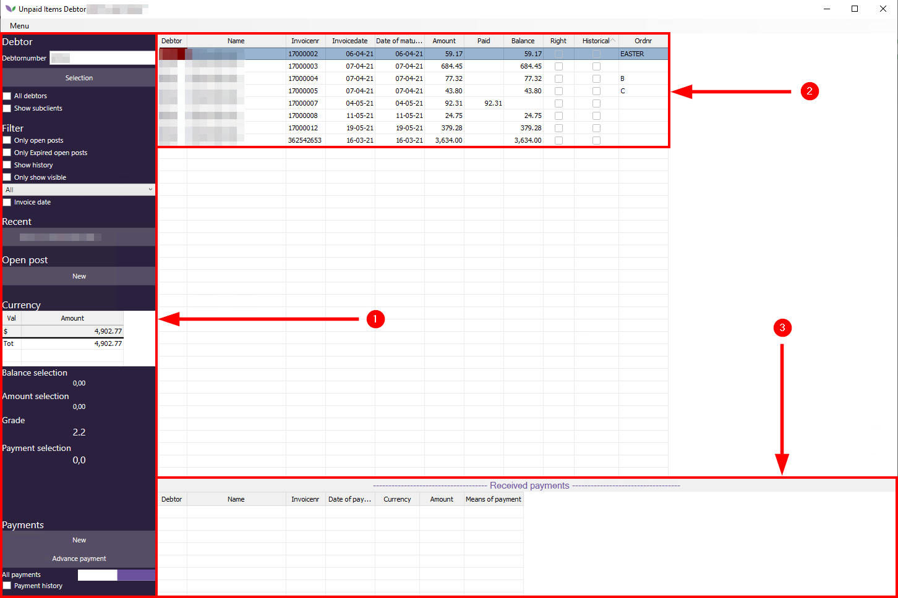
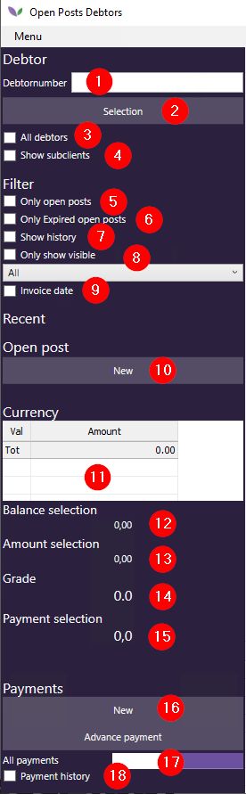
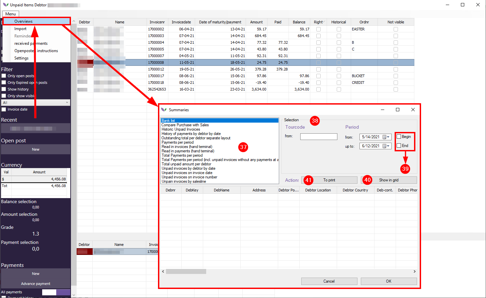

# Manual Open Posts Florisoft

## Table of contents
1. [Introduction](#Introduction)
2. [General process flow](#General-process-flow)
3. [Overview Open Posts section](#Overview-Open-Posts-section)
    * [3.1 Debtor section](#3.1-Debtor-section)
    * [3.2 Main section](#3.2-Main-section)
    * [3.3 Received payments section](#3.3-Received-payments-section)
4. [Debtor section](#Debtor-section)
5. [Main section](#Main-section)
6. [Received payments section](#Received-payments-section)
7. [Extra features](#Extra-features)
    * [7.1 Print/e-mail summaries](#7.1-Print/e-mail-summaries)

## 1. Introduction
Welcome to the Florisoft manual Open Posts. This manual describes the debtor management part from Florisoft, informally also called the (Debtors) Open Posts screen.

Debtor management is a relatively easy part of Florisoft which for most users is more or less the same. However the way Florisoft handles open posts needs some clarification to understand the way debtor management is implemented in the software.

The aim of this manual is to provide this clarification by explaining the most important parts of the open post section. After reading this manual, the user is able to manage debtors in Florisoft on its own.

To achieve this goal this manual is divided into several chapters. After his introduction, chapter two shows the general flow of financial information in Florisoft with a short explanation of how an open post is created in the system.

Thereafter, chapter three gives a rough overview of the most important parts of the Open Posts screen. The aim of this chapter is to show how the different parts relate to each other.

Chapter four up and till seven describes the individual parts of the open posts screen in more detail. Herewith the reader gets a deeper understanding of the open posts screen.

We hope you enjoy and learn a lot from this manual.

## 2. General process flow
The first important thing to understand is the way an open post is created in Florisoft. Below a simple diagram shows the different steps Florisoft need to take to create an open post.

### Step 1: Make divisions
The first step consists of the creation of divisions of stock parcels. This can be done manually or by customers themselfs via a webshop.

### Step 2: Carry out divisions to invoice
The second step involves carrying out the divisions from te stock to the invoice. This can be done manually (Carry out option or F2 key) 

### Step 3: Print invoice
When an invoice is complete it is printed officialy which means it gets an invoice number. Invoices with an invoicenumber cannot be changed anymore and must be seen as closed. (definitive)

### Step 4: Carry out invoice to invoice history
The last step is carrying out printed invoices to the invoice history. Only invoices which are in the invoice history are visisble in the open posts section. Florisoft sees carried out invoices always as open posts unless one ore more payments are made on those invoices. Possibly made payments can be seen in the Open Posts screen.

## 3. Overview Open Posts section
This chapter describes the most important sections of the Open Posts screen in Florisoft. Click on the Debtors button in the Navigator to open the Open Posts window:

See the screenshot below for an overview of the Unpaid Items Debtor screen. This is the default name of the Opens Posts section in Florisoft. Read further below the screenshot.   

No. 1: The left column of the Open Posts screen is used for making the correct selection regarding the debtor(s) to be show in part no. 2 and 3.

Several (filter)settings can be applied and important financial information is presented.

No. 2: the main section of the Open Posts screen shows all the individual open posts for the selected debtor(s) Important information like the concerning invoice numbers, dates, original-, outstanding- and paid amounts are shown here.

No. 3: The below part of the screen is called Received payments. This screen shows the received payments per invoice. (open post)

## 4. Debtor selection
The first step to show open posts is activating some settings in the left column of the screen. Below the most used settings will be explained.

As seen in the screenshot above the left column of the Open Posts screen is divided into several parts: Debtor, Filter, Recent, Open post, Currency and Payments. Each part contains several realted settings/information.

**Debtor selction (no. 1 & 2)**
Use the Debtornumber field (no. 1) or the Selection button (no. 2) to select the debtor(s) whose open posts can be seen.

**All debtors (no. 3)**
This check mark is an alternative to the Debtornumber field (no. 1) or the Selection option (no. 2) When activating this check mark the open posts from all debtors in the system will be shown.

> **Pay attention:** it can take up a lot of time to generate the open posts for a system with a large amount of debtors when using the check mark All debtors.

**Show subclients (no. 4)**
This check mark can be used to also show the open posts of the subclients associated with the selected debtor(s) as choosen with the aforementioned options to selected (a) debtor(s).

**Only open posts (no. 5)**
This check mark can be used to only show open posts in the main section. Without this check mark Florisoft shows (partially) paid and unpaid invoicves in the Open posts screen. With this check mark activated only unpaid invoices are shown.

**Only Expired open posts (no. 6)**
When activating this check mark only open posts after the expiration date are shown. The expiration of open posts can be set up per debtor.

**Show history (no. 7)**
After activating this check mark a date range selector is presented in the screen. Choose a start and end date and click on the Ok button to show only open posts that fall within the selected date range.

**Only show visibile (no. 8)**
Shows only the visible open posts. Those are open posts with the Not visible check mark **unchecked**. This check mark can be set in the Not visible column of the main part of the screen.

**Invoice date (no. 9)**
Activating the invoice date check mark gives a date selector at which a date range selection can be made regarding invoice dates. When activated only invoices with an invoicedate within the date range are shown in the main section.

**Button New (no. 10)**
The new button gives the option to manually create a new open post linked to an invoice number. When clicking the New button the New unpaid item Debtor [DEBTOR_NAME] opens. See the screenshot below:

In this window several information can/must be entered regarding the open post to be created. See the explanation below.

**Debtor number (no. 11.1)**
The debtor number field has a fixed value and shows the debtornumber and debtorname.

**Debtor number (no. 11.2)**
The Invoice number field is mandatory an must contain an existing or new invoicenumber to link the new open post to.

By pressing the F2 key on the keyboard it is possible to automaticly assign the next available invoice number in the system to this open post.

**Invoicedate (no. 11.3)**
The Invoicedate field must contain a date to which this invoice will be registrered to.

**Expiration date (no. 11.4)**
The expiration date of the invoice. By dafault the expiration time which is assigned to the debtor is applied so the newly created open post follows the default financial flow for the concerning debtor.

**InvoiceAmount (no. 11.5)**
Fill this field with the amount of the new open post.

> **Pay attention:** take into account the amount of decimals the system is in. Eg. if the system functions in two decimals use two decimals (0.01) when entering a value.

If the the system functions in three decimals use three decimals (0.001) when entering a value.

**Currency (no. 11.6)**
Choose the concerning currency in the dropdown field for the open post.

**Comment (no. 11.7)**
The value of the comment field is optional and can be used to enter a remark linked to the open post.

**Don't collect (no. 11.8)**
Activate this check mark to assign that this open post must not be charged.

**Paid Amount (no. 11.9)**
Use the Paid Amount field with an amount the open post will be registrerd as already paid.

**Balance (no. 11.10)**
Fixed value which represents the the total amount of the open post.

**Date of payment (no. 11.11)**
Date selector which can be used to select a date at which the current payment will be registrerd to.

**Means of payment (no. 11.12)**
Use this field to enter the letter of the payment method. Only letters of payments methods which are defined in the Constants -> Financial -> Means of Paymenta re allowed to use.

**Rate used (no. 11.13)**
This field shows the default currency rate linked to the selected debtor.

After entering all the required information click the Ok button in the New Unpaid Item Debtor screen to create a new open post for the selected debtor.

**Balance selection (no. 12)**
The total unpaid amount of the selected open posts in the main section of the screen.

**Amount selection (no. 13)**
The total amount (paid + unpaid) of the selected open posts in the main section of the screen.

**Grade (no. 14)**
This asigns a number (score) to the selected debtor at which the willingness to pay can be determined. If all selected invoices are paid before they expire, the score will be 10.

If the selected invoices are open for 90 days or longer, the number will be 0. The calculation is done dynamicly based on the amount of lines visible in the screen, the total amount of the invoices and the amount of invoices which are expired.

**Payment selection (no. 15)**
The total paid amount of all the selected open posts.

**Payments New button (no. 16)**
First select an open post in the main part of the screen and click the New button in the Payments part to register a new payment.

The meaning of the different fields is described before in no.'s 11.9 up and till 11.13.

**All payments switch (no. 17)**
This switch can be used to only show the last or all actual (not carried out) historical payments registrerd on the selected open post.

**Payment history (no. 18)**
Use this checkmark to see the historical payments. Historical payments are payments carried out to invoice history.

## 5. Main section
The main section of the open post screen consists of lines related to invoices. Those lines are called open posts. Lines will only appear if invoices are carried out from the invoice section to the invoice history.

Below an example of the main section is shown with an explanation of the most imporant information.

**Debtor (no. 19)** 
The debtor number to which the current open post is linked to.

**Name (no. 20)**
The debtorname to which the current open post is linked to.

**Invoicenr (no. 21)**
The invoice number the current open post is linked to.

**Invoicedate (no. 22)**
The invoice date the current open post is registrerd to.

**Date of maturity/payment (no. 23)**
The expiration date of the current open post.

**Amount (no. 24)**
The total amount of the current open post.

**Paid (no. 25)**
The total paid amount of the current open post.

**Balance (no. 26)**
This is the rest amount by reducing the paid amount from the total amount. Eg: Amount - Paid = Balance.

**Historical (no. 27)**
Check mark which is activated when the concerning open post is an historical one. Those open posts are only visible when the check mark Payment history (no. 18) is checked.

**Ordnr (no. 28)**
The ordernumber which is linked to the current open post line.

**Not visible (no. 29)**
Check mark which can be activated to make the current open post line invisible when the Only show visible check mark (no. 8) is activated.

It is possible to add extra columns in the main section by right clicking on one of the existing columns and place check marks in the Aan column for the columns you want to add or remove.

## 6. Received payments section
The Received payments section is the section below the main section. In this section all received payments on the selected open post are visible. By default only the most recent payment is shown.

However by turning the All payments switch (no. 17) also earlier made payments become visible.

The screenshot below shows the default columns which are activated.

**Debtor (no. 30)**
The debtor number the payment is registered to.

**Name (no. 31)**
The debtor number the payment is registered to.

**Invoicenr (no. 32)**
The invoice number the payment is linked to.

**Date of payment (no. 33)**
The date the selected payment is done.

**Currency (no. 34)**
The currency of the selected payment.

**Amount (no. 35)**
The paid amount linked to this open post.

**Means of payment (no. 36)**
The payment method used to pay for the selected open post.

## 7. Extra features
Beside the main functions of the Debtors Open Posts screen, there are a few extra features available often used by customers.

### 7.1 Print/e-mail summaries
The most important one is the option to print or e-mail information (summaries) related to open posts.

Click the Menu -> Overviews to open the print function. The Summaries windows opens. See the screenshot below.

**Types of summaries (no. 37)**
Choose a type of summary in the upper left part of the Summaries screen. (no. 37) The available settings in the Selection part (no. 38) depend on the selected summary type.

**Selection (no. 38)**
In the Selection part some options are available to make a selection tailored to a specific situation. A debtor or invoice range, tour code in combination with a date range. See the date selectors below the Period title.

**Begin and End check marks (no. 39)**
Use those check marks to let Florisoft automaticly determines the begin and end date of the summary type chosen.

**Show in grid (no. 40)**
Click this button to generate the actual summary data and show it in the grid in the below part of the Summaries screen.

**To print (no. 41)**
Opens the print/e-mail function to print or send the generated data via e-mail. A short explanation is given below.

**Print layout (no. 42)**
The default layout for the summary to be printed.

**Export (no. 43)**
Choose the export method to which the data is sent to: Printer (fysical print), Screen (Show summary on screen), Email (send summary via email), File (save summary to a file)

The different supported file types to which Florisoft can export the summary data are available in the Type file section (greyed out in the screenshot)

**Button Ok (no. 45)**
Click the Ok button to confirm the settings made and print/email the summary.

> If the Email option is chosen in the Export section, additional settings become available which are related to the Email export option. See the screenshot below:

The Email subject and Email address fields can be filled automaticly per debtor. Fill the CC and BCCC field if neccesary.

We hope you enjoyed reading this manual. You now have a basic understanding of debtor management in Florisoft.