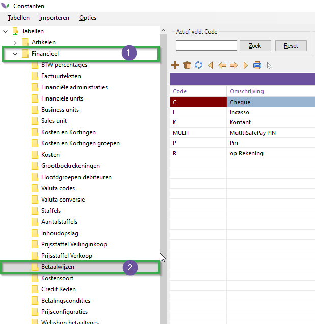
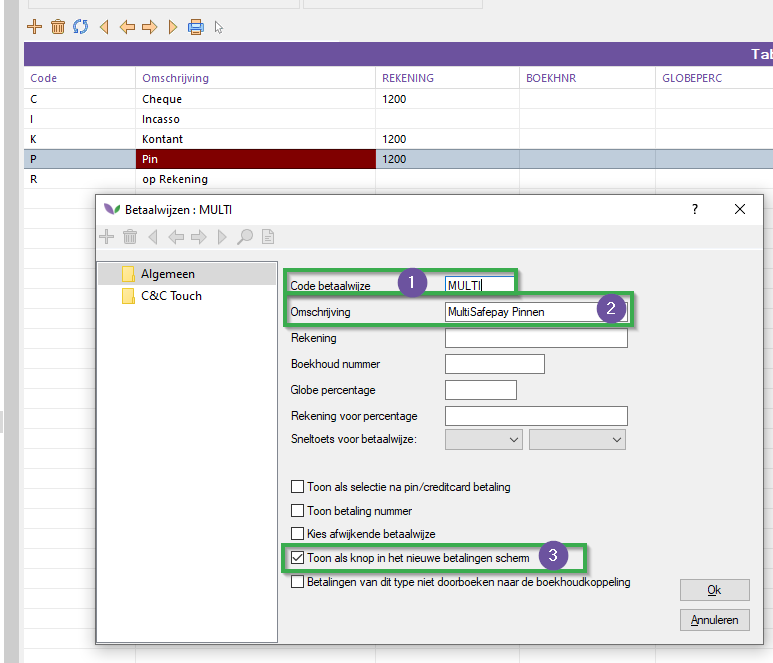
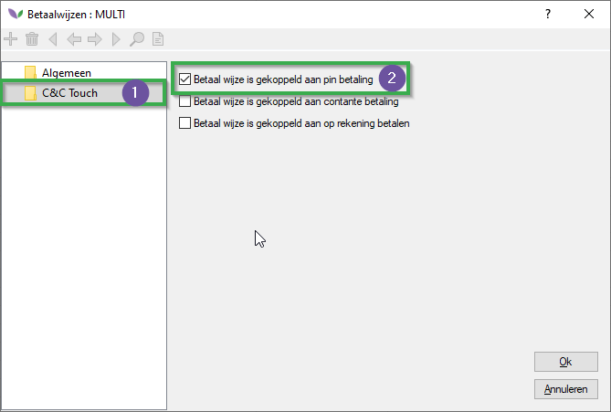
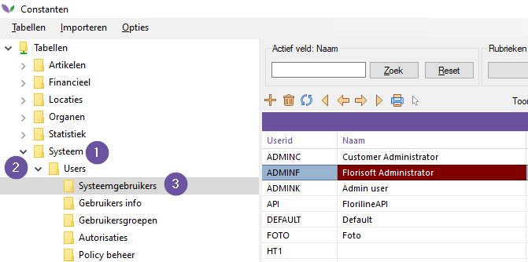
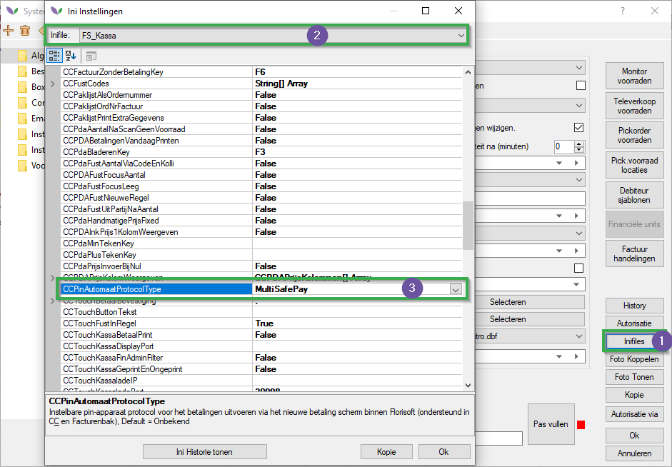
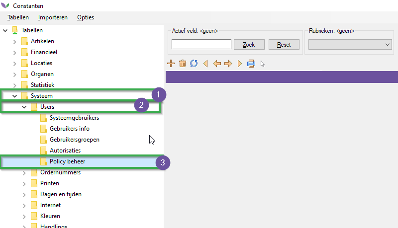
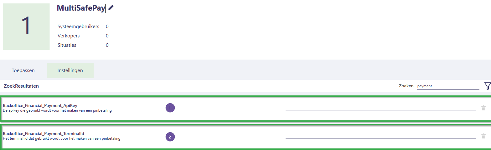
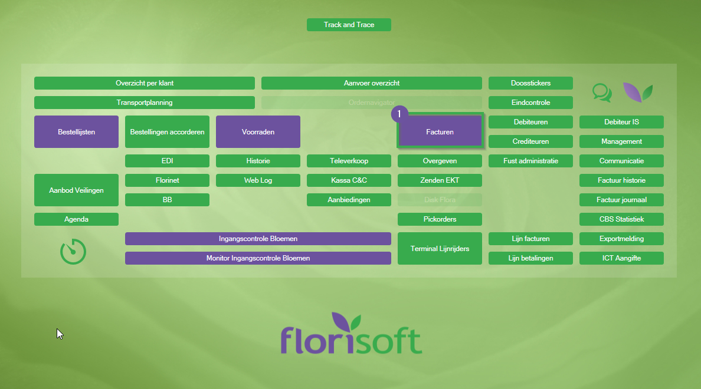
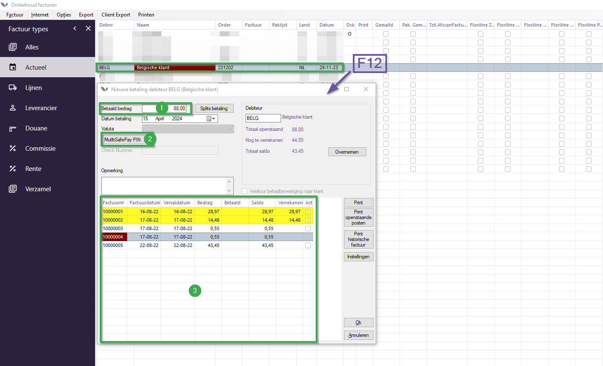

# Florisoft Handleiding Terminals

In deze handleiding leert u hoe u een MultiSafepay betaalterminal instelt en vervolgens betalingen mee kunt verrichten. Deze module werkt met de betaaldienstaanbieder MultiSafePay.

## Vereisten

Voor het gebruik van deze module heeft u een aantal dingen nodig:

1. Gekoppelde betaalterminal van MultiSafepay.
2. Florisoft "Payment Terminals" module.

## Instelwerk

Om deze module in te stellen heeft u een aantal zaken nodig. Florisoft verstrekt deze informatie aan u:

1. **MultiSafepay API Key**: de API-sleutel waarmee u de betalingen verricht.
2. **Terminal Ids**: de unieke Id's van de betaalterminals. Hiermee kunt u de verschillende terminals differentiëren.

*Volg vervolgens de onderstaande stappen:*

### Aanmaken betaalwijze

|Stap|Uitleg|
|:-:|:--|
|**1**|Open de constanten en navigeer naar het pad: **Financieel→Betaalwijzen**

<b>Klik hier voor uw voorbeeld!</b>

|
|**2**|Maak een nieuwe betaalwijze aan en vul de volgende velden in: **Code betaalwijze**: geef dit een passende waarde van maximaal 6 tekens. **Omschrijving**: Vul hier een korte gepaste naam in, dit is wat uiteindelijk zichtbaar is in het kassascherm.

<b>Klik hier voor uw voorbeeld!</b>

|
|**3**|Zet vervolgens de checkbox "**Toon als knop in het nieuwe betalingenscherm**" aan.|
|**4**|Navigeer nu naar het mapje **C&C Touch**.|
|**5**|Zet hier de checkbox **Betaalwijze is gekoppeld aan pinbetaling** aan.

<b>Klik hier voor uw voorbeeld!</b>

|

### Instellen pinautomaatprotocol

|Stap|Uitleg|
|:-:|:--|
|**1**|Open het constantenscherm en navigeer naar het pad:  **Systeem→Users→Systeemgebruikers**.

<b>Klik hier voor uw voorbeeld!</b>

|
|**2**|Zet in de INI-bestanden FS_KASSA de instelling **CCPINAUTOMAATPROTOCOL** op de waarde **MultiSafepay**.

<b>Klik hier voor uw voorbeeld!</b>

|
|**3**|Sluit het INI-scherm en sla de wijzigingen in de gebruiker op.|

### Instellen van policies

|Stap|Uitleg|
|:-:|:--|
|**1**|Open het constantenscherm en navigeer naar het pad: **Systeem→Users→PolicyBeheer**

<b>Klik hier voor uw voorbeeld!</b>

|
|**2**|Maak een beleidsregel aan met de volgende instellingen: **Backoffice_Financial_Payment_ApiKey**: vul hier de MultiSafepay API-key in.  **Backoffice_Financial_Payment_TerminalId**: stel hier het te gebruiken terminal-ID in.

<b>Klik hier voor uw voorbeeld!</b>

 |
|**3**|Koppel vervolgens de nodige gebruikers aan deze beleidsregel.  **Let op**: Als u meerdere terminals (dus ook meerdere terminal-ID's) heeft, moet u verschillende beleidsregels aanmaken voor de verschillende gebruikers die bij de terminal horen.   :warning:*Een gebruiker kan echter maar aan één terminal gekoppeld zijn!* |
|**4**|Sla de beleidsregel vervolgens op.|

**Heeft u meer uitleg nodig over het beleidscherm? Lees dan [hier](https://github.com/florisoft/User.Manuals/blob/main/BASIS/Policy%20Management/Handleiding%20Policy%20Management%20NL.md) meer over hoe dit werkt.**

## Werking

De werking van deze module bevindt zich in het kassascherm dat te vinden is via de facturenbak. 
*Volg hiervoor de onderstaande stappen:*

|Stap|Uitleg|
|:-:|:--|
|**1**|Ga met een gebruiker die deze betaalmethode via beleidsregels en INI heeft ingesteld naar het facturenscherm. **Navigator→Facturen**.

<b>Klik hier voor uw voorbeeld!</b>

|
|**2**|Selecteer vervolgens een factuur en klik op de F12-toets om een nieuwe betaling te starten. 

<b>Klik hier voor uw voorbeeld!</b>

|
|**3**|Vul vervolgens het te betalen bedrag in (#1). |
|**4**|Selecteer vervolgens de eerder aangemaakte betaalwijze (MultiSafepay) door op de knop (#2) te drukken.|
|**5**|Selecteer met behulp van de spatiebalk nu de bij de betaling behorende facturen. De geselecteerde factuurnummers ziet u vervolgens terug als opmerking bij de transactie.|
|**6**|Wanneer u nu op **Ok** drukt, zal Florisoft bevriezen en ziet u binnen enkele ogenblikken een betalingsprompt verschijnen op de betaalterminal.|
|**7.a**|Als de betaling succesvol wordt afgerond, ziet u in Florisoft een bevestigingsprompt.|
|**7.b**|Als de betaling mislukt of te lang duurt, zal Florisoft een time-out bericht weergeven.|
