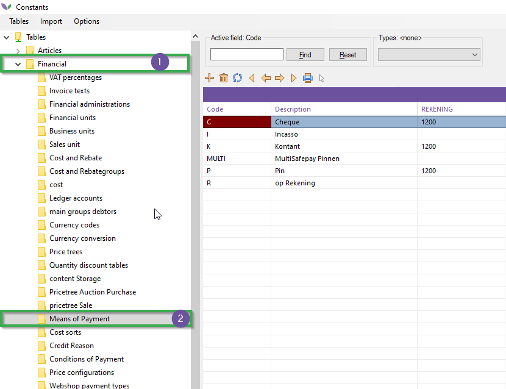
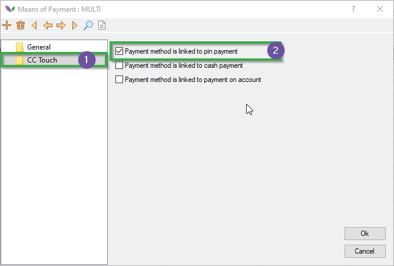
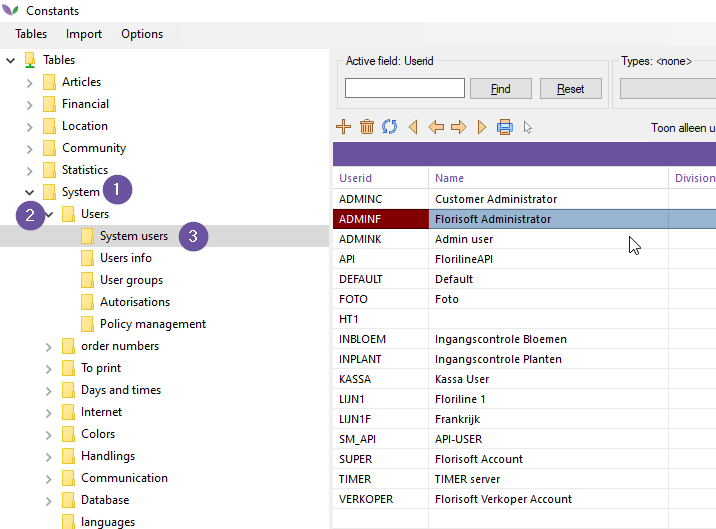
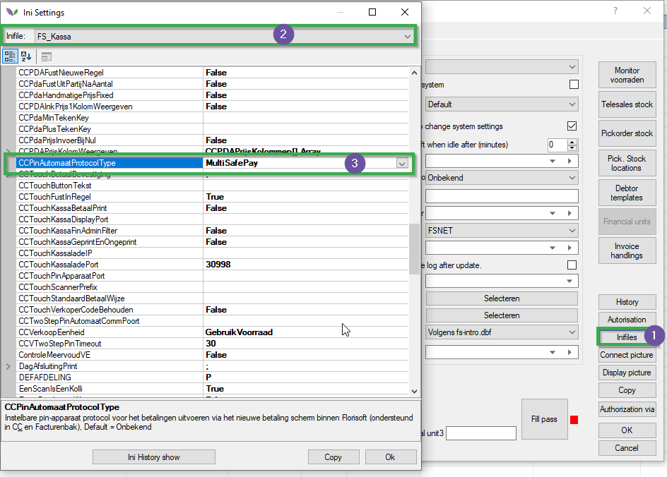
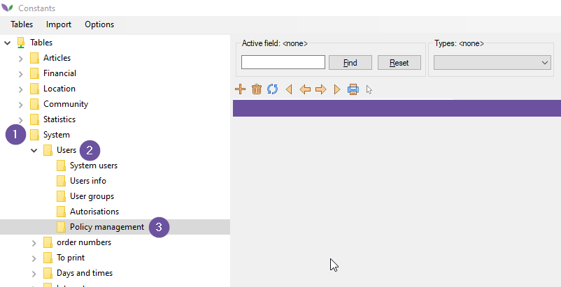
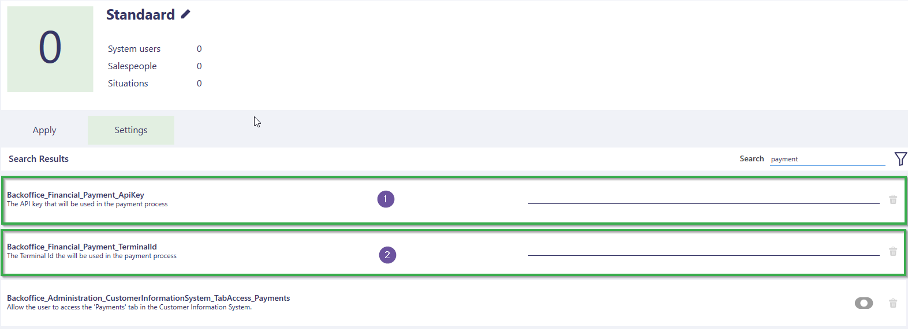
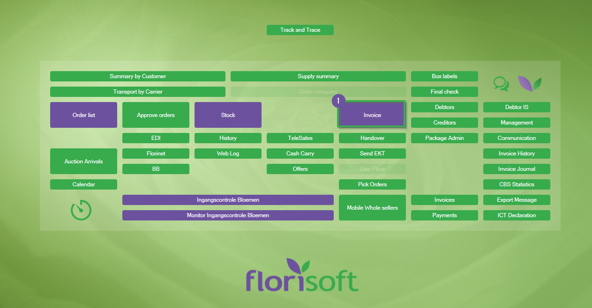
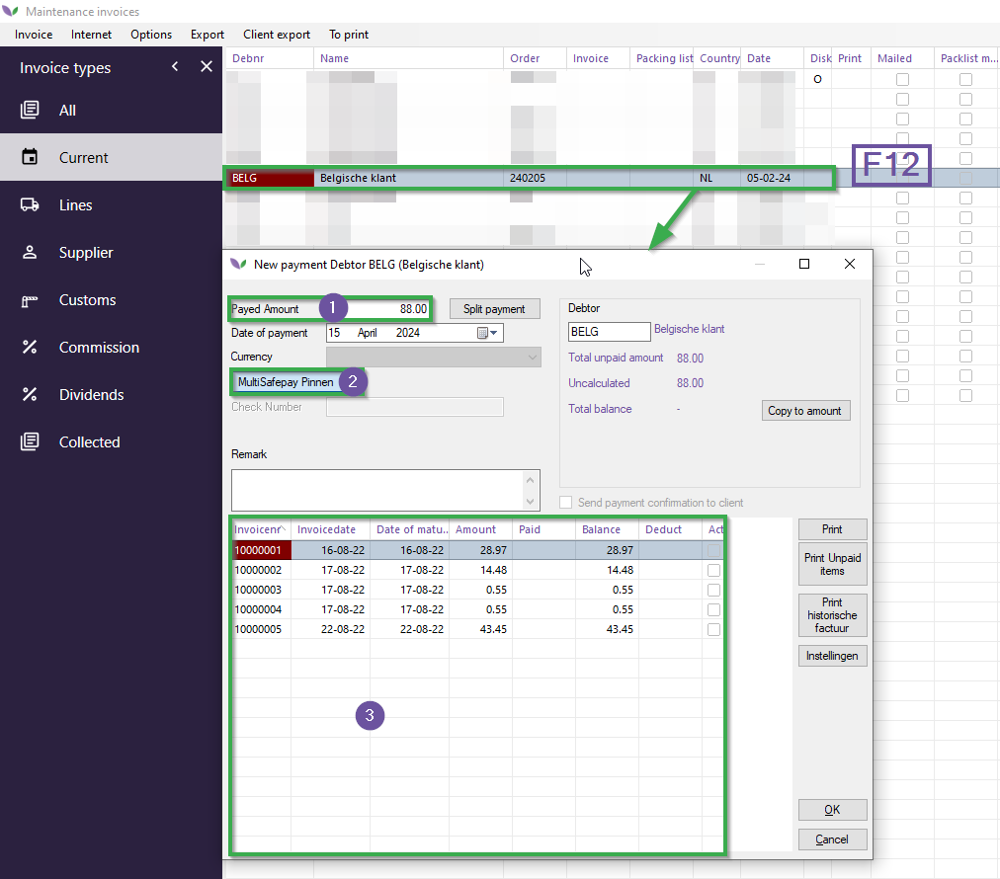

<!-- DO NOT RELEASE, SETTING NAMES ARE DIRECTLY TRANSLATED AND REQUIRE FURTHER CHECKING! -->

# Florisoft Terminal Manual

This manual will guide you through setting up a MultiSafepay payment terminal and conducting payments. This module operates with the payment provider MultiSafePay.

## Requirements

To use this module, you will need a few things:

1. Linked payment terminal from MultiSafepay.
2. Florisoft "Payment Terminals" module.

## Configuration

To configure this module, you will need some information provided by Florisoft:

1. **MultiSafepay API Key**: The API key used for processing payments.
2. **Terminal Ids**: The unique identifiers of the payment terminals, allowing differentiation between them.

*Follow the steps below:*

### Creating Payment Method

|Step|Explanation|
|:-:|:--|
|**1**|Open the constants and navigate to the path: **Financial→Means of Payment**

<b>Click here for your example!</b>

|
|**2**|Create a new payment method and fill in the following fields: **Code paym. manner**: Assign a suitable value of up to 6 characters. **Description**: Enter a concise appropriate name, which will be visible on the cash register screen.

<b>Click here for your example!</b>

|
|**3**|Next, check the checkbox "**Toon als knop in het nieuwe betalingenscherm**".|
|**4**|Now navigate to the folder **C&C Touch**.|
|**5**|Check the box here for **Payment method is linked to PIN payment**.

<b>Click here for your example!</b>

|

### Setting Up PIN Terminal Protocol

|Step|Explanation|
|:-:|:--|
|**1**|Open the constants screen and navigate to the path:  **System→Users→System Users**.

<b>Click here for your example!</b>

|
|**2**|In the INI files FS_KASSA, set the setting **CCPINAUTOMAATPROTOCOL** to the value **MultiSafepay**.

<b>Click here for your example!</b>

|
|**3**|Close the INI screen and save the changes in the user interface.|

### Setting Policies

|Step|Explanation|
|:-:|:--|
|**1**|Open the constants screen and navigate to the path: **System→Users→Policy Management**

<b>Click here for your example!</b>

|
|**2**|Create a policy with the following settings: **Backoffice_Financial_Payment_ApiKey**: Enter the MultiSafepay API key here.  **Backoffice_Financial_Payment_TerminalId**: Set the terminal ID to be used here.

<b>Click here for your example!</b>

|
|**3**|Then, link the necessary users to this policy.  **Note**: If you have multiple terminals (thus multiple terminal IDs), you will need to create different policies for the different users associated with each terminal.   :warning:*However, a user can only be linked to one terminal!* |
|**4**|Save the policy.|

**If you need further explanation about the policy screen, please read more [here](https://github.com/florisoft/User.Manuals/blob/main/BASIS/Policy%20Management/Manual%20Policy%20Management%20EN.md).**

## Operation

The operation of this module is within the cash register screen found through the invoice tray. 
*Follow the steps below:*

|Step|Explanation|
|:-:|:--|
|**1**|Using a user who has set up this payment method via policies and INI, go to the Invoices screen. **Navigator→Invoice**.

<b>Click here for your example!</b>

|
|**2**|Then, select an invoice and press the F12 key to initiate a new payment. 

<b>Click here for your example!</b>

|
|**3**|Enter the amount to be paid (#1). |
|**4**|Next, select the previously created payment method (MultiSafepay) by pressing the button (#2).|
|**5**|Now, use the spacebar to select the invoices associated with the payment. The selected invoice numbers will then appear as a note for the transaction.|
|**6**|When you press **Ok** now, Florisoft will freeze, and you will see a payment prompt appear on the payment terminal in a few moments.|
|**7.a**|If the payment is successfully completed, you will see a confirmation prompt in Florisoft.|
|**7.b**|If the payment fails or takes too long, Florisoft will display a timeout message.|
