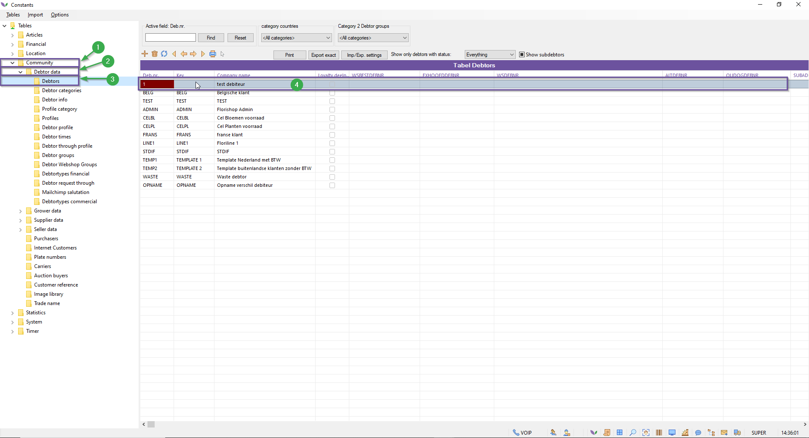
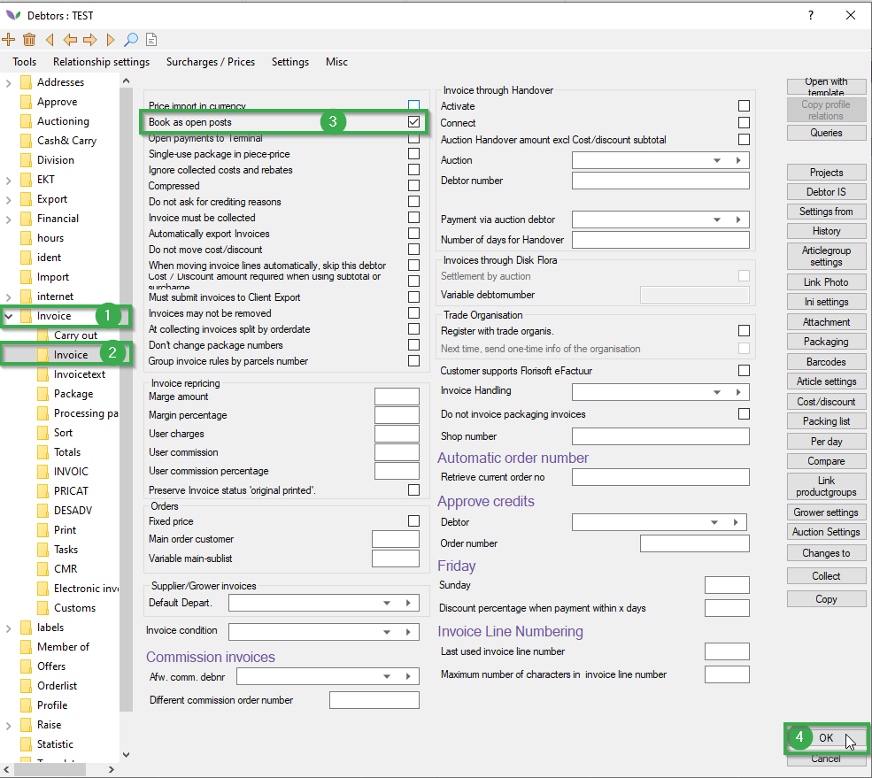
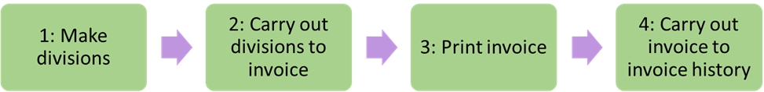
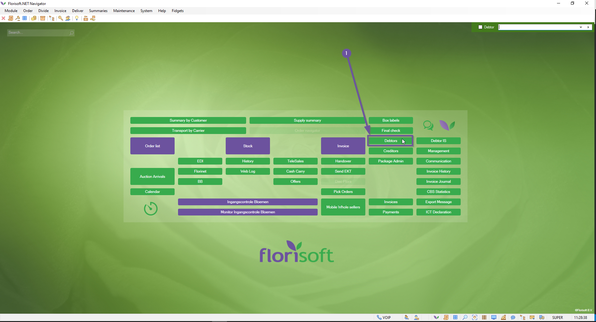
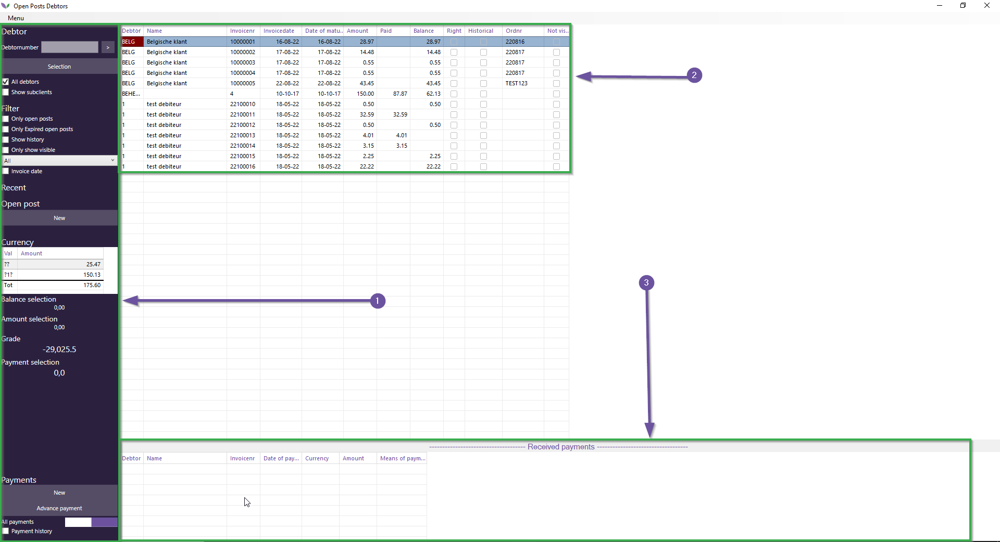
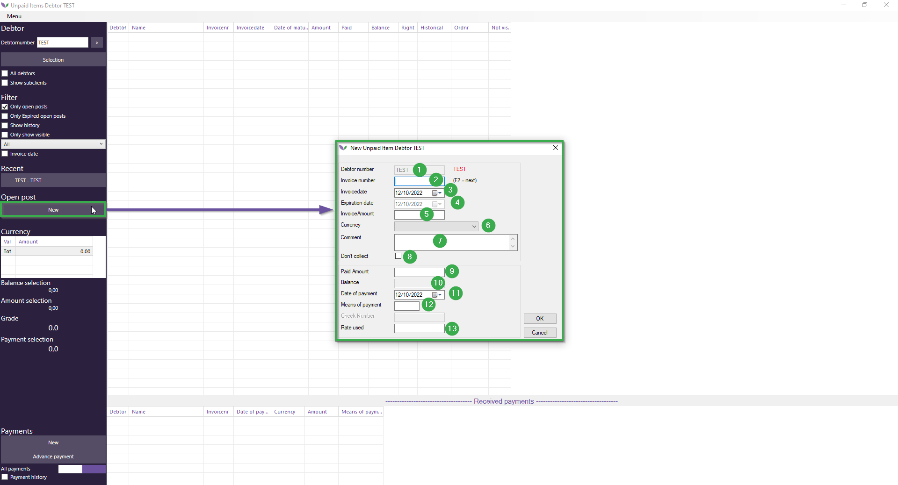
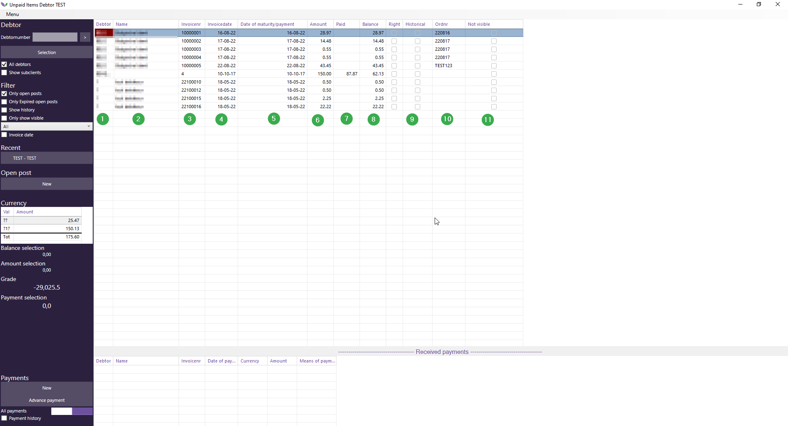
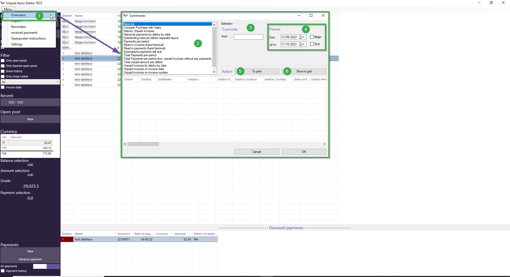
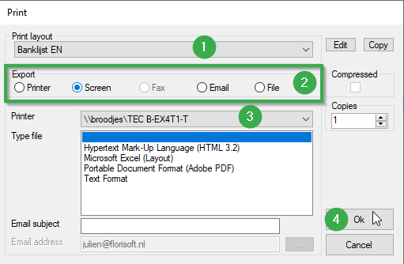
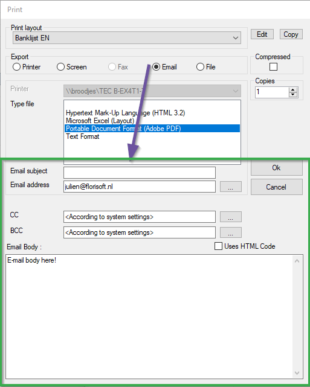

# Florisoft Manual Unpaid Invocies (M20)

## Table of contents

[Required setting per debtor](#required-setting-per-debtor)  
[Main process walkthrough](#main-process-walkthrough)
[Overview open posts](#overview-open-posts) 
[Debtor section]()  
[Creating new open post debtor](#creating-new-open-post-debtor)  
[Main table explanation](#main-table-explanation)  
[Setting up the table layout](#setting-up-the-table-layout)  
[Received payments section](#received-payments-section)
[Extra features](#extra-features)  
[Printing or e-mailing summaries](#printing-and-or-e-mailing-summaries)

## Required setting per debtor

A debtor can only have open posts if they have the required settings. Remember that changing this setting does **not** automatically retroactively make the previous posts open posts. You **can** however change the older posts to be open posts afterwards.

You can inspect or change this setting by following the staps below:

|# Step|Explanation|
|:--|:--|
|**1.**|From the navigator open the constants screen.|
|**2.**|Within the filestructure on the leftside of the screen you'll need to navigate to:   *Community*(#1) → *Debtor data*(#2) → *Debtors*(#3).

<b>Click here for your example image</b>

|
|**3.**|Left click twice on a debtor's row in the table(#4) this should open a new screen.|
|**4.**|In the new window prompt navigate to *Invoice*(#1) → *Invoice*(#2) in the file structure.

<b>Click here for your example image</b>

|
|**5**|In this tab there should be a option checkbox called *Book as open posts*(#3).

<b>Click here for your example image</b>

|

## Main process walkthrough

Before we begin it is import that we know how to create an open post.The diagram below shows a simplified version of the steps that need to be taken to create an open post. The chapters after the diagram will describe the steps in more detail.

|Stap|Uitleg|
|:--|:--|
|**1. Make divisions**|The first step is to create a division on a stock. This is done by customers using the webshop or us by using the backoffice's stock screen.|
|**2. Carry divisions out into invoice**|After making a stock division you can carry out the division to invoices.|
|**3. Print the invoice**|When an invoices is finished it is possible to print it. During the printing process a unique invoicenumber is assigned to the invoice and afterwards it can't be changed anymore.|
|**4. Carry invoice out to invoice history**| The last step is carrying out printed invoices to the invoice history. Only invoices which are in the invoice history are visisble in the open posts section. Florisoft sees carried out invoices always as open posts unless one ore more payments are made on those invoices. Possibly made payments can be seen in the Open Posts screen..|

:warning: **Because Florisoft is updated regularly the application may seem different on your screen since this manual's version might be out dated. Do however note that the general process flow won't change.**:warning:

## Overview open posts

In this chapter the functionalities and layout of the open Posts screen are explained.

|#|Explanation|
|:--|:--|
|**1**|Open the Florisoft navigator and click on the '*Debtors*' button(#1).

<b>Click here for your example image</b>

|
|**2**|You should now see the debtor screen, below you'll find a short description of the screens layout.   **1**.: *The left column of the Open Posts screen is used for selecting the right debtors to then show them in sections 2 & 3.* **2.**: *The main section of the open posts screen shows every open post for the selected debtor. Here you'll find important information pertaining to the invoice such as invoice numbers, dates, original and open payment amounts.* **3.**: *The lower section of the screen shows the received payments.* 

<b>Click here for your example image</b>

|

## The debtor section

To show all open posts on a single screen we'll need to change some settings on the left side of the screen. To learn which setting does what read the table below.

|# + Setting|Explanation|
|:--|:--|
|**1. Searchbar for debtors**|Enter the debtor you want to filter on.|
|**2. Execute search query**|Click here to exectute the filter based search based on the input of the textfield 1.|
|**3. All debtors**|This checkbox is an alternative to option 1 & 2, this option just shows the open posts for every debtor. **Important**: *Enabling this may lag the system in cases where the data is of a substantial size.|
|**4. Show subclients**|This checkbox can be used to also show the open posts of the subclients associated with the selected debtor(s) as choosen with the aforementioned options to selected (a) debtor(s).|
|**5. Only open posts**|This checkbox can be used to only show open posts in the main section. Without this check mark Florisoft shows (partially) paid and unpaid invoicves in the Open posts screen. With this check mark activated only unpaid invoices are shown.|
|**6. Only Expired open posts**|When activating this check mark only open posts after the expiration date are shown. The expiration of open posts can be set up per debtor.|
|**7. Show history**|After activating this check mark a date range selector is presented in the screen. Choose a start and end date and click on the Ok button to show only open posts that fall within the selected date range.|
|**8. Only show visibile**|Shows only the visible open posts. Those are open posts with the Not visible check mark unchecked. This check mark can be set in the Not visible column of the main part of the screen.|
|**9. Invoice date**|Activating the invoice date check mark gives a date selector at which a date range selection can be made regarding invoice dates. When activated only invoices with an invoicedate within the date range are shown in the main section.|
|**10. Button New**|The button '*new*' gives you the option to manually craete a new open post that is linked to the invoice number. When you press this button a new screen will appear. The functionalities of this screen are described below this table.|
|**11. Rate used**|This column shows the debtors default currency.|
|**12. Balance selection**|The total unpaid amount of the selected open posts in the main section of the screen.|
|**13. Amount selection**|The total amount (paid + unpaid) of the selected open posts in the main section of the screen.|
|**14. Grade**|This asigns a number (score) to the selected debtor at which the willingness to pay can be determined. If all selected invoices are paid before they expire, the score will be 10.  If the selected invoices are open for 90 days or longer, the number will be 0. The calculation is done dynamicly based on the amount of lines visible in the screen, the total amount of the invoices and the amount of invoices which are expired.|
|**15. Payment selection (**|The total paid amount of all the selected open posts.|
|**16. Payments New button**|First select an open post in the main part of the screen and click the New button in the Payments part to register a new payment. The meaning of the different fields is described before in no.'s 11.9 up and till 11.13.|
|**17. All payments switch**|This switch can be used to only show the last or all actual (not carried out) historical payments registrerd on the selected open post.|
|**18. Payment history**|Use this checkmark to see the historical payments. Historical payments are payments carried out to invoice history.|

<b>Click here for your example image</b>

### Creating new open post debtor

|# + Setting|Explanation|
|:--|:--|
|**Image**|

<b>Click here for your example image</b>

|
|**1. Debtor number**| The debtor number field has a fixed value and shows the debtornumber and debtorname.|
|**2. Invoice number**|The Invoice number field is mandatory an must contain an existing or new invoicenumber to link the new open post to.|
|**3. Invoice date**|The Invoice date field must contain a date to which this invoice will be registrered to.|
|**4. Experation date**|The expiration date of the invoice. By dafault the expiration time which is assigned to the debtor is applied so the newly created open post follows the default financial flow for the concerning debtor.|
|**5. Invoice amount**|Fill this field with the amount of the new open post.  **Pay attention:** take into account the amount of decimals the system is in. Eg. if the system functions in two decimals use two decimals (0.01) when entering a value.|
|**6. Currency**| Choose the concerning currency in the dropdown field for the open post.|
|**7. Comment**| The value of the comment field is optional and can be used to enter a remark linked to the open post.|
|**8. Don't collect**|Activate this check mark to assign that this open post must not be charged..|
|**9. Paid amount**|Use the Paid Amount field with an amount the open post will be registrerd as already paid.|
|**10. Balance**| Fixed value which represents the the total amount of the open post.|
|**11. Date of payment**|Date selector which can be used to select a date at which the current payment will be registrerd to.|
|**12. Means of payment**|Use this field to enter the letter of the payment method. Only letters of payments methods which are defined in the **Constants** -> **Financial** -> Means of Paymenta re allowed to use.|
|**13. Rate used**|This field shows the default currency rate linked to the selected debtor.|

## Main table explanation

The main section of the open post screen consists of lines related to invoices. Those lines are called open posts. Lines will only appear if invoices are carried out from the invoice section to the invoice history.

Below an example of the main section is shown with an explanation of each column.

|# + Column|Explanation|
|:--|:--|
|**Image**|

<b>Click here for your example image</b>

|
|**1. Debtor.**| The debtor number to which the current open post is linked to.|
|**2. Name**|The debtorname to which the current open post is linked to.|
|**3. Invoicenr**|The invoice number the current open post is linked to.|
|**4. Invoicedate**|The invoice date the current open post is registrerd to.|
|**5. Date of maturity/paymen**|The expiration date of the current open post.|
|**6. Amount** |The total amount of the current open post.|
|**7. Paid**|The total paid amount of the current open post.|
|**8. Balance**|This is the rest amount by reducing the paid amount from the total amount. Eg: Amount - Paid = Balance.|
|**9. Historical**| Check mark which is activated when the concerning open post is an historical one. Those open posts are only visible when the check mark Payment history is checked.|
|**10. Ordernr**| The ordernumber which is linked to the current open post line.|
|**10. Not visible**|Check mark which can be activated to make the current open post line invisible when the '*Only show visible*' check mark is activated.|

### Setting up the table layout

It is possible to add extra columns in the main section by right clicking on one of the existing columns and place check marks in the '*Aan*' column for the columns you want to add or remove.

|Step|Explanation|
|:--|:--|
|**1.**|Open the gridsettings (table layout) by clicking on the table with the right mouse button. This should open a new screen.

<b>Click here for your example image</b>

|
|**2.**|In this screen you are able to enable/disable column by checking the checkbox '*Aan*'.|
|**3.**|If you want to change a columns place in the table column order then change the '*Volgorde*' (Volgorde = Order in Dutch)field for the concerning row.|
|**4.**|You can also set the width of the column by adjusting the number in the column '*breedte*'.|

## Received payments section

The Received payments section is the section below the main section. In this section all received payments on the selected open post are visible. By default only the most recent payment is shown.

However by turning the '*All payments*' switch also earlier made payments become visible.

The screenshot below shows the default columns which are activated.

Below you'll find an explanation about the table columns of the received payments table.

|# + Column|Explanation|
|:--|:--|
|**1. Debtor**|The debtornumber the payment is linked to.|
|**2. Name**|The debtorname to which the current open post is linked to.|
|**3. Invoicenr**|The invoice number that the payment is linked to.|
|**4. Date of payment**|The date that the selected payment took place on.|
|**5. Currency**|The currency used in the selected payment.|
|**6. Amount**|The payment amount for the open post.|
|**7. Means of payment**|The payment method used for the payment.|

## Extra features

Beside the main functions of the Debtors Open Posts screen, there are a few extra features available often used by customers.

### Printing and or e-mailing summaries

The most important one is the option to print or e-mail information (summaries) related to open posts. To do this follow the steps below:

|Step #|Explanation|
|:--|:--|
|**1.**|Click the '*Menu*' button(#1) and in the new shown dropdown click on '*Overviews*' (#2). A new screen should appear in which the next steps take place.

<b>Click here for your example image</b>

 |
|**2.**|Choose the type of summary you want to see, **the sub settings will change on the type of summary**.|
|**3.**|As said before the optons that are available on the right side of the screen depend on the chosen layout. Examples of availabel options are: *debtor*, *invoice series*, *date period*.

<b>Click here for your example image</b>

 |
|**4**|	Using these checkboxes you can set the begin and end date for a summary, if you don't set these fields the Florisoft application will decide for you.|
|**5.**|Opens the print/e-mail function to print or send the generated data via e-mail. A short explanation is given below.

<b>Click here for your example image</b>

|
|**6.**|This button lets you generate a summary using the table below the button.|
|**7.**|The output selection is used to choose a export  method for the summary. You can change the following options: printer (on paper), screen (on the display), E-mail (sending the summary using e-mail) and file (saving it as a file on the computer).|
|**8.**|When choosing the file as an output option you'll get to choose from a couple of file types in the dropdown called '*File type*'.|
|**9.**|If you clicked on the '**Ok**' button you'll confirm the settings in the summary and print/e-mail the summary..|

**If you selected the e-mail option you'll get some additional options to fill out these options are explained below:**

|Step|Explanation|
|:--|:--|
|**Image**|

<b>Click here for your example image</b>

|
|**1.**|Type the e-mail header here.|
|**2.**|Enter the e-mail receipients here|
|**3.**|Enter any CC .|
|**4.**|Enter the actual message here (this is the e-mail body).|
|**5.**|If the e-mail message contains HTML enable the HTML checkbox otherwise the HTML won't render on the readers screen.|
|**6.**|Click '**Ok**'if you want to send the message, after sending there is no way to retract the sent message.|