# Florishop Credit(M123) Manual

## Table of contents

[Table of contents](#table-of-contents)  
[Preface](#preface)  
[Activating the required modules in Florisoft](#activating-the-required-modules-in-florisoft)  
[Reasons for creating credit in Florisoft](#reasons-for-creating-credit-in-florisoft)  
[Requesting credit in Florishop](#requesting-credit-in-the-florishop)  
[Approving credit requests](#approving-credit-requests)  

## Preface

The credit add-on offers web shop users (customers) the option to make credit requests through the Florishop. Credit requests may also be supplemented with additional information when necessary.The advantage of this is that the most relevant information becomes available automatically.

:warning:
**Screenshots in this manual may differ from screens on your system due to Florisoft being continuously updated. Do note that the main process flow will remain the same.**

## Activating the required modules in Florisoft

The first step is to enable the required modules for the debtors you want to be able to create Credit requests. To enable the required modules follow the steps below:

|Step#|Explanation|
|:--|:--|
|**0**|Open the Florisoft application and log in with your user credentials.|
|**1**|In the Florisoft navigator open the constants screen (#1).   

Click here to reveal the image
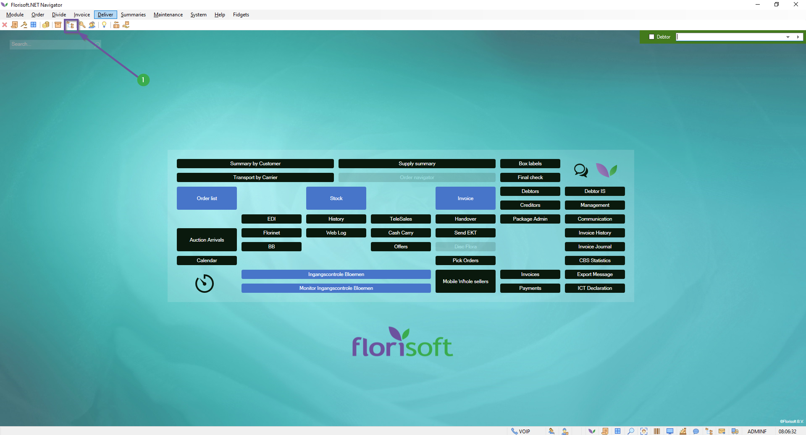
|
|**2**|Within the Constants file structure navigate to the following:   *Community*(#1) **→** *Debtor Data*(#2) **→** *Debtors*(#3)  

Click here to reveal the image
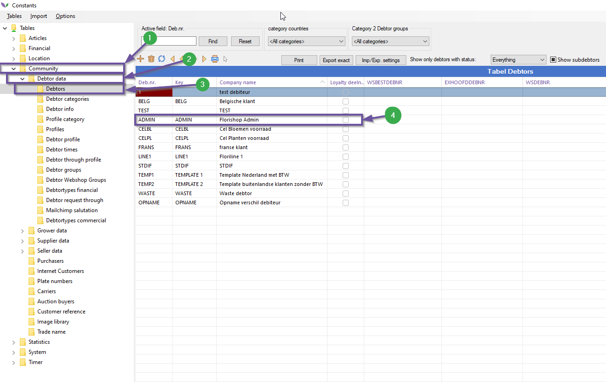
|
|**3**|Double left click on a debtor row in the table(#4), this should open a new window.|
|**4**|Within the newly opened screen navigate to *Internet*(#1) **→** *Modules*(#2) within the filestructure  

Click here to reveal the image
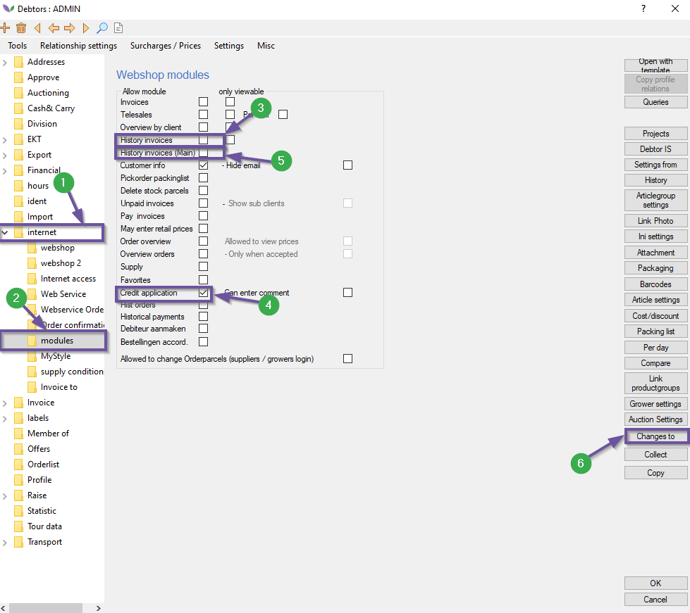
 |
|**5**|Within the webshop modules the following checkboxes need to be activated: *History invoices*(#3), *Credit application*(#4). Other checkboxes maybe left as is.  

Click here to reveal the image

 |
|:memo:|*The checkbox 'History invoices (main)'(#5) may be enabled if applicable.* |

**Optional:**

Using the method in the previous steps we enabled credit for one debtor, you may want to do this for many debtors but repeating this process is too time consuming. To fix this we can only do this once but for multiple debtors at once. 

The steps below build on the previous steps:

|Step#|Explanation|
|:--|:--|
|**1**|Assuming you are on the same screen as the previous listicle's step 5, check the checkboxes listed earlier. Now press on the '*Changes to*' button (#1) this should open a new dialog window.   

Click here to reveal the image
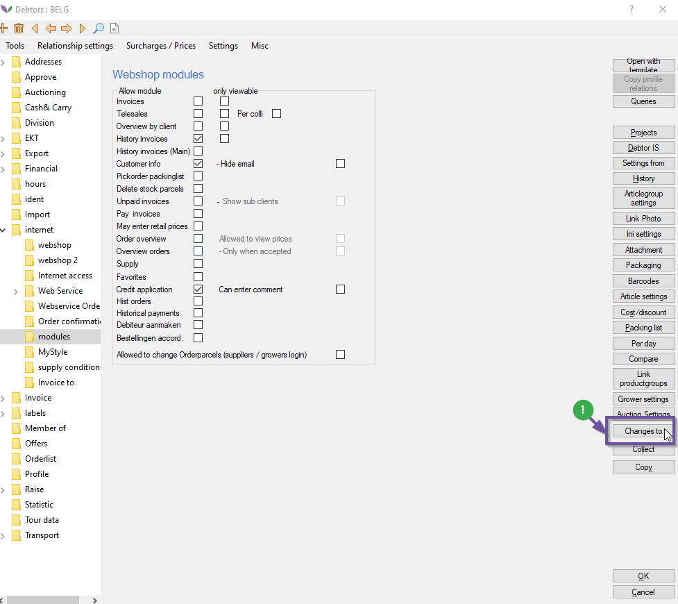
|
|**2**|Within this dialog screen simply press the '**Ok**' button (#1)  

Click here to reveal the image
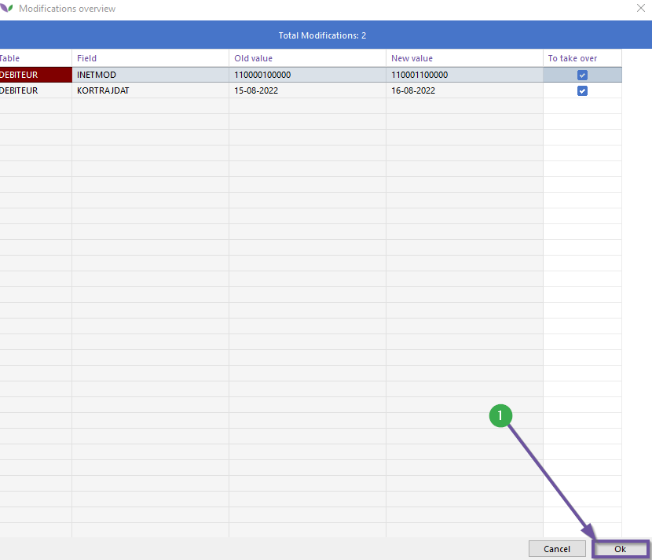
|
|**3**|This should prompt a new screen, within this screen we have 2 options: adding debtors(3.a) in groups and or multiple independent debtors(3.b) at once.  

Click here to reveal the image
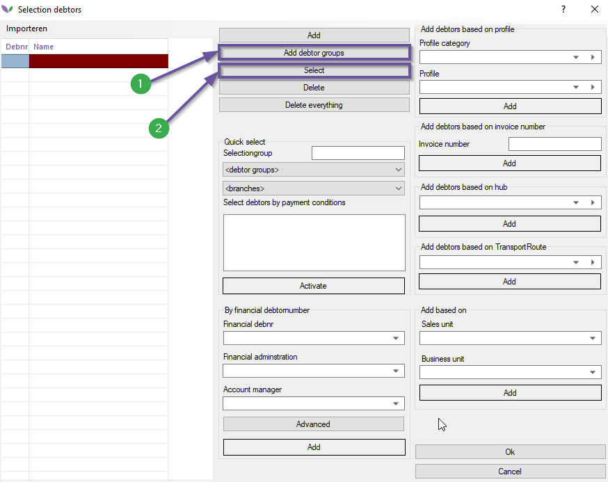
|
|**3.a**|Click the '*Add debtor groups*' button (#1), this should prompt a new screen titled: 'Index Debtorgroups'. In the table select a row by clicking on it or by pressing space, you may keep pressing space to select more groups.   Something slightly more advanced is selecting inverse, this is handy when selecting everything but the current selection. To do this right click on the selection this should open a small dialog screen(#2), left click on this. This again should open a new dialog screen click on the '*Select Inverse*' option(#3).  You can also search the table if you have many groups in the table, 'Fast search'(#4) is recommended since it is way quicker than normal search especially when there are a great number of groups. If the table doesn't update automatically click on 'Refresh' (#5).   *After selecting the right debtor by groups click on the 'Ok' button(#6*)  

Click here to reveal the image
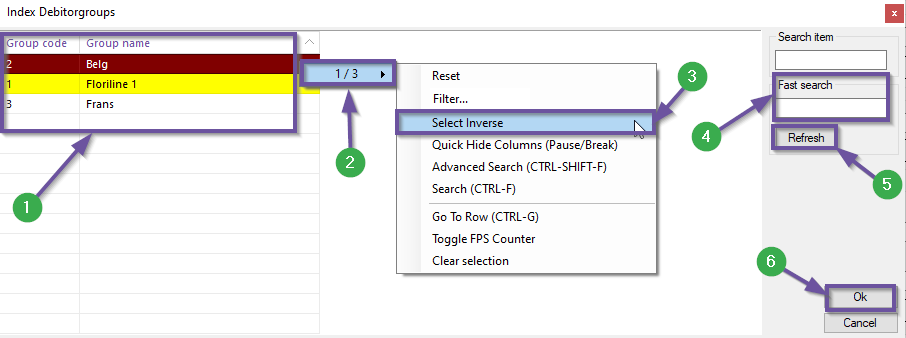
 |
|**3.b**|Click the 'Select' button (#1 from step #3), this should open a new window titled:'*Index debtors*'. In the table select the debtors by clicking on it or by pressing space, you may keep pressing space to select more debtors.   Something slightly more advanced is selecting inverse, this is handy when selecting everything but the current selection. To do this right click on the selection this should open a small dialog screen(#2), left click on this. This again should open a new dialog screen click on the '*Select Inverse*' option(#3).  You can also search the table if you have many debtors in the table, 'Fast search'(#4) is recommended since it is way quicker than normal search especially when there are a great number of debtors. If the table doesn't update automatically click on 'Refresh' (#5).  You can also filter the debtors based on the group they belong to, this is done through the 'Group' dropdown(#6). When you have made the correct selection for your scenario click on the 'Ok' button (#7).  

Click here to reveal the image
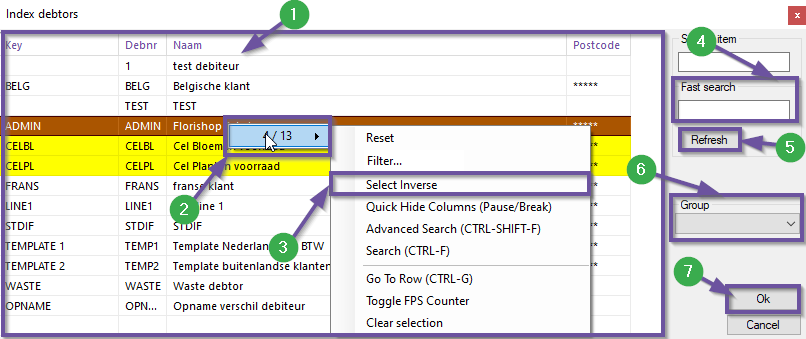
|
|**4**|After having made the selection in 3.a or 3.b the table in the window titled: 'Selection debtors' should now contain the selection made(#1). For the purpose of this manual we are done on this screen so simply click the 'Ok' button.   After clicking this button the window should disappear and a message prompt should appear telling you about how many changes were made.  |

## Reasons for creating credit in Florisoft

As a supplier it is possible to make credit reasons in Florisoft. Credit reasons are reasons as to why a customer submits a credit request. These credit reasons will be visible when making a credit request from the webshop. Examples of credit reasons are broken products, wrongly supplied amount. 

To create  a credit reason follow the steps below accordingly:

|Step#|Explanation|
|:--|:--|
|**0**|Open Florisoft with your user credentials this should open the navigator.|
|**1**|From the navigator open the constants by pressing the top or bottom constants button(#1).  

Click here to reveal the image

|
|**2**|In the left tab of the constants you will find a file structure, within this tab navigate to:  *Financial*(#1) **→** *Credit Reason*(#2)  

Click here to reveal the image
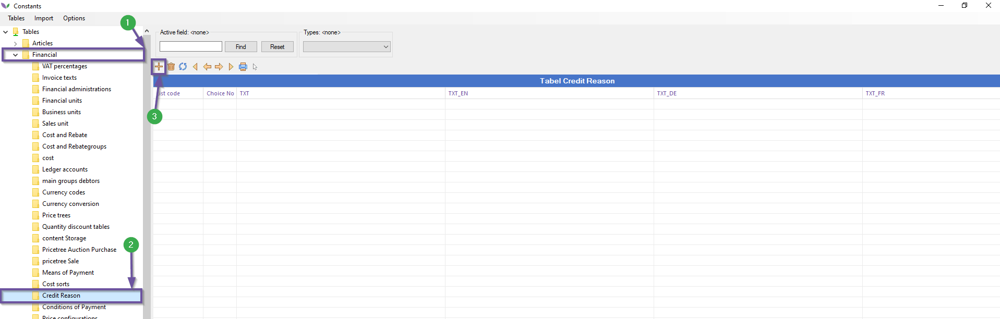
|
|**3**|This should reload the table part, this is where you will see the credit reasons listed. To add a new Credit Reason press the '+' plus sign(#3). This should open the credit reason creation screen.  

Click here to reveal the image

|
|**4**|Within the Credit Reason creation window there are a lot of options, below you will find a description of the most relevant ones:  **1.** Type description: Should be on '*Credit Reden*' **2.** Choice Nr.: Follow-up number for the choice list 'credit reasons' on the webshop. **3.** Description: Name for the credit reason. **4.** Duits: The German translation of the description **5**. Engels: The English translation **6**. Frans: The French translation. **7**. For use on the webshop: to be able to use it on the webshop check this checkbox. **8**. A photo must be added: Decides wheter or not a picture is required along with the credit request. **9**. Products must be returned:  this setting decides whether the products need to be returned to the supplier. **10**. Credits against reimbursement: determines whether or not the supplier pays the amount of credit back the customer.  

Click here to reveal the image
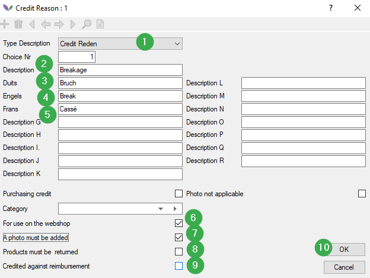
|
|**5**|After filling in the right data for the credit request click the 'Ok' button (#10)|

This concludes the setting up part in Florisoft, the next chapter will take place on the webshop. 

## Requesting credit in the Florishop

After having set up the ability for customers to amass credit with a corresponding credit reason, we can test if the credit is working on the webshop also. 

To do this follow the steps below:

|Step#|Explanation|
|:--|:--|
|**1**|Go to your florishop(webshop) site and log in with a customer account.|
|**2**|Open the your account page and go to the 'Request Credit Section.|
|**3**|If everything went well we should be able to see our invoices here in a table. If you look at the 4 connected circles above the table you'll see one circle highlighted, this is the credit request step indicator 1/4.|
|**4**|To go to the next step simply click on the invoice you want to create a credit request for.|
|**5**|The row should have updated showing you some extra invoice information. Clicking it again should us to step 3.|
|**6**|The third step's screen has some fields that need to be entered, below a quick explanation of each field.  **1.** Quantity to credit (Max:X): *fill this field with the number of items that need to credited.* **2.** New Price: *Fill this field with the new price for the credit invoice* **3**. Choose a reason: *from this dropdown select a reason for the credit request. Here we'll find the credit reason created in the previous chapter.* **4**. Retour: *The retour checkbox indicates if the credited items are to be returned.*  **5**: Upload a picture: *Here a customer may upload a maximum of five images to add to credit request. Depending on the set up credit reason it may be a requirement instead of a optional action.*|
|**7**|Having filled in the fields a customer may press the submit button to send in their credit request. You should now be redirected to a success screen! In this screen you have the option to create another credit request by pressing the 'Create another credit' button. You should also have received a confirmation e-mail message for your credit request. |

## Approving credit requests

Credit request made on the webshop can be approved or rejected in the Florishop application. To see the to be approved request follow the steps below:

|Step#|Explanation|
|:--|:--|
|**0**|Have the Florisoft Navigator open, if not open florisoft and log in with your user credentials.|
|**1**|Click on '*summaries*'(#1) and within the drop down click on the '*Approve*' (#2). This opens a new window.  

Click here to reveal the image
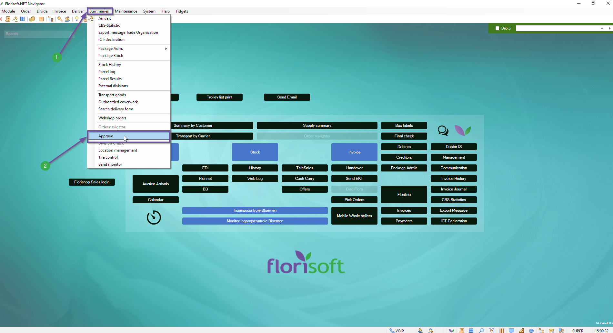
|
|**2**|Within the new window click on '*Windows*'(#1) and in the new dropdown on '*Invoice credits*'(#2), this updates the window to show the open credit requests.  

Click here to reveal the image
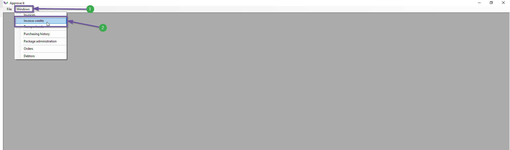
 |
|**3**|The table shows each credit request as a seperate line, to approve(#1) or reject(#2) a request is simply place a checkmark on the respective columns(1 & 2) of a request's row.  

Click here to reveal the image
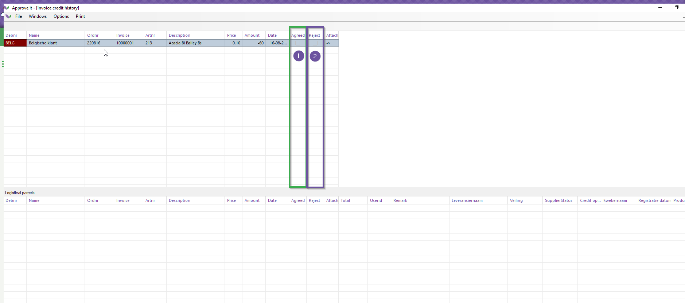
|
|**4**|After selecting one of the checkboxes click on the 'Approve' button(#1) in the bottom left.  

Click here to reveal the image
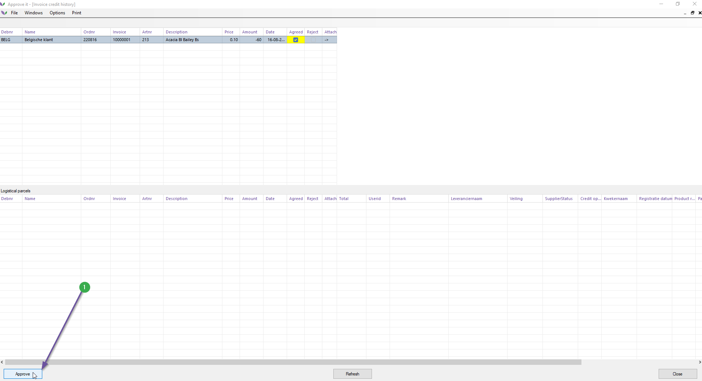
This should open a new smaller screen. |
|**5**|With this screen you can make changes to the credit request, the following changes can be made:   - Change the debtor, **do note changing this means the credit goes to another debtor**.  - Change the invoice, you can select a different invoice from the same debtor  - Order, in this textbox you can enter the order number for the credit invoice. This field may be ignored if your company invoice policy doesn't use order numbers. '*Keep order number*, this checkbox may be left as is if you don't use ordernumbers it won't affect the invoice.    **If no changes need to be made this screen can just be skipped by immediately pressing the 'Ok' button.**|
|**6**|After pressing the '**Ok**' button a confirmation mail will be sent out, if the request was rejected the issuer wil get a confirmation mail for the resulting decision and if it is approved a cedit invoice will be sent to the debtor.  In addition, a negative division is made in the pick order screen. From here the credited rules can be debited or redeemed in the stock.|