# Florisoft Manual Payment Gateway - MultiSafePay

This manual explains how to set up the Florishop Payment Gateway add-on, allowing your customers to pay their open items through MultiSafePay.

## Requirements

To complete this manual, you need the following:

- Payment Gateway module
- Open Items module
- An activated MultiSafePay account with all onboarding steps completed
- If you want to use PayPal, this must be linked to MultiSafePay separately outside Florisoft

## Settings in the Florisoft Back Office

These steps take place in the Florisoft back office, so make sure Florisoft is open.

### Creating a Currency Code

| Step | Explanation |
|:-:|:--|
| **1** | In the Navigator, open **Constants** (#1)

<b>Click here for an example!</b>
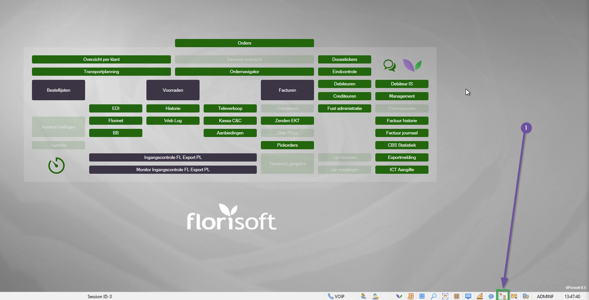
 |
| **2** | In **Constants**, navigate to: **Financial → Currency Codes**

<b>Click here for an example!</b>
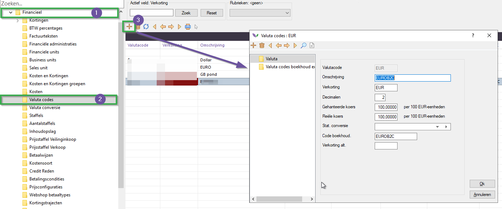
 |
| **3** | Create a new currency code (#1). |
| **4** | Fill in the following fields:  **Currency code:** EUR **Description:** a name for the currency, for example *euroshop* **Abbreviation:** EUR **Decimals:** 2 **Applied rate:** 100 **Actual rate:** 100 **Accounting code:** same as the description

<b>Click here for an example!</b>
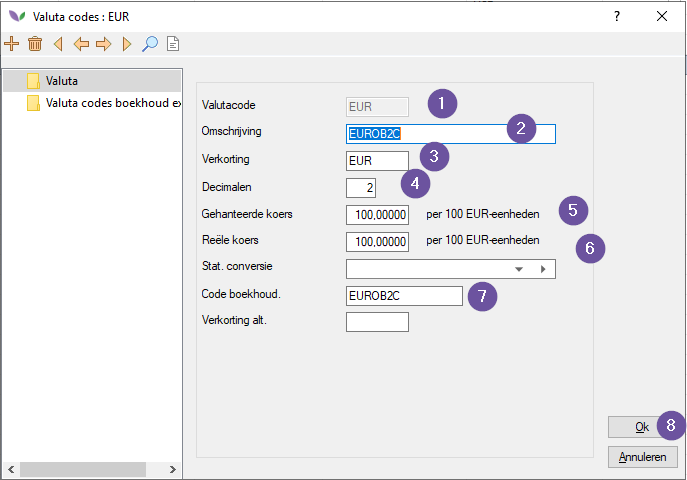
 |
| **5** | Click **OK** to save the new value. |

### Debtor Settings

| Step | Explanation |
|:-:|:--|
| **1** | In **Constants**, navigate to: **Relations → Debtor Data → Debtors**

<b>Click here for an example!</b>
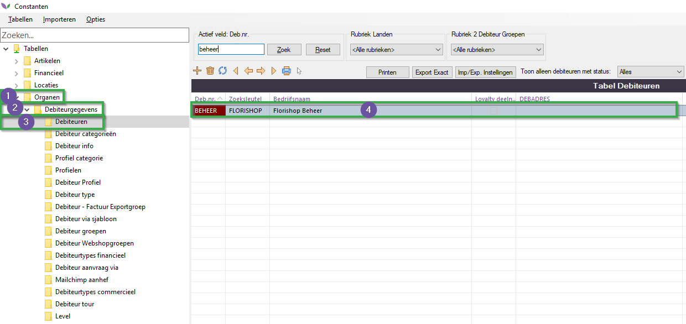
 |
| **2** | Open the relevant debtor. |
| **3** | In the debtor card, navigate to: **Invoice → Print**

<b>Click here for an example!</b>
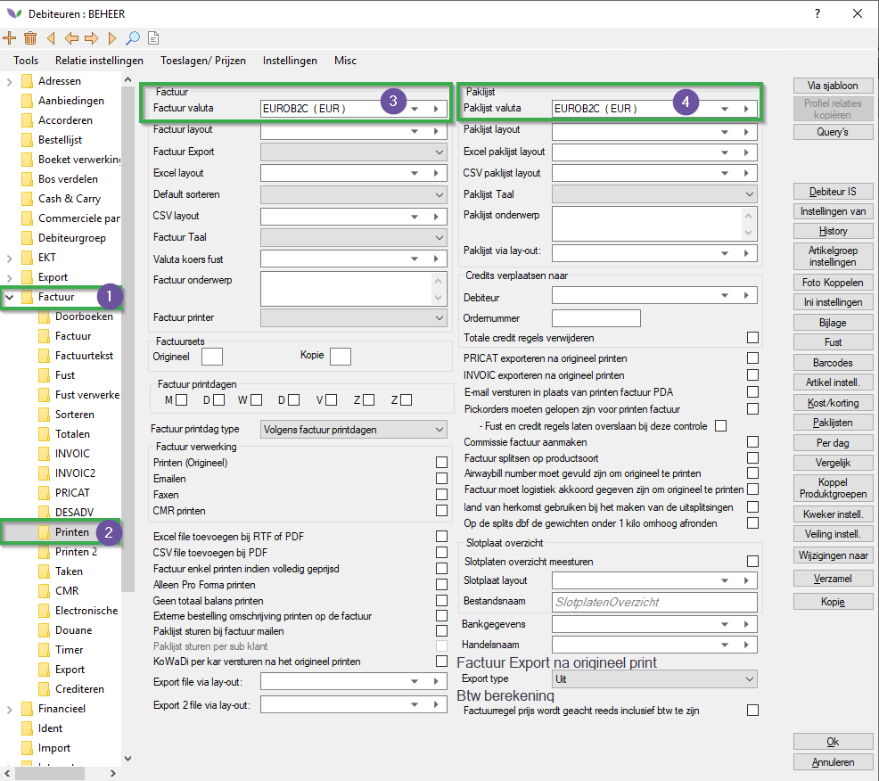
 |
| **4** | Set **Invoice currency** to the currency you just created.

<b>Click here for an example!</b>

 |
| **5** | Navigate to the **Internet** section.

<b>Click here for an example!</b>
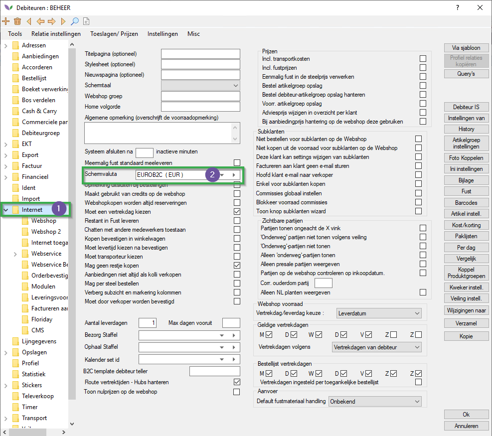
 |
| **6** | Set **Screen currency** to the newly created currency.

<b>Click here for an example!</b>

 |
| **7** | Now navigate to **Internet / Modules**. |
| **8** | Enable the checkboxes **Open items** and **Pay open items**.

<b>Click here for an example!</b>
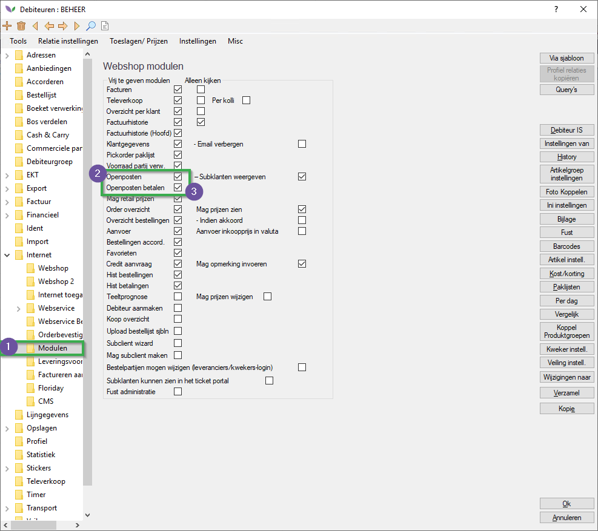
 |
| **9** | Click **OK** to save the changes, then confirm them. |

> :bulb: If you want to enable open item payments for multiple debtors, you can use the **Change to** button. This allows you to apply the current unsaved changes to other debtors.

## Creating a Payment Method

*To display webshop payments in the debtor open items screen, a new payment type (W) must also be created.*

| Step | Explanation |
|:-:|:--|
| **1** | Open the **Constants** screen and navigate to: **Financial → Payment Method**

<b>Click here for an example!</b>
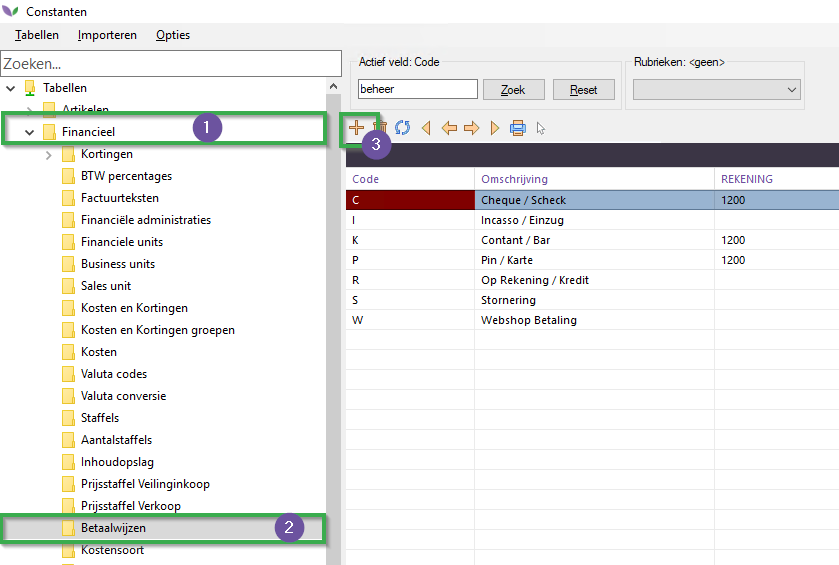
 |
| **2** | If no payment method with code **W** exists yet, create a new payment method. |
| **3** | In the field **Payment method code**, enter the value **W**.

<b>Click here for an example!</b>

 |
| **4** | In the description field, enter **Webshop payments**. |
| **5** | Click **OK** to save the changes. |

## Settings in the MultiSafePay Portal

These steps take place in your account portal, in other words on the MultiSafePay website. Screenshots may differ from what you see on your screen.

MultiSafePay provides two environments: a **Live (Production)** environment and a **Test** environment. These environments require different login credentials and separate accounts.

**:warning: If you want to use the test environment, this is indicated separately for each setting.**

| Step | Explanation |
|:-:|:--|
| **1** | Open the following link in your browser: https://merchant.multisafepay.com/  **For testing use:** https://testmerchant.multisafepay.com/ |
| **2** | Log in with your account details. |
| **3** | Once logged in, click **Websites**.

<b>Click here for an example!</b>
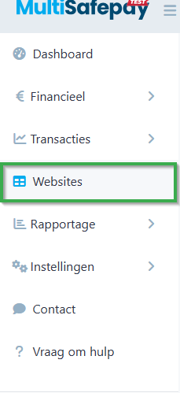
 |
| **4** | Create a new website here (#1).

<b>Click here for an example!</b>
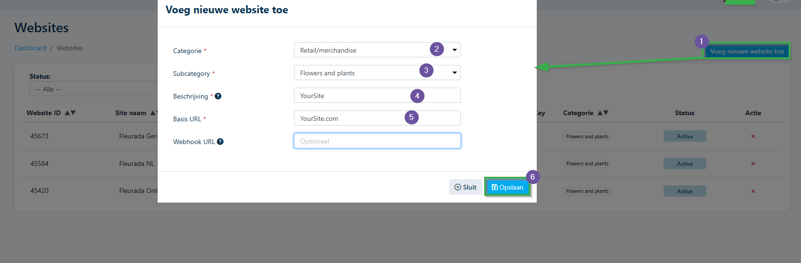
 |
| **5** | In the category dropdown, select **Retail/merchandise**. |
| **6** | In the subcategory dropdown, select **Flowers & Plants**. |
| **7** | In **Description**, enter the name you want to see in the MultiSafePay portal. |
| **8** | In **Base URL**, enter the URL of your webshop, for example `https://myshop.nl`. Make sure the URL does not end with a `/`. |
| **9** | The **Webhook URL** field can be ignored. Then click **Save**.

<b>Click here for an example!</b>

 |
| **10** | Under **Websites**, open the website you just created. |
| **11** | Fill in **Customer service phone number** and **Customer service email address**.

<b>Click here for an example!</b>
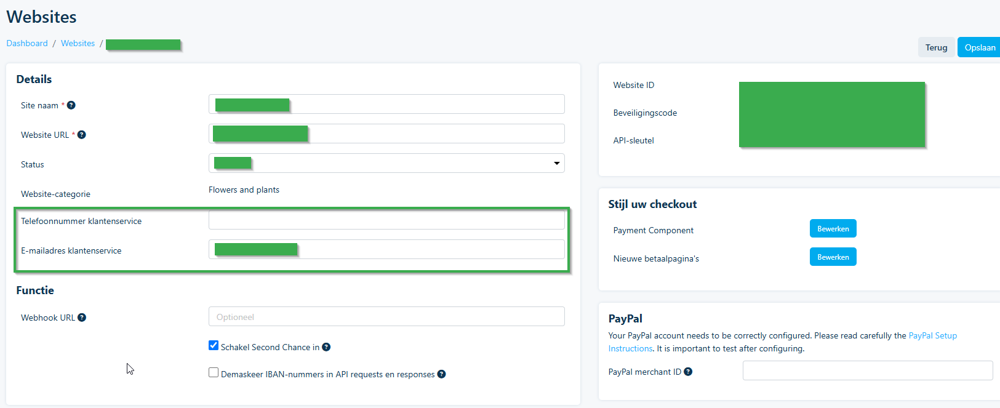
 |
| **12** | Under payment methods, select the payment methods you want to use.  **Note:** for PayPal, you must complete a few additional steps in MultiSafePay. [See here](https://docs.multisafepay.com/docs/paypal).

<b>Click here for an example!</b>
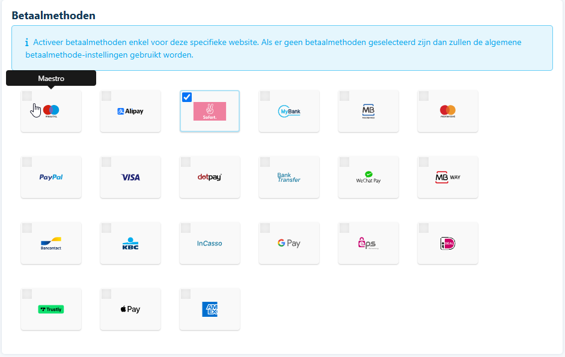
 |
| **13** | For now, keep the following details at hand. It is useful to copy and paste them into a text file so you can refer to them easily:  **Website ID (#1)** and **API key (#2)**

<b>Click here for an example!</b>
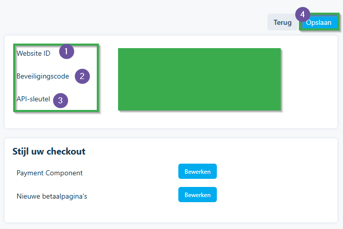
 |

## Setting Up the Connection in the Florisoft Back Office

These settings are configured again in the Florisoft back office, so make sure the Florisoft Navigator is open.

| Step | Explanation |
|:-:|:--|
| **1** | In the Navigator, click **Maintenance** at the top of the screen. This opens a context menu; click **Setup System**.

<b>Click here for an example!</b>
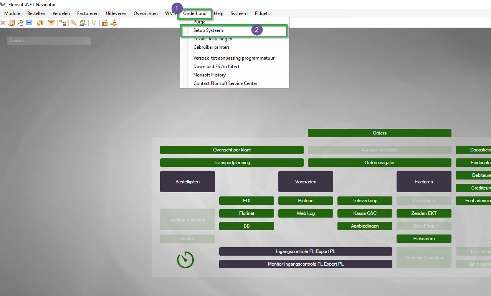
 |
| **2** | This opens the setup screen. Click the **Webshop** folder.

<b>Click here for an example!</b>
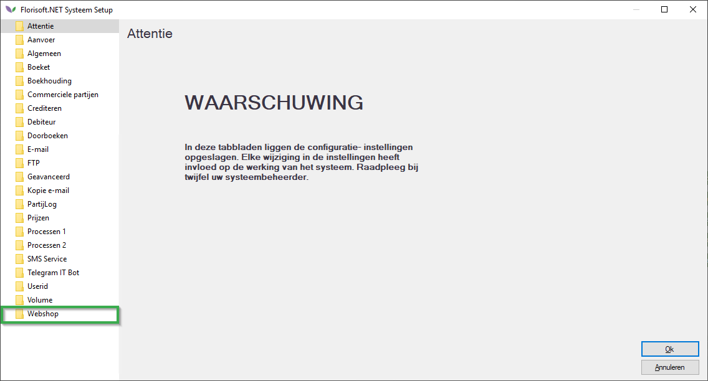
 |
| **3** | You will see a message that secret keys are not shown. This means that after entering and saving API keys, you will no longer see them in this screen. The API keys are saved, but hidden for security reasons. |
| **4** | In the MultiSafePay portal, copy the **API key** value. Paste it into the fields **Secret key (secretKey)** and **Repeat secret key**.

<b>Click here for an example!</b>
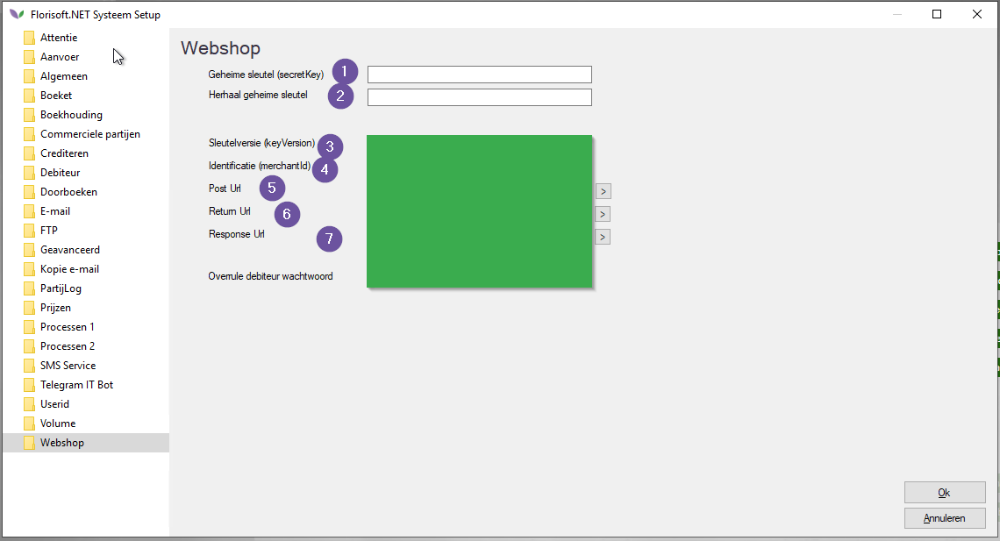
 |
| **5** | In the field **Key version (keyVersion)**, enter the value **1**. |
| **6** | Go back to the MultiSafePay portal and copy the **Website ID**. Paste this value into the field **Identification (merchantID)**. |
| **7** | In the field **Post URL**, enter the following value: `https://api.multisafepay.com/v1/json/`  **For testing:** `https://testapi.multisafepay.com/v1/json/` |
| **8** | In the fields **Return URL** and **Response URL**, enter the following value:  `https://yourshop.com/Service/MultiSafepay/ParseResponse`  Replace `yourshop.com` with the homepage/base URL of your Florishop.

<b>Click here for an example!</b>

 |
| **9** | After filling in these fields, click **OK** to save the changes. |
| **10** | Restart your Florisoft back office application. |

## Webshop Settings

| Step | Explanation |
|:-:|:--|
| **1** | Go to your Florishop and log in with the administrator debtor. |
| **2** | Click your user logo. This opens a small menu in which you click the **Admin** button. |
| **3** | At the top of the screen, click **Configuration**. This opens a context menu in which you click **Payment configuration**.

<b>Click here for an example!</b>
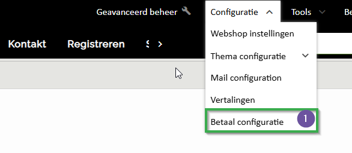
 |
| **4** | Go to **Multisafepay** and click **Settings**.

<b>Click here for an example!</b>
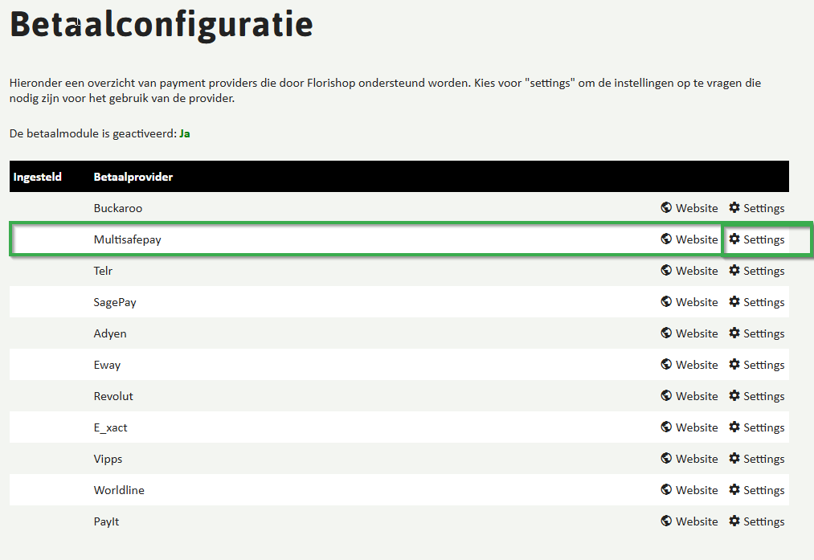
 |
| **5** | Check the values of **POSTURL**, **RESPONSEURL**, and **RETURNURL**.

<b>Click here for an example!</b>
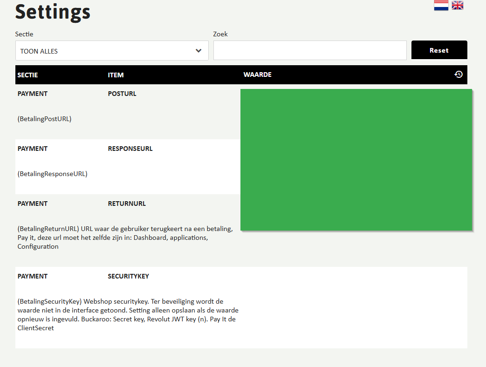
 |
| **6** | Open the **SECURITYKEY** setting and paste the **Multisafepay API key** there. |

## Restarting Your Shop

Now recycle the Florishop application in IIS. This is required to update the values in the webshop as well. If you do not know how to do this, contact Florisoft Support.

**:warning: Warning:** recycling will restart your webshop, so customers who are currently purchasing something may be affected. Do this at a time when there are few or no visitors on your shop.

## Paying Open Items (Customer Perspective)

*To make a test payment, the debtor you use for testing must have an open item.*

| Step | Explanation |
|:-:|:--|
| **1** | Click your user/debtor logo in the top-right corner of the page. This opens a context menu; click **Your account**.

<b>Click here for an example!</b>
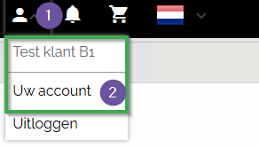
 |
| **2** | On the right side of your screen, you will see a menu. Click **Open items**.

<b>Click here for an example!</b>
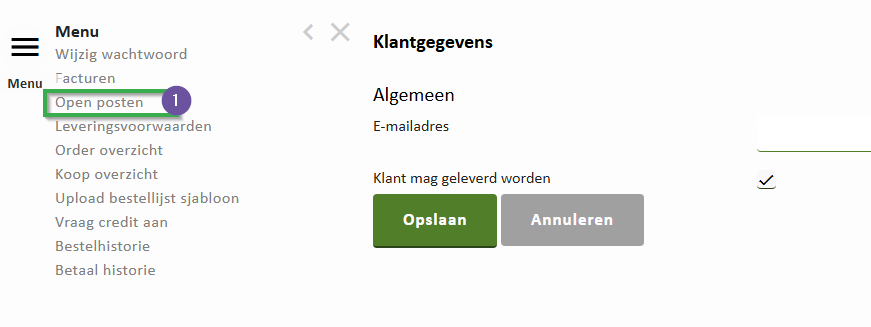
 |
| **3** | Check the box next to the open item you want to pay.

<b>Click here for an example!</b>
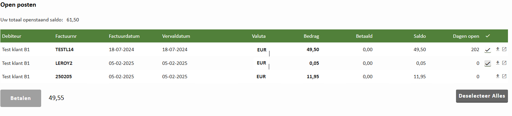
 |
| **4** | Then click **Pay**. |
| **5** | The webpage will redirect to the MultiSafePay payment screen, where the customer selects a payment method. |
| **6** | Complete the payment steps for the selected payment method. |
| **7** | You will now be redirected back to your Florishop page. |
| **8** | When you return to the open items screen (**user logo → Your account → Open items**), the open item you just paid will no longer be listed. |

## Open Items Screen

*After a payment has been made on an open item, it will also be visible in the open items screen.*  
If a payment has been made and the debtor is back within their limit, they are automatically unblocked.

| Step | Explanation |
|:-:|:--|
| **1** | Open the Florisoft Navigator and click the **Debtors** button.

<b>Click here for an example!</b>
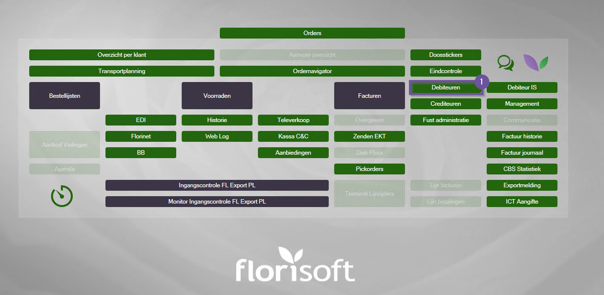
 |
| **2** | Search for the relevant debtor, enable **Show history**, and set the date range around the open item. |
| **3** | Select the open item by clicking it and pressing the space bar. |
| **4** | After selecting the open item, the completed payments will be shown under **Received payments**.

<b>Click here for an example!</b>
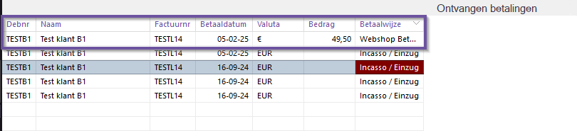
 |
