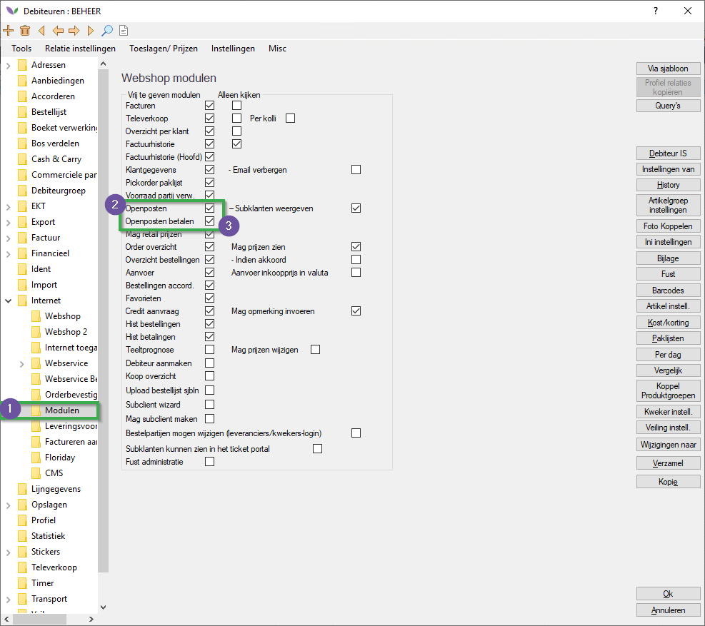
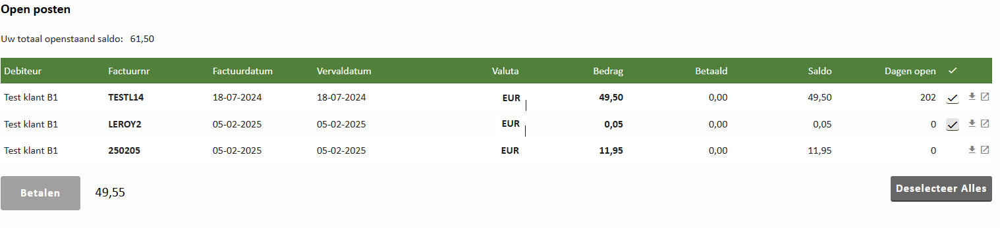

# Gebruikshandleiding Payment Gateway MultiSafePay

In deze handleiding leest u welke debiteur instellingen u moet instellen op debiteuren die met de Payment Gateway hun open posten mogen betalen.

## Debiteurinstellingen

|Stap|Uitleg|
|:-:|:--|
|**1**|In de constanten navigeert u naar : **Organen→Debiteurgegevens→Debiteuren**

<b>Klik hier voor uw voorbeeld!</b>

|
|**2**|Open vervolgens een relevante debiteur.|
|**3**|In de debiteur kaart navigeert u naar : **Factuur→Printen**

<b>Klik hier voor uw voorbeeld!</b>

|
|**4**|Stel bij **Factuur valuta** de zojuist aangemaakte valuta aan.

<b>Klik hier voor uw voorbeeld!</b>

|
|**5**|Navigeer naar de map **Internet**

<b>Klik hier voor uw voorbeeld!</b>

|
|**6**|Stel bij de instelling **Schermvaluta** de nieuw aangemaakte valuta aan.

<b>Klik hier voor uw voorbeeld!</b>

|
|**7**|Navigeer nu naar de map **Internet/Modulen**

<b>Klik hier voor uw voorbeeld!</b>

|
|**8**|Zet vervolgens de checkboxes **Openposten** & **Openposten betalen** aan.

<b>Klik hier voor uw voorbeeld!</b>

|
|**9**|Om de wijzigingen op te slaan drukt op **Ok**, waarna u de wijzigingen bevestigd|

: lightbulb: *Als u het betalen van open posten bij meerdere debiteuren wilt aanzetten kunt u gebruik maken van de **Wijzigen naar** knop. Hiermee kan u huidige wijzigingen (die u nog niet opgeslagen heeft) doorzetten naar andere debiteuren.* :lightbulb:

## Open posten betalen (perspectief van de klant)

*Om een (test) betaling te doen moet de debiteur waarmee u test beschikken over een openpost.*

|Stap|Uitleg|
|:-:|:--|
|**1**|Klik op uw user/debiteur logo rechtsbovenin de pagina, dit opent een contextmenu klik hier op **Uw account**.

<b>Klik hier voor uw voorbeeld!</b>

|
|**2**|Rechts in uw scherm ziet u een menu, klik hier op **Open posten**.

<b>Klik hier voor uw voorbeeld!</b>

|
|**3**|Zet een vinkje bij open posten waar u een betaling op wilt doen.

<b>Klik hier voor uw voorbeeld!</b>

|
|**4**|Klik vervolgens op **Betalen**

<b>Klik hier voor uw voorbeeld!</b>

|
|**5**|Dit stuurt de webpagina naar het MultiSafePay betalingsscherm, de klant selecteert hier een betalingsmethode|
|**6**|Doorloop vervolgens de stappen van een betaling bij de door u geselecteerde betaalmethode.|
|**7**|U wordt nu terug gestuurd naar uw Florishop pagina.|
|**8**|Wanneer u weer naar het open post scherm gaat (**user logo→uw account→open posten**) ziet u de zojuist betaalde open post er niet meer bij staan.|