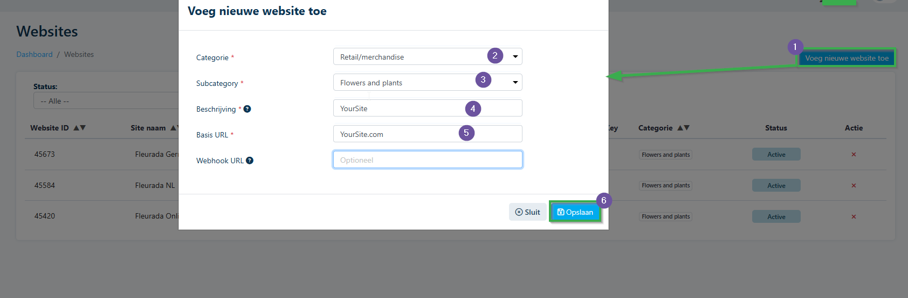

# Florisoft Handleiding Payment Gateway - Multisafepay

Deze handleiding behandelt het opzetten van de Florishop Payment Gateway addon waarmee u uw klanten open posten kan laten betalen via MultiSafePay. 

## Vereisten

Om deze handleiding te kunnen doorlopen dient u te beschikken over het volgende :

- Payment Gateway Module
- Openposten module
- Geactiveerd MultiSafePay waarbij u alle onboarding stappen heeft afgerond.
- Indien u gebruik wilt maken van PayPal dient u dit te koppelen met MultiSafePay (dit gaat buiten Florisoft om)

## Instellingen in Florisoft Backoffice

Deze stappen vinden plaats in de Florisoft backoffice, zorg dat u uw Florisoft open heeft staan.

### Aanmaken Valuta Code

|Stap|Uitleg|
|:-:|:--|
|**1**|Open vanuit de navigator de constanten (#1)

<b>Klik hier voor uw voorbeeld!</b>

|
|**2**|In de constanten navigeert u naar: **Financieel→Valuta codes**

<b>Klik hier voor uw voorbeeld!</b>

|
|**3**|Maak een nieuwe valuta code aan (#1)|
|**4**|Vul hier de volgende velden in :  **Valutacode :** EUR **Omschrijving** : een naam voor de valuta bijv. euroshop **Verkorting** : EUR **Decimalen** : 2 **Gehanteerde koers** : 100 **Reële koers** : 100 **Code boekhoud. :** zelfde als omschrijving

<b>Klik hier voor uw voorbeeld!</b>

|
|**5**|Druk nu op **Ok** om de nieuwe waarde op te slaan.|

### Instellingen debiteur

|Stap|Uitleg|
|:-:|:--|
|**1**|In de constanten navigeert u naar : **Organen→Debiteurgegevens→Debiteuren**

<b>Klik hier voor uw voorbeeld!</b>

|
|**2**|Open vervolgens een relevante debiteur.|
|**3**|In de debiteur kaart navigeert u naar : **Factuur→Printen**

<b>Klik hier voor uw voorbeeld!</b>

|
|**4**|Stel bij **Factuur valuta** de zojuist aangemaakte valuta aan.

<b>Klik hier voor uw voorbeeld!</b>

|
|**5**|Navigeer naar de map **Internet**

<b>Klik hier voor uw voorbeeld!</b>

|
|**6**|Stel bij de instelling **Schermvaluta** de nieuw aangemaakte valuta aan.

<b>Klik hier voor uw voorbeeld!</b>

|
|**7**|Navigeer nu naar de map **Internet/Modulen**|
|**8**|Zet vervolgens de checkboxes **Openposten** & **Openposten betalen** aan.

<b>Klik hier voor uw voorbeeld!</b>

|
|**9**|Om de wijzigingen op te slaan drukt op **Ok**, waarna u de wijzigingen bevestigd|

: lightbulb: *Als u het betalen van open posten bij meerdere debiteuren wilt aanzetten kunt u gebruik maken van de **Wijzigen naar** knop. Hiermee kan u huidige wijzigingen (die u nog niet opgeslagen heeft) doorzetten naar andere debiteuren.* :lightbulb:

## Betaalwijze aanmaken

*Om betalingen in de webshop terug te zien in het Open posten Debiteur scherm moet er ook een nieuw betaaltype (W) aangemaakt worden.*

|Stap|Uitleg|
|:-:|:--|
|**1**|Open het constanten scherm en navigeer naar het pad : **Financieel→Betaalwijze**

<b>Klik hier voor uw voorbeeld!</b>

|
|**2**|Indien er nog geen betaalwijze met de code **W**, bestaat maak deze aan door een nieuwe betaalwijze aan te maken.|
|**3**|Vul in het veld **Code betaalwijze** de waarde *W* in.

<b>Klik hier voor uw voorbeeld!</b>

|
|**4**|In het omschrijvingsveld vult u de waarde **Webshop betalingen** in.|
|**5**|Druk op **Ok** om de wijzigingen op te slaan. |

## Instellingen MultiSafePay portaal

Deze stappen vinden plaats in uw account portaal (oftewel de site van MultiSafePay), screenshots kunnen verschillen met wat u op uw scherm ziet. 

MultiSafePay biedt twee omgevingen aan een Live (Productie) en een Test omgeving. Deze omgevingen vereisen verschillende logingegevens (andere accounts).

**:warning: Mocht u gebruik willen maken van de test omgeving staat dit per instelling apart aangegeven wat u moet instellen.**

|Stap|Uitleg|
|:-:|:--|
|**1**|Open de onderstaande link in uw browser : https://merchant.multisafepay.com/  **Voor testen gebruik :** https://testmerchant.multisafepay.com/|
|**2**|Login met uw accountgegevens|
|**3**|Eenmaal ingelogd klikt u op **Websites**

<b>Klik hier voor uw voorbeeld!</b>

|
|**4**|Maak hier een nieuwe site aan (#1)

<b>Klik hier voor uw voorbeeld!</b>

|
|**5**|Selecteer in de categorie dropdown de optie **Retail/merchandise**|
|**6**|Selecteer onder de subcategorie dropdown **Flowers & Plants**.|
|**7**|Vul onder **Beschrijving** de naam in die u ziet in het MultiSafePay portaal|
|**8**|Bij **Basis URL** vult u de URL in van uw webshop, bijv. https://myshop.nl , zorg ervoor dat de link niet eindigd met een '/'|
|**9**|Het veld **webhook URL** kunnen we negeren, klik vervolgens op **Opslaan**.

<b>Klik hier voor uw voorbeeld!</b>

|
|**10**|Open onder websites dan vervolgens de zojuist aangemaakte website.|
|**11**|Vul hiervoor vervolgens de velden **Telefoonnummer klantenservice** & **E-mailadres klantenservice** in. 

<b>Klik hier voor uw voorbeeld!</b>

|
|**12**|Selecteer onder betaalmethoden vervolgens de betaalmethodes die u wilt gebruiken.  **Let op : bij Paypal dient u bij Multisafepay nog een aantal extra stappen te doorlopen, [zie](https://docs.multisafepay.com/docs/paypal).**

<b>Klik hier voor uw voorbeeld!</b>

|
|**13**|Voor nu willen we de volgende gegevens bij hand hebben, het is dus handig dat u deze gegevens even kopieert en plakt naar een tekstbestandje om eenvoudig naar toe te refereren.<br **Website ID (#1)** en **API-sleutel(#2)**

<b>Klik hier voor uw voorbeeld!</b>

|

## Koppeling instellen in Florisoft Backoffice

Deze instellingen vinden zich weer plaats in de Florisoft backoffice, zorg dat u de Florisoft navigator geopend heeft. 

|Stap|Uitleg|
|:-:|:--|
|**1**|Vanuit de navigator klik op **Onderhoud** in de bovenkant van het scherm. Dit open een context menu, klik hier op **Setup Systeem**.

<b>Klik hier voor uw voorbeeld!</b>

|
|**2**|Dit open het setup scherm, klik hierop het mapje **Webshop**.

<b>Klik hier voor uw voorbeeld!</b>

|
|**3**|U krijgt hier de melding dat geheime sleutels niet worden getoond, dit houdt in dat je API-sleutels na het invullen & opslaan niet meer terug ziet in dit scherm. De API keys zijn uiteraard wel opgeslagen maar worden vanwege veiligheidsredenen niet meer getoond.|
|**4**|In het MultiSafePay portaal kopieert u de **API-sleutel** waarde, deze plakt u vervolgens in deze twee velden **Geheime sleutel (secretKey)** en **Herhaal geheime sleutel**.

<b>Klik hier voor uw voorbeeld!</b>

|
|**5**|In het veld **Sleutelversie (keyVersion** vult u de waarde **1** in.|
|**6**|U gaat nu weer naar het MultiSafePay portaal om vervolgens het **Website ID** te kopiëren. Deze waarde plakt u vervolgens in het veld **Identificatie(merchantID)**.|
|**7**|In het veld **Post URL** vult u de volgende waarde in : https://api.multisafepay.com/v1/json/  **En voor het testen :** https://testapi.multisafepay.com/v1/json/|
|**8**|In de veld **Return Url** en **Response Url** vult u deze waarde in :  *<https://jouwshop.nl>/Service/MultiSafepay/ParseResponse*.  Waar u jouwshop.nl vervangt met de homepage/basis URL van uw Florishop.

<b>Klik hier voor uw voorbeeld!</b>

|
|**9**|Nadat u deze velden heeft in gevuld drukt u op de **Ok** om de wijzigingen op te slaan.|
|**10**|Herstart uw Florisoft backoffice applicatie!|

## Webshop instellingen

|Stap|Uitleg|
|:-:|:--|
|**1**|Ga naar uw Florishop en log in met beheer/admin debiteur.|
|**2**|Klik vervolgens op uw user logo, dit opent een klein menu'tje waarin u drukt op de **beheer** knop.|
|**3**|U ziet nu bovenin het scherm op de knop configuratie, dit opent een context menu'tje waarin u op de optie **betaalconfiguratie** klikt.

<b>Klik hier voor uw voorbeeld!</b>

|
|**4**|Ga naar de optie **Multisafepay** en klik op **Settings**.

<b>Klik hier voor uw voorbeeld!</b>

|
|**5**|Check de waardes van **POSTURL**, **RESPONSEURL** en **RETURNURL**.

<b>Klik hier voor uw voorbeeld!</b>

|
|**6**|Open de instelling **SECURITYKEY**, plak hier de **Multisafepay API key**.|

## Herstarten van uw shop

Recycle nu de Florishop applicatie in IIS, dit is nodig om de waardes ook te veranderen in de webshop. Weet u niet hoe u dit doet dient u Florisoft Support te contacten.

**:warning: Let op! : bij het recyclen herstart u webshop, de klanten die op dit moment iets aan het kopen zijn ondervinden hier dus ook hinder van, doe dit op een moment wanneer er weinig tot geen bezoekers zijn op uw shop.** 

## Open posten betalen (perspectief van de klant)

*Om een (test) betaling te doen moet de debiteur waarmee u test beschikken over een openpost.*

|Stap|Uitleg|
|:-:|:--|
|**1**|Klik op uw user/debiteur logo rechtsbovenin de pagina, dit opent een contextmenu klik hier op **Uw account**.

<b>Klik hier voor uw voorbeeld!</b>

|
|**2**|Rechts in uw scherm ziet u een menu, klik hier op **Open posten**.

<b>Klik hier voor uw voorbeeld!</b>

|
|**3**|Zet een vinkje bij open posten waar u een betaling op wilt doen.

<b>Klik hier voor uw voorbeeld!</b>

|
|**4**|Klik vervolgens op **Betalen**|
|**5**|Dit stuurt de webpagina naar het MultiSafePay betalingsscherm, de klant selecteert hier een betalingsmethode|
|**6**|Doorloop vervolgens de stappen van een betaling bij de door u geselecteerde betaalmethode.|
|**7**|U wordt nu terug gestuurd naar uw Florishop pagina.|
|**8**|Wanneer u weer naar het open post scherm gaat (**user logo→uw account→open posten**) ziet u de zojuist betaalde open post er niet meer bij staan.|

## Open posten scherm

*Nadat er een betaling op een openpost heeft plaats gevonden ziet u deze ook terug in het open posten scherm.*
Als een betaling heeft plaats gevonden (en de debiteur weer onder zijn/haar limiet zit) wordt deze automatisch gedeblokkeerd. 

|Stap|Uitleg|
|:-:|:--|
|**1**|Open de Florisoft navigator en klik op de knop **Debiteuren**.

<b>Klik hier voor uw voorbeeld!</b>

|
|**2**|Vervolgens zoekt u de betreffende debiteur, zet vervolgens Historie tonen aan en zet op data die rondom de openpost vallen.|
|**3**|Selecteer de open post (klikken op met spatie).|
|**4**|Nadat u de open post geselecteerd heeft zullen onder **Ontvangen betalingen** de uitgevoerde betalingen getoond worden.

<b>Klik hier voor uw voorbeeld!</b>

|
