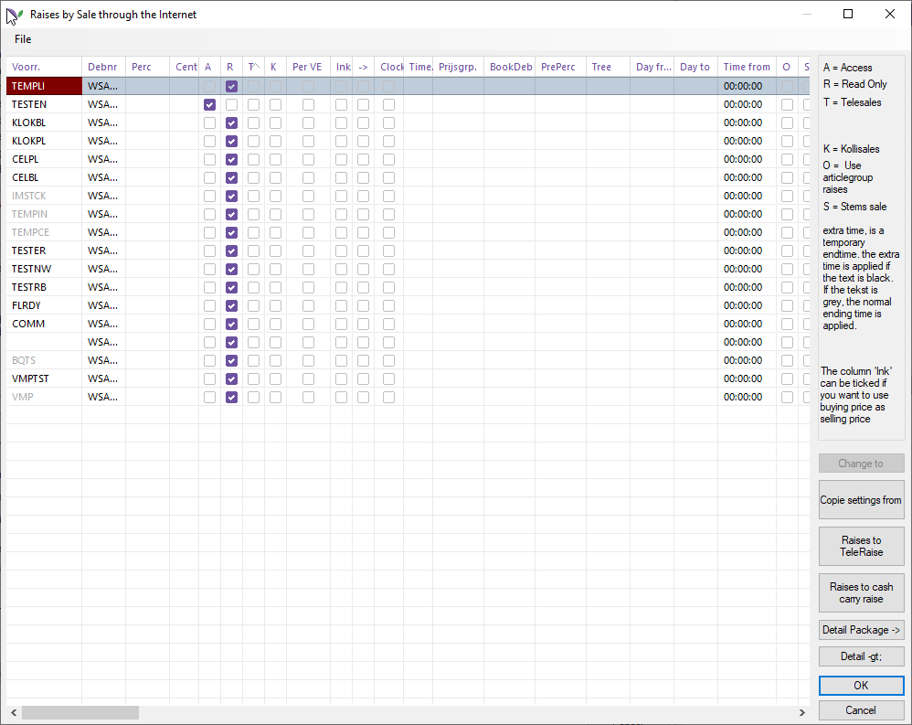
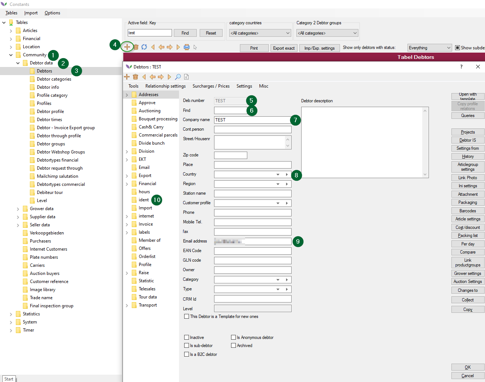
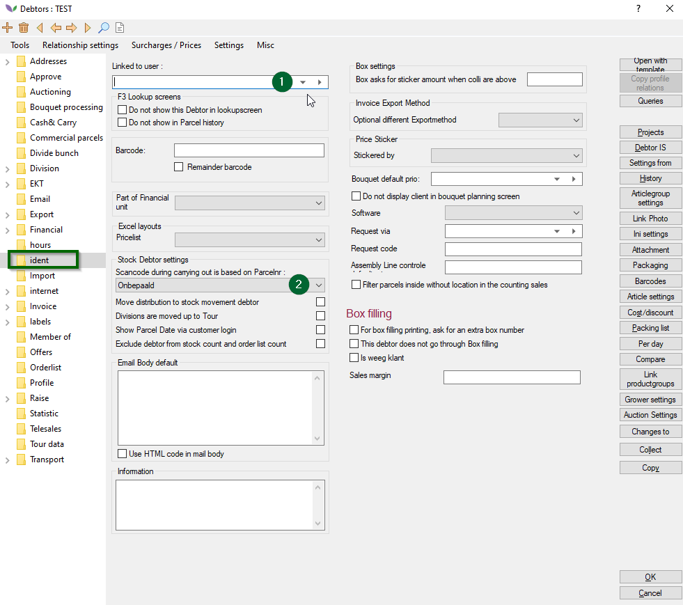
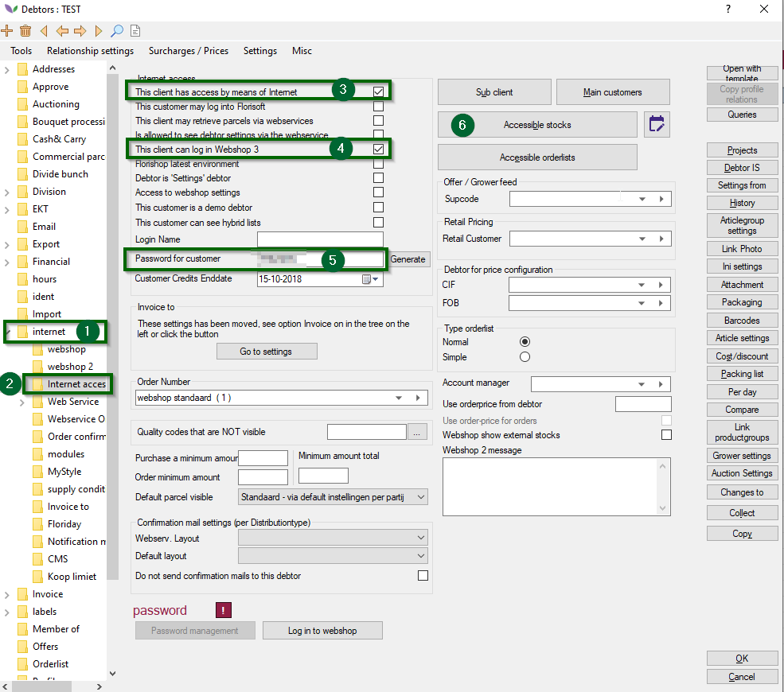
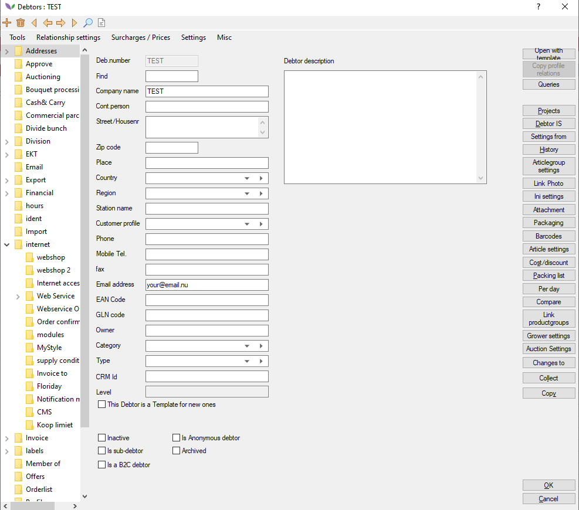
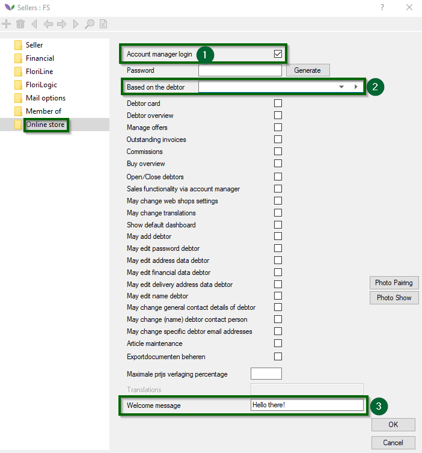
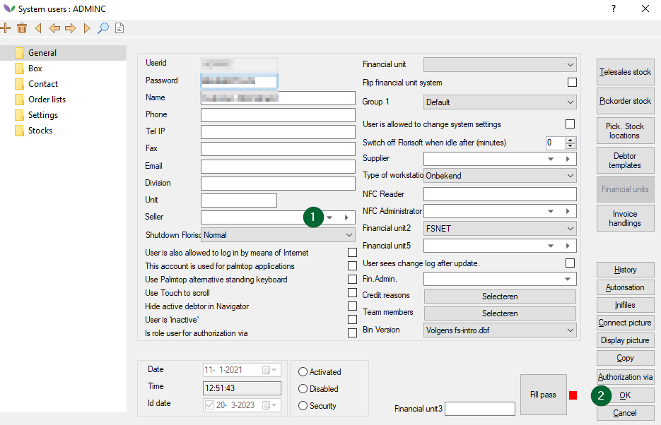
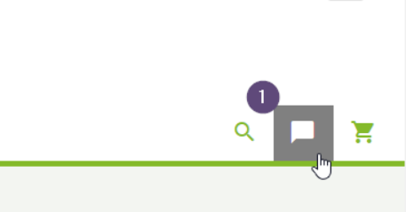

# Florisoft Manual FloriShop Addon Pop-Up Chat & Notification (M161)

This document describes the operation of the chat function in FloriShop. The idea behind this feature is that logged-in customers on the webshop can communicate directly with their account manager (salesperson). The salesperson, of course, has the option to chat "back" to the customer. In practice, it often happens that customers want some more information about a product before making a purchase. The chat function within the webshop plays an important role in this.

Florisoft employees should already have gone through the Florisoft system settings before you start with this manual. The same applies to the Florishop settings regarding the use of the chat function.

## Table of Contents

[Create debtor groups](#debtor-group-creation)  
[Create a salesman](#create-salesman)  
[Link salesperson as account manager](#salesperson-link-as-account-manager-to-debtors)  
[Testing](#testing)  
[Link salesman to system user](#salesman-link-to-system-user)  
[Set up pop-up notification center](#pop-up-notification-center-set-up)

## Creating Debtor groups

*Because the chat function is built on top of the Sales add on, it is necessary to divide the debtors who will use the chat function into debtor groups. The idea behind this is that each salesperson is responsible for contacting x number of customers. All customers belonging to a salesperson should be grouped into a debtor group.   go through the following steps:*

|Step|Explanation|
|:--|:--|
|**1**| In the constants, navigato the the following path: **Community -> Debtor data -> Debtor groups.**
|**2**| Create a new debtor group here by pressing the plus sign. Then enter an appropriate description here.
|**3**| In the following table, select all debtors who are part of the group.

<b>Click here for the example image</b>

|
|**4**| Save the new group

## Setting up sales reps for the chat function

To use the chat function, it is important that the salespeople are properly set up and have access to the webshop. This requires setting up some interconnections between debtors and system users. Below is a simple representation on how this is done.
details>
<b>Click here for the example image</b>

|

## Creating a webshop sales debtor

*Since, from a technical point of view, only debtors can log into the webshop, a separate debtor is needed, which is linked to the seller in the next step. In turn, the salesperson will later be linked to the salesperson's system user. Below is an overall roadmap for creating a sales debtor.   A sales debtor is technically nothing more than a 'normal' Florisoft debtor. Other names for a webshop sales debtor are: webshop sales debtor, sales debtor or sales debtor.*

:warning: **Please note:** each salesperson must be associated with its own sales debtor. So one salesperson also means one sales debtor. Two salesmen also means two sales debtors in the system. In other words: the number of sales debtors must equal the number of sales representatives.

**Go through the following steps:**
|Step|Explanation|
|:--|:--|
|**1**| In the constants, navigate to the path: **Community-> Debtor data-> Debtors**
|**2**|Create a new debtor by pressing the plus icon.|
|**3**|If a sales debtor template exists use it if not you can create one.
|**4**|Fill in the following:   **Deb.Number**: fill this in with recognizable values by using the word SALES + ... here  **Search** do the same here   **Company name** make clear here that this is about a sales debtor, for example: "*Florishop Sale Debtor*".  **Country**: country in which the seller is active.  **E-mail** the communication email of the seller should be filled in here

<b>Click here for the example image</b>

|
|**5**| Navigate to the map **Ident**
|**6**| In the field "Linked to user" fill in"the system user of the seller (nr.8)

<b>Click here for the example image</b>

|**7**| **Navigate to the tab : Internet-> internet acces**
|**8**| Turn on the following setting:   **This client has access by means of internet**   This client can log in to Webshop 3
|**9**| Click on **Accessible Stocks** and give the debtor access to the stocks you want them to have access to.|
|**10**|Now enter the password for the webshop login for the seller.

<b>Click here for the example image!</b>

|
|**11**|Confirm the debtor creation by clicking the Ok button and closing it.|

### Creating a debtor template

*Follow the steps below to create debtor template:*

|Step|Explanation|
|:-:|:--|
|**1**|Make a debtor in the following path: **Community→Debtor data→Debtors**|
|**2**|Create a new debtor.|
|**3**|Fill out the following fields: -**Deb.nr**: set this to recognizable code such as Sales -**Search**: do the same here -**Description**: give the debtor a compact description, note this will be visible in the system.|
|**4**|Now configure the settings that are required for your specific needs for this debtor. The steps required for debtors in this manual can be found [here](#creating-a-webshop-sales-debtor).|
|**5**|Save the "debtor". When creating a new debtor you should now see your newly created debtor template in the selection menu. |

## Creating sellers

*Follow the steps below to create a seller, in this chapter we will couple the previously created debtor to the seller.*

|Step|Explanation|
|:-:|:--|
|**1**|Navigate to the following path: **Community→Seller data→Sellers**|
|**2**|Create a new seller by clicking on the + button.|
|**3**|Fill out the following required fields: - **Code seller**: fitting alphanumeric seller code - **Name seller**: Seller name

<b>Click here for the example image!</b>

|
|**4**|Navigate to the **Online store** tab.|
|**5**|Change the following settings: - **Account manager login:** enable this setting - **Based on the debtor**: select the previously created to the debtor to link it to the seller.

<b>Click here for the example image!</b>

|
|**6**|Save the seller.|

## Coupling sellers to debtors as an account manager

The previously created seller needs to be coupled to the corresponding debtors. The connections are to be set on the individual debtor:

|Step|Explanation|
|:-:|:--|
|**1**|Navigate to the following path in teh constants screen: **Community→Debtor data→Debtor**|
|**2**|Open the debtor that needs to be coupled.|
|**3**|Navigate to the tab: **Internet→Internet access**

<b>Click here for the example image!</b>

|
|**4**|Choose the right seller in the Account manager field.|
|**5**|Save the made changes to the debtor by closing it.|
|**6**|Repeat the steps steps made till now for every seller.|

## Coupling the seller to a system user

*Follow the steps below to connect a seller to a system user:*

|Step|Explanation|
|:-:|:--|
|**1**|Navigate to the following path in the constatns screen: **System→User→System users**|
|**2**|Open a system user|
|**3**|Select the right seller in the field called **seller** that needs to be linked to the system user. 

<b>Click here for the example image!</b>

|
|**4**|Save the made changes.|

## Testing

*This step shows you how the chatfunction works on the Webshop and in the Florisoft application. This is tested in a way that takes place in a real scenario.*

|Step|Explanation|
|:-:|:--|
|**1**|Restart the webshop: 1. Open IIS 2. Open the application pool screen 3. Click on the **Florishop** application 4. Click on the **Recycle** button in the *actions* screen.|
|**2**|Do the same here: Open the Florisoft navigator and click on the "Fidgets" button in the top bar, then activate the "Intercommunication chat" setting.  This opens the fidget chatfunction on the right side of the screen.

<b>Click here for the example image!</b>

|
|**3**|Log in to the webshop using a seller(linked debtor)|
|**4**|Click on speech balloon to open the chat function.

<b>Click here for the example image!</b>

|
|**5**|Type a message for the seller in the designated field. Then click on send or press the Enter key to send the message.|
|**6**|As soon as a debtor sends a message from the webshop, a new tab opens in the fidgets with the debtor code (no. 1) and the sent message (no. 2).|
|**7**|Type your answer in the text field in the bottom part of the fidget screen(nr. 3) and press enter. |
|**8**|The answer message will now be shown in webshop chat window.|

## Setting up the pop-up & notification center

*Setting the steps below to create a notification:*

|Step|Explanation|
|:-:|:--|
|**1**|Navigate to the following path in the constants screen: **System→Notification messages**|
|**2**|Create a new notification by clicking on the + icon.|
|**3**|Fill out the following fields: **ID**: give the notification an ID **Default title**: give the notification a title **Default message**: give the message a default body **Amount of times**: is disabled if show infinite amount of times is enabled, if enabled you will need to specify how many times the notification is shown. **Show infinite amount of times**: disable this setting, specify the amount of times that this message needs to be shown.|
|**4**|If you always want to show a notification within a certain time frame, check the **Message never expires** checkbox. You will then have no end date.  At **Valid from / Valid until** you specify within which period the notification should be shown. The notification will not be shown outside this period.|
|**5**|In the **webpage type** field you'll choose where the notification is shown. For now the only option available option is **Home**.|
|**6**|In the tables below you can enter translations for the title and message body. |
|**7**|To authorize a debtor by clicking on the debtor on the **Linked debtor** button, here you'll give debtors access to see the notification by checking the checkbox in the '*Is coupled*' column.|

### How its shown on the webshop

If the notification center was set up correctly you should now see a notification pop-up on the Webshop:

**Default message**

If you want to see older messages, click the bell icon.
