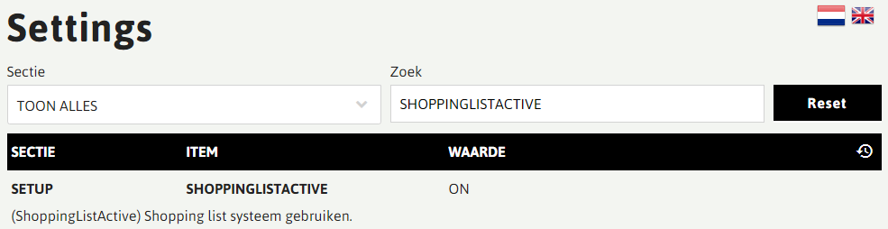
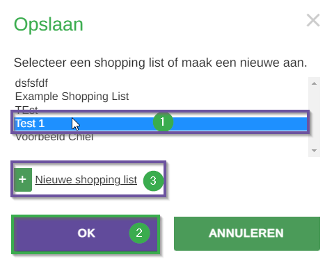
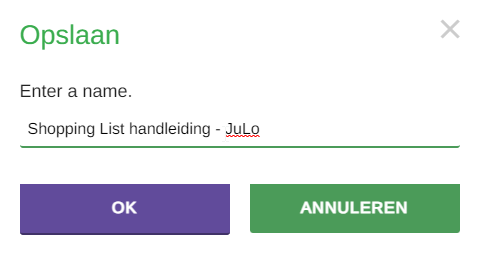
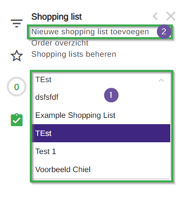
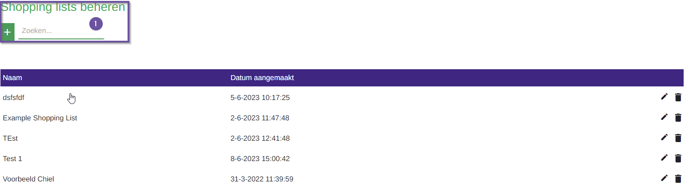
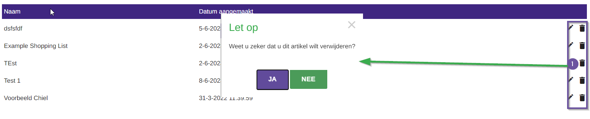
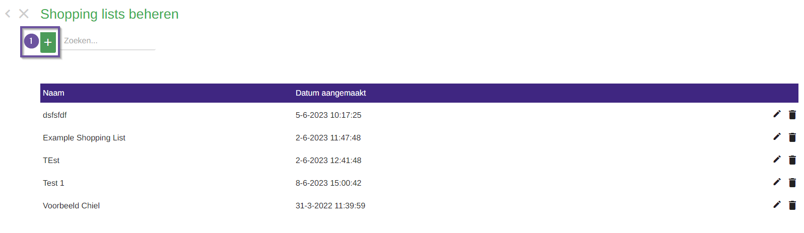
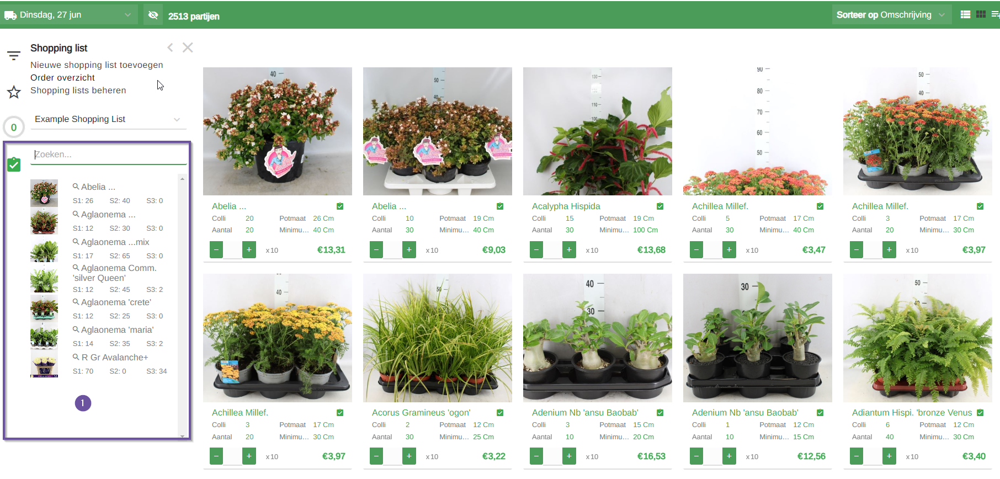

# Florisoft handleiding Florishop Addon Shopping List (M135)

Welkom bij tot de Florishop Addon Shopping List handleiding. In deze handleiding leert u over het instellen van de nodige instellingen en het gebruik van de module. 

**Disclaimer #1:** Deze module werkt alleen voor voorraadlijsten en niet met bestel- of hybridelijsten.

**Disclaimer #2:** De shoppinglist functionaliteiten zijn alleen beschikbaar op de desktop weergave en niet op de app of mobiele weergave.

## Instellingen back-office

*Debiteuren moeten geautoriseerd zijn om aan het orderoverzicht partijen toe te voegen. Doe je dit niet zie je deze niet terug komen in de shopping list.   Volg hier voor de onderstaande stappen:*

|Stap|Uitleg|
|:-:|:--|
|**1**|Open de debiteurkaart: **Organen→Debiteurgegevens→Debiteuren**|
|**2**|In de debiteurkaart ga naar: **Internet→Modulen**|
|**3**|Zet de instelling **Order overzicht** aan.

<b>Klik hier voor uw voorbeeld!</b>

|

## Instellingen Florishop

*Volg de onderstaande stappen om de module op uw Florishop te activeren*:

|Stap|Uitleg|
|:-:|:--|
|**1**|Login op uw Florishop met een beheer account en zet de beheermodus aan. 

<b>Klik hier voor uw voorbeeld!</b>

|
|**2**|Open het webshopinstellingenscherm, **Configuratie→Webshop instellingen**  Of door **/settings** achter de webshop URL te zetten.

<b>Klik hier voor uw voorbeeld!</b>

|
|**3**|Zoek in het instellingen scherm naar de instelling **SHOPPINGLISTACTIVE**, zorg ervoor dat deze aan staat.

<b>Klik hier voor uw voorbeeld!</b>

|
|**4**|Zoek nu naar de instelling **MATCHWEIGHTINGS**, met deze instelling bepaalt u hoe de matchscore wordt berekent aan de hand van gewichten.   Met deze matchscore krijgt u inzicht in hoeverre een partij uit de shoppinglist en het eventuele alternatief (uit de voorraad) overeenkomen.|
|**5**|Vul nu de gewichten in hoeveel elke waarde meegenomen wordt in het berekenen van een matchscore. De hoogte van getallen maakt niet uit, 1-10 of 1-100 zijn in essentie hetzelfde.  Bij de S waarden is de berekening van het gewicht anders, hier wordt gekeken of het verschil 5, 10 of 20 procent is. Op basis hiervan wordt bepaald of de gehele waarde, 2/3, 1/3 of helemaal niet meegenomen worden. S waardes die null zijn worden niet meegenomen.   Bij het toevoegen van een partij aan een shoppinglist wordt het partijnummer opgeslagen, partijen met hetzelfde partijnumer zullen een matchscore hebben. Er wordt niet gekeken naar de gewichten.   **De onderstaande afbeelding geeft een goed vooreeld van gewichten**|
|**6**|**Handige dingen om te weten:**  **Wanneer is iets een duplicaat?**: wanneer artnr, S1, S2 en S3 overeenkomen. Deze worden niet getoont.  **CELCOD:** Partij moet altijd aan een CELCOD (productgroep) gekoppeld zijn, anders kan het niet gevonden worden. 

<b>Klik hier voor uw voorbeeld!</b>

|

## Shoppinglist aanmaken

*In de Shoppinglist module zijn er aantal manieren voor het aanmaken van een shopping list. Deze worden hieronder beschreven*.

### Shopping list aanmaken op een partij

|Stap|Uitleg|
|:-:|:--|
|**1**|In uw voorraad ziet u per voorraadpartij een shoppinglist icoon te zien. Klik op dit shopping list icoontje om het popupscherm te openen.

<b>Klik hier voor uw voorbeeld!</b>

|
|**2**|In dit popupscherm kan u kiezen ervoor een bestaande shoppinglist te gebruiken of er zelf een aan te maken. |
|**2.a**|Wilt u gebruik maken van een bestaande lijst? Kies dan een shoppinglist uit de lijst bestaande shoppinglists en druk op **Ok**.

<b>Klik hier voor uw voorbeeld!</b>
</details|
|**2.b**|Maakt u een nieuwe lijst aan? Klik dan op **Nieuwe shopping list toevoegen** voer een naam in en druk op Ok. De partij waarvoor u de nieuwe shopping list heeft aangemaakt wordt automatisch toegevoegd.

<b>Klik hier voor uw voorbeeld!</b>
</details|

### Shopping list aanmaken via zijkant scherm

|Stap|Uitleg|
|:-:|:--|
|**1**|Aan de zijkant van uw voorraad scherm klikt u op het shoppinglist icoon. Mocht u dit scherm ingeklapt hebben wordt deze nu geopend in een verkleinde weergave.  Wilt u dit vast zetten aan de zijkant van uw scherm klik dan op het **>** teken.

<b>Klik hier voor uw voorbeeld!</b>

|
|**2**|In dit scherm kan u de bestaande shoppingslists inzien of er zelf een aan te maken.|
|**2.a**|Klik op de geselecteerde lijst in dit zijscherm om de lijstweergave te openen.(#1)|
|**2.b**|Klik op de **Nieuwe shopping list toevoegen**(#2) optie om de shopping list creatie pop up te openen. Vul hier de naam in voor uw nieuwe shopping list en druk op **Ok**.

<b>Klik hier voor uw voorbeeld!</b>

|

### Orders toevoegen aan shoppinglist

|Stap|Uitleg|
|:-:|:--|
|**1**|Aan de zijkant van uw voorraad scherm klikt u op het shoppinglist icoon. Mocht u dit scherm ingeklapt hebben wordt deze nu geopend in een verkleinde weergave.  Wilt u dit vast zetten aan de zijkant van uw scherm klik dan op het **>** teken.|
|**2**|Klik op de optie **Order overzicht** om uw orders in te zien.

<b>Klik hier voor uw voorbeeld!</b>

|
|**3**|In het order overzicht scherm ziet u de orders van uw account met bestelde partijen per order.   U kan in dit scherm door op het shoppinglisticoon naast het ordernummer(#1) te klikken om een heel order toe te voegen of individuele partijen(#2) uit de order handmatig toe te voegen.

<b>Klik hier voor uw voorbeeld!</b>

|
|**4**|Door op het shoppinglist icoon te drukken krijgt u een pop-up te zien met de vraag om een bestaande of nieuwe shopping list te gebruiken.

<b>Klik hier voor uw voorbeeld!</b>

|
|**5**|*Ziet u orders niet op uw scherm staan?* Check of de datum filter goed staat ingesteld om uw gewenste order te vinden.

<b>Klik hier voor uw voorbeeld!</b>

|

## Shopping list managementscherm

*Wilt u shopping lists inzien, aanmaken, wijzigen of verwijderen kan dat in het shopping list managementscherm. Volg de onderstaande stappen:*

|Stap|Uitleg|
|:-:|:--|
|**1**|Klik op het shopping list icoon aan de zijkant van uw scherm.|
|**2**|Klik in dit scherm vervolgens op de optie **Shopping lists beheren**, dit brengt u naar het shopping list managementscherm.

<b>Klik hier voor uw voorbeeld!</b>

|
|**3**|Kan u uw shopping list niet vinden? Maak dan gebruik van de zoekfunctie.

<b>Klik hier voor uw voorbeeld!</b>

|
|**4**|Wilt u een shoppinglist verwijderen? Klik dan op het prullenbak icoon en bevestig uw actie.

<b>Klik hier voor uw voorbeeld!</b>

|
|**5**|Om een shopping list aan te maken klikt u op de knop naast de zoekbalk, voer een naam in en bevestig het aanmaken.

<b>Klik hier voor uw voorbeeld!</b>

|
|**6**|Bij het aanmaken van een shoppinglist via het managementscherm wordt u gebracht naar het partijen toevoegen scherm.   In dit scherm kan u partijen toevoegen door op het vinkje naast de partij te drukken. U ziet uw huidige selectie automatisch geüpdatet worden aan de linkerkant van uw scherm. Uiteraard kan u er ook voor kiezen om vinkjes weg te halen om partijen uit de shopping list te verwijderen.  Bent u klaar met het toevoegen van partijen **vergeet niet** te drukken op selectie opslaan! Doet u dit niet worden de wijzigingen niet opgeslagen.

<b>Klik hier voor uw voorbeeld!</b>

|
|**7**|Wilt u shopping lists wijzigen? Klik dan op het pen icoontje in de rij van de shoppinglist. U wordt nu naar de beheer pagina gebracht van de betreffende shopping list.    Verwijder partijen uit de shopping list door op het prullenbak icoontje te drukken en het verwijderen te bevestigen.

<b>Klik hier voor uw voorbeeld!</b>

|

## Shoppinglist openen in voorraad

*Zodra u een of meerdere boodschappenlijsten heeft aangemaakt, kunt u nu zien welke items uit uw lijst aanwezig zijn in de voorraad of mogelijke alternatieven.*

|Stap|Uitleg|
|:-:|:--|
|**1**|Open het shoppinglist managementscherm.|
|**2**|Klik vervolgens op het pen/edit icoontje naast een shoppinglist.

<b>Klik hier voor uw voorbeeld!</b>

|
|**3**|Klik op in het edit scherm op de knop **openen in voorraad**.

<b>Klik hier voor uw voorbeeld!</b>

|
|**4**|U ziet nu dat de shoppinglist inzichtbaar is links onderin het scherm. Klik vervolgens nu op een van de artikel in de shoppinglist.

<b>Klik hier voor uw voorbeeld!</b>

|
|**5**|U ziet nu dat de voorraad nu gefilterd wordt op basis van het shoppinglist artikel. In de resulterende partijkaartafbeeldingen ziet u een percentage staan wat betekent in hoeverre de partijen matchen.  Deze matchscore wordt berekent op basis van de **MATCHWEIGHTINGS** florishop instelling.

<b>Klik hier voor uw voorbeeld!</b>

|