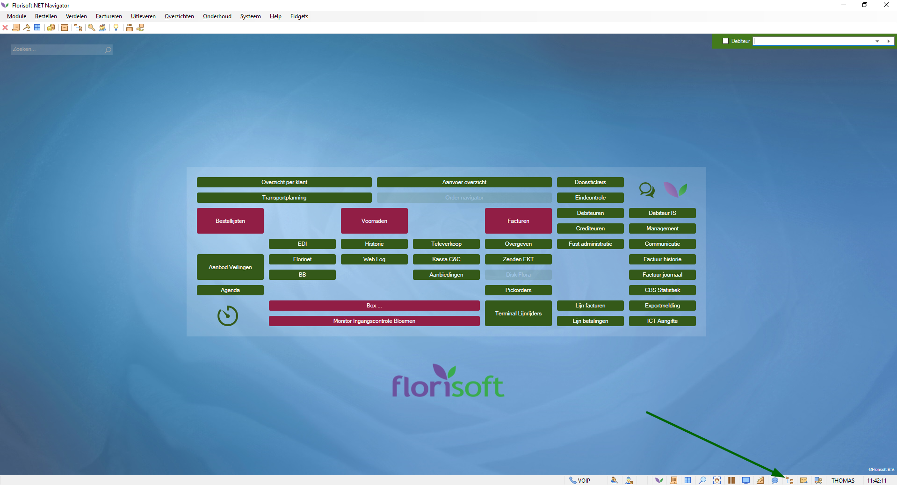
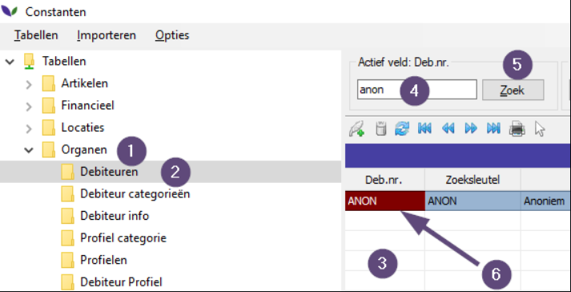
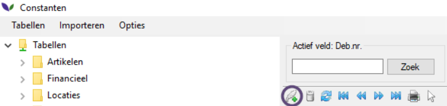
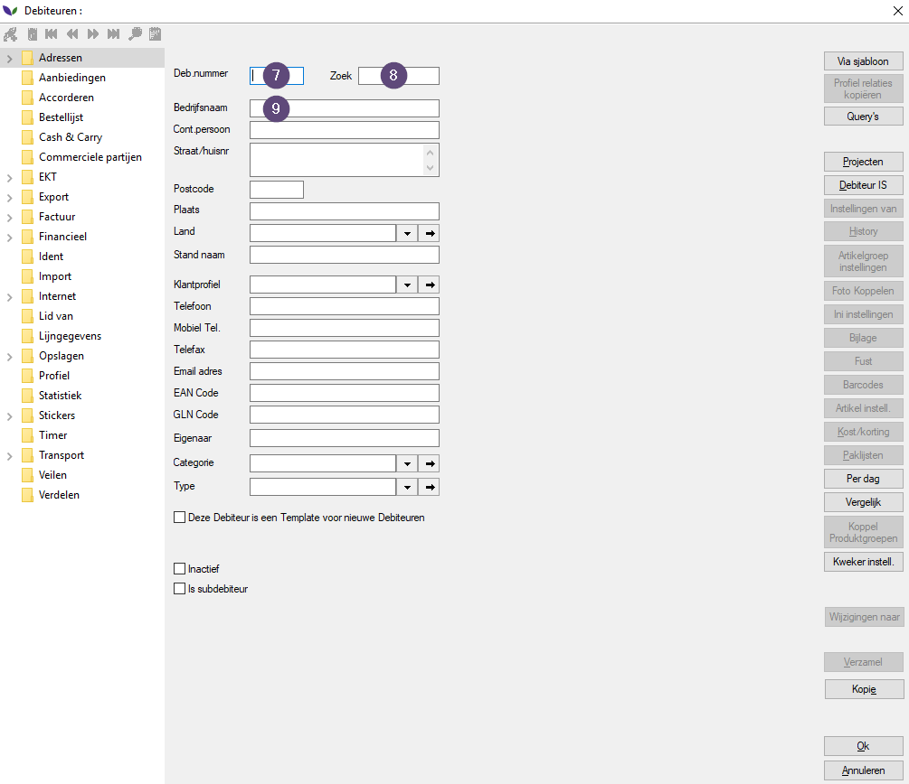
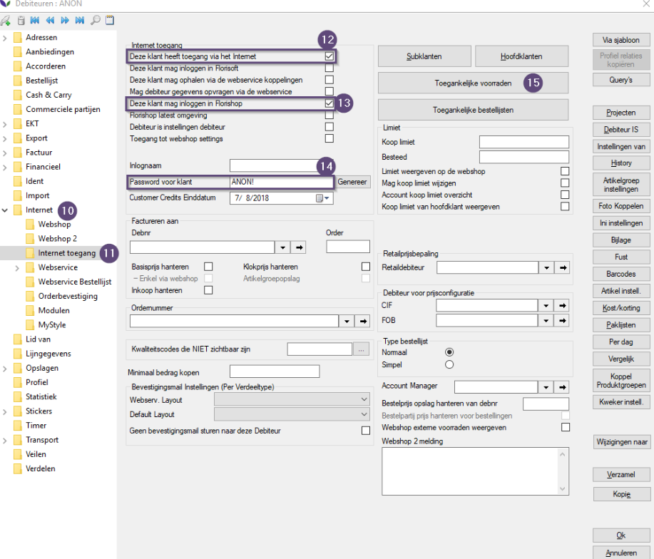
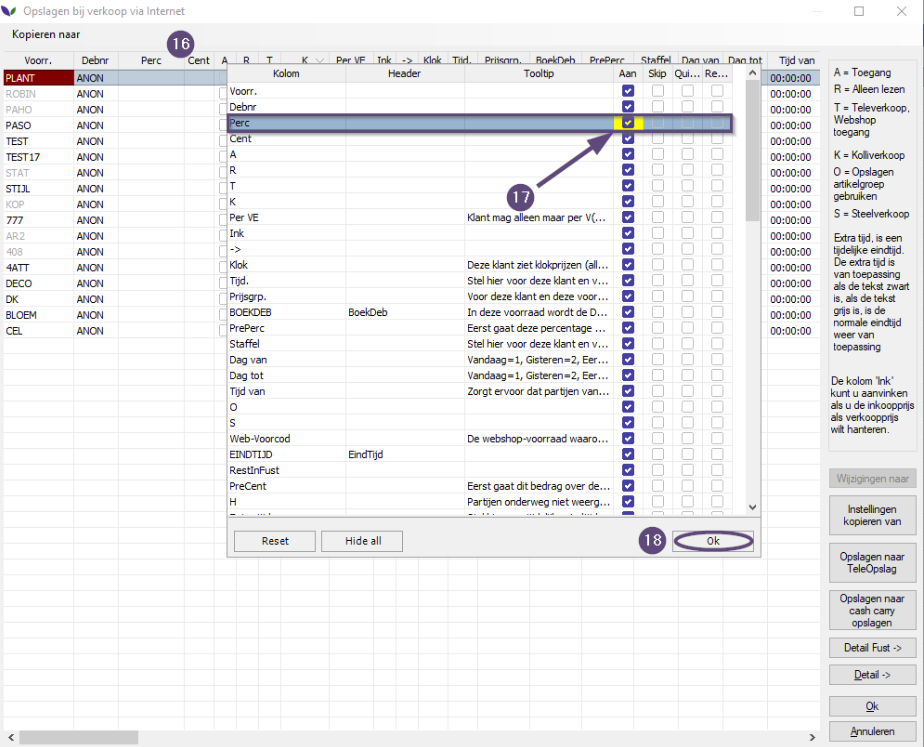
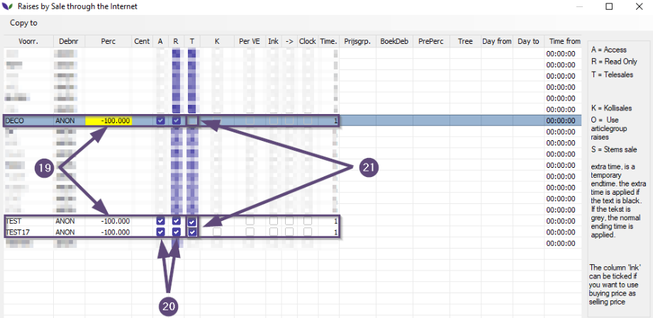
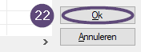

# Handleiding Aanmaken anonieme debiteuren

## Inleiding

Deze handleiding gaat over het aanmaken van anonieme debiteuren. Een anonieme debiteuren kan bijvoorbeeld wel de voorraad in de webshop zien, maar niet de prijzen. Zie het als een soort gast account.

|Stap|Uitleg|
|:--|:--|
|**1**| Open de Constanten in Florisoft door te klikken op het onderstaande icoon

**Klik hier voor de voorbeeld afbeelding**

| 
|**2**| Open het tabblad Debiteuren via Organen (#1) -> Debiteuren (#2)
|**3**| Klik één keer in de kolom 'Deb. Nr.'

**Klik hier voor de voorbeeld afbeelding**

| 
|**4**| Typ in het zoekveld **__anon__** en druk op **Enter** of klik op de knop **zoek** (#5)
|**5**| Wanneer er een anonieme debiteur bestaat in het systeem wordt deze nu als resultaat weergegeven in de lijst met debiteuren (#6) 

 

:note: Wanneer er geen anonieme debiteur gevonden wordt, dient deze aangemaakt te worden.

|Stap|Uitleg|
|:--|:--|
|**1**| Klick op de knop **Add new item** op het tabblad **Debiteuren** van het venster **Constanten**. Het venster **Debiteuren :** opent

**Klik hier voor de voorbeeld afbeelding**

| 
|**2**| Vul op het tabblad **Adressen** in het venster **Debiteuren :** de volgende gegevens in:

**Klik hier voor de voorbeeld afbeelding**

| 7 = ANON, 8 = ANON - 9 = Anonieme Debiteur

-----

|Stap|Uitleg|
|:-:|:--|
|**1**|Navigeer naar het tabblad **Internet** (#10) -> **Internet toegang** (#11) en zet de vinkjes "Deze klant heeft toegang via het internet" (#12) en "Deze klant mag inloggen in Florisoft" (#13)|
|**2**|Vul in het veld "Password voor de klant" de waarde **ANON!** in (#14)

**Klik hier voor de voorbeeld afbeelding**

|**3**|Klik op de knop ‘Toegankelijke voorraden’ (#15) in het venster ‘Debiteuren’. Het venster ‘Opslagen bij verkoop via Internet’ opent. Lees verder op de volgende pagina.|
|**4**|

**Klik hier voor de voorbeeld afbeelding**

|
|**5**|Zet de 'A' ,' R' en 'T'-vinkjes (nr. 20) aan voor de voorraden die u toegankelijk wil maken via de webshop.

**Klik hier voor de voorbeeld afbeelding**

|
|**6**|Vul hier in de "PERC" kolom "-100.000" in. Zo kan de anonieme debiteur geen prijs zien op deze specifieke voorraad. Diegene ziet dan alleen "---"

In het bovenstaande voorbeeld zijn voor de voorraden TEST, BLOEM, DECO en TEST17 de vinkjes 'A','R' & 'T' aangevinkt. Dit betekent dat deze voorraden zichtbaar zijn voor de anonieme debiteur maar dat hij er niet vanuit kan kopen omdat het read-only is (R).

<!--
Het vinkje ‘T’ (#21) bepaalt of de debiteur mag kopen via de webshop. Voor de anonieme debiteur geldt in de regel dat deze nooit mag kopen via de webshop.

|Stap|Uitleg|
|:--|:--|
|**1**|Zet het ‘T’-vinkje (#21) voor de betreffende voorraden aan. :warning:Let op: zorg er voor dat voorraden die gebruikt worden in combinatie met WhatsApp delen altijd de vinkjes A en R hebben ingeschakeld en het T - vinkje uit staat.
|**2**| Klik op de 'Ok' (#22) in het venster 'Opslagen bij verkoop via internet' om de wijzigingen aan de voorraad autorisatie voor de anonieme debiteur te bevestigen. 

**Klik hier voor de voorbeeld afbeelding**

|**3**|Klik op de knop "OK" in het venster **Debiteuren: ANON" om alle instellingen te bevestigen

 
-->
De anonieme debiteur is nu aangemaakt met de juiste instellingen wat betreft de autorisatie

