# Comprehensive Guide to the Content Management System (CMS) Add-on

> **Note:** Because the CMS is continuously being developed, some screenshots and steps in this guide may differ from the current version of the system.
>
> **Note:** This document is still being expanded.

## Table of Contents

### Management Screens

---

#### 1. Pages
- [Categories](#categories)
- [Page](#page)
- [Blog Categories](#blog-categories)
- [Blog Page](#blog-page)
- [Edit Footer](#edit-footer)
- [Templates](#templates)

#### 2. Advanced
- [Theme Configuration](#theme-configuration)
- [Backups](#backups)
- [Redirects](#redirects)
- [Pending Changes](#pending-changes)
- [Form Tracking](#form-tracking)
- [Component Styles](#component-styles)
- [Color Groups (Dashboards)](#color-groups-dashboards)

#### 3. Other
- [Media](#media)
- [Documents](#documents)
- [Links](#links)

---

### Aside Editor

---

#### 1. Toolbar
- [Menu](#menu)
- [Search](#search)
- [CMS Editor](#cms-editor)
- [Drag & Drop](#drag--drop)
- [SEO](#seo)
- [Preferences](#preferences)

#### 2. Responsive Tabs
- [Desktop](#desktop)
- [Tablet](#tablet)
- [Mobile](#mobile)

#### 3. General Settings
- [Translations](#translations)

#### 4. Styling
- [Color Picker](#color-picker)
- [Border](#border)
- [Margin/Padding](#marginpadding)
- [Border Radius](#border-radius)
- [Height/Width](#heightwidth)
- [Box Shadow](#box-shadow)
- [Overflow](#overflow)

#### 5. Advanced
- [Hide When Empty](#hide-when-empty)
- [Identification Name](#identification-name)
- [Slot Name](#slot-name)
- [HTML Class Name](#html-class-name)
- [Tag](#tag)
- [Z-Index](#z-index)

#### 6. Visibility
- [Hide Content](#hide-content)
- [Show Content](#show-content)
- [Highlight Content](#highlight-content)

---

### Components

---

#### 1. Basic
- [Row/Column](#rowcolumn)
- [Panel](#panel)
- [Flex](#flex)
- [Header](#header)
- [Text](#text)
- [Collapsible](#collapsible)
- [Bullet List/Bullet](#bullet-listbullet)
- [Spacer](#spacer)

#### 2. Media
- [Image](#image)
- [Image Overlay](#image-overlay)
- [Hotspot](#hotspot)
- [SVG](#svg)
- [HTML Video](#html-video)
- [YouTube Video](#youtube-video)
- [Carousel](#carousel)
- [Picture Row](#picture-row)

#### 3. Navigation
- [Button](#button)
- [Product List](#product-list)
- [Product Card](#product-card)
- [Social Icons](#social-icons)
- [Breadcrumbs](#breadcrumbs)
- [Icon Link](#icon-link)
- [Banner](#banner)
- [Inventory Navigation](#inventory-navigation)
- [Shop Navigation](#shop-navigation)
- [Offer](#offer)
- [Action Link](#action-link)
- [Add to Home Button](#add-to-home-button)
- [Anchors Toolbar](#anchors-toolbar)

#### 4. Forms
- [Form](#form-1)
- [Text Input](#text-input)
- [Email Input](#email-input)
- [Number Input](#number-input)
- [File Input](#file-input)
- [Checkbox](#checkbox)
- [Radio Button](#radio-button)
- [Multiple Choice](#multiple-choice)
- [Dropdown (Single Select)/(Single Select Option)](#dropdown-single-select--single-select-option)
- [Hidden Input](#hidden-input)
- [Hidden Debtor Info](#hidden-debtor-info)
- [Submit Button](#submit-button)

#### 5. User
- [Login Form](#login-form)
- [Debtor Information](#debtor-information)
- [Your Account](#your-account)
- [Account Manager](#account-manager)
- [Registration Form](#registration-form)

#### 6. Templates
- [Footer Template](#footer-template)

#### 7. Advanced
- [IFrame](#iframe)
- [Blog](#blog)
- [Category Overview](#category-overview)
- [Frame](#frame)
- [Custom](#custom)
- [Choice Component](#choice-component)
- [Choice Button](#choice-button)
- [Lottie Player](#lottie-player)
- [Suggestions](#suggestions)

#### 8. Dashboard
- [Chart](#chart)
- [Pie Chart](#pie-chart)
- [Gauge](#gauge)
- [Table View](#table-view)
- [Progress Bar](#progress-bar)
- [Dashboard View](#dashboard-view)
- [Embedded Dashboard](#embedded-dashboard)
- [Filter Toolbar](#filter-toolbar)
- [Search Term](#search-term)
- [Query Filter](#query-filter)
- [Preset Value Filter](#preset-value-filter)
- [Date Query Filter](#date-query-filter)
- [Query Variable](#query-variable)

#### 9. Health
- [Health Chart](#health-chart)
- [Health Check](#health-check)
- [Health Errors](#health-errors)
- [Health Gauge](#health-gauge)
- [Health Log](#health-log)

---

## Management Screens

### Pages

#### Categories

Categories are the tabs displayed next to the stock and order lists. CMS pages can be linked to a category, allowing you to use the category as a dropdown in the navigation bar or to create an overview using the '[Category overview](#category-overview)' component.

*Follow the steps below:*

|#|Explanation|
|:--|:--|
|**1**|Log in to the webshop using an administrator account.|
|**2**|Activate the **Management** environment of the webshop by clicking the user icon (1). A dropdown menu will open. Then click the **Management** option (2).

<b>Click here for the example image</b>

|
|**3**|Click **Content Management (CMS)** (3) in the management bar on the left. A dropdown menu will open. Then click **Categories** (4). You will now be taken to the CMS categories screen, where any existing CMS categories are displayed.

<b>Click here for the example image</b>

|
|**4**|Click the **'+'** icon (5) to create a new CMS category. The category creation screen will open. Then fill in the following fields:  - **Category Display Name (6):** enter the name of the category as it should appear in the bar containing the stock and order list tabs.  - **Category Name (7):** enter the name of the category. This name will also be used in the URL. **DO NOT USE SPACES!**  - **Size mode — OPTIONAL (8):** select whether you want to display a compact dropdown (**Small**) or a wide dropdown (**FullWidth**) in the navigation bar.  - **Order in navigation — OPTIONAL (9):** determine the position of the category in the navigation bar. A value of **1** places the category first. This does not affect the order of the stock tabs; they will retain their original position.  - **Visible in navigation — OPTIONAL (10):** enable this option to make the category visible in the navigation bar.  - **Template — OPTIONAL (11):** select a template here. Every CMS page created under this category will automatically be populated with this template.  - **Submit (12):** click **'Submit'** to create the category.

<b>Click here for the example image</b>

|
|**5**|Click the orange icon (13) or **'Unsaved changes'** (14).

<b>Click here for the example image</b>

|
|**6**|To publish the category and make it available live, click the **'Publish all'** button (15) or the publish icon (16). Then confirm the publication by clicking **'Yes'** (17).

<b>Click here for the example image</b>

|
|:bulb:|**Note: the new category will not be immediately visible in the webshop. The category will only become visible once a page has been linked to it. [See the next chapter](#page) for more information.**|

---

#### Page

A CMS page is an accessible section within the CMS where content can be placed. A page can belong to a custom-created category. CMS pages can be compared to product groups within standard webshop stock lists. Various elements can be placed on a CMS page, such as images, videos, text blocks, tables, and more.

*Follow the steps below:*

|#|Explanation|
|:--|:--|
|**1**|After creating the category, navigate via **Content Management (CMS)** (1) to **Pages** (2).

<b>Click here for the example image</b>

|
|**2**|To create a new page, click the **+** button (3). This opens the page creation screen. A dialog will appear. Configure the following settings:  - **URL (4):** Enter the name of the page as it should appear in the page URL. You do not need to enter the entire domain; only the path is required, for example: *example*. **DO NOT USE SPACES OR CAPITAL LETTERS!**  - **Page display name (5):** Enter the name that will be displayed to customers on the website.  - **Category (6):** Select the appropriate category, namely the category created in the previous chapter.  - **Template OPTIONAL (7):** Select a template that will be automatically applied to the page when it is created.  - **Is visible in navigation (8):** Enable this checkbox to make the page visible in the webshop navigation.  - **Submit (9):** Click **Submit** to create the page.

<b>Click here for the example image</b>
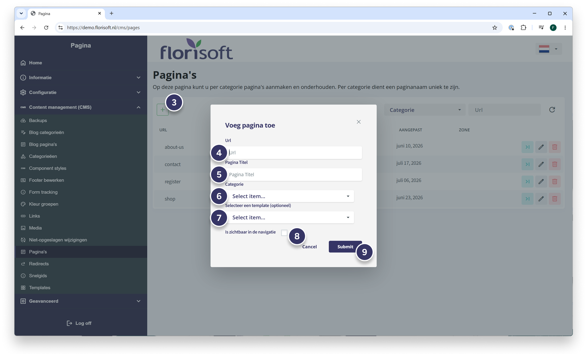
|
|**3**|Click the pencil icon (10) to open the **Properties** dialog (11) of the newly created page. Then click **Edit translations** (12).

<b>Click here for the example image</b>
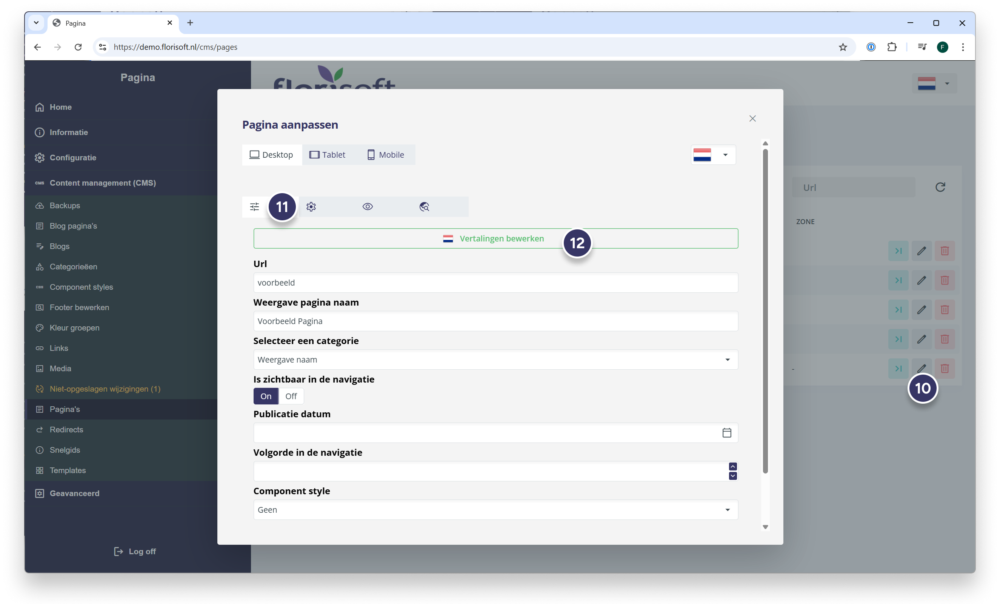
|
|**4**|The translation dialog will open. The configured default language (13) is displayed on the left. Use the dropdown menu on the right (14) to select the language you want to apply or edit. Configure the following settings:  - **URL (15):** Enter the translated URL path.  - **Page display name (16):** Enter the translated display name of the page.  - **Confirm (17):** Click **Confirm** to save the changes.

<b>Click here for the example image</b>

|
|**5**|Open the **Visibility** tab (18). Configure the following settings:  - **Language Zone Selection (19):** Under the dropdown menu, select one or more languages to which this page should be linked. Under **Zone Selection** (20), select a custom CMS zone.  - **Valid from (21) and Valid until (22):** Under **Valid from** and **Valid until**, you can set the dates and times during which the above settings should apply.

<b>Click here for the example image</b>

|
|**6**|In the **SEO** tab (23), you can configure settings related to SEO (Search Engine Optimization). These settings can help search engines such as Google find your website more easily. More information about SEO settings can be found [here](#seo). Click **Save** (24).

<b>Click here for the example image</b>

|
|**7**|Click the orange icon (25) or **Unsaved Changes** (26).

<b>Click here for the example image</b>

|
|**8**|To publish the page and make it available on the live webshop, click **Publish all** (27) or the publish icon (28). Then confirm the publication by clicking **Yes** (29).

<b>Click here for the example image</b>

|

---

#### Blog Categories

Blog categories can, just like [Page Categories](#categorieën), be used as tabs that are displayed alongside stock and order lists. Blog pages can be linked to a blog category. This allows you to use the category, for example, as a dropdown in the navigation bar or to create an overview using the [Blog](#blog) component.

Page categories and blog categories are similar in many ways. The main difference is the purpose for which they are used:

- Use **Pages** for important general pages, such as a Contact, Customer Registration, or About Us page.
- Use **Blog Pages** for news items, events, or highlighting a specific stock item or product, for example.

*Follow the steps below:*

|#|Explanation|
|:--|:--|
|**1**|Log in to the webshop with an administrator account.|
|**2**|Activate the **Management** environment of the webshop by clicking the user icon (1). A dropdown menu will open. Then click **Management** (2).

<b>Click here for the example image</b>

|
|**3**|Click **Content Management (CMS)** in the left-hand management bar (3). A dropdown menu will open. Then click **Blog Categories** (4). You will now be taken to the blog category overview. Any existing blog categories will be displayed here.

<b>Click here for the example image</b>

|
|**4**|To create a new blog category, click the **+** icon (5). The screen for creating a new blog category will open.

<b>Click here for the example image</b>
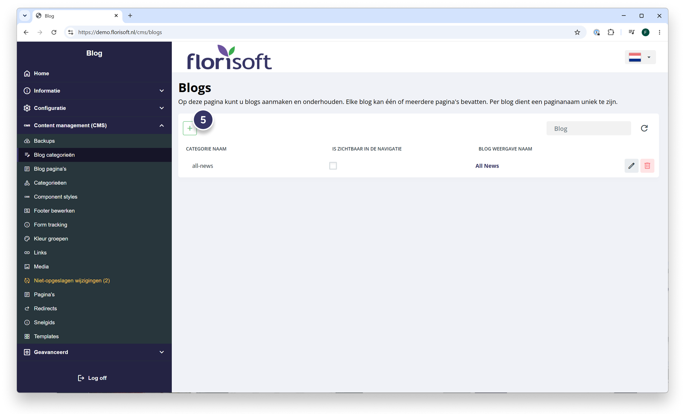
|
|**5**|Fill in the following fields:  - **Blog Display Name (6):** Enter the name of the category as it should be displayed in the bar containing the stock and order list tabs.  - **Blog URL (7):** Enter the name of the category that will also be used in the URL. **DO NOT USE SPACES!**  - **Size Mode — OPTIONAL (8):** Select whether you want to display a compact dropdown (**Small**) or a wide dropdown (**FullWidth**) in the navigation bar.  - **Navigation Order — OPTIONAL (9):** Determine the position of the category in the navigation bar. A value of **1** places the category first. This does not affect the order of the stock items; they will retain their original position.  - **Visible in Navigation — OPTIONAL (10):** Enable this option to make the category visible in the navigation bar.  - **Template — OPTIONAL (11):** Select a template that will automatically be applied when a new blog page is created within this category.  - **Submit (12):** Click **Submit** to create the blog category.

<b>Click here for the example image</b>
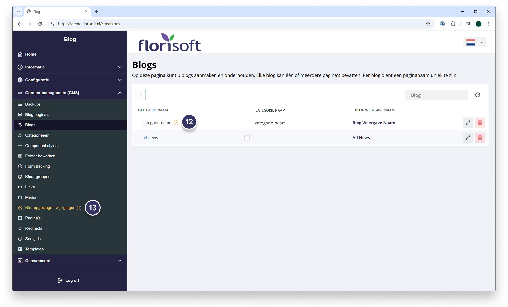
|
|**6**|Click the orange icon (13) or **Unsaved Changes** (14).

<b>Click here for the example image</b>

|
|**7**|To publish the category and make it available on the live webshop, click **Publish all** (15) or the publish icon (16). Then confirm the publication by clicking **Yes** (17).

<b>Click here for the example image</b>
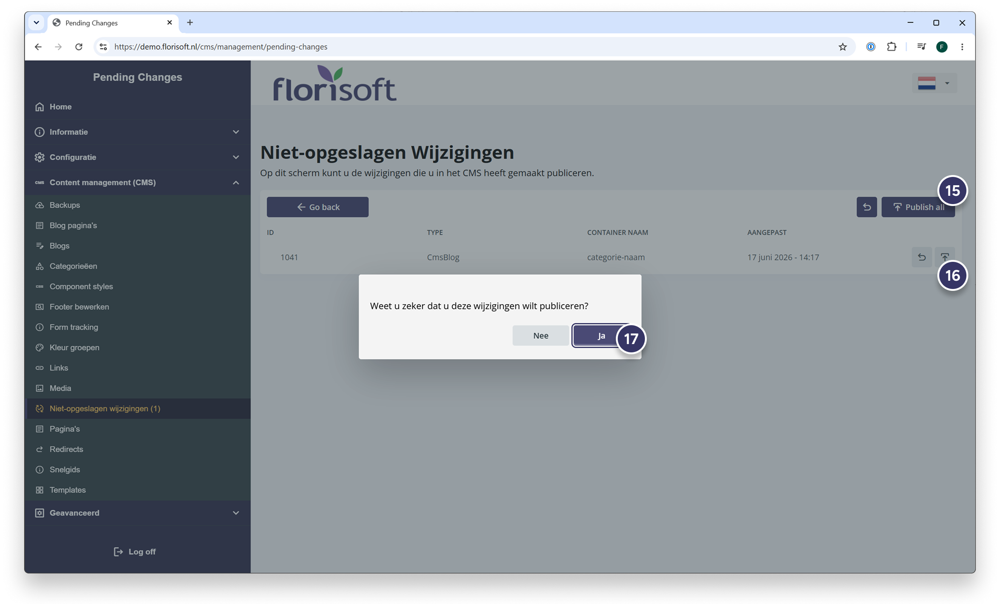
|
|:bulb:|**Note:** The new category will not be immediately visible in the webshop. It will only become visible once a blog page has been linked to this category. [See the next chapter](#blogpagina) for more information.|

---

#### Blog Page

A Blog Page is an accessible component within the CMS where content can be added. A Blog Page can be assigned to a self-created category. Various elements can be placed on a Blog Page, such as images, videos, text blocks, tables, and more. CMS Pages and Blog Pages are quite similar, but they can be distinguished as follows:  

- Use **Pages** for important basic pages such as a Contact, Customer Registration, or About Us page.
- Use **Blog Pages** for news items, events, or highlighting a specific stock item/product.

*Follow the steps below:*

|#|Explanation|
|:--|:--|
|**1**|After creating the Blog category, navigate via '*Content management (CMS)*' (1) to '*Pages*' (2).

<b>Click here for the example image</b>
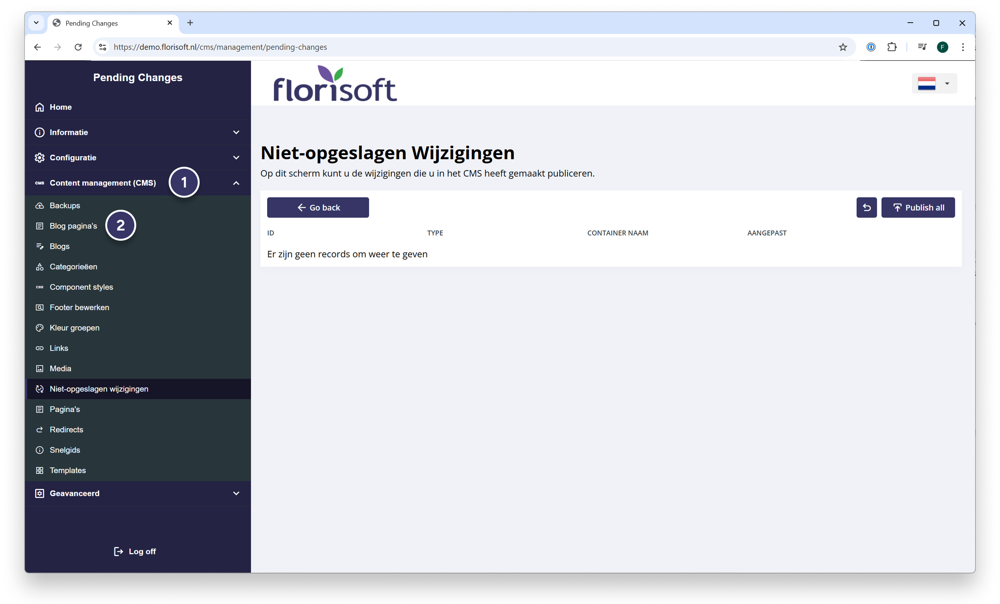
|
|**2**|To create a page, click the button with the '**+**' icon (3). This opens the page creation screen. A dialog will now appear. Adjust the following settings:  - **URL (4):** the name of the page that will be visible in the page URL. You do not need to include the entire domain name here. Only the path name is required, for example: '*example*'. **DO NOT USE SPACES OR CAPITAL LETTERS!**  - **Page display name (5):** the name that will be visible to customers on the website.  - **Category (6):** select the correct category, namely the category that was created in the previous chapter.  - **Is visible in navigation (7):** check this checkbox to make the page visible in the webshop.  - **Submit (8):** click the 'Submit' button to create the page.

<b>Click here for the example image</b>
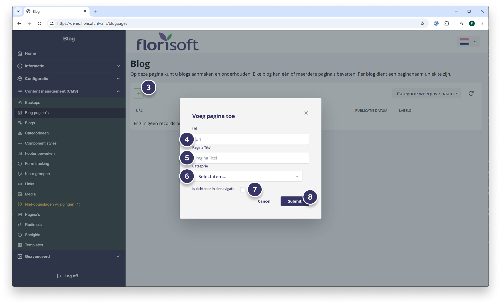
|
|**3**|Click the pencil icon (9) to open the Properties (10) dialog of the newly created page. Click the '*Edit translations*' button (11).

<b>Click here for the example image</b>
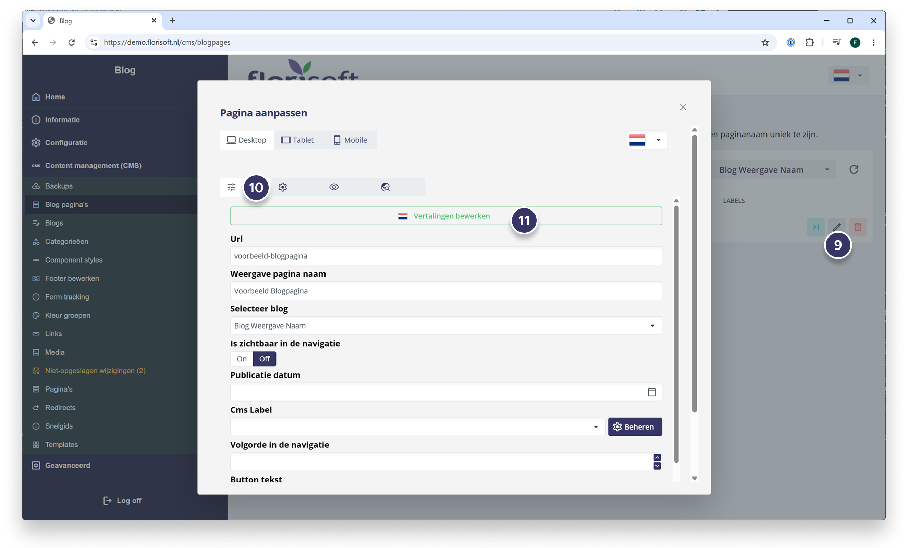
|
|**4**|The translation dialog will open. The configured default language (12) is displayed on the left side. Use the right dropdown menu (13) to select the language you want to apply/edit. Configure the following settings:  - **URL (14):** enter the translations for the URL path.  - **Page display name (15):** enter the translations for the page display name.  - **Confirm (16):** click '*Confirm*' to save the changes.

<b>Click here for the example image</b>
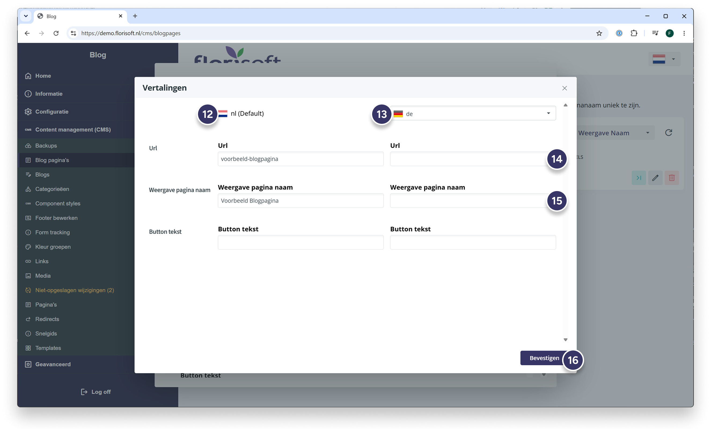
|
|**5**|Open the '*Visibility*' tab (17). Configure the following settings:  - **Language Zone Selection (18):** select one or more languages from the dropdown menu to which this category should be linked. Under Zone selection (19), select a custom CMS Zone.  - **Valid from (20) and Valid until (21):** under 'Valid from' and 'Valid until', dates and times can be configured for when the settings above should apply.

<b>Click here for the example image</b>
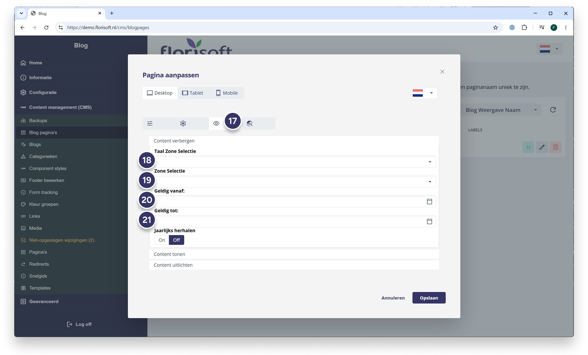
|
|**6**|In the '*SEO*' tab (22), settings related to SEO (Search Engine Optimization) can be configured. This allows search engines such as Google to find your website more easily. More information about SEO settings [can be found here](#seo). Click '*Save*' (23).

<b>Click here for the example image</b>
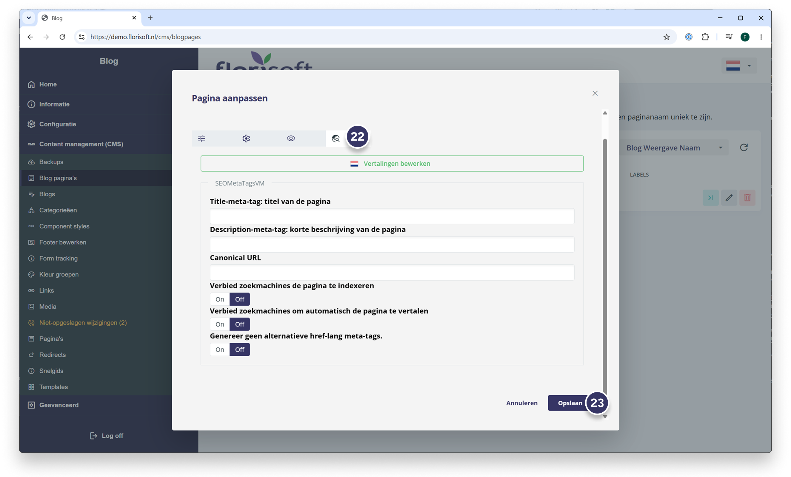
|
|**7**|Click on 'Unsaved changes' (24).

<b>Click here for the example image</b>
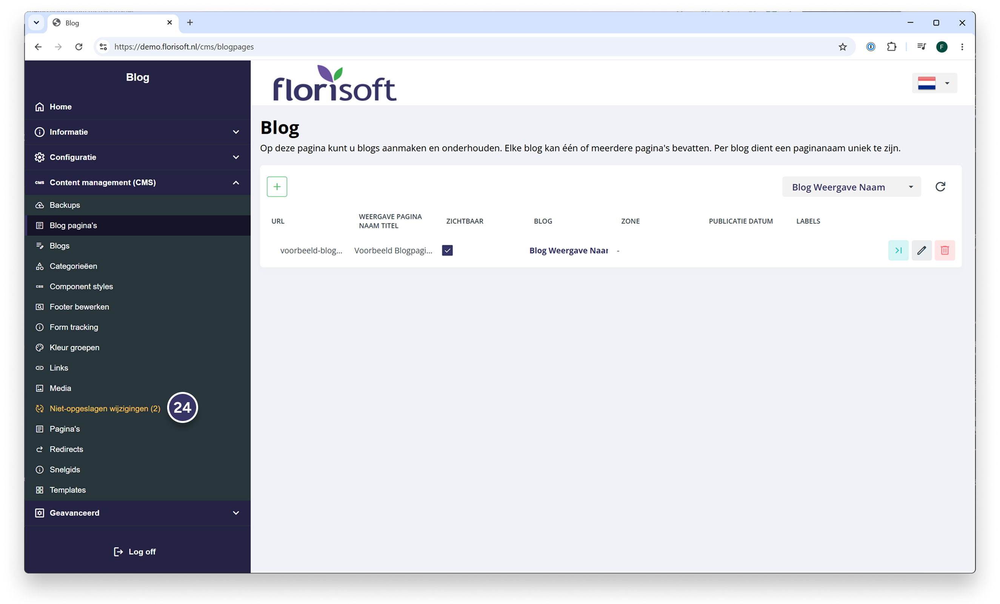
|
|**8**|To publish the page and make it available live, click the 'Publish all' button (25) or the publish icon (26). Confirm the publication by clicking 'Yes' (27).

<b>Click here for the example image</b>

|

---

#### Edit Footer

When creating a new CMS page, a container for a footer is automatically created. A footer is the bottom section of a page. Every CMS page contains a footer by default. Changes made to the footer are visible throughout the entire website. A footer usually contains secondary information such as address details, links to external websites, and social media. The CMS provides a predefined footer element by default.

It is also possible to fully customize the footer according to your own preferences (as may have been shown in previous examples), in the same way as previously created elements such as carousels, text boxes, and videos. Creating a footer works as follows:

|Step|Explanation|
|:--|:--|
|**1**|In the Navigator, click the '+' icon of the '*Container (footer)*' (1). The ‘Add Component’ window opens. Navigate via the 'Templates' category (2) to Footer Template. You can also use the search bar for this (3). Click the '+' icon (4) to add the Template.

<b>Click here for the example image</b>

|
|**2**|A default footer element with four columns is added. Two columns contain a text box (5). The last column contains social media icons ([SocialIcons Component](#social-icons)) (6).

<b>Click here for the example image</b>

|
|**3**|As described earlier, it is possible to fully customize the footer according to your own preferences. This works in the same way as creating/editing other elements such as carousels, text boxes, and videos. When all desired elements have been added to the page, the management environment can be closed.|
|**4**|Click the menu icon (7) and then click the close icon (8) at the bottom to exit the management environment. The webshop will now return to the normal view as customers see it.

<b>Click here for the example image</b>

|

---

#### Templates

Templates allow you to easily reuse content that you have previously created with the CMS. These can be small content blocks, but also complete pages. This prevents you from having to rebuild the same content repeatedly.

Templates can also be used effectively for [Blog components](#blog) to dynamically load content. Additionally, the [Frame component](#frame) can be used to load a template that is reusable in multiple locations and automatically responds to changes made within the template.

|Step|Explanation|
|:--|:--|
|**1**|Navigate via Content management (1) to Templates (2).

<b>Click here for the example image</b>

|
|**2**|Then click the '+' icon to start creating a new template (3).

<b>Click here for the example image</b>
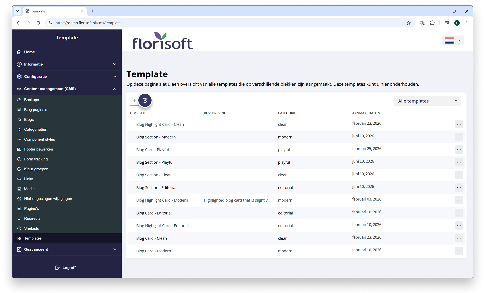
|
|**3**|A dialog will open. Enter a name (4) for the new template, a description (5), and a category (6), or create a new category. In this example, we created a new category called 'standard blocks' (7). Then click 'Save' (8). The Template editor will now open.

<b>Click here for the example image</b>
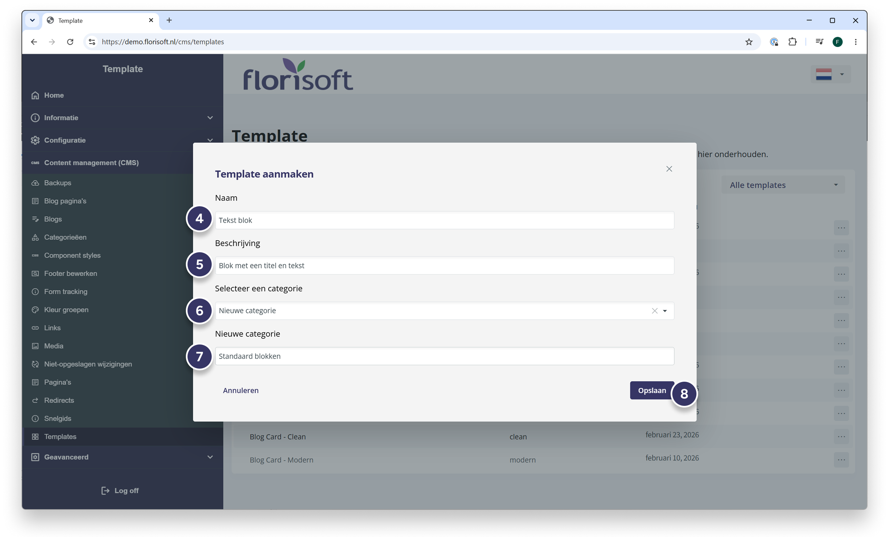
|
|**4**|In the Template editor, you can add CMS elements just as you would on any other CMS page. Also enable the CMS editor (9) in this screen and click the '+' icon (10). The component dialog will now open.

<b>Click here for the example image</b>
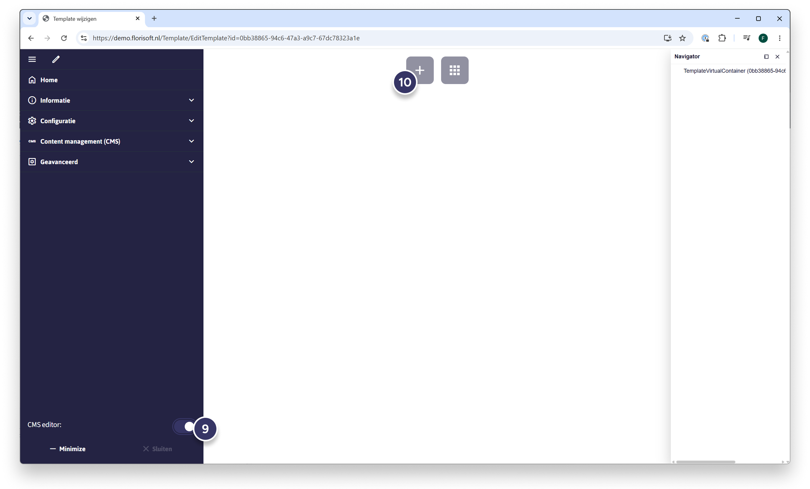
|
|**5**|You can now add CMS elements to the Template. For example, start with a [Panel](#panel) (11).

<b>Click here for the example image</b>
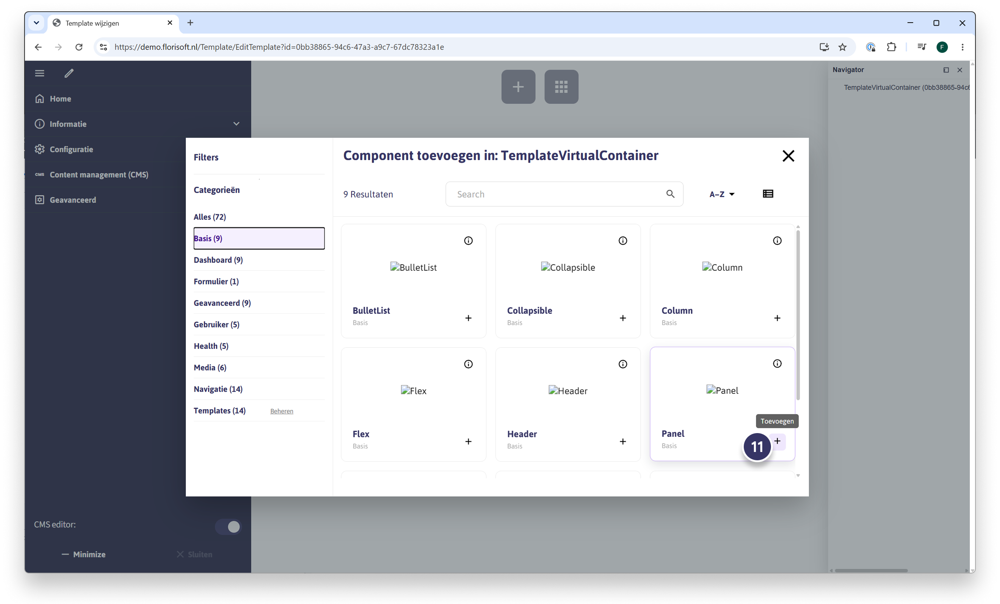
|
|**6**|Within the [Panel component](#panel), we have placed two [Text components](#text) as an example (12). When you are satisfied with the template, you can save it (13).

<b>Click here for the example image</b>
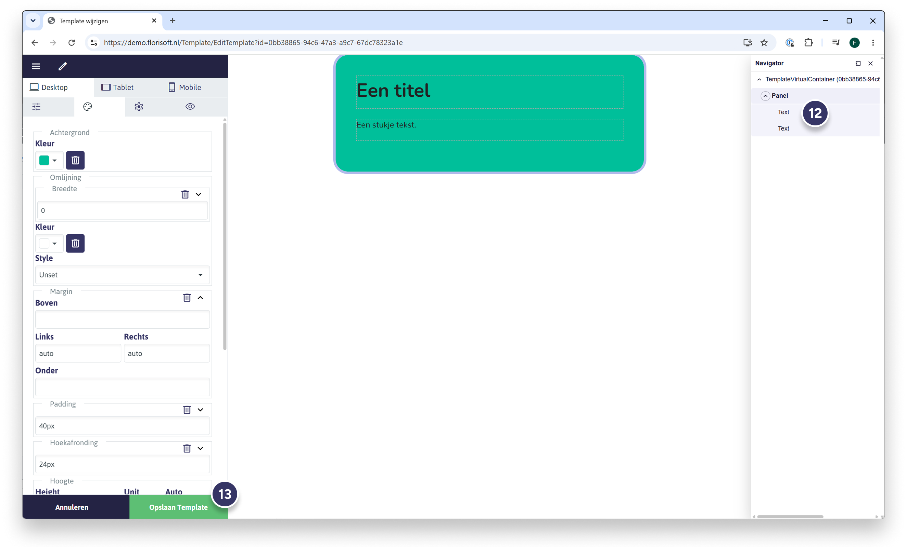
|
|**7**|Click 'Yes' (14) to confirm saving. You can always edit the template afterwards.

<b>Click here for the example image</b>
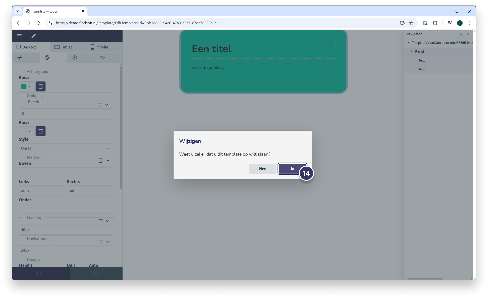
|
|**8**|After saving, you will return to the Templates screen. Using the dropdown menu (15), you can easily select the newly created category. This immediately shows how many templates have been created within this category. This is useful, for example, when preparing content for special occasions such as Mother's Day and/or Christmas. Navigate back to the Home page (16) to place the template on the page.

<b>Click here for the example image</b>
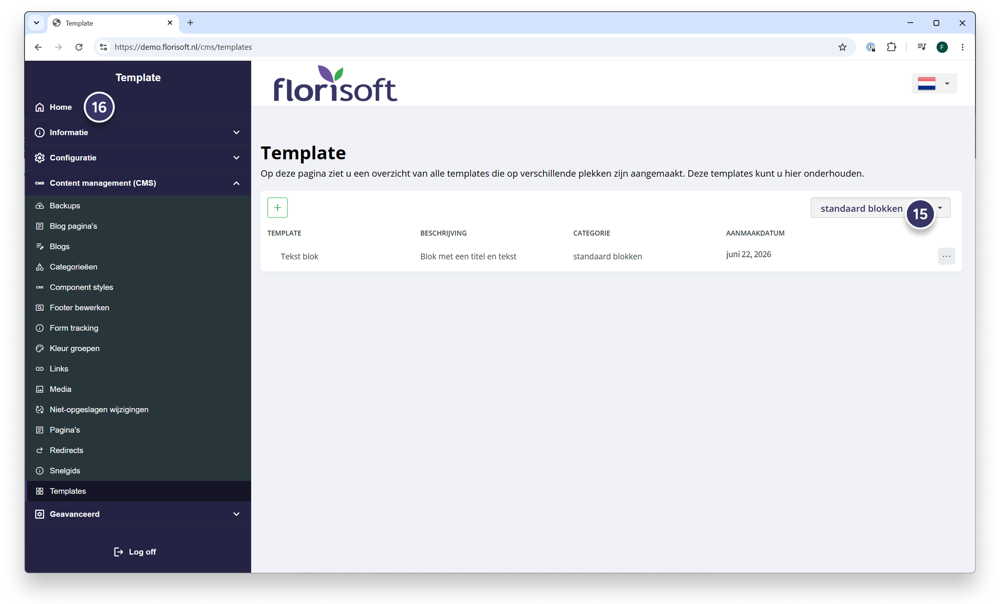
|
|**9**|Now that you are back on the Home page, you can use the component dialog to navigate to 'Templates' (17), select the Template category (18), and place the newly created template on the page (19).

<b>Click here for the example image</b>
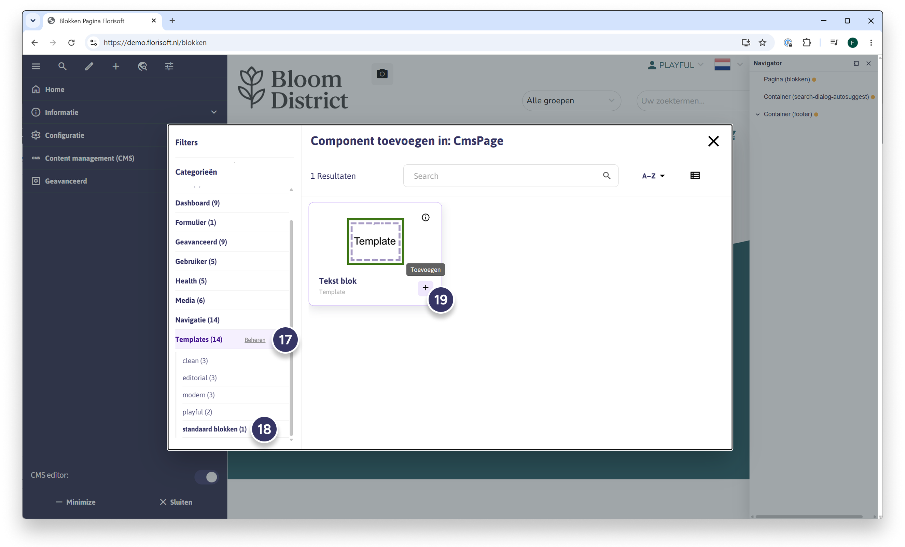
|
|**10**|The template (20) will now be visible on your CMS page. You can make further changes and publish them without having to rebuild everything from scratch.

<b>Click here for the example image</b>

|
|**11**|We have now created a template quite easily, but Templates can be used in many more ways. When you have created an entire page or section yourself that you would like to reuse, Templates are the perfect solution. By right-clicking in the Navigator, you can save an entire page or section (21) (in this case 'Panel (hero)') as a Template (22).

<b>Click here for the example image</b>
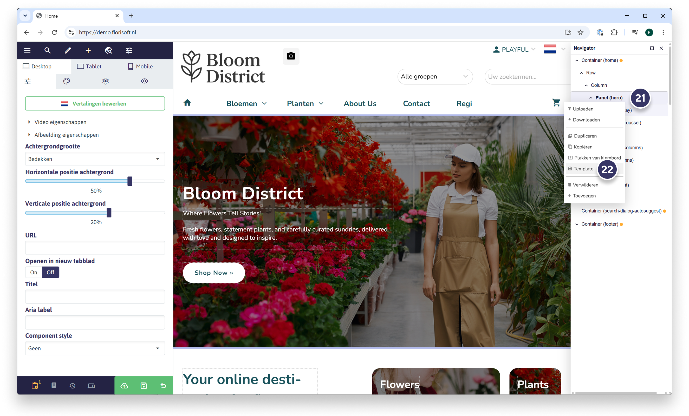
|
|**12**|Then fill in the name (23), description (24), and optional category (25) in the dialog, and click 'Save' (26).

<b>Click here for the example image</b>
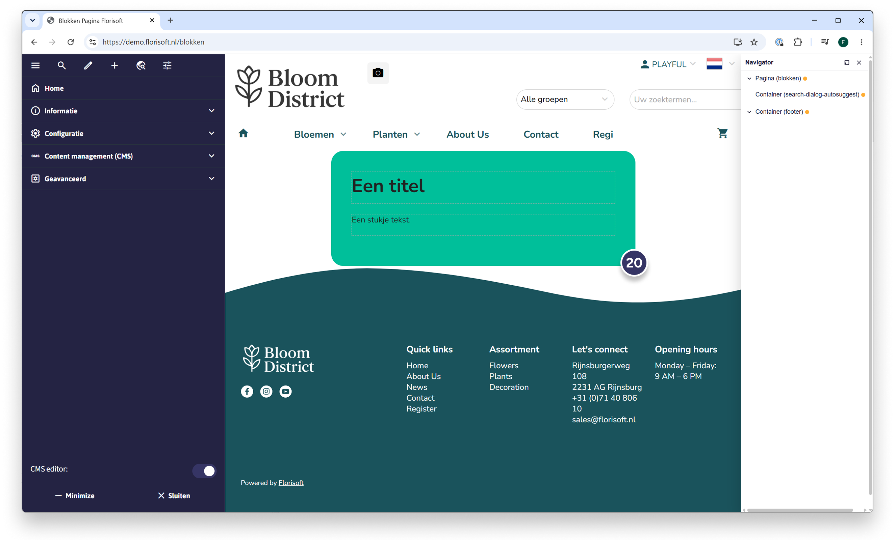
|

---

### Advanced

#### Theme Configuration

In this configuration screen, you can set the brand colors of your shop, determine which font should be displayed, and configure various other options to make the visual appearance of your shop better match your preferences.

|Step|Explanation|
|:--|:--|
|**1**|Navigate via Configuration (1), Theme, to Theme Configuration (2).

<b>Click here for the example image</b>
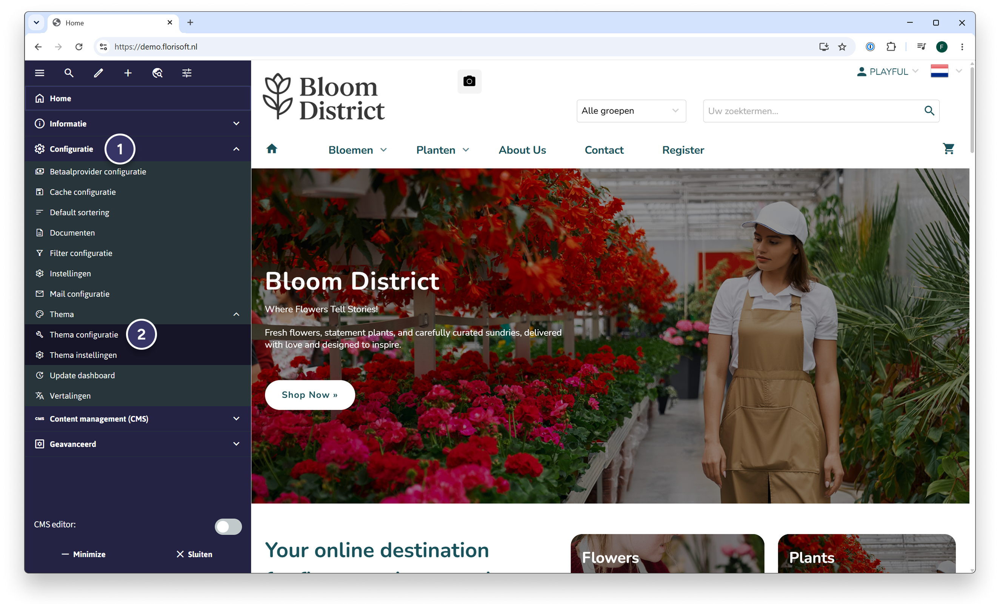
|
|**2**|Then click the '+' icon to start creating a new theme (3). A dialog will open. Enter a name (4) for the new theme. Make sure that **NO spaces are used in the theme name**. Select a template that will be loaded immediately after creation. We recommend using the Starterkit theme here for a better visual look and feel in the shop (5). Then create the theme (6).

<b>Click here for the example image</b>
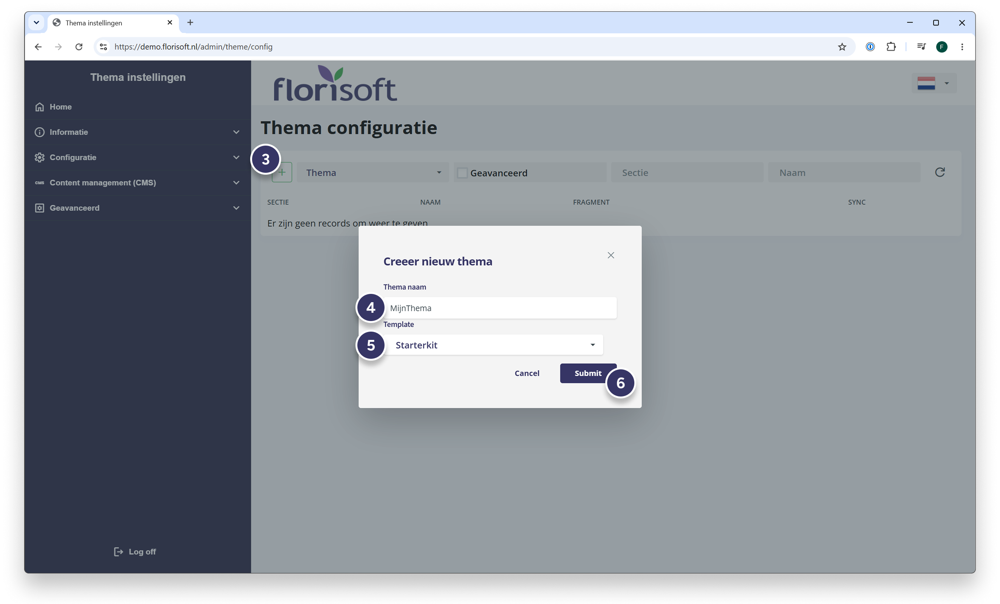
|
|**3**|The theme has now been created and a large list of information will appear. This list determines colors, fonts, font sizes, and other styling options that influence the appearance of your shop. 90% of these settings are already correctly configured for your theme, but you can still go through the list and adjust specific settings. Having some CSS knowledge can be helpful for certain (more advanced) options.  After changing theme settings, you must always save them using the save button (10). After creating the theme, saving is therefore the first thing you should do before making changes.  **7 - Preview**: Use this button to open a preview of your shop. The preview displays the information from your new theme, allowing you to quickly see the effects of changes made to your shop. The preview will update after saving the theme.  **8 - Recompile**: This function performs a check to verify that all information has been entered correctly. If incorrect values are found, a dialog will be displayed describing where the error occurs in your theme.  **9 - Log**: Displays a log of changes made to the theme.  **10 - Save**: Save changes made to the theme using this button to make them visible in the live environment.  **11 - Download theme**: Use this button to download the selected theme (15). A `.scss` file will be downloaded, which can be uploaded into another new theme, for example (13).  **12 - Last error message**: Checks whether an error message is active in your theme.  **13 - Upload theme**: As mentioned under 'Download theme' (11), you can upload a downloaded theme using this button. **PLEASE NOTE:** uploading a downloaded theme file will overwrite existing data in the selected theme (15).  **14 - Create new theme**: Create a new theme.  **15 - Select theme**: Use this dropdown to select the theme you want to modify.  **16 - Advanced settings**: When this option is enabled, many more options will become visible in the list, allowing you to make more detailed adjustments to your shop. **PLEASE NOTE:** These settings may require CSS knowledge.  **17 - Search by section**: Search for an option by section level. The section names can be found on the left side of the overview. Names that appear here include: GENERAL, STOCK, LOGIN, ACCOUNT, GALLERY, HEADER, FOOTER, HOME, NAVIGATION, and SHOPPING-CART.  **18 - Search by name**: Search for an option by name.  **19 - Refresh**: Reload the theme. This can also be done by refreshing the browser.  **20 - Reset option to default value**: This button restores the value of this option to its original state. The option will be reset.  **21 - Synchronize with all themes**: The configured and saved option can be applied to all available themes using this button. **PLEASE NOTE:** This action cannot be undone.  **22 - Edit option**: Opens a dialog where you can make a change.  **23 - Primary color**: This is the main color of your shop. Changing this color will affect a large part of your shop's appearance.  **24 - Secondary color**: This is the second most important color of your shop. Changing this color will affect a large part of your shop's appearance.  After making the changes for your new theme, click 'Save' (10).

<b>Click here for the example image</b>
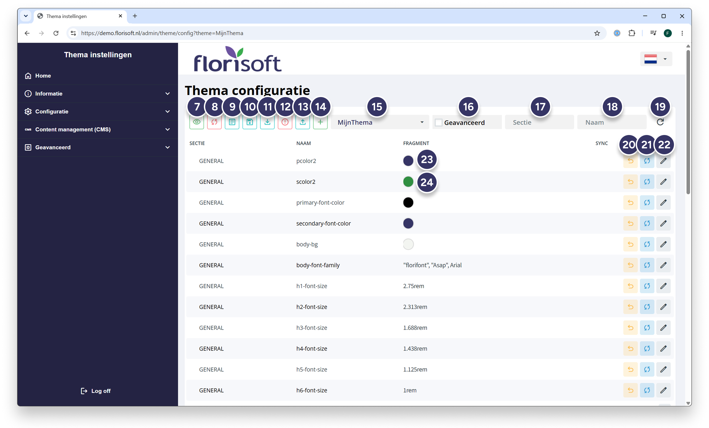
|
|**4**|To load a Google Font, navigate via 'Configuration' (25) to the webshop settings (26). In the overview, search for GOOGLEFONTSHREF. Click this setting. You will then be taken to the page where this setting can be modified (27). Enter the link copied from [Google Fonts](https://fonts.google.com/), such as *https://fonts.googleapis.com/css2?family=[FONTNAME]:ital,wght@0,400;0,700;1,400;1,700&display=swap*, and paste it into the dialog (28). Then save the setting (29). When you enter the Google Font under the theme setting *body-font-family*, for example *"[FONTNAME]", sans-serif*, and save the theme, your shop will now display the desired Google Font.

<b>Click here for the example image</b>
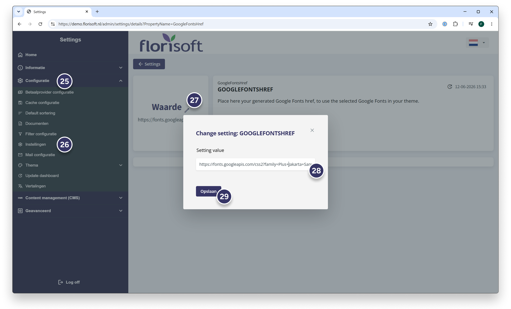
|

---

#### Backups

Working in the CMS can sometimes go wrong. You may have accidentally deleted something that cannot be undone. Don't worry, with the help of a backup your CMS can quickly be up and running again!

|Step|Explanation|
|:--|:--|
|**1**|Navigate via Content Management (CMS) (1) to Backups (2).

<b>Click here for the example image</b>
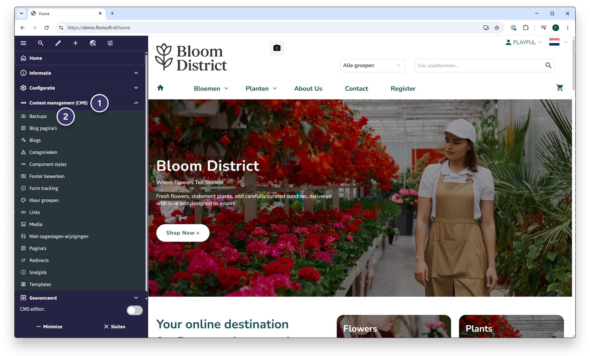
|
|**2**|You will now see the overview page containing all backups. A backup is automatically created every day, but you can also manually save a backup using the '+' icon (3). A dialog will open. Enter a description for your backup (4) and save it (5). The dialog will automatically close once the backup has been completed. Creating a backup may take some time.

<b>Click here for the example image</b>
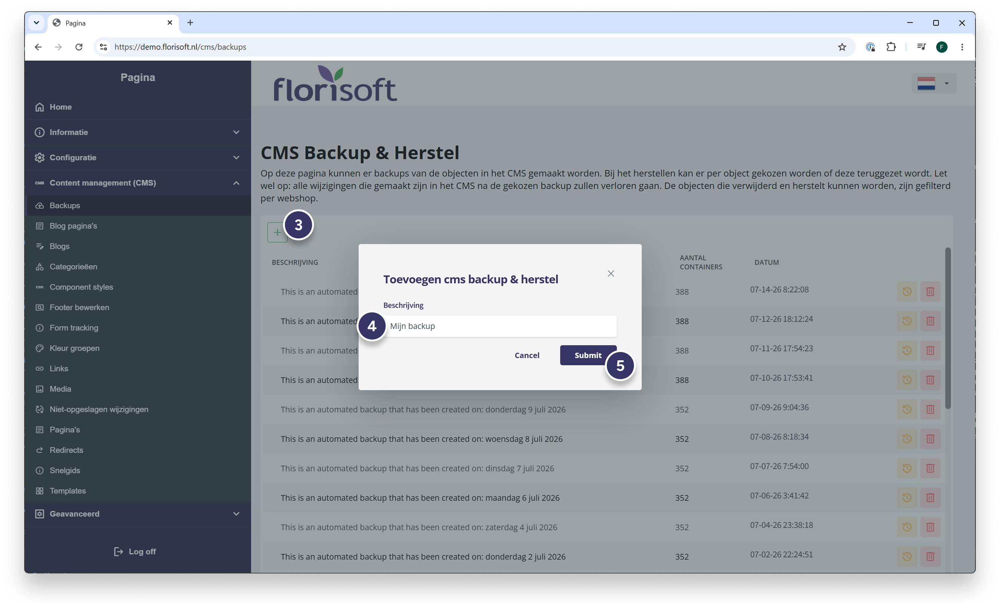
|
|**3**|You can now see that the backup has been created and will appear at the top of the overview (6). If you need to restore a backup, click the restore button (7). The version will then be restored to this backup. Backups can also be deleted (8).

<b>Click here for the example image</b>
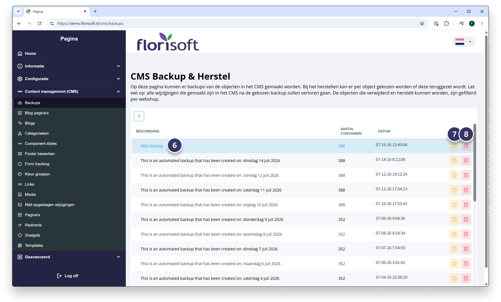
|

---

#### Redirects

When you have an existing link and want to change its URL, this can negatively impact your SEO score in Google. With the help of redirects, you inform Google that the URL has been changed, preventing your accumulated SEO score from being lost.

|Step|Explanation|
|:--|:--|
|**1**|Navigate via Content Management (CMS) (1) to Redirects (2).

<b>Click here for the example image</b>

|
|**2**|You will now arrive at the redirects overview page. Use the '+' icon (3) to create a new redirect. A dialog will open.  **4 - Redirect name**: Enter a name for your redirect.  **5 - Incoming URL**: Enter the complete web address of your 'old' URL, for example *https://www.[yourdomain].nl/old-page*.  **6 - Outgoing URL**: Enter the complete web address of your 'new' URL, for example *https://www.[yourdomain].nl/new-page*.  **7 - Redirect type**: Use this dropdown to select the type of redirect. **302** is temporary (**this option is strongly recommended**) and **301** is permanent and therefore more difficult to undo. **PLEASE NOTE:** Sufficient knowledge of working with redirects is required to prevent unwanted behavior.  Then save the redirect (8).

<b>Click here for the example image</b>
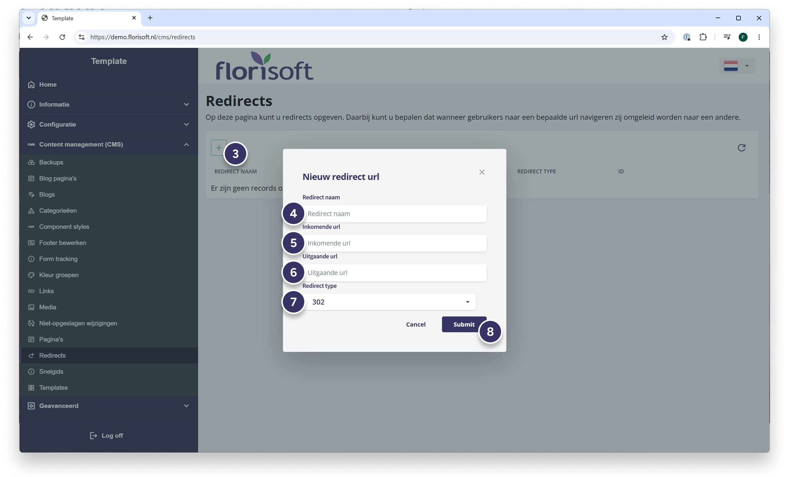
|

---

#### Pending Changes

After making changes to your CMS page, you must publish them. This screen keeps track of changes made across multiple pages.

|Step|Explanation|
|:--|:--|
|**1**|In this example, we edited a Text component on the Home page. An icon at the bottom of the screen will now turn orange. Click this icon to navigate to the **Pending Changes** page (1).

<b>Click here for the example image</b>
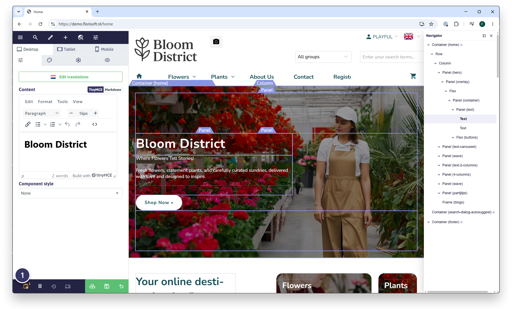
|
|**2**|You are now on the **Pending Changes** page (2), where your changes are tracked per page (3). You can either discard all unsaved changes for this page (4) or publish them (5). If you have made changes to multiple pages, they will also be listed on this screen. You can then discard all changes for every page at once (6) or publish them all at once (7).

<b>Click here for the example image</b>
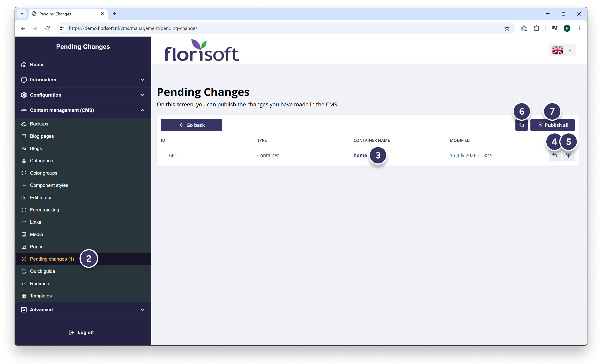
|

---

#### Form tracking

Pages that contain a form can be monitored in the **Form Tracking** screen. This screen allows you to see exactly which forms have been successfully submitted for each customer. Forms that failed to send or were cancelled can also be easily identified. In addition, you can export the submitted data to Excel files, making it suitable for various purposes involving data from multiple customers.

To comply with privacy regulations, it is recommended to clearly inform users by including a [Checkbox](#checkbox) in your form with text similar to: *I agree that my personal data may be used to process my request.*

|Step|Explanation|
|:--|:--|
|**1**|Navigate via Content Management (CMS) (1) to Form Tracking (2).

<b>Click here for the example image</b>
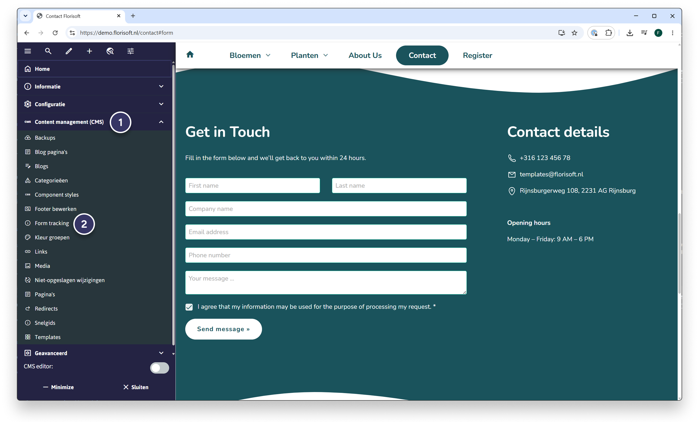
|
|**2**|You will now arrive at the **Form Tracking** overview page.  **3 - Form subject or user**: Search for a form subject (which can be configured in the [Form component](#form)) or search for a customer number.  **4 - Select Form**: Use this dropdown to select which form data you want to view.  **5 - Status**: Use this dropdown to filter forms that were successfully submitted, cancelled, or failed to send.  **6 - Download Excel**: Downloads an Excel file based on the selected data.  **7 - Refresh overview**: Refreshes the overview and reloads all available data.  **8 - Data table**: Opens a dialog displaying the submitted form data.  **9 - Events**: Displays all events that occurred during the completion and submission of the form.

<b>Click here for the example image</b>
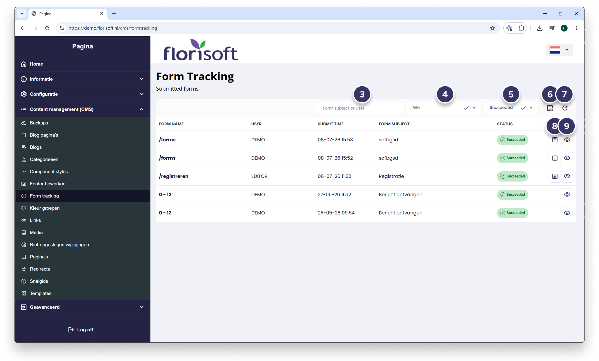
|

---

#### Component Styles

Using components in the CMS allows you to build beautiful pages, but sometimes you may want to apply your own CSS styling that is not (yet) possible with the current CMS options. This can be achieved using **Component Styles**. **PLEASE NOTE:** This feature requires sufficient CSS knowledge. Incorrect CSS code may negatively impact the performance or appearance of your webshop.

|Step|Explanation|
|:--|:--|
|**1**|In this example, we have selected a [Panel](#panel) component (1) to which we want to apply a color gradient, making the text easier to read—something that is not (yet) possible using the current CMS settings.

<b>Click here for the example image</b>
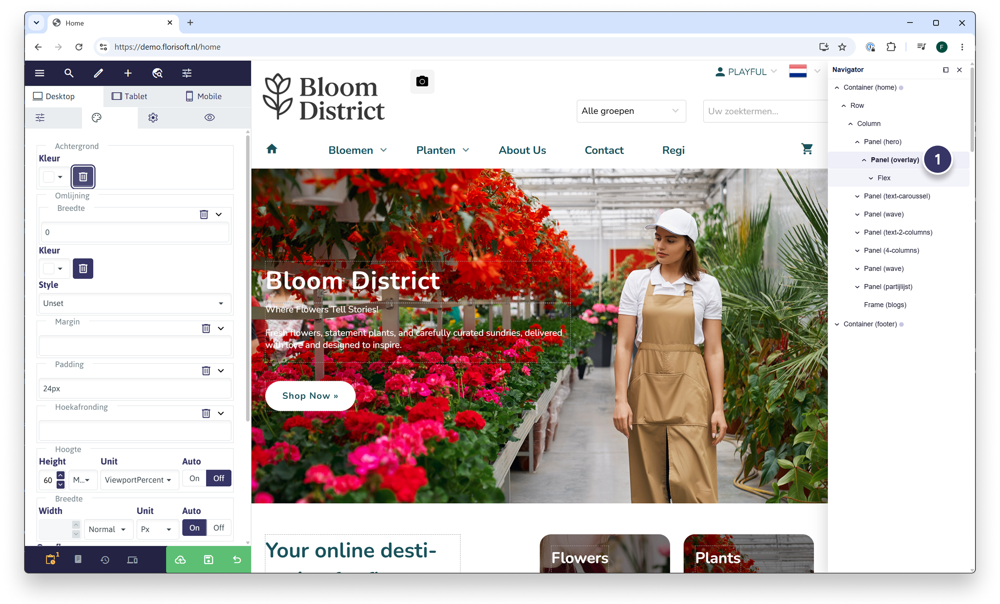
|
|**2**|Navigate via Content Management (CMS) (2) to **Component Styles** (3). The management screen will open.

<b>Click here for the example image</b>
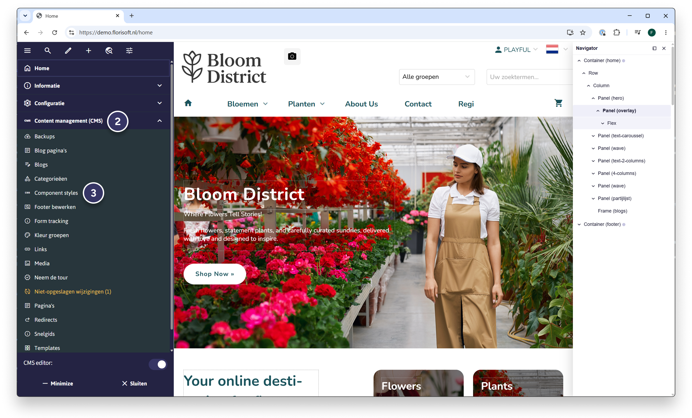
|
|**3**|Create a new Component Style by clicking the '+' icon (4). In the dialog that appears, enter a name (5) for your Component Style. **PLEASE NOTE:** Do not use spaces in the name. Then click **Confirm** (6).

<b>Click here for the example image</b>
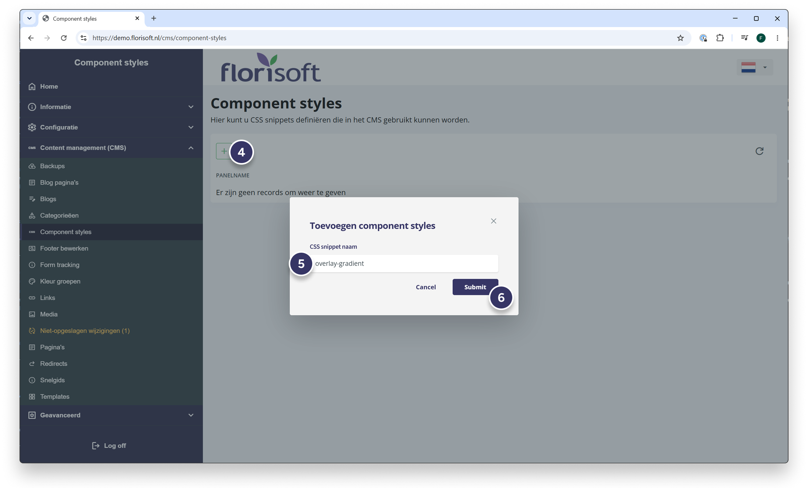
|
|**4**|A CSS editor will now open where you can enter your own CSS styling (7). In this example, we have applied a color gradient. When you are finished, save the Component Style (8).

<b>Click here for the example image</b>
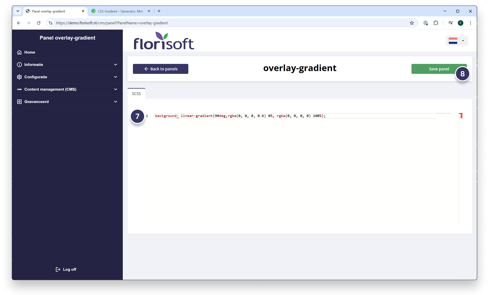
|
|**5**|A confirmation dialog will appear. Click **OK** (9) and then navigate back to **Component Styles** (10).

<b>Click here for the example image</b>
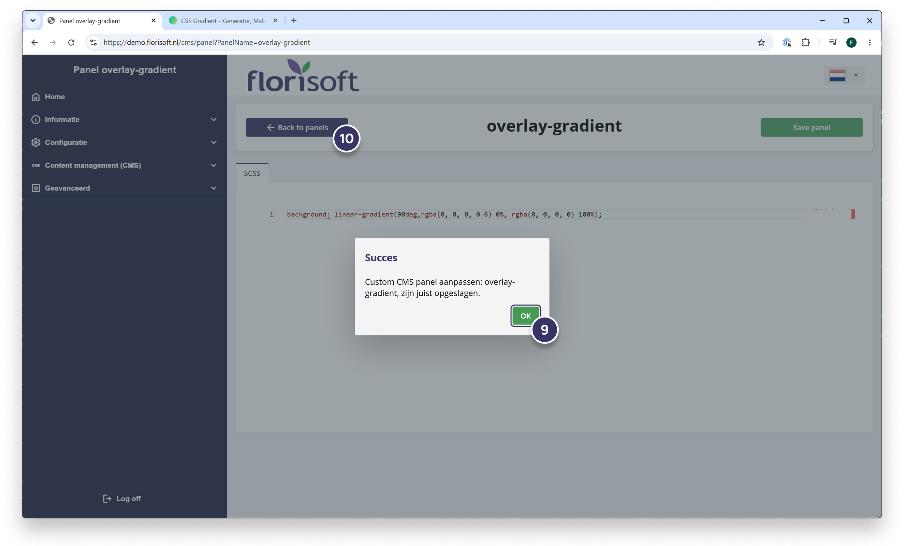
|
|**6**|The Component Style you have just created will now appear in the overview. It is now ready to be applied to a component.

<b>Click here for the example image</b>
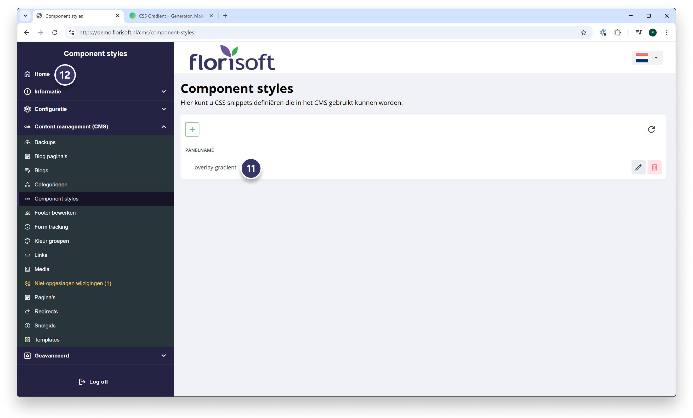
|
|**7**|Select the desired component in the editor or via the Navigator (13). In the component's **General Settings** tab (14), open the **Component Style** dropdown (15) and select the Component Style you just created (16).

<b>Click here for the example image</b>
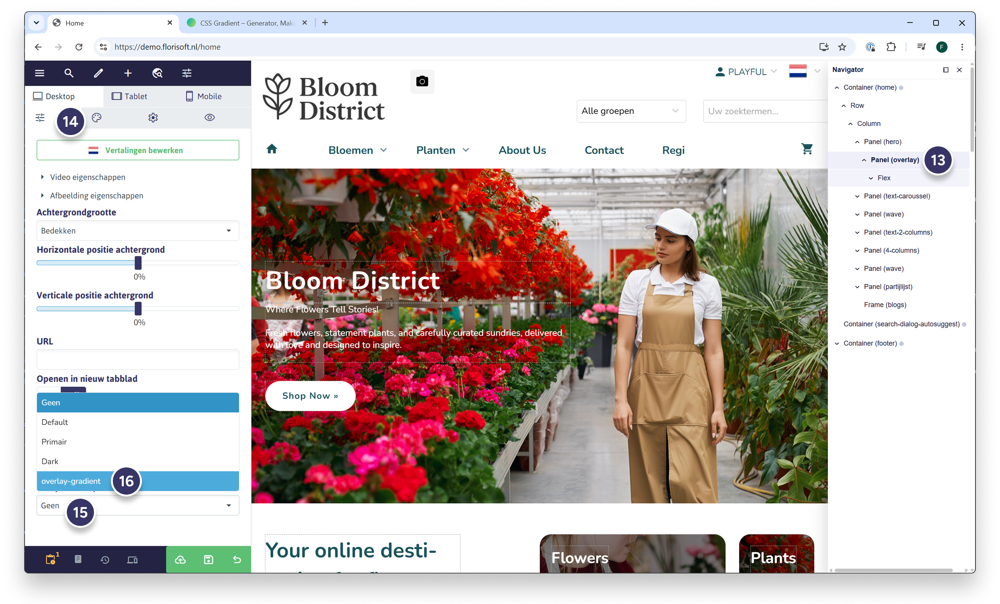
|
|**8**|The effect of the selected Component Style will immediately be visible on the selected [Panel](#panel) component (17).

<b>Click here for the example image</b>
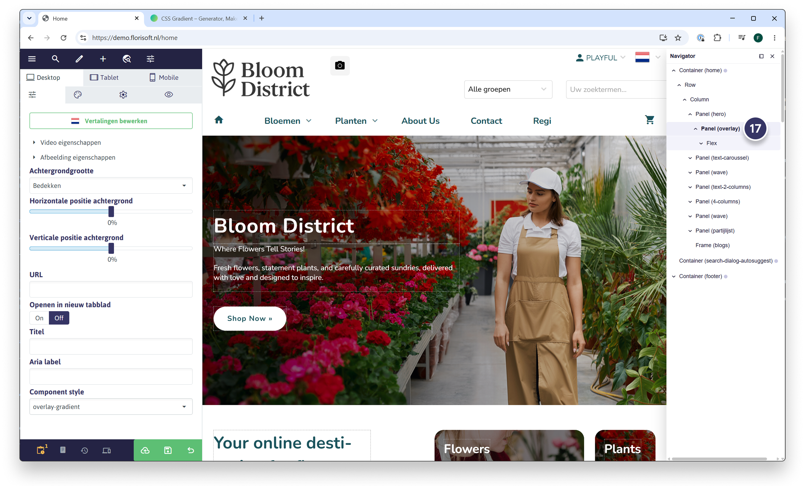
|

---

#### Color groups (Dashboards)

This section is still under development.

---

### Other

#### Media

Via this screen, you can easily upload your own images and video files and then use them on your [CMS pages](#page).

|Step|Explanation|
|:--|:--|
|**1**|Navigate via **Content Management (CMS)** (1) to **Media** (2).

<b>Click here for the example image</b>
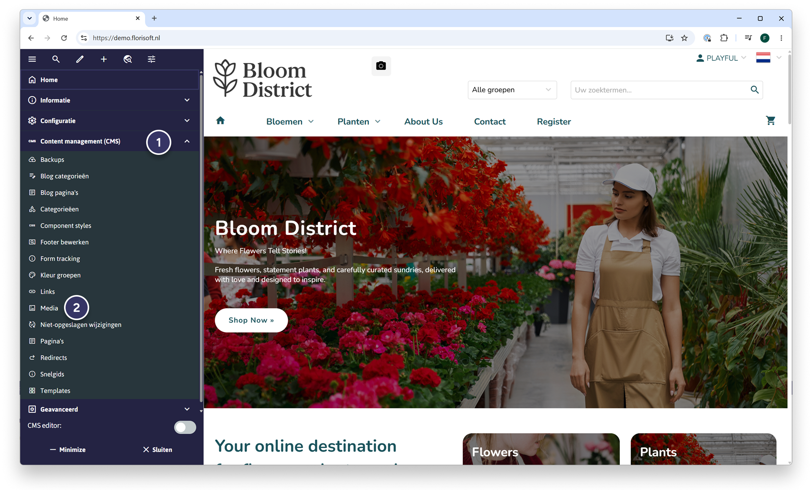
|
|**2**|You will now arrive at the Media management screen. From this screen, you can upload files. Images are stored in the **images** folder (3), and videos are stored in the **videos** folder (4). Click on the **images** folder (3).

<b>Click here for the example image</b>
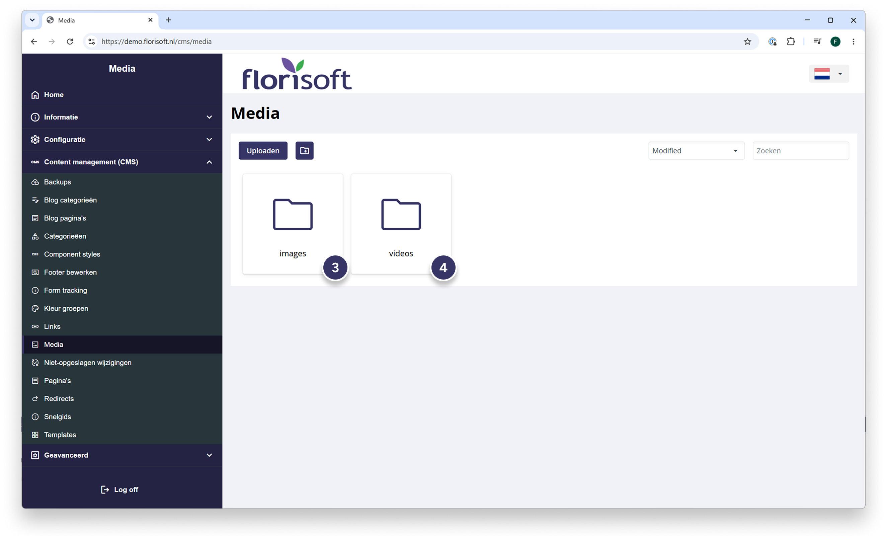
|
|**3**|In the **images** folder, you can create additional folders (5) to keep your files organized. Use the arrow (6) to navigate back one level. The trash can icon (7) can be used to delete a selected item. In this example, we will upload an image (8).

<b>Click here for the example image</b>
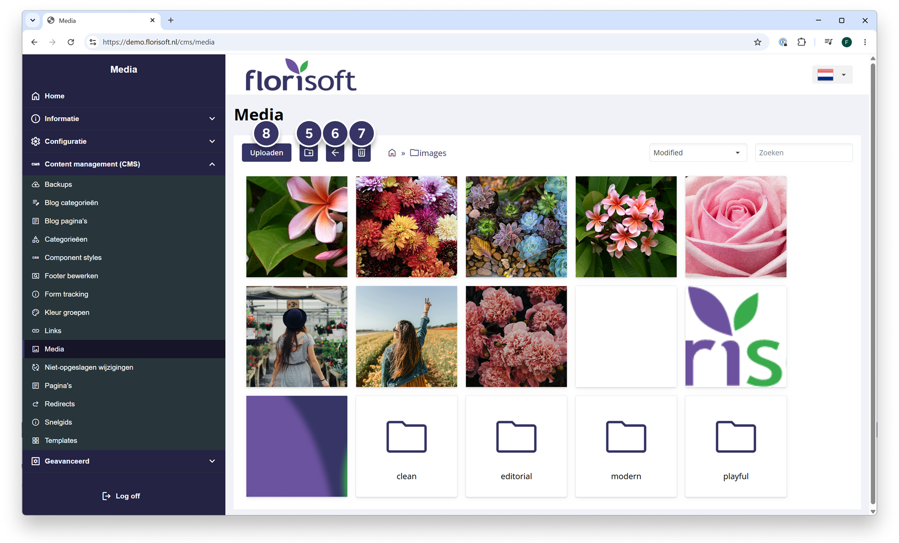
|
|**4**|Images can be automatically resized to prevent unnecessarily large files from being uploaded. Large files can have a negative impact on the loading time of your webshop. When you enable the **Resize** option (8), you can choose whether the image(s) should be proportionally resized to a maximum of **1024** or **1920 pixels**. If you leave this option disabled, keep in mind that files may be a maximum of **25 MB** in size. This applies to both images and videos.  To upload a file from your computer, drag the file into the drop zone or click the button to select an image (9) or video (10). Then click **Upload** (11).

<b>Click here for the example image</b>
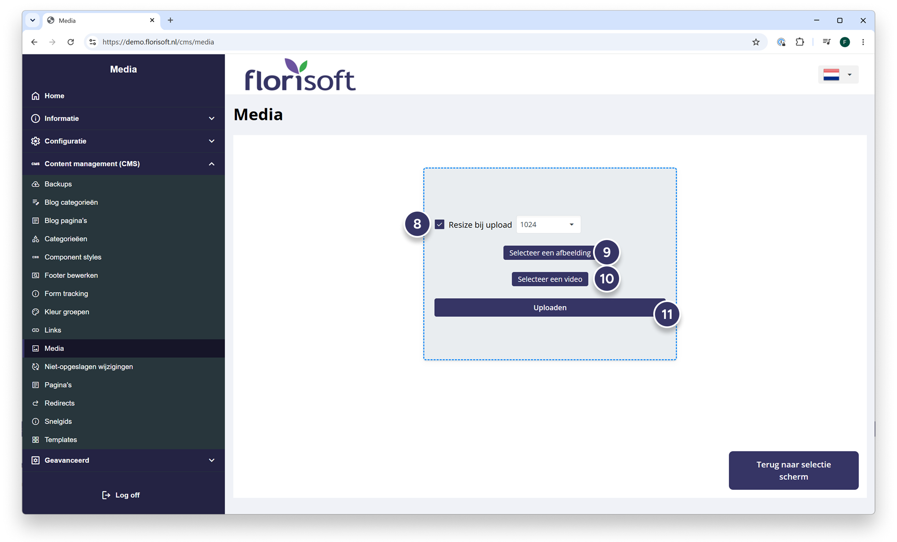
|
|**5**|After selecting and confirming an image or video from your computer, the file will be displayed on the upload screen (12). Click **Upload** (13) to start the upload. A progress bar will appear. Once the upload process has reached 100%, you can return to the selection screen (14).

<b>Click here for the example image</b>
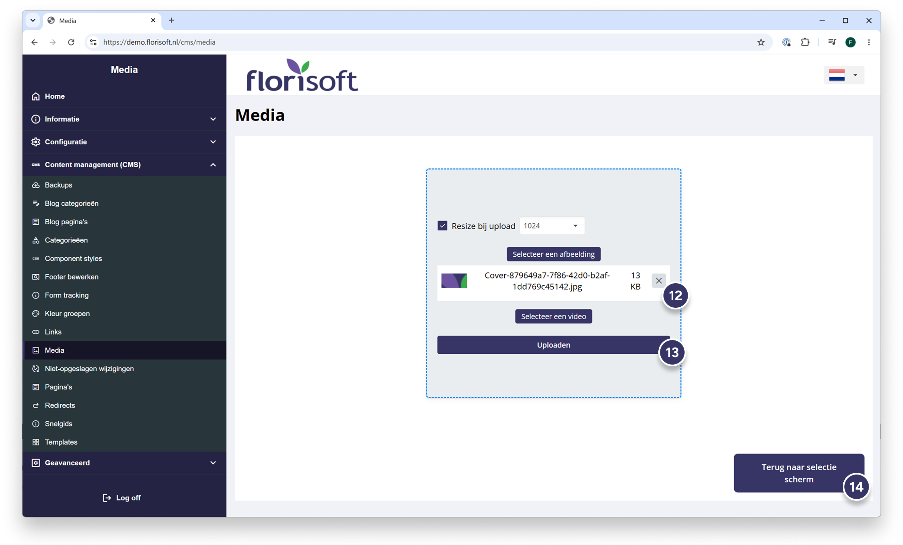
|
|**6**|The image is now displayed at the top of the overview (15). You can delete the image (16) or edit it further (17). In this example, we will edit the image (17).

<b>Click here for the example image</b>
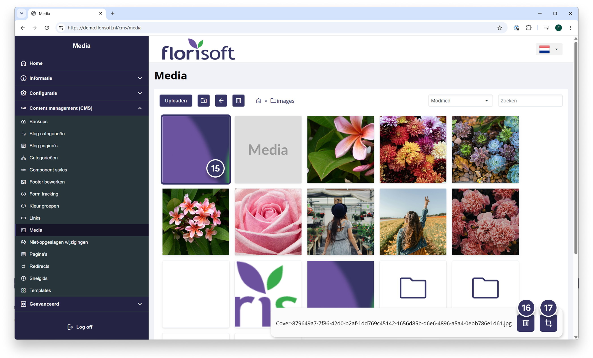
|
|**7**|On this screen, you can further crop and edit the image. You can adjust the selection area (18), zoom in (19) and out (20), change the positioning (21), and rotate the image (22). You can also undo any changes (23).

<b>Click here for the example image</b>
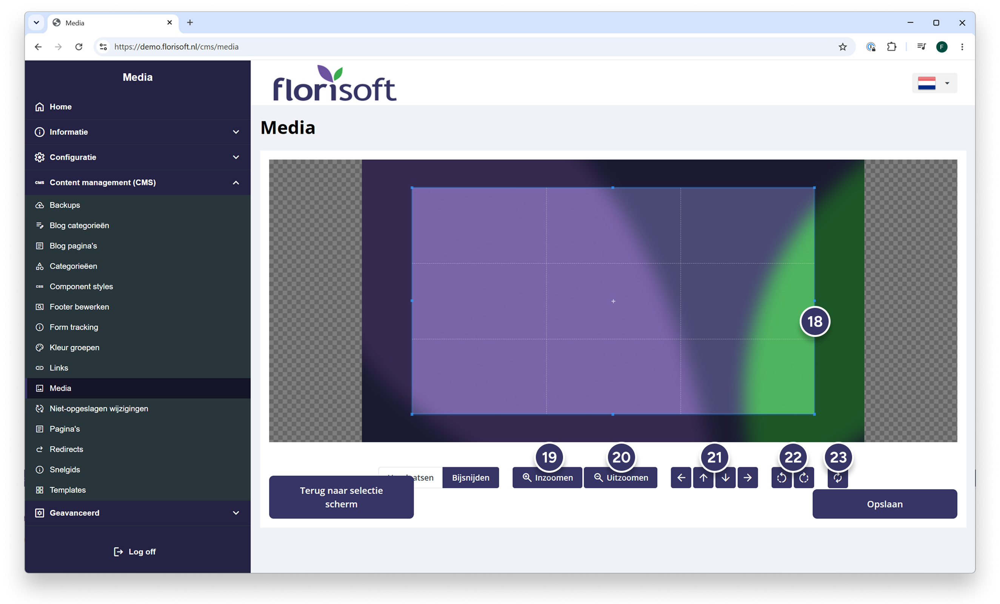
|
|**8**|You can then save the changes (24) or cancel them by navigating back to the selection screen (25). In this example, we will save the changes (24).

<b>Click here for the example image</b>
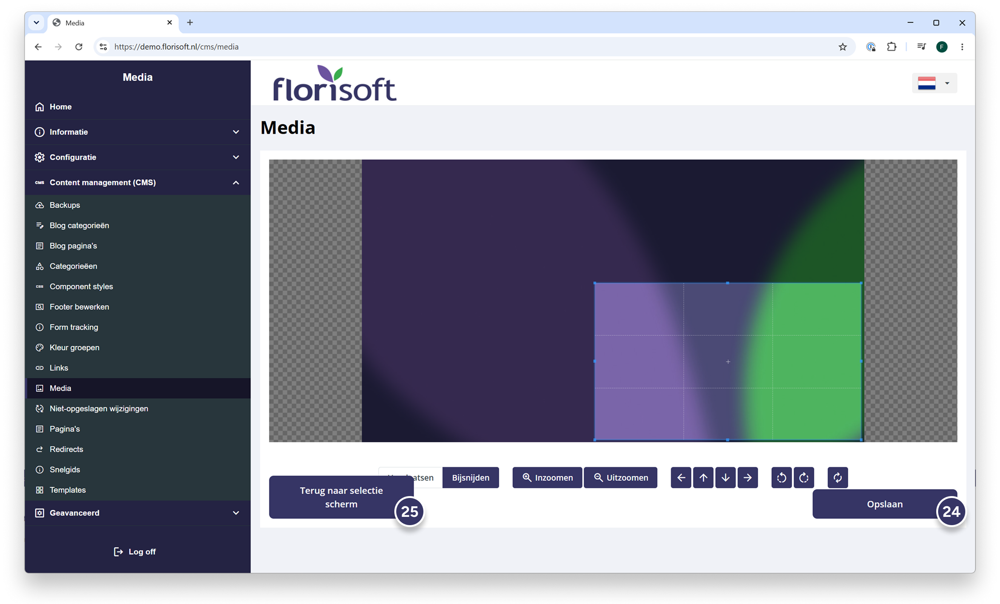
|
|**9**|A new variant (26) of the image has now been added to the overview. This variant contains the modified and cropped version of the image and can then be used on your [CMS pages](#page).

<b>Click here for the example image</b>
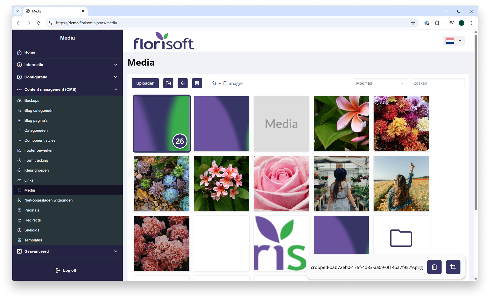
|

---

#### Documents

Via this screen, you can upload files that can then be offered as downloadable content on your web pages.

|Step|Explanation|
|:--|:--|
|**1**|Navigate via **Configuration** (1) to **Documents** (2).

<b>Click here for the example image</b>

|
|**2**|In the **Documents** screen, you can upload a new file (3).

<b>Click here for the example image</b>
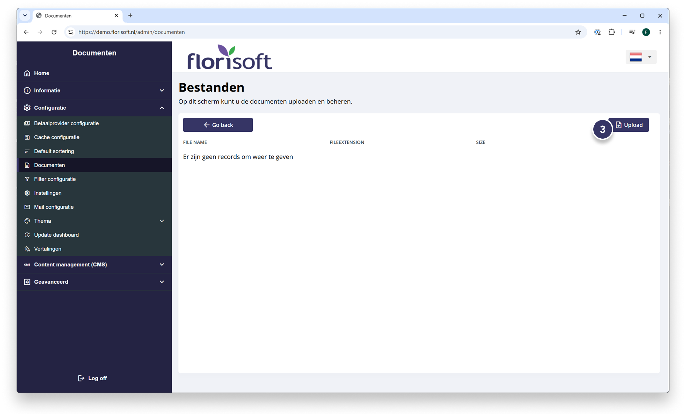
|
|**3**|Drag the desired file into the dropzone or select a file using the designated button (4). After the file has been uploaded successfully, you can return to the overview (5).

<b>Click here for the example image</b>
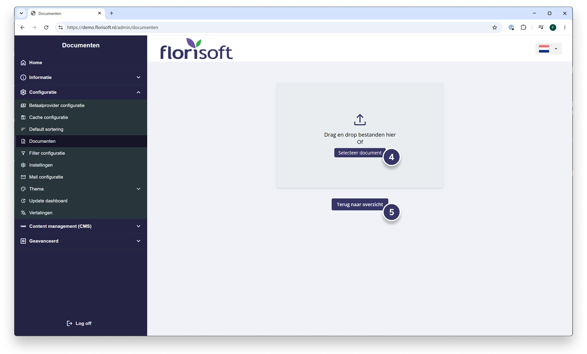
|
|**4**|The uploaded file is now displayed in the overview (6). From this overview, you can delete the file (7) or copy the download path to your clipboard (8). You can then use the copied download path, for example, in a [Button](#button) component, allowing visitors to download the file by clicking the button.

<b>Click here for the example image</b>
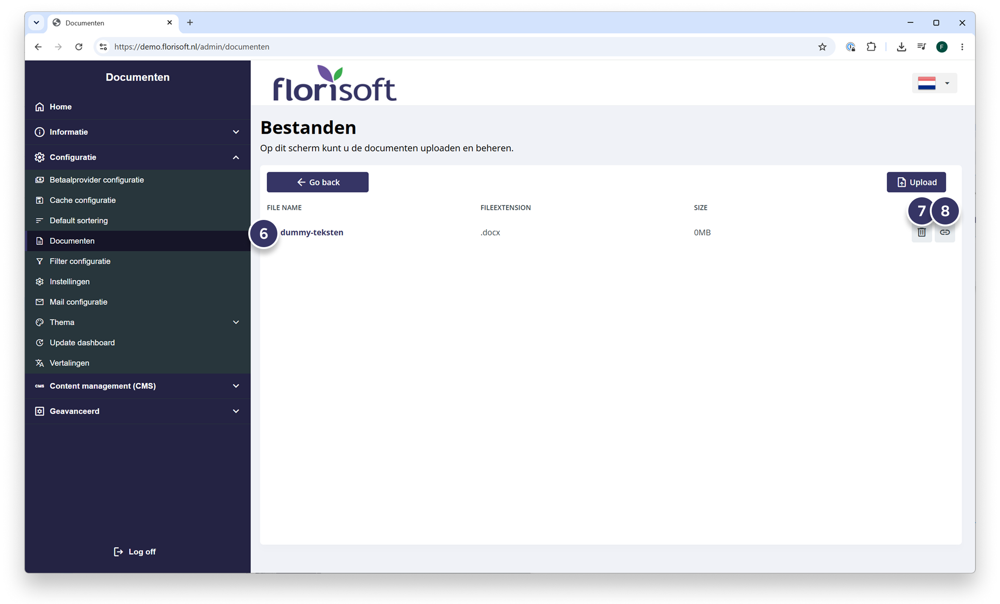
|

---

#### Links

If you have your own website in addition to your FloriShop domain, it can be useful to provide direct links from your webshop to important pages on your own website. The **Links** screen allows you to easily add links to external websites or pages to the navigation bar of your shop.

|Step|Explanation|
|:--|:--|
|**1**|Navigate via **Content Management (CMS)** (1) to **Links** (2).

<b>Click here for the example image</b>

|
|**2**|Click the **'+' icon** (3) to create a new link. In the dialog, enter the following information:  - **Name (4):** enter a recognizable name for the link.  - **URL (5):** enter the URL to which the link should navigate.  - **Display name (6):** enter the name under which the link should be displayed in the navigation bar.  - **Navigation order (optional) (7):** determine the position of the link in the navigation bar. **1** places the link at the beginning.  - **Add user token (optional) (8):** enable this option if a user token should be added to the URL.  Then click **Save** (9) to save the link. The link will then be displayed directly in the navigation bar of your shop.

<b>Click here for the example image</b>
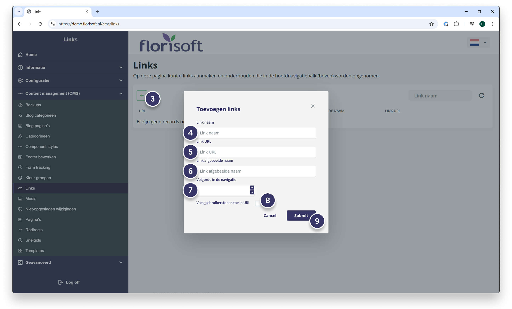
|

---

## Aside Editor

### Toolbar

#### Menu

| Step | Explanation |
|:--|:--|
| **1** | Open the administration menu via **your account name → Management** (1). The **Menu** (2) provides access to the following options available to administrators from the browser:  **3 - Home:** Navigate directly to the home page of your shop.  **4 - Information:** This section contains important technical information about your shop. This information may be useful to developers, for example, when specific information needs to be retrieved from the logs.  **5 - Configuration:** This tab contains relevant settings and configuration options for your shop. From the configuration section, you can create new [themes](#thema-configuratie) and upload [documents](#documenten), among other things.  **6 - Content Management (CMS):** This section contains all relevant options for managing and editing content within the CMS. More information about these options can be found under [Management Screens](#beheerschermen).  **7 - Advanced:** This tab is only accessible to Florisoft employees.  **8 - CMS Editor:** Enable the CMS Editor to start editing your [CMS pages](#pagina).  **9 - Minimize:** Collapse the administration menu.  **10 - Close:** Close the administration environment.

<b>Click here for the example image</b>
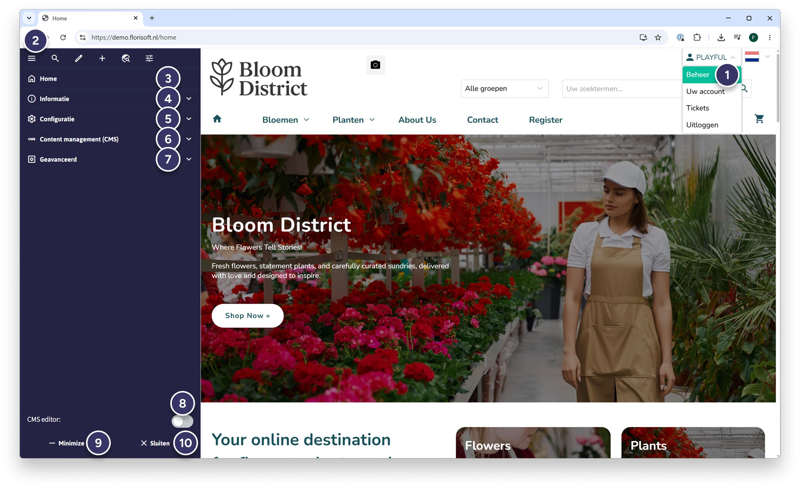
|

---

#### Search

| Item | Description |
|---|---|
| Search | This description will be added later |

---

#### CMS Editor

| Item | Description |
|---|---|
| CMS Editor | This description will be added later |

---

#### Drag & Drop

| Item | Description |
|---|---|
| Drag & Drop | This description will be added later |

---

#### SEO

| Item | Description |
|---|---|
| SEO | This description will be added later |

---

#### Preferences

| Item | Description |
|---|---|
| Preferences | This description will be added later |

---

### Responsive Tabs

#### Desktop

| Item | Description |
|---|---|
| Desktop | This description will be added later |

---

#### Tablet

| Item | Description |
|---|---|
| Tablet | This description will be added later |

---

#### Mobile

| Item | Description |
|---|---|
| Mobile | This description will be added later |

---

### General Settings

#### Translations

| Item | Description |
|---|---|
| General Settings | This description will be added later |

---

### Styling

#### Color Picker

| Item | Description |
|---|---|
| Styling | This description will be added later |

---

#### Border

| Item | Description |
|---|---|
| Styling | This description will be added later |

---

#### Margin/Padding

| Item | Description |
|---|---|
| Styling | This description will be added later |

---

#### Border Radius

| Item | Description |
|---|---|
| Styling | This description will be added later |

---

#### Height/Width

| Item | Description |
|---|---|
| Styling | This description will be added later |

---

#### Box Shadow

| Item | Description |
|---|---|
| Styling | This description will be added later |

---

#### Overflow

| Item | Description |
|---|---|
| Styling | This description will be added later |

---

### Advanced

#### Hidden When Empty

| Item | Description |
|---|---|
| Advanced | This description will be added later |

---

#### Identification Name

| Item | Description |
|---|---|
| Advanced | This description will be added later |

---

#### Slot Name

| Item | Description |
|---|---|
| Advanced | This description will be added later |

---

#### HTML Class Name

| Item | Description |
|---|---|
| Advanced | This description will be added later |

---

#### Tag

| Item | Description |
|---|---|
| Advanced | This description will be added later |

---

#### Z-Index

| Item | Description |
|---|---|
| Advanced | This description will be added later |

---

### Visibility

#### Hide Content

| Item | Description |
|---|---|
| Visibility | This description will be added later |

---

#### Show Content

| Item | Description |
|---|---|
| Visibility | This description will be added later |

---

#### Highlight Content

| Item | Description |
|---|---|
| Visibility | This description will be added later |

---

## Components

### Basic

#### Row/Column

A CMS page uses rows and columns to ensure proper alignment across different devices (desktop, laptop, smartphone, and tablet). This chapter explains how to create a row. Every CMS element must be placed inside a column, and every column must be placed inside a row. This means that every page essentially consists of a grid, similar to a spreadsheet application such as Microsoft Excel.

*Follow the steps below:*

|Step|Explanation|
|:--|:--|
|**1**|Log in to the webshop using an administrator account.|
|**2**|Enable the webshop's **Management** environment by clicking the user icon (1). This opens a dropdown menu. Then click the **Management** option (2).

<b>Click here for the example image</b>

|
|**3**|At the bottom of the screen, enable the CMS editor (3). You can now start editing.

<b>Click here for the example image</b>

|
|**4**|Click the '+' icon (4) or right-click the top element in the Navigator (5) to open the **Component Dialog**. You can also open the dialog using the **Template** button (6), which will automatically open the Templates category.

<b>Click here for the example image</b>

|
|**5**|Use the search function (7) to search for **Row**. Click the plus (+) icon beneath the **Row** component (8).

<b>Click here for the example image</b>

|
|**6**|The Row is immediately added to your page and allows you to add one or more columns. In this example, we choose a layout with three columns next to each other (9).

<b>Click here for the example image</b>

|
|**7**|Select a column in the Navigator (10). In the column settings, open the **Properties** tab (11). Here you can configure the following:  The sliders determine how CMS elements are aligned on devices with different screen sizes, such as desktops/laptops, tablets, and smartphones.  The total width of every screen is divided into a maximum of twelve virtual columns. This means that an element can span a minimum of one and a maximum of twelve columns. This applies to desktops, laptops, tablets, and smartphones alike.  The top slider applies to desktops and laptops, the middle slider to tablets, and the bottom slider to smartphones.

<b>Click here for the example image</b>

|
|**8**|Open the **Styling** tab (12). Styling is optional, but the following settings can be adjusted:  Select a background color using the **Background** dropdown (13). A color picker will appear, allowing you to choose a color. Click **SAVE** in the color picker to apply the selected color.  Under **Height** (14), choose **Auto** or specify a fixed height in Px (pixels), Rem (relative to the font size), or percentages. Using **Auto** is recommended, as the column will automatically adjust its height based on its content.  Under **Margin** (15), you can specify the spacing (whitespace) around the column. You can enter one value for all sides or configure each side individually.  By default, **Px (pixels)** is used as the unit. You can also choose **Rem**, **Percent**, or even values such as **auto**, **unset**, **millimeters (mm)**, and **centimeters (cm)**.  **Padding** (16) determines the spacing inside the column. These settings work the same way as **Margin**.  **Overflow** (17) determines whether content that extends beyond the boundaries of the column remains visible. By default, this is set to **Visible**.

<b>Click here for the example image</b>

|
|**9**|Open the **Advanced** tab (18). The **Advanced** tab allows you to assign additional classes and IDs to a component. Under **Identification name** (19), you can assign a custom name to the component, making it easier to organize components within the Navigator (20).

<b>Click here for the example image</b>

|
|**10**|Open the **Visibility** tab (21). The **Visibility** tab works the same way as when creating pages and categories. See Chapter [Visibillity](#visibillity) for more information about the available settings in the **Visibility** tab. After configuring the desired settings, click **Save** (22) to save the column in the CMS and click **Publish** (23) to make the changes live. **You can always make further changes later.**

<b>Click here for the example image</b>

|

---

#### Panel

| Onderdeel | Beschrijving |
|---|---|
| Panel | Deze beschrijving wordt aangevuld |

---

#### Flex

| Onderdeel | Beschrijving |
|---|---|
| Flex | Deze beschrijving wordt aangevuld |

---

#### Header

| Onderdeel | Beschrijving |
|---|---|
| Header | Deze beschrijving wordt aangevuld |

---

#### Text

| Onderdeel | Beschrijving |
|---|---|
| Text | Deze beschrijving wordt aangevuld |

---

#### Collapsible

| Onderdeel | Beschrijving |
|---|---|
| Collapsible | Deze beschrijving wordt aangevuld |

---

#### Bullet list/Bullet

| Onderdeel | Beschrijving |
|---|---|
| Bullet list | Deze beschrijving wordt aangevuld |

---

#### Spacer

| Onderdeel | Beschrijving |
|---|---|
| Spacer | Deze beschrijving wordt aangevuld |

---

### Media

#### Image

| Onderdeel | Beschrijving |
|---|---|
| Image | Deze beschrijving wordt aangevuld |

---

#### Image overlay

| Onderdeel | Beschrijving |
|---|---|
| Image overlay | Deze beschrijving wordt aangevuld |

---

#### Hotspot

| Onderdeel | Beschrijving |
|---|---|
| Hotspot | Deze beschrijving wordt aangevuld |

---

#### SVG

| Onderdeel | Beschrijving |
|---|---|
| SVG | Deze beschrijving wordt aangevuld |

---

#### HTML video

| Onderdeel | Beschrijving |
|---|---|
| HTML video | Deze beschrijving wordt aangevuld |

---

#### Youtube video

| Onderdeel | Beschrijving |
|---|---|
| Youtube video | Deze beschrijving wordt aangevuld |

---

#### Carousel

| Onderdeel | Beschrijving |
|---|---|
| Carrousel | Deze beschrijving wordt aangevuld |

---

#### Picture row

| Onderdeel | Beschrijving |
|---|---|
| Picture row | Deze beschrijving wordt aangevuld |

---

### Navigation

#### Button

| Onderdeel | Beschrijving |
|---|---|
| Button | Deze beschrijving wordt aangevuld |

---

#### Productlist

| Onderdeel | Beschrijving |
|---|---|
| Partijlijst | Deze beschrijving wordt aangevuld |

---

#### Product

| Onderdeel | Beschrijving |
|---|---|
| Partijkaart | Deze beschrijving wordt aangevuld |

---

#### Social icons

| Onderdeel | Beschrijving |
|---|---|
| Social icons | Deze beschrijving wordt aangevuld |

---

#### Breadcrumbs

| Onderdeel | Beschrijving |
|---|---|
| Breadcrumbs | Deze beschrijving wordt aangevuld |

---

#### Icon link

| Onderdeel | Beschrijving |
|---|---|
| Icon link | Deze beschrijving wordt aangevuld |

---

#### Banner

| Onderdeel | Beschrijving |
|---|---|
| Banner | Deze beschrijving wordt aangevuld |

---

#### Stock navigation

| Onderdeel | Beschrijving |
|---|---|
| Voorraad navigatie | Deze beschrijving wordt aangevuld |

---

#### Shop navigation

| Onderdeel | Beschrijving |
|---|---|
| Shop navigation | Deze beschrijving wordt aangevuld |

---

#### Offer

| Onderdeel | Beschrijving |
|---|---|
| Aanbieding | Deze beschrijving wordt aangevuld |

---

#### Action link

| Onderdeel | Beschrijving |
|---|---|
| Action link | Deze beschrijving wordt aangevuld |

---

#### Add to home button

| Onderdeel | Beschrijving |
|---|---|
| Add to home button | Deze beschrijving wordt aangevuld |

---

#### Anchors toolbar

| Onderdeel | Beschrijving |
|---|---|
| Anchors toolbar | Deze beschrijving wordt aangevuld |

---

### Form

#### Form

Create a dynamic form that can be flexibly configured based on the desired input fields.

Send the submitted data to one or more email addresses and configure an automatic confirmation email for the sender. Prevent spam by using reCAPTCHA. In addition, a **Bot Prevention Mode** is available, which adds a hidden input field to detect and block bots.

Optionally, new customer data can be sent as an Excel file, making it easy to import into the back office.

You can also add components such as [Rows/Columns](#rowcolumn) inside a Form to create a more structured and organized layout.

*Follow the steps below:*

|Step|Description|
|:--|:--|
|**1**|In this example, we are working on a contact [page](#page) and want to add a form. In the [Navigator](#navigator), click the **'+'** icon behind the [Panel](#panel) component (1). This opens the [Components dialog](#components-dialog).

<b>Click here for the example image</b>
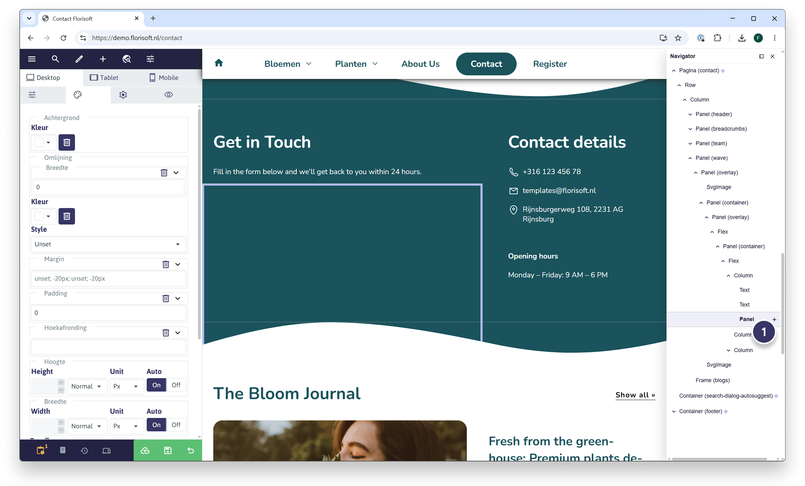
|
|**2**|In the dialog, navigate to the **Form** category (2) and add the **Form** component to the page by clicking the **'+'** icon (3).

<b>Click here for the example image</b>
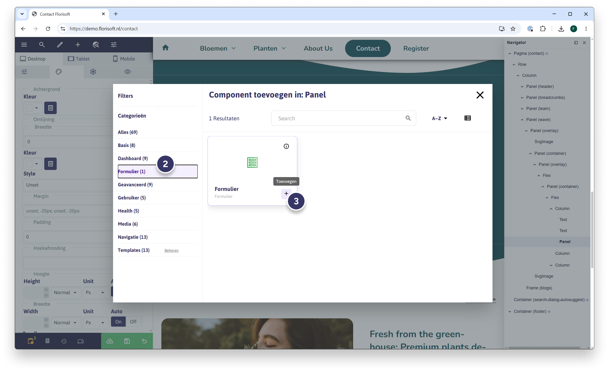
|
|**3**|The **Form** component is now visible (4) in the Navigator and can be configured immediately through the **General settings** tab (5). Click **Edit translations** (6) to enter text for multiple languages. For more information, see [Translations](#translations).  Next, enter the **Email subject** (7). This will be used as the subject line of the email sent to the addresses specified under **Recipients** (8). Use the add button (9) to add multiple email addresses.  To reduce spam, enable **Bot Prevention Mode** (10). The following options are available:  **Hidden input field:** Adds an invisible input field that visitors cannot see. If this field is filled in (typically by a bot), the form submission will be blocked.  **Time-based:** Bots often submit forms within milliseconds. If the form is submitted faster than the configured time (3 seconds by default), the submission will be blocked.  If you have your own Google account, you can also enable **Google reCAPTCHA** (11). Follow these steps:  **Google reCAPTCHA configuration**  1. Sign in to your Google account. 2. If your account does not yet have a project, create one at: https://console.cloud.google.com/projectcreate. 3. Create a new reCAPTCHA instance at: https://www.google.com/recaptcha/admin/create. 3a. Enter a recognizable **Label**, for example: *[Company Name] reCAPTCHA*. 3b. Leave the type set to **Score based (v3) - Verify requests with a score**. This type is supported by the webshop. 3c. Under **Domains**, enter your domain name, for example: *yourdomain.com*. 3d. Select the newly created or an existing Google Cloud Project. 3e. Click **Submit**. 4. On the next page, you will see the **Site Key** and **Secret Key**. Store these safely. 5. *(Optional)* Click **View in Cloud Console** to open the reCAPTCHA management console. 6. Configure the following webshop settings: 6a. **RECAPTCHAACTIVE** → Enable this setting. 6b. **RECAPTCHASITEKEY** → Enter the Site Key. 6c. **RECAPTCHASECRETKEY** → Enter the Secret Key. 7. Restart the webshop after saving the settings. 8. In CMS edit mode, enable **Use reCAPTCHA** for every form that should use reCAPTCHA. 9. Save the CMS changes, publish them, and refresh the page. 10. Google reCAPTCHA is now active. When a form is submitted, Google analyzes user behavior, browser information, and other technical details to calculate a score. If the score is too low, the submission is blocked and the visitor receives an error message.  **Note 1:** This version of reCAPTCHA does **not** use a checkbox. Instead, it calculates a score in the background. **Note 2:** Pages containing forms will automatically display a **"Protected by reCAPTCHA"** badge in the bottom-right corner.  Forms can also be sent using an XSL template to one or more email addresses. In that case, make sure the webshop SMTP settings are configured correctly and that an XSL template (12) is available for the active theme. The same applies to the **Autoreply XSL** (13). Read more about using [Component Styles](#component-styles) (14).

<b>Click here for the example image</b>
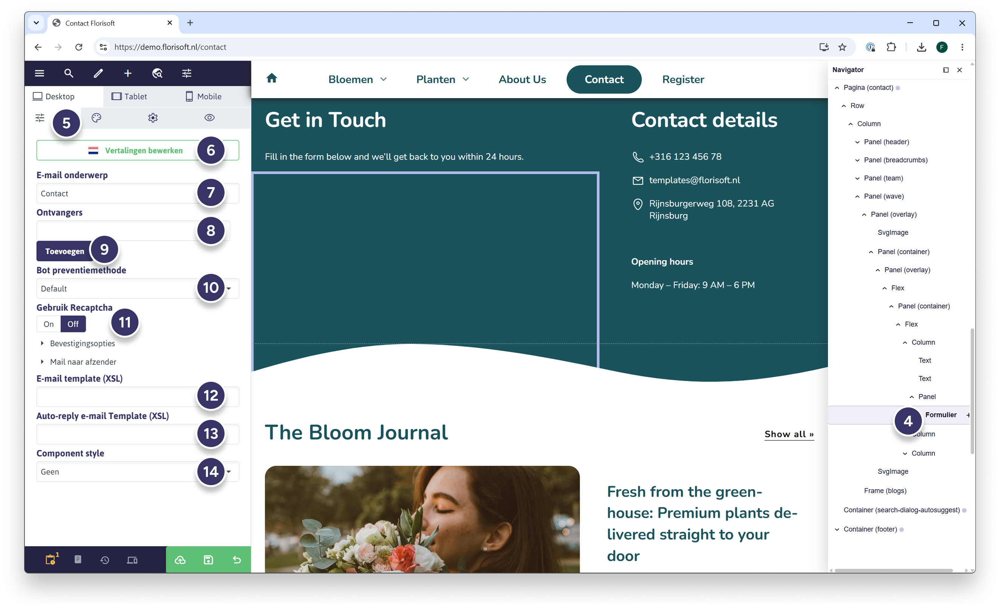
|
|**4**|The confirmation options (15) can also be configured easily. Under **Confirmation feedback** (16), choose whether to display a thank-you message using **ShowDialog**, or redirect the visitor to a [CMS page](#page). When **CMSPage** is selected, choose the destination page via **CMS Page** (17). If you choose **ShowDialog**, you can enter a title (18) and message (19) that will be displayed after a successful submission.

<b>Click here for the example image</b>
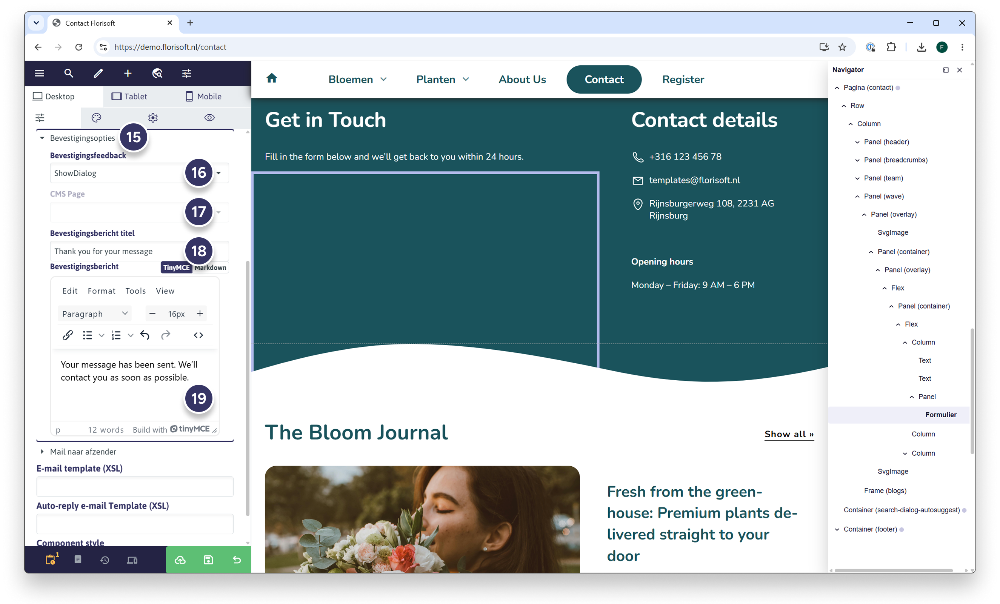
|
|**5**|The **Mail to sender** (20) settings apply when the **Send confirmation email** option is enabled in the [Email Input component](#email-input). After the form is submitted, the sender will automatically receive a confirmation email. Enter a title (21) and message (22). You can use placeholders such as **{{first_name}}** or **{{company_name}}** to personalize the email. Make sure the placeholder names match the corresponding [input fields](#text-input). For privacy compliance, it is recommended to add a [Checkbox](#checkbox) with the following text: *I agree that my personal data may be used to process my request.* Finally, configure the email subject (23).

<b>Click here for the example image</b>

|
|**6**|Use the [Styling](#styling) tab (24) to customize the appearance of the form, including colors and other visual settings.

<b>Click here for the example image</b>
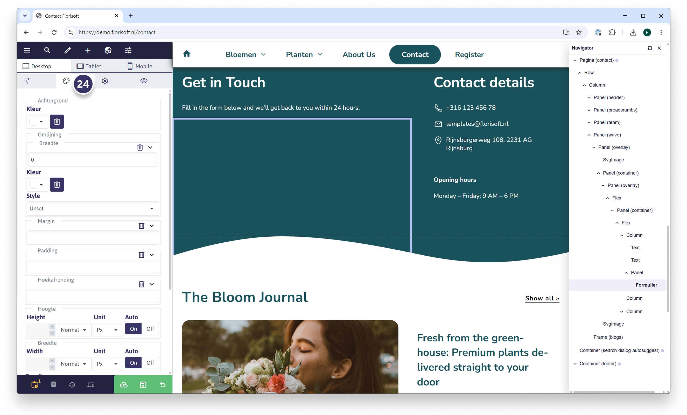
|
|**7**|The [Advanced](#5-advanced) tab (25) contains additional technical settings. For example, **ExcelAsMailAttachment** (26) allows the submitted data to be included as an Excel attachment in the email. The **Database** and **ExcelFile** options store the submitted data on the webshop server. You can also configure the timeout (27) for the previously described **Time-based** bot prevention (in seconds). Optionally, assign a name to the form (28) so it appears clearly in the [Form Tracking](#form-tracking) overview. You can also specify a redirect URL (29), just like in the general settings, to redirect users after a successful submission. We recommend using only one redirect method. Finally, you can choose to clear all input fields after submission (30) or enable **Dummy** mode (31) for testing purposes. The remaining settings are described in [Advanced](#5-advanced).

<b>Click here for the example image</b>
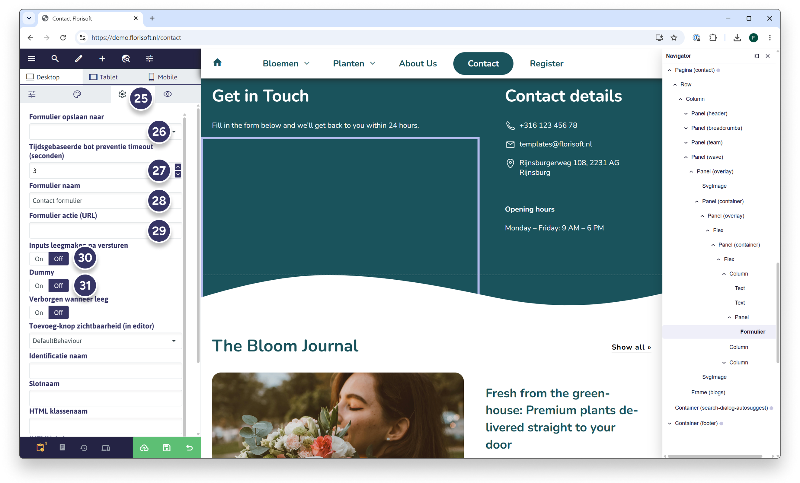
|
|**8**|Use the [Visibility](#visibility) tab to determine which users can see the form.

<b>Click here for the example image</b>
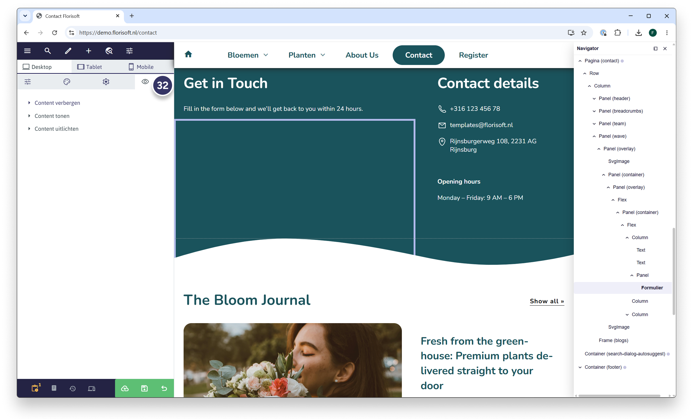
|

---

#### Text input

Use this component to enter textual data within a form.

*Follow the steps below (this is a continuation of the [Form](#form) explanation):*

|Step|Explanation|
|:--|:--|
|**1**|After the [Form](#form) has been created and configured, input fields can be added. In this example, we want to place a **First name** and **Last name** field next to each other. First, add a [Row and Column](#rowcolumn) to the form. Then click the '+' icon behind the **Column** (1). The **Component dialog** will now open.

<b>Click here for the example image</b>
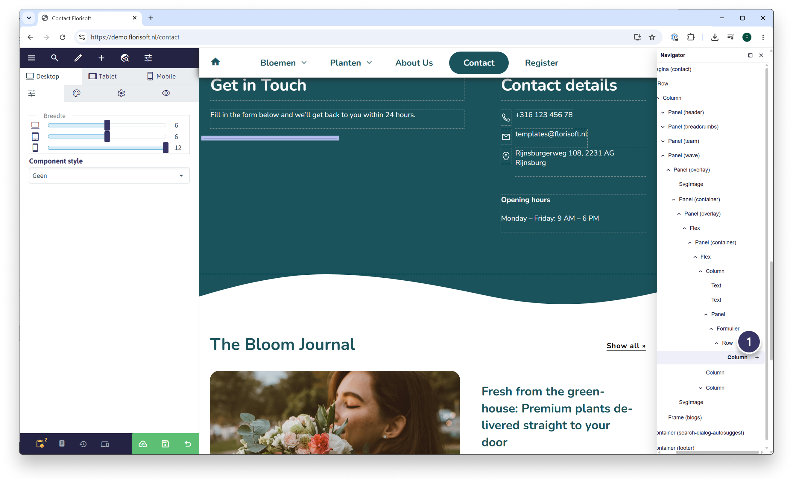
|
|**2**|Navigate to the **Form** category (2), search for the **Text input** component (3), and add it to the **Column** (4).

<b>Click here for the example image</b>
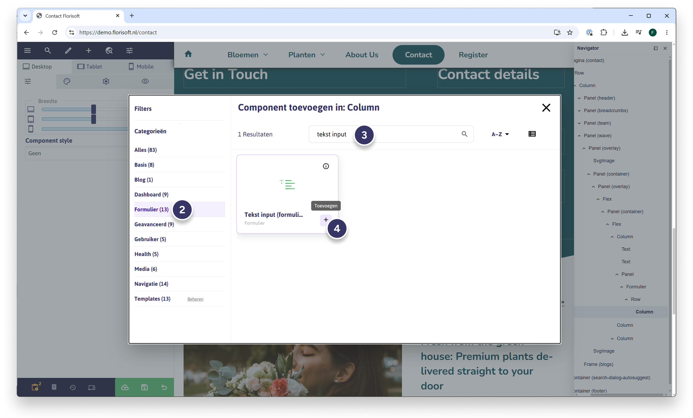
|
|**3**|The **Text input** component (5) has now been added to the **Column** and is immediately visible in the editor (6). You can now configure the component through the **General settings** tab (7).  **8 - Edit translations:** Add translations for multiple languages. Read more about this in [Translations](#translations).  **9 - InputName:** This field is automatically populated with a unique value. **IMPORTANT:** Make sure every input field has a unique **InputName**. Duplicate names will cause errors when submitting the form. The **InputName** can also be used to personalize the thank-you message in the settings of the [Form](#form).  **10 - Mandatory:** Enable or disable this option to specify whether this field is required.  **11 - RegexErrorText:** Enter the message that should be displayed when the entered value does not match the required format.  **12 - GeneralRegex:** Select whether the field should validate its content as a valid phone number or email address.  **13 - Multiline:** Enable this option to display a larger input field where visitors can enter a message or longer text.  **14 - Label:** The name entered here is displayed above the input field.  **15 - CharacterRange:** Define the minimum and/or maximum number of characters allowed in the input field.  **16 - Placeholder:** The text entered here is displayed as a placeholder inside the input field.  **17 - Component Styles:** Read more about this in [Component Styles](#component-styles).  More information about the [Styling](#4-styling) (18), [Advanced](#5-advanced) (19), and [Visibility](#6-visibility) (20) tabs can be found in their respective chapters.

<b>Click here for the example image</b>
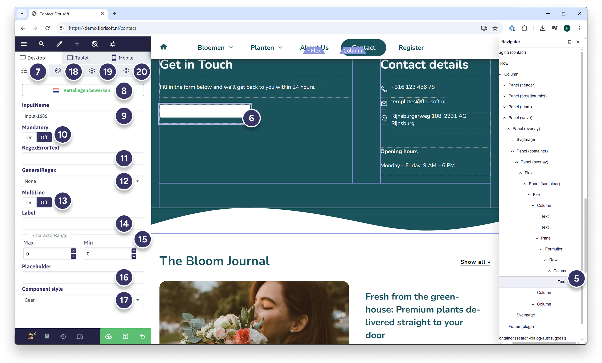
|
|**4**|Now that the structure **Row → Column → Text input** has been created, you can easily duplicate the column by right-clicking the **Column** (21) and selecting **Duplicate** (22).

<b>Click here for the example image</b>
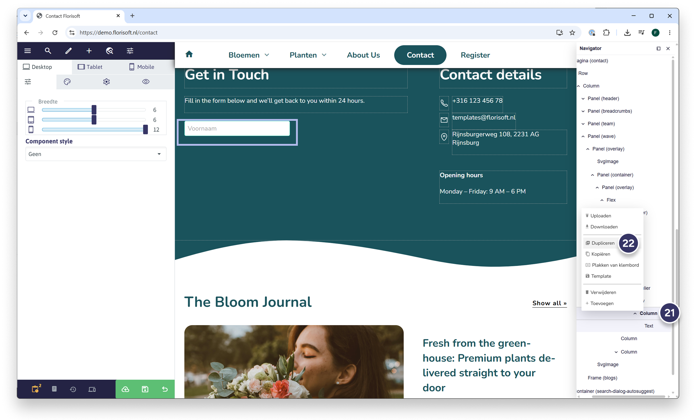
|
|**5**|A new **Column** will immediately be added next to the existing one with the same content (23). Select the new **Text input** component through the editor (23) or the Navigator (24). Make sure the **InputName** has a unique value (25) and adjust the **Placeholder** (26) and other settings if needed.

<b>Click here for the example image</b>
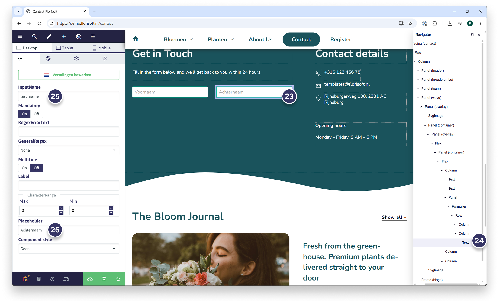
|

---

#### Email input

This input field only accepts valid email addresses. Additionally, it can be configured to automatically send a confirmation email to the entered email address. The content of this email can be configured in the [Form](#form) component.

*Follow the steps below (this is a continuation of the explanation of [Text Input](#text-input)):*

|Step|Explanation|
|:--|:--|
|**1**|In the [Text Input](#text-input) component, we previously configured fields for entering a first name and last name. In this step, we will add an email field to the [Form](#form). Click the '+' icon behind the form (1).

<b>Click here for the example image</b>
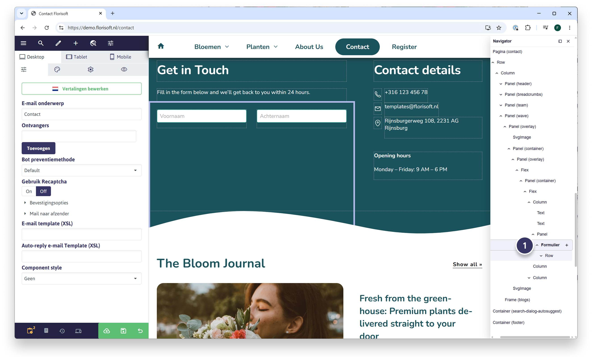
|
|**2**|Navigate through the **Form** category (2) to the **Email input** component (3) and add it to the **Form** (4).

<b>Click here for the example image</b>
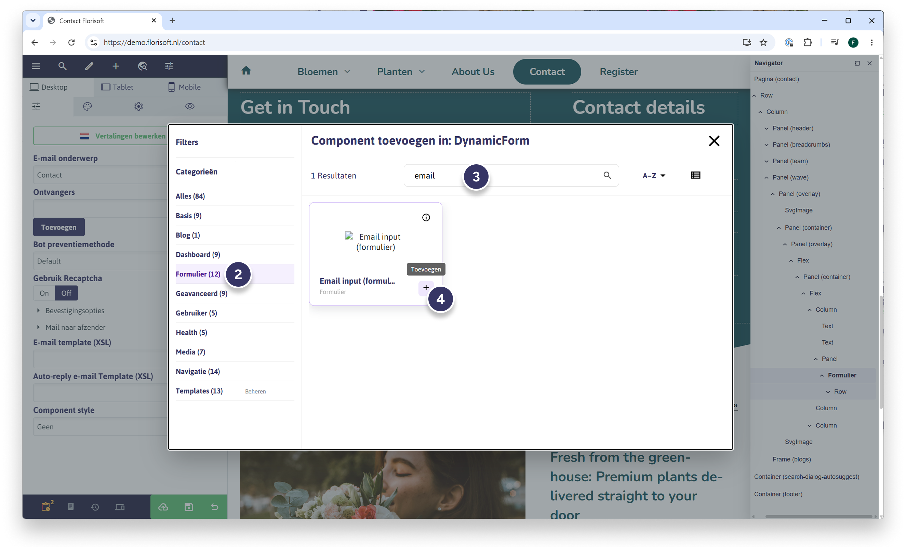
|
|**3**|The **Email input** component (5) has now been added to the **Form** and is immediately visible in the editor (6). Open the **General settings** tab (7) to configure the component.  Make sure the **InputName** (8) also has a unique value for this component, as described in [Text Input](#text-input).  The **Email input** component contains mostly the same settings as the **Text input** component, but has one additional important option: **Send confirmation email** (9). When this option is enabled, the confirmation message configured in the [Form](#form) settings will automatically be sent to the entered email address.  **IMPORTANT:** If the confirmation message has not been configured, but the **Send confirmation email** option is enabled, an empty email will be sent to the sender.

<b>Click here for the example image</b>
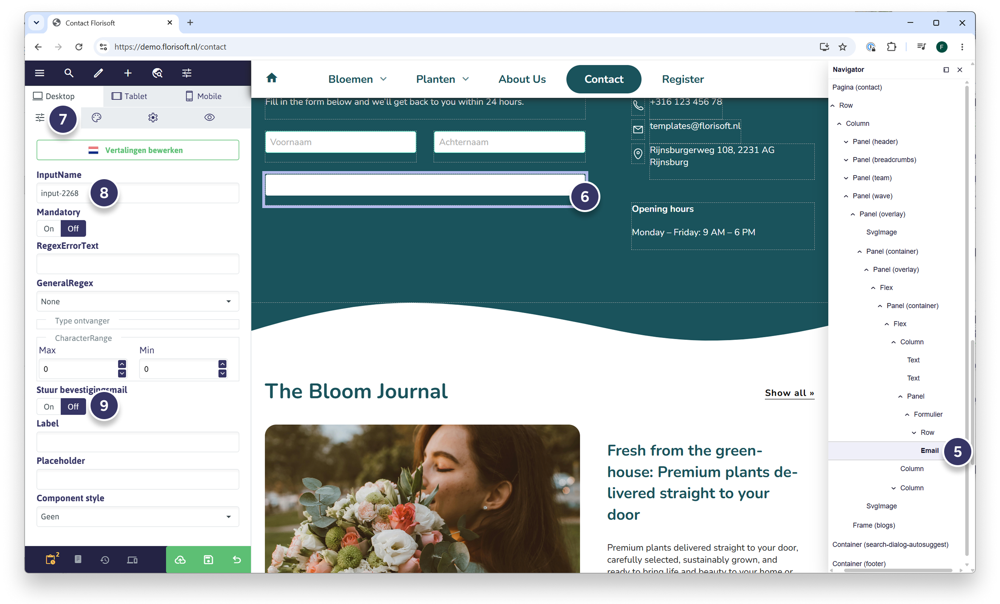
|

---

#### Number input

Use this component within a form when only numeric values should be entered.

The functionality and available settings of this component are largely the same as the [Text input](#text-input) component.

---

#### File input

This component enables users to upload files that are submitted along with the form.

Supported file formats:
*.jpg; *.png; *.jpeg; *.doc; *.docx; *.pdf; *.mkv; *.mp4; *.wmv; *.txt; *.avi; *.svg; *.wav; *.xls; *.rtf

The functionality and available settings of this component are largely the same as the [Text input](#text-input) component.

---

#### Checkbox

Use this component to add a checkbox to a form. It can be used, for example, to allow visitors to accept the terms and conditions, privacy policy, or consent to the processing of their personal data.

The functionality and available settings of this component are largely the same as those of the [Text input](#text-input) component.

> **Tip:** For a cleaner presentation in the submitted email, we recommend using the [Multiple choice](#multiple-choice) component instead. It displays the selected option in a more user-friendly way and offers additional functionality.

|Step|Explanation|
|:--|:--|
|**1**|The **Checkbox** component contains most of the same settings as the **Text input** component, but includes one additional option: **Checked on start** (1). When this option is enabled, the checkbox is selected by default when the form is loaded.

<b>Click here for the example image</b>
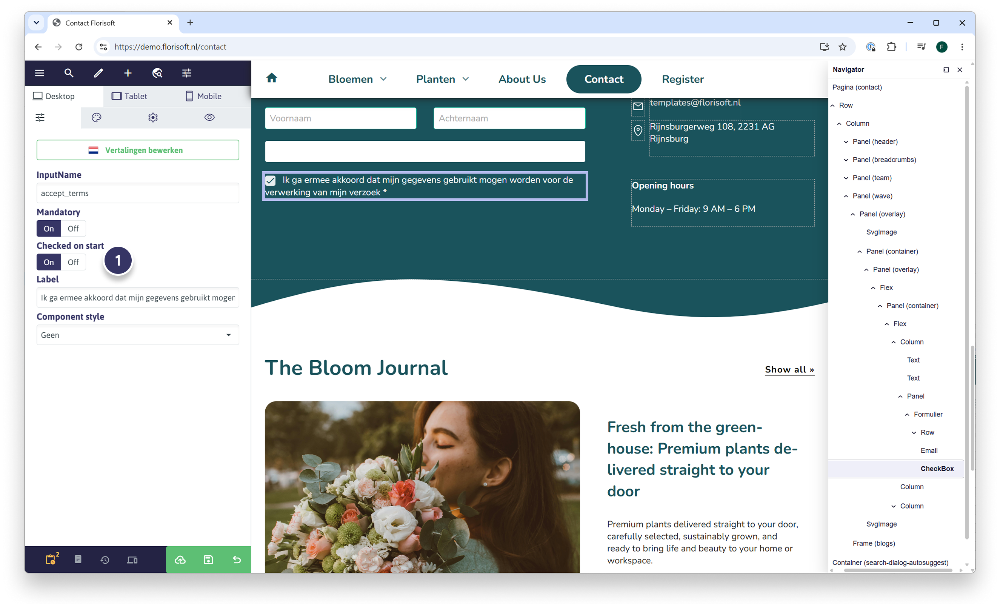
|

---

#### Radio button

Use this component within a form to allow visitors to select a single option from multiple choices. Each option is added as a separate radio button, with only one option being selectable at a time.

The functionality and available settings of this component are largely the same as those of the [Text input](#text-input) and [Checkbox](#checkbox) components.

> **Tip:** For a cleaner presentation in the submitted email, we recommend using the [Multiple choice](#multiple-choice) component instead. It displays the selected option in a more user-friendly way and offers additional functionality.

---

#### Multiple choice

Use this component to allow visitors to select one or multiple options from a list of available choices.

Depending on the selected mode, the options are displayed as:

- **Checkboxes** – when multiple options can be selected.
- **Radio buttons** – when only one option can be selected.

When the form is submitted, only the selected options are included in the confirmation email.

The functionality and available settings of this component are largely the same as those of the [Text input](#text-input) component.

|Step|Explanation|
|:--|:--|
|**1**|The **Multiple choice** component contains mostly the same settings as the **Text input** component, but includes two additional options.  **1 - Options:** Add the available choices here. New options can easily be added using the **Add** button (2).  **3 - Mode:** Determine how the options are displayed. Select **Checkboxes** when multiple answers are allowed, or **Radio buttons** when only one answer can be selected.

<b>Click here for the example image</b>
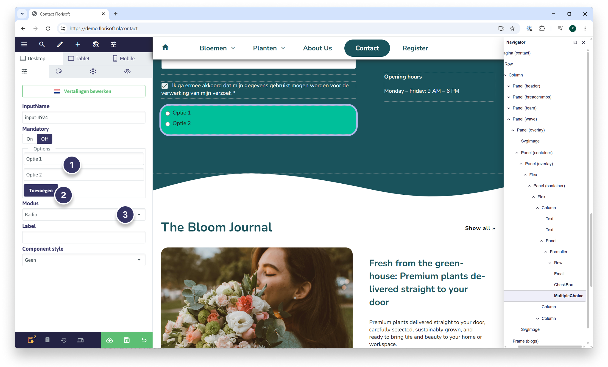
|

---

#### Dropdown (single select) / Single select option

Use this component within a form to add a dropdown menu with selectable options. The available options within the dropdown are created using **Dropdown Single Select Option** components.

Additionally, it is possible to automatically load a list of all countries worldwide.

The functionality and available settings of this component are largely the same as those of the [Text input](#text-input) component.

|Step|Explanation|
|:--|:--|
|**1**|The **Dropdown (single select)** component contains mostly the same settings as the **Text input** component, but includes one additional option: **UsePredefinedCountryTemplate** (1). When this option is enabled, a list of all available countries worldwide is automatically loaded.  In this example, we will add the options manually, so this option remains disabled. Then click the '+' icon behind **DropdownSingleSelect** (2). The **Component dialog** will now open.

<b>Click here for the example image</b>
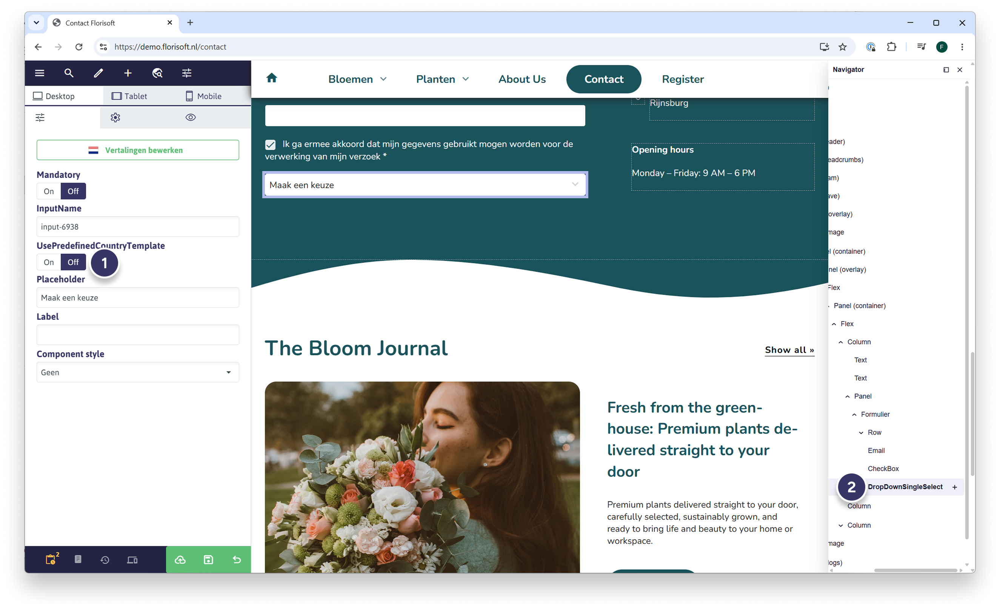
|
|**2**|Navigate through the **Form** category (3) to the **DropdownSingleSelectOption** component (4) and add it to the **DropdownSingleSelect** component.

<b>Click here for the example image</b>
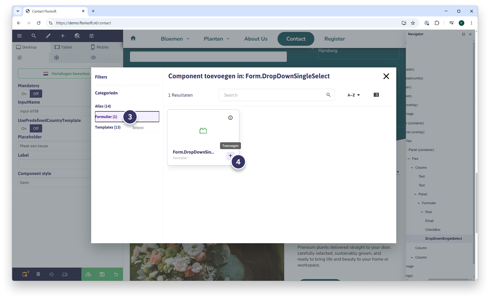
|
|**3**|The **DropdownSingleSelectOption** component has now been added to the **DropdownSingleSelect** component (5). Configure the option by entering a name in **InputName** (6), setting the value in **Value** (7), and providing a visible name in **Label** (8).

<b>Click here for the example image</b>
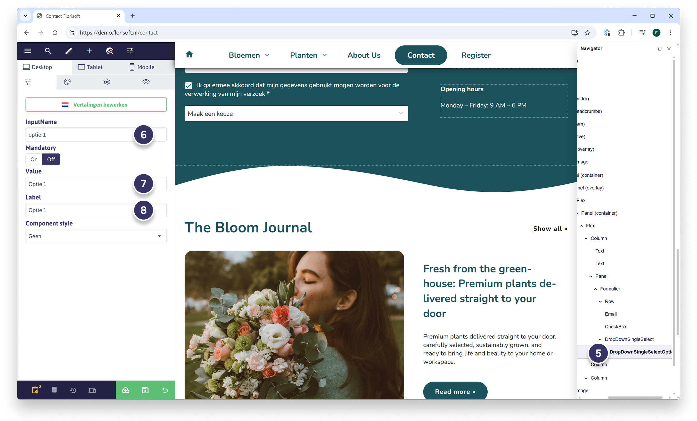
|
|**4**|When opening the dropdown menu, you will see that the newly created option is now available as a selectable choice.

<b>Click here for the example image</b>
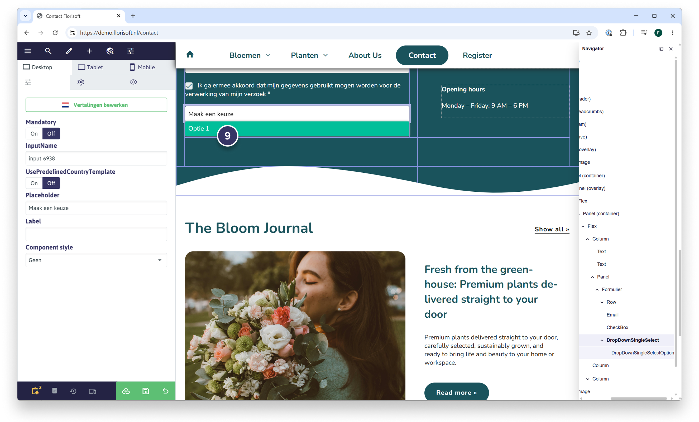
|

---

#### Hidden input

This component is used to send data that is not visible to the user but is required for the confirmation email or the generated Excel file.

For example, you can configure a form so that submitted data is automatically processed into an email and an Excel file. This file can then be used directly for import into the Florisoft back office using the customer import function.

This is particularly useful when processing registration forms, where additional data can be automatically linked to a new customer.

**Note:** Always use existing columns from the back office. Adding custom or unknown fields is not supported.

|Step|Explanation|
|:--|:--|
|**1**|In this example, we have added three **Hidden input** components to the [Form](#formulier-1).  The first example shows a **Hidden input** (1) with a **Name** and **Value** that refer to a template customer (2).  The second example shows a **Hidden input** (3) with **DEBNR** as the value (4). The third example shows a **Hidden input** (5) with **DEBKEY** as the **Name** (6).  **Note:** Always use existing columns from the back office. Deviating from these is not supported.

<b>Click here for the example image</b>
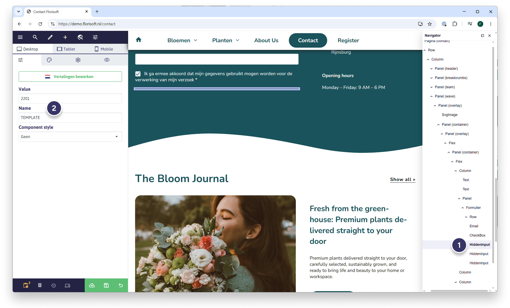

<b>Click here for the example image</b>
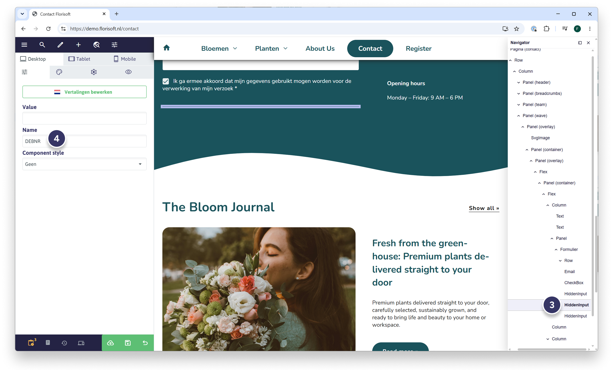

<b>Click here for the example image</b>
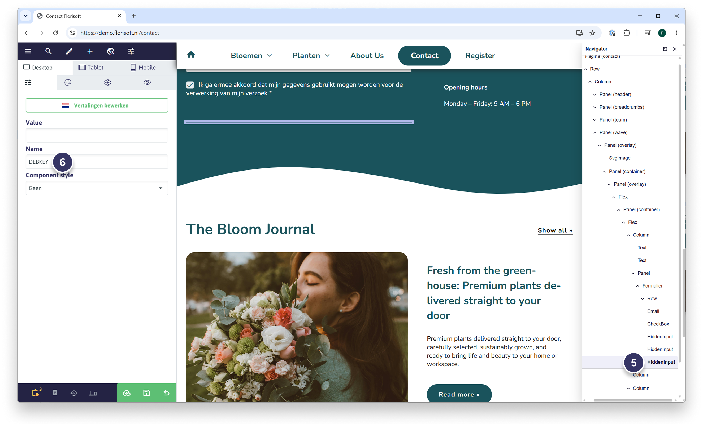
|
|**2**|Configure the [Form](#formulier-1) so that the data is stored using **Database**, **ExcelFile**, or **ExcelAsMailAttachment** and sent to the recipient.  When the recipient opens the Excel file from the email, the **Hidden input** fields can be populated with the corresponding data.  The Excel file can then be imported into the Florisoft back office via **Constants** (7) → **Import** (8) → **Customers** (9).  Based on the imported data, a new customer is then created using a predefined template Debtor ([Read more about Debtor settings](https://github.com/florisoft/User.Manuals/blob/main/FLORISHOP%20MANUALS/Florisoft%20manual%20debtors%2C%20stock%20%26%20order%20lists.md)). In the customer settings of this new customer, the **DEBNR** and **DEBKEY** fields are populated with the values entered in the Excel file by the recipient of the registration form.

<b>Click here for the example image</b>
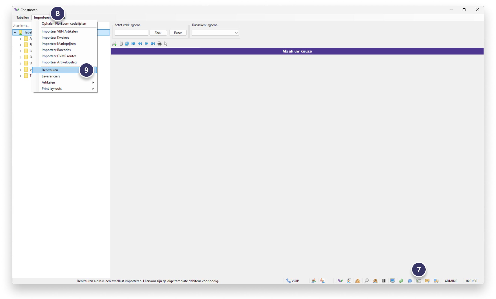
|

---

#### Hidden debtor info

This component can be used to automatically include information about a logged-in debtor when a form is submitted. This information can then be included in the confirmation email, making it immediately clear which debtor submitted the form.

The debtor does not need to enter this information manually. Because the debtor is logged in, the available information can be retrieved automatically from the system.

|Step|Explanation|
|:--|:--|
|**1**|In this example, we have added the **Hidden debtor info** component (1) to the [Form](#form-1). Open the **General settings** tab (2). Using the dropdown menu (3), you can select which information about the logged-in debtor should be included with the form. The debtor cannot see this input field. Because the debtor is logged in, information such as **DEBNR**, **DEBKEY**, and **DEBNAAM** can be retrieved automatically and added to the form. This means the debtor does not need to enter this information manually, as it is already available in the system.

<b>Click here for the example image</b>
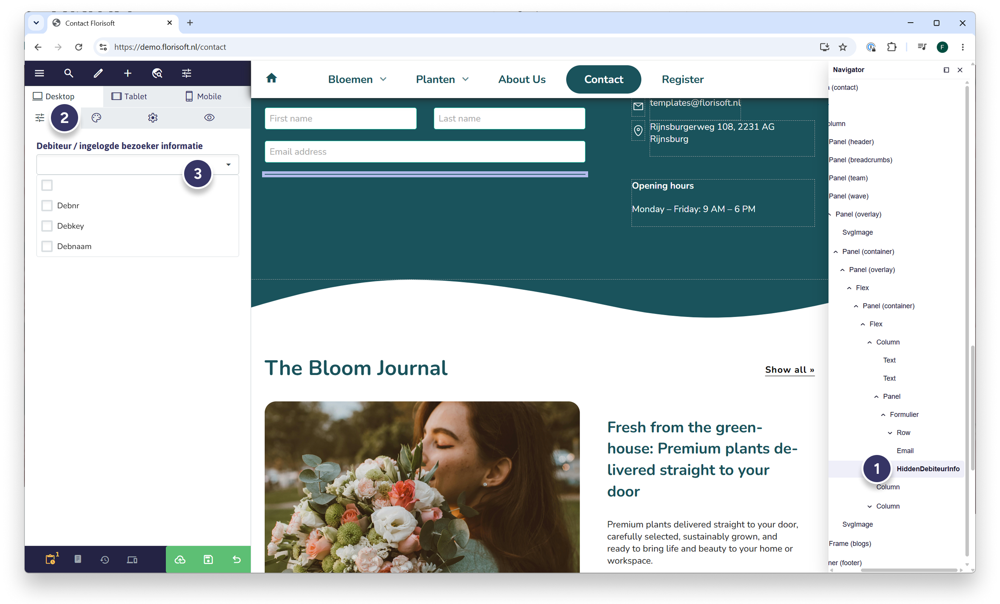
|

---

#### Submit button

Use this component to submit a form and process the entered data.

|Step|Explanation|
|:--|:--|
|**1**|Once the [Form](#form-1) contains all desired input fields, a **Submit button** must be added to the form. This allows the visitor to submit the form to the configured recipient(s). Click the '+' icon behind the form (1). The component dialog will now open.

<b>Click here for the example image</b>
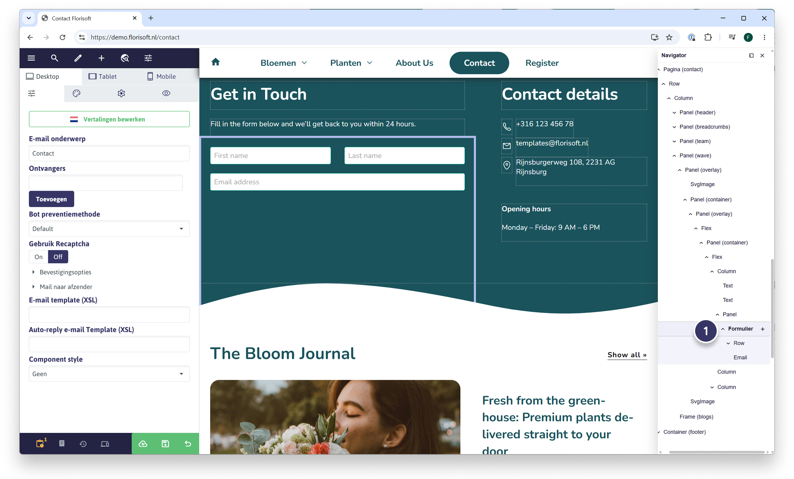
|
|**2**|Navigate to the **Form** category (2) or use the search function (3) to find the **Submit button**. Then add it (4) to the form.

<b>Click here for the example image</b>
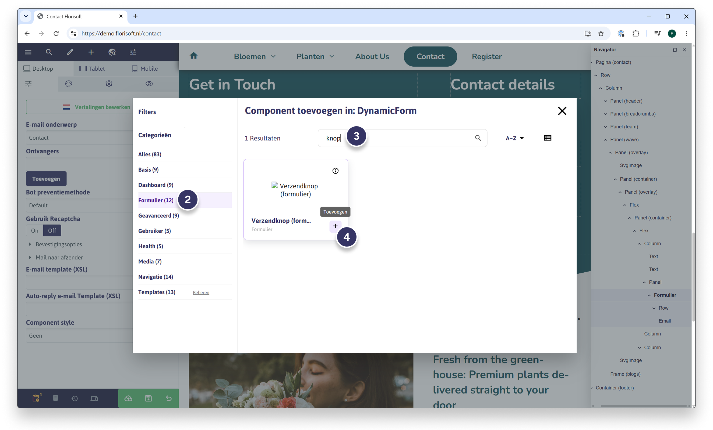
|
|**3**|The **Submit button** has now been added to the form (5) and is immediately visible in the Editor (6). The following settings can be configured via the **General settings** tab (7):  **8 - [Translations](#translations):** If desired, configure the translations for the button.  **9 - Text:** Enter the text that should be displayed on the Submit button.  **10 - Chevron:** Enable or disable this option to display an arrow on the Submit button.  **11 - Switch Variant:** Enable this option to use the secondary color of the Submit button. This color is configured in the [Theme Configuration](#theme-configuration) under the name `button-secondary-bgcolor`.  **12 - URL OPTIONAL:** Enter a URL path here if desired. In most cases, this field can be left empty.  **13 - Button position:** Set the position of the Submit button here.  **14 - Open in new tab:** When this option is enabled, clicking the button opens a new browser tab in which the specified URL path (12) is loaded.  **15 - [Component Style](#component-styles):** If desired, select a Component Style for the Submit button.  For additional settings in the other tabs, refer to the [Styling](#4-styling), [Advanced](#5-advanced), and [Visibility](#6-visibility) sections.  Once the form has been completed correctly, the visitor can submit it using the newly added **Submit button**. Submitted forms can then be tracked via the [Form Tracking](#form-tracking) screen.

<b>Click here for the example image</b>
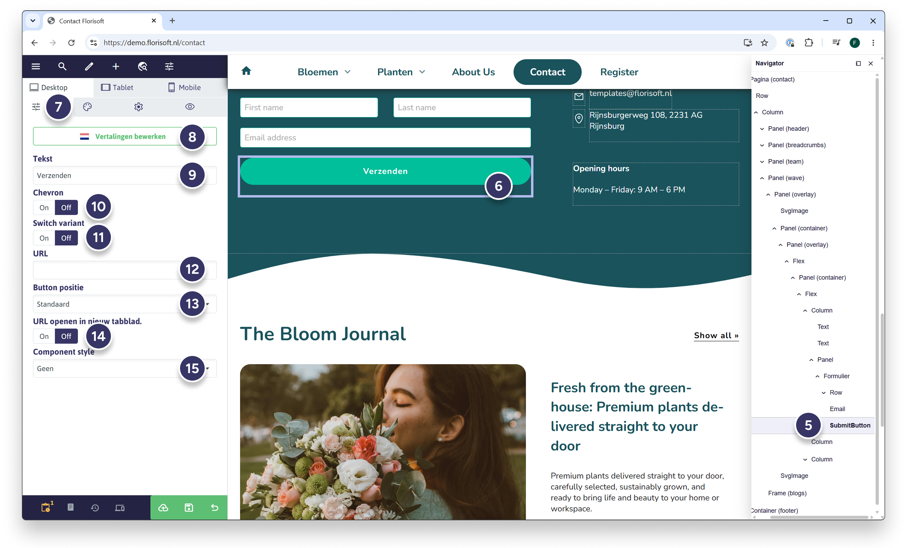
|

---

### User

#### Login form

| Onderdeel | Beschrijving |
|---|---|
| Login form | Deze beschrijving wordt aangevuld |

---

#### Debtor info

| Onderdeel | Beschrijving |
|---|---|
| Debiteur info | Deze beschrijving wordt aangevuld |

---

#### Your account

| Onderdeel | Beschrijving |
|---|---|
| Uw account | Deze beschrijving wordt aangevuld |

---

#### Accountmanager

| Onderdeel | Beschrijving |
|---|---|
| Accountmanager | Deze beschrijving wordt aangevuld |

---

#### Registrationform

| Onderdeel | Beschrijving |
|---|---|
| Registratieformulier | Deze beschrijving wordt aangevuld |

---

### Templates

#### Footer template

| Onderdeel | Beschrijving |
|---|---|
| Footer template | Deze beschrijving wordt aangevuld |

---

### Advanced

#### Iframe

| Onderdeel | Beschrijving |
|---|---|
| Iframe | Deze beschrijving wordt aangevuld |

---

#### Blog

| Onderdeel | Beschrijving |
|---|---|
| Blog | Deze beschrijving wordt aangevuld |

---

#### Category overview

| Onderdeel | Beschrijving |
|---|---|
| Category overview | Deze beschrijving wordt aangevuld |

---

#### Frame

| Onderdeel | Beschrijving |
|---|---|
| Frame | Deze beschrijving wordt aangevuld |

---

#### Custom

| Onderdeel | Beschrijving |
|---|---|
| Custom | Deze beschrijving wordt aangevuld |

---

#### Choice Component

| Item | Description |
|---|---|
| Choice Component | This description will be added later |

---

#### Button (Keuze)

| Onderdeel | Beschrijving |
|---|---|
| Button (Keuze) | Deze beschrijving wordt aangevuld |

---

#### Lottie player

| Onderdeel | Beschrijving |
|---|---|
| Lottie player | Deze beschrijving wordt aangevuld |

---

#### Suggestions

| Onderdeel | Beschrijving |
|---|---|
| Suggestions | Deze beschrijving wordt aangevuld |

---

### Dashboard

#### Chart

| Onderdeel | Beschrijving |
|---|---|
| Chart | Deze beschrijving wordt aangevuld |

---

#### Piechart

| Onderdeel | Beschrijving |
|---|---|
| Piechart | Deze beschrijving wordt aangevuld |

---

#### Gauge

| Onderdeel | Beschrijving |
|---|---|
| Gauge | Deze beschrijving wordt aangevuld |

---

#### Table view

| Onderdeel | Beschrijving |
|---|---|
| Table view | Deze beschrijving wordt aangevuld |

---

#### Progressbar

| Onderdeel | Beschrijving |
|---|---|
| Progressbar | Deze beschrijving wordt aangevuld |

---

#### Dashboard view

| Onderdeel | Beschrijving |
|---|---|
| Dashboard view | Deze beschrijving wordt aangevuld |

---

#### Embedded dashboard

| Onderdeel | Beschrijving |
|---|---|
| Embedded dashboard | Deze beschrijving wordt aangevuld |

---

#### Filter toolbar

| Onderdeel | Beschrijving |
|---|---|
| Filter toolbar | Deze beschrijving wordt aangevuld |

---

#### Searchterm

| Onderdeel | Beschrijving |
|---|---|
| Searchterm | Deze beschrijving wordt aangevuld |

---

#### Query filter

| Onderdeel | Beschrijving |
|---|---|
| Query filter | Deze beschrijving wordt aangevuld |

---

#### Preset value filter

| Onderdeel | Beschrijving |
|---|---|
| Preset value filter | Deze beschrijving wordt aangevuld |

---

#### Query filter date

| Onderdeel | Beschrijving |
|---|---|
| Query filter date | Deze beschrijving wordt aangevuld |

---

#### Query variable

| Onderdeel | Beschrijving |
|---|---|
| Query variable | Deze beschrijving wordt aangevuld |

---

### Health

#### Health chart

| Onderdeel | Beschrijving |
|---|---|
| Health chart | Deze beschrijving wordt aangevuld |

---

#### Health check

| Onderdeel | Beschrijving |
|---|---|
| Health check | Deze beschrijving wordt aangevuld |

---

#### Health errors

| Onderdeel | Beschrijving |
|---|---|
| Health errors | Deze beschrijving wordt aangevuld |

---

#### Health gauge

| Onderdeel | Beschrijving |
|---|---|
| Health gauge | Deze beschrijving wordt aangevuld |

---

#### Health log

| Onderdeel | Beschrijving |
|---|---|
| Health log | Deze beschrijving wordt aangevuld |
