# Uitgebreide handleiding add-on Content Management Systeem (CMS)

> **Let op:** omdat het CMS continu wordt doorontwikkeld, kunnen sommige screenshots en stappen in deze handleiding in bepaalde gevallen afwijken van de actuele situatie in het systeem.
>
> **Let op:** Dit document wordt aangevuld.

## Inhoud

### Beheerschermen

---

#### 1. Pagina's
- [Categorieën](#categorieën)
- [Pagina](#pagina)
- [Blog categorieën](#blog-categorieën)
- [Blogpagina](#blogpagina)
- [Footer bewerken](#footer-bewerken)
- [Templates](#templates)

#### 2. Geavanceerd
- [Thema Configuratie](#thema-configuratie)
- [Backups](#backups)
- [Redirects](#redirects)
- [Niet opgeslagen wijzigingen](#niet-opgeslagen-wijzigingen)
- [Form tracking](#form-tracking)
- [Component styles](#component-styles)
- [Kleurgroepen (Dashboards)](#kleurgroepen-dashboards)

#### 3. Overig
- [Media](#media)
- [Documenten](#documenten)
- [Links](#links)
- [Editor](#editor)
- [Navigator](#navigator)
- [Componentendialoog](#componentendialoog)
- [CMS Zone](#cms-zone)

---

### Aside editor

---

#### 1. Toolbar
- [Menu](#menu)
- [Zoeken](#zoeken)
- [CMS editor](#cms-editor)
- [Drag & Drop](#drag--drop)
- [SEO](#seo)
- [Voorkeuren](#voorkeuren)
- [Responsive tabs](#responsive-tabs)

#### 2. Algemene instellingen
- [Vertalingen](#vertalingen)

#### 3. Styling
- [Color picker](#color-picker)
- [Omlijning](#omlijning)
- [Margin/padding](#margin-padding)
- [Hoekafronding](#hoekafronding)
- [Hoogte/Breedte](#hoogte-breedte)
- [Slagschaduw](#slagschaduw)
- [Overflow](#overflow)

#### 4. Geavanceerd
- [Verborgen wanneer leeg](#verborgen-wanneer-leeg)
- [Toevoeg-knop zichtbaarheid (in editor)](#toevoegknop-zichtbaarheid-in-editor)
- [Identificatie naam](#identificatie-naam)
- [Slotnaam](#slotnaam)
- [HTML klassenaam](#html-klassenaam)
- [Tag](#tag)
- [Z-index](#z-index)

#### 5. Zichtbaarheid
- [Content verbergen](#content-verbergen)
- [Content tonen](#content-tonen)
- [Content uitlichten](#content-uitlichten)

---

### Componenten

---

#### 1. Basis
- [Row/Column](#rowcolumn)
- [Panel](#panel)
- [Flex](#flex)
- [Header](#header)
- [Text](#text)
- [Collapsible](#collapsible)
- [Bullet list/Bullet](#bullet-list-bullet)
- [Spacer](#spacer)

#### 2. Media
- [Image](#image)
- [Image overlay](#image-overlay)
- [Hotspot](#hotspot)
- [SVG](#svg)
- [HTML video](#html-video)
- [Youtube video](#youtube-video)
- [Carrousel](#carrousel)
- [Picture row](#picture-row)

#### 3. Navigatie
- [Button](#button)
- [Partijlijst](#partijlijst)
- [Partijkaart](#partijkaart)
- [Social icons](#social-icons)
- [Breadcrumbs](#breadcrumbs)
- [Icon link](#icon-link)
- [Banner](#banner)
- [Voorraad navigatie](#voorraad-navigatie)
- [Shop navigation](#shop-navigation)
- [Aanbieding](#aanbieding)
- [Action link](#action-link)
- [Add to home button](#add-to-home-button)
- [Anchors toolbar](#anchors-toolbar)

#### 4. Formulieren
- [Formulier](#formulier)
- [Tekst input](#tekst-input)
- [Email input](#email-input)
- [Nummer input](#nummer-input)
- [Bestand input](#bestand-input)
- [Checkbox](#checkbox)
- [Radio button](#radio-button)
- [Multiple choice](#multiple-choice)
- [Dropdown (single select)/(single select option)](#dropdown-single-select--single-select-option)
- [Hidden input](#hidden-input)
- [Hidden debiteur info](#hidden-debiteur-info)
- [Verzendknop](#verzendknop)

#### 5. Gebruiker
- [Login form](#login-form)
- [Debiteur info](#debit-info)
- [Uw account](#uw-account)
- [Accountmanager](#accountmanager)
- [Registratieformulier](#registratieformulier)

#### 6. Templates
- [Footer template](#footer-template)

#### 7. Geavanceerd
- [Iframe](#iframe)
- [Blog](#blog)
- [Category overview](#category-overview)
- [Frame](#frame)
- [Custom](#custom)
- [Keuze component](#keuze-component)
- [Button (Keuze)](#button-keuze)
- [Lottie player](#lottie-player)
- [Suggestions](#suggestions)

#### 8. Dashboard
- [Chart](#chart)
- [Piechart](#piechart)
- [Gauge](#gauge)
- [Table view](#table-view)
- [Progressbar](#progressbar)
- [Dashboard view](#dashboard-view)
- [Embedded dashboard](#embedded-dashboard)
- [Filter toolbar](#filter-toolbar)
- [Searchterm](#searchterm)
- [Query filter](#query-filter)
- [Preset value filter](#preset-value-filter)
- [Query filter date](#query-filter-date)
- [Query variable](#query-variable)

#### 9. Health
- [Health chart](#health-chart)
- [Health check](#health-check)
- [Health errors](#health-errors)
- [Health gauge](#health-gauge)
- [Health log](#health-log)

## Beheerschermen

### Pagina's

#### Categorieën

Categorieën zijn de tabbladen die zichtbaar zijn naast de voorraad- en bestellijsten. CMS-pagina's kunnen aan een categorie worden gekoppeld. Hierdoor kun je de categorie bijvoorbeeld als dropdown in de navigatiebalk gebruiken of een overzicht creëren met behulp van het component '[Category overview](#category-overview)'.

*Volg onderstaande stappen:*

|#|Uitleg|
|:--|:--|
|**1**|Log in op de webshop met een beheerdersaccount.|
|**2**|Activeer de **Management**-omgeving van de webshop door op het gebruikersicoon (1) te klikken. Er wordt een dropdownmenu geopend. Klik vervolgens op de optie **Management** (2).

<b>Klik hier voor de voorbeeldafbeelding</b>

|
|**3**|Klik in de linker beheerbalk op **Content Management (CMS)** (3). Er wordt een dropdownmenu geopend. Klik vervolgens op **Categorieën** (4). Je komt nu terecht in het CMS-categorieënscherm, waar eventuele bestaande CMS-categorieën worden weergegeven.

<b>Klik hier voor de voorbeeldafbeelding</b>

|
|**4**|Klik op het **'+'**-icoon (5) om een nieuwe CMS-categorie aan te maken. Het scherm voor het aanmaken van een categorie wordt geopend. Vul vervolgens de volgende velden in:  - **Categorie Weergave naam (6):** voer hier de naam in van de categorie zoals deze zichtbaar wordt in de balk met voorraad- en bestellijsttabbladen.  - **Categorie Naam (7):** voer hier de naam van de categorie in. Deze naam wordt ook gebruikt in de URL. **GEBRUIK GEEN SPATIES!**  - **Size mode — OPTIONEEL (8):** selecteer hier of je een compacte dropdown (**Small**) of een brede dropdown (**FullWidth**) wilt weergeven in de navigatiebalk.  - **Volgorde in navigatie — OPTIONEEL (9):** bepaal hier de positie van de categorie in de navigatiebalk. Een waarde van **1** plaatst de categorie vooraan. De volgorde van de voorraadtabbladen wordt hierdoor niet gewijzigd; deze behouden hun oorspronkelijke positie.  - **Zichtbaar in navigatie — OPTIONEEL (10):** schakel deze optie in om de categorie zichtbaar te maken in de navigatiebalk.  - **Template — OPTIONEEL (11):** selecteer hier een template. Elke CMS-pagina die onder deze categorie wordt aangemaakt, wordt vervolgens automatisch met dit template gevuld.  - **Submit (12):** klik op **'Submit'** om de categorie aan te maken.

<b>Klik hier voor de voorbeeldafbeelding</b>

|
|**5**|Klik op het oranje icoon (13) of op **'Niet-opgeslagen wijzigingen'** (14).

<b>Klik hier voor de voorbeeldafbeelding</b>

|
|**6**|Om de categorie te publiceren en live beschikbaar te maken, klik je op de knop **'Publish all'** (15) of op het publish-icoon (16). Bevestig het publiceren vervolgens door op **'Ja'** (17) te klikken.

<b>Klik hier voor de voorbeeldafbeelding</b>

|
|:bulb:|**Opmerking: de nieuwe categorie is niet direct zichtbaar in de webshop. De categorie wordt pas zichtbaar zodra er een pagina aan is gekoppeld. [Zie het volgende hoofdstuk](#pagina) voor meer informatie.**|

---

#### Pagina

Een CMS-pagina is een toegankelijk onderdeel binnen het CMS waarop content kan worden geplaatst. Een pagina kan worden gekoppeld aan een zelf aangemaakte categorie. CMS-pagina's zijn vergelijkbaar met productgroepen binnen de standaard webshopvoorraden.

Op een CMS-pagina kunnen verschillende soorten content worden geplaatst, zoals afbeeldingen, video's, tekstblokken, tabellen en andere CMS-elementen.

*Volg onderstaande stappen:*

|#|Uitleg|
|:--|:--|
|**1**|Nadat je een categorie hebt aangemaakt, navigeer je via **Content Management (CMS)** (1) naar **Pagina's** (2).

<b>Klik hier voor de voorbeeldafbeelding</b>

|
|**2**|Klik op het **'+'**-icoon (3) om een nieuwe pagina aan te maken. Het scherm voor het aanmaken van een pagina wordt geopend. Vul vervolgens de volgende instellingen in:  - **URL (4):** de naam van de pagina die zichtbaar wordt in de URL. Je hoeft hier niet het volledige domein in te vullen; alleen het pad is voldoende, bijvoorbeeld '*voorbeeld*'. **GEBRUIK GEEN SPATIES EN HOOFDLETTERS!**  - **Page display name (5):** de naam die zichtbaar wordt voor de klant op de website.  - **Category (6):** selecteer de juiste categorie. Dit is de categorie die in het vorige hoofdstuk is aangemaakt.  - **Template — OPTIONEEL (7):** selecteer een template waarmee de pagina bij het aanmaken automatisch wordt gevuld.  - **Is visible in navigation (8):** schakel deze optie in om de pagina zichtbaar te maken in de webshop.  - **Submit (9):** klik op **'Submit'** om de pagina aan te maken.

<b>Klik hier voor de voorbeeldafbeelding</b>
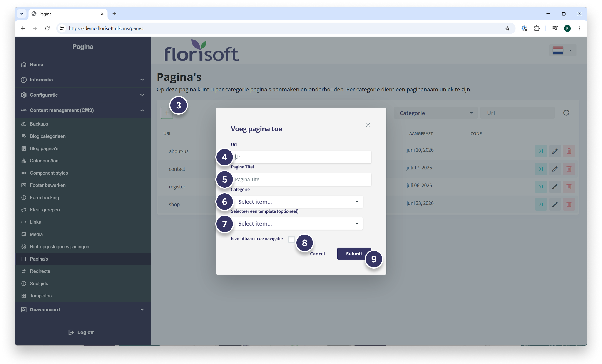
|
|**3**|Klik op het **potlood-icoon** (10) om het **Properties**-dialoogvenster (11) van de zojuist aangemaakte pagina te openen. Klik vervolgens op **'[Vertalingen bewerken](#vertalingen)'** (12).

<b>Klik hier voor de voorbeeldafbeelding</b>
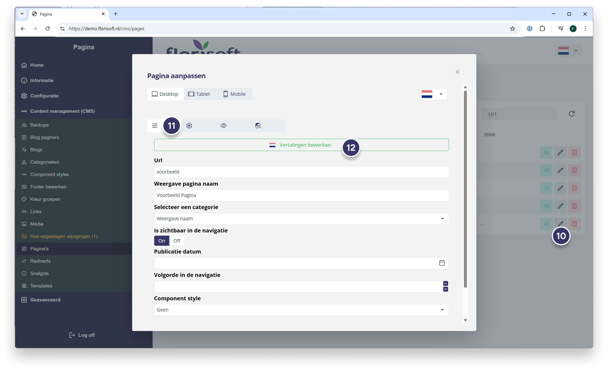
|
|**4**|Het vertalingsdialoogvenster wordt geopend. De ingestelde standaardtaal (13) wordt aan de linkerkant weergegeven. Selecteer via de dropdown aan de rechterkant (14) de taal die je wilt toevoegen of bewerken. Stel vervolgens de volgende gegevens in:  - **URL (15):** voer de vertaling van het URL-pad in.  - **Weergave pagina naam (16):** voer de vertaling van de weergegeven paginanaam in.  - **Bevestigen (17):** klik op **'Bevestigen'** om de wijzigingen op te slaan.

<b>Klik hier voor de voorbeeldafbeelding</b>
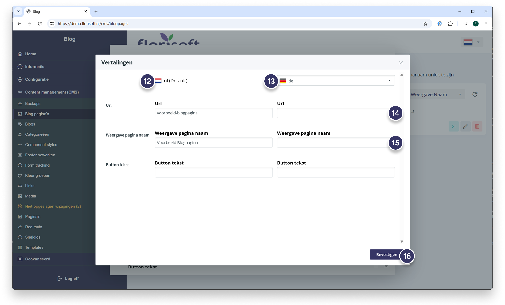
|
|**5**|Open het tabblad **'Visibility'** (18). Stel vervolgens de volgende instellingen in:  - **Taal Zone Selectie (19):** vink in het dropdownmenu één of meerdere talen aan waaraan deze pagina gekoppeld moet worden. Selecteer vervolgens bij **Zone selectie** (20) een zelf aangemaakte CMS-zone.  - **Geldig vanaf (21) en Geldig tot (22):** stel hier de datum en tijd in waarop de bovenstaande instellingen actief moeten zijn.

<b>Klik hier voor de voorbeeldafbeelding</b>

|
|**6**|In het tabblad **'SEO'** (23) kunnen instellingen voor SEO (zoekmachineoptimalisatie) worden geconfigureerd. Hiermee kun je ervoor zorgen dat zoekmachines, zoals Google, je website beter kunnen vinden. Meer informatie over SEO-instellingen [vind je hier](#seo). Klik vervolgens op **'Opslaan'** (24).

<b>Klik hier voor de voorbeeldafbeelding</b>

|
|**7**|Klik op het oranje icoon (25) of op **'Niet-opgeslagen wijzigingen'** (26).

<b>Klik hier voor de voorbeeldafbeelding</b>

|
|**8**|Om de pagina te publiceren en live beschikbaar te maken, klik je op **'Publish all'** (27) of op het publish-icoon (28). Bevestig het publiceren vervolgens door op **'Ja'** (29) te klikken.

<b>Klik hier voor de voorbeeldafbeelding</b>

|

---

#### Blog Categorieën

Blogcategorieën kunnen, net als de [Pagina categorieën](#categorieën), worden gebruikt als tabbladen die zichtbaar zijn naast de voorraden en bestellijsten. Blogpagina's kunnen aan een blogcategorie worden gekoppeld. Hierdoor kun je de categorie bijvoorbeeld als dropdown in de navigatiebalk gebruiken of een overzicht creëren met behulp van het [Blog](#blog)-component.

Pagina categorieën en blogcategorieën lijken in veel opzichten op elkaar. Het belangrijkste verschil is het doel waarvoor je ze gebruikt:

- Gebruik **Pagina's** voor belangrijke basispagina's, zoals een Contact-, Klantregistratie- of Over ons-pagina.
- Gebruik **Blogpagina's** voor bijvoorbeeld nieuwsberichten, evenementen of het uitlichten van een specifieke voorraad of een specifiek artikel.

*Volg onderstaande stappen:*

|#|Uitleg|
|:--|:--|
|**1**|Log in op de webshop met een beheerdersaccount.|
|**2**|Activeer de **Management**-omgeving van de webshop door op het gebruikersicoon (1) te klikken. Er wordt een dropdownmenu geopend. Klik vervolgens op **Management** (2).

<b>Klik hier voor de voorbeeldafbeelding</b>

|
|**3**|Klik op **Content Management (CMS)** in de linker beheerbalk (3). Er wordt een dropdownmenu geopend. Klik vervolgens op **Blog Categorieën** (4). Je komt nu in het overzicht van de blogcategorieën terecht. Eventuele bestaande blogcategorieën worden hier weergegeven.

<b>Klik hier voor de voorbeeldafbeelding</b>

|
|**4**|Om een nieuwe blogcategorie aan te maken, klik je op het **+**-icoon (5). Het scherm voor het aanmaken van een nieuwe blogcategorie wordt geopend.

<b>Klik hier voor de voorbeeldafbeelding</b>
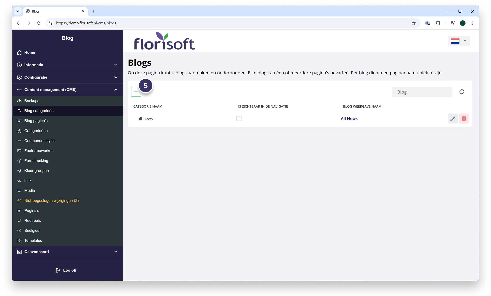
|
|**5**|Vul de volgende velden in:  - **Blog weergavenaam (6):** voer hier de naam van de categorie in zoals deze zichtbaar wordt in de balk met voorraad- en bestellijsttabbladen.  - **Blog URL (7):** voer hier de naam van de categorie in die ook in de URL wordt gebruikt. **GEBRUIK GEEN SPATIES!**  - **Size mode — OPTIONEEL (8):** selecteer of je een compacte dropdown (**Small**) of een brede dropdown (**FullWidth**) wilt tonen in de navigatiebalk.  - **Volgorde in navigatie — OPTIONEEL (9):** bepaal hier de positie van de categorie in de navigatiebalk. Een waarde van **1** betekent dat de categorie vooraan wordt geplaatst. De volgorde van de voorraden wordt hierdoor niet gewijzigd; deze behouden hun oorspronkelijke positie.  - **Zichtbaar in navigatie — OPTIONEEL (10):** schakel deze optie in om de categorie zichtbaar te maken in de navigatiebalk.  - **Template — OPTIONEEL (11):** selecteer een template dat automatisch wordt toegepast wanneer een nieuwe blogpagina binnen deze categorie wordt aangemaakt.  - **Submit (12):** klik op **Submit** om de blogcategorie aan te maken.

<b>Klik hier voor de voorbeeldafbeelding</b>
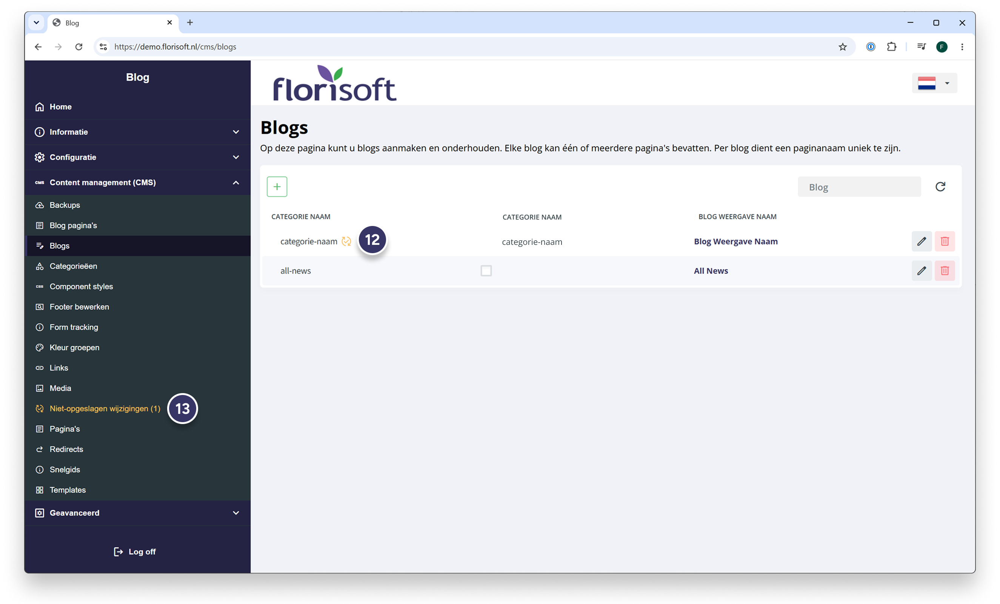
|
|**6**|Klik op het oranje icoon (13) of op **Niet-opgeslagen wijzigingen** (14).

<b>Klik hier voor de voorbeeldafbeelding</b>

|
|**7**|Om de categorie te publiceren en live beschikbaar te maken, klik je op **Publish all** (15) of op het publish-icoon (16). Bevestig het publiceren vervolgens door op **Ja** (17) te klikken.

<b>Klik hier voor de voorbeeldafbeelding</b>
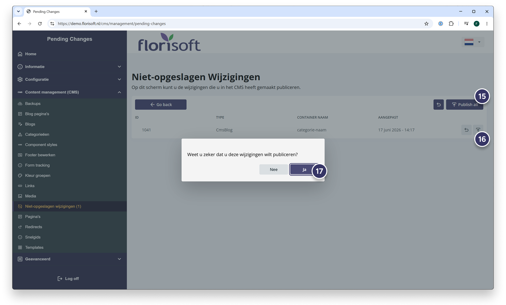
|
|:bulb:|**Opmerking:** De nieuwe categorie is niet direct zichtbaar in de webshop. Dit gebeurt pas wanneer een blogpagina aan deze categorie wordt gekoppeld. [Zie het volgende hoofdstuk](#blogpagina) voor meer informatie.|

---

#### Blogpagina

Een Blogpagina is een toegankelijk onderdeel binnen het CMS waarop content geplaatst kan worden. Een Blogpagina kan onder een zelf gecreëerde categorie vallen. Op een Blogpagina kunnen verschillende elementen geplaatst worden, zoals afbeeldingen, video’s, tekstblokken, tabellen, enzovoort. CMS Pagina's en Blogpagina's lijken best veel op elkaar, maar onderscheiden doe je ze als volgt:  - Gebruik Pagina's voor belangrijke basis pagina's zoals een Contact, Klantregistratie of een Over Ons pagina. - Gebruik Blogpagina's voor bijvoorbeeld nieuws items, evenementen of het uitlichten van een specifieke voorraad/artikel.

*Volg onderstaande stappen:*

|#|Uitleg|
|:--|:--|
|**1**|Na het aanmaken van de Blog categorie navigeer je via '*Content management (CMS)*' (1) naar '*Pagina’s*' (2).

<b>Klik hier voor de voorbeeldafbeelding</b>
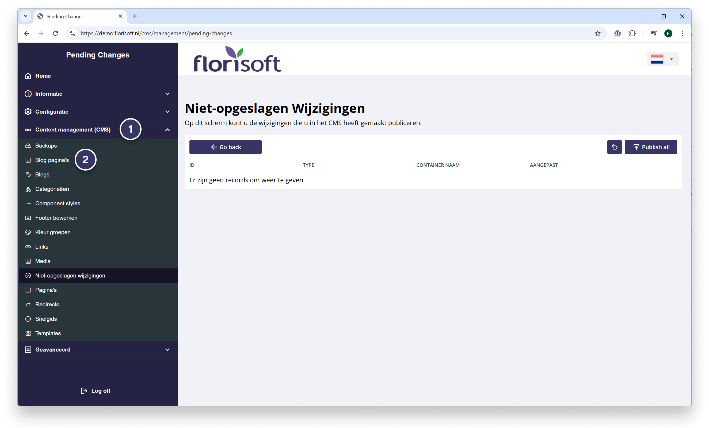
|
|**2**|Om een pagina aan te maken klik je op de knop met het '**+**'-teken (3). Hiermee open je het scherm voor het aanmaken van pagina’s. Er wordt nu een dialoog geopend. Pas hier de volgende instellingen aan:  - **Externe URL/URL (4):** Schakel deze optie alleen in wanneer je een externe URL wilt invoeren, zoals `https://florisoft.nl`. Wanneer een bezoeker op de pagina klikt, wordt de externe URL in een nieuw tabblad geopend en wordt de bezoeker naar het opgegeven webadres doorgestuurd.  Wanneer je geen externe URL gebruikt, voer je hier de naam in die zichtbaar wordt in de URL van de pagina. Je hoeft hierbij niet het volledige domein in te vullen; alleen de padnaam is voldoende, bijvoorbeeld: `voorbeeld`.  **LET OP: GEBRUIK GEEN SPATIES OF HOOFDLETTERS!**  - **Page display name (5):** de naam die zichtbaar wordt voor de klant op de website.  - **Category (6):** selecteer de juiste categorie, namelijk de categorie die in het vorige hoofdstuk is aangemaakt.  - **Is visible in navigation (7):** vink dit selectievakje aan om de pagina zichtbaar te maken in de webshop.  - **Submit (8):** klik op de knop 'Submit' om de pagina aan te maken.

<b>Klik hier voor de voorbeeldafbeelding</b>
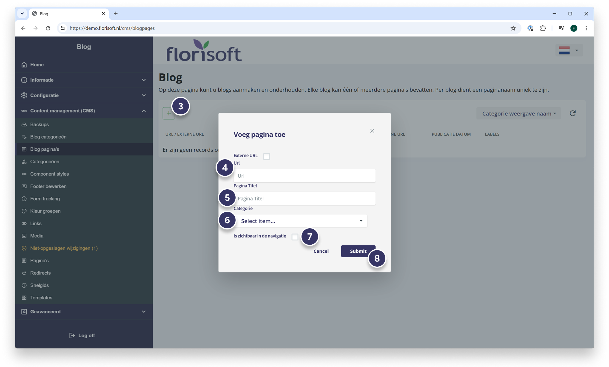
|
|**3**|Via het potlood-icoontje (9) Open je Properties (10) dialoog van de zojuist aangemaakte pagina. Klik op de knop '*[Vertalingen bewerken](#vertalingen)*' (11).

<b>Klik hier voor de voorbeeldafbeelding</b>
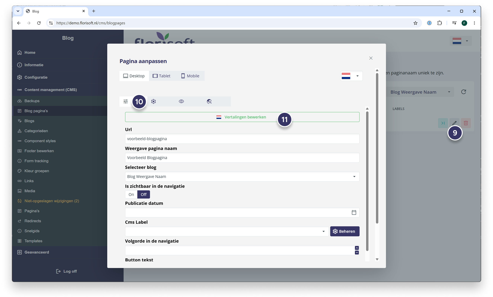
|
|**4**|Het vertaal dialoog wordt geopend. De ingestelde standaard taal (12) wordt aan de linkerkant getoond. Stel via de rechter dropdown (13) de taal in die je wilt toepassen/bewerken. Stel de volgende instellingen in:  - **URL (14)**: voer de vertalingen in voor het URL pad.  - **Weergave pagina naam (15)**: voer de vertalingen in voor de weergave naam van de pagina.  - **Bevestigen (16)**: Klik op '*Bevestigen*' om de wijzigingen op te slaan.

<b>Klik hier voor de voorbeeldafbeelding</b>

|
|**5**|Open het tabblad '*Visibility*' (17). Stel de volgende instellingen in:  - **Taal Zone Selectie (18)**: vink onder het dropdownmenu één of meerdere talen aan waaraan deze categorie gekoppeld moet worden. Onder Zone selectie (19) selecteer je een eigen gemaakte CMS Zone.  - **Geldig vanaf (20) en Geldig tot (21)**: onder 'Geldig vanaf' en 'Geldig tot' kunnen datums en tijden worden ingesteld waarop bovenstaande instellingen van toepassing zijn.

<b>Klik hier voor de voorbeeldafbeelding</b>
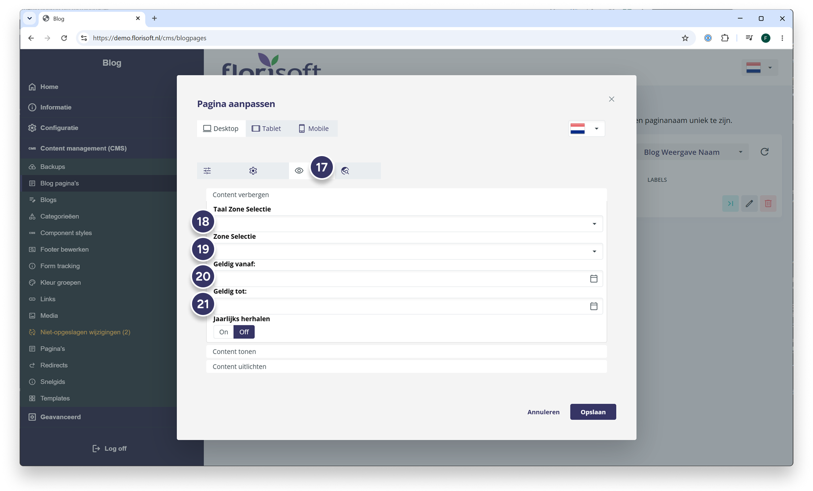
|
|**6**|In het tabblad '*SEO*' (22) kunnen instellingen met betrekking tot SEO (zoekmachineoptimalisatie) worden ingesteld. Hiermee kun je ervoor zorgen dat zoekmachines zoals Google jouw website sneller kunnen vinden. Meer informatie over SEO instellingen [vind je hier](#seo). Klik op '*Opslaan*' (23).

<b>Klik hier voor de voorbeeldafbeelding</b>
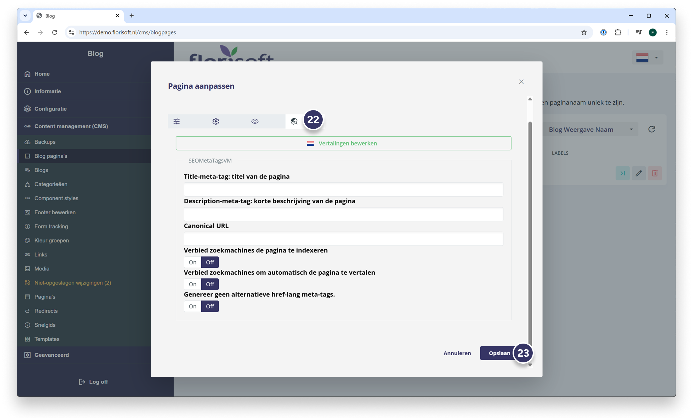
|
|**7**|Klik op 'Niet-opgeslagen wijzigingen' (24).

<b>Klik hier voor de voorbeeldafbeelding</b>
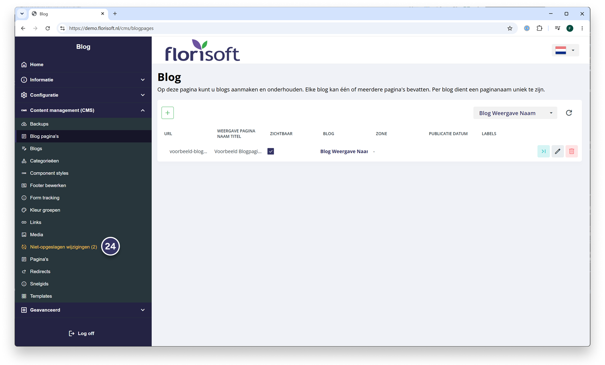
|
|**8**|Om de pagina te publiceren en dus live te kunnen gebruiken klik je op de knop 'Publish all' (25) of het publish-icoon (26). Vervolgens kun je het publiceren bevestigen door op 'Ja' (27) te klikken.

<b>Klik hier voor de voorbeeldafbeelding</b>

|

---

#### Footer bewerken

Bij het aanmaken van een nieuwe CMS-pagina wordt automatisch een container aangemaakt voor een footer. Een footer is het onderste gedeelte van een pagina. Elke CMS-pagina bevat standaard een footer. Wijzigingen die je in de footer maakt, worden over de gehele website zichtbaar. Meestal bevat een footer secundaire informatie zoals adresgegevens, links naar externe websites en sociale media. Het CMS biedt standaard een vooraf gedefinieerd footer-element.

Het is ook mogelijk om de footer volledig naar eigen wens te ontwerpen (zoals je in eerdere voorbeelden misschien al is opgevallen), op dezelfde manier als eerder aangemaakte elementen zoals carousels, tekstvakken en video’s. Het aanmaken van een footer werkt als volgt:

|Stap|Uitleg|
|:--|:--|
|**1**|Klik in de Navigator op het '+'-icoon van de '*Container (footer)*' (1). Het venster ‘Add Component’ wordt geopend. Navigeer via de categorie 'Templates' (2) naar Footer Template. Je kunt hier ook de zoekbalk voor gebruiken (3). Klik op het '+'-icoon (4) om het Template toe te voegen.

<b>Klik hier voor de voorbeeldafbeelding</b>

|
|**2**|Er wordt een standaard footer-element met vier kolommen toegevoegd. Twee kolommen bevatten een tekstvak (5). De laatste kolom bevat iconen voor sociale media ([SocialIcons Component](#social-icons)) (6).

<b>Klik hier voor de voorbeeldafbeelding</b>

|
|**3**|Zoals eerder beschreven is het mogelijk om de footer volledig naar eigen wens vorm te geven. Dit werkt op dezelfde manier als het aanmaken/bewerken van andere elementen zoals carousels, tekstvakken en video’s. Wanneer alle gewenste elementen op de pagina staan kan de beheeromgeving worden afgesloten.|
|**4**|Klik op het menu-icoon (7) en vervolgens onderin op het sluit-icoon (8) om de beheeromgeving af te sluiten. De webshop keert nu terug naar de normale weergave zoals klanten deze ook zien.

<b>Klik hier voor de voorbeeldafbeelding</b>

|

---

#### Templates

Met **Templates** kun je eenvoudig content hergebruiken die je eerder met het CMS hebt opgebouwd. Dit kunnen kleine contentblokken zijn, maar ook complete pagina's. Hierdoor hoef je niet telkens opnieuw dezelfde content op te bouwen.

Templates kunnen ook worden gebruikt voor [Blog-componenten](#blog) om dynamisch content in te laden. Daarnaast kun je het [Frame-component](#frame) gebruiken om een template op meerdere plekken binnen de webshop te plaatsen. Wanneer het template wordt aangepast, worden de wijzigingen automatisch doorgevoerd op alle locaties waar het template wordt gebruikt.

| Stap | Uitleg |
|:--|:--|
| **1** | Navigeer via **Content Management** (1) naar **Templates** (2).

<b>Klik hier voor de voorbeeldafbeelding</b>

 |
| **2** | Klik vervolgens op het '+'-icoon (3) om een nieuw template aan te maken.

<b>Klik hier voor de voorbeeldafbeelding</b>
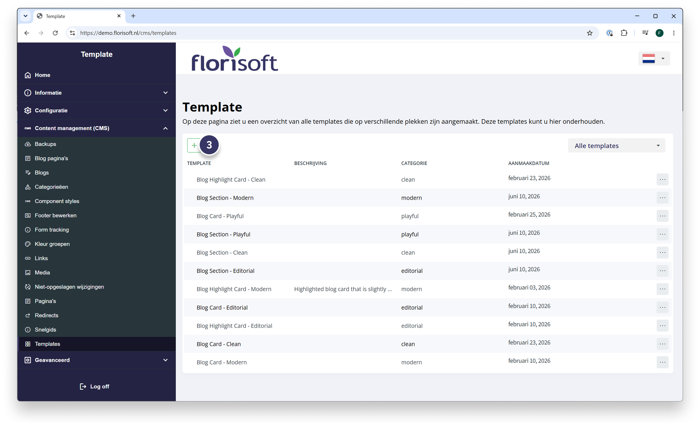
 |
| **3** | Er wordt een dialoogvenster geopend. Vul hier de **Naam** (4) en **Beschrijving** (5) van het nieuwe template in. Selecteer vervolgens een bestaande **Categorie** (6) of maak een nieuwe categorie aan. In dit voorbeeld hebben we een nieuwe categorie aangemaakt met de naam **Standaard blokken** (7). Klik vervolgens op **Opslaan** (8). De Template Editor wordt nu geopend.

<b>Klik hier voor de voorbeeldafbeelding</b>
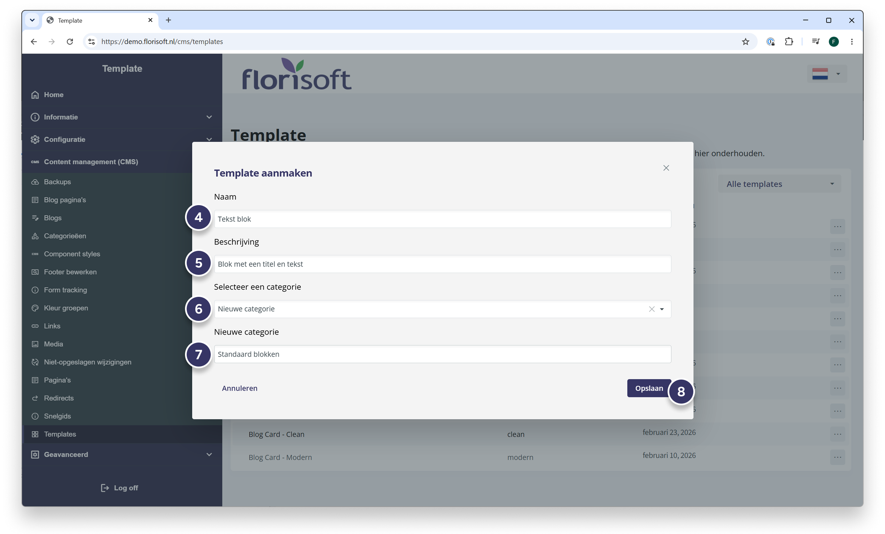
 |
| **4** | In de **Template Editor** kun je CMS-componenten toevoegen, zoals je dat ook gewend bent op een reguliere CMS-pagina. Activeer in dit scherm de **CMS Editor** (9) en klik vervolgens op het '+'-icoon (10). De [Componentendialoog](#componentendialoog) wordt nu geopend.

<b>Klik hier voor de voorbeeldafbeelding</b>
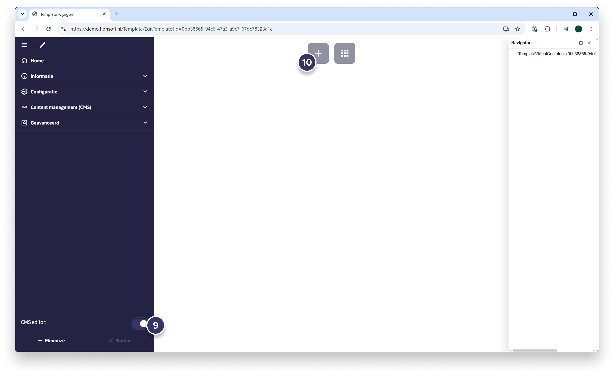
 |
| **5** | Je kunt nu verschillende CMS-componenten aan het template toevoegen. In dit voorbeeld beginnen we met een [Panel](#panel)-component (11).

<b>Klik hier voor de voorbeeldafbeelding</b>
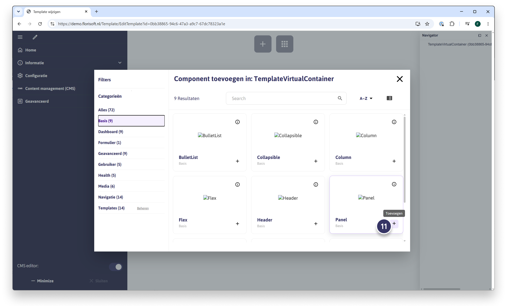
 |
| **6** | Binnen het [Panel-component](#panel) hebben we als voorbeeld twee [Tekst-componenten](#text) geplaatst (12). Wanneer je tevreden bent met het template, kun je dit opslaan (13).

<b>Klik hier voor de voorbeeldafbeelding</b>
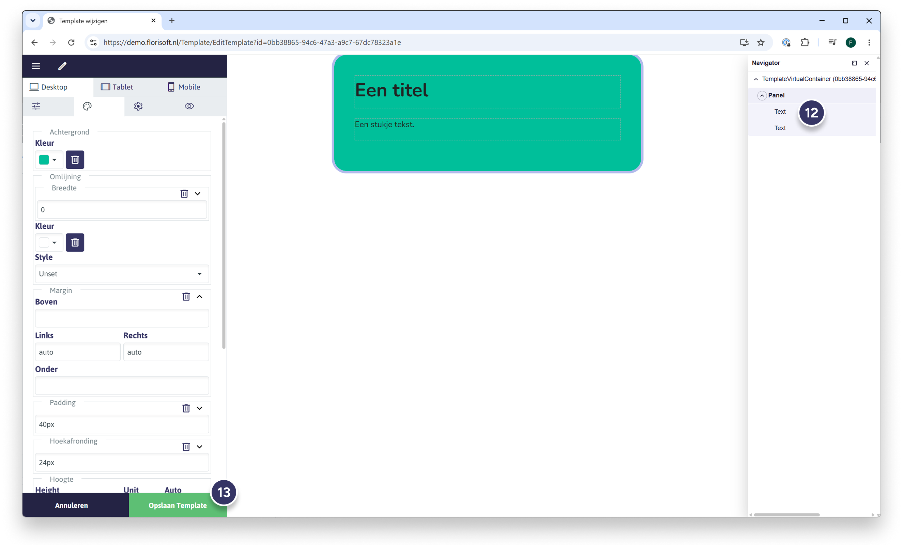
 |
| **7** | Klik vervolgens op **Ja** (14) om het opslaan te bevestigen. Je kunt het template op een later moment altijd opnieuw bewerken.

<b>Klik hier voor de voorbeeldafbeelding</b>
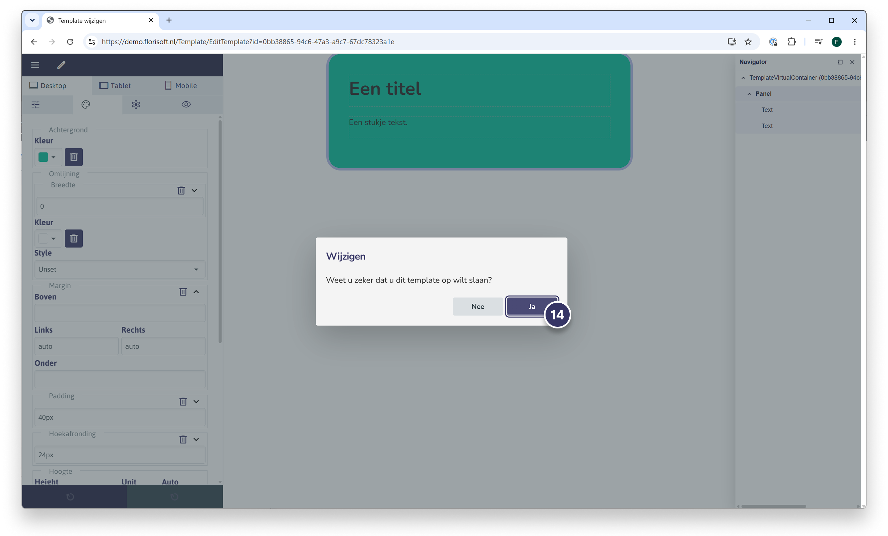
 |
| **8** | Na het opslaan keer je terug naar het **Templates**-scherm. Via het dropdownmenu (15) kun je eenvoudig de zojuist aangemaakte categorie selecteren. Je ziet hier direct hoeveel templates er binnen deze categorie zijn aangemaakt. Dit is bijvoorbeeld handig wanneer je vooraf content wilt voorbereiden voor speciale momenten, zoals Moederdag of Kerst. Navigeer vervolgens terug naar de **Homepagina** (16) om het template aan een pagina toe te voegen.

<b>Klik hier voor de voorbeeldafbeelding</b>
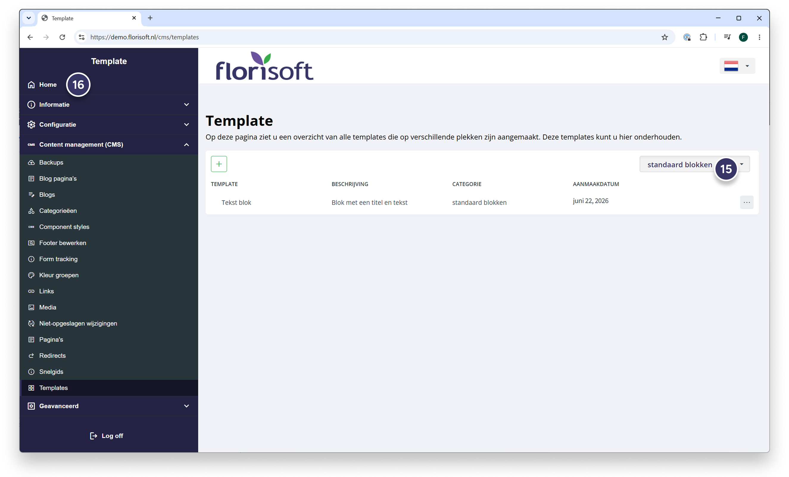
 |
| **9** | Terug op de Homepagina kun je via de [Componentendialoog](#componentendialoog) naar **Templates** (17) navigeren. Selecteer vervolgens de gewenste **Template-categorie** (18) en voeg het zojuist gemaakte template toe aan de pagina (19).

<b>Klik hier voor de voorbeeldafbeelding</b>
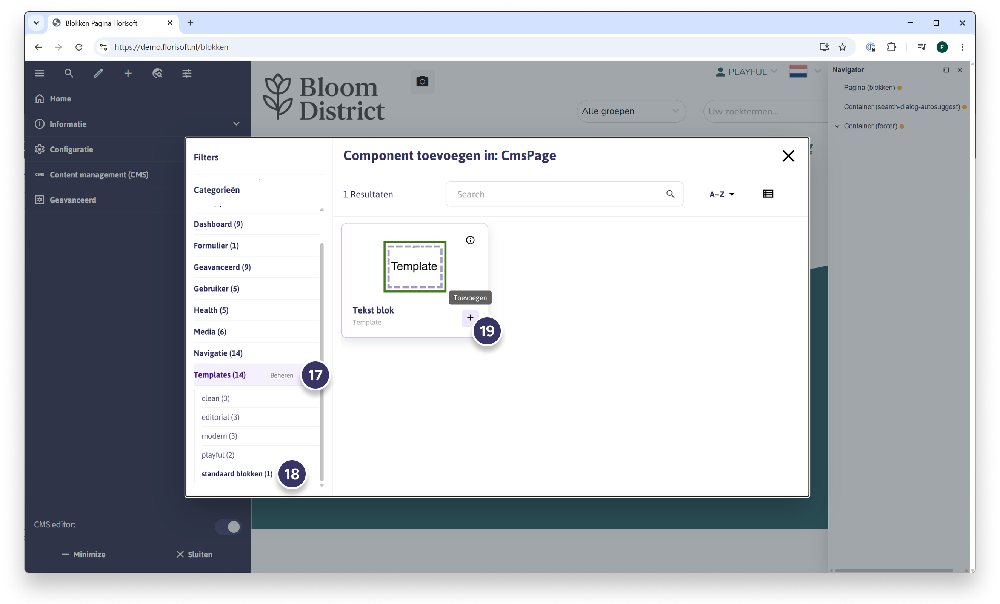
 |
| **10** | Het template (20) wordt nu weergegeven op jouw CMS-pagina. Je kunt vervolgens nog wijzigingen aanbrengen en de pagina publiceren, zonder dat je de content opnieuw hoeft op te bouwen.

<b>Klik hier voor de voorbeeldafbeelding</b>

 |
| **11** | We hebben nu op een eenvoudige manier een template opgebouwd, maar de mogelijkheden van Templates zijn veel uitgebreider. Wanneer je zelf een volledige pagina of sectie hebt opgebouwd die je opnieuw wilt gebruiken, zijn Templates hiervoor een uitstekende oplossing. Via een rechtermuisklik in de [Navigator](#navigator) kun je een volledige pagina of sectie (21) — in dit voorbeeld **Panel (hero)** — opslaan als template (22).

<b>Klik hier voor de voorbeeldafbeelding</b>
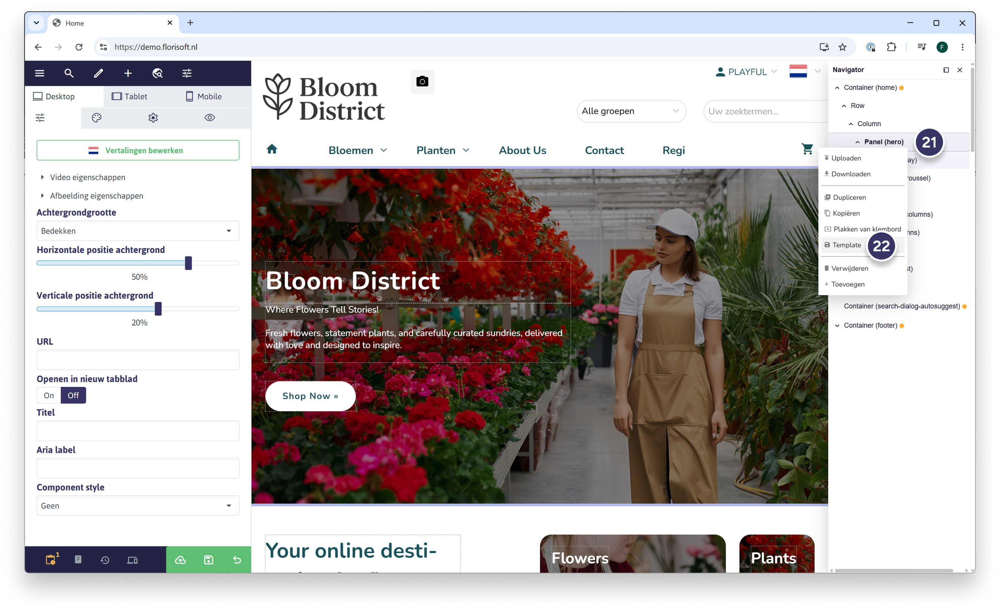
 |
| **12** | Vul vervolgens in het dialoogvenster de **Naam** (23), **Beschrijving** (24) en eventueel een **Categorie** (25) in. Klik daarna op **Opslaan** (26).

<b>Klik hier voor de voorbeeldafbeelding</b>
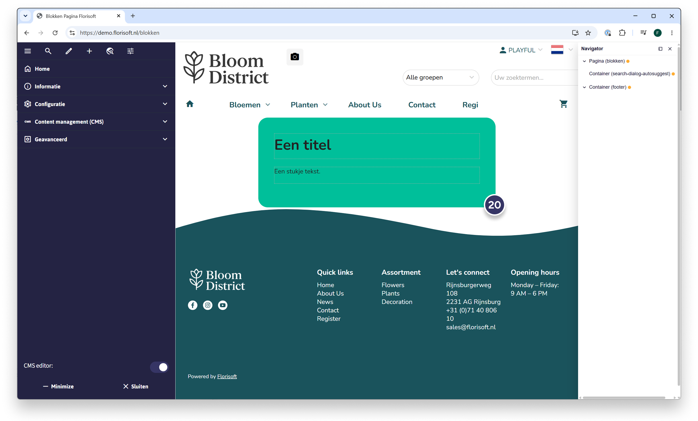
 |
| **13** | Om het overzicht van de [Componentendialoog](#componentendialoog) verder te verduidelijken, kun je zelf een screenshot van het template maken. Deze afbeelding kun je vervolgens uploaden via het **Template-beheerscherm** (27). De screenshot wordt vervolgens weergegeven als thumbnail van het template.

<b>Klik hier voor de voorbeeldafbeelding</b>
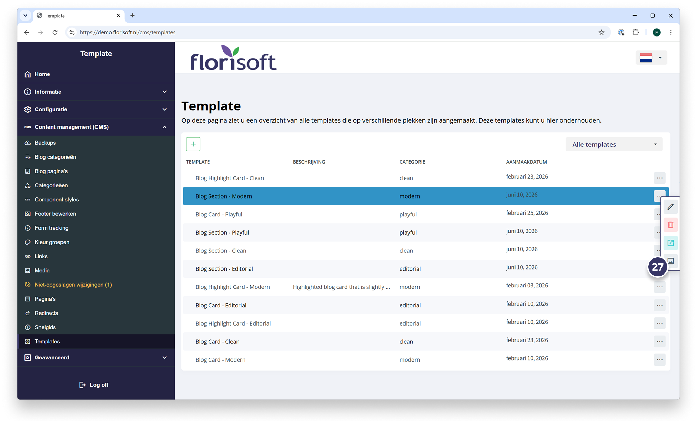
 |

---

### Geavanceerd

#### Thema Configuratie

In dit configuratie scherm stel je de huisstijl kleuren in van je shop, bepaal je welk font er getoond moet worden en kunnen er meerdere opties worden ingesteld om de shop visueel net iets meer aan te laten sluiten aan jouw wensen.

|Stap|Uitleg|
|:--|:--|
|**1**|Navigeer via Configuratie (1), Thema, naar Thema Configuratie (2)

<b>Klik hier voor de voorbeeldafbeelding</b>
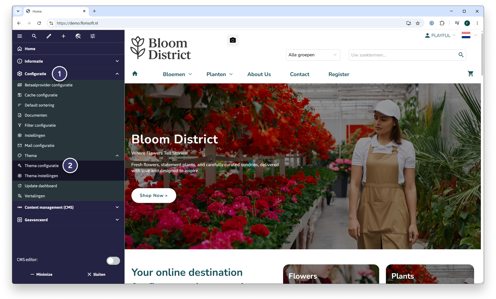
|
|**2**|Klik vervolgens op het '+'-icoon om te starten met het aanmaken van een nieuw thema (3). Er wordt een dialoog geopend. Vul hier een naam (4) in voor het nieuwe thema. Zorg ervoor dat er GEEN spaties in het thema naam worden gebruikt. Selecteer een template die na het aanmaken direct wordt ingeladen. Wij raden aan om hier het Starterkit thema voor aan te houden voor een visueel fijnere look-and-feel in de shop (5). Maak vervolgens het thema aan (6).

<b>Klik hier voor de voorbeeldafbeelding</b>
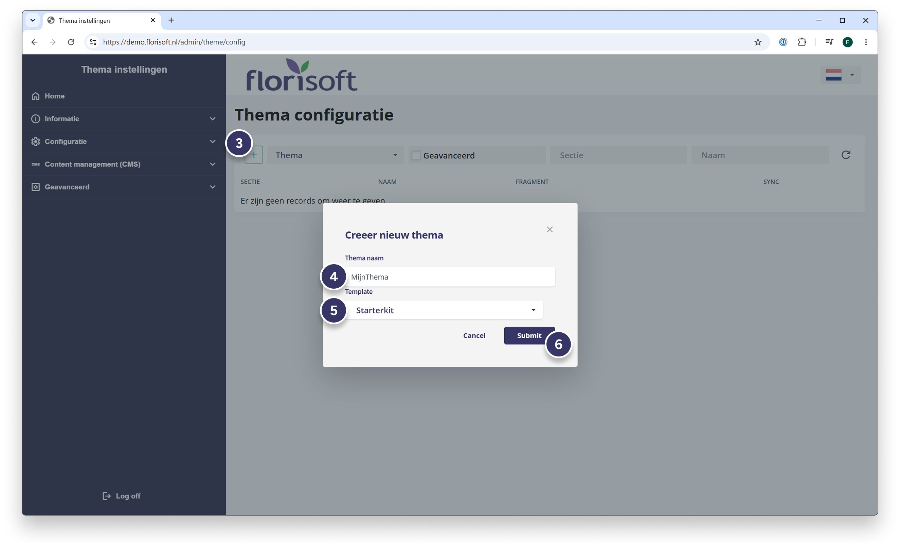
|
|**3**|Het thema is nu aangemaakt en verschijnt er een grote lijst met informatie. Hier in worden kleuren, fonts, lettergroottes en overige styling opties bepaalt wat invloed heeft op de uiterlijk van jouw shop. 90% van deze instellingen staan al goed ingesteld voor je thema, maar kun je alsnog zelf de lijst doorlopen om bepaalde instellingen aan te passen. Wel kan het helpen om hier enige CSS kennis van te hebben voor sommige (meer geavancerde) opties.  Na het wijzigen van thema instellingen dien je dit ten alle tijden op te slaan via de opslaan knop (10). Na het aanmaken van het thema is opslaan dus ook het eerste wat je doet voordat je wijzigingen maakt.  **7 - Voorvertoning**: Via deze knop open je een voorvertoning van je shop. Deze zal de informatie van jouw nieuwe thema tonen zodat je sneller de effecten op je shop kunt zien na een wijziging. De voorvertoning zal wijzigen nadat je het thema opslaat.  **8 - Recompile**: Met deze functie kun je een check uit laten voeren of alle informatie wel netjes zijn ingevuld. Zodra er foutieve waardes zijn ingevuld zal er een dialoog getoond worden met een omschrijving waar de fout zich bevindt in jouw thema.  **9 - Log**: Toont een log van wijzigingen die gemaakt zijn in het thema.  **10 - Opslaan**: Sla gemaakte wijzigingen in het thema op via deze knop om deze zichtbaar te maken in de live-omgeving.  **11 - Download thema**: Via deze knop download je het geselecteerde thema (15). Er zal een .scss-bestand worden gedownload die je bijvoorbeeld in een ander nieuw thema weer kunt uploaden (13).  **12 - Laatste foutmelding**: Checkt of er een foutmelding actief is in jouw thema.  **13 - Thema uploaden**: Zoals aangegeven bij 'Download thema' (11) kun je via deze knop een gedownload thema uploaden. LET OP: door een gedownload thema bestand te uploaden overschrijf je bestaande gegevens in het geselecteerde thema (15).  **14 - Nieuw thema aanmaken**: Maak een nieuw thema aan.  **15 - Selecteer thema**: Via deze dropdown kun je het thema kiezen die je graag wilt wijzigen.  **16 - Geavanceerde instellingen**: Wanneer deze optie wordt aangevinkt zullen er veel meer opties zichtbaar worden in de lijst waardoor je meer in detail aanpassingen in je shop kunt aanbrengen. LET OP: Dit zijn instellingen waarbij kennis van CSS noodzakelijk kan zijn.  **17 - Zoeken op sectie**: Zoek een optie op sectie niveau. De sectie namen vindt je aan de linker kant in het overzicht. Namen die hier in voor komen zijn: GENERAL, STOCK, LOGIN, ACCOUNT, GALLERY, HEADER, FOOTER, HOME, NAVIGATION en SHOPPING-CART.  **18 - Zoeken op naam**: Zoek een optie op naam.  **19 - Refresh**: Herlaadt het thema. Dit kun je uiteraard ook doen door de browser te herladen.  **20 - Optie terugzetten naar begin waarde**: Deze knop zorgt ervoor dat de waarde van deze optie wordt teruggezet naar de oorspronkelijke staat. De optie wordt ge-reset.  **21 - Synchroniseer met alle thema's**: De ingestelde en opgeslagen optie kan via deze knop worden doorgevoerd over alle beschikbare thema's. LET OP: Deze actie kan niet ongedaan gemaakt worden.  **22 - Optie bewerken**: Opent een dialoog waarbij je een wijziging kunt doorvoeren.  **23 - Primaire kleur**: Dit is de belangrijkste kleur van jouw shop. Wanneer deze kleur wordt gewijzigd zal dit voor een groot deel van je shop zichtbaar worden.  **24 - Secundaire kleur**: Dit is de op een na belangrijkste kleur van jouw shop. Wanneer deze kleur wordt gewijzigd zal dit voor een groot deel van je shop zichtbaar worden.  Nadat je de wijzigingen hebt doorgevoerd voor je nieuwe thema klik je op 'Opslaan' (10).

<b>Klik hier voor de voorbeeldafbeelding</b>
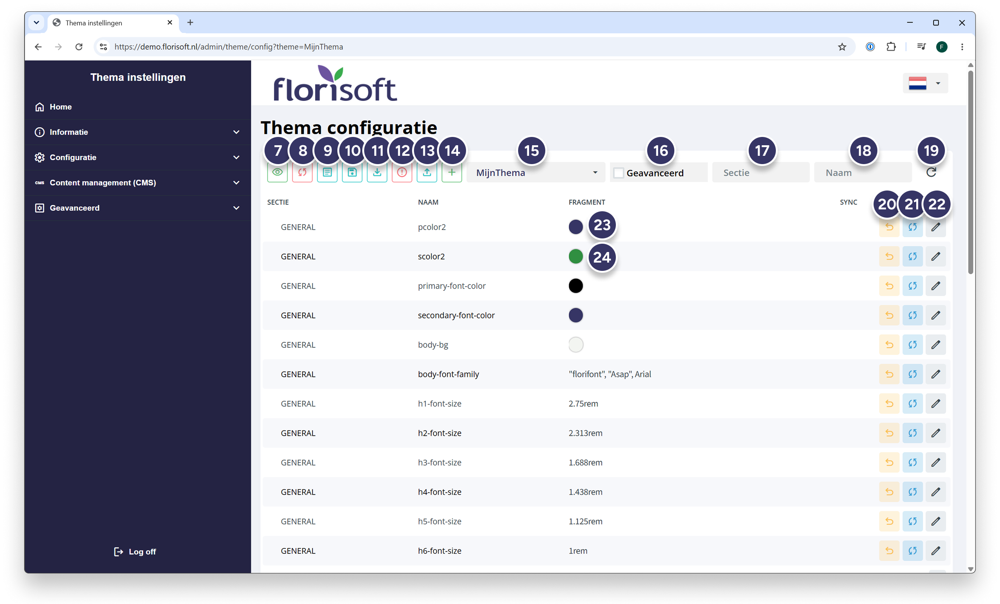
|
|**4**|Om een Google font in te laden kun je dit doen om via 'Configuratie' (25) naar de webshop instellingen (26) te navigeren. In het overzicht zoek je op GOOGLEFONTSHREF. Klik op deze setting. Vervolgens kom je op de pagina waarbij je deze setting kunt wijzigen (27). Vul de link in die je uit [Google Fonts](https://fonts.google.com/) kunt kopieren zoals *https://fonts.googleapis.com/css2?family=[FONTNAAM]:ital,wght@0,400;0,700;1,400;1,700&display=swap* en plak deze in het dialoog (28). Vervolgens sla je dit op (29). Wanneer je nu in het thema onder de naam *body-font-family* het Google font invult zoals *"[FONTNAAM]", sans-serif* en het thema vervolgens opslaat zal jouw shop nu het gewenste Google font tonen in de shop.

<b>Klik hier voor de voorbeeldafbeelding</b>
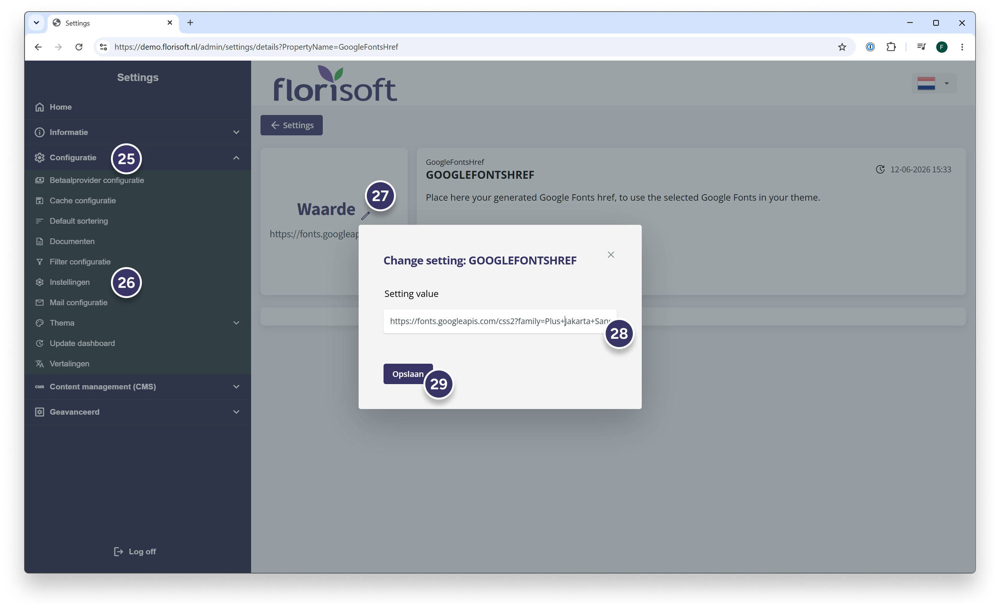
|

---

#### Backups

Werken in het CMS kan natuurlijk weleens mis gaan. Misschien heb je onbedoeld iets verwijderd wat niet terug te draaien is. Geen paniek, door middel van een backup is jouw CMS snel weer up and running!

|Stap|Uitleg|
|:--|:--|
|**1**|Navigeer via Content Management (CMS) (1) naar Backups (2).

<b>Klik hier voor de voorbeeldafbeelding</b>
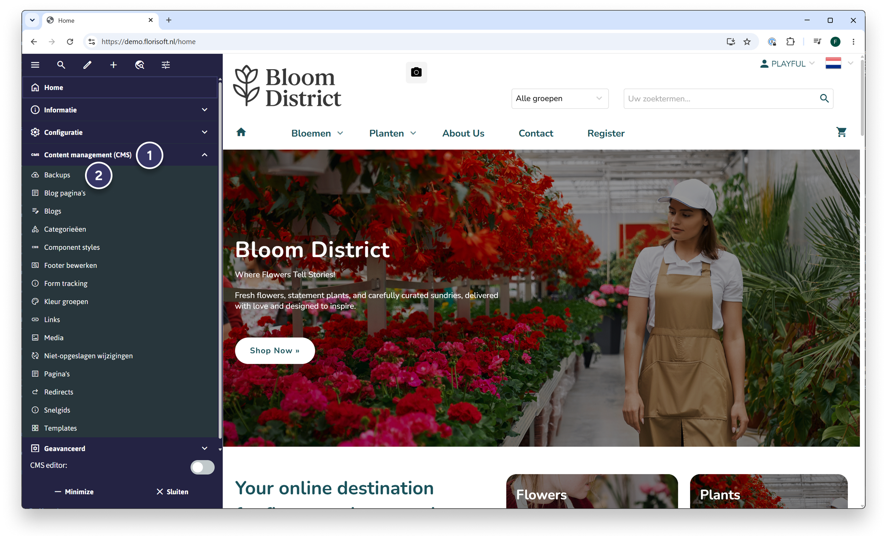
|
|**2**|Wat je nu ziet is het overzichtspagina van alle backups. Elke dag wordt er automatisch een backup uitgevoerd, maar kun je ook zelf een backup opslaan via het '+'-icoon (3). Er wordt nu een dialoog geopend. Vul een beschrijving in voor je backup (4) en sla deze op (5). Het dialoog zal uit zichzelf verbergen nadat de backup voltooid is. Het maken van een backup kan soms ook even duren.

<b>Klik hier voor de voorbeeldafbeelding</b>
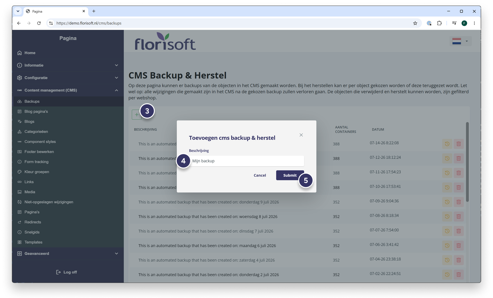
|
|**3**|Nu zien we dat de backup is aangemaakt en zal bovenin het overzicht zichtbaar worden (6). Mocht het nodig zijn om een backup terug te zetten kan er op de terugdraai-knop worden geklikt (7). De versie zal dan worden teruggezet naar deze backup. Backups kunnen ook worden verwijderd (8).

<b>Klik hier voor de voorbeeldafbeelding</b>
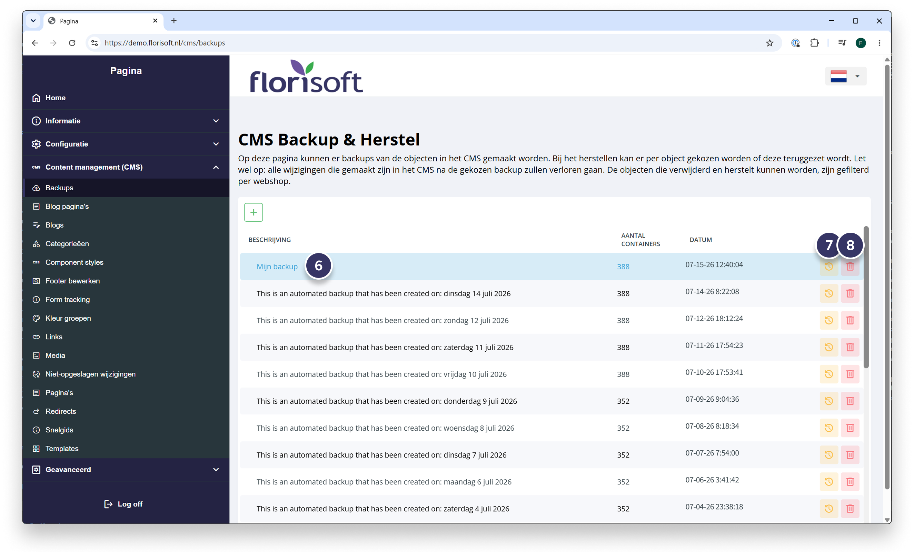
|

---

#### Redirects

Wanneer je een bestaande link hebt waarvan je de url wilt aanpassen kan nadelig werken voor jouw SEO score op Google. Met behulp van redirects vertel jij aan Google dat de url gewijzigd is en gaat dit niet ten koste van jouw opgebouwde SEO score.

|Stap|Uitleg|
|:--|:--|
|**1**|Navigeer via Content Management (CMS) (1) naar Redirects (2).

<b>Klik hier voor de voorbeeldafbeelding</b>

|
|**2**|Je belandt nu op het redirect overzichtspagina. Via het '+'-icoon (3) kun je een nieuwe redirect aanmaken. Er wordt nu een dialoog geopend.  **4 - Redirect naam**: Vul een naam in voor je redirect.  **5 - Inkomende url**: Hier zet je het complete webadres in van je 'oude' url zoals *https://www.[jouwdomein].nl/oude-pagina*.  **6 - Uitgaande url**: Hier zet je het complete webadres in van je 'nieuwe' url zoals *https://www.[jouwdomein].nl/nieuwe-pagina*.  **7 - Redirect type**: Via deze dropdown om welk type redirect het gaat. **302** is tijdelijk (**Deze optie raden wij sterk aan**) en **301** is permanent en is dus moeilijk ongedaan te maken. LET OP: Hiervoor vergt voldoende kennis van het werken met redirects om ongewenst gedrag te voorkomen.  Sla vervolgens de redirect op (8).

<b>Klik hier voor de voorbeeldafbeelding</b>
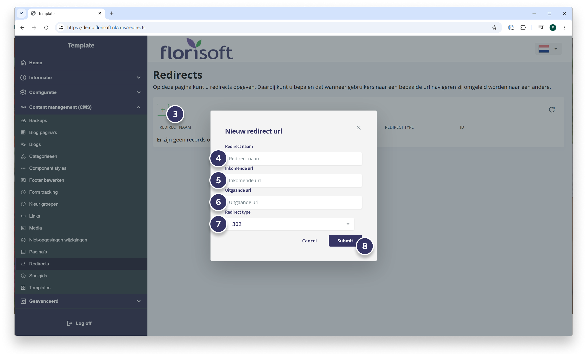
|

---

#### Niet opgeslagen wijzigingen

Nadat je wijziging maakt in jouw CMS pagina dien je dit vervolgens te publiceren. Dit scherm houdt bij wanneer er een wijzigingen worden gedaan op meerdere pagina's.

|Stap|Uitleg|
|:--|:--|
|**1**|In het voorbeeld hebben wij een Text component bewerkt op de Homepagina. Onderin beeld kleurt er nu een icoon oranje. Via dit icoon navigeer je de 'Niet opgeslagen wijzigingen'-pagina (1).

<b>Klik hier voor de voorbeeldafbeelding</b>
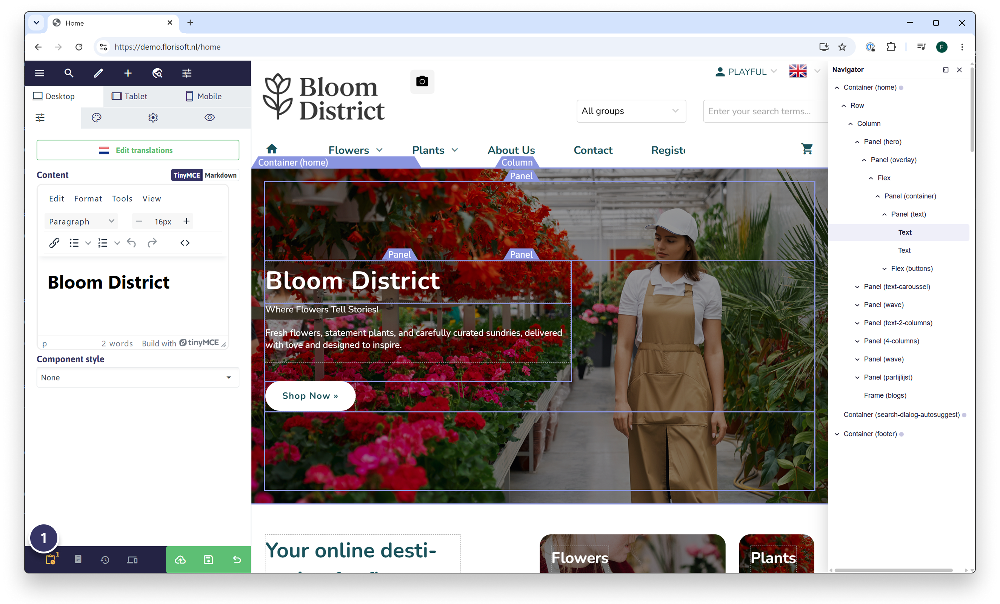
|
|**2**|Je bevindt je nu in het 'Niet opgeslagen wijzigingen'-pagina (2) waarin jouw wijzigingen per pagina (3) worden bijgehouden. Vervolgens kun je alle niet opgeslagen wijzigingen voor deze pagina ongedaan maken (4) of juist publiceren (5). Als je meerdere  pagina's hebt bewerkt worden die pagina's ook op dit scherm zichtbaar. Je kunt vervolgens voor alle pagina's alles in een keer ongedaan maken (6) of juist publiceren (7).

<b>Klik hier voor de voorbeeldafbeelding</b>
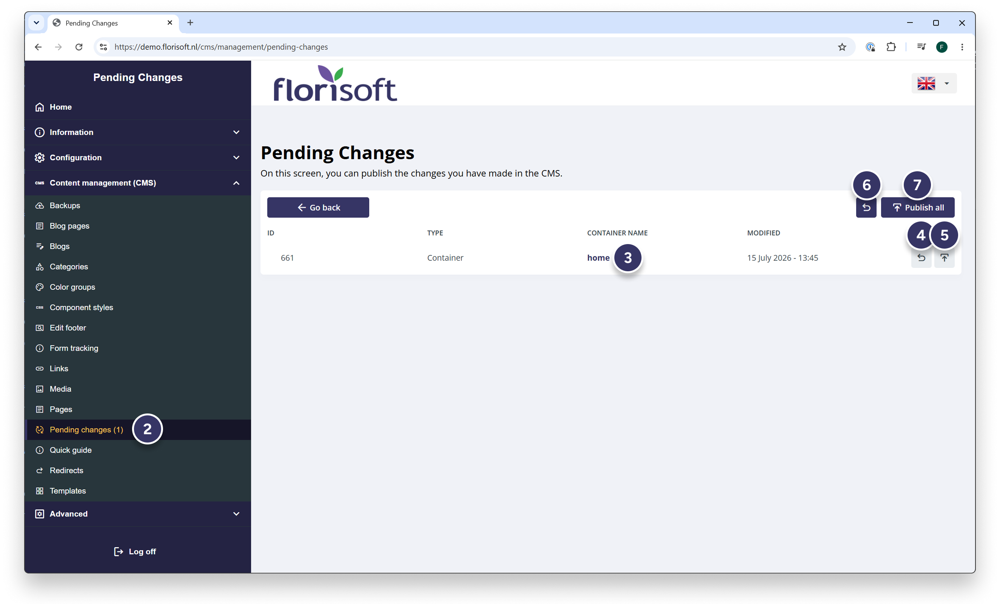
|

---

#### Form tracking

Pagina's die een formulier bevatten kunnen worden bijgehouden in het Form Tracking scherm. In dit scherm kun je precies zien welke formulieren succesvol zijn verstuurd per debiteur. Ook formulieren die niet verstuurd zijn of fout zijn gegaan zijn gemakkelijk op deze pagina terug te vinden en is het tevens mogelijk om Excelbestanden op te slaan zodat de ingevulde data van meerdere debiteuren voor meerdere doeleinden kunnen worden gebruikt. Wel is het aan te raden om dit duidelijk te communiceren in jouw formulier door middel van een [checkbox](#checkbox) met de tekst: *Ik ga ermee akkoord dat mijn gegevens gebruikt mogen worden voor de verwerking van mijn verzoek.* i.v.m. privacy wetgeving.

|Stap|Uitleg|
|:--|:--|
|**1**|Navigeer via Content Management (CMS) (1) naar Form tracking (2).

<b>Klik hier voor de voorbeeldafbeelding</b>
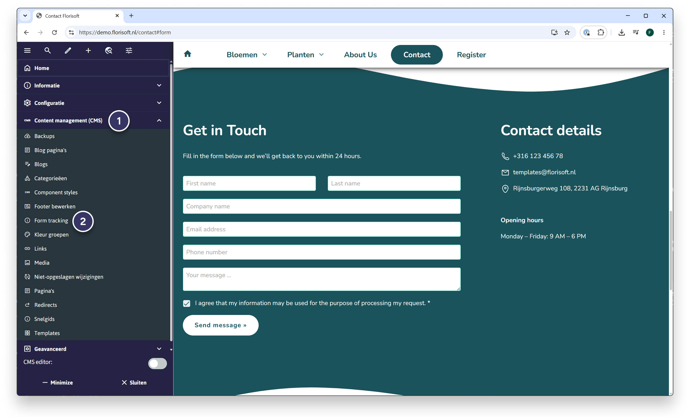
|
|**2**|Je belandt nu op het Form tracking overzichtspagina.  **3 - Form subject or user**: Zoek naar een Formulier onderwerp (wat je kunt instellen in het [Formulier-component](#formulier)) of zoek naar een debiteur nummer.  **4 - Selecteer Formulier**: Via deze dropdown kies je welke data je per Formulier in wilt zien.  **5 - Status**: Via deze dropdown kun je inzien welke formulieren succesvol verstuurd zijn, geannuleerd of juist niet verstuurd zijn.  **6 - Download Excel**: Hiermee download je een Excel-bestand op basis van de geselecteerde data.  **7 - Refresh overzicht**: Via deze knop haalt het overzicht opnieuw alle data op.  **8 - Gegevens tabel**: Opent een dialoog waarin ingevulde data zichtbaar wordt.  **9 - Gebeurtenissen**: Hierin worden alle gebeurtenissen bijgehouden tijdens het invullen van een formulier.

<b>Klik hier voor de voorbeeldafbeelding</b>
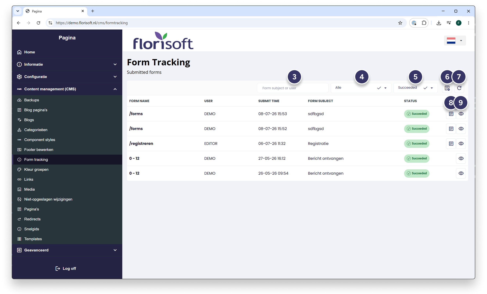
|

---

#### Component styles

Door gebruik te maken van componenten in het CMS kun je al mooie pagina's bouwen, maar wil je misschien soms net even je eigen CSS-draai eraan geven wat (nog) niet kan met onze huidige CMS opties. Dat kan met Component Styles. **LET OP: Deze vergt voldoende CSS kennis. Foutieve code kan negatief effect hebben op de prestaties van je shop.**

|Stap|Uitleg|
|:--|:--|
|**1**|In het voorbeeld hebben wij een [Panel](#panel) (1) component geselecteerd die wij graag een kleur verloop willen geven zodat de tekst beter leesbaar wordt, iets wat met de huidige CMS settings (nog) niet mogelijk is.

<b>Klik hier voor de voorbeeldafbeelding</b>
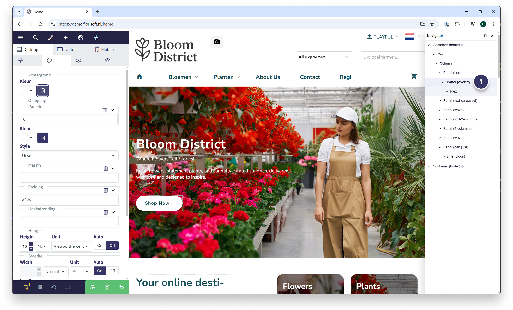
|
|**2**|Via Content Management (CMS) (2) navigeer je naar Component Styles (3). Het beheerscherm zal worden geopend. 

<b>Klik hier voor de voorbeeldafbeelding</b>
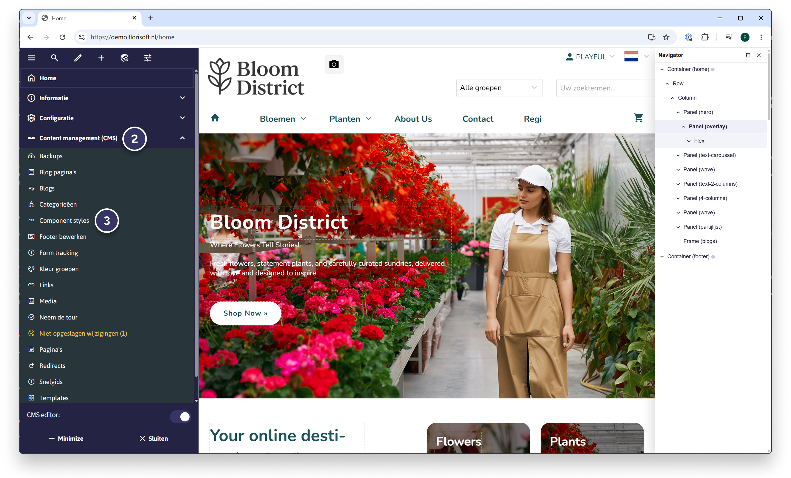
|
|**3**|Maak een nieuw Component Style aan door op het '+'-icoon (4) te klikken. In het dialoog dat verschijnt vul je de naam (5) in van jouw Component Style. LET OP: Gebruik geen spaties voor deze naam. Klik vervolgens op de Bevestig knop (6).

<b>Klik hier voor de voorbeeldafbeelding</b>
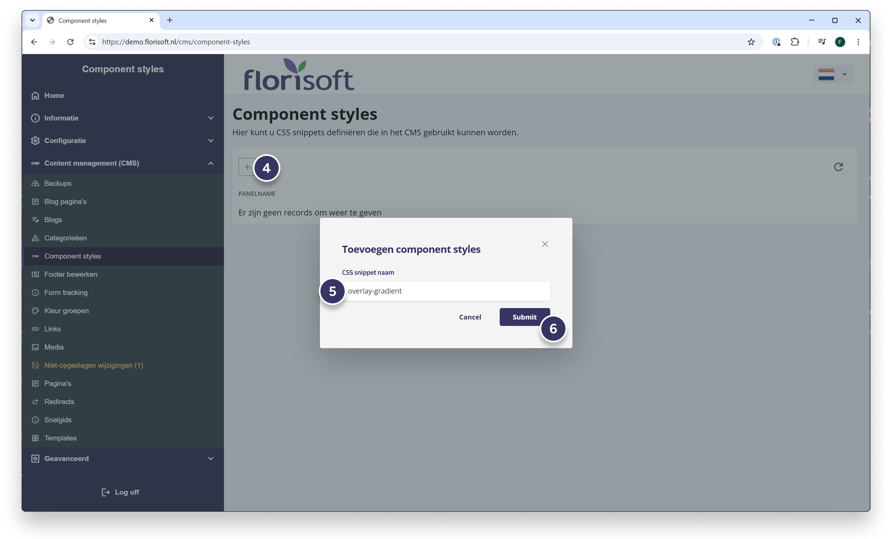
|
|**4**|Nu wordt er een CSS-editor geopend waarin jij je eigen CSS styling kunt doorvoeren (7). In het voorbeeld hebben wij het kleurverloop toegepast. Vervolgens sla je de component Style op (8).

<b>Klik hier voor de voorbeeldafbeelding</b>
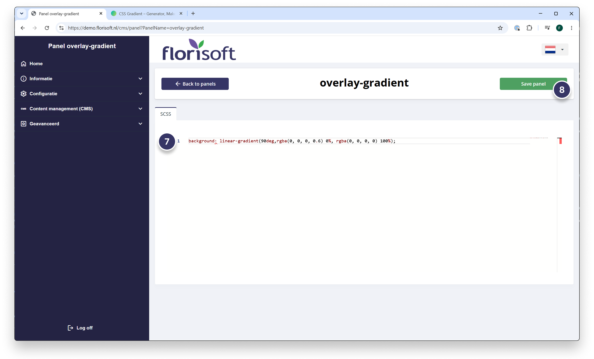
|
|**5**|Er komt nu een bevestigingsdialoog tevoorschijn. Klik op 'OK' (9) en navigeer vervolgens terug naar de Component Styles (10).

<b>Klik hier voor de voorbeeldafbeelding</b>
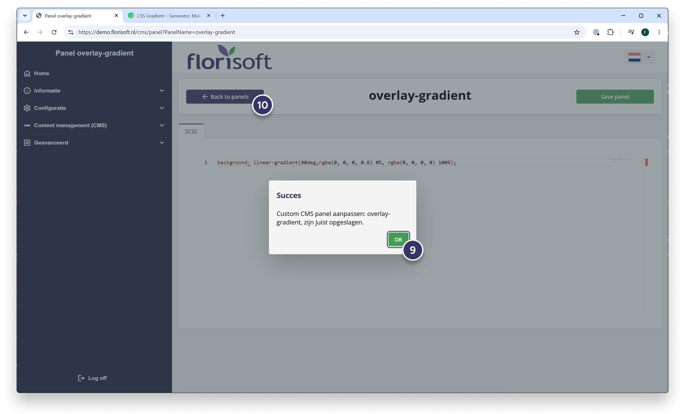
|
|**6**|We zien nu dat de Component Style die wij zojuist hebben aangemaakt zichtbaar is geworden in het overzicht. Tijd om de Component Style te activeren op een component!

<b>Klik hier voor de voorbeeldafbeelding</b>
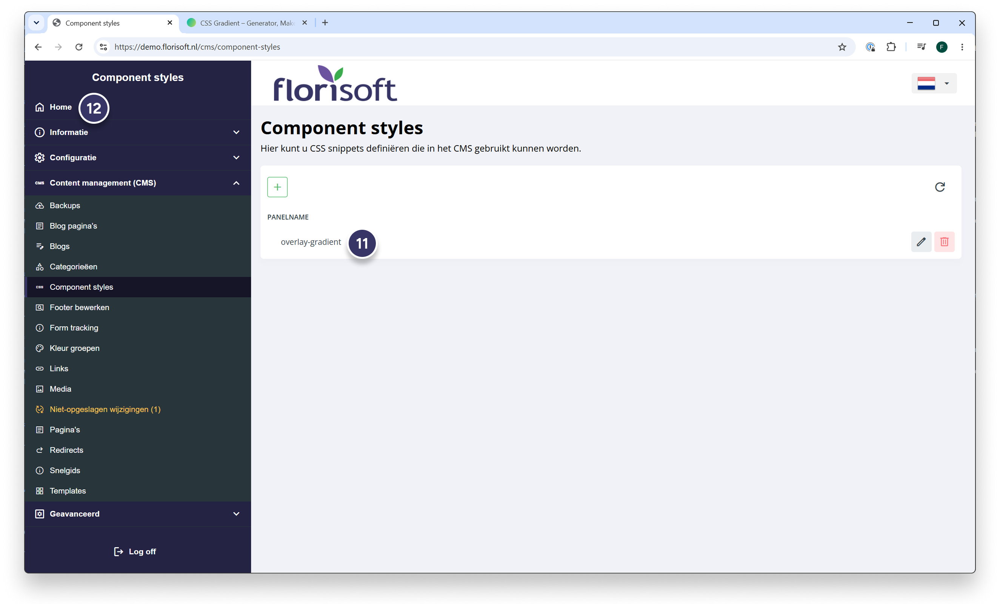
|
|**7**|Klik op het gewenste component in de editor of via de Navigator (13). Via de algemene settings tab van het component (14) open je de dropdown 'Component style' (15) en selecteer je vervolgens het zojuist aangemaakte Component Style (16).

<b>Klik hier voor de voorbeeldafbeelding</b>
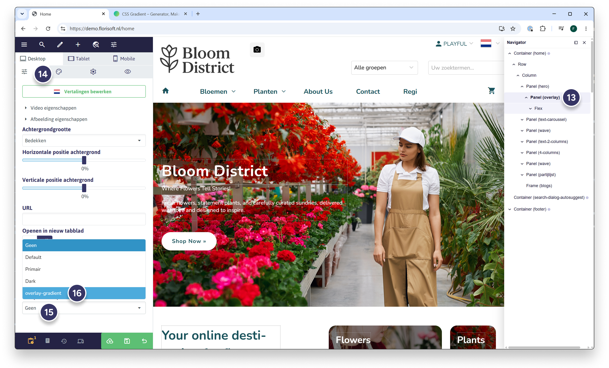
|
|**8**|Vervolgens zie je direct het effect op het geselecteerde [Panel](#panel) component (17)

<b>Klik hier voor de voorbeeldafbeelding</b>
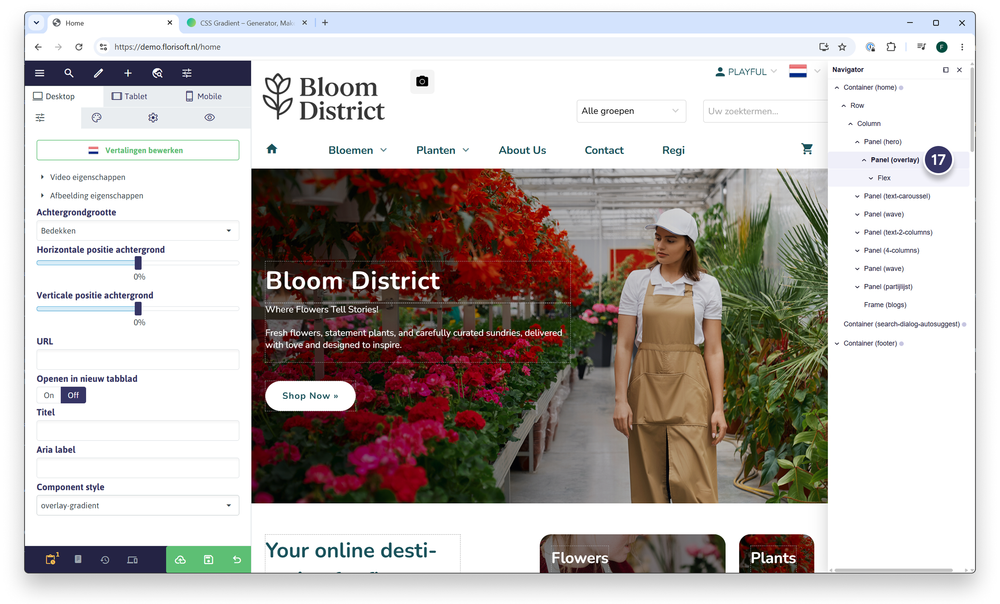
|

---

#### Kleurgroepen (Dashboards)

Dit onderdeel is nog in ontwikkeling

---

### Overig

#### Media

Via dit scherm kun je eenvoudig je eigen afbeeldingen en videobestanden uploaden en deze vervolgens gebruiken op je [CMS-pagina's](#pagina).

| Stap | Uitleg |
|:--|:--|
| **1** | Navigeer via **Content Management (CMS)** (1) naar **Media** (2).

<b>Klik hier voor de voorbeeldafbeelding</b>

 |
| **2** | Je komt nu terecht in het Media-beheerscherm. Via dit scherm kun je bestanden uploaden (3). Via het tabblad **Media Library** (4) krijg je toegang tot alle afbeeldingen en video's die al in je Media Bibliotheek staan. Afbeeldingen worden opgeslagen in de map **images** en video's in de map **videos**.  In het uploadscherm (3) kun je bestanden naar het scherm slepen om ze te uploaden (5) of een bestand vanaf je eigen schijf selecteren (6). Nadat een bestand is geüpload, wordt hiervan een kleine voorvertoning weergegeven (7).  Ondersteunde mediabestanden zijn: PNG, JPG, JPEG, SVG, WEBP, GIF, MP4, MPG, AVI, MOV en WEBM. Afbeeldingen kunnen automatisch worden verkleind om te voorkomen dat onnodig grote bestanden worden geüpload. Grote bestanden kunnen namelijk een negatieve invloed hebben op de laadtijd van je webshop. Wanneer je de optie **Resize** (8) inschakelt, kun je instellen of de afbeelding(en) proportioneel maximaal **1024** of **1920 pixels** groot mogen zijn.  Laat je deze optie uitgeschakeld, houd er dan rekening mee dat bestanden maximaal **25 MB** groot mogen zijn. Dit geldt zowel voor afbeeldingen als video's. Klik vervolgens op **Uploaden** (9).

<b>Klik hier voor de voorbeeldafbeelding</b>
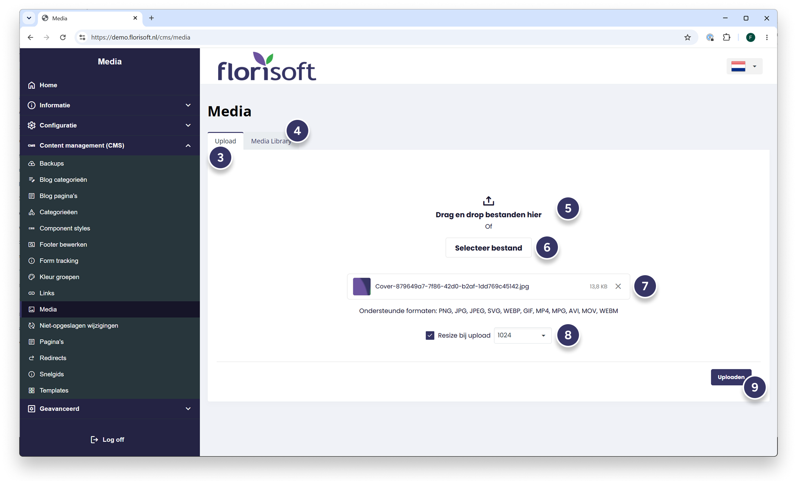
 |
| **3** | De afbeelding is nu zichtbaar in de Media Bibliotheek (10). Je kunt de afbeelding vervolgens bewerken (11) of verwijderen (12). Daarnaast wordt er nuttige informatie over het mediabestand weergegeven (13). Om meer structuur aan te brengen in je mediabestanden kun je nieuwe mappen aanmaken (14), bestanden uploaden via de uploadknop (15), een niveau terug navigeren (16) of de volledige map verwijderen (17). In dit voorbeeld kiezen we ervoor om de afbeelding te bewerken (11).

<b>Klik hier voor de voorbeeldafbeelding</b>
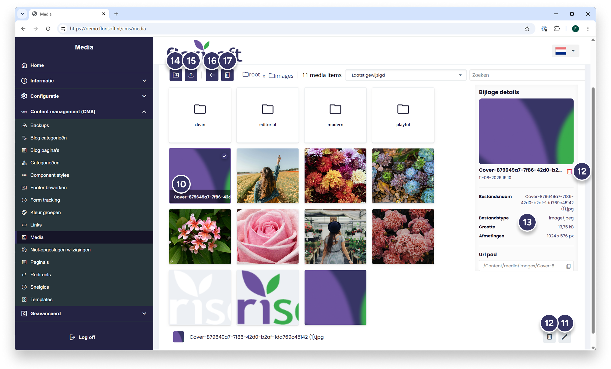
 |
| **4** | Er wordt nu een dialoogvenster geopend waarin je metadata voor het mediabestand kunt invullen. Dit omvat een **Alt-tekst** (18), **Titel** (19), **Caption** (20) en **Beschrijving** (21). Door deze informatie in te vullen, kun je de [SEO](#seo)-prestaties van je webshop verbeteren. Vervolgens kun je de bewerkingen annuleren (22) of opslaan (23). Daarnaast kun je de afbeelding naar wens bijsnijden (24).

<b>Klik hier voor de voorbeeldafbeelding</b>
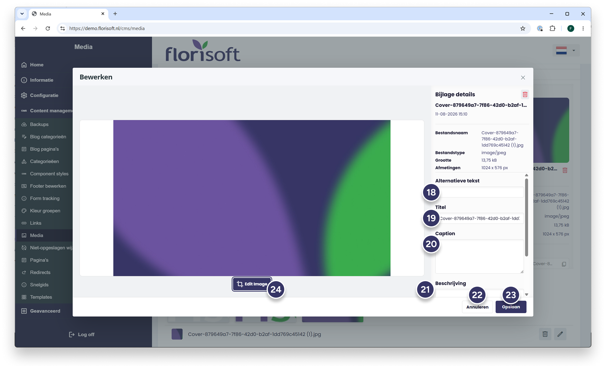
 |
| **5** | Op dit scherm kun je de afbeelding verder bijsnijden en bewerken. Je kunt het selectiekader aanpassen (25), inzoomen (26) en uitzoomen (27), de positionering wijzigen (28) en de afbeelding draaien (29). Eventuele wijzigingen kun je ook ongedaan maken (30).

<b>Klik hier voor de voorbeeldafbeelding</b>
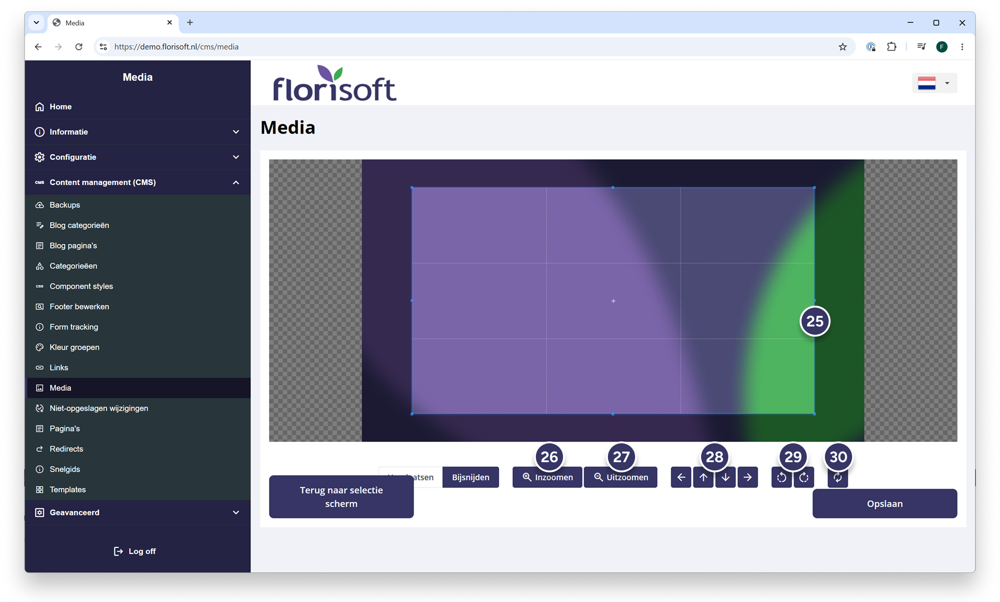
 |
| **6** | Vervolgens kun je de gemaakte wijzigingen opslaan (31) of annuleren door terug te navigeren naar het selectiescherm (32). In dit voorbeeld slaan we de wijzigingen op (31).

<b>Klik hier voor de voorbeeldafbeelding</b>
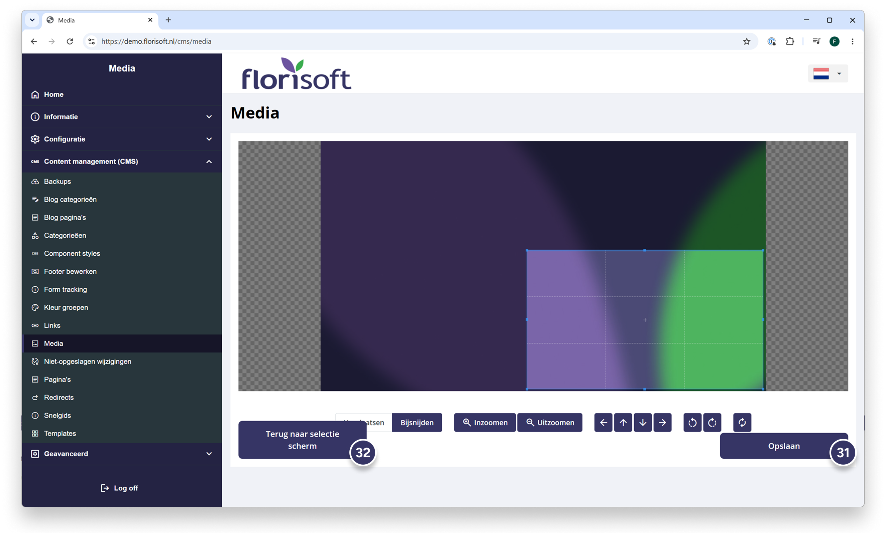
 |
| **7** | Er is nu een nieuwe variant (33) van de afbeelding toegevoegd aan het overzicht. Deze variant bevat de aangepaste en bijgesneden versie van de afbeelding en kan vervolgens worden gebruikt op je [CMS-pagina's](#pagina).

<b>Klik hier voor de voorbeeldafbeelding</b>
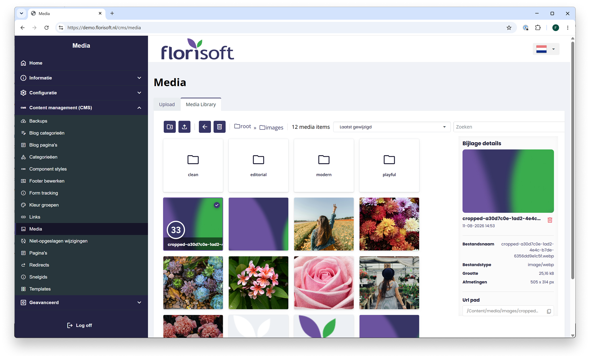
 |

---

#### Documenten

Via dit scherm kun je bestanden uploaden die je vervolgens als downloadbare content op je webpagina's kunt aanbieden.

|Stap|Uitleg|
|:--|:--|
|**1**|Navigeer via **Configuratie** (1) naar **Documenten** (2).

<b>Klik hier voor de voorbeeldafbeelding</b>

|
|**2**|In het scherm **Documenten** kun je een nieuw bestand uploaden (3).

<b>Klik hier voor de voorbeeldafbeelding</b>
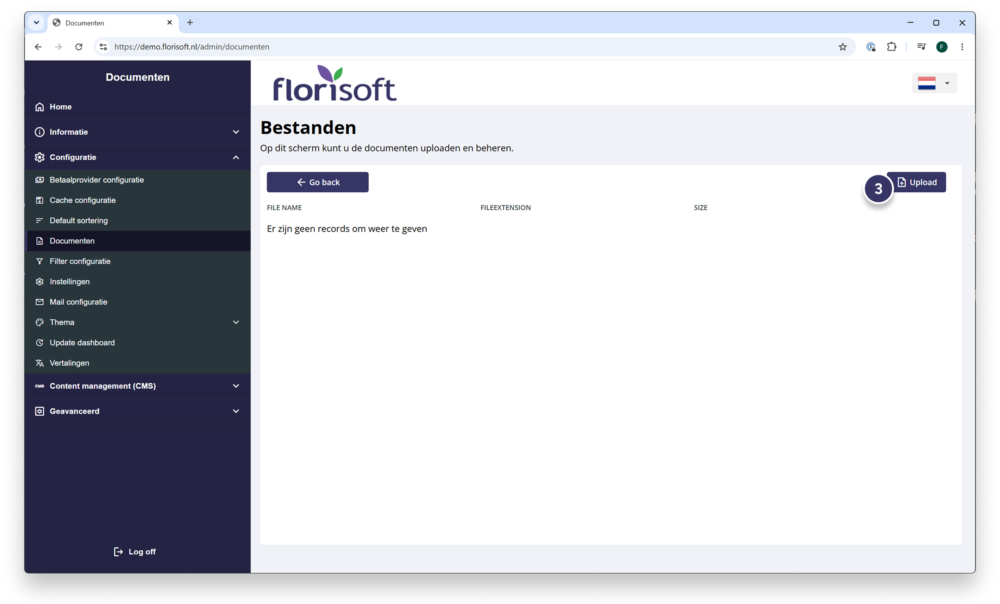
|
|**3**|Sleep het gewenste bestand naar de dropzone of selecteer een bestand via de daarvoor bestemde knop (4). Nadat het bestand succesvol is geüpload, kun je terugkeren naar het overzicht (5).

<b>Klik hier voor de voorbeeldafbeelding</b>
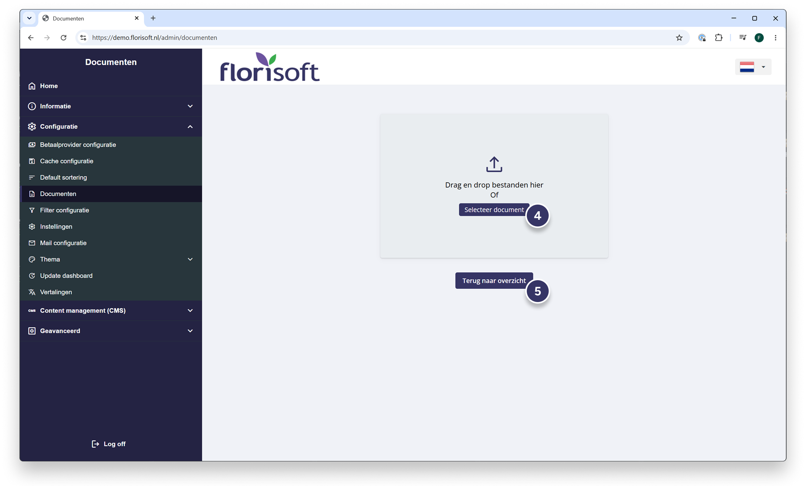
|
|**4**|Het geüploade bestand wordt nu weergegeven in het overzicht (6). Vanuit dit overzicht kun je het bestand verwijderen (7) of het downloadpad naar je klembord kopiëren (8). Het gekopieerde downloadpad kun je vervolgens bijvoorbeeld gebruiken in een [Button](#button)-component, zodat bezoekers het bestand via deze knop kunnen downloaden.

<b>Klik hier voor de voorbeeldafbeelding</b>
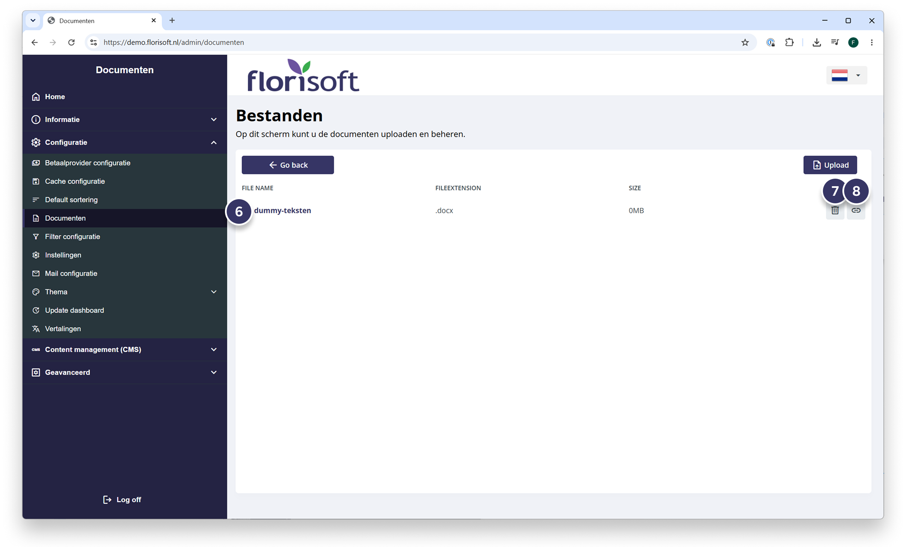
|

---

#### Links

Wanneer je naast je FloriShop-domein ook een eigen website hebt, kan het handig zijn om vanuit je webshop rechtstreeks naar belangrijke pagina's op deze website te kunnen navigeren. Via het scherm **Links** kun je eenvoudig koppelingen naar externe websites of pagina's toevoegen aan de navigatiebalk van je shop.

|Stap|Uitleg|
|:--|:--|
|**1**|Navigeer via **Content Management (CMS)** (1) naar **Links** (2).

<b>Klik hier voor de voorbeeldafbeelding</b>

|
|**2**|Klik op het **'+'-icoon** (3) om een nieuwe link aan te maken. Vul in het dialoogvenster de volgende gegevens in:  - **Naam (4):** geef de link een herkenbare naam.  - **URL (5):** vul de URL in waarnaar de link moet verwijzen.  - **Weergavenaam (6):** geef hier de naam op waaronder de link in de navigatiebalk wordt weergegeven.  - **Volgorde in navigatie (optioneel) (7):** bepaal hier de positie van de link in de navigatiebalk. **1** staat vooraan.  - **Gebruikerstoken toevoegen (optioneel) (8):** schakel deze optie in als er een gebruikerstoken aan de URL moet worden toegevoegd.  Klik vervolgens op **Opslaan** (9) om de link op te slaan. De link wordt daarna direct zichtbaar in de navigatiebalk van je shop.

<b>Klik hier voor de voorbeeldafbeelding</b>
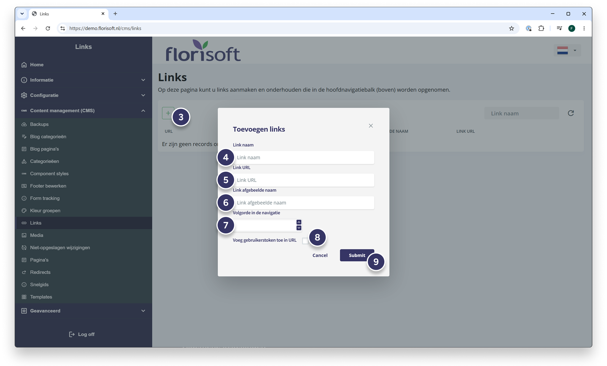
|

---

#### Editor

De **Editor** is een WYSIWYG-editor (*What You See Is What You Get*) waarin wijzigingen direct als concept op de pagina worden weergegeven. Nadat de pagina is gepubliceerd, worden de wijzigingen zichtbaar in de live-omgeving.

**Let op:** Wanneer je als CMS-beheerder bent ingelogd, worden wijzigingen direct zichtbaar in de webshop. Hierdoor kan het lijken alsof de wijzigingen al live staan, maar in werkelijkheid worden deze alleen als conceptweergave getoond aan ingelogde CMS-beheerders.

| Stap | Uitleg |
|:--|:--|
| **1** | Activeer de **Beheer**-omgeving van de webshop door op het gebruikersicoon te klikken. Er wordt een dropdownmenu geopend. Klik vervolgens op de optie **Beheer** (1).

<b>Klik hier voor de voorbeeldafbeelding</b>
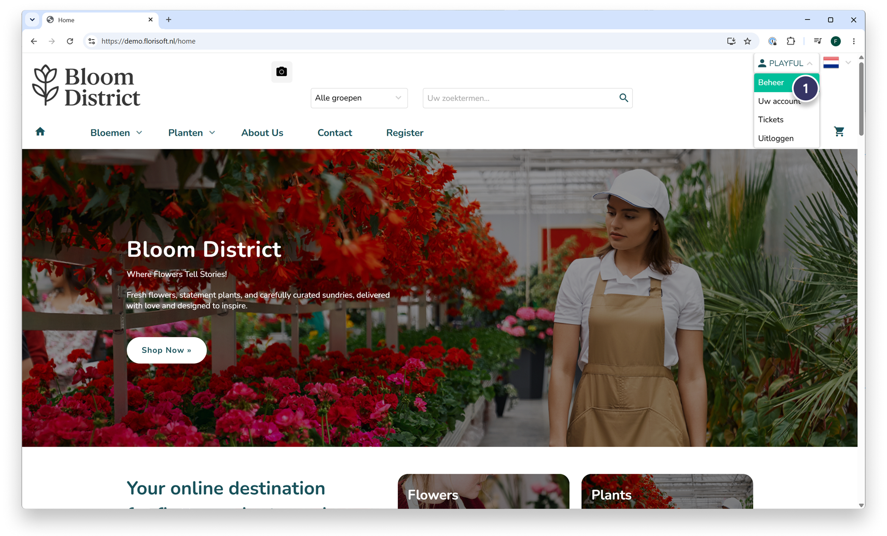
 |
| **2** | Activeer de **CMS Editor** (2).

<b>Klik hier voor de voorbeeldafbeelding</b>
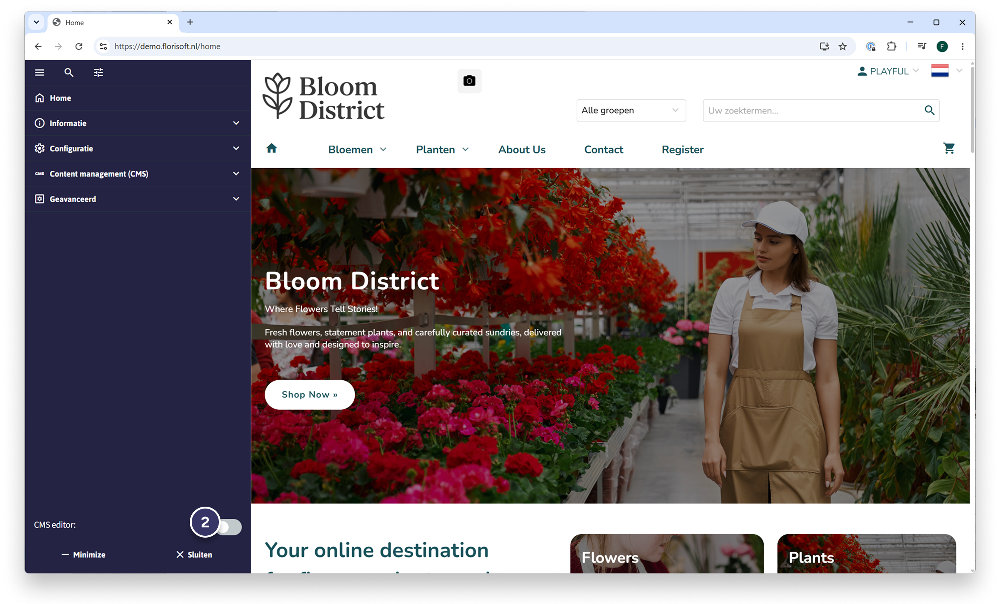
 |
| **3** | Nadat de CMS Editor is geactiveerd, worden verschillende onderdelen zichtbaar. Zo verschijnen er selectiekaders (3) rondom de componenten, wordt de [Navigator](#navigator) (4) geopend en verschijnt de [Aside Editor](#aside-editor) (5). Onderaan het scherm worden daarnaast verschillende opties weergegeven:  **6 - [Niet-opgeslagen wijzigingen](#niet-opgeslagen-wijzigingen):** Bekijk de wijzigingen die nog niet zijn gepubliceerd.  **7 - Toon/sluit [Navigator](#navigator):** Open of sluit de Navigator.  **8 - Geschiedenis:** Toont een tijdlijn waarin je tussen verschillende wijzigingsstappen kunt navigeren. Hier kun je ook zien welke CMS-beheerder een wijziging op de weergegeven pagina heeft aangebracht.  **9 - Responsive:** Opent een toolbar waarmee je een voorvertoning van de pagina kunt bekijken voor tablets en mobiele apparaten.  **10 - Publiceren:** Publiceer de pagina naar de live-omgeving.  **11 - Opslaan:** Sla de gemaakte wijzigingen op. **Let op:** Opgeslagen wijzigingen zijn hiermee nog niet live gepubliceerd.  **12 - Stap ongedaan maken:** Maak de laatst uitgevoerde wijziging ongedaan.

<b>Klik hier voor de voorbeeldafbeelding</b>
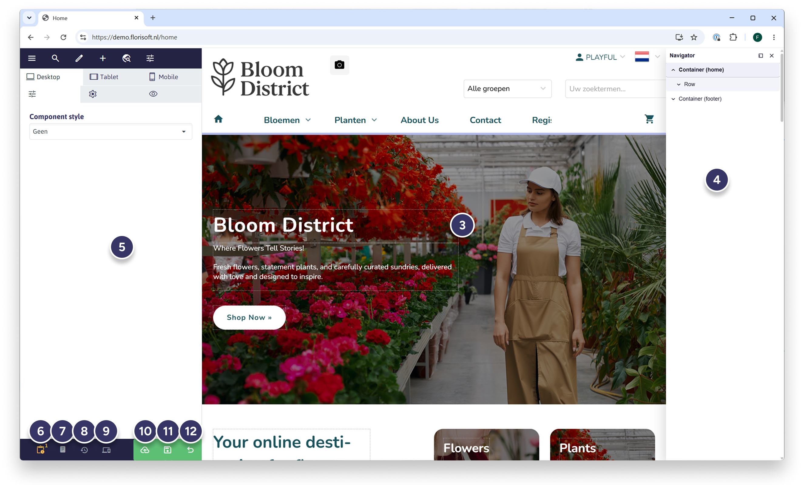
 |
| **4** | Door op een component te klikken (13), worden de bijbehorende selectiekaders uitgelicht. Je kunt vervolgens direct wijzigingen doorvoeren (14). Daarnaast is in de [Navigator](#navigator) direct zichtbaar waar het geselecteerde component zich op de pagina bevindt (15).

<b>Klik hier voor de voorbeeldafbeelding</b>
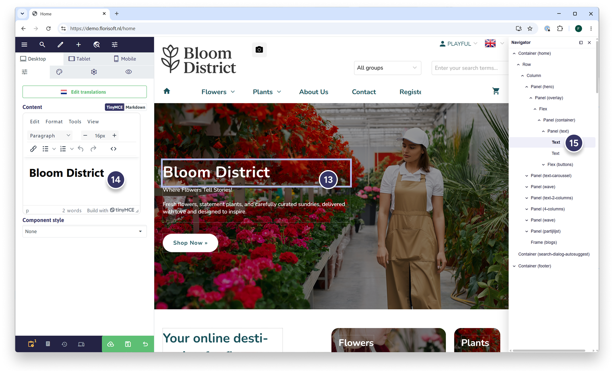
 |
| **5** | Door met de rechtermuisknop op een component te klikken, krijg je, afhankelijk van het geselecteerde component, verschillende opties (16). Mogelijke acties zijn:  - **Uploaden:** Upload een `.json`-bestand van een CMS-[pagina](#pagina). - **Downloaden:** Download de CMS-pagina als `.json`-bestand. - **Dupliceren:** Dupliceer het geselecteerde component met `Ctrl + D`. - **Kopiëren:** Kopieer het geselecteerde component met `Ctrl + C`. - **Plakken:** Plak een gekopieerd component met `Ctrl + V`. - **Opslaan als [Template](#templates):** Sla het geselecteerde component op als template. - **Verwijderen:** Verwijder het geselecteerde component. - **Toevoegen:** Voeg een nieuw component toe.

<b>Klik hier voor de voorbeeldafbeelding</b>
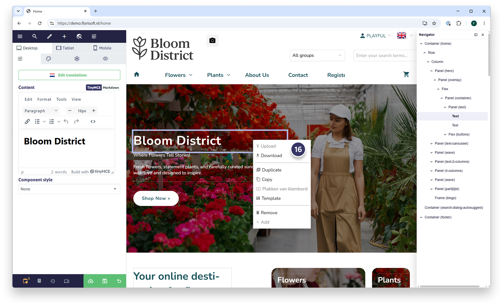
 |

---

#### Navigator

De **Navigator** toont de boomstructuur van jouw CMS-[pagina](#pagina). Met de handige drag-and-dropfunctie kun je de structuur en indeling van de pagina eenvoudig aanpassen.

| Stap | Uitleg |
|:--|:--|
| **1** | Nadat je de **CMS Editor** hebt ingeschakeld, zoals beschreven bij [Editor](#editor), verschijnt er een langwerpig dialoogvenster. Dit is de **Navigator** (1). De Navigator toont niet alleen waar de verschillende componenten zich op de pagina bevinden, maar maakt het ook mogelijk om snel naar een specifiek component te navigeren. Wanneer je in de Navigator op een component klikt, scrollt de [Editor](#editor) automatisch naar het bijbehorende component. Het geselecteerde component wordt vervolgens kort uitgelicht, zodat je direct kunt zien om welk onderdeel het gaat.

<b>Klik hier voor de voorbeeldafbeelding</b>
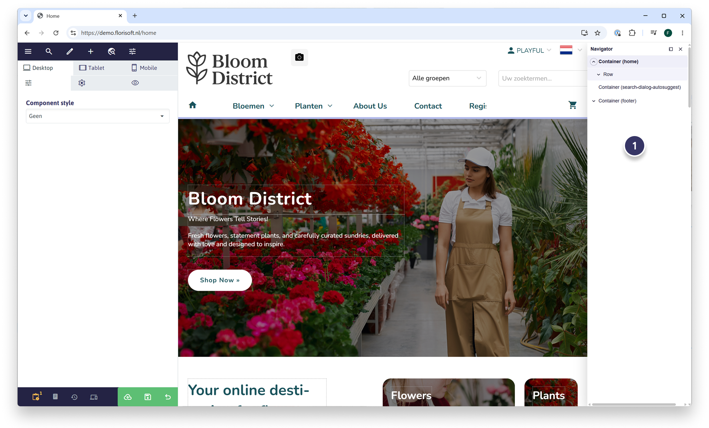
 |
| **2** | Met de pijltjes (2) kun je componenten in- en uitklappen. Zo kun je eenvoudig bekijken hoe componenten binnen andere componenten zijn opgebouwd. Door een component ingedrukt te houden en te verslepen, kun je de positie ervan op de pagina eenvoudig aanpassen (3). Wanneer je tijdens het slepen de **Ctrl**-toets ingedrukt houdt, kun je een component binnen een ander component plaatsen.

<b>Klik hier voor de voorbeeldafbeelding</b>
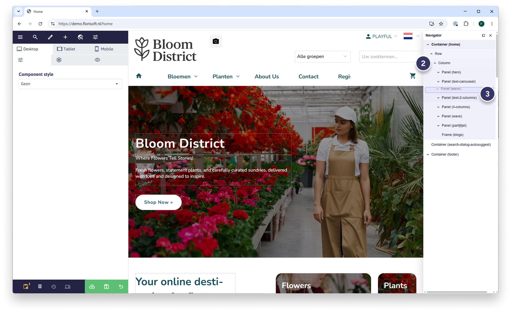
 |
| **3** | Door met de rechtermuisknop op een component (4) te klikken, krijg je dezelfde opties (5) als bij een rechtermuisklik op een component in de [Editor](#editor).

<b>Klik hier voor de voorbeeldafbeelding</b>
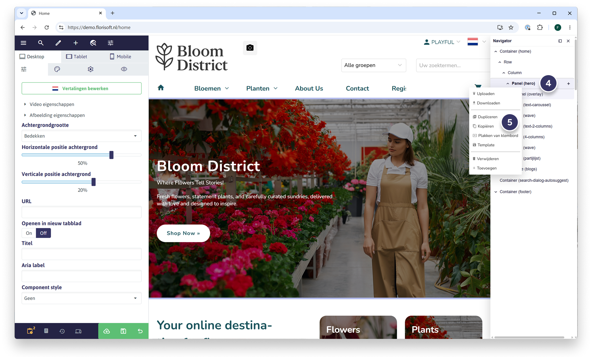
 |

---

#### Componentendialoog

De **Componentendialoog** is de bibliotheek met alle beschikbare [CMS-componenten](#componenten-1). Deze componenten dienen als bouwstenen voor het opbouwen en vormgeven van jouw CMS-[pagina's](#pagina).

| Stap | Uitleg |
|:--|:--|
| **1** | In dit voorbeeld willen we een [Button](#button)-component toevoegen aan een [Flex](#flex)-component (1). Klik hiervoor op het '+'-icoon achter het **Flex**-component (2) om de **Componentendialoog** te openen.

<b>Klik hier voor de voorbeeldafbeelding</b>
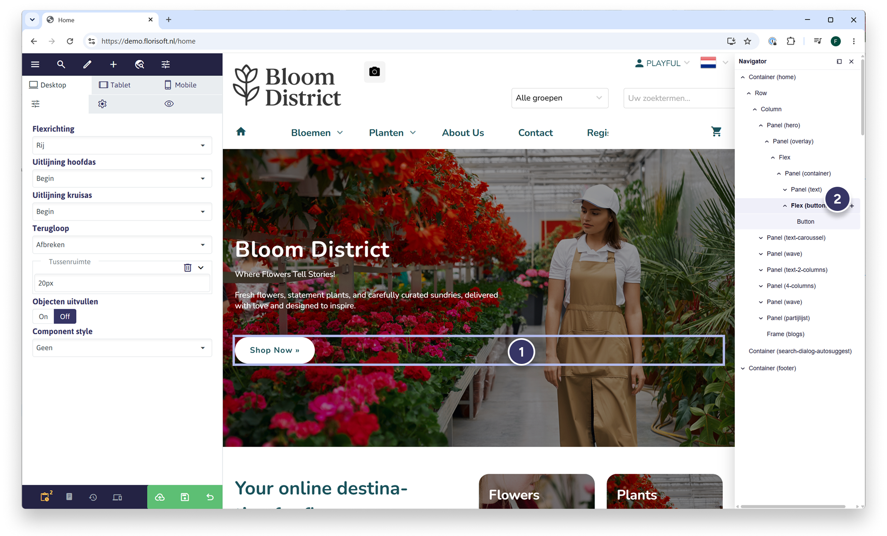
 |
| **2** | De **Componentendialoog** is nu geopend. Hier vind je tientallen componenten waarmee je jouw CMS-[pagina](#pagina) kunt opbouwen. De componenten zijn verdeeld over verschillende categorieën (3):  **[Basis](#basis):** Bevat componenten waarmee je de basisstructuur van je pagina kunt opbouwen.  **[Dashboard](#dashboard):** Componenten waarmee analytische dashboards kunnen worden opgebouwd.  **[Formulier](#formulier):** Bevat alle componenten die nodig zijn voor het bouwen van digitale formulieren.  **[Geavanceerd](#geavanceerd):** Componenten die voornamelijk bedoeld zijn voor ontwikkelaars.  **[Gebruiker](#gebruiker):** Componenten die van toepassing zijn op ingelogde debiteuren.  **[Health](#health):** Componenten waarmee analytische Health-schermen kunnen worden opgebouwd.  **[Media](#media-1):** Componenten voor het toevoegen en ondersteunen van media-content.  **[Navigatie](#navigatie):** Handige en dynamische componenten waarmee bezoekers snel en gericht binnen en buiten de webshop kunnen navigeren.  **[Templates](#templates):** Een overzicht van opgeslagen templates die met één klik aan de pagina kunnen worden toegevoegd.  Per categorie wordt weergegeven hoeveel componenten beschikbaar zijn (4). Je kunt een component zoeken op naam (5), de resultaten sorteren (6) op alfabetische volgorde of populariteit en de weergave wijzigen naar een lijstweergave (7). Bij sorteren op populariteit worden veelgebruikte componenten bovenaan weergegeven.  In het overzicht worden de naam en categorie van elk component weergegeven (8). Via het 'i'-icoon (9) kun je meer informatie over een component bekijken. Een component voeg je toe via het '+'-icoon (10).

<b>Klik hier voor de voorbeeldafbeelding</b>
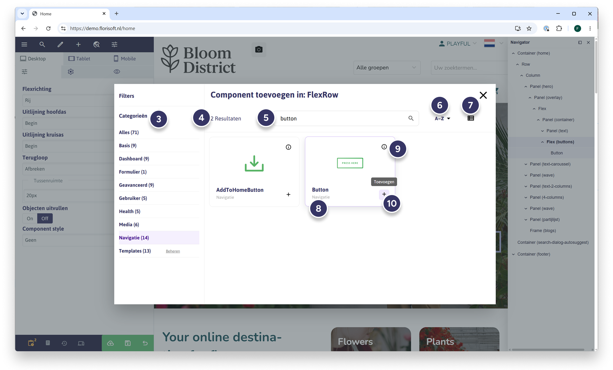
 |
| **3** | Nadat het [Button](#button)-component is toegevoegd, wordt dit direct weergegeven in de [Editor](#editor) (11) en [Navigator](#navigator) (12). Daarnaast kun je de instellingen van het component direct aanpassen via de [Aside Editor](#aside-editor) (13).

<b>Klik hier voor de voorbeeldafbeelding</b>
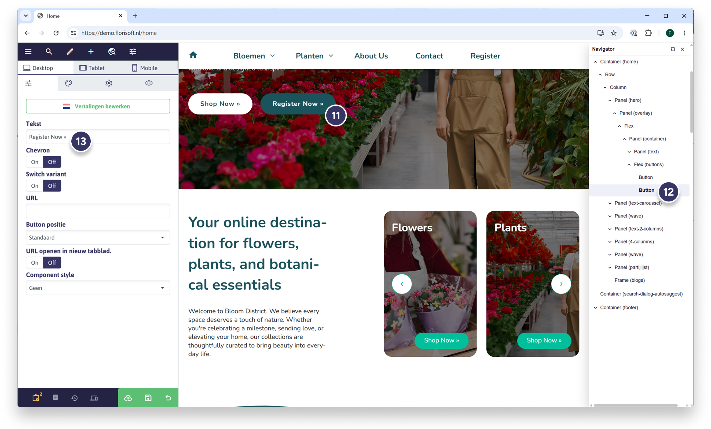
 |

---

#### CMS Zone

Een **CMS-zone** is een gedefinieerd gebied waaraan één of meerdere debiteuren kunnen worden gekoppeld. Klanten die aan een bepaalde zone zijn gekoppeld, krijgen toegang tot de CMS-componenten die aan deze zone zijn toegewezen. CMS-zones fungeren daarmee als een vorm van autorisatie binnen het CMS.

*Volg onderstaande stappen:*

| Stap | Uitleg |
|:--|:--|
| **1** | Open het **Constantenscherm**.

<b>Klik hier voor de voorbeeldafbeelding</b>

 |
| **2** | Navigeer naar het volgende pad in de bestandsstructuur: **Systeem** → **Internet** → **CMS Zones**.

<b>Klik hier voor de voorbeeldafbeelding</b>

 |
| **3** | Klik op het pictogram **Nieuw item toevoegen** (het plusteken **+**). |
| **4** | Het scherm voor het aanmaken van een CMS-zone wordt geopend. Vul de volgende velden in:  - **Code** - **Omschrijving** — deze wordt weergegeven in het CMS. |
| **5** | Klik op **OK** om het aanmaken van de zone te bevestigen. Herhaal deze stappen om indien gewenst meerdere CMS-zones aan te maken. Deze zones kunnen later worden gekoppeld aan debiteuren en CMS-componenten. |
| **6** | Open het **Constantenscherm**.

<b>Klik hier voor de voorbeeldafbeelding</b>

 |
| **7** | Navigeer naar het volgende pad: **Community** → **Debiteurgegevens** → **Debiteuren**.

<b>Klik hier voor de voorbeeldafbeelding</b>

 |
| **8** | Open de debiteur waaraan je één of meerdere CMS-zones wilt koppelen. |
| **9** | Navigeer in het geopende venster naar het volgende pad in de bestandsstructuur: **Internet** → **CMS**.

<b>Klik hier voor de voorbeeldafbeelding</b>

 |
| **10** | Klik op de knop **CMS Zones**. Het venster **Debiteurpakket** wordt geopend.

<b>Klik hier voor de voorbeeldafbeelding</b>

 |
| **11** | Klik op **Toevoegen**. Het venster **CMS Zones** wordt geopend. |
| **12** | Selecteer één of meerdere zones en klik op **OK**.  *De geselecteerde zones worden nu weergegeven in het venster **Debiteur CMS Zones**.*

<b>Klik hier voor de voorbeeldafbeelding</b>

 |
| **13** | Klik op **OK** in het venster **Debiteur CMS Zones**.  *De geselecteerde CMS-zones zijn nu gekoppeld aan de debiteur.*

<b>Klik hier voor de voorbeeldafbeelding</b>

 |
| **Herhaal** | Herhaal bovenstaande stappen voor iedere debiteur waaraan je CMS-zones wilt koppelen. |

---

## Aside Editor

### Toolbar

#### Menu

| Stap | Uitleg |
|:--|:--|
| **1** | Open het beheerdersmenu via **je accountnaam → Beheer** (1). Via het **Menu** (2) vind je als beheerder de volgende opties die vanuit de browser beschikbaar zijn:  **3 - Home:** Navigeer direct naar de homepagina van je shop.  **4 - Informatie:** Hier vind je belangrijke technische informatie over je shop. Deze informatie kan bijvoorbeeld van toepassing zijn voor ontwikkelaars wanneer er specifieke gegevens uit de logs moeten worden opgezocht.  **5 - Configuratie:** Onder deze tab vind je relevante instellingen en mogelijkheden voor de configuratie van je shop. Vanuit de configuratie kun je onder andere nieuwe [thema's](#thema-configuratie) aanmaken en [documenten](#documenten) uploaden.  **6 - Content Management (CMS):** Hier vind je alle relevante opties voor het beheren en bewerken van de content binnen het CMS. Meer informatie over deze opties vind je bij de [Beheerschermen](#beheerschermen).  **7 - Geavanceerd:** Deze tab is uitsluitend toegankelijk voor Florisoft-medewerkers.  **8 - CMS Editor:** Schakel de CMS Editor in om te beginnen met het bewerken van je [CMS-pagina's](#pagina).  **9 - Minimize:** Klap het beheerdersmenu in.  **10 - Sluiten:** Sluit de beheeromgeving.

<b>Klik hier voor de voorbeeldafbeelding</b>
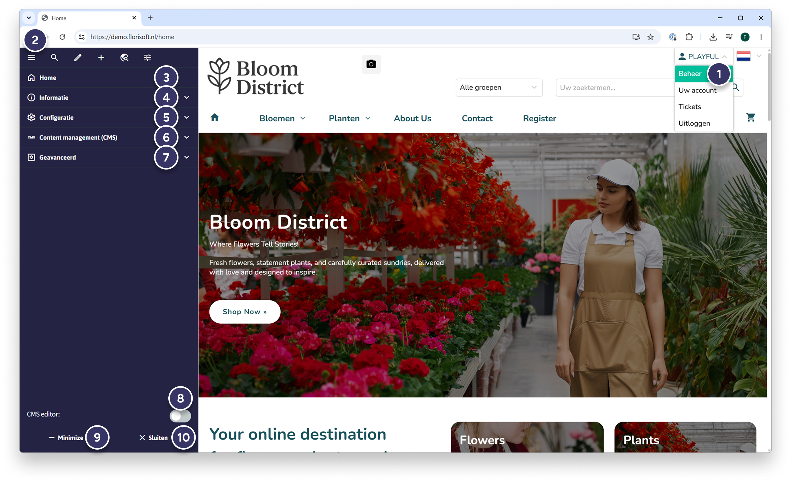
|

---

#### Zoeken

| Stap | Uitleg |
|:--|:--|
| **1** | Via **Zoeken** (1) kun je als beheerder snel zoeken naar aangemaakte **CMS- en Blogpagina's** binnen je shop. Gebruik hiervoor de zoekbalk (2) om de gewenste pagina te vinden. Vervolgens kun je de pagina selecteren en er direct naartoe navigeren (3).

<b>Klik hier voor de voorbeeldafbeelding</b>
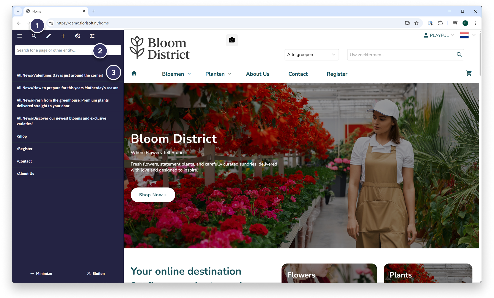
|

---

#### CMS Editor

| Stap | Uitleg |
|:--|:--|
| **1** | Via **CMS Editor** (1) in de Toolbar kun je, wanneer de CMS Editor is geactiveerd, snel navigeren naar de **Aside Editor**. Vanuit hier kun je de componenten op je CMS-pagina eenvoudig bewerken.

<b>Klik hier voor de voorbeeldafbeelding</b>
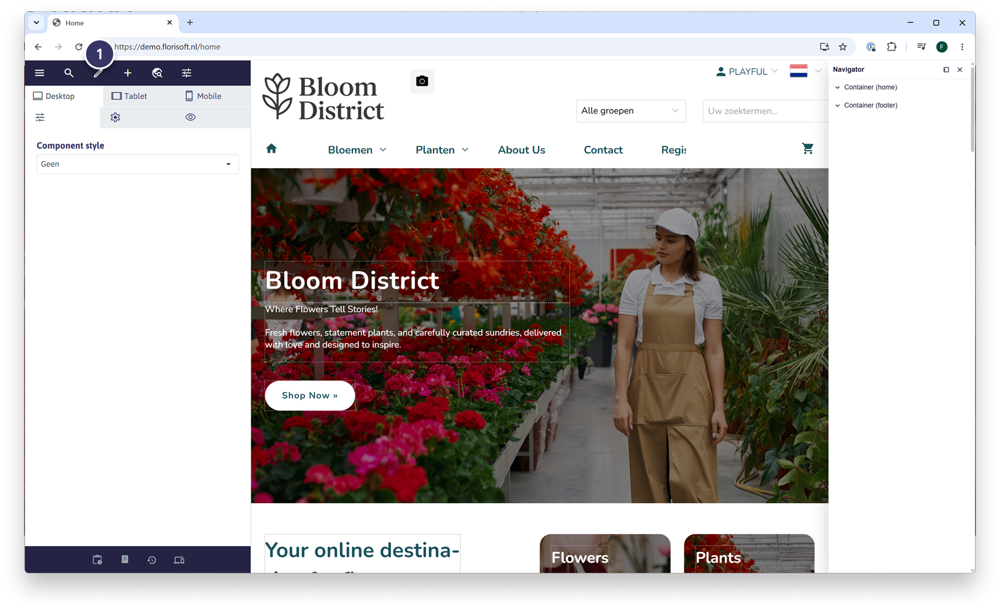
|

---

#### Drag & Drop

Het **Drag & Drop**-scherm is een variant op het [Componentendialoog](#componentendialoog) en de [Editor](#editor). Hiermee kun je [componenten](#componenten) rechtstreeks vanuit de [Aside Editor](#aside-editor) naar een pagina slepen en daar plaatsen.

| Stap | Uitleg |
|:--|:--|
| **1** | In dit voorbeeld starten we met een nieuwe, lege [pagina](#pagina). Wanneer de [CMS Editor](#cms-editor) is ingeschakeld (1), kun je via de [Toolbar](#1-toolbar) de **Drag & Drop**-omgeving openen (2).

<b>Klik hier voor de voorbeeldafbeelding</b>
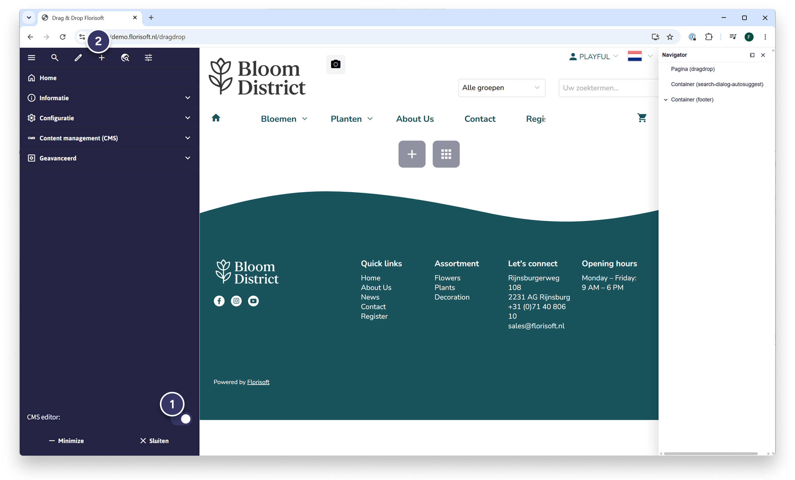
 |
| **2** | In de [Aside Editor](#aside-editor) (3) worden alle componentcategorieën weergegeven, vergelijkbaar met het [Componentendialoog](#componentendialoog). Je kunt hier ook zoeken naar een specifiek component (4). De balken die je ziet (5) zijn de paginacontainers waarin componenten kunnen worden geplaatst.

<b>Klik hier voor de voorbeeldafbeelding</b>
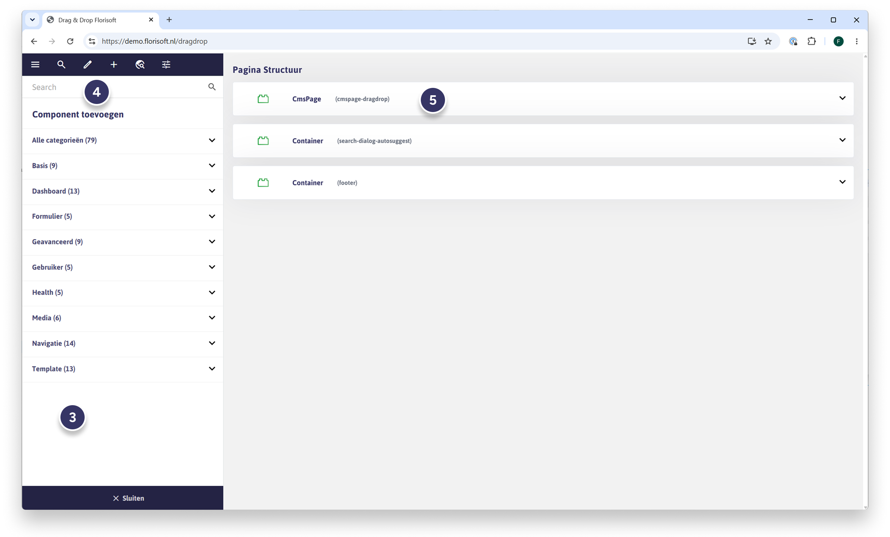
 |
| **3** | Sleep een component — in dit voorbeeld een [Row](#rowcolumn) (6) — door de linkermuisknop ingedrukt te houden en het component naar de gewenste CMS-paginacontainer (7) te slepen. Het component wordt nu op de pagina geplaatst.

<b>Klik hier voor de voorbeeldafbeelding</b>
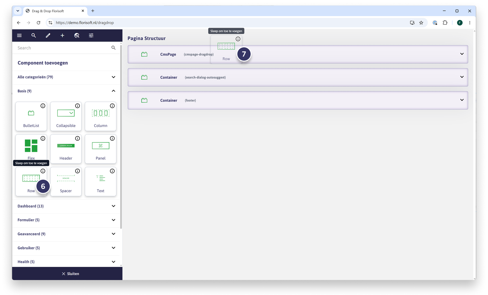
 |
| **4** | Sleep vervolgens een [Column](#rowcolumn) (8) naar de zojuist toegevoegde **Row** (9).

<b>Klik hier voor de voorbeeldafbeelding</b>
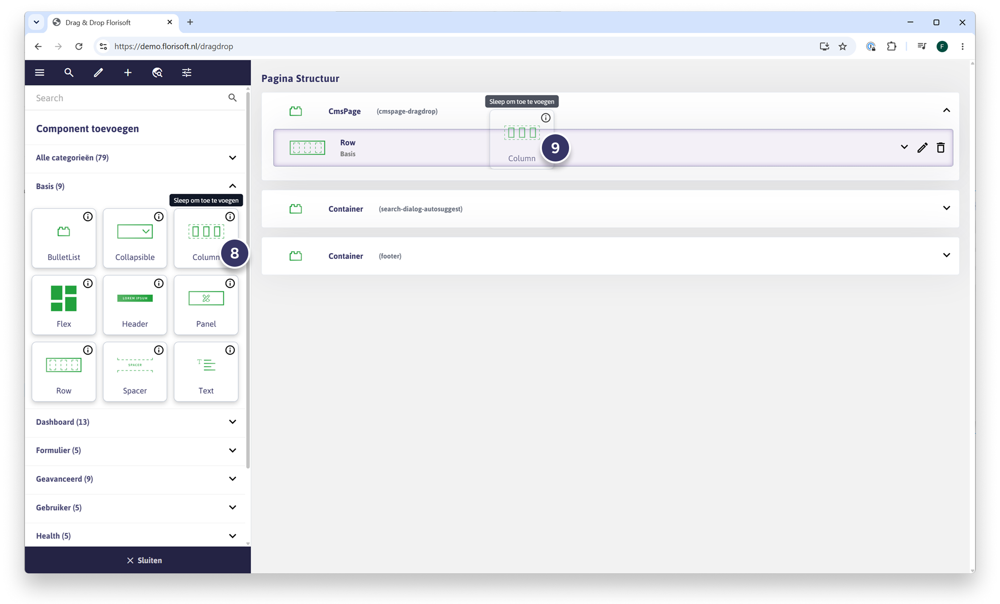
 |
| **5** | Je kunt componenten bewerken door op het potloodicoon (10) te klikken. Je kunt een component ook verwijderen (11). Wanneer je klaar bent met het indelen van de pagina, sluit je het **Drag & Drop**-scherm (12).

<b>Klik hier voor de voorbeeldafbeelding</b>
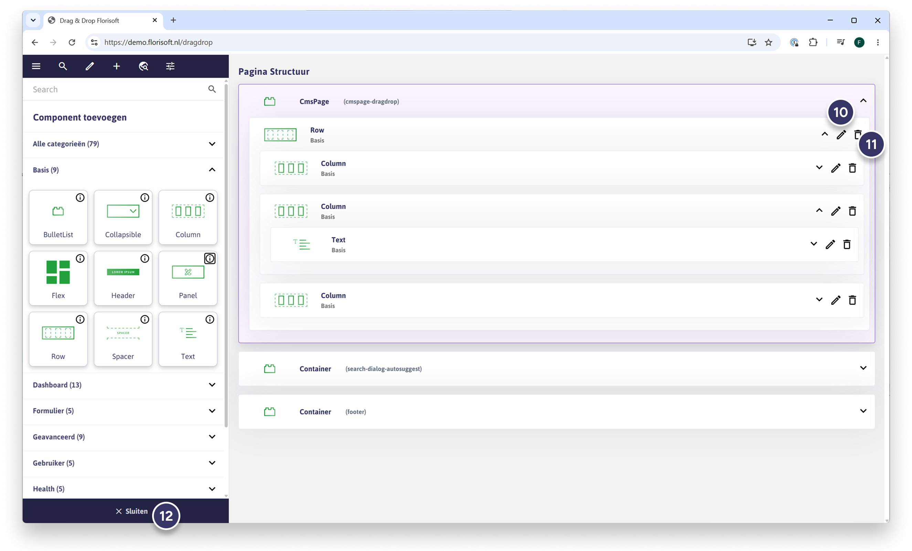
 |
| **6** | De [componenten](#componenten) die we via **Drag & Drop** hebben samengesteld, zijn nu direct op de CMS-pagina geplaatst (13). Deze componenten kunnen vervolgens verder worden gevuld en ingericht met de gewenste content.

<b>Klik hier voor de voorbeeldafbeelding</b>
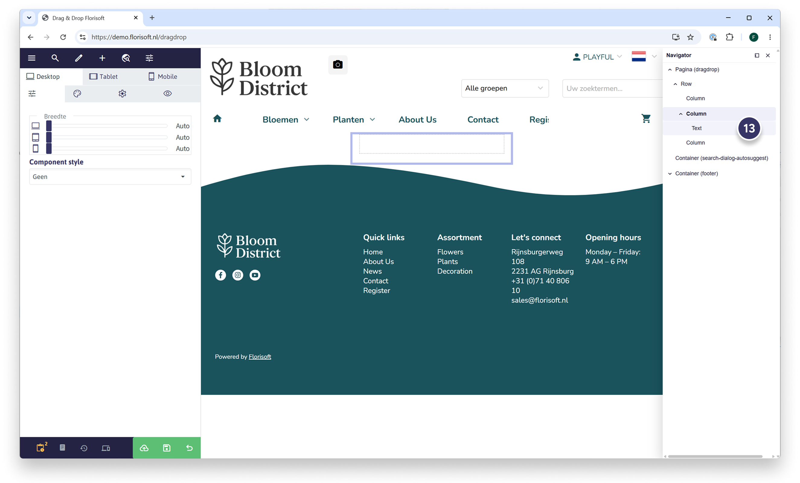
 |

---

#### SEO

Om je pagina's beter vindbaar te maken in Google, kun je per pagina SEO-instellingen configureren. Door relevante zoekwoorden en metadata toe te voegen, vergroot je de kans dat je pagina goed wordt gevonden in zoekmachines.

**Let op:** Het opbouwen van een goede SEO-score vereist voldoende kennis van SEO-strategieën. De juiste instellingen alleen bieden geen garantie voor een hoge positie in de zoekresultaten.

| Stap | Uitleg |
|:--|:--|
| **1** | Wanneer de [CMS Editor](#cms-editor) is ingeschakeld (1), kun je via de [Toolbar](#1-toolbar) het **SEO**-dialoogvenster openen (2).

<b>Klik hier voor de voorbeeldafbeelding</b>
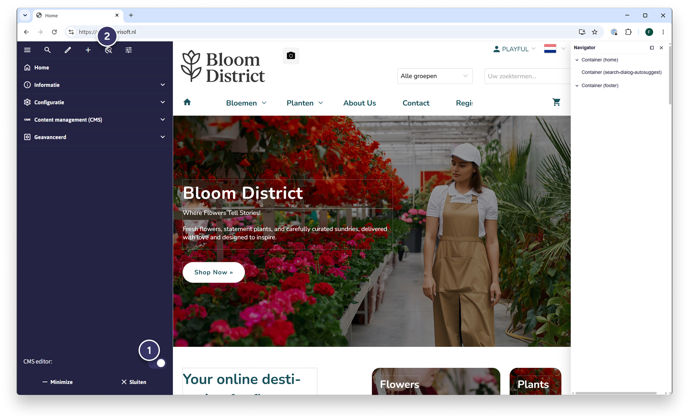
 |
| **2** | De **URL** van de pagina is al voor je ingevuld en hoef je niet aan te passen (3). Selecteer vervolgens de gewenste taal voor de metadata (4).  **Meta titel (5):** Voer hier de titel van de pagina in. Je kunt maximaal 60 tekens gebruiken. Voor het beste resultaat raden we aan om maximaal 40 tekens te gebruiken. Hierdoor is de titel in de meeste gevallen volledig zichtbaar in de Google-zoekresultaten en wordt deze niet afgebroken.  **Meta beschrijving (6):** Voer hier een korte beschrijving van de pagina in. Je kunt maximaal 155 tekens gebruiken. Voor het beste resultaat raden we aan om maximaal 140 tekens te gebruiken. Hierdoor is de beschrijving in de meeste gevallen volledig zichtbaar in de Google-zoekresultaten en wordt deze niet afgebroken.  **Canonical URL (7):** Vul hier de URL in van de voorkeursversie van een pagina wanneer dezelfde of vergelijkbare content via meerdere URL's bereikbaar is. Hiermee geef je aan welke URL door zoekmachines als de belangrijkste versie van de pagina moet worden beschouwd. Dit helpt onder andere om problemen met dubbele content te voorkomen.  **Google Site Verification (8):** Gebruik dit veld om je website te verifiëren bij Google. Hiervoor voeg je de verificatiecode toe die je van Google hebt ontvangen. Hiermee bevestig je aan Google dat je eigenaar of beheerder van de website bent.

<b>Klik hier voor de voorbeeldafbeelding</b>
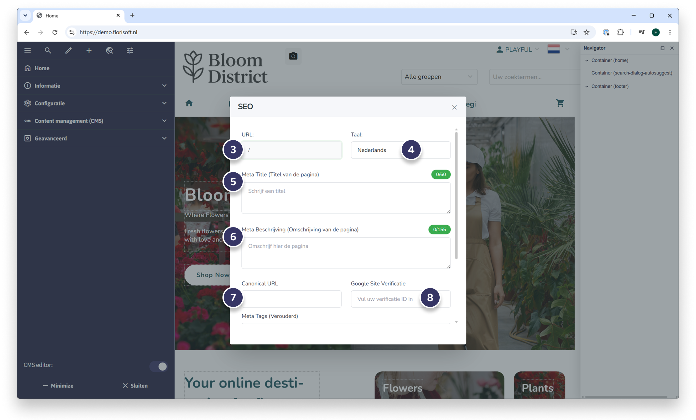
 |
| **3** | **Meta tags (9):** Je kunt hier eventueel nog meta tags invullen. Google gebruikt de traditionele `meta keywords`-tag echter niet meer als rankingfactor. Het invullen hiervan heeft daarom geen directe invloed op je SEO-score.  **Niet indexeren (10):** Schakel deze optie in wanneer je niet wilt dat Google en andere zoekmachines de pagina indexeren. De pagina wordt dan niet opgenomen in de zoekresultaten.  Vervolgens kun je de SEO-instellingen **opslaan** (11) of de wijzigingen **annuleren** (12).

<b>Klik hier voor de voorbeeldafbeelding</b>
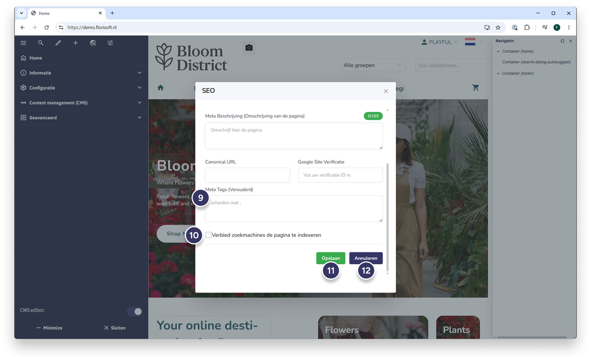
 |

---

#### Voorkeuren

Via deze tab kun je de [Editor](#editor) naar jouw persoonlijke voorkeuren configureren.

| Stap | Uitleg |
|:--|:--|
| **1** | Via **Voorkeuren** (1) kun je de functie **AutoSaveOnEdit** in- of uitschakelen (2). Deze functie is standaard ingeschakeld, zodat conceptwijzigingen automatisch worden opgeslagen. Via het dropdownmenu (3) kun je eenvoudig wisselen tussen verschillende [thema's](#thema-configuratie) om vervolgens wijzigingen binnen een ander thema door te voeren.

<b>Klik hier voor de voorbeeldafbeelding</b>
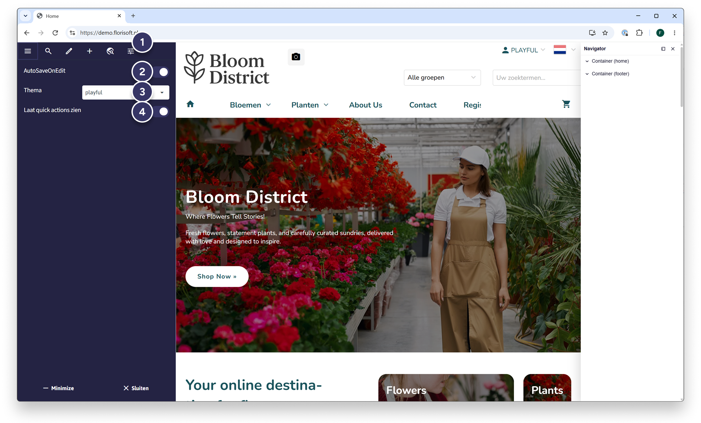
 |

---

#### Responsive tabs

Met deze tabs kun je ervoor zorgen dat jouw website er niet alleen op desktop, maar ook op tablets en mobiele apparaten netjes en professioneel uitziet.

| Stap | Uitleg |
|:--|:--|
| **1** | Wanneer je een component selecteert (1), verschijnen de **Responsive tabs** (2) in de [Aside Editor](#aside-editor). Stel hier de gewenste waarden in voor desktopapparaten.

<b>Klik hier voor de voorbeeldafbeelding</b>
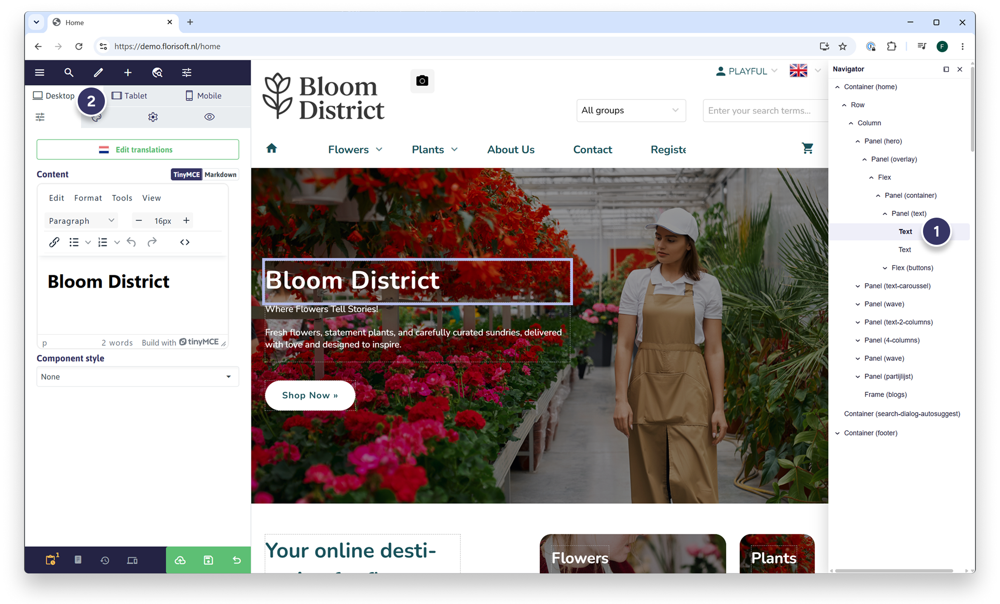
 |
| **2** | Wil je voor tablets afwijkend gedrag instellen (3), dan kun je hiervoor via het tabblad **Styling** (4) een afwijkende waarde opgeven.

<b>Klik hier voor de voorbeeldafbeelding</b>
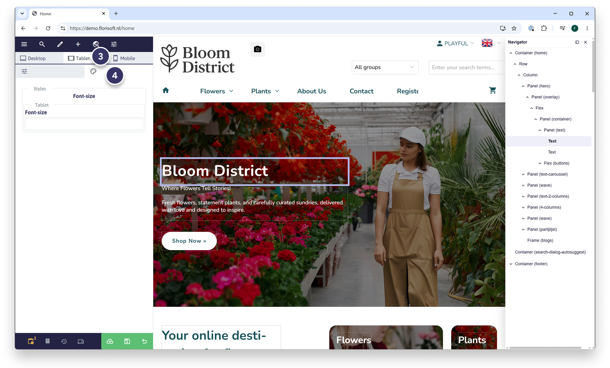
 |
| **3** | Wil je voor mobiele apparaten afwijkend gedrag instellen (5), dan kun je hiervoor via het tabblad **Styling** (6) een afwijkende waarde opgeven. Via de [Responsive-knop](#editor) (7) kun je vervolgens controleren hoe het [Tekst](#text)-component zich gedraagt op tablets en mobiele apparaten.

<b>Klik hier voor de voorbeeldafbeelding</b>

 |

---

### Algemene instellingen

Elk component beschikt over een tabblad **Algemene instellingen**. De beschikbare instellingen kunnen per component verschillen. Toch zijn er een aantal opties die bij veel componenten terugkomen.

#### Vertalingen

Wanneer je tekst kunt invoeren binnen een [component](#componenten) of bij de [pagina-instellingen](#pagina), kun je via de knop **Vertalingen bewerken** eenvoudig vertalingen voor verschillende talen toevoegen.

| Stap | Uitleg |
|:--|:--|
| **1** | In dit voorbeeld hebben we een **[Tekst-component](#text)** geselecteerd (1). Onder het tabblad **Algemene instellingen** (2) vind je de knop **Vertalingen bewerken** (3). Klik hierop om het vertaaldialoogvenster te openen.

<b>Klik hier voor de voorbeeldafbeelding</b>
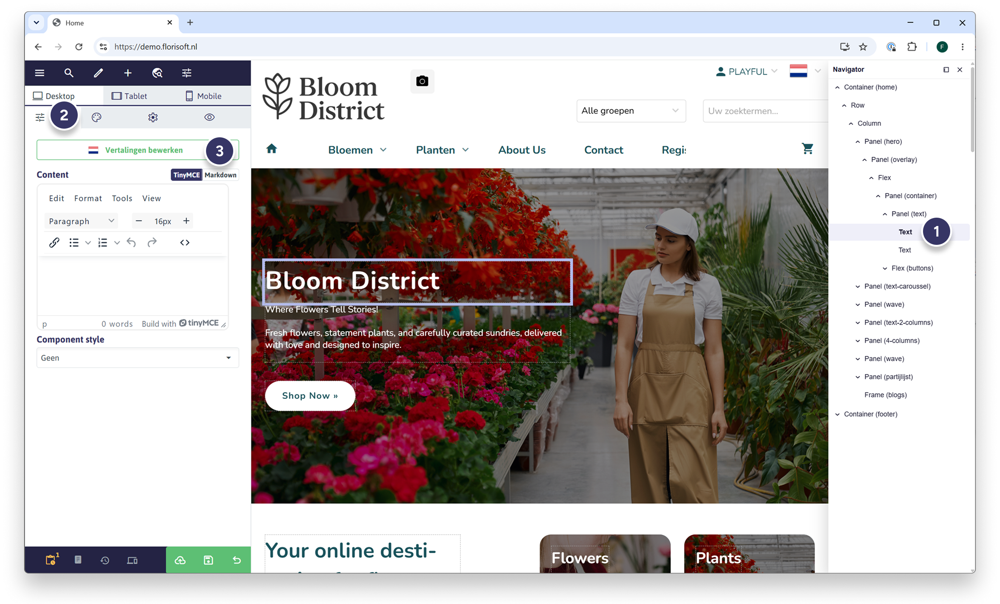
 |
| **2** | In het vertaaldialoogvenster wordt standaard de **Default**-taal van de webshop weergegeven (4). De standaardtaal van de webshop kan worden ingesteld via de webshopinstelling **CMSDEFAULTCULTURE**. **Let op:** Vul hier altijd een geldige landcode in, zoals `nl` of `en`. Ongeldige waarden kunnen fouten in de webshop veroorzaken. Vervolgens kun je de tekst voor deze taal invoeren (5). In dit voorbeeld is het tekstveld nog leeg, omdat er nog geen Nederlandse vertaling is ingevuld. Daarnaast vind je een dropdownmenu waarin je een andere taal kunt selecteren (6). Voor de geselecteerde taal kun je vervolgens de gewenste vertaling invoeren (7).

<b>Klik hier voor de voorbeeldafbeelding</b>
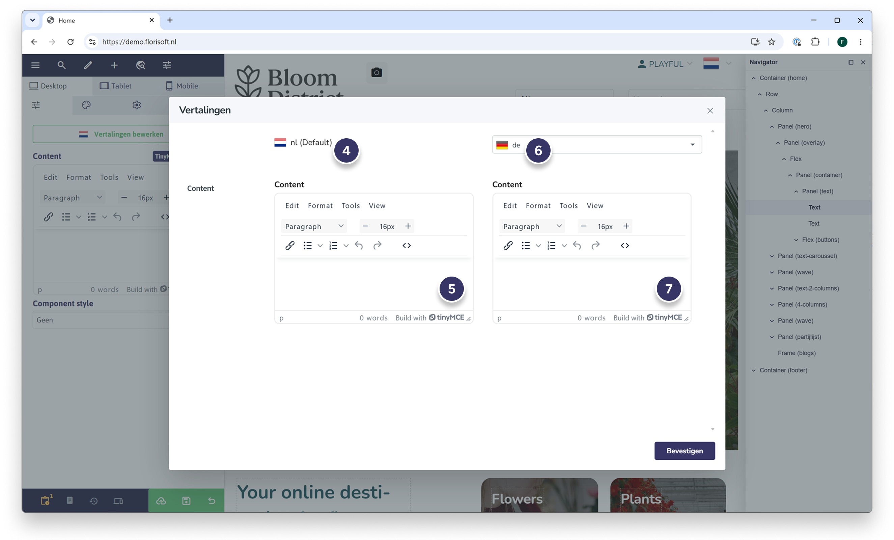
 |
| **3** | Wanneer je een taal hebt geselecteerd, wordt met een groen bolletje (8) aangegeven dat deze taal volledig van een vertaling is voorzien. In dit voorbeeld is te zien dat er alleen een vertaling voor de Engelse taal is ingevuld (8). Nadat je de gewenste vertalingen hebt ingevuld, kun je de instellingen bevestigen (9).

<b>Klik hier voor de voorbeeldafbeelding</b>
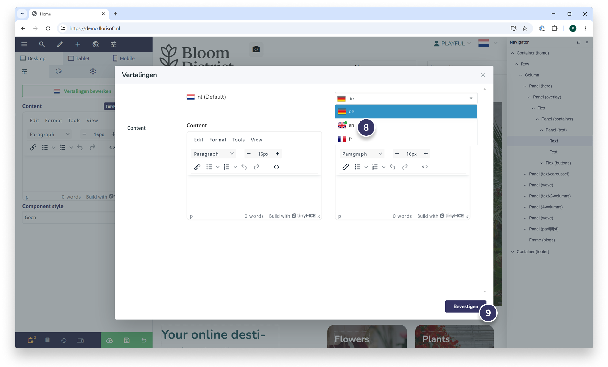
 |

---

### Styling

Bijna elk component beschikt over een tabblad **Styling**. De beschikbare instellingen kunnen per component verschillen. Toch zijn er een aantal opties die bij veel componenten terugkomen.

#### Color Picker

De **Color Picker** wordt weergegeven wanneer je een kleur voor een [component](#componenten) wilt selecteren of aanpassen. Je kunt eenvoudig een van je [themakleuren](#thema-configuratie) (**pcolor2** of **scolor2**) selecteren, een aangepaste kleur kiezen en vervolgens de transparantie instellen.

| Stap | Uitleg |
|:--|:--|
| **1** | In dit voorbeeld hebben we een **[Tekst-component](#text)** geselecteerd (1). Onder het tabblad **Styling** (2) vind je de optie **Kleur** (3). Wanneer je op de kleur klikt, wordt de **Color Picker** geopend. In het kleurvlak kun je een kleurtint selecteren (4) en via de schuifregelaar (5) de gewenste kleur bepalen. De transparantie kun je instellen met behulp van de transparantieschuifregelaar (6).  Beschik je over een **HEX**- (7) of **RGB**-kleurcode (8), dan kun je deze ook handmatig invoeren. Daarnaast zijn er verschillende vooraf ingestelde kleuren (9) beschikbaar die je direct kunt selecteren.  Via de **Color Picker** heb je ook altijd je twee belangrijkste [themakleuren](#thema-configuratie), **pcolor2** en **scolor2**, bij de hand (10). Wanneer je een component aan een themakleur koppelt, reageert deze dynamisch op de kleur die je instelt in de [Thema Configuratie](#thema-configuratie).  Bevestig vervolgens de gekozen kleur (11). Is de kleur toch niet helemaal zoals gewenst? Dan kun je de ingestelde kleur eenvoudig verwijderen via de verwijderknop (12) of de wijziging [ongedaan maken](#editor).

<b>Klik hier voor de voorbeeldafbeelding</b>
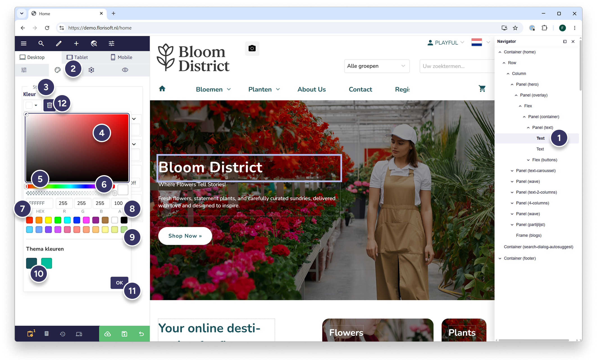
 |

---

#### Omlijning

Met de optie **Omlijning** kun je een omlijning toevoegen aan je [component](#componenten). Je kunt de lijndikte, kleur en lijnstijl instellen. Daarnaast kun je de lijndikte per zijde afzonderlijk aanpassen.

| Stap | Uitleg |
|:--|:--|
| **1** | In dit voorbeeld hebben we een **[Panel-component](#panel)** geselecteerd (1). Onder het tabblad **Styling** (2) vind je de optie **Omlijning** (3). Hier kun je de gewenste lijndikte instellen (4). De volgende eenheden worden ondersteund: `px`, `em`, `rem`, `%`, `in`, `cm`, `mm`, `pt`, `pc`, `vh` en `vw`. Vervolgens kun je een [kleur](#color-picker) (5) en lijnstijl (6) selecteren.

<b>Klik hier voor de voorbeeldafbeelding</b>
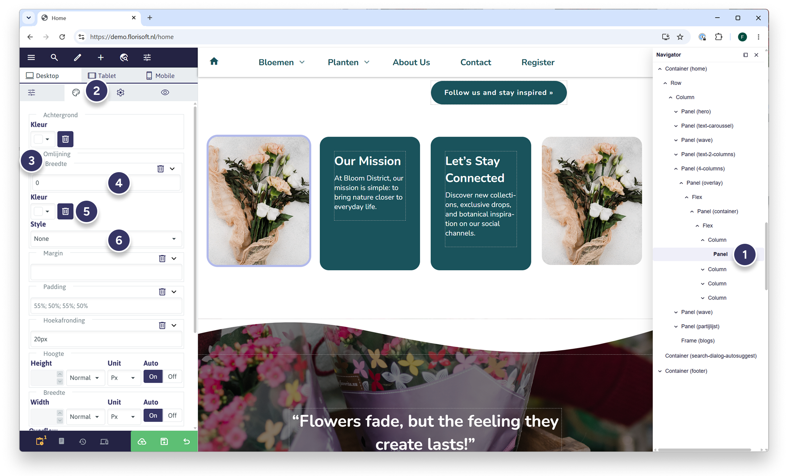
 |
| **2** | Klap indien gewenst de aanvullende opties uit (7) om de lijndikte per zijde afzonderlijk in te stellen. De wijzigingen worden direct zichtbaar in de [Editor](#editor) (8). Is de omlijning toch niet helemaal zoals gewenst? Dan kun je de ingestelde omlijning eenvoudig verwijderen via de verwijderknop (9) of de wijziging [ongedaan maken](#editor).

<b>Klik hier voor de voorbeeldafbeelding</b>
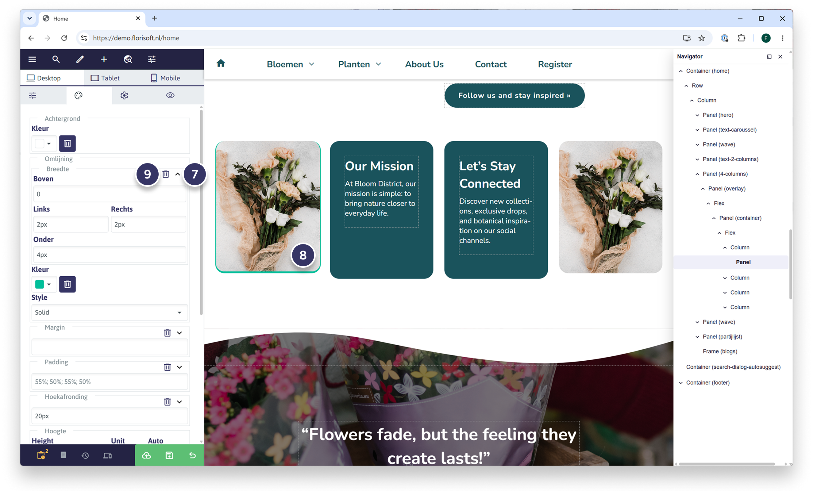
 |

---

#### Margin/Padding

Met de opties **Margin** en **Padding** kun je ruimte creëren rondom en binnen een [component](#componenten). **Margin** kan daarnaast worden gebruikt om de positie van een component op de pagina te beïnvloeden.

| Stap | Uitleg |
|:--|:--|
| **1** | In dit voorbeeld hebben we een [Panel](#panel)-component geselecteerd (1). Via het tabblad **Styling** (2) kun je **Margin** (3) en **Padding** (4) instellen voor alle zijden van het component. Met **Margin** stel je de ruimte rondom een component in (5). De volgende eenheden worden ondersteund: `unset`, `auto`, `px`, `em`, `rem`, `%`, `in`, `cm`, `mm`, `pt`, `pc`, `vh` en `vw`. Met **Padding** creëer je ruimte binnen het component (6). De volgende eenheden worden ondersteund: `px`, `em`, `rem`, `%`, `in`, `cm`, `mm`, `pt`, `pc`, `vh` en `vw`.

<b>Klik hier voor de voorbeeldafbeelding</b>
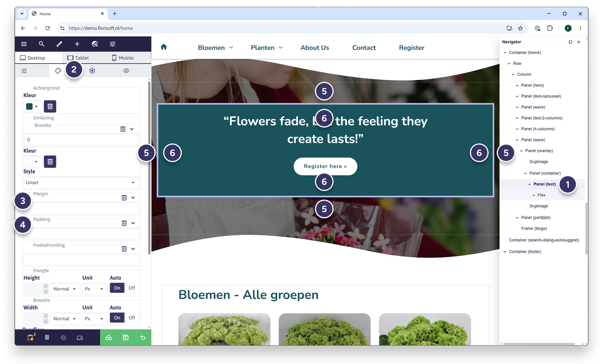
 |
| **2** | Door de aanvullende opties uit te klappen (7), kun je de waarden voor elke zijde afzonderlijk instellen. De wijzigingen worden direct zichtbaar in de [Editor](#editor) (8). Zijn de instellingen toch niet helemaal zoals gewenst? Dan kun je deze eenvoudig verwijderen via de verwijderknop (9) of de wijziging [ongedaan maken](#editor).

<b>Klik hier voor de voorbeeldafbeelding</b>
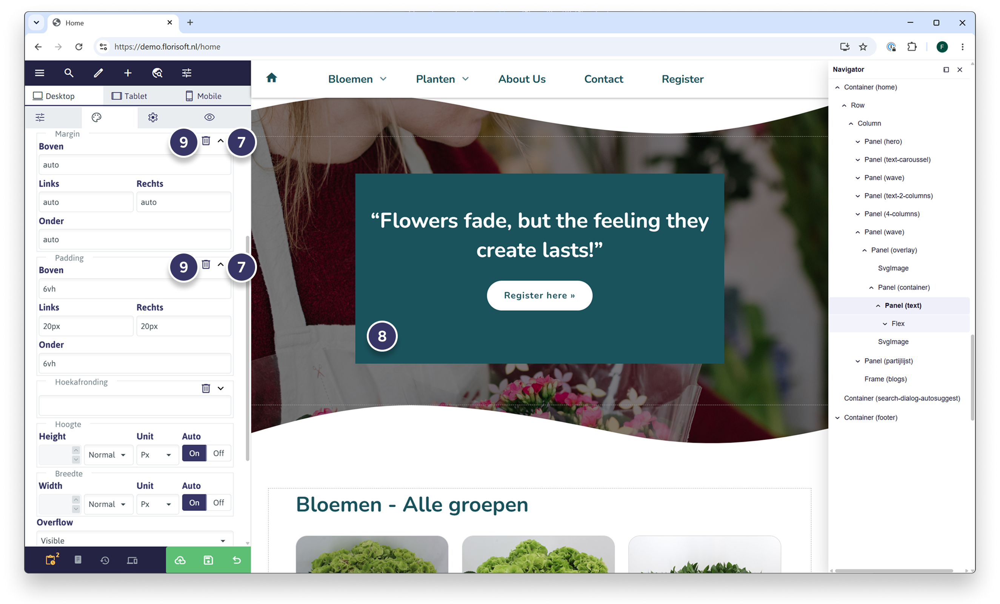
 |

---

#### Hoekafronding

Geef je [componenten](#componenten) een speelse of moderne uitstraling door gebruik te maken van **Hoekafronding**.

| Stap | Uitleg |
|:--|:--|
| **1** | In dit voorbeeld hebben we een [Panel](#panel)-component geselecteerd (1). Via het tabblad **Styling** (2) kun je de **Hoekafronding** (3) instellen voor alle hoeken van het component. De volgende eenheden worden ondersteund: `px`, `em`, `rem`, `%`, `in`, `cm`, `mm`, `pt`, `pc`, `vh` en `vw`.

<b>Klik hier voor de voorbeeldafbeelding</b>
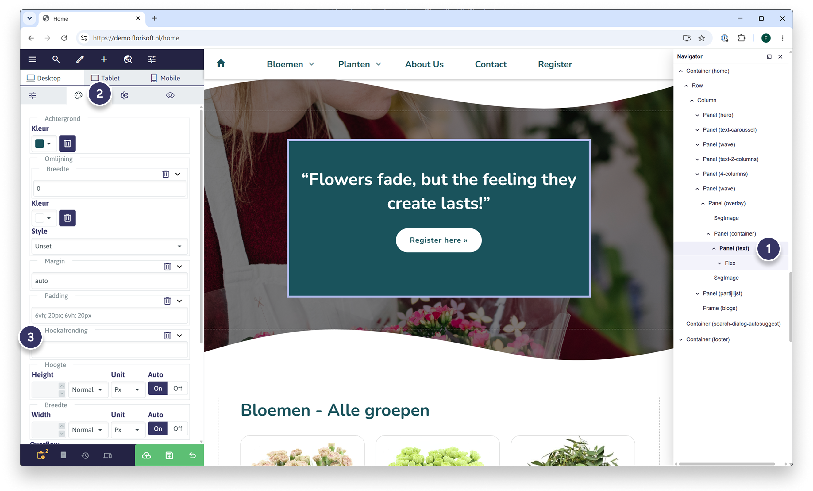
 |
| **2** | Door de aanvullende opties uit te klappen (4), kun je de hoekafronding voor elke hoek afzonderlijk instellen. De wijzigingen worden direct zichtbaar in de [Editor](#editor) (5). Zijn de instellingen toch niet helemaal zoals gewenst? Dan kun je deze eenvoudig verwijderen via de verwijderknop (6) of de wijziging [ongedaan maken](#editor).  **Let op:** Het kan voorkomen dat de hoekafronding niet direct zichtbaar is. Controleer in dat geval of de [Overflow](#overflow) (7) op **Hidden** staat. In dit voorbeeld staat **Overflow** op **Visible**, omdat de hoekafronding al zichtbaar is (5).

<b>Klik hier voor de voorbeeldafbeelding</b>
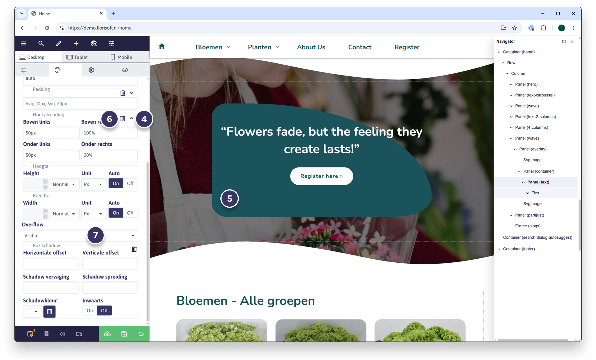
 |

---

#### Hoogte/Breedte

Stel de **Hoogte** en **Breedte** van je [componenten](#componenten) in om de afmetingen van een component te bepalen.

| Stap | Uitleg |
|:--|:--|
| **1** | In dit voorbeeld hebben we een [Panel](#panel)-component geselecteerd (1). Via het tabblad **Styling** (2) kun je de **Hoogte** (3) en **Breedte** (4) van het component instellen.

<b>Klik hier voor de voorbeeldafbeelding</b>
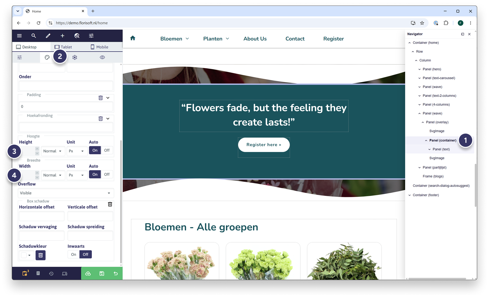
 |
| **2** | Om de hoogte in te stellen, schakel je de optie **Auto** uit (5). Vervolgens kun je een hoogte invoeren (6). Daarna bepaal je of je de hoogte als een vaste hoogte (**Normal**), maximale hoogte (**Max**) of minimale hoogte (**Min**) wilt instellen (7). In dit voorbeeld hebben we de minimale hoogte ingesteld op **50** (6) **ViewportPercent** (8). Dit betekent dat het [Panel](#panel)-component altijd minimaal 50% van de hoogte van het scherm inneemt. De volgende eenheden worden ondersteund: `px` (Pixel), `rem` (1rem = 16 pixels), `%` (Procent) en `vh` (ViewportProcent). De wijzigingen worden direct zichtbaar in de [Editor](#editor) (9).

<b>Klik hier voor de voorbeeldafbeelding</b>
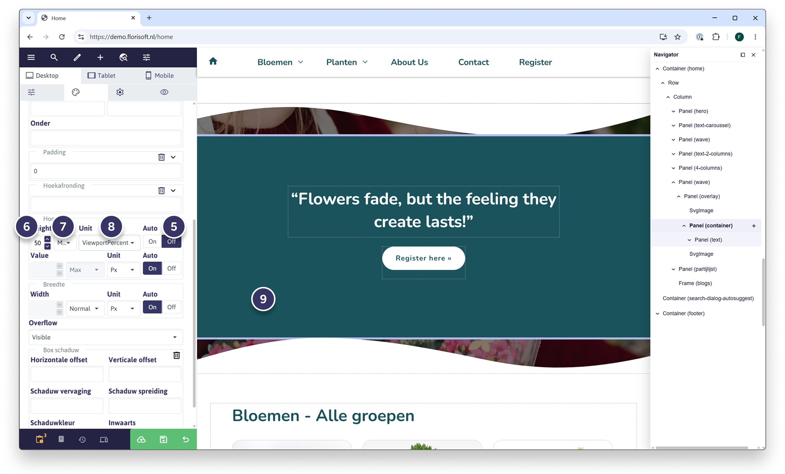
 |
| **3** | Om de breedte in te stellen, schakel je de optie **Auto** uit (10). Vervolgens kun je een breedte (**Width**) invoeren (11). Daarna bepaal je of je de breedte als een vaste breedte (**Normal**), maximale breedte (**Max**) of minimale breedte (**Min**) wilt instellen (12). In dit voorbeeld hebben we de maximale breedte ingesteld op **300** (11) **Pixels** (13). Dit betekent dat het [Panel](#panel)-component nooit breder wordt dan 300 pixels. De volgende eenheden worden ondersteund: `px` (Pixel), `rem` (1rem = 16 pixels), `%` (Procent) en `vh` (ViewportProcent). De wijzigingen worden direct zichtbaar in de [Editor](#editor) (14).

<b>Klik hier voor de voorbeeldafbeelding</b>
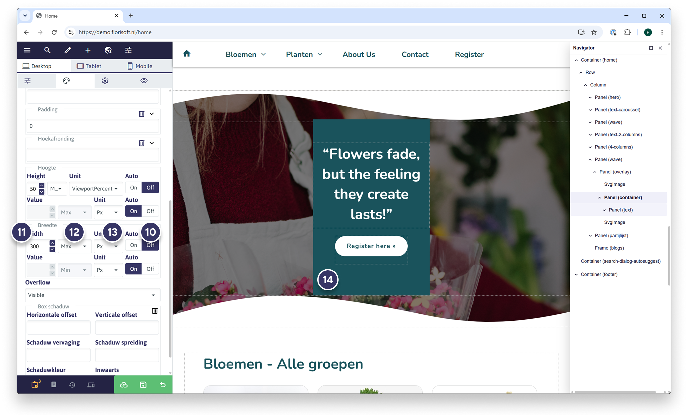
 |
| **4** | Wanneer je het type hoogte of breedte instelt op **Max** of **Min**, verschijnt er een optioneel extra invoerveld (15). Hiermee kun je naast een maximale of minimale hoogte/breedte ook de andere grenswaarde instellen voor het [component](#componenten). In dit voorbeeld hebben we ingesteld dat het [Panel](#panel)-component maximaal 300 pixels breed mag zijn, maar nooit smaller wordt dan 100 pixels.

<b>Klik hier voor de voorbeeldafbeelding</b>
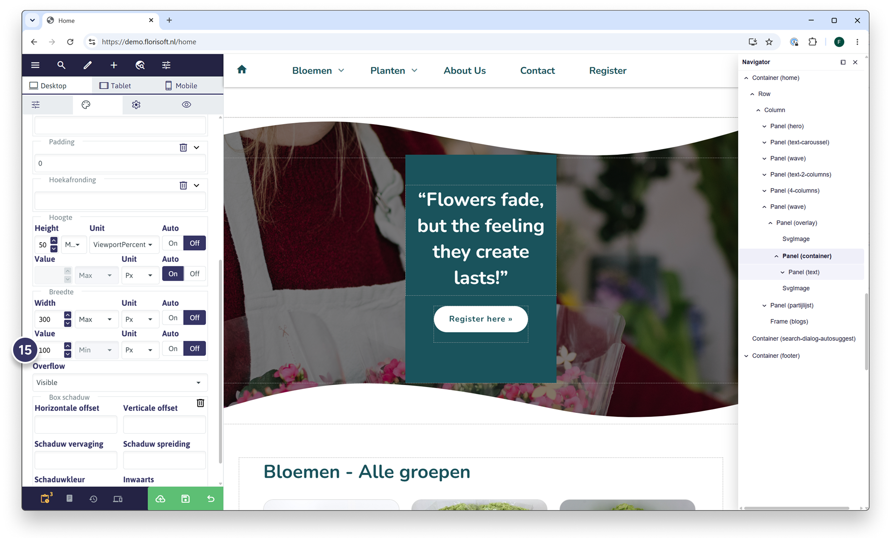
 |

---

#### Slagschaduw

Geef je [componenten](#componenten) meer diepte en een visueel effect door gebruik te maken van **Slagschaduw**.

| Stap | Uitleg |
|:--|:--|
| **1** | In dit voorbeeld hebben we een [Panel](#panel)-component geselecteerd (1). Via het tabblad **Styling** (2) kun je de optie **Slagschaduw** (3) instellen voor het [component](#componenten).

<b>Klik hier voor de voorbeeldafbeelding</b>
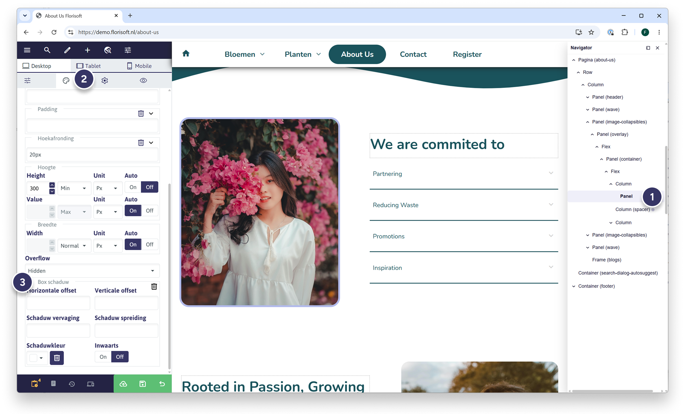
 |
| **2** | Stel de horizontale (4) en verticale (5) offset van de schaduw in. Vervolgens kun je de vervaging (6) en spreiding (7) van de schaduw bepalen. De volgende eenheden worden ondersteund: `px`, `em`, `rem`, `%`, `in`, `cm`, `mm`, `pt`, `pc`, `vh` en `vw`. Selecteer vervolgens een [kleur](#color-picker) (8) en bepaal of de schaduw naar binnen of naar buiten moet worden weergegeven (9). De wijzigingen worden direct zichtbaar in de [Editor](#editor) (10). Zijn de instellingen toch niet helemaal naar wens? Dan kun je de ingestelde slagschaduw eenvoudig verwijderen via de verwijderknop (11) of de wijziging [ongedaan maken](#editor).  **Let op:** Het kan voorkomen dat de slagschaduw wordt afgesneden. Controleer in dat geval of de **Overflow** van het component waarin het van een slagschaduw voorziene component zich bevindt, is ingesteld op **Visible**. Meer informatie hierover vind je bij [Overflow](#overflow).

<b>Klik hier voor de voorbeeldafbeelding</b>
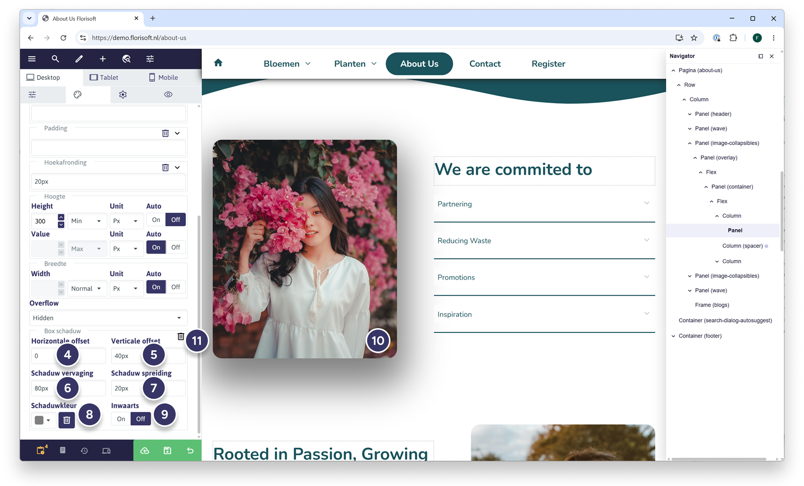
 |

---

#### Overflow

Bepaal hoe overtollige content binnen een [component](#componenten) wordt weergegeven of afgehandeld met behulp van de optie **Overflow**.

| Stap | Uitleg |
|:--|:--|
| **1** | In dit voorbeeld hebben we een [Panel](#panel)-component geselecteerd (1). Via het tabblad **Styling** (2) kun je de optie **Overflow** (3) instellen voor het [component](#componenten). Op het geselecteerde component is een [Hoekafronding](#hoekafronding) ingesteld, maar deze is niet zichtbaar in de [Editor](#editor) (5). Met de optie **Overflow** kun je bepalen hoe content die buiten de grenzen van een component valt, wordt weergegeven.

<b>Klik hier voor de voorbeeldafbeelding</b>
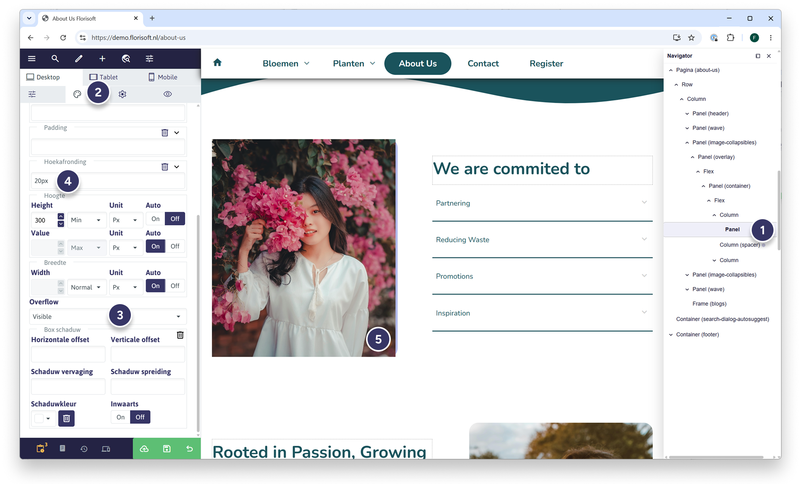
 |
| **2** | Stel de **Overflow** in op **Hidden** (6). In de [Editor](#editor) (7) is direct zichtbaar dat de [Hoekafronding](#hoekafronding) nu correct wordt weergegeven. De optie **Overflow** beschikt over de volgende instellingen:  **Visible:** Content die buiten de grenzen van het component valt, blijft zichtbaar. Dit kan er ook voor zorgen dat bijvoorbeeld een [Slagschaduw](#slagschaduw) correct zichtbaar wordt.  **Hidden:** Content die buiten de grenzen van het component valt, wordt verborgen. Dit kan er ook voor zorgen dat bijvoorbeeld een [Hoekafronding](#hoekafronding) correct zichtbaar wordt.  **Auto:** De browser bepaalt automatisch hoe overtollige content wordt afgehandeld. Indien nodig worden scrollbalken weergegeven.  **Scroll:** Overtollige content wordt verborgen en er worden scrollbalken weergegeven, zodat de gebruiker door de content kan scrollen.  **ScrollY:** Overtollige content wordt verticaal verborgen. Er wordt een verticale scrollmogelijkheid toegevoegd wanneer dit nodig is.  **ScrollX:** Overtollige content wordt horizontaal verborgen. Er wordt een horizontale scrollmogelijkheid toegevoegd wanneer dit nodig is.  **Unset:** De Overflow-instelling wordt teruggezet naar de standaardwaarde van het component of de onderliggende CSS-instelling.

<b>Klik hier voor de voorbeeldafbeelding</b>
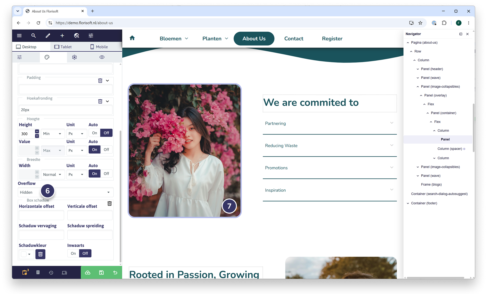
 |

---

### Geavanceerd

Bijna elk [component](#componenten) beschikt over een tabblad **Geavanceerd**. De beschikbare instellingen kunnen per component verschillen. Toch zijn er een aantal opties die bij veel componenten terugkomen.

#### Verborgen wanneer leeg

Met de optie **Verborgen wanneer leeg** kun je ervoor zorgen dat een component automatisch wordt verborgen in de live-omgeving wanneer het geen inhoud bevat.

---

#### Toevoegknop zichtbaarheid (in Editor)

Met de optie **Toevoegknop zichtbaarheid (in Editor)** bepaal je of de **toevoegknop** zichtbaar is wanneer je de pagina in de bewerkingsmodus opent.

---

#### Identificatienaam

Geef je [componenten](#componenten) een eigen naam om meer structuur en overzicht te creëren in de [Navigator](#navigator).

| Stap | Uitleg |
|:--|:--|
| **1** | In dit voorbeeld hebben we een [Button](#button)-component geselecteerd (1). Via het tabblad **Geavanceerd** (2) kun je bij **Identificatienaam** (3) een eigen naam voor het component invoeren.

<b>Klik hier voor de voorbeeldafbeelding</b>

 |
| **2** | Nadat je een naam hebt ingevuld (4), wordt deze naam achter het geselecteerde component weergegeven in de [Navigator](#navigator) (5). Zo kun je componenten gemakkelijker herkennen en houd je meer structuur en overzicht in de Navigator.

<b>Klik hier voor de voorbeeldafbeelding</b>
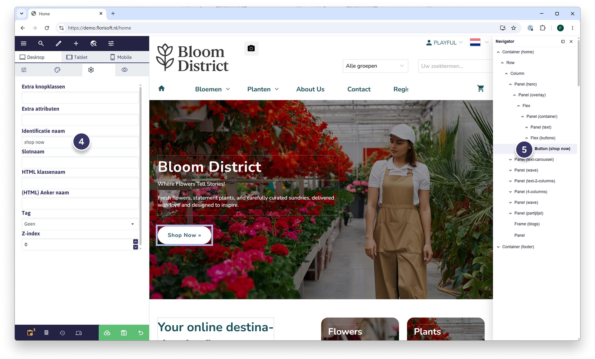
 |

---

#### Slotnaam

| Onderdeel | Beschrijving |
|---|---|
| Geavanceerd | Deze beschrijving wordt aangevuld |

---

#### HTML-klassenaam

Voer een CSS-klassenaam in om aangepaste styling op het component toe te passen.

**Let op:** Voor het toepassen van aangepaste CSS/SCSS-styling is voldoende kennis van CSS en SCSS vereist.

---

#### Tag

Met de optie **Tag** kun je ID's toewijzen aan componenten binnen een zelfgemaakt [Template](#templates). Deze ID's kunnen vervolgens worden gebruikt om dynamische gegevens vanuit de [Pagina-instellingen](#pagina) in een [Blog-component](#blog) te laden.

Zo kunnen gegevens zoals de **paginatitel**, **paginabeschrijving**, **afbeelding** en **URL** automatisch worden ingeladen. Hierdoor wordt het template binnen het Blog-component automatisch gevuld en bijgewerkt wanneer er bijvoorbeeld een nieuwe blog wordt gepubliceerd.

| Stap | Uitleg |
|:--|:--|
| **1** | In dit voorbeeld hebben we een [Template](#templates) gemaakt dat we dynamisch willen gebruiken voor een [Blog](#blog)-overzicht. Hiervoor maken we gebruik van Tags.

<b>Klik hier voor de voorbeeldafbeelding</b>
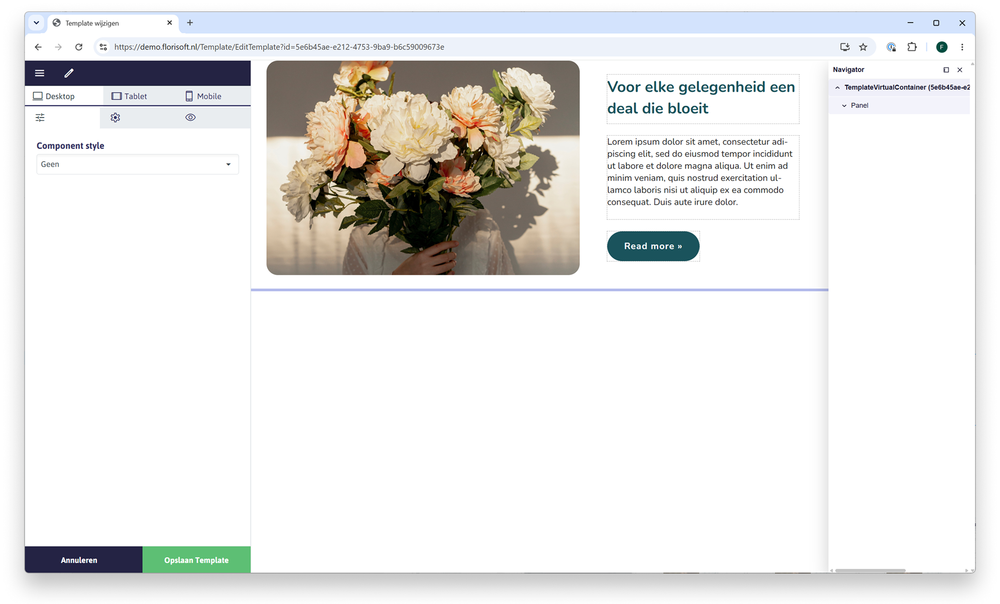
 |
| **2** | We hebben een [Panel](#panel)-component (1) toegevoegd met een achtergrondafbeelding. Via het tabblad **Geavanceerd** (2) kun je bij **Tag** (3) de optie **OverviewPanelImageTag** selecteren. Het [Panel](#panel)-component kijkt hierdoor naar de [Blogpagina](#blogpagina)-instellingen om te controleren of daar een afbeelding is ingesteld. Deze afbeelding wordt vervolgens automatisch weergegeven in het [Blog](#blog)-overzicht.

<b>Klik hier voor de voorbeeldafbeelding</b>

 |
| **3** | Vervolgens hebben we een [Tekst](#text)-component (4) toegevoegd. Bij **Tag** stellen we **OverviewTitle** (5) in. Het [Tekst](#text)-component kijkt hierdoor naar de [Blogpagina](#blogpagina)-instellingen om te controleren of daar een **Paginatitel** is ingesteld. Deze titel wordt vervolgens automatisch weergegeven in het [Blog](#blog)-overzicht.

<b>Klik hier voor de voorbeeldafbeelding</b>
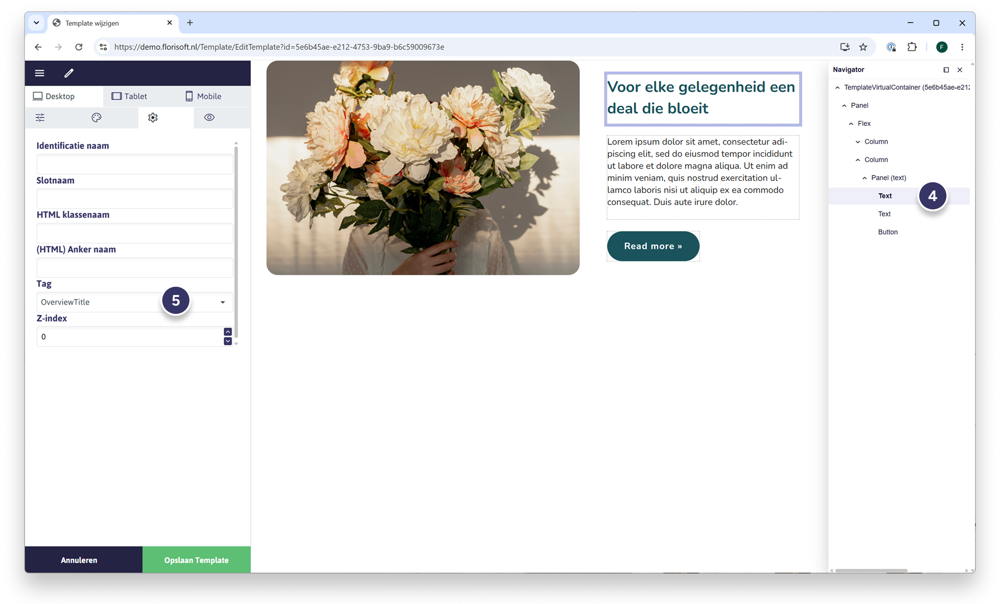
 |
| **4** | We hebben nog een [Tekst](#text)-component (6) toegevoegd. Bij **Tag** stellen we **OverviewDescription** (7) in. Het [Tekst](#text)-component kijkt hierdoor naar de [Blogpagina](#blogpagina)-instellingen om te controleren of daar een **Omschrijving** is ingevuld. Deze omschrijving wordt vervolgens automatisch weergegeven in het [Blog](#blog)-overzicht.

<b>Klik hier voor de voorbeeldafbeelding</b>
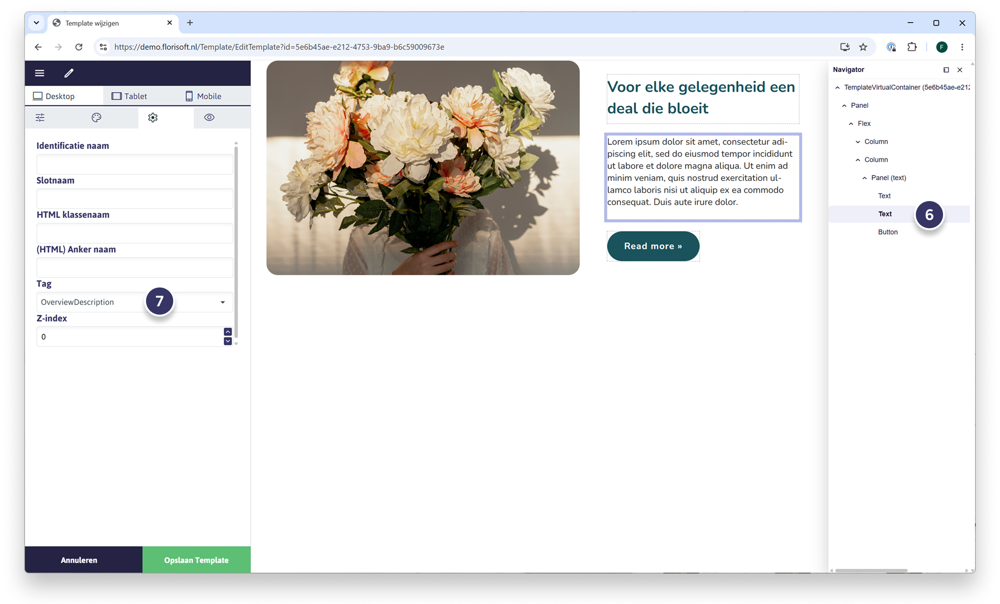
 |
| **5** | Tot slot hebben we een [Button](#button)-component (8) toegevoegd. Bij **Tag** stellen we **OverviewButton** (9) in. Het [Button](#button)-component kijkt hierdoor naar de [Blogpagina](#blogpagina)-instellingen om de ingestelde URL op te halen. Wanneer een bezoeker op de button klikt, wordt deze naar de juiste [Blogpagina](#blogpagina) geleid.

<b>Klik hier voor de voorbeeldafbeelding</b>
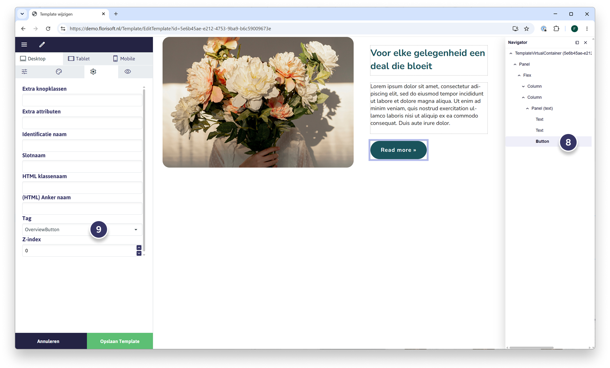
 |
| **6** | In dit voorbeeld laten we zien waar je de bovenstaande gegevens kunt instellen in de [Blogpagina](#blogpagina)-instellingen. Onder het tabblad **Geavanceerd** vind je een veld waarin je een [afbeelding](#media) kunt uploaden (10). De ingestelde Tag zorgt ervoor dat deze afbeelding automatisch wordt weergegeven in het [Blog](#blog)-overzicht. De pagina-URL wordt automatisch ingevuld bij het aanmaken van de [Blogpagina](#blogpagina).

<b>Klik hier voor de voorbeeldafbeelding</b>
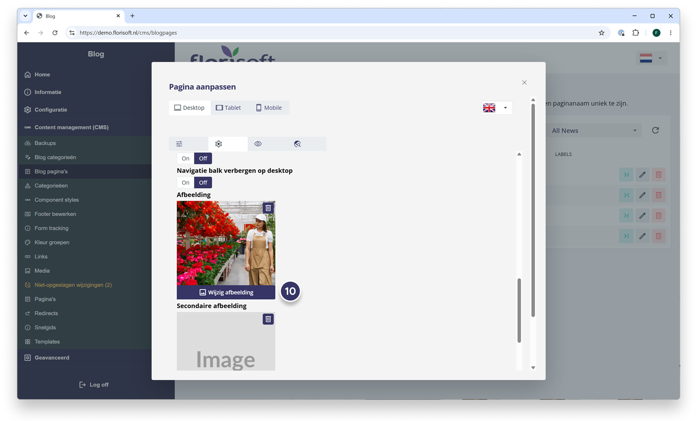
 |
| **7** | Vul vervolgens de **Omschrijving** in (11). Deze omschrijving wordt door middel van de ingestelde Tag automatisch gekoppeld aan het [Tekst](#text)-component in het [Blog](#blog)-overzicht.

<b>Klik hier voor de voorbeeldafbeelding</b>
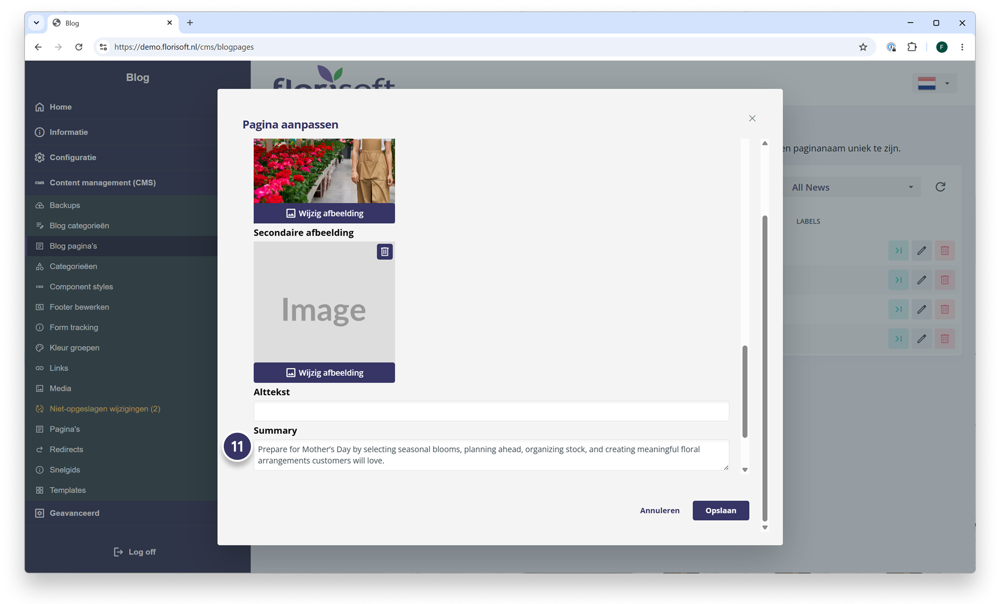
 |
| **8** | In het [Blog](#blog)-component (12) wordt het [Template](#templates) nu automatisch gevuld met de gegevens uit de [Blogpagina](#blogpagina)-instellingen. Dit gebeurt op basis van de ingestelde Tags. In het overzicht worden de [Afbeelding](#media) (13), [Titel](#text) (14), [Omschrijving](#text) (15) en [Button](#button) (16) weergegeven.

<b>Klik hier voor de voorbeeldafbeelding</b>
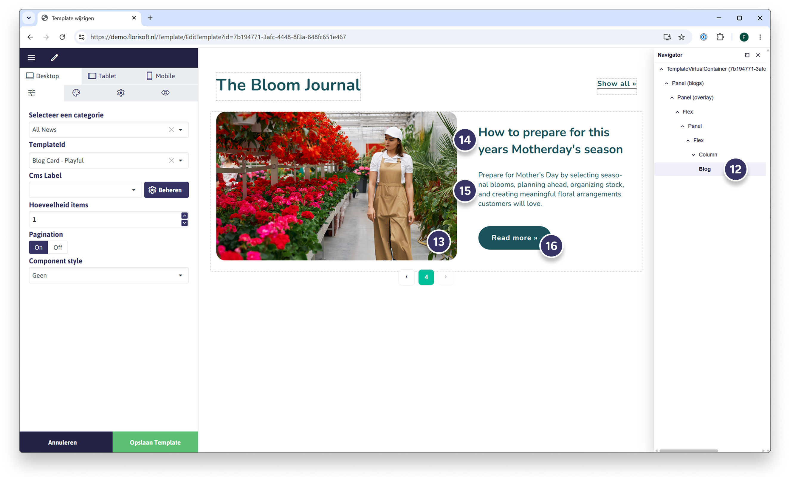
 |

---

#### Z-index

Met de optie **Z-index** bepaal je de stapelvolgorde van [componenten](#componenten) die elkaar overlappen. Een component met een hogere **z-index** wordt boven een component met een lagere **z-index** weergegeven.

Je kunt de z-index maximaal **3 lagen omhoog** of **3 lagen omlaag** aanpassen ten opzichte van de standaardpositie. Hiermee kun je eenvoudig bepalen welk component bovenop een ander component wordt weergegeven wanneer componenten elkaar overlappen.

---

### Zichtbaarheid

Met de instellingen voor **Zichtbaarheid** kun je pagina's dynamisch opbouwen door componenten tijdelijk wel of niet zichtbaar te maken voor specifieke groepen debiteuren, landen, CMS-zones, apparaten of binnen een bepaalde periode.

#### Content verbergen

Verberg [componenten](#componenten) tijdelijk voor een specifiek land, een [CMS-zone](#cms-zone) of gedurende een bepaalde periode.

| Stap | Uitleg |
|:--|:--|
| **1** | In dit voorbeeld hebben we een [Panel](#panel)-component geselecteerd (1). Via het tabblad **Zichtbaarheid** (2) kun je onder **Content verbergen** (3) de volgende opties instellen:  **Taal Zone Selectie** (4): Selecteer een land waarvoor het geselecteerde component niet zichtbaar mag zijn.  **Zone Selectie** (5): Selecteer een [CMS-zone](#cms-zone) waarvoor het geselecteerde component niet zichtbaar mag zijn.  **Geldig vanaf** (6): Stel de datum in vanaf wanneer het geselecteerde component niet meer wordt weergegeven.  **Geldig tot** (7): Stel de datum in tot wanneer het geselecteerde component niet wordt weergegeven.  **Jaarlijks herhalen** (8): Activeer deze optie om de ingestelde periode jaarlijks automatisch te herhalen.

<b>Klik hier voor de voorbeeldafbeelding</b>
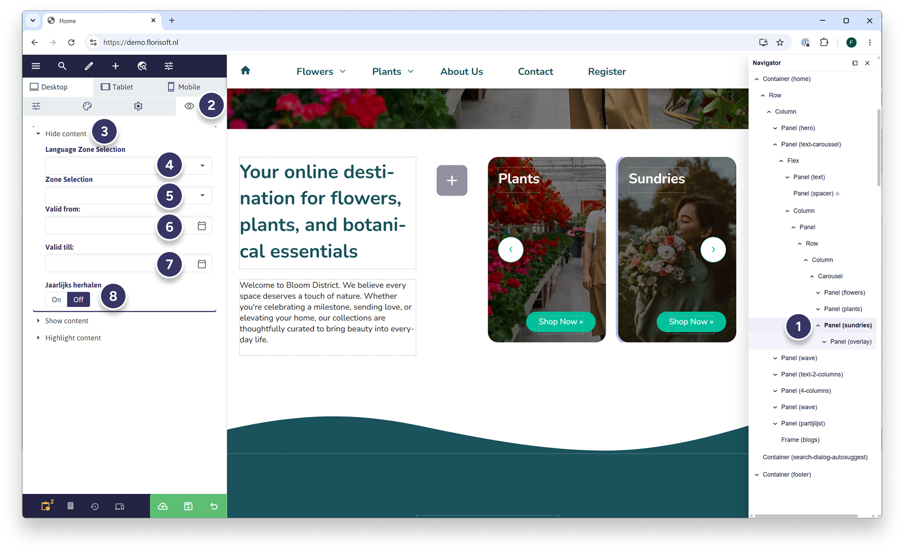
 |

---

#### Content tonen

Toon [componenten](#componenten) tijdelijk voor een specifiek land, een [CMS-zone](#cms-zone) of gedurende een bepaalde periode.

| Stap | Uitleg |
|:--|:--|
| **1** | In dit voorbeeld hebben we een [Panel](#panel)-component geselecteerd (1). Via het tabblad **Zichtbaarheid** (2) kun je onder **Content tonen** (3) de volgende opties instellen:  **Taal Zone Selectie** (4): Selecteer een land waarvoor het geselecteerde component zichtbaar mag zijn.  **Zone Selectie** (5): Selecteer een [CMS-zone](#cms-zone) waarvoor het geselecteerde component zichtbaar mag zijn.  **Geldig vanaf** (6): Stel de datum in vanaf wanneer het geselecteerde component wordt weergegeven.  **Geldig tot** (7): Stel de datum in tot wanneer het geselecteerde component wordt weergegeven.  **Zichtbaarheidstype** (8): Bepaal op welke apparaten het geselecteerde component zichtbaar mag zijn.  **Jaarlijks herhalen** (9): Activeer deze optie om de ingestelde periode jaarlijks automatisch te herhalen.

<b>Klik hier voor de voorbeeldafbeelding</b>
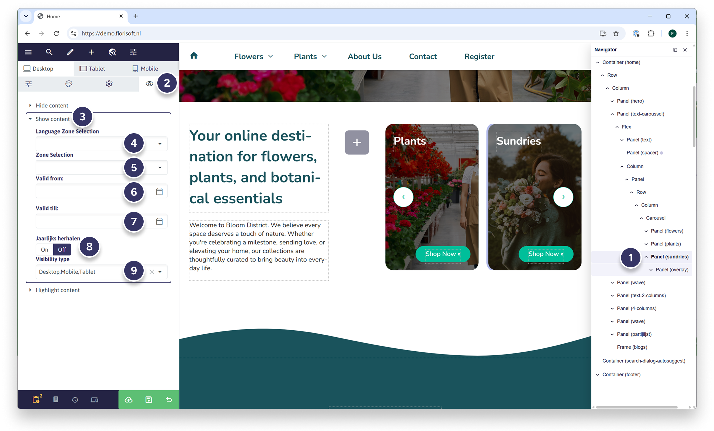
 |

---

#### Content uitlichten

Met **Content uitlichten** kun je [componenten](#componenten) zichtbaar maken voor specifieke groepen debiteuren op basis van de beschikbare voorraad of bestellijsten.

| Stap | Uitleg |
|:--|:--|
| **1** | In dit voorbeeld hebben we een [Panel](#panel)-component geselecteerd (1). Via het tabblad **Zichtbaarheid** (2) kun je onder **Content uitlichten** (3) de volgende opties instellen:  **Tonen voor** (4): Selecteer welke groep het geselecteerde component mag zien. Je hebt de volgende opties: - **Iedereen**: iedereen kan het component zien. - **Debiteur**: alleen ingelogde debiteuren kunnen het component zien. - **Anoniem**: alleen niet-ingelogde bezoekers kunnen het component zien. - **Niet tonen**: het component wordt niet weergegeven.  **Tonen voor Voorraden/Bestellijsten (;-gescheiden)** (5): Vul één of meerdere voorraadcodes in om het component alleen zichtbaar te maken voor debiteuren die toegang hebben tot de betreffende voorraad of bestellijst.

<b>Klik hier voor de voorbeeldafbeelding</b>

 |
| **2** | In dit voorbeeld bezoeken we een bloemenvoorraad (6). Kopieer de code van de webshopvoorraad uit de URL van de webbrowser. Wanneer je deze code invoert in het veld **Tonen voor Voorraden/Bestellijsten (;-gescheiden)**, wordt het component alleen zichtbaar voor debiteuren die toegang hebben tot deze webshopvoorraad.

<b>Klik hier voor de voorbeeldafbeelding</b>
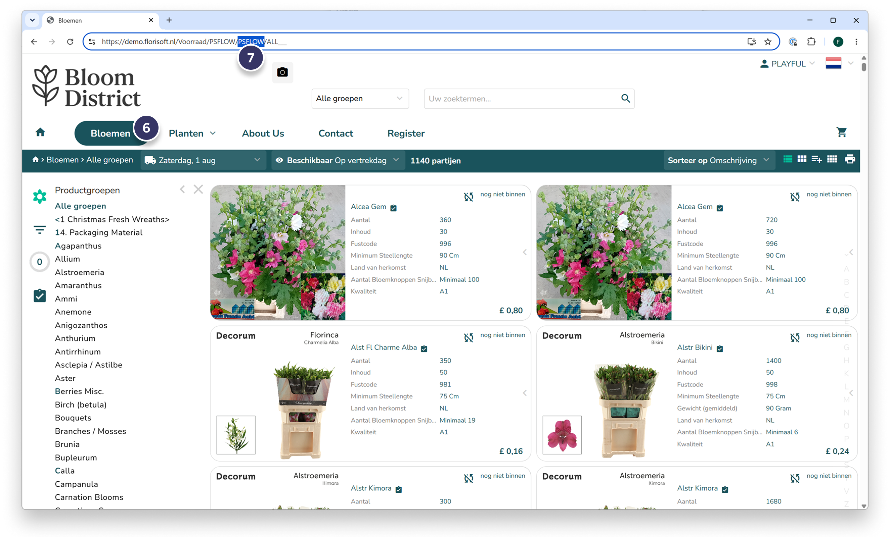
 |

---

## Componenten

### Basis

Basis-componenten vormen de fundering van je [pagina](#pagina). Met deze componenten bouw je de basisstructuur waarop je de rest van je pagina kunt opbouwen.

#### Row/Column

Een CMS-pagina maakt gebruik van **Rows** en **Columns** om content op verschillende apparaten, zoals pc's, laptops, tablets en smartphones, correct uit te lijnen.

In dit hoofdstuk wordt uitgelegd hoe je een **Row** aanmaakt en configureert. Elk CMS-element moet zich binnen een **Column** bevinden en elke Column bevindt zich binnen een Row. Een CMS-pagina bestaat hierdoor in feite uit een raster, vergelijkbaar met een spreadsheetprogramma zoals Microsoft Excel.

*Volg onderstaande stappen:*

| Stap | Uitleg |
|:--|:--|
| **1** | Log in op de webshop met een beheerdersaccount. |
| **2** | Activeer de **Management**-omgeving van de webshop door op het gebruikersicoon (1) te klikken. Er wordt een dropdownmenu geopend. Klik vervolgens op **Management** (2).

<b>Klik hier voor de voorbeeldafbeelding</b>

 |
| **3** | Schakel onderaan het scherm de **CMS Editor** (3) in. Je kunt nu beginnen met het bewerken van de pagina.

<b>Klik hier voor de voorbeeldafbeelding</b>

 |
| **4** | Klik op het **+**-icoon (4) of klik met de rechtermuisknop op het bovenste element in de [Navigator](#navigator) (5) om de **Componentendialoog** te openen. Via de **Template**-knop (6) kun je de Componentendialoog ook openen. In dat geval wordt de Template-categorie direct geopend.

<b>Klik hier voor de voorbeeldafbeelding</b>

 |
| **5** | Gebruik de zoekfunctie (7) om te zoeken naar **Row**. Klik vervolgens op het **+**-icoon onder het item **Row** (8).

<b>Klik hier voor de voorbeeldafbeelding</b>

 |
| **6** | De **Row** wordt direct aan de pagina toegevoegd. Je krijgt vervolgens de mogelijkheid om één of meerdere Columns toe te voegen. In dit voorbeeld kiezen we voor een indeling met drie Columns naast elkaar (9).

<b>Klik hier voor de voorbeeldafbeelding</b>

 |
| **7** | Selecteer een **Column** via de [Navigator](#navigator) (10). In het scherm met de kolominstellingen kun je onder het tabblad **Properties** (11) de uitlijning van CMS-elementen voor verschillende schermformaten instellen.  De schuifregelaars bepalen hoeveel ruimte een CMS-element inneemt op apparaten met verschillende schermgroottes, zoals pc's/laptops, tablets en smartphones.  De totale breedte van een scherm bestaat uit maximaal **12 virtuele kolommen**. Een element kan hierdoor minimaal één en maximaal twaalf kolommen breed zijn. Dit geldt voor alle ondersteunde apparaten.  De bovenste schuifregelaar is voor **pc's en laptops**, de middelste voor **tablets** en de onderste voor **smartphones**.

<b>Klik hier voor de voorbeeldafbeelding</b>

 |
| **8** | Open het tabblad **[Styling](#3-styling)** (12). Styling is optioneel. Je kunt hier onder andere de volgende instellingen aanpassen:  **Achtergrondkleur:** Kies via het dropdownmenu **Background** (13) een [achtergrondkleur](#color-picker).  **[Hoogte/Breedte](#hoogtebreedte):** Kies bij **Height** (14) voor **Auto** of stel een vaste hoogte in. De beschikbare eenheden zijn onder andere `px`, `rem` en `%`. Het wordt aanbevolen om **Auto** te gebruiken. De kolom wordt dan automatisch zo hoog als nodig is voor de inhoud.  **[Margin](#marginpadding):** Stel de marge (witruimte) rondom de kolom in (15). Je kunt één waarde instellen voor alle zijden of de waarden per zijde afzonderlijk bepalen. Ondersteunde eenheden zijn onder andere `px`, `rem`, `%`, `mm` en `cm`. Daarnaast kun je waarden zoals `auto` en `unset` gebruiken.  **[Padding](#marginpadding):** Bepaal de ruimte aan de binnenkant van de kolom (16). Deze instelling werkt volgens hetzelfde principe als Margin.  **[Overflow](#overflow):** Bepaal of content die buiten de grenzen van de kolom valt zichtbaar blijft (17). Standaard staat deze instelling op **Visible**.

<b>Klik hier voor de voorbeeldafbeelding</b>

 |
| **9** | Open het tabblad **[Advanced](#4-geavanceerd)** (18). Het tabblad **Advanced** biedt de mogelijkheid om extra classes, ID's en andere instellingen aan een component toe te voegen. Onder **[Identificatie naam](#identificatienaam)** (19) kun je bijvoorbeeld een eigen naam aan het component geven. Hierdoor ontstaat er meer structuur en overzicht in de [Navigator](#navigator) (20).

<b>Klik hier voor de voorbeeldafbeelding</b>

 |
| **10** | Open het tabblad **[Visibility](#5-zichtbaarheid)** (21). Het tabblad **Visibility** werkt op dezelfde manier als bij het aanmaken van pagina's en categorieën. Raadpleeg het hoofdstuk [Zichtbaarheid](#zichtbaarheid) voor meer informatie over de beschikbare instellingen.  Klik na het configureren van de gewenste instellingen op **Save** (22) om de kolom in het CMS op te slaan. Klik vervolgens op **Publiceren** (23) om de wijzigingen live te zetten.  **Je kunt de instellingen op een later moment altijd nog aanpassen.**

<b>Klik hier voor de voorbeeldafbeelding</b>

 |

---

#### Panel

Het **Panel**-component is een veelzijdig basiscomponent met uitgebreide [stylingopties](#3-styling) waarmee je jouw pagina visueel kunt vormgeven. Je kunt onder andere een achtergrondkleur, afbeelding of sfeervideo zonder geluid toevoegen. Vervolgens kun je het Panel vullen met meerdere componenten. Daarnaast kun je het volledige Panel klikbaar maken door een bestemmings-URL toe te voegen.

| Stap | Uitleg |
|:--|:--|
| **1** | In dit voorbeeld hebben we een [Column](#rowcolumn) (1) geselecteerd waaraan we het **Panel**-component toevoegen (2).

<b>Klik hier voor de voorbeeldafbeelding</b>
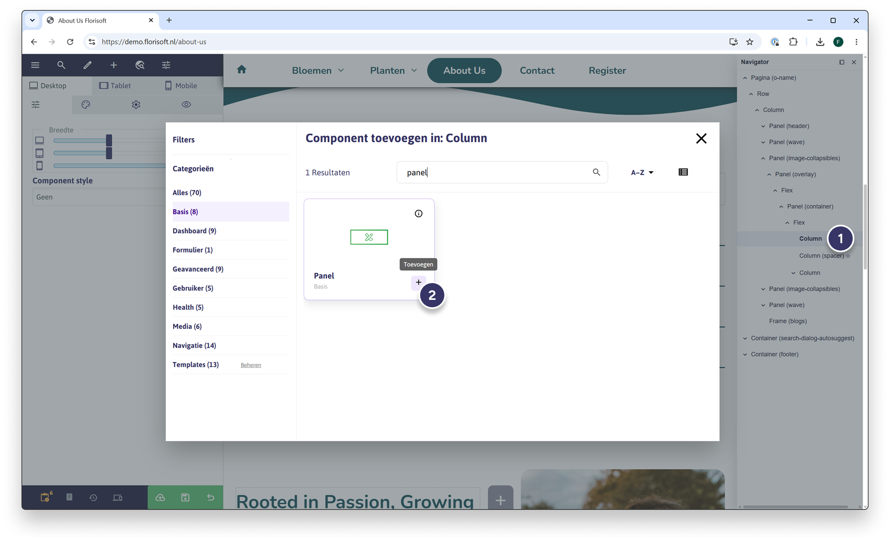
 |
| **2** | Het Panel is nu zichtbaar in de [Navigator](#navigator) (3) en in de [Editor](#editor) (4). Via de [Algemene instellingen](#algemene-instellingen) (5) vind je verschillende opties om het Panel te configureren, waaronder [Vertalingen](#vertalingen) (6).

<b>Klik hier voor de voorbeeldafbeelding</b>
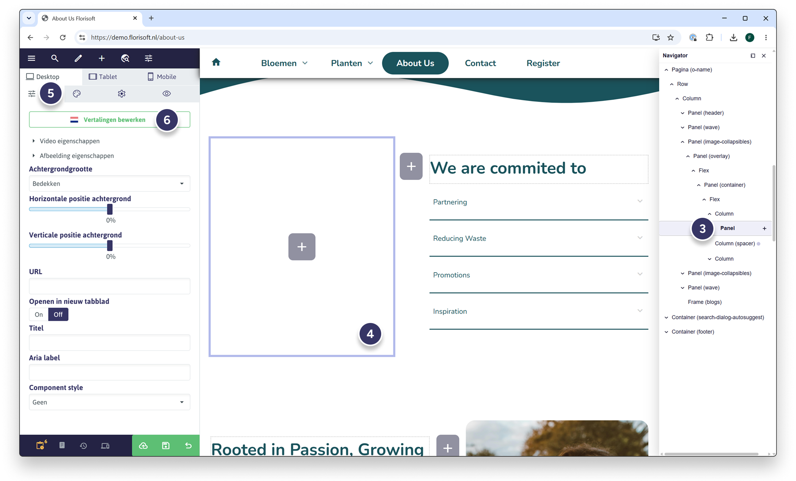
 |
| **3** | Onder **Video-eigenschappen** (7) vind je verschillende opties voor het toevoegen van een video. Via **Voorvertoningsafbeelding** (8) kun je een afbeelding instellen die wordt weergegeven voordat de video is geladen. Via **Video** (9) kun je een eigen videobestand uploaden. Staat de video op een andere server, dan kun je de URL invoeren bij **Video URL** (10). Met de optie **Lazy load** (11) bepaal je of de video pas wordt geladen wanneer deze in beeld komt tijdens het scrollen.

<b>Klik hier voor de voorbeeldafbeelding</b>
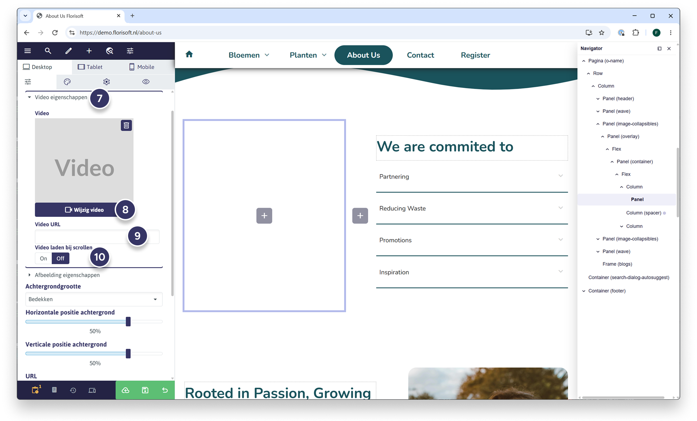
 |
| **4** | Onder **Afbeeldingseigenschappen** (12) vind je verschillende opties voor het toevoegen en configureren van een afbeelding (13). Activeer **Background Parallax** (14) voor een parallax-effect wanneer je langs de afbeelding scrollt. Dit is met name geschikt voor grotere afbeeldingen. Met **Achtergrondanimatie** (15) kun je een brede afbeelding horizontaal laten bewegen. Vervolgens kun je de snelheid van deze animatie instellen (16). Via **Alt-tekst** (17) kun je een beschrijving aan de afbeelding toevoegen. Dit draagt bij aan een betere [SEO](#seo) en maakt de afbeelding toegankelijker.

<b>Klik hier voor de voorbeeldafbeelding</b>
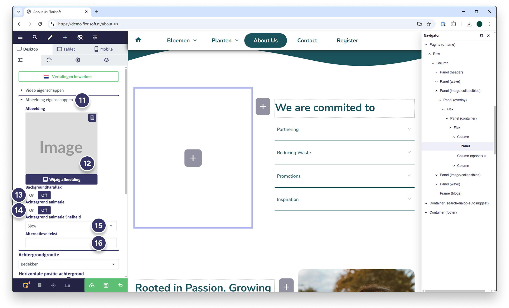
 |
| **5** | Nadat je een afbeelding hebt toegevoegd (18), kun je bepalen hoe deze wordt weergegeven. Bij **Achtergrondgrootte** (19) kun je kiezen uit **Bedekken** (de afbeelding bedekt het volledige Panel), **Automatisch** (de afbeelding wordt in de oorspronkelijke grootte weergegeven) of **Passend** (de volledige afbeelding wordt zichtbaar gemaakt). Vervolgens kun je met de sliders de **Horizontale** (20) en **Verticale** (21) positie van de afbeelding of video bepalen. Wanneer beide waarden op 50% staan, wordt de afbeelding of video exact in het midden van het Panel geplaatst.

<b>Klik hier voor de voorbeeldafbeelding</b>
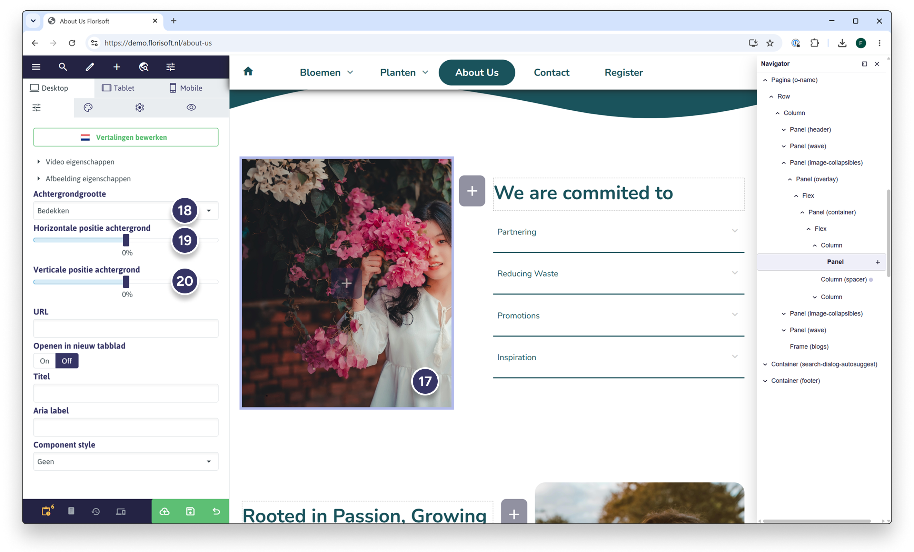
 |
| **6** | Nadat je de afbeelding hebt gepositioneerd, kun je eventueel een URL invoeren (22). Hierdoor wordt het volledige Panel klikbaar en kun je het Panel bijvoorbeeld gebruiken als een volledig aanpasbare knop of banner. **Let op:** je hoeft in dit veld niet het volledige domein in te voeren. Alleen het pad is voldoende. Met de optie (23) kun je bepalen of de URL in een nieuw browsertabblad wordt geopend. Voeg bij **Titel** (24) een beschrijving toe aan het Panel. Deze titel wordt weergegeven wanneer je met de muis over het Panel beweegt. Via **Aria-label** (25) kun je een beschrijving van het Panel invoeren die door ondersteunende technologieën, zoals schermlezers, kan worden voorgelezen. Raadpleeg [Component Styles](#component-styles) (26) voor meer informatie over Component Styles. Raadpleeg ook [Styling](#3-styling) (27) voor meer informatie over de beschikbare stylingopties.

<b>Klik hier voor de voorbeeldafbeelding</b>
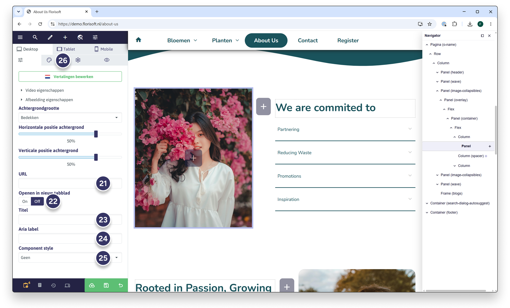
 |
| **7** | Raadpleeg [Geavanceerd](#4-geavanceerd) (28) voor alle beschikbare geavanceerde opties. Het Panel beschikt daarnaast over een specifieke optie waarmee je het component geleidelijk kunt laten verschijnen op de pagina. Dit **fade-in-effect** geeft je pagina een moderne en speelse uitstraling. Je kunt deze optie eenvoudig activeren met de aan/uit-schakelaar (29).

<b>Klik hier voor de voorbeeldafbeelding</b>
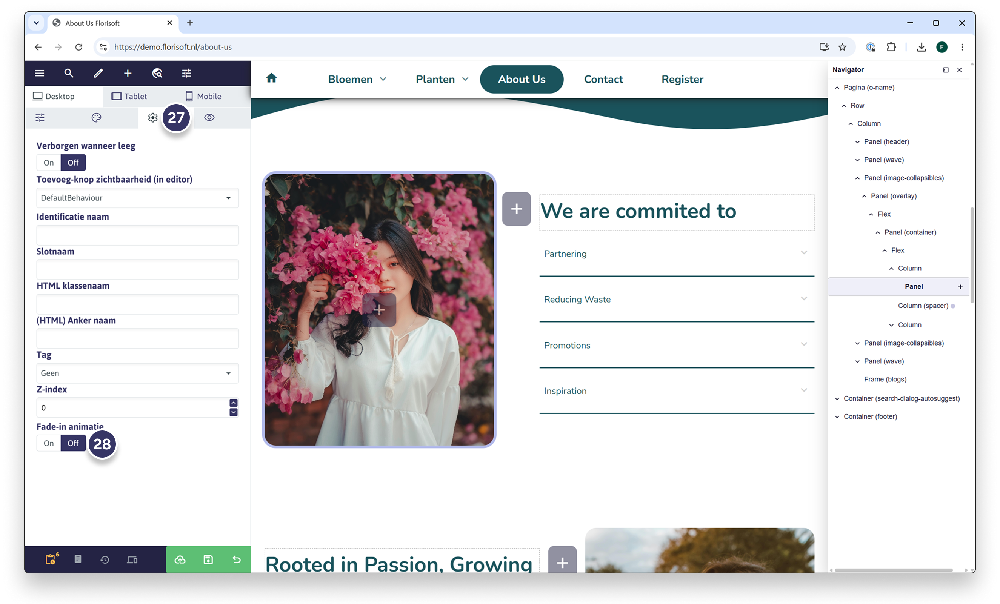
 |

---

#### Flex

Met het **Flex**-component kun je inhoud flexibel positioneren en uitlijnen. Voeg één of meerdere [componenten](#componenten) toe en bepaal vervolgens hoe deze horizontaal of verticaal worden weergegeven. Daarnaast kun je de uitlijning, tussenruimte en het gedrag op verschillende schermformaten instellen. Het Flex-component vormt hiermee de basis voor een dynamische webpagina.

| Stap | Uitleg |
|:--|:--|
| **1** | In dit voorbeeld voegen we in de [Pagina](#pagina) (1) een **Flex**-component (2) toe.

<b>Klik hier voor de voorbeeldafbeelding</b>
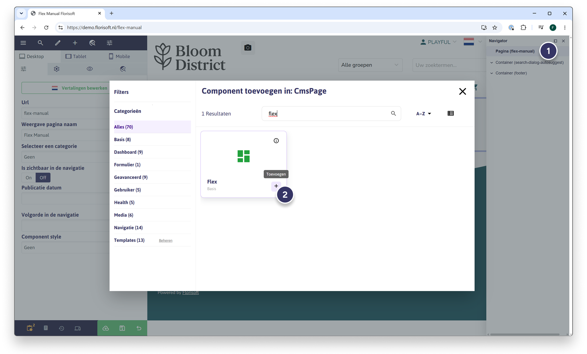
 |
| **2** | Het **Flex**-component is nu zichtbaar in de [Navigator](#navigator) (3) en de [Editor](#editor) (4). Via het tabblad **[Algemene instellingen](#algemene-instellingen)** (5) bepaal je hoe de elementen binnen het Flex-component worden geordend. Voordat we deze instellingen aanpassen, voegen we eerst enkele elementen toe.

<b>Klik hier voor de voorbeeldafbeelding</b>
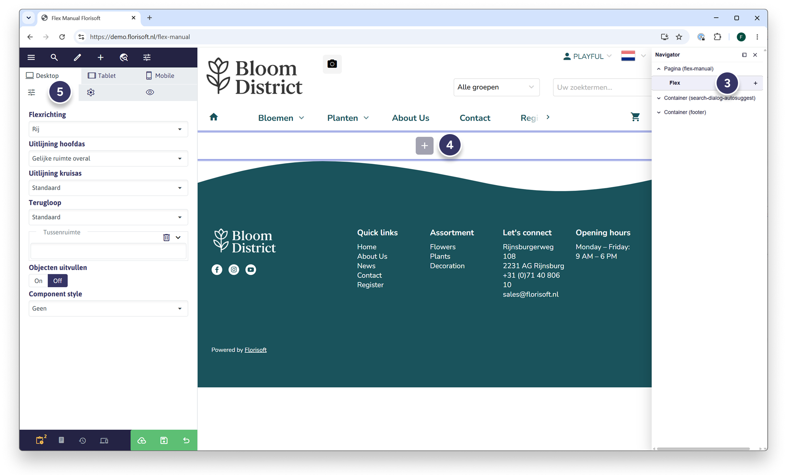
 |
| **3** | We hebben drie [Kolommen](#rowcolumn) (6, 7 en 8) toegevoegd aan het Flex-component. Iedere kolom heeft een breedte van twee kolommen gekregen en een eigen [kleur](#color-picker).

<b>Klik hier voor de voorbeeldafbeelding</b>
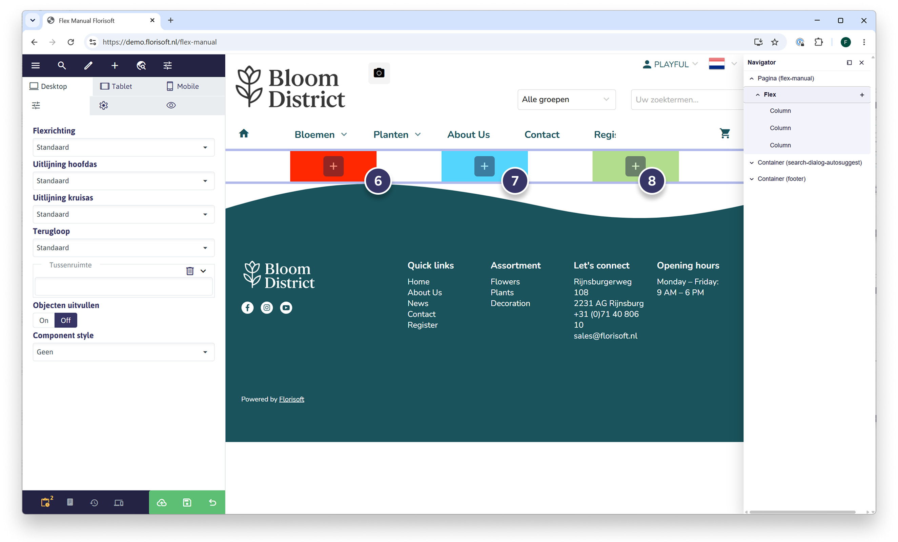
 |
| **4** | Via het tabblad **[Algemene instellingen](#algemene-instellingen)** stel je de **Flexrichting** in. In dit voorbeeld komen de [Kolommen](#rowcolumn) onder elkaar te staan wanneer de Flexrichting wordt ingesteld op **Kolom** (9).

<b>Klik hier voor de voorbeeldafbeelding</b>
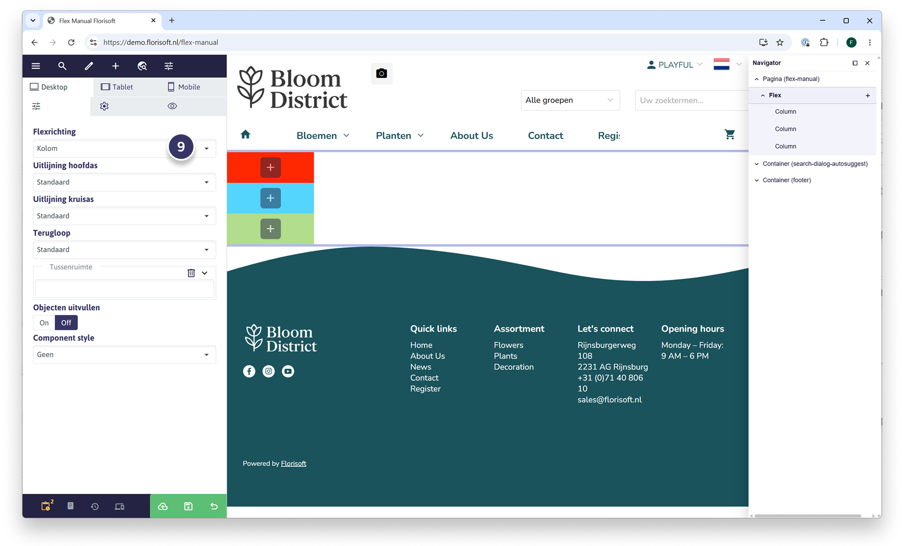
  **Omgekeerde kolom** (10): plaatst de Kolommen in omgekeerde volgorde, van onder naar boven.

<b>Klik hier voor de voorbeeldafbeelding</b>
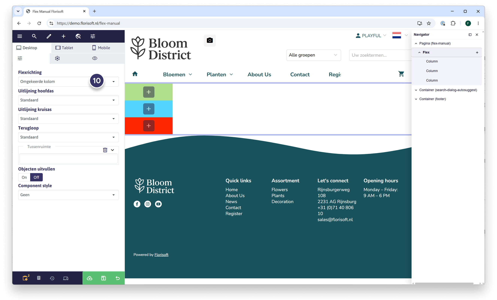
  **Rij** (11): plaatst de Kolommen naast elkaar van links naar rechts.

<b>Klik hier voor de voorbeeldafbeelding</b>
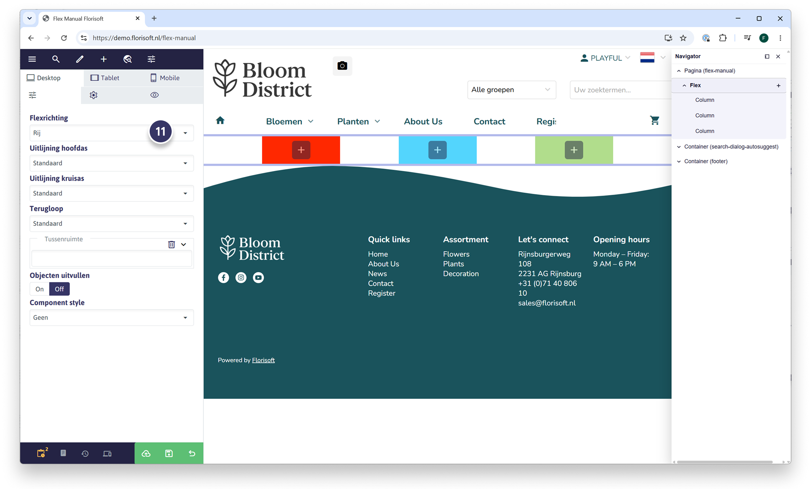
  **Omgekeerde rij** (12): plaatst de Kolommen naast elkaar van rechts naar links.

<b>Klik hier voor de voorbeeldafbeelding</b>
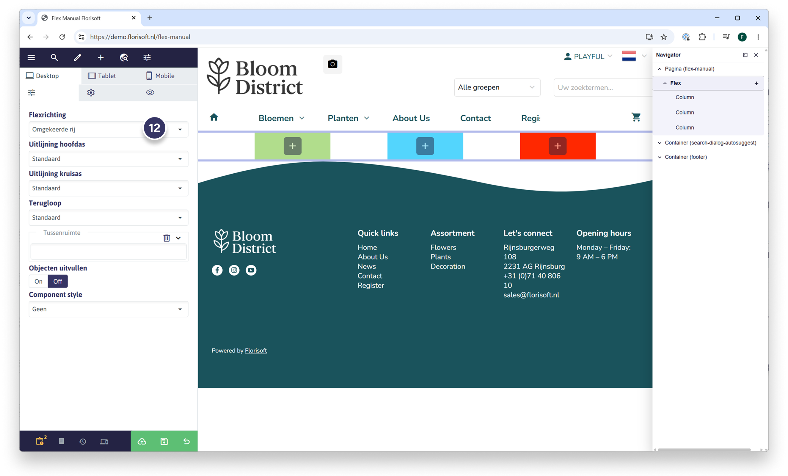
 |
| **5** | We laten de **Flexrichting** in dit voorbeeld ingesteld op **Rij**. Let op: wanneer de Flexrichting op **Kolom** staat, reageren de hoofd- en kruisas tegenovergesteld. Via **Uitlijning hoofdas** (horizontale uitlijning) bepaal je hoe de [Kolommen](#rowcolumn) horizontaal worden geplaatst.  **Begin** (13): lijnt de Kolommen links uit.

<b>Klik hier voor de voorbeeldafbeelding</b>
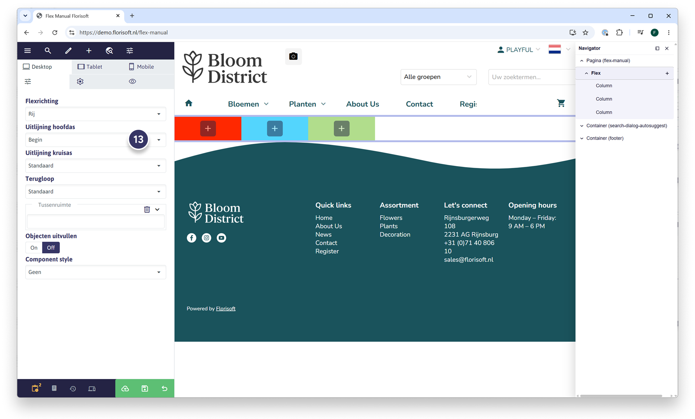
  **Eind** (14): lijnt de Kolommen rechts uit.

<b>Klik hier voor de voorbeeldafbeelding</b>
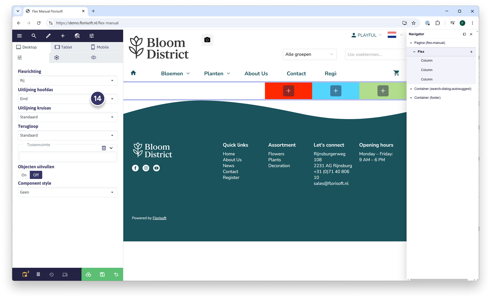
  **Centreren** (15): plaatst de Kolommen in het midden.

<b>Klik hier voor de voorbeeldafbeelding</b>
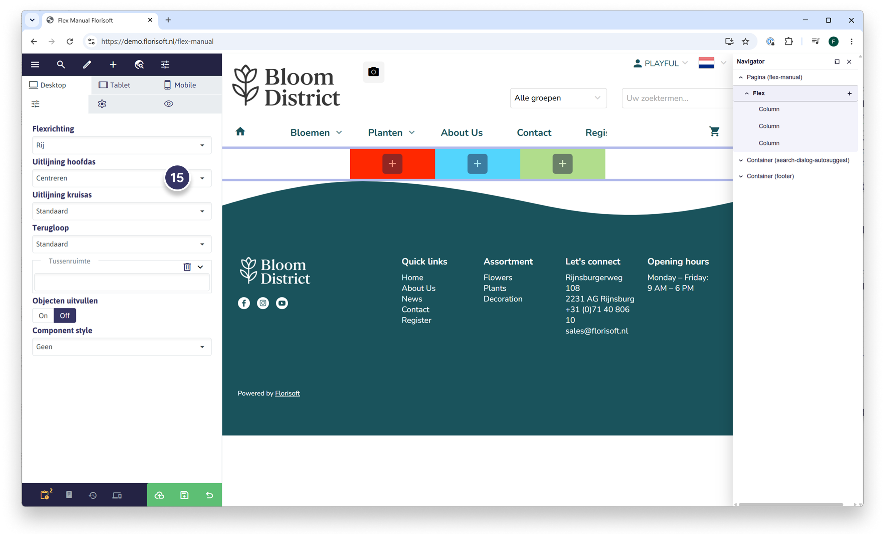
  **Gelijke ruimte tussen** (16): verdeelt de beschikbare ruimte tussen de Kolommen.

<b>Klik hier voor de voorbeeldafbeelding</b>
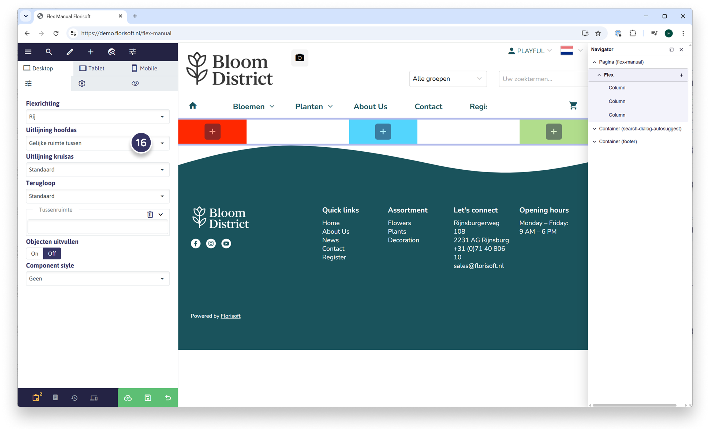
  **Gelijke ruimte rondom** (17): verdeelt de beschikbare ruimte rondom de Kolommen.

<b>Klik hier voor de voorbeeldafbeelding</b>
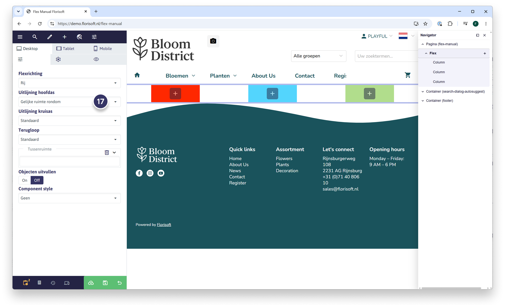
  **Gelijke ruimte overal** (18): geeft iedere Kolom exact dezelfde ruimte rondom.

<b>Klik hier voor de voorbeeldafbeelding</b>
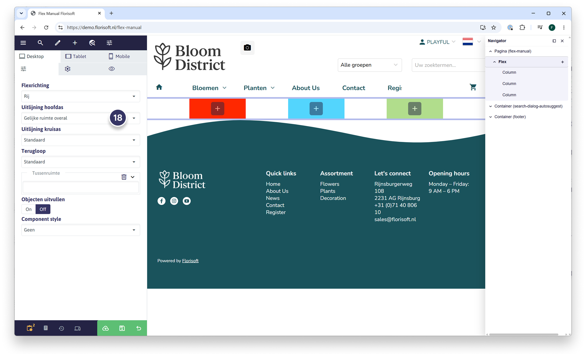
  **Begin (taalgevoelig)** en **Eind (taalgevoelig)** werken hetzelfde als **Begin** en **Eind**, maar houden rekening met de leesrichting van verschillende talen. |
| **6** | Om de volgende opties duidelijker te maken, geven we één van de drie [Kolommen](#rowcolumn) (19) een [hoogte](#hoogtebreedte) van **300px**.

<b>Klik hier voor de voorbeeldafbeelding</b>
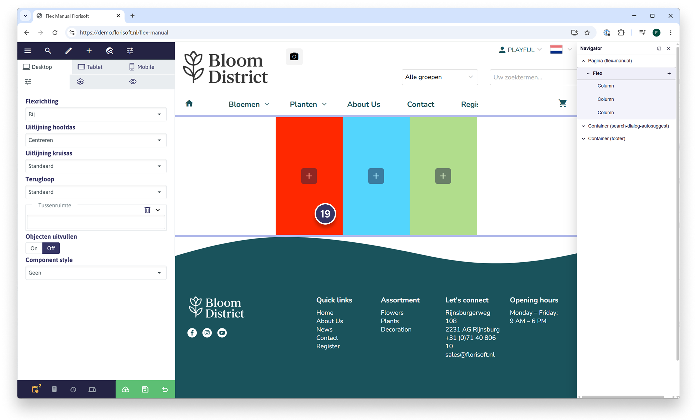
 |
| **7** | Via **Uitlijning kruisas** (verticale uitlijning) bepaal je hoe de Kolommen verticaal ten opzichte van elkaar worden uitgelijnd.  **Uitrekken** (20): alle Kolommen krijgen automatisch de hoogte van de hoogste Kolom.

<b>Klik hier voor de voorbeeldafbeelding</b>
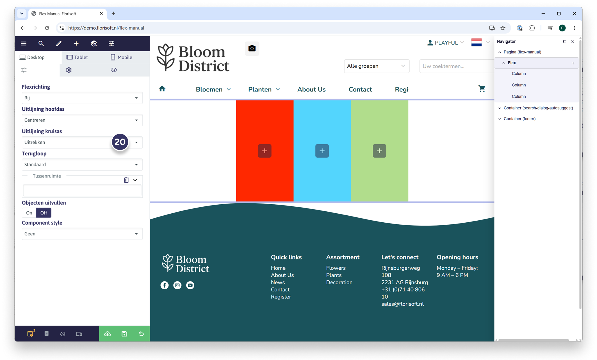
  **Begin** (21): lijnt alle Kolommen uit aan de bovenzijde.

<b>Klik hier voor de voorbeeldafbeelding</b>
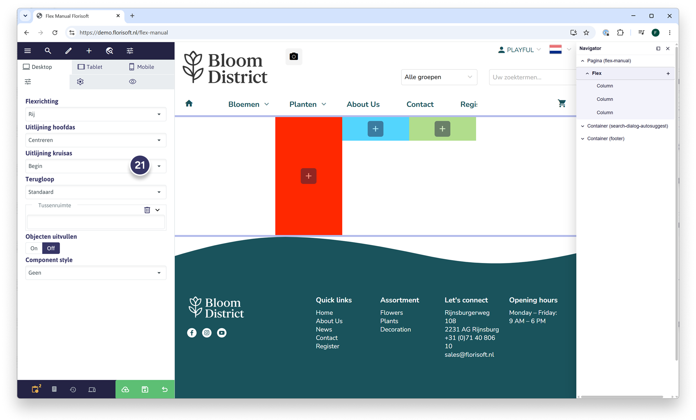
  **Eind** (22): lijnt alle Kolommen uit aan de onderzijde.

<b>Klik hier voor de voorbeeldafbeelding</b>
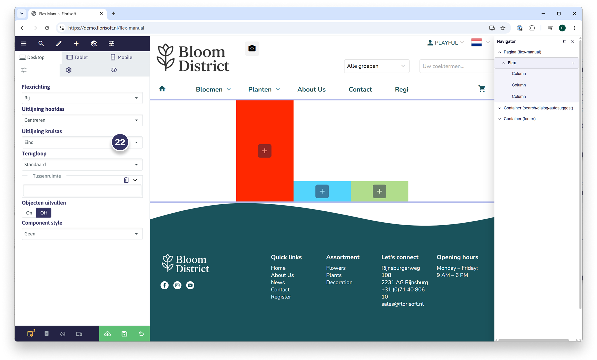
  **Centreren** (23): centreert alle Kolommen verticaal.

<b>Klik hier voor de voorbeeldafbeelding</b>
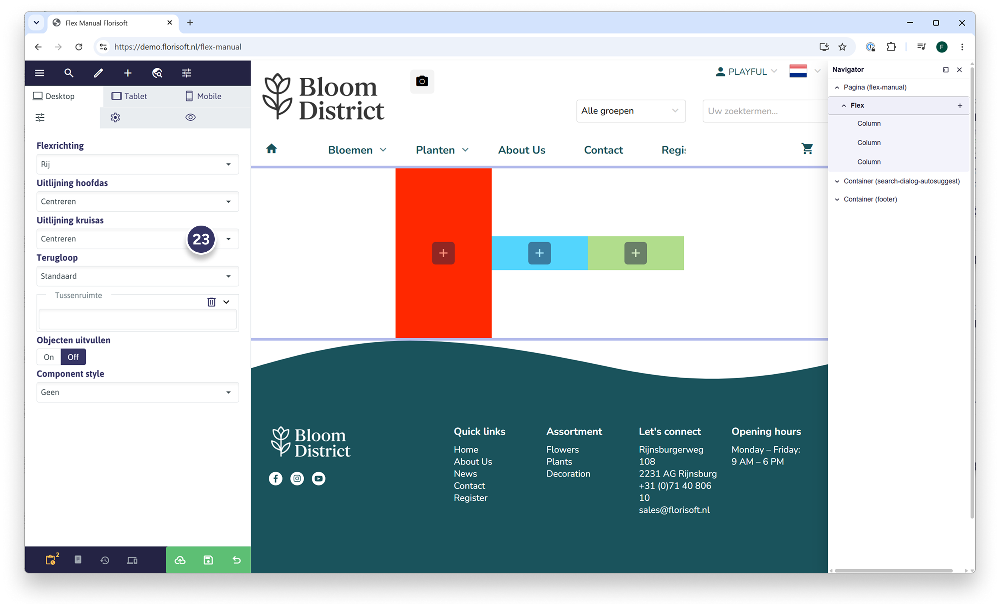
  **Begin (taalgevoelig)** en **Eind (taalgevoelig)** werken hetzelfde als **Begin** en **Eind**, maar houden rekening met de leesrichting van verschillende talen. |
| **8** | Via **Terugloop** (24) bepaal je hoe de elementen reageren wanneer de beschikbare ruimte kleiner wordt.  **Afbreken** zorgt ervoor dat elementen automatisch naar een volgende regel worden verplaatst.  **Niet afbreken** zorgt ervoor dat alle elementen naast elkaar blijven staan, ook wanneer de beschikbare ruimte beperkt is.  Met **Tussenruimte** (25) bepaal je de afstand tussen de elementen. De volgende eenheden worden ondersteund: `px`, `em`, `rem`, `%`, `in`, `cm`, `mm`, `pt`, `pc`, `vh` en `vw`.

<b>Klik hier voor de voorbeeldafbeelding</b>
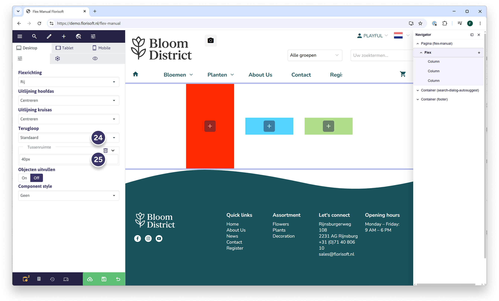
 |
| **9** | Klap de aanvullende opties uit (26) om de horizontale en verticale tussenruimte afzonderlijk van elkaar in te stellen.

<b>Klik hier voor de voorbeeldafbeelding</b>

 |
| **10** | Activeer **Objecten uitvullen** (27) om alle elementen automatisch de beschikbare ruimte te laten vullen, ongeacht ingestelde [breedtes](#hoogtebreedte).

<b>Klik hier voor de voorbeeldafbeelding</b>
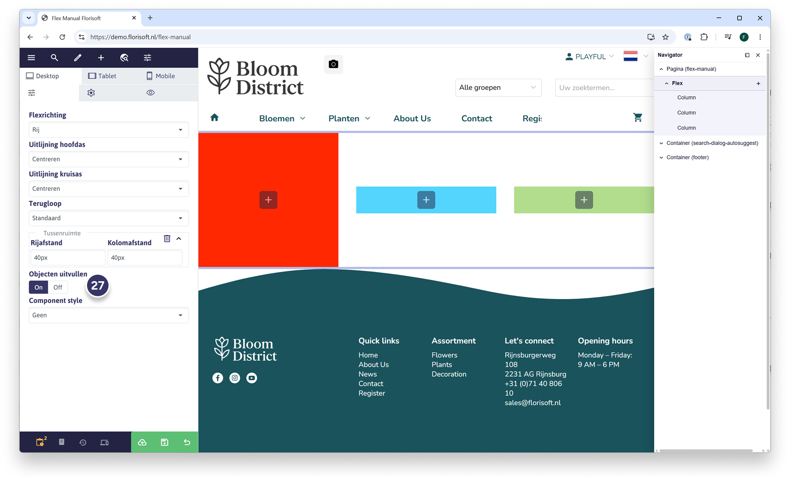
 |
| **11** | Via de [Geavanceerde instellingen](#4-geavanceerd) (28) kun je de optie **Hoogte ouder overnemen** (29) activeren. Hierdoor neemt het Flex-component automatisch de hoogte over van het bovenliggende component. Wanneer een [Panel](#panel) bijvoorbeeld een [hoogte](#hoogtebreedte) van **500px** heeft, krijgt het Flex-component binnen deze Panel automatisch dezelfde hoogte.

<b>Klik hier voor de voorbeeldafbeelding</b>

  Lees meer over de aanvullende instellingen in de tabbladen [Geavanceerd](#4-geavanceerd) en [Zichtbaarheid](#5-zichtbaarheid). |

---

#### Header

| Onderdeel | Beschrijving |
|---|---|
| Header | Deze beschrijving wordt aangevuld |

---

#### Text

Met het **Text**-component voeg je eenvoudig eigen teksten toe via de TinyMCE-editor. Hiermee kun je titels en alinea's toevoegen en de tekst opmaken met opties zoals vet, cursief, lettergrootte, uitlijning en meer. De tekstkleur kun je aanpassen via het tabblad [Styling](#3-styling) van het component. In de [Themaconfiguratie](#thema-configuratie) wordt standaard de kleur `primary-font-color` gebruikt.

Vertalingen kun je bewerken via de knop **[Vertalingen bewerken](#vertalingen)** onder het tabblad [Algemene instellingen](#algemene-instellingen).

| Stap | Uitleg |
|:--|:--|
| **1** | In dit voorbeeld hebben we een [Kolom](#rowcolumn) (1) geselecteerd waaraan we het **Text**-component (2) toevoegen.

<b>Klik hier voor de voorbeeldafbeelding</b>
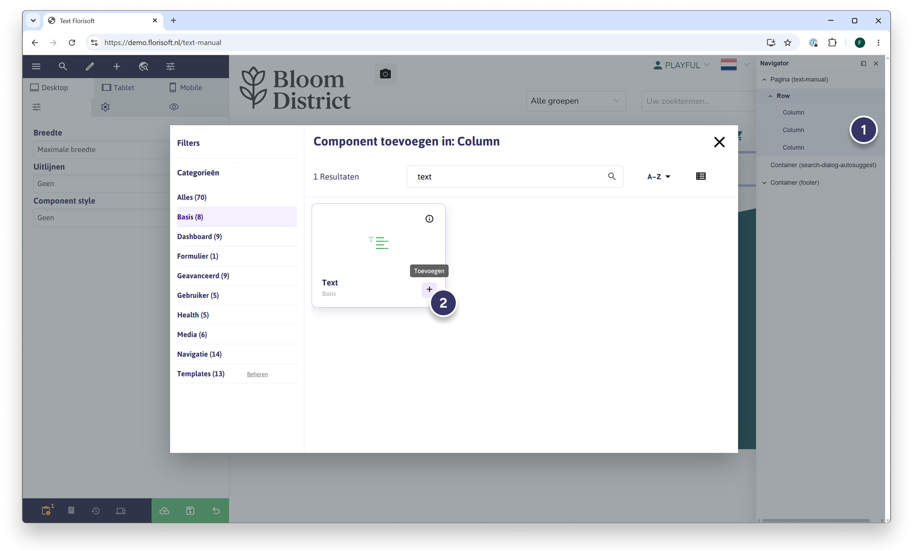
 |
| **2** | Het **Text**-component is nu zichtbaar in de [Navigator](#navigator) (3) en de [Editor](#editor) (4). De editor van het CMS-element wordt automatisch geopend voor het nieuwe tekstelement.  Via het tabblad [Algemene instellingen](#algemene-instellingen) (5) kun je de tekstinhoud toevoegen (6). Je kunt de inhoud in twee formaten invoeren: **TinyMCE** (7) en **Markdown** (8). Kies het formaat dat het beste bij je past. **Let op:** Markdown vereist meer technische kennis en biedt minder opmaakmogelijkheden dan TinyMCE. In deze handleiding gebruiken we TinyMCE.  Wil je Markdown gebruiken, dan kan een cheatsheet handig zijn. Deze vind je hier: [Markdown Guide - Cheat Sheet](https://www.markdownguide.org/cheat-sheet/).

<b>Klik hier voor de voorbeeldafbeelding</b>
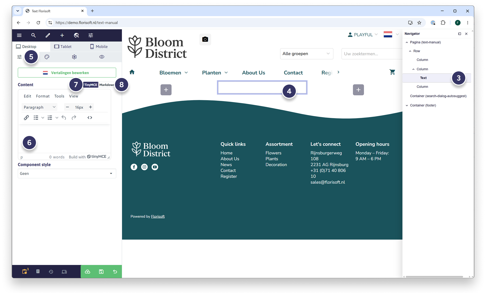
 |
| **3** | De TinyMCE-editor spreekt grotendeels voor zich. Het toevoegen van kopteksten kan in het begin echter wat verwarrend zijn. Om een koptekst toe te voegen, klik je op de dropdown **Paragraph** (9). Selecteer vervolgens **Headings** (10). Er verschijnt een extra dropdown met verschillende kopgroottes (11). Selecteer hier de gewenste kopgrootte.

<b>Klik hier voor de voorbeeldafbeelding</b>
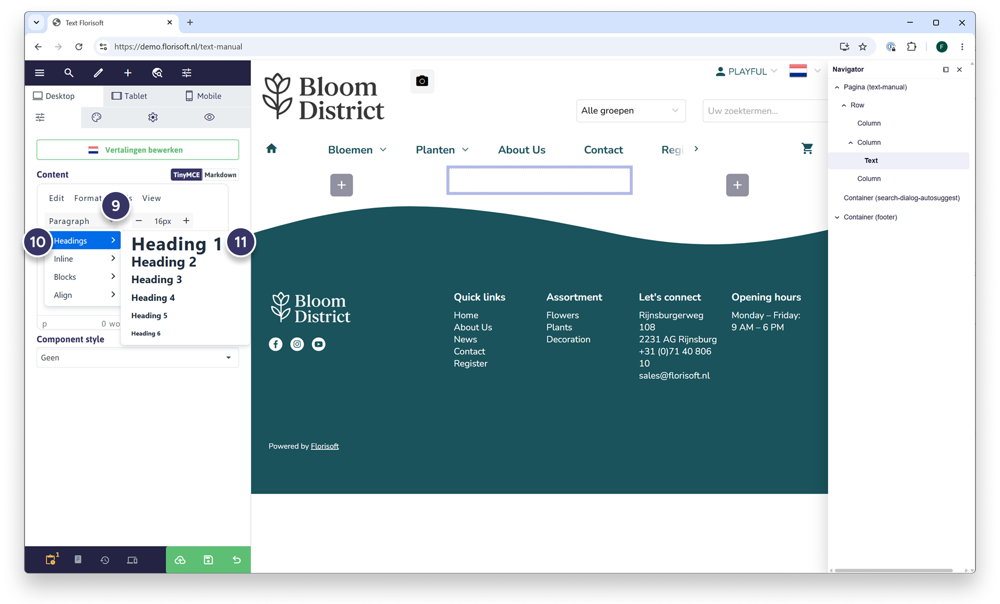
 |
| **4** | Lees meer over de aanvullende instellingen in de tabbladen [Styling](#3-styling), [Geavanceerd](#4-geavanceerd) en [Zichtbaarheid](#5-zichtbaarheid). |

---

#### Collapsible

| Onderdeel | Beschrijving |
|---|---|
| Collapsible | Deze beschrijving wordt aangevuld |

---

#### Bullet list/Bullet

| Onderdeel | Beschrijving |
|---|---|
| Bullet list | Deze beschrijving wordt aangevuld |

---

#### Spacer

| Onderdeel | Beschrijving |
|---|---|
| Spacer | Deze beschrijving wordt aangevuld |

---

### Media

#### Image

Upload een afbeelding via dit handige **Image**-component. Vervolgens kun je eventueel de [hoogte en breedte](#hoogtebreedte) instellen en afgeronde hoeken toevoegen. **Tip:** stel [Overflow](#overflow) in op `Hidden` voor een strak resultaat.

| Stap | Uitleg |
|:--|:--|
| **1** | In dit voorbeeld hebben we een [Kolom](#rowcolumn) (1) geselecteerd waaraan we het **Image**-component (2) toevoegen.

<b>Klik hier voor de voorbeeldafbeelding</b>
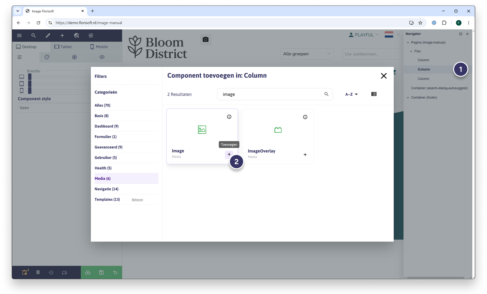
 |
| **2** | Het **Image**-component is nu zichtbaar in de [Navigator](#navigator) (3) en de [Editor](#editor) (4). Via het tabblad **[Algemene instellingen](#algemene-instellingen)** (5) kun je de volgende opties instellen:  **Afbeelding** (6): Upload een afbeelding door de [Media Bibliotheek](#media) te openen. In dit voorbeeld hebben we een afbeelding geüpload in het **Image**-component.  **Positie-eigenschappen** (7): Bepaal hoe de afbeelding wordt gepositioneerd. `IMG` toont de volledige afbeelding. `BackgroundCover` vult de beschikbare ruimte met de afbeelding. `BackgroundContain` toont de volledige afbeelding binnen de beschikbare ruimte.  **URL** (8): Vul een URL of paginapad in om het **Image**-component klikbaar te maken en naar een andere pagina te laten verwijzen. **Let op:** je hoeft in dit veld niet het volledige domein in te voeren.  **Link openen in nieuw tabblad** (9): Gebruik deze schakelaar om in te stellen of de link in een nieuw browsertabblad wordt geopend wanneer op het component wordt geklikt.  **Zoom** (10): Activeer deze optie om de afbeelding klikbaar te maken en deze vergroot weer te geven.

<b>Klik hier voor de voorbeeldafbeelding</b>
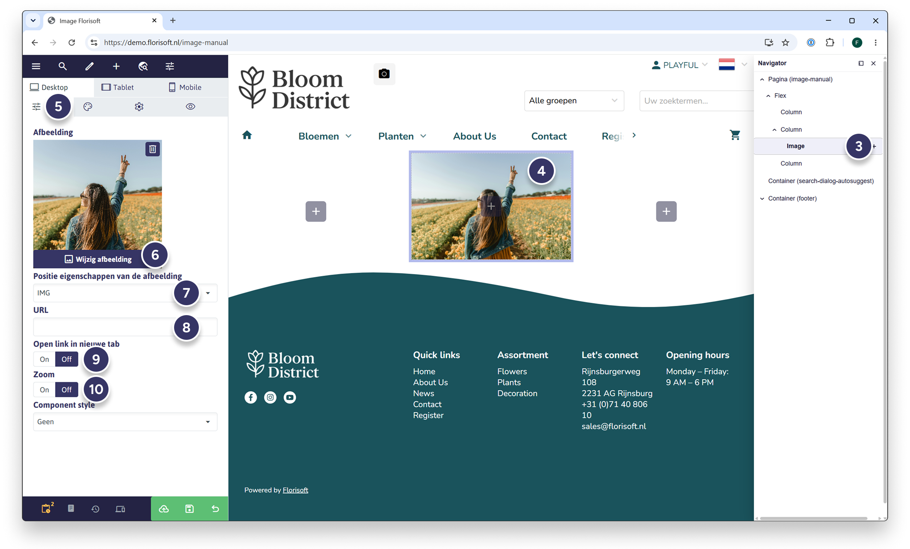
  Lees meer over de aanvullende instellingen van [Component Styles](#component-styles). |
| **3** | Lees meer over de aanvullende instellingen in de tabbladen [Styling](#3-styling), [Geavanceerd](#4-geavanceerd) en [Zichtbaarheid](#5-zichtbaarheid). |

---

#### Image overlay

| Onderdeel | Beschrijving |
|---|---|
| Image overlay | Deze beschrijving wordt aangevuld |

---

#### Hotspot

| Onderdeel | Beschrijving |
|---|---|
| Hotspot | Deze beschrijving wordt aangevuld |

---

#### SVG

| Onderdeel | Beschrijving |
|---|---|
| SVG | Deze beschrijving wordt aangevuld |

---

#### HTML video

| Onderdeel | Beschrijving |
|---|---|
| HTML video | Deze beschrijving wordt aangevuld |

---

#### Youtube video

| Onderdeel | Beschrijving |
|---|---|
| Youtube video | Deze beschrijving wordt aangevuld |

---

#### Carrousel

Met het **Carrousel**-component kun je meerdere elementen als afzonderlijke slides weergeven. Je bepaalt zelf hoeveel slides per apparaat zichtbaar zijn, hoe de navigatie wordt weergegeven en of de carrousel automatisch afspeelt. Hierdoor kun je de carrousel volledig naar wens configureren.

| Stap | Uitleg |
|:--|:--|
| **1** | In dit voorbeeld hebben we een [Panel](#panel) (1) geselecteerd waaraan we het **Carrousel**-component (2) toevoegen.

<b>Klik hier voor de voorbeeldafbeelding</b>
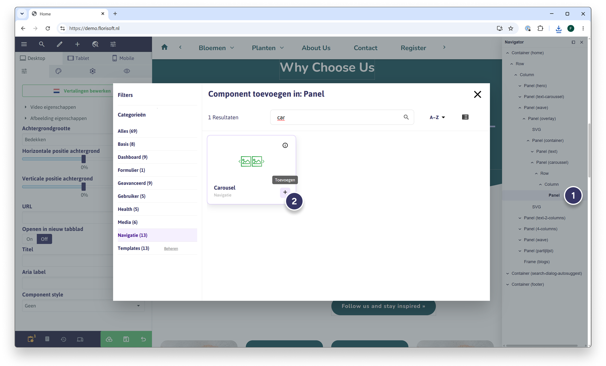
 |
| **2** | Het **Carrousel**-component is nu zichtbaar in de [Navigator](#navigator) (3) en in de Editor. We hebben het Carrousel in dit voorbeeld gevuld met meerdere [Panels](#panel) en deze voorzien van een eigen [naam](#identificatienaam). Via het tabblad **[Algemene instellingen](#algemene-instellingen)** (4) kun je de volgende opties instellen:  **Lazy load slides** (5): Wanneer deze optie is ingeschakeld, worden slides pas ingeladen zodra ze zichtbaar worden.  **Swipen** (6): Activeer deze optie om met een veegbeweging door de slides te kunnen navigeren.  **Style** (7): Selecteer een stijl voor de chevrons (navigatiepijlen).  **Chevrons positie** (8): Bepaal waar de navigatiepijlen worden weergegeven. **Overlay** plaatst de pijlen over de slide. **Indent** plaatst de pijlen naast het Carrousel.  **Chevron** (9): Schakel deze optie in of uit om de navigatiepijlen weer te geven.  **Paginatie** (10): Toont paginatiebolletjes onder het Carrousel om het aantal slides en de huidige positie aan te geven.  **Herhalen** (11): Schakel deze optie in of uit om het Carrousel continu te laten herhalen. Hierdoor kun je na de laatste slide weer verdergaan met de eerste slide.  **Automatisch afspelen - interval in seconden** (12): Stel in hoeveel seconden een slide wordt weergegeven voordat de volgende slide wordt getoond.  **Automatisch afspelen** (13): Schakel deze optie in of uit om het automatisch afspelen van de slides te activeren.  **Hoogtemodus** (14): Bepaal hoe de hoogte van de slides wordt ingesteld. **Auto height** past de hoogte automatisch aan wanneer de volgende slide een andere hoogte heeft. **Auto stretch** zorgt ervoor dat alle slides dezelfde hoogte hebben.  **Ruimte tussen slides** (15): Stel het aantal pixels in voor de ruimte tussen de slides.

<b>Klik hier voor de voorbeeldafbeelding</b>
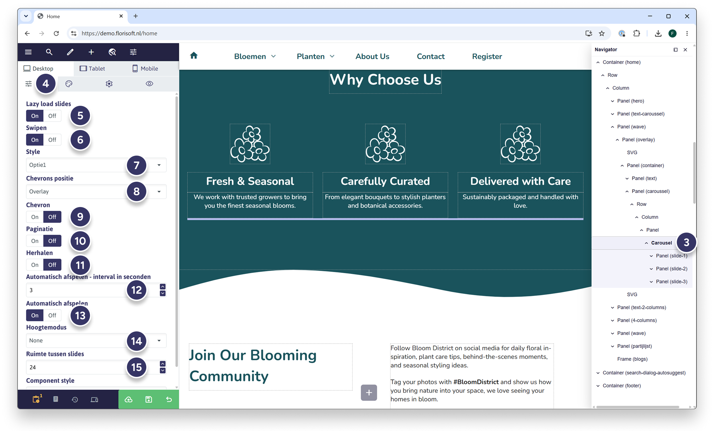
Lees meer over de aanvullende instellingen over [Component Styles](#component-styles). |
| **3** | Via het tabblad **[Styling](#3-styling)** (16) kun je de volgende opties instellen:  **[Height](#hoogtebreedte)** (17): Stel de hoogte van het Carrousel in.  **Kolomuitlijning** (18): Lijn de slides links, rechts of gecentreerd uit.  **[Slide breedte](#hoogtebreedte)** (19): Stel de breedte van iedere slide in.  **[Slide content breedte](#hoogtebreedte)** (20): Stel de breedte in van de inhoud binnen iedere slide.  **Zichtbare kolommen (desktop)** (21): Bepaal hoeveel slides tegelijkertijd op desktop worden weergegeven.  **Zichtbare kolommen (tablet)** (22): Bepaal hoeveel slides tegelijkertijd op een tablet worden weergegeven.  **Zichtbare kolommen (mobiel)** (23): Bepaal hoeveel slides tegelijkertijd op mobiele apparaten worden weergegeven.

<b>Klik hier voor de voorbeeldafbeelding</b>
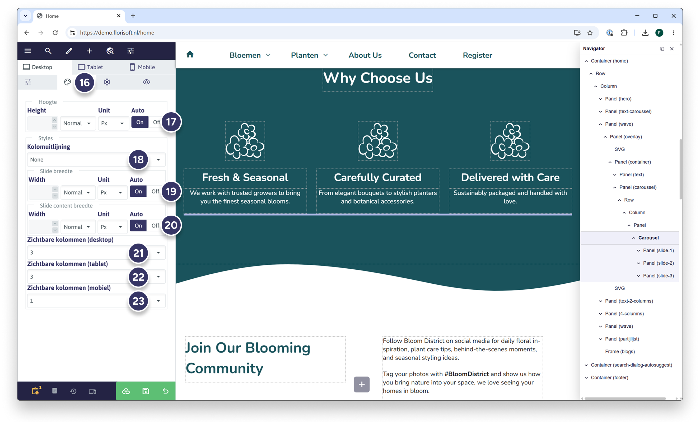
  Lees meer over de aanvullende instellingen in de tabbladen [Geavanceerd](#4-geavanceerd) en [Zichtbaarheid](#5-zichtbaarheid). |

---

#### Picture row

| Onderdeel | Beschrijving |
|---|---|
| Picture row | Deze beschrijving wordt aangevuld |

---

### Navigatie

#### Button

| Onderdeel | Beschrijving |
|---|---|
| Button | Deze beschrijving wordt aangevuld |

---

#### Partijlijst

| Onderdeel | Beschrijving |
|---|---|
| Partijlijst | Deze beschrijving wordt aangevuld |

---

#### Partijkaart

| Onderdeel | Beschrijving |
|---|---|
| Partijkaart | Deze beschrijving wordt aangevuld |

---

#### Social icons

| Onderdeel | Beschrijving |
|---|---|
| Social icons | Deze beschrijving wordt aangevuld |

---

#### Breadcrumbs

| Onderdeel | Beschrijving |
|---|---|
| Breadcrumbs | Deze beschrijving wordt aangevuld |

---

#### Icon link

| Onderdeel | Beschrijving |
|---|---|
| Icon link | Deze beschrijving wordt aangevuld |

---

#### Banner

| Onderdeel | Beschrijving |
|---|---|
| Banner | Deze beschrijving wordt aangevuld |

---

#### Voorraad navigatie

| Onderdeel | Beschrijving |
|---|---|
| Voorraad navigatie | Deze beschrijving wordt aangevuld |

---

#### Shop navigation

| Onderdeel | Beschrijving |
|---|---|
| Shop navigation | Deze beschrijving wordt aangevuld |

---

#### Aanbieding

| Onderdeel | Beschrijving |
|---|---|
| Aanbieding | Deze beschrijving wordt aangevuld |

---

#### Action link

| Onderdeel | Beschrijving |
|---|---|
| Action link | Deze beschrijving wordt aangevuld |

---

#### Add to home button

| Onderdeel | Beschrijving |
|---|---|
| Add to home button | Deze beschrijving wordt aangevuld |

---

#### Anchors toolbar

| Onderdeel | Beschrijving |
|---|---|
| Anchors toolbar | Deze beschrijving wordt aangevuld |

---

### Formulieren

#### Formulier

Stel een dynamisch formulier samen dat flexibel kan worden ingericht op basis van de gewenste invoervelden.

Verstuur de ingevulde gegevens naar één of meerdere e-mailadressen en stel een automatische bevestigingsmail in voor de afzender. Voorkom spam door gebruik te maken van reCAPTCHA. Daarnaast is er een optie beschikbaar genaamd **Botpreventiemodus**, waarbij een verborgen invoerveld wordt toegevoegd om bots te detecteren en tegen te houden.

De gegevens van een nieuwe klant kunnen optioneel als Excel-bestand worden meegestuurd, zodat deze eenvoudig in de backoffice kunnen worden geïmporteerd.

In een Formulier kunnen bijvoorbeeld ook componenten als [Rows/Columns](#rowcolumn) worden geplaatst, zodat je het formulier overzichterlijk kunt inrichten.

*Volg onderstaande stappen:*

|Stap|Uitleg|
|:--|:--|
|**1**|In dit voorbeeld werken we op een contact-[pagina](#pagina) en willen we een formulier toevoegen. Klik in de [Navigator](#navigator) op het '+'-icoon achter het [Panel](#panel)-component (1). Het [Componenten dialoog](#componentendialoog) wordt nu geopend.

<b>Klik hier voor de voorbeeldafbeelding</b>
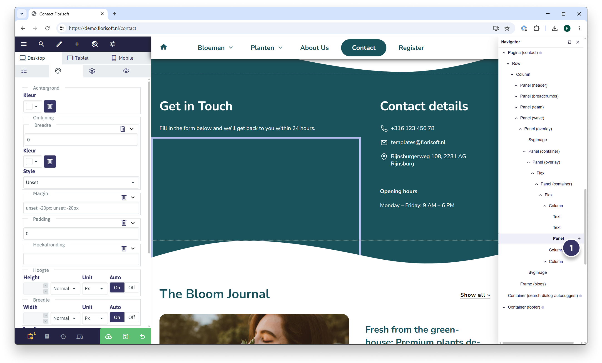
|
|**2**|Navigeer in het dialoog naar de categorie **Formulier** (2) en voeg via het '+'-icoon het **Formulier**-component toe aan de pagina (3).

<b>Klik hier voor de voorbeeldafbeelding</b>
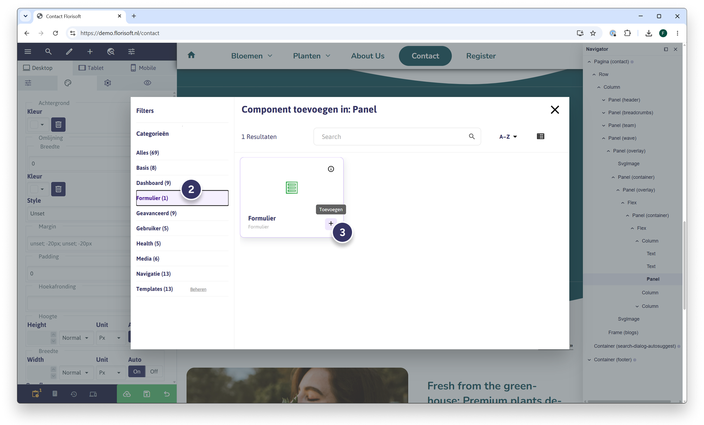
|
|**3**|Het **Formulier**-component is nu zichtbaar (4) in de Navigator en kan direct worden ingesteld via het tabblad **Algemene instellingen** (5). Via **Vertalingen bewerken** (6) kunnen teksten voor meerdere talen worden ingevoerd. Meer informatie hierover vind je bij [Vertalingen](#vertalingen).  Vul vervolgens het **E-mailonderwerp** (7) van het formulier in. Dit is de onderwerpregel van de e-mail die wordt verzonden naar de adressen die je invult onder **Ontvangers** (8). Via de toevoegknop (9) kun je meerdere e-mailadressen toevoegen.  Om spam zoveel mogelijk te voorkomen kun je **Botpreventiemodus** (10) inschakelen. Hiervoor zijn de volgende opties beschikbaar:  **Geheim invoerveld**: Voegt een verborgen invoerveld toe dat voor bezoekers niet zichtbaar is. Wanneer dit veld toch wordt ingevuld (meestal door een bot), wordt het formulier niet verzonden.  **Tijd gebaseerd**: Bots versturen formulieren vaak binnen enkele milliseconden. Wanneer een formulier sneller dan de ingestelde tijd (standaard 3 seconden) wordt verzonden, wordt de verzending geblokkeerd.  Heb je een eigen Google-account? Dan kun je ook **Google reCAPTCHA** (11) inschakelen. 

<b>Volg hiervoor onderstaande stappen:</b>
**Google reCAPTCHA configureren**  1. Log in op je Google-account. 2. Heeft het Google-account nog geen project? Maak er dan één aan via: https://console.cloud.google.com/projectcreate. 3. Maak een nieuwe reCAPTCHA-instantie aan via: https://www.google.com/recaptcha/admin/create. 3a. Vul bij **Label** een herkenbare naam in, bijvoorbeeld: *[Bedrijfsnaam] ReCAPTCHA*. 3b. Laat het type staan op **Score based (v3) - Verify requests with a score**. Dit type wordt ondersteund door de webshop. 3c. Voeg bij **Domains** jouw domeinnaam toe, bijvoorbeeld: *jouwdomein.nl*. 3d. Selecteer het zojuist aangemaakte of een bestaand Google Cloud Project. 3e. Klik op **Submit**. 4. Op de volgende pagina worden de **Site Key** en **Secret Key** getoond. Bewaar deze goed. 5. *(Optioneel)* Klik op **View in Cloud Console** om de beheeromgeving van de reCAPTCHA-instantie te openen. 6. Configureer vervolgens de volgende webshopinstellingen: 6a. **RECAPTCHAACTIEF** → inschakelen. 6b. **RECAPTCHASITEKEY** → vul hier de Site Key in. 6c. **RECAPTCHASECRETKEY** → vul hier de Secret Key in. 7. Herstart de webshop nadat de instellingen zijn opgeslagen. 8. Schakel in de CMS-editmodus bij ieder formulier waarvoor je reCAPTCHA wilt gebruiken de optie **Gebruik ReCAPTCHA** in. 9. Sla het CMS op, publiceer de wijzigingen en vernieuw de pagina. 10. Google reCAPTCHA is nu actief. Tijdens het verzenden van formulieren analyseert Google onder andere het gedrag van de gebruiker, de browser en technische gegevens om een score te berekenen. Is deze score te laag, dan wordt het formulier niet verzonden en ontvangt de gebruiker een foutmelding.  **NB1:** Deze variant van reCAPTCHA gebruikt géén checkbox, maar bepaalt volledig op de achtergrond een score. **NB2:** Op pagina's met formulieren verschijnt rechtsonder automatisch de melding **'Beveiligd met reCAPTCHA'**.
  Formulieren kunnen ook met behulp van een XSL-template naar één of meerdere e-mailadressen worden verzonden. Zorg er in dat geval voor dat de SMTP-instellingen van de webshop correct zijn geconfigureerd en dat er een XSL-template (12) beschikbaar is voor het actieve thema. Hetzelfde geldt voor de **Autoreply XSL** (13). Lees [hier](#component-styles) (14) meer over het gebruik van Component Styles.

<b>Klik hier voor de voorbeeldafbeelding</b>
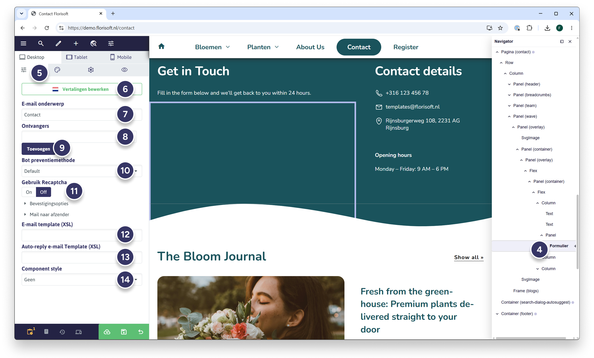
|
|**4**|Ook de bevestigingsopties (15) kunnen eenvoudig worden ingesteld. Via **Bevestigingsfeedback** (16) bepaal je of na het verzenden van het formulier een bedankbericht wordt getoond via **ShowDialog**, of dat de bezoeker wordt doorgestuurd naar een [CMS-pagina](#pagina). Wanneer **CMSPage** is geselecteerd, kies je via **CMS Page** (17) de gewenste pagina. Kies je voor **ShowDialog**, dan kun je een titel (18) en bericht (19) invullen die na een succesvolle verzending worden weergegeven.

<b>Klik hier voor de voorbeeldafbeelding</b>
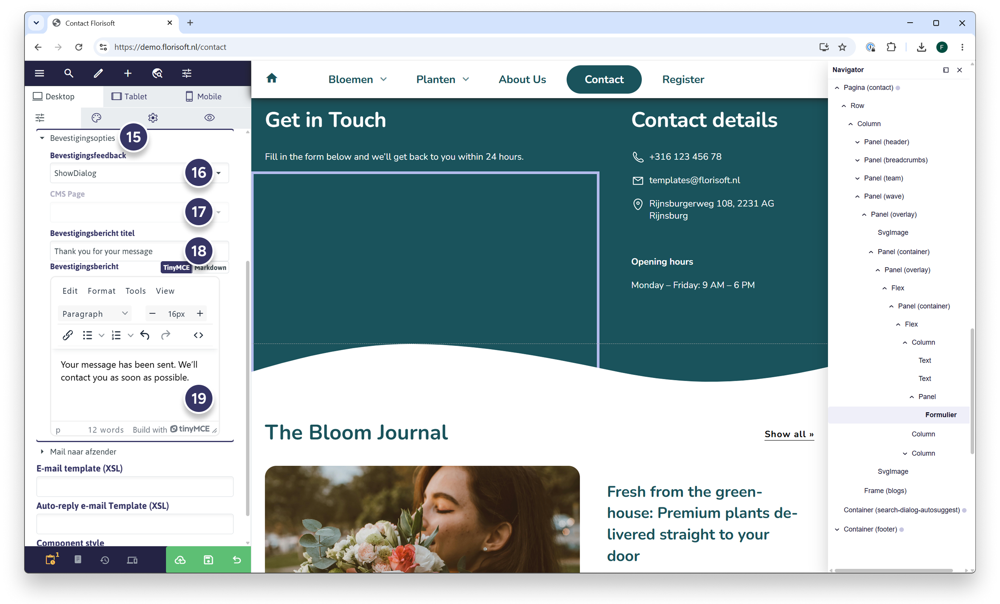
|
|**5**|De instellingen onder **Mail naar afzender** (20) zijn van toepassing wanneer in het [Email input component](#email-input) de optie **Stuur bevestigingsmail** is ingeschakeld. Na het verzenden van het formulier ontvangt de afzender automatisch een bevestigingsmail. Vul hiervoor een titel (21) en bericht (22) in. In het bericht kunnen placeholders worden gebruikt, zoals **{{first_name}}** of **{{company_name}}**, zodat de e-mail persoonlijker wordt. Zorg er wel voor dat de gebruikte placeholders overeenkomen met de namen van de betreffende [invoervelden](#tekst-input). Vanuit privacyoogpunt wordt aanbevolen om een [checkbox](#checkbox) toe te voegen met de tekst: *Ik ga ermee akkoord dat mijn gegevens gebruikt mogen worden voor de verwerking van mijn verzoek.* Stel tot slot ook het onderwerp van de bevestigingsmail in (23).

<b>Klik hier voor de voorbeeldafbeelding</b>

|
|**6**|Via het tabblad [Styling](#styling) (24) kun je kleuren en andere visuele instellingen van het formulier aanpassen.

<b>Klik hier voor de voorbeeldafbeelding</b>
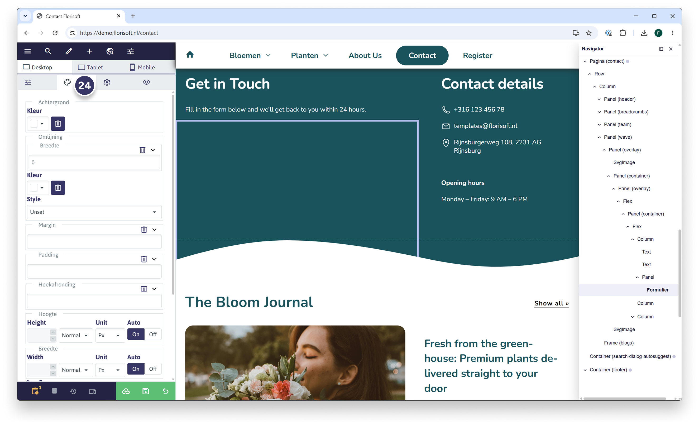
|
|**7**|Via het tabblad [Geavanceerd](#4-geavanceerd) (25) zijn aanvullende technische instellingen beschikbaar. Zo kan het formulier via **ExcelAsMailAttachment** (26) als Excel-bijlage worden meegestuurd. De opties **Database** en **ExcelFile** slaan de gegevens op aan de serverzijde van de webshop. Ook kan hier de tijd (27) van de eerder beschreven **Tijd gebaseerd**-botpreventie worden ingesteld (in seconden). Optioneel kun je het formulier een naam geven (28), zodat deze overzichtelijk wordt weergegeven in het [Form Tracking-scherm](#form-tracking). Daarnaast kan, net als bij de algemene instellingen, een URL (29) worden ingesteld waarnaar de gebruiker na verzending wordt doorgestuurd. Wij raden aan om slechts één van deze twee doorstuurmogelijkheden te gebruiken. Tot slot kun je instellen dat alle invoervelden na verzending worden leeggemaakt (30) of het formulier in **Dummy**-modus (31) zetten voor testdoeleinden. De overige instellingen worden beschreven bij [Geavanceerd](#4-geavanceerd).

<b>Klik hier voor de voorbeeldafbeelding</b>
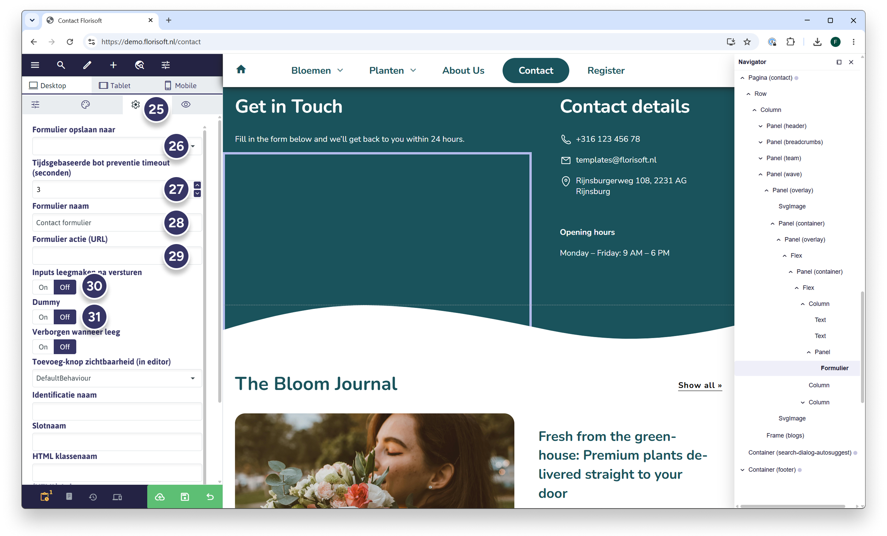
|
|**8**|Via het tabblad [Zichtbaarheid](#zichtbaarheid) bepaal je voor welke gebruikers het formulier zichtbaar is.

<b>Klik hier voor de voorbeeldafbeelding</b>
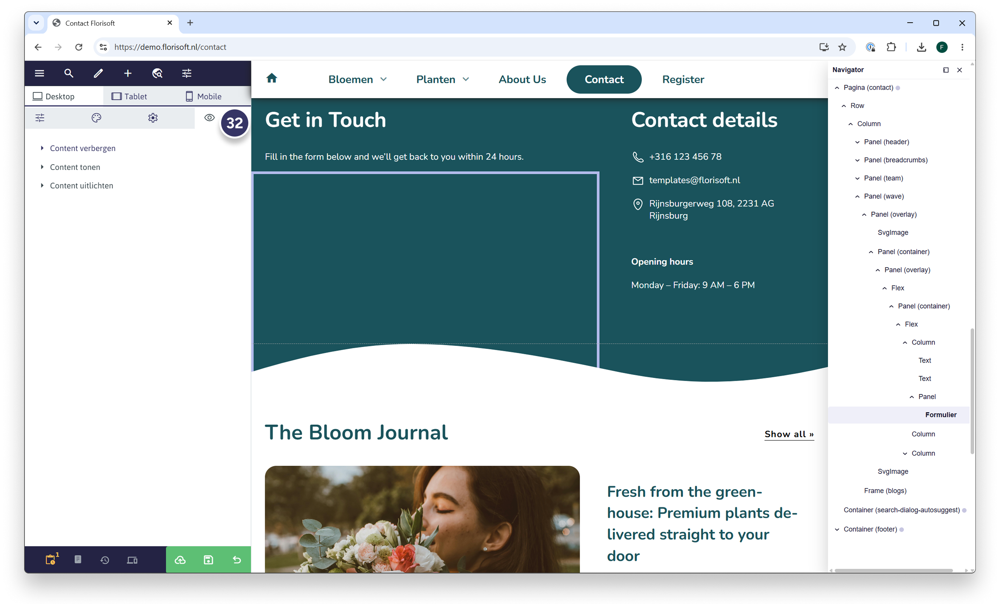
|

---

#### Tekst input

Gebruik dit component om tekstuele gegevens in te voeren binnen een formulier.

*Volg onderstaande stappen (dit is een vervolg op de uitleg van [Formulier](#formulier)):*

|Stap|Uitleg|
|:--|:--|
|**1**|Nadat het [Formulier](#formulier) is aangemaakt en geconfigureerd, kunnen de invoervelden worden toegevoegd. In dit voorbeeld willen we een **Voornaam**- en **Achternaam**-veld naast elkaar plaatsen. Voeg hiervoor eerst een [Row en Column](#rowcolumn) toe aan het formulier. Klik vervolgens op het '+'-icoon achter de **Column** (1). Het **Componenten dialoog** wordt nu geopend.

<b>Klik hier voor de voorbeeldafbeelding</b>
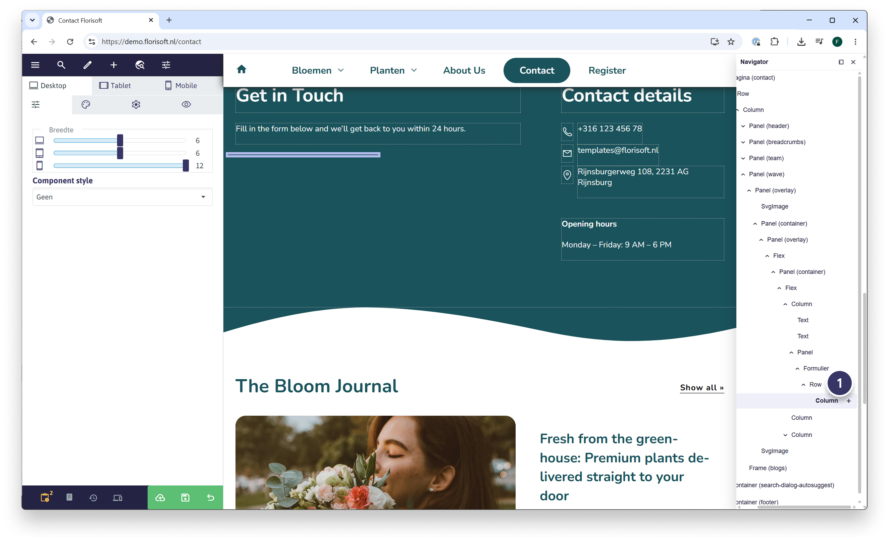
|
|**2**|Navigeer via de categorie **Formulier** (2) naar het **Tekst input**-component (3) en voeg dit toe aan de **Column** (4).

<b>Klik hier voor de voorbeeldafbeelding</b>
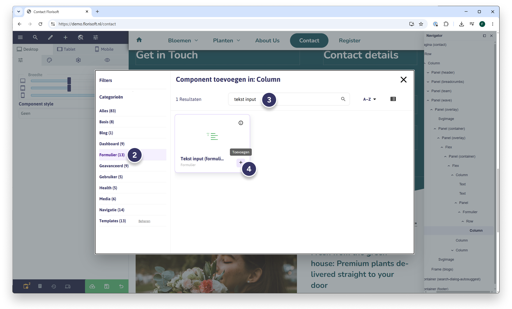
|
|**3**|Het **Tekst input**-component (5) is nu toegevoegd aan de **Column** en direct zichtbaar in de editor (6). Open het tabblad **Algemene instellingen** (7) om het component te configureren.  **8 - Vertalingen bewerken:** Voeg vertalingen toe voor meerdere talen. Lees hier meer over bij [Vertalingen](#vertalingen).  **9 - InputName:** Dit veld wordt automatisch gevuld met een unieke waarde. **LET OP:** Zorg ervoor dat ieder invoerveld een unieke **InputName** heeft. Dubbele namen veroorzaken fouten bij het verzenden van het formulier. De **InputName** kan bovendien worden gebruikt voor placeholders in de bevestigingsmail of het bedankbericht van het [Formulier](#formulier).  **10 - Mandatory:** Geef aan of dit een verplicht invoerveld is.  **11 - RegexErrorText:** Vul hier de foutmelding in die wordt weergegeven wanneer de ingevoerde waarde niet aan de validatie voldoet.  **12 - GeneralRegex:** Selecteer een standaardvalidatie, bijvoorbeeld voor een e-mailadres of telefoonnummer.  **13 - Multiline:** Schakel deze optie in om een groter tekstveld (textarea) te tonen waarin bezoekers langere berichten kunnen invoeren.  **14 - Label:** De tekst die boven het invoerveld wordt weergegeven.  **15 - CharacterRange:** Stel het minimale en/of maximale aantal toegestane tekens in.  **16 - Placeholder:** De tekst die in het invoerveld wordt weergegeven totdat de gebruiker begint met typen.  **17 - Component Styles:** Lees hier meer over bij [Component Styles](#component-styles).  Meer informatie over de tabbladen [Styling](#3-styling) (18), [Geavanceerd](#4-geavanceerd) (19) en [Zichtbaarheid](#5-zichtbaarheid) (20) vind je in de desbetreffende hoofdstukken.

<b>Klik hier voor de voorbeeldafbeelding</b>
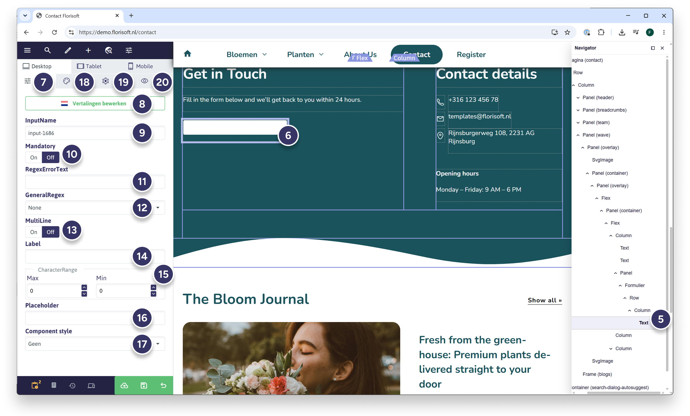
|
|**4**|Nu de structuur **Row → Column → Tekst input** is aangemaakt, kun je eenvoudig extra invoervelden toevoegen door met de rechtermuisknop op de **Column** (21) te klikken en **Dupliceren** (22) te kiezen.

<b>Klik hier voor de voorbeeldafbeelding</b>
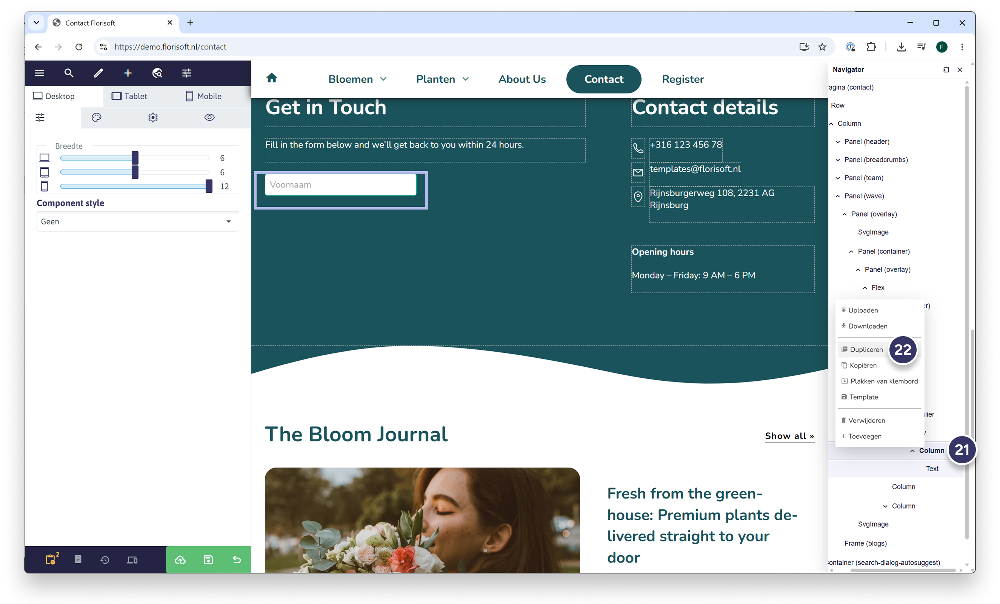
|
|**5**|Er wordt direct een tweede **Column** toegevoegd met dezelfde inhoud (23). Selecteer vervolgens het nieuwe **Tekst input**-component via de editor (23) of de Navigator (24). Geef de **InputName** een nieuwe, unieke waarde (25) en pas de **Placeholder** (26) en eventueel het **Label** aan.

<b>Klik hier voor de voorbeeldafbeelding</b>
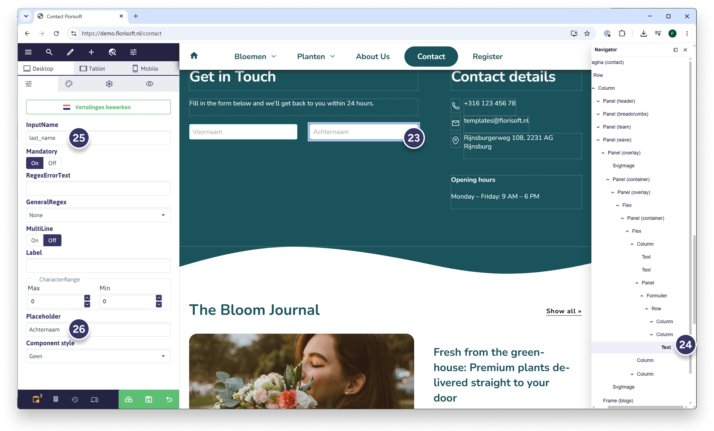
|

---

#### Email input

Dit invoerveld accepteert alleen geldige e-mailadressen. Daarnaast kan worden ingesteld dat automatisch een bevestigingsmail wordt verzonden naar het ingevulde e-mailadres. De inhoud van deze e-mail kan worden ingesteld in het [Formulier](#formulier)-component.

*Volg onderstaande stappen (dit is een vervolg op de uitleg van [Tekst Input](#tekst-input)):*

|Stap|Uitleg|
|:--|:--|
|**1**|Bij het [Tekst Input](#tekst-input)-component hebben we ervoor gezorgd dat een voor- en achternaam kan worden ingevuld. In deze stap voegen we een e-mailveld toe aan het [Formulier](#formulier). Klik hiervoor op het '+'-icoon achter het formulier (1).

<b>Klik hier voor de voorbeeldafbeelding</b>
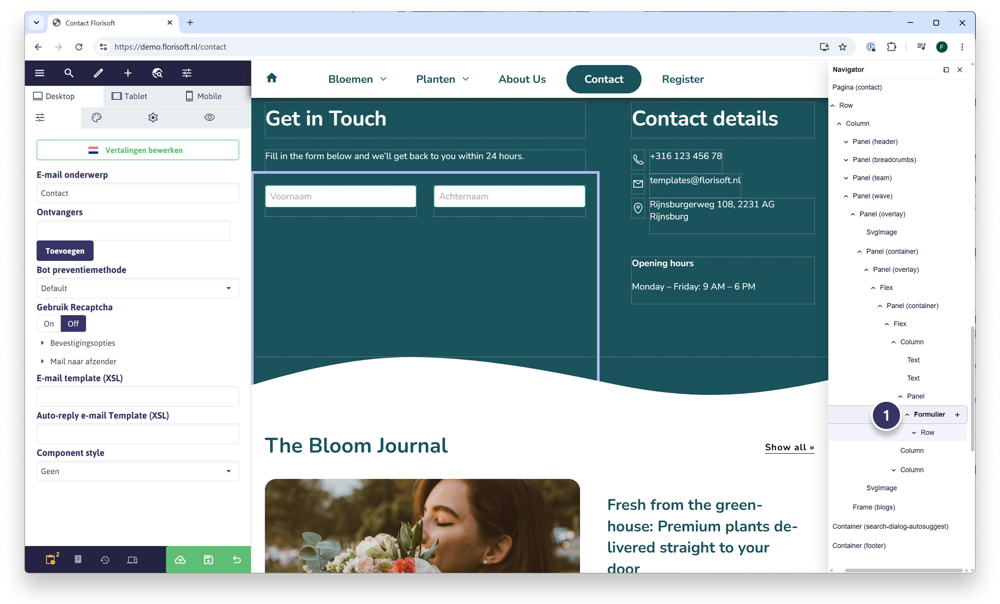
|
|**2**|Navigeer via de categorie **Formulier** (2) naar het **Email input**-component (3) en voeg dit toe aan het **Formulier** (4).

<b>Klik hier voor de voorbeeldafbeelding</b>
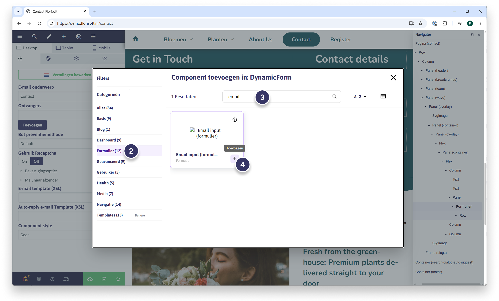
|
|**3**|Het **Email input**-component (5) is nu toegevoegd aan het **Formulier** en direct zichtbaar in de editor (6). Open het tabblad **Algemene instellingen** (7) om het component te configureren.  Zorg er ook bij dit component voor dat de **InputName** (8) een unieke waarde heeft, zoals beschreven bij [Tekst Input](#tekst-input).  Het **Email input**-component bevat grotendeels dezelfde instellingen als het **Tekst input**-component, maar heeft één aanvullende belangrijke optie: **Stuur bevestigingsmail** (9). Wanneer deze optie wordt ingeschakeld, wordt het ingestelde bevestigingsbericht uit de instellingen van het [Formulier](#formulier) automatisch verzonden naar het ingevulde e-mailadres.  **LET OP:** Wanneer het bevestigingsbericht niet is ingevuld, maar de optie **Stuur bevestigingsmail** wel is ingeschakeld, wordt er een lege e-mail naar de afzender verzonden.

<b>Klik hier voor de voorbeeldafbeelding</b>
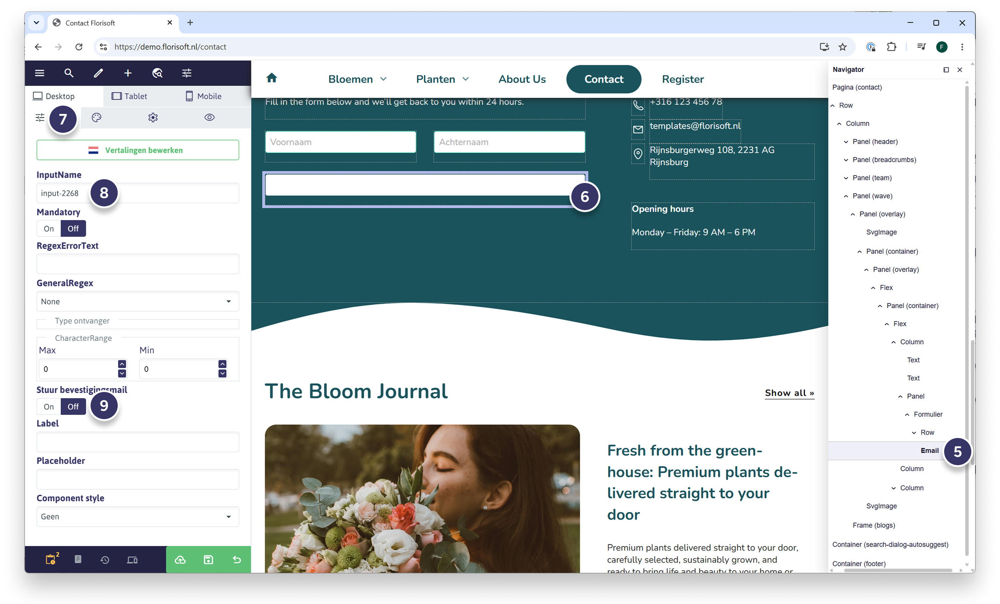
|

---

#### Nummer input

Gebruik dit component binnen een formulier wanneer er uitsluitend numerieke waarden mogen worden ingevoerd.

De werking en beschikbare instellingen van dit component komen grotendeels overeen met het [Tekst input](#tekst-input)-component.

---

#### Bestand input

Met dit component kan de gebruiker bestanden uploaden die worden meegestuurd met het formulier.

Ondersteunde bestandsformaten:
*.jpg; *.png; *.jpeg; *.doc; *.docx; *.pdf; *.mkv; *.mp4; *.wmv; *.txt; *.avi; *.svg; *.wav; *.xls; *.rtf

De werking en beschikbare instellingen van dit component komen grotendeels overeen met het [Tekst input](#tekst-input)-component.

---

#### Checkbox

Met dit component voeg je een selectievakje toe aan een formulier. Dit kan bijvoorbeeld worden gebruikt om bezoekers akkoord te laten gaan met de algemene voorwaarden, het privacybeleid of om toestemming te geven voor de verwerking van persoonsgegevens.

De werking en beschikbare instellingen van dit component komen grotendeels overeen met het [Tekst input](#tekst-input)-component.

> **Tip:** Voor een overzichtelijkere weergave in de verzonden e-mail raden wij aan om het [Multiple choice](#multiple-choice)-component te gebruiken. Dit component toont de geselecteerde optie netter en biedt daarnaast meer functionaliteit.

|Stap|Uitleg|
|:--|:--|
|**1**|Het **Checkbox**-component bevat grotendeels dezelfde instellingen als het **Tekst input**-component, maar beschikt over één aanvullende optie: **Checked on start** (1). Wanneer deze optie is ingeschakeld, is de checkbox standaard aangevinkt zodra het formulier wordt geladen.

<b>Klik hier voor de voorbeeldafbeelding</b>
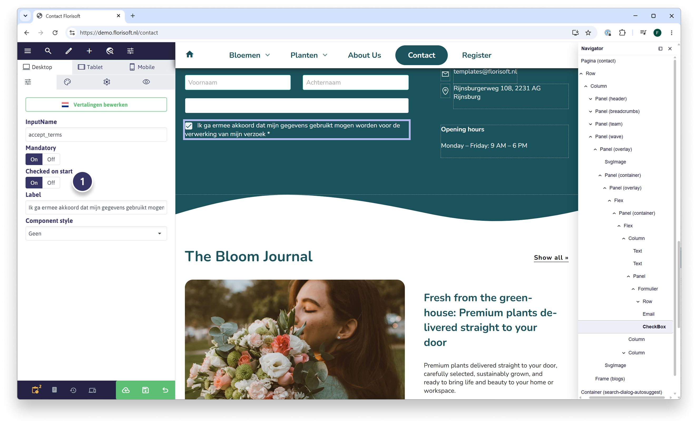
|

---

#### Radio button

Gebruik dit component binnen een formulier om bezoekers één keuze te laten maken uit meerdere beschikbare opties. Elke optie wordt als een afzonderlijke radio button toegevoegd, waarbij slechts één optie tegelijk kan worden geselecteerd.

De werking en beschikbare instellingen van dit component komen grotendeels overeen met de [Tekst input](#tekst-input)- en [Checkbox](#checkbox)-componenten.

> **Tip:** Voor een overzichtelijkere weergave in de verzonden e-mail raden wij aan om het [Multiple choice](#multiple-choice)-component te gebruiken. Dit component toont de geselecteerde optie netter en biedt daarnaast meer functionaliteit.

---

#### Multiple choice

Gebruik dit component om bezoekers één of meerdere keuzes uit een lijst met opties te laten maken.

Afhankelijk van de gekozen modus worden de opties weergegeven als:

- **Checkboxes** – wanneer meerdere opties geselecteerd mogen worden.
- **Radio buttons** – wanneer slechts één optie geselecteerd mag worden.

Bij het verzenden van het formulier worden alleen de geselecteerde opties opgenomen in de bevestigingsmail.

De werking en beschikbare instellingen van dit component komen grotendeels overeen met het [Tekst input](#tekst-input)-component.

|Stap|Uitleg|
|:--|:--|
|**1**|Het **Multiple choice**-component bevat grotendeels dezelfde instellingen als het **Tekst input**-component, maar beschikt over twee aanvullende opties.  **1 - Options:** Voeg hier de beschikbare keuzes toe. Nieuwe opties kunnen eenvoudig worden toegevoegd via de knop **Toevoegen** (2).  **3 - Mode:** Bepaal hoe de opties worden weergegeven. Kies **Checkboxes** wanneer meerdere antwoorden mogelijk zijn, of **Radio buttons** wanneer slechts één antwoord geselecteerd mag worden.

<b>Klik hier voor de voorbeeldafbeelding</b>
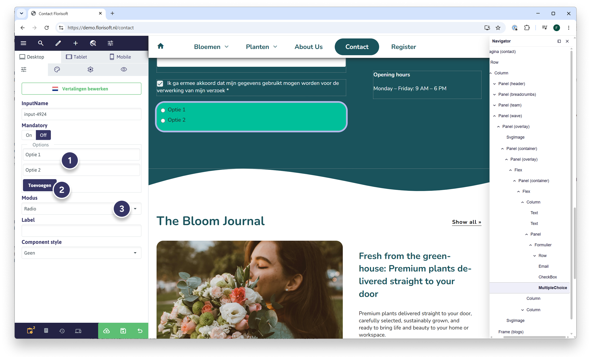
|

---

#### Dropdown (single select) / Single select option

Gebruik dit component binnen een formulier om een dropdownmenu met keuzemogelijkheden toe te voegen. De opties binnen de dropdown worden aangemaakt met behulp van **Dropdown Single Select Option**-componenten.

Daarnaast is het mogelijk om automatisch een lijst met alle landen wereldwijd in te laden.

De werking en beschikbare instellingen van dit component komen grotendeels overeen met het [Tekst input](#tekst-input)-component.

|Stap|Uitleg|
|:--|:--|
|**1**|Het **Dropdown (single select)**-component bevat grotendeels dezelfde instellingen als het **Tekst input**-component, maar beschikt over één aanvullende optie: **UsePredefinedCountryTemplate** (1). Wanneer deze optie wordt ingeschakeld, wordt automatisch een lijst met alle beschikbare landen wereldwijd geladen.  In dit voorbeeld voegen we de opties handmatig toe, daarom laten we deze optie uitgeschakeld. Klik vervolgens op het '+'-icoon achter **DropdownSingleSelect** (2). Het **Componenten dialoog** wordt nu geopend.

<b>Klik hier voor de voorbeeldafbeelding</b>
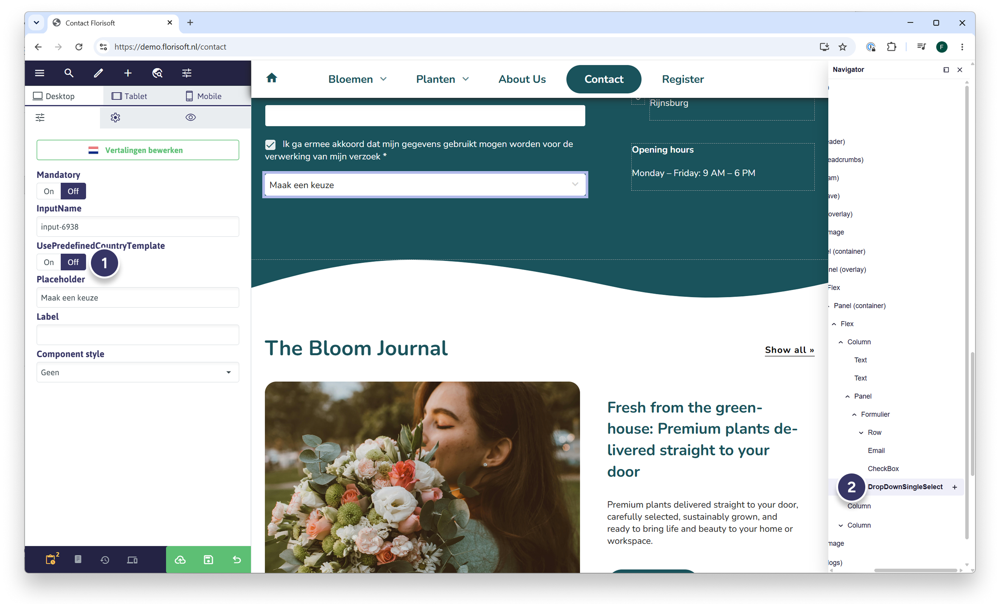
|
|**2**|Navigeer via de categorie **Formulier** (3) naar het **DropdownSingleSelectOption**-component (4) en voeg dit toe aan het **DropdownSingleSelect**-component.

<b>Klik hier voor de voorbeeldafbeelding</b>
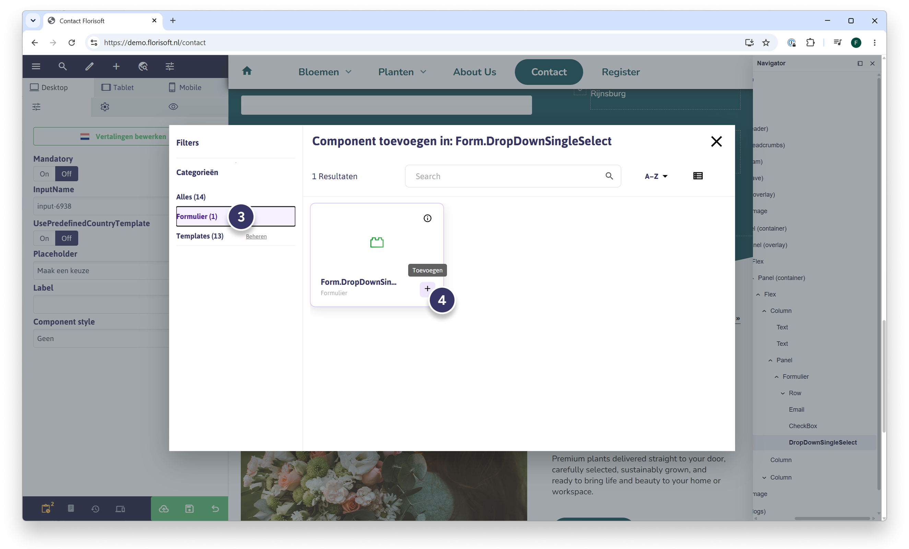
|
|**3**|Het **DropdownSingleSelectOption**-component is nu toegevoegd aan het **DropdownSingleSelect**-component (5). Configureer de optie door een naam in te vullen bij **InputName** (6), de waarde in te stellen via **Value** (7) en een zichtbare naam op te geven bij **Label** (8).

<b>Klik hier voor de voorbeeldafbeelding</b>
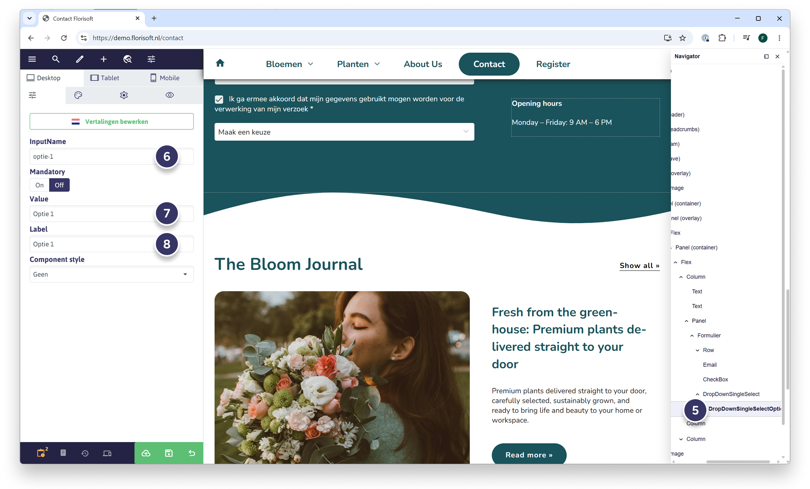
|
|**4**|Wanneer je het dropdownmenu opent, zie je dat de zojuist aangemaakte keuze beschikbaar is als selectieoptie.

<b>Klik hier voor de voorbeeldafbeelding</b>
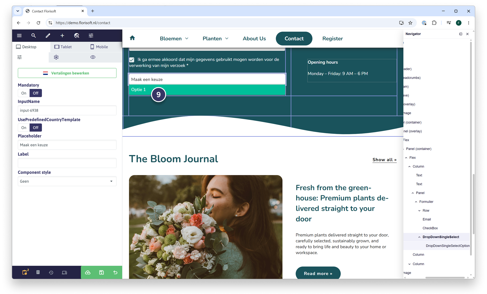
|

---

#### Hidden input

Dit component wordt gebruikt om gegevens mee te sturen die niet zichtbaar zijn voor de gebruiker, maar wel nodig zijn voor de bevestigingsmail of het gegenereerde Excelbestand.

Hiermee kun je bijvoorbeeld een formulier zo configureren dat ingevulde gegevens automatisch worden verwerkt in een e-mail en een Excelbestand. Dit bestand kan vervolgens direct worden gebruikt voor import in de Florisoft-backoffice via de debiteuren-importfunctie.

Dit is bijvoorbeeld handig bij het verwerken van registratieformulieren, waarbij aanvullende gegevens automatisch kunnen worden gekoppeld aan een nieuwe debiteur.

**Let op:** Gebruik altijd bestaande kolommen uit de backoffice. Het toevoegen van afwijkende of onbekende velden wordt niet ondersteund.

|Stap|Uitleg|
|:--|:--|
|**1**|In dit voorbeeld hebben we drie **Hidden input**-componenten toegevoegd aan het [Formulier](#formulier).  Het eerste voorbeeld toont een **Hidden input** (1) met een **Name** en **Value** die verwijzen naar een template-debiteur (2).  Het tweede voorbeeld toont een **Hidden input** (3) met **DEBNR** als waarde (4). Het derde voorbeeld toont een **Hidden input** (5) met **DEBKEY** als **Name** (6).  **Let op:** Gebruik altijd bestaande kolommen uit de backoffice. Hiervan mag niet worden afgeweken.

<b>Klik hier voor de voorbeeldafbeelding</b>
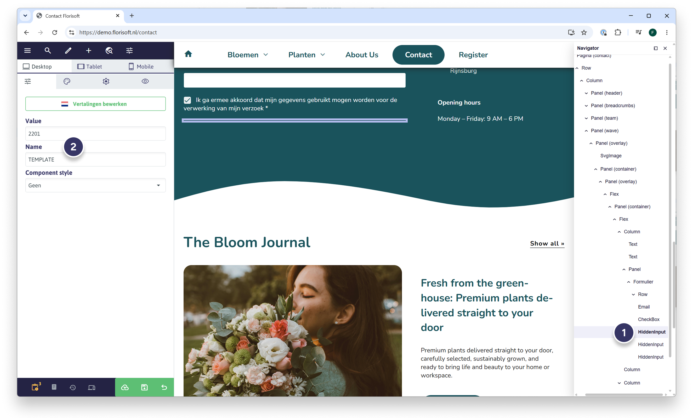

<b>Klik hier voor de voorbeeldafbeelding</b>
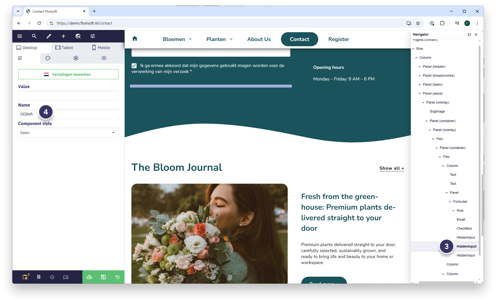

<b>Klik hier voor de voorbeeldafbeelding</b>
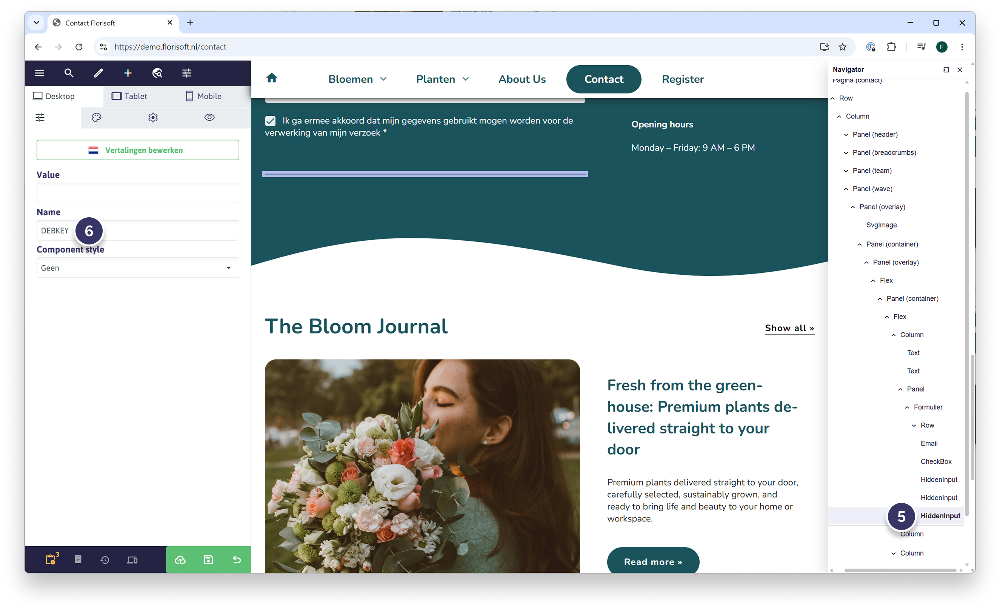
|
|**2**|Configureer het [Formulier](#formulier) zodat de gegevens worden opgeslagen via **Database**, **ExcelFile** of **ExcelAsMailAttachment** en worden meegestuurd naar de ontvanger.  Wanneer de ontvanger het Excelbestand vanuit de e-mail opent, kunnen de **Hidden input**-velden worden gevuld met de bijbehorende gegevens.  Vervolgens kan het Excelbestand in de Florisoft-backoffice worden geïmporteerd via **Constanten** (7) → **Importeren** (8) → **Debiteuren** (9).  Op basis van de geïmporteerde gegevens wordt vervolgens een nieuwe debiteur aangemaakt op basis van een vooraf ingestelde template-debiteur ([Lees meer over Debiteur instellingen](https://github.com/florisoft/User.Manuals/blob/main/FLORISHOP%20MANUALS/Handleiding%20Debiteuren%2C%20Voorraden%20%26%20Bestellijsten%20Florishop%20NL.md)). In de debiteurinstellingen van deze nieuwe debiteur worden de velden **DEBNR** en **DEBKEY** gevuld met de waarden die in het Excelbestand zijn ingevuld door de ontvanger van het registratieformulier.

<b>Klik hier voor de voorbeeldafbeelding</b>
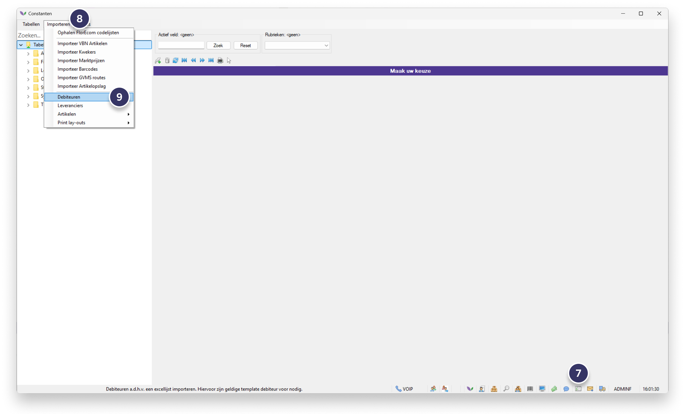
|

---

#### Hidden debiteur info

Met dit component kunnen gegevens van een ingelogde debiteur automatisch worden meegestuurd met een formulier. Deze gegevens kunnen vervolgens worden opgenomen in de bevestigingsmail, zodat direct zichtbaar is welke debiteur het formulier heeft verzonden.

De debiteur hoeft deze gegevens niet zelf in te vullen. Omdat de debiteur is ingelogd, kunnen de beschikbare gegevens automatisch uit het systeem worden opgehaald.

|Stap|Uitleg|
|:--|:--|
|**1**|In dit voorbeeld hebben we het **Hidden debiteur info**-component (1) toegevoegd aan het [Formulier](#formulier). Open vervolgens het tabblad **Algemene instellingen** (2). Via de dropdown (3) kun je selecteren welke gegevens van de ingelogde debiteur met het formulier moeten worden meegestuurd. De debiteur ziet dit invoerveld niet. Omdat de debiteur is ingelogd, kunnen gegevens zoals **DEBNR**, **DEBKEY** en **DEBNAAM** automatisch worden opgehaald en aan het formulier worden toegevoegd. Hierdoor hoeft de debiteur deze gegevens niet handmatig in te vullen, omdat ze al in het systeem beschikbaar zijn. 

<b>Klik hier voor de voorbeeldafbeelding</b>
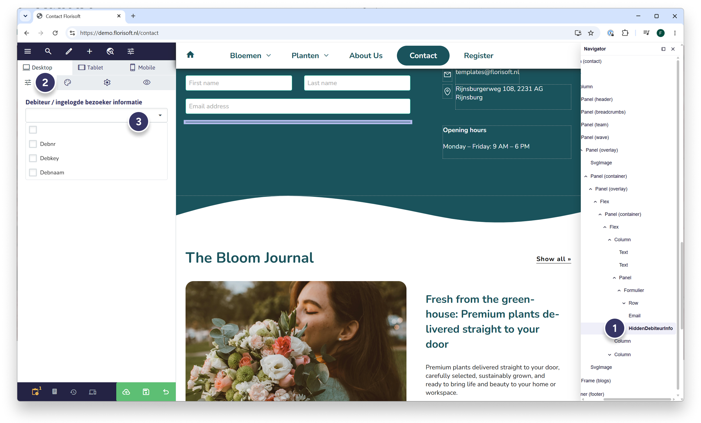
|

---

#### Verzendknop

Gebruik dit component om een formulier te verzenden en de ingevulde gegevens te verwerken.

|Stap|Uitleg|
|:--|:--|
|**1**|Wanneer het [Formulier](#formulier) is voorzien van alle gewenste invoervelden, moet er nog een **Verzendknop** aan het formulier worden toegevoegd. Hiermee kan de bezoeker het formulier verzenden naar de ingestelde ontvanger(s). Klik hiervoor op het '+'-icoon achter het formulier (1). Het componentendialoog wordt geopend.

<b>Klik hier voor de voorbeeldafbeelding</b>
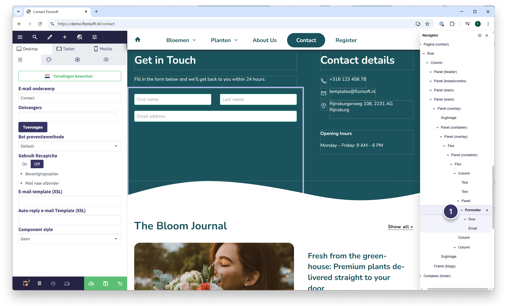
|
|**2**|Navigeer via de categorie **Formulier** (2) of gebruik de zoekfunctie (3) om de **Verzendknop** te vinden. Voeg deze vervolgens toe (4) aan het formulier.

<b>Klik hier voor de voorbeeldafbeelding</b>
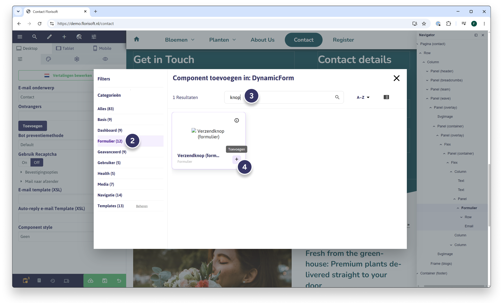
|
|**3**|De **Verzendknop** is nu toegevoegd aan het formulier (5) en direct zichtbaar in de Editor (6). Via het tabblad **Algemene instellingen** (7) kunnen de volgende instellingen worden aangepast:  **8 - [Vertalingen](#vertalingen):** Stel indien gewenst de vertalingen voor de knop in.  **9 - Tekst:** Vul hier de tekst in die op de Verzendknop wordt weergegeven.  **10 - Chevron:** Schakel deze optie in of uit om een pijltje op de Verzendknop weer te geven.  **11 - Switch Variant:** Schakel deze optie in om de secundaire kleur van de Verzendknop te gebruiken. Deze kleur wordt ingesteld in de [Thema Configuratie](#thema-configuratie) onder de naam `button-secondary-bgcolor`.  **12 - URL OPTIONEEL:** Vul hier indien gewenst een URL-pad in. In de meeste gevallen kan dit veld leeg worden gelaten.  **13 - Button positie:** Stel hier de positie van de Verzendknop in.  **14 - Openen in nieuw tabblad:** Wanneer deze optie is ingeschakeld, wordt bij het klikken op de knop een nieuw browsertabblad geopend waarin het opgegeven URL-pad (12) wordt geladen.  **15 - [Component Style](#component-styles):** Selecteer indien gewenst een Component Style voor de Verzendknop.  Voor aanvullende instellingen van de overige tabbladen kun je de hoofdstukken [Styling](#3-styling), [Geavanceerd](#4-geavanceerd) en [Zichtbaarheid](#5-zichtbaarheid) raadplegen.  Wanneer het formulier volledig en correct is ingevuld, kan de bezoeker het formulier verzenden via de zojuist toegevoegde **Verzendknop**. Verzonden formulieren kunnen vervolgens worden bijgehouden via het scherm [Form Tracking](#form-tracking).

<b>Klik hier voor de voorbeeldafbeelding</b>
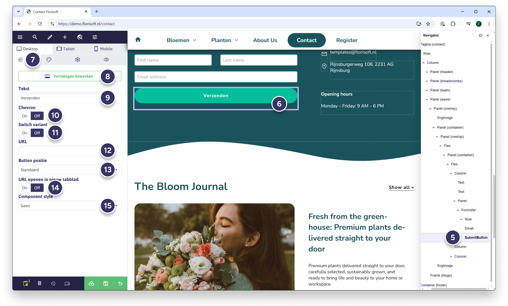
|

---

### Gebruiker

#### Login form

| Onderdeel | Beschrijving |
|---|---|
| Login form | Deze beschrijving wordt aangevuld |

---

#### Debiteur info

| Onderdeel | Beschrijving |
|---|---|
| Debiteur info | Deze beschrijving wordt aangevuld |

---

#### Uw account

| Onderdeel | Beschrijving |
|---|---|
| Uw account | Deze beschrijving wordt aangevuld |

---

#### Accountmanager

| Onderdeel | Beschrijving |
|---|---|
| Accountmanager | Deze beschrijving wordt aangevuld |

---

#### Registratieformulier

| Onderdeel | Beschrijving |
|---|---|
| Registratieformulier | Deze beschrijving wordt aangevuld |

---

### Templates

#### Footer template

| Onderdeel | Beschrijving |
|---|---|
| Footer template | Deze beschrijving wordt aangevuld |

---

### Geavanceerd

#### Iframe

| Onderdeel | Beschrijving |
|---|---|
| Iframe | Deze beschrijving wordt aangevuld |

---

#### Blog

| Onderdeel | Beschrijving |
|---|---|
| Blog | Deze beschrijving wordt aangevuld |

---

#### Category overview

| Onderdeel | Beschrijving |
|---|---|
| Category overview | Deze beschrijving wordt aangevuld |

---

#### Frame

| Onderdeel | Beschrijving |
|---|---|
| Frame | Deze beschrijving wordt aangevuld |

---

#### Custom

| Onderdeel | Beschrijving |
|---|---|
| Custom | Deze beschrijving wordt aangevuld |

---

#### Keuze component

| Onderdeel | Beschrijving |
|---|---|
| Keuze component | Deze beschrijving wordt aangevuld |

---

#### Button (Keuze)

| Onderdeel | Beschrijving |
|---|---|
| Button (Keuze) | Deze beschrijving wordt aangevuld |

---

#### Lottie player

| Onderdeel | Beschrijving |
|---|---|
| Lottie player | Deze beschrijving wordt aangevuld |

---

#### Suggestions

| Onderdeel | Beschrijving |
|---|---|
| Suggestions | Deze beschrijving wordt aangevuld |

---

### Dashboard

#### Chart

| Onderdeel | Beschrijving |
|---|---|
| Chart | Deze beschrijving wordt aangevuld |

---

#### Piechart

| Onderdeel | Beschrijving |
|---|---|
| Piechart | Deze beschrijving wordt aangevuld |

---

#### Gauge

| Onderdeel | Beschrijving |
|---|---|
| Gauge | Deze beschrijving wordt aangevuld |

---

#### Table view

| Onderdeel | Beschrijving |
|---|---|
| Table view | Deze beschrijving wordt aangevuld |

---

#### Progressbar

| Onderdeel | Beschrijving |
|---|---|
| Progressbar | Deze beschrijving wordt aangevuld |

---

#### Dashboard view

| Onderdeel | Beschrijving |
|---|---|
| Dashboard view | Deze beschrijving wordt aangevuld |

---

#### Embedded dashboard

| Onderdeel | Beschrijving |
|---|---|
| Embedded dashboard | Deze beschrijving wordt aangevuld |

---

#### Filter toolbar

| Onderdeel | Beschrijving |
|---|---|
| Filter toolbar | Deze beschrijving wordt aangevuld |

---

#### Searchterm

| Onderdeel | Beschrijving |
|---|---|
| Searchterm | Deze beschrijving wordt aangevuld |

---

#### Query filter

| Onderdeel | Beschrijving |
|---|---|
| Query filter | Deze beschrijving wordt aangevuld |

---

#### Preset value filter

| Onderdeel | Beschrijving |
|---|---|
| Preset value filter | Deze beschrijving wordt aangevuld |

---

#### Query filter date

| Onderdeel | Beschrijving |
|---|---|
| Query filter date | Deze beschrijving wordt aangevuld |

---

#### Query variable

| Onderdeel | Beschrijving |
|---|---|
| Query variable | Deze beschrijving wordt aangevuld |

---

### Health

#### Health chart

| Onderdeel | Beschrijving |
|---|---|
| Health chart | Deze beschrijving wordt aangevuld |

---

#### Health check

| Onderdeel | Beschrijving |
|---|---|
| Health check | Deze beschrijving wordt aangevuld |

---

#### Health errors

| Onderdeel | Beschrijving |
|---|---|
| Health errors | Deze beschrijving wordt aangevuld |

---

#### Health gauge

| Onderdeel | Beschrijving |
|---|---|
| Health gauge | Deze beschrijving wordt aangevuld |

---

#### Health log

| Onderdeel | Beschrijving |
|---|---|
| Health log | Deze beschrijving wordt aangevuld |
