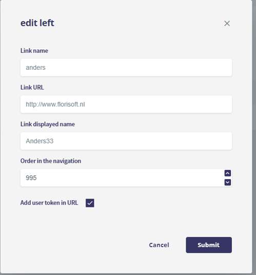

# Florisoft manual CMS Link to External system

Florishop offers functionality to create a navigation button with a login link to an external site.

This works by creating a CMS item that links to an external page. The link used contains a usertoken and an initialization vector (UTIV).
The usertoken contains encrypted debtor information, encrypted using the DES algorithm. The UTIV together with a secret key can be used to decrypt the debtor information.
You can manage the secret key via a webshop setting.

*Follow the steps below to configure such a link:*

|Step|Explanation|
|:--|:--|
|**1**|Log into your Florishop and go into management mode and go the Webshop settings.

<b>Click here for your example image!</b>

|
|**2**|In the webshop settings, search for the setting **USERTOKENKEY**.

<b>Click here for your example image!</b>

|
|**3**|Set the textbox "**Waarde**" to a secret string with the length of sixteen characters. This needs to be exactly 16 characters long, if it is any shorter/longer it won't work.

<b>Click here for your example image!</b>

|
|**4**|Authorize the setting change by filling in your administrator password, save the changes.|
|**5**|Go back to the homepage by clicking on the **Home** button.|
|**6**|Go to the link settings under **CMS** → **LINKS**.

<b>Click here for your example image!</b>

|
|**7**|Create a new link by clicking on the **+** icon

<b>Click here for your example image!</b>

|
|**8**|The following fields need to be filled out: **Link name**: the name of the link item shown in the settings menu. **Link display name**:  the name shown on your Florishop **Link URL**: the link to the website you are linking to. **Add user token in URL**: enable this setting.

<b>Click here for your example image!</b>

 The usertoken will be added only if: The "Add user token in URL" checkbox is checked. A key has been added in the web setting USERTOKENKEY (this key is exactly 16 characters long - otherwise the usertoken will not be able to be determined correctly).|
|**9**|A link with usertoken has the following form: &nbsp; http://www.florisoft.nl/?usertoken=aWgOWmnUeOTMxW4-rSPYk6bfq31XMe4oRfG8p8uLn101&utiv=f6TVH9WXr-s1 - Your new link will now be visible in your Florishop navigation bar to a logged in user.

<b>Click here for your example image!</b>

|
|**10**|Clicking on this link will now result in the given URL having the USERTOKEN and UTIV being appended to it as a query string (after the question mark).

<b>Click here for your example image!</b>

|

## Decrypting the debtor information

Two parameters are added:
- Usertoken contains the encrypted debtor info (debtor number & debtor name, with a space between the two outputs)
- Utiv contains a so-called IV (initialization vector) which is needed (together with the key from the web setting) to decrypt the encrypted debtor info.

For encrypting the debtor information we use the Triple DES algorithm.

We use the value from the USERTOKENKEY setting as the secret key, and the utiv value from the URL as the initialization vector.

Furthermore, Base64 encoding was also applied to both parameters with an additional replacement/deletion (+ and / replaced, = removed) of certain characters to make it more suitable for the URL.

|Step|Explanation|
|:--|:--|
|**1**|In the values from the two parameters, replace the following characters: '-' with '+' and '_' with '/'.|
|**2**|Add Base64 padding. This involves adding the '=' character a number of times after the value of each parameter. The exact number can be read from the last character of each of the parameter values.|
|**3**|Remove the last character from the parameter values (which thus represented the padding number).|
|**4**|Using the previous steps, convert a parameter value such as f6TVH9WXr-s1 to: f6TVH9WXr +s= .|
|**5**|Strip both parameter values of the Base64 encoding.|
|**6**|Use the Triple DES algorithm (cbc) to decrypt the usertoken value using the edited utiv and USERTOKENKEY values.|

An example of how the parameter values can be decrypted in PHP:

<b>Click here for your example image!</b>

