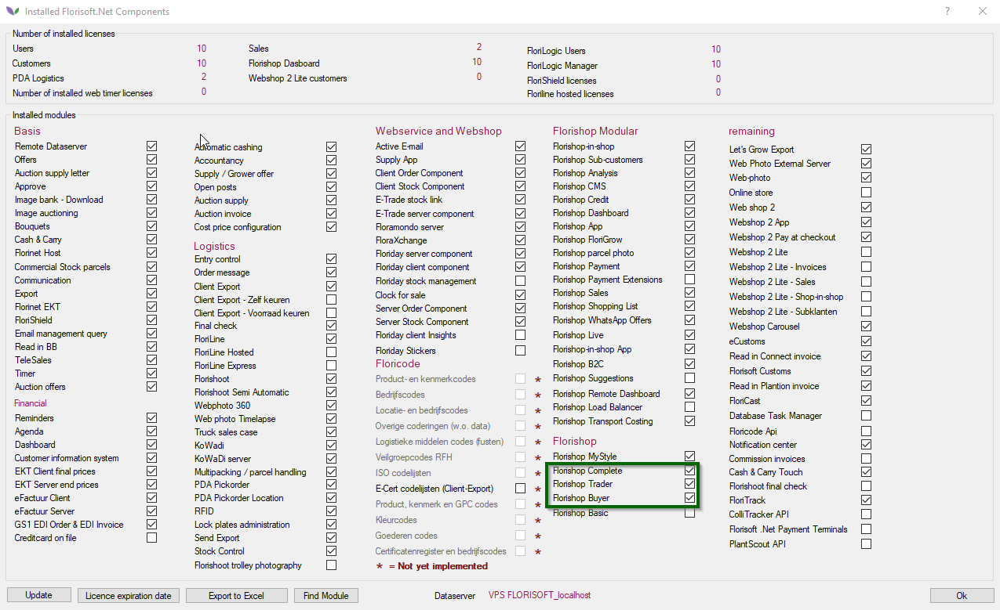
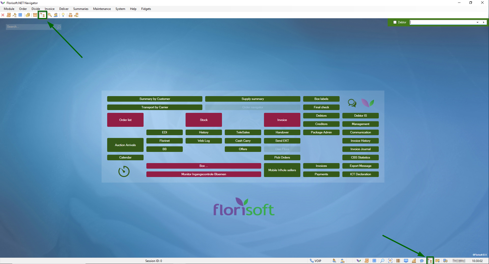

# Florisoft manual Setting up Debtors, Stocks & Order lists (Webshop)

Welcome to the Florisoft manual that deals with authorizing debtors, stocks and order lists for the Webshop. The manual is divided into a number of chapters.

After this introduction, chapter two describes a number of settings that must be set/checked in advance. Chapter three is about the settings you make with the debtor, so that he can access the Webshop.

Chapters four and five deal with the steps that must be taken to open stocks and order lists.

The last chapter, chapter six, describes the Webshop modules, such as invoice history, open items and overview of orders.

**Note: Images in this manual may differ slightly from what you see on your own screen.**

## Table of contents

[Setup debtor](#Setup-debtor)
[Financial](#Financial)
[Internet access](#Internet-access)
[Authorize stock](#Authorize-stock)
[Authorize stock option 1 - from debtor](#Authorize-stock-option-1---from-debtor)
[Authorize stock option 2 - from stock](#Authorize-stock-option-2---from-stock)
[Authorize order lists](#Authorize-order-lists)
[Authorize order lists option 1 -from debtor](#Auhtorize-order-lists-option-1---from-debtor)
[Authorize order lists option 2 - from the debtor from the webshop](#Authorize-order-lists-option-2---from-the-debtor-from-the-webshop)
[Webshop modules](#Webshop-modules)
[Modules](#Modules)

A number of settings must be checked in advance. How to check this and which settings they are is described below:
|Step|Explanation|
|:-:|:--|
|**1**|Open the Florisoft navigator and click on the Florisoft logo. This will open a new screen.|
|**2**|Click on the button **Modules**. Check if the folliwng modules are turned on:  -_Florishop Complete_ -_Florishop Trader_ -_Florishop Buyer_

<b>Klik hier voor uw voorbeeld afbeelding</b>

|

## Setup debtor
|Step|Explanation|
|:-:|:--|
|**1**|Open the constants, you do this via the Florisoft navigator (#1) 

<b>Klik hier voor uw voorbeeld afbeelding</b>

|
|**2**||
|**3**||
|**4**||
|**5**||