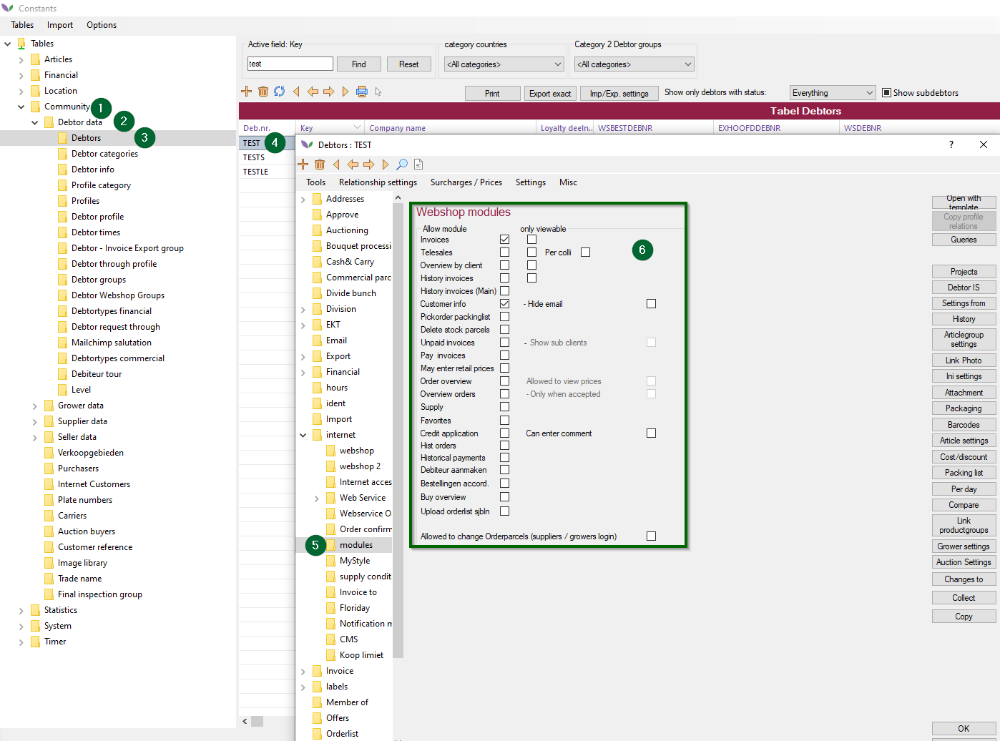

# Florisoft manual Setting up Debtors, Stocks & Order lists (Webshop)

Welcome to the Florisoft manual that deals with authorizing debtors, stocks and order lists for the Webshop. The manual is divided into a number of chapters.

After this introduction, chapter two describes a number of settings that must be set/checked in advance. Chapter three is about the settings you make with the debtor, so that he can access the Webshop.

Chapters four and five deal with the steps that must be taken to open stocks and order lists.

The last chapter, chapter six, describes the Webshop modules, such as invoice history, unpaid invoices and overview of orders.

**Note: Images in this manual may differ slightly from what you see on your own screen.**

## Table of contents

[Setup debtor](#Setup-debtor)
[Financial](#Financial)
[Internet access](#Internet-access)
[Authorize stock](#Authorize-stock)
[Authorize stock option 1 - from stock](#Authorize-stock-option-1---from-stock)
[Authorize stock option 2 - from debtor](#Authorize-stock-option-2---from-debtor)
[Authorize order lists](#Authorize-order-lists)
[Authorize order lists option 1 - from the debtor from the webshop](#Authorize-order-lists-option-1---from-the-debtor-from-the-webshop)
[Authorize order lists option 2 -from debtor](#Auhtorize-order-lists-option-2---from-debtor)
[Webshop modules](#Webshop-modules)
[Modules](#Modules)

A number of settings must be checked in advance. How to check this and which settings they are is described below:
|Step|Explanation|
|:-:|:--|
|**1**|Open the Florisoft navigator and click on the Florisoft logo. This will open a new screen.|
|**2**|Click on the button **Modules**. Check if the folliwng modules are turned on:  -_Florishop Complete_ -_Florishop Trader_ -_Florishop Buyer_

<b>Klik hier voor uw voorbeeld afbeelding</b>

|

## Setup debtor
|Step|Explanation|
|:-:|:--|
|**1**|Open the constants, you do this via the Florisoft navigator (#1) 

<b>Klik hier voor uw voorbeeld afbeelding</b>

|
|**2**|in the structure of the constants screen, navigate to: -Community and then Debtor data and then debtors. the debtors will show in the screen on the right side

<b>Klik hier voor uw voorbeeld afbeelding</b>

|
|**3**|Then, click on the **+** sign (#5) to create a new debtor|
|**4**|You may see a template selection screen. This can be empty or filled with a number of templates. Choose a template that is relevant to the scenario according to the description. If it is empty, you can press '**Ok**' to create a blank debtor.

<b>Klik hier voor uw voorbeeld afbeelding</b>

|
|**5**|You are now in the debtor creation/setting screen. Fill in the following fields: Deb.Number,  Find,  Company name,  Cont. Person   Email Address

<b>Klik hier voor uw voorbeeld afbeelding</b>

|

## Financial

The following steps are under the tab '*Financial*' 

|Step|Explanation|
|:-:|:--|
|**1**|Click on the tab *Financial*|
|**2**|Fill in the following information: ** VATnr Debtor:** *Fill in the debtor number from the debtor ** Optional: Commerce Number**: *Fill in the KVK/commerce number from the debtor - **Optional Financial debnr** *Enter a number here under which this debtor will be saved in the accounting file* - **Administration** *Here, choose an administration wherein all financial transactions of this debtor will be resgistered

<b>Klik hier voor uw voorbeeld afbeelding</b>

 |
|**3**|Click on the tab **Bank Details** to continue|
|**4**|Fill in the following information:  - **Account** *The debtors bank account* - **IBAN number** *Here goes the IBAN number of the debtor*  - **Optional:** **IBAN bankname** 

<b>Klik hier voor uw voorbeeld afbeelding</b>

|
|**5**|Click on the tab *Internet* to open the map, Then click on the tab **Internet access**

<b>Klik hier voor uw voorbeeld afbeelding</b>

|

## Internet access

The following steps are taking place in the tab: *Internet / Internet access*

|Step|Explanation|
|:-:|:--|
|**1**|Turn on the checkmark *This client has access by means of internet*(#1). This gives the customers access to internet 

<b>Klik hier voor uw voorbeeld afbeelding</b>

|
|**2**|Turn on the checkmark *This client can log in Webshop 3* (#2), this makes sure the customer can log in 

<b>Klik hier voor uw voorbeeld afbeelding</b>

|
|**3**|**Optional** *Login name, fill in a username for this debtor to log into the webshop. As mentioned earlier, this is optional, if the field remains empty, then the log in name is the same as the debtor number (#3)* 

<b>Klik hier voor uw voorbeeld afbeelding</b>

|
|**4**|**Customer password** *Here, fill in a password for he debtor to log in to the webshop. By pressing the generate button, you will create a randomized password. 

<b>Klik hier voor uw voorbeeld afbeelding</b>

|

## Auhorize stock

You authorize debtors for each stock whether they are allowed access. There are two options to set this up:

1. From the user (debtor) settings, setting up which sticks he or she can see.
2. From stock, setting up which users (debtors) have access to this.

## Authorize stock option 2 - from stock
|Step|Explanation|
|:-:|:--|
|**1**|Open the constants and navigate to the following path:   Constants -> Location -> stocks-> stocks 

<b>Klik hier voor uw voorbeeld afbeelding</b>

|
|**2**|Open the stock that you want to be accessible on the webshop. You do thi sby double clicking (#4)

<b>Klik hier voor uw voorbeeld afbeelding</b>

|
|**3**|**Optional** if needed, you can click on 'Add new item' icoon (**+**)(#4)

<b>Klik hier voor uw voorbeeld afbeelding</b>

|
|**4**|**Optional** Do not forget to authorize systemusers for the stock. You do this by navigating to the authorisation tab and double clicking on the systemusers.|
|**5**|In the field 'Stock code', fill in the code you want to use for the stock 

<b>Klik hier voor uw voorbeeld afbeelding</b>

|
|**6**| In the field "Description", fill in the description you want to use for the stock.

<b>Klik hier voor uw voorbeeld afbeelding</b>

|**7**| Now press OK. Re-open the just made stock by double clicking on the stock line.|
|**8**| Navigate to the tab **Webshop**

<b>Klik hier voor uw voorbeeld afbeelding</b>

|
|**9**| Turn on the checkmark *This stock is available on the webshop* (#1)

<b>Klik hier voor uw voorbeeld afbeelding</b>

|
|**10**| Under the opening times, choose the right opening times, if these are not there yet, new ones must be created. You can do this here:   Constants -> System, (#1) -> Days and times (#2) -> Times (#3)

<b>Klik hier voor uw voorbeeld afbeelding</b>

|**11**| **Optional**: *Per language, give a desrciption of the stock under: Description and texts. This will be the description that is visible on the webshop*|
|**12**| Then click on the button *Accessible debtors* (#4) here you can select what debtors can see this stock. This will open the the following screen. 

<b>Klik hier voor uw voorbeeld afbeelding</b>

Here is a leganda that explains the screen that has just opened
|Column|Explanation|
|:--|:--|
|Voorr.| This is the stock (if you hoover over this, you can see a description)
|Debnr.| Debtor number (if you hoover over it with your mouse, you can see the company name)
|Perc| Raised by percentage
|A| Toegang
|R| Read only
|K| Colli sales
|Per VE| Customer can only buy per **V**erkoop (sales) **E**enheid (unit) and not per colli
|PrePerc| First this percentage goes over the price before the Perc goes over

## Authorize stock option 1 - from debtor

|Step|Explanation|
|:-:|:--|
|**1**|Open the constants and navigate to the path":   Community (#1) -> Order listing (#2) -> Order listing (#3)

<b>Klik hier voor uw voorbeeld afbeelding</b>

  ***If you are using a already existing order list, skip step 3 to 6***|
|**3**|Do not forget to authorize systemusers on the stock. You do this by going to the tab **Authorization** and double clicking the systemusers. 

<b>Klik hier voor uw voorbeeld afbeelding</b>

|
|**4**|In the field **List code** (#1) give up the code you want to use for the order list. 

<b>Klik hier voor uw voorbeeld afbeelding</b>

|
|**5**|In the field **Description** (#2) provide a description that will be used for the order list. This description will be visible in Florisoft. 

<b>Klik hier voor uw voorbeeld afbeelding</b>

|
|**6**|Now press OK (#4)|
|**7**|Go to the tab **Internet access** (#5) 

<b>Klik hier voor uw voorbeeld afbeelding</b>

|
|**8**|Turn on the checkmark *This orderlist is visible on the webshop* (#2)

<b>Klik hier voor uw voorbeeld afbeelding</b>

|
|**9**| Choose the opening times under *Opening hours webshop*, if needed you can create these under   Community -> System -> Days and times -> times 

<b>Klik hier voor uw voorbeeld afbeelding</b>

|
|**10**|Click on *Debtors with access* (#4) to setup which debtors can see this order list. The following screen will open 

<b>Klik hier voor uw voorbeeld afbeelding</b>

|

The most important columns will be explained here (fill if needed)

|Column|Explanation|
|:--|:--|
|Voorr.|Order list (if you hoovr over this you will see a description)|
|Debnr|Debtor number (if you hoover over this you will see a company name)|
|Dgn|Amount of days it will take for the customer to see the order|
|Iperc|Raised in percentage|
|A||
|R|Read only (the customer cannot buy)|
|T|telesales, webshop access|
|K|Colli sale|
|Staffel|Set this up for the customer and order list, a raise scale|
|Pre perc|This surcharge is calculated over the price for Iperc|

## Authorize order lists

Per order list, you authorize debtors whether they are granted access. There are two options to set this up: 
1. From the user (debtor) setting up which order lists he or she is allowed to see.
2. From the orderlists, set up which users (debtors) have access to this.

## Authorize order lists option 1 -  from the debtor from the webshop

Follow the steps to authorize an order lists
|Step|Explanation|
|:-:|:--|
|**1**|Open the constants screen and navigate to the folder structure, and go to the following path:   Community-> debtor data-> debtor -> open the specific debtor -> internet -> inetnet access |
|**2**|Click on the button "Accessible orderlists" 

<b>Klik hier voor uw voorbeeld afbeelding</b>

|
|**3**|In this screen, authorize the user to let him work with the correct stocks. The legend can be found in the chapter before this one. 

<b>Klik hier voor uw voorbeeld afbeelding</b>

|

## Authorize order lists option 2 - from debtor

Go through the following steps to authorize the order list:

|Step|Explanation|
|:-:|:--|
|**1**|Open the constants screen by navigating to the following structure:  Locations-> Order listing -> order listing 

<b>Klik hier voor uw voorbeeld afbeelding</b>

|
|**2**|Double click with the left mouse button on the order list that you want to make available on the webshop. If the order lsit des not exist just yet, you can create it by pressing the **+** icon(#4).    **If you are using an already existing order list, skip steps 3 to 6** |
|**3**|Do not forget to authorize system users for this stock. You do this by navigating to the tab Authorization (#3) and double clicking on system users 

<b>Klik hier voor uw voorbeeld afbeelding</b>

|
|**4**|In the field "List code" write the code you want to use for the order list 

<b>Klik hier voor uw voorbeeld afbeelding</b>

|
|**5**|In the field "Description" (#2) fill in the description you want to use for the order list, this is the description that can be seen in Florisoft

<b>Klik hier voor uw voorbeeld afbeelding</b>

|
|**6**| Press OK (#4)|
|**7**|Go to the tab Internet Access (#5) 

<b>Klik hier voor uw voorbeeld afbeelding</b>

|
|**8**|
Turn on the checkmark "This orderlist is visible on the webshop"

<b>Klik hier voor uw voorbeeld afbeelding</b>

|
|**9**|Choose the opening hours on the webshop (#3). If needed you can create them here: Community -> System -> Days and times -> times 

<b>Klik hier voor uw voorbeeld afbeelding</b>

|
|**10**|Click on "Debtors with access" to set up which debtors can see this order list. the following screen will open 

<b>Klik hier voor uw voorbeeld afbeelding</b>

|

The most important columns are described here (fill indeed needed):
|Column|Explanation|
|:--|:--|
|Voorr.| order list (if you hoover over this you will see a description)
|Debnr|Debtor number (if you hoover over this you will see the comnapy name)|
|Dgn|Amount of days it will take before the customer will receive the order|
|Iperc|Raised by percentage|
|A|Access|
|R|Readonly (customer cannot buy)|
|T|Telesales, webshop access|
|K|Kolli sales|
|Staffel|You can select here for the customer and this order list the price tree|
|Pre perc|The raise over the price will be calculated by the Iperc|

|Optional:| Navigate to the General tab. Specify - per language - the description of the order list under: Description per Language. This is the description that is visible on the Webshop.|

## Webshop modules

Follow the steps:

|Step|Explanation|
|:-:|:--|
|**1**|Open the constants and go to the following path: Community -> Debtor data -> debtors -> open the specific debtor 

<b>Klik hier voor uw voorbeeld afbeelding</b>

|
|**2**|In the just opened scren, navigate to the tab "Modules", this can be found under the tab "Internet"

<b>Klik hier voor uw voorbeeld afbeelding</b>

|
|**3**|In the following chapter, every module will be shortly explained. Not every module is as relevant, so the most important ones will be explained|

### Modules

This chapter briefly describes some modules that are relevant to this manual.

### Invoices

The '*Invoices*' checkbox gives the debtor access to his historical debtors in the webshop.

<b>Klik hier voor uw voorbeeld afbeelding</b>

### Overview by customer, Invoice history, Invoice history (Main)

These three modules are related to the first module, Invoices. Enable these three modules together with the Invoices module to give the customer access to his current invoices and unpaid invoices.

### Pending payments (Unpaidinvoices), paying pending payments 

These two modules ensure that the customer can view and pay for his unpaid invoices via the webshop. Paying unpaid invoices via the webshop is only possible when the Florisoft Payment module is active at the relevant customer. In order to be able to view and pay unpaid invoices, the checkboxes Invoices, Overview per customer, Invoice history, Invoice history (Main) must also be selected.

<b>Klik hier voor uw voorbeeld afbeelding</b>

### Order overview, Order overview and Hist orders

<b>Klik hier voor uw voorbeeld afbeelding</b>

### Supply

The Supply module is used by grower companies to offer trade via the webshop to a processing company.

<b>Klik hier voor uw voorbeeld afbeelding</b>

### Credit Request

The Credit request module offers the customer the possibility to make credit requests via the webshop.

<b>Klik hier voor uw voorbeeld afbeelding</b>

Click on the 'Ok' button to change the settings in the debtor screen.

<b>Klik hier voor uw voorbeeld afbeelding</b>

