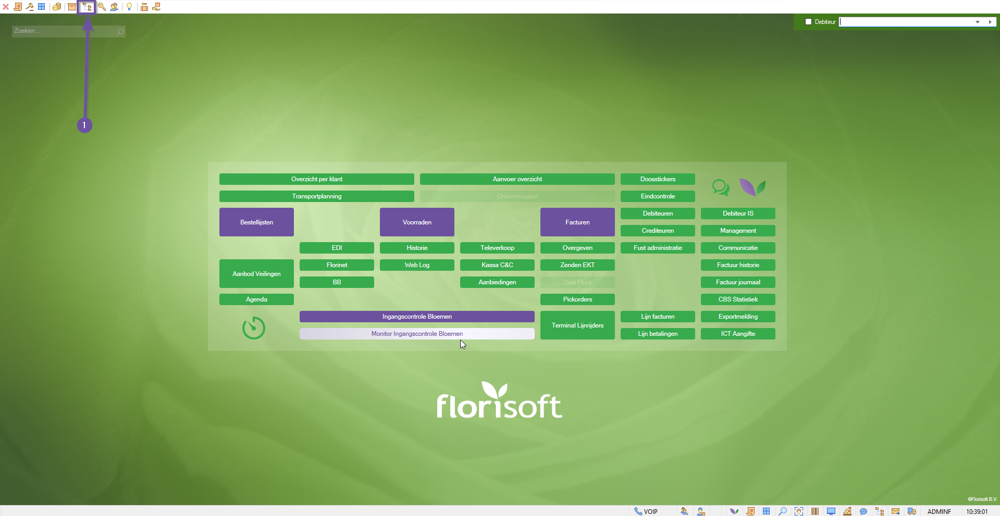
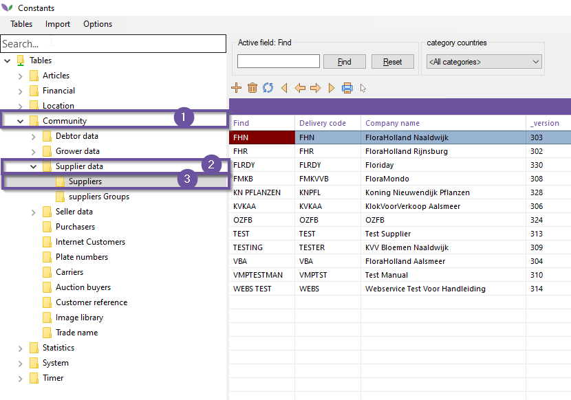
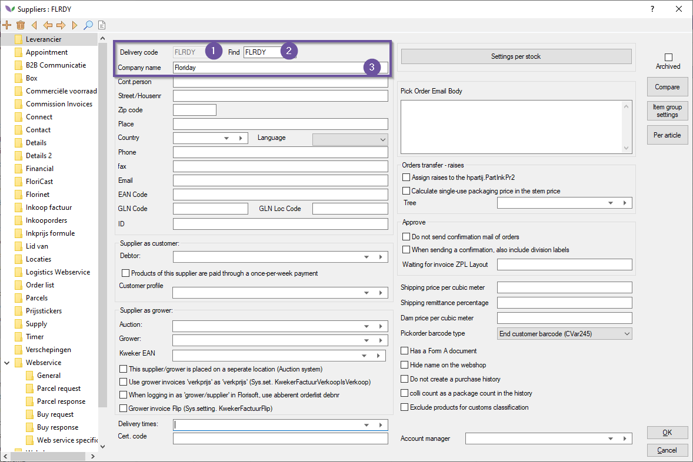
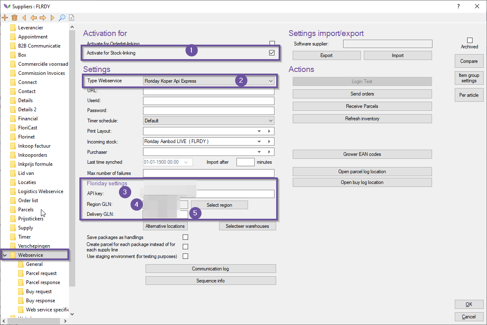
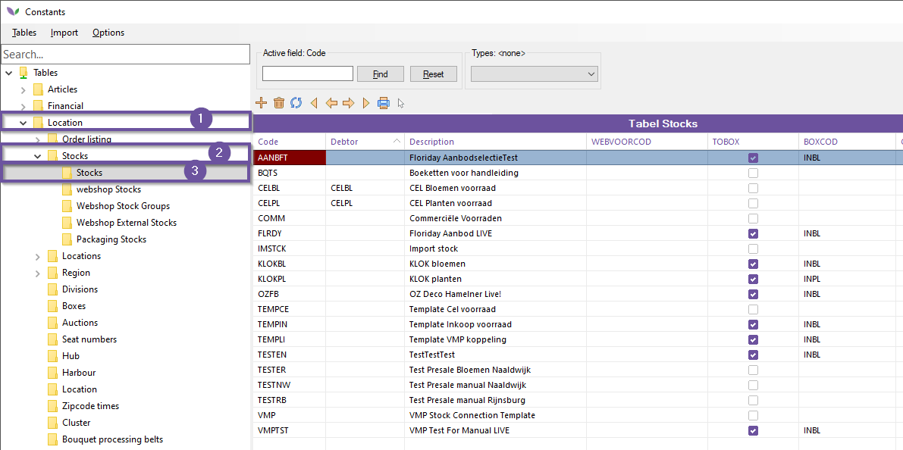
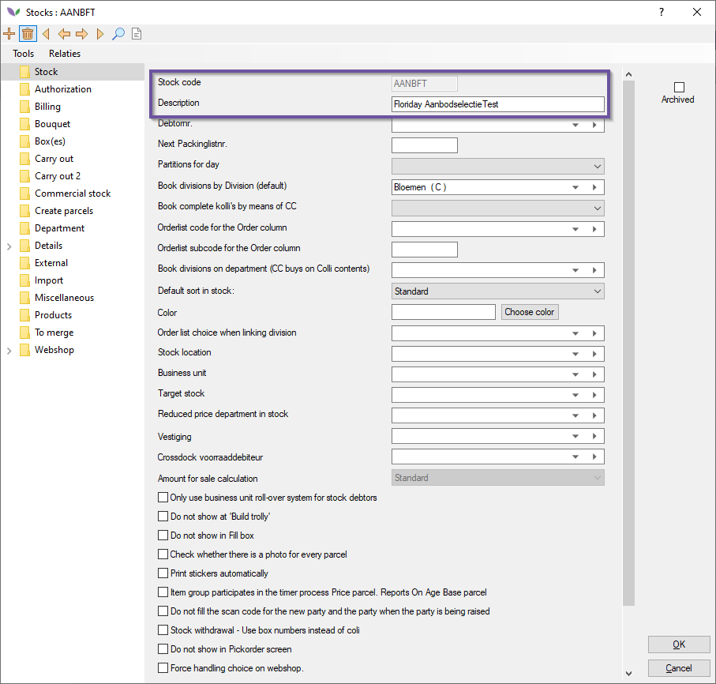
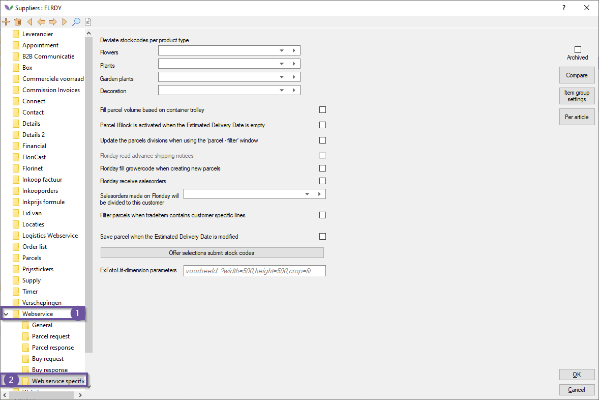
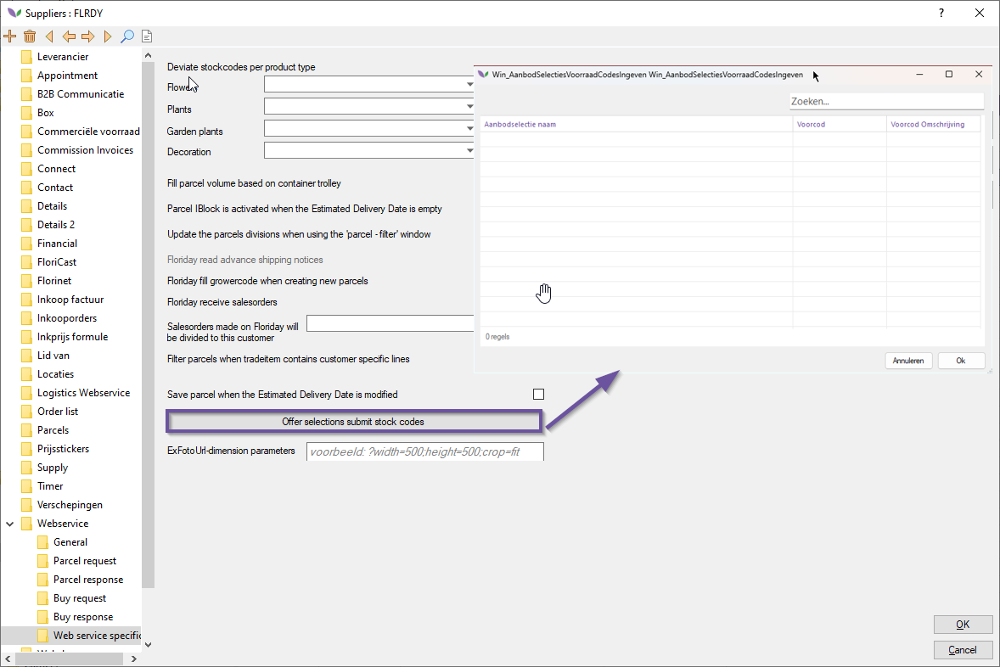

# Florisoft Manual Floriday TradeItemGroupSelection (M231)

This manual covers the usage and setup of the Florisoft TradeItemGroupSelection module, with this functionality you will be able to import Floriday supplyselections as separate stocks. 

Supply selections are made in the Floriday portal based on stuff like product types, buyers, special selections or country. Making the supply selections themselves isn't covered in this manual as it is outside of the Florisoft application. Floriday themselves have a manual for this which can be found [here](https://helpcenter-customers.floriday.com/en/articles/8856186-explorer-supply-selections).

What you will learn in this manual is how you link a stock to a supplyselection. It is important to know that a stock parcel can be in mulitple stocks at once when read from multiple supply selections. 

## Requirements

Before you start implementing the functionalities of this module you'll need to make sure that your Florisoft license contains the TradeItemGroupSelection module. 

Also make sure that there is atleast one supplyselection in Floriday.

## Steps

To implement the importing of supplyselections you will need to follow the steps below :

### Creating a Floriday Supplier

*These steps are only to be followed if there <u>is no Floriday supplier</u> already present in your system.*

|Stap|Uitleg|
|:-:|:--|
|**1**|Open the constants from the Florisoft Navigator (#1)

<b>Click here for the example image!</b>

|
|**2**|In the constant's file structure you'll need to navigate to : **community→supplier data→suppliers**

<b>Click here for the example image!</b>

|
|**3**|Create a new supplier, fill out the following fields :  **Delivery code** : *give this the value of "*FLRDY*". **Find** : once again enter the value "*FLRDY*". **Company name** : give this value "*Floriday*".

<b>Click here for the example image!</b>

|
|**4**|Close and save the newly created supplier.|
|**5**|Reopen the supplier, and navigate to the tab : **webservice**.

<b>Click here for the example image!</b>

|
|**6**|Enable the checkbox **activate for stock-linking**.|
|**7**|Under the tab **Settings** select the value *Floriday Koper API Express* for the dropdown **Type Webservice**

<b>Click here for the example image!</b>

|
|**8**|Fill out the following settings under the heading **Floriday settigns** :  **API Key** : *enter the Floriday API key*. **Region GLN** : enter the region GLN for your company **Delivery GLN** : enter the GLN delivery location for your company.

<b>Click here for the example image!</b>

|
|**9**|Close and save the made changes by clicking on Ok.|

### Creating the necessary stocks

*Follow these steps to create the stocks that the supply selections will be read into :*

|Stap|Uitleg|
|:-:|:--|
|**1**|Open the constants from the Florisoft navigator : |
|**2**|In the constant's file structure navigate to : **Locations→Stocks→Stocks**.

<b>Click here for the example image!</b>
</details|
|**3**|Create a new stock and fill out the following fields :  **Stock code** : unique identifier for the stock **Description** : name/description of the stock

<b>Click here for the example image!</b>
</details|
|**4**|After filling out these fields save and close the newly created stock.|
|**5**|Repeat the last two steps for each Floriday supply selection.|

### Supply selections setting

|Stap|Uitleg|
|:-:|:--|
|**1**|Open the constants and open your Floriday supplier : **Community→Supplier data→Supplier**

<b>Click here for the example image!</b>
</details|
|**2**|In the supplier card and navigate to the following path : **Webservice→Webservice specific**

<b>Click here for the example image!</b>
</details|
|**3**|Click on the **Offer selections submit stock codes**, this opens a new window in which you'll see your Floriday account's Supply Selections. Now you'll need to match each supply selection to a unique stock (code).

<b>Click here for the example image!</b>
</details|
|**4**|Save your changes by clicking on **Ok**.|
|**5**|Close the Supplier and save the changes by clicking on **Ok**.|