# Handleiding PDA configuratie

## 1. Inleiding

Welkom bij de handleiding PDA configuratie. Deze handleiding beschrijft de benodigde stappen om een remote desktop verbding (RDP) naar een Florisoft server op te zetten.

PDA's worden in Florisoft voor verschillende toepassingen gebruikt. Denk hierbij aan mobiele verkoop, binnenmelden, voorraadcontrole, locatiescannen en eindcontrole.

Om deze functies te gebruiken moet er een verbinding gemaakt worden tussen de PDA en de server. Hiervoor is het noodzakelijk om bepaalde instellingen te configureren op de PDA en de server.

De benodigde instellingen verschillen per type apparaat en serverversie. Hieronder worden deze instellingen beschreven in combinatie met een aantal veelgebruikte typen PDA's en serverversies.

Na deze inleiding wordt in hoofdstuk twee uitgelegd hoe de Skorpio X5 te verbinden met verschillende serverversies.

Hierna wordt dezelfde uitleg beschreven voor een Zebra TC25 PDA. 

## 2. Instellen environment settings 
Vanwege veiligheidsascpecten is het aan te raden dat een PDA gebruiker alleen toegang heeft tot Florisoft. Toegang tot overige delen van de server dient zoveel als mogelijk beperkt te worden om eventuele schade aan de server te voorkomen.

Om bovengenoemde situatie voor elkaar te krijgen moet er een aantal instellingen gedaan worden op de (domein)gebruiker accounts van de PDA gebruikers.

1. Login op de server waar de gebruikeraccounts worden aangemaakt. In de meeste gevallen is dit een domein controller (DC). 

2. Open de betreffende PDA gebruiker, bijvoobeeld PDA01 of HT01 door te dubbelklikken op de naam. Het eigenschappen venster opent. Zie onderstaand screenshot:

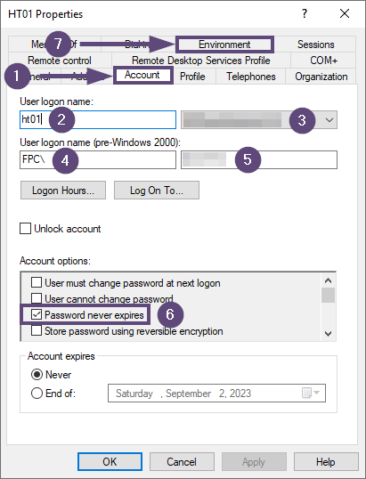

3. Open het Account tabblad. (nr. 1) 

4. Vul in het veld User logon name: de gebruikersnaam in van de gebruiker. (nr. 2)

5. Selecteer het betreffende domein in de naastgelegen dropdown. (nr. 3) 

6. Vul in het veld User logon name (pre-Windows 2000): het juiste domein in. (nr. 4)

Hoe vind ik de juiste domeinnaam? Dit is afhankelijk van het type cloud omgeving. Zie onderstaand voor een overzicht van de meest voorkomende cloud omgevingen die gebruikt worden in combinatie met Florisoft:

**Reset:** FPC\
**Reset (private cloud):** FSPC\
**Axxon:** FLORISOFTCLOUD\
**Auton:** FLORICLOUD\
**BMP:** FLORISOFT-CLOUD

7. Vul in het naast gelegen veld de waarde [gebruikersnaam_klantcode] in. (nr. 5) 

8. Zet het vinkje Password never expires aan in het gedeelte Account options: (nr. 6) 

9. Klik op het tabblad Environment. (nr. 7) 

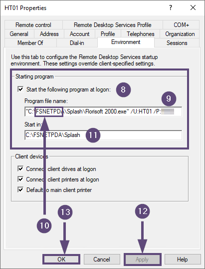

10. Zet het vinkje Start the following program at logon: aan. (nr. 8) 

11. Vul in het veld Program file name: het pad in naar de betreffende Florisoft 2000.exe. (nr. 9)

>**Let op: vergeet niet om de parameters /U: en /P: toe te voegen achter de sluitende apostrof na Florisoft 2000.exe. Geef deze parameters als waarden de gebruikersnaam en het wachtwoord van de betreffende Florisoft PDA gebruiker. Dit zorgt ervoor dat deze Windows gebruiker gekoppeld zit aan een specifieke PDA gebruiker in Florisoft.**

De standaard werkwijze wat betreft PDA's in Florisoft is dat deze gebruik maken van hun eigen client map. Deze mappen hebben vaak namen als FSNETHT, FSNETPDA, of een variant hierop gevolgd door een volgnummer: FSNETHT01, FSNETPDA02, etc. (nr. 10)

12.  Vul in het veld Start in (nr. 11) dezelfde waarde in als in het Program file name veld. (nr. 9) Verwijder alles na Splash\. 

13. Klik op de knop Apply (nr. 12) om de instellingen op te slaan. 

14. Klik op de knop OK (nr. 13) om het eigenschappen venster van de gebruiker te sluiten.

Herhaal de stappen twee tot en met veertien voor iedere PDA gebruiker op de sever.

>**Let op: in sommige gevallen kan het noodzakelijk zijn om extra registersleutels toe te voegen aan het register van de RDS en de DC. Dit is nodig om bij het inloggen van de PDA gebruiker automatisch exe's te kunnen starten. Dit mag alleen gedaan worden door ervaren IT personeel. Deze situatie komt alleen voor vanaf Windows Server 2019 en hoger.**

>**Details: https://www.chicagotech.net/WordPress/2022/01/24/remote-desktop-services-starting-program-problem-on-windows-2016-and-2019-server/**

## 3. Skorpio X5
Het eerste type apparaat is de Datalogic Skorpio X5. Deze PDA heeft een fysiek toetsenbord. Zie onderstaande foto voor een voorbeeld:

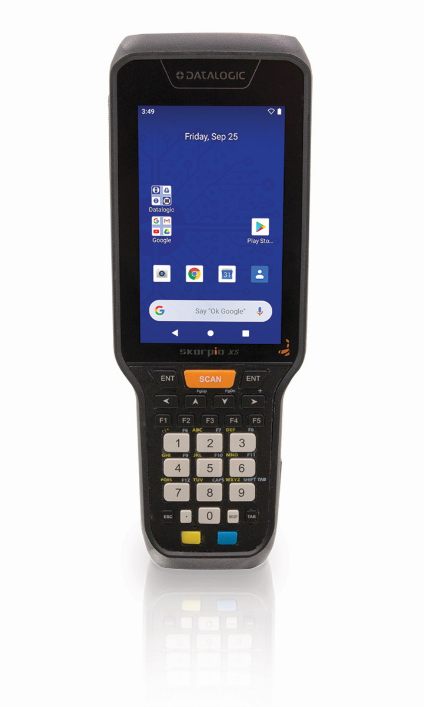

>**Let op: bovenstaande afbeelding kan enigzins afwijken van het apparaat van de gebruiker.**

### 3.1 Instellen RDP verbinding Reset florisoftcloud
In deze paragraaf worden de stappen beschreven voor het instellen van een rdp verbinding naar een Reset server in het florisoftcloud domein. Hiervoor wordt gebruik gemaakt van de Remote Desktop Manager app.

1. Open de Remote Desktop Manager app door op het icoon te drukken. (nr. 1)

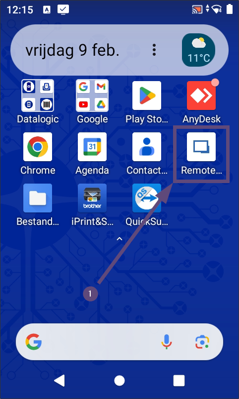

De Remote Desktop Manager app start. Wacht een paar seconden.

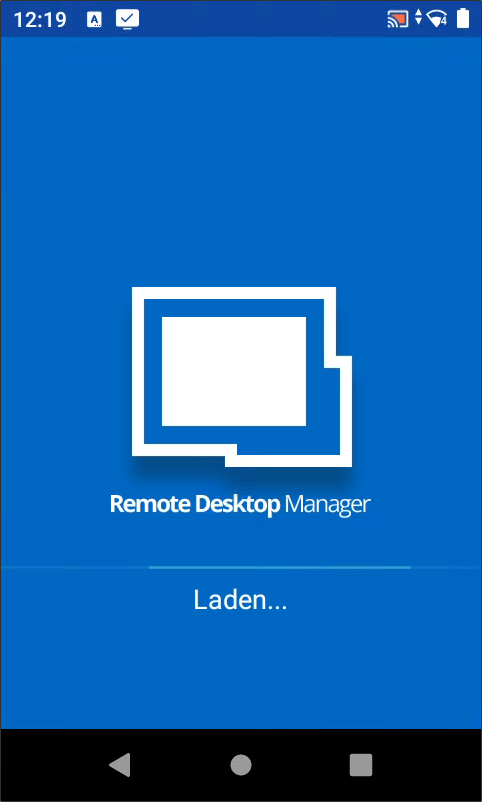

Het startscherm van de app verschijnt nadat het laden voltooid is.

2. Druk op het + icoon in de rechter benedenhoek van het scherm. (nr. 2)

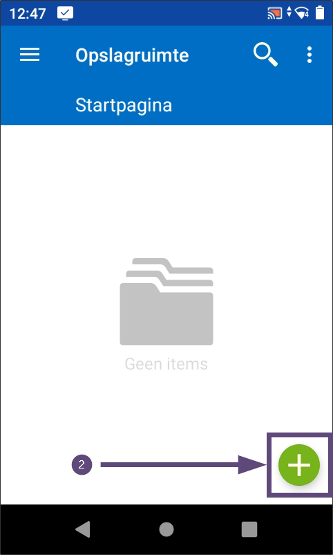

3. Kies voor de RDP (Microsoft Remote Desktop) optie. (nr. 3)

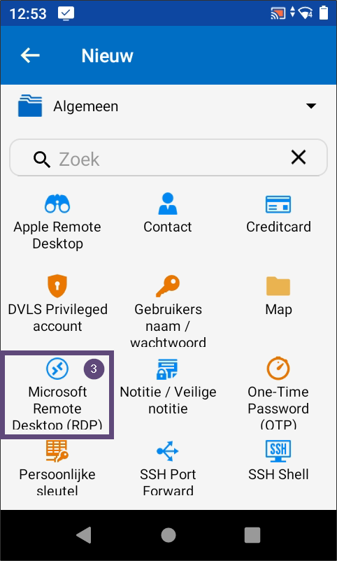

Het scherm voor het toevoegen van een nieuw rdp profiel verschijnt. Zie onderstaand screenshot.

4. Vul in het veld Naam (nr. 4) een beschrijvende naam in voor de nieuwe verbinding. 

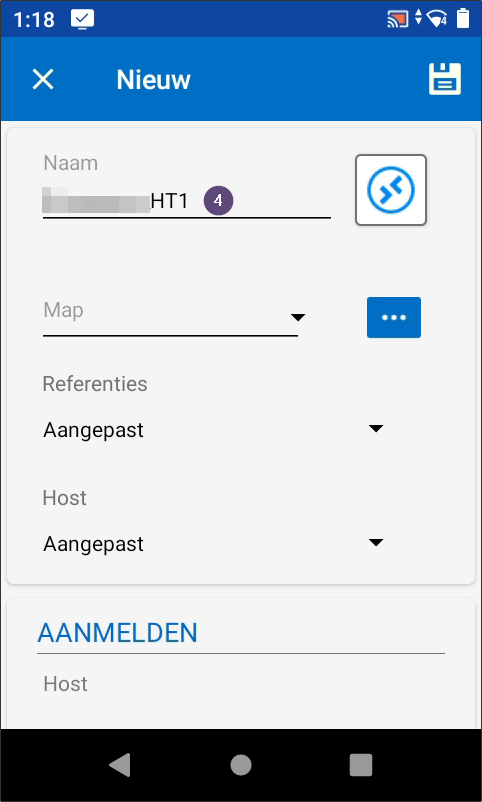

Scroll naar beneden naar het gedeelte AANMELDEN. 

6. Vul in het Host veld de interne servernaam van de server waarmee verbonden gaat worden. Reset servers volgen vaak een naamgeving in de trant van RDS[nummer]. 

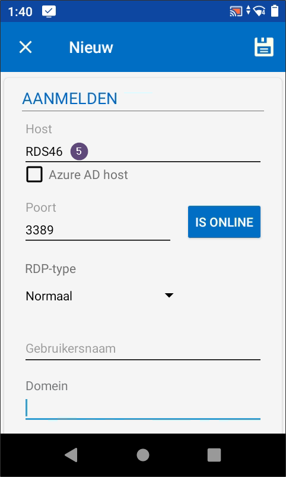

De interne server naam kan gevonden worden door met de **rechtermuisknop** te klikken op de start knop en te kiezen voor Systeem in het context menu.

The internal name of the sever can be found by **right** clikcing the start button and choose the option Systeem in the contextmenu.

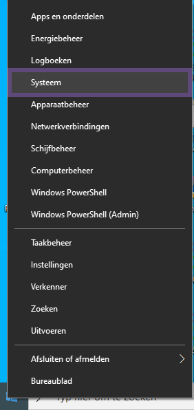

Het instellingen scherm opent. Hier is de interne naam van de server terug te vinden:

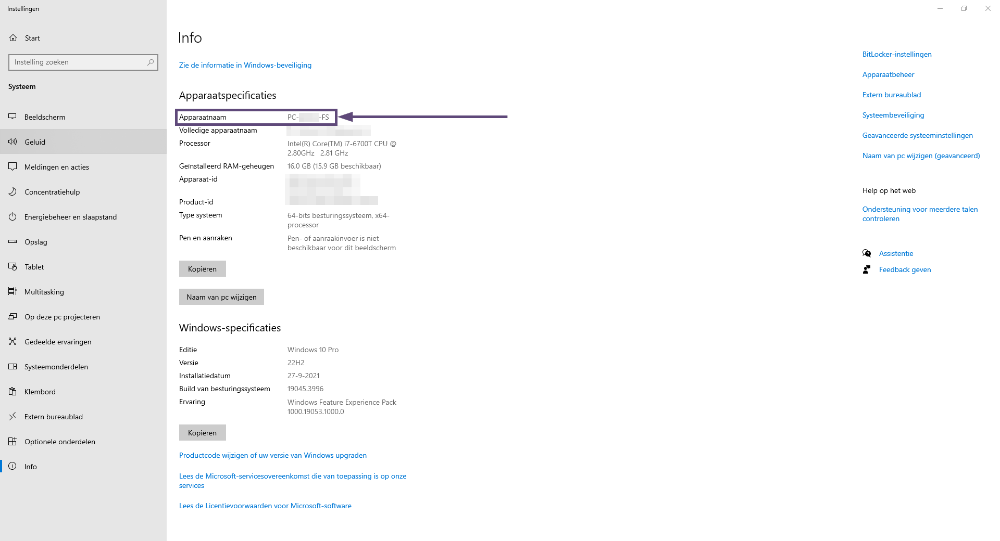

7. Vul in het veld Poort het juiste poortnummer (3389) in. (nr. 6) 

8. Vul in het veld Gebruikersnaam de gebruikersnaam in van de betreffende PDA. (nr. 7)

>**Let op: vervang het @ teken in de gebruikersnaam met een underscore (_) teken. Voeg geen domein toe achter de gebruikersnaam.**

9. Vul het domein (fpc voor florisoftcloud.com of fspc voor private cloud omgevingen) in het Domein veld in. (nr. 8)

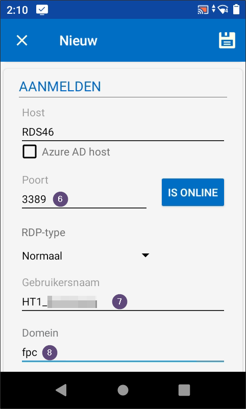

Scoll naar beneden tot het Wachtwoord veld zichtbaar wordt. 

10. Vul in het veld Wachtwoord het wachtwoord in. (nr. 9)

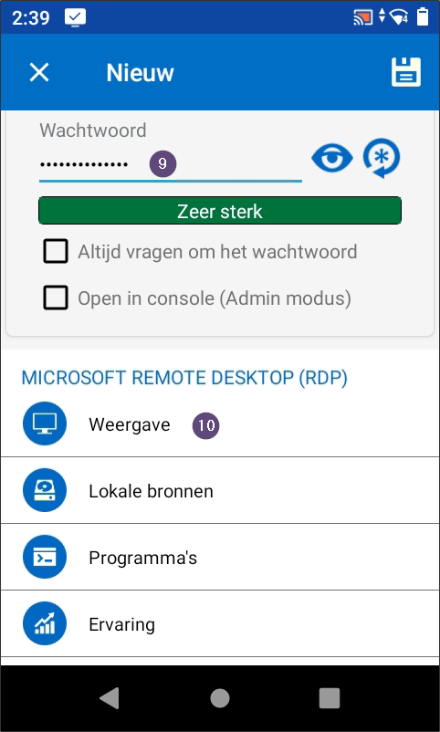

11. Druk op Weergave om de weergave instellingen te openen. (nr. 10) 

12. Druk op het zwarte pijltje rechts naast Standaard (nr. 11) om een aangepaste schermgrootte in te stellen voor de verbinding. 

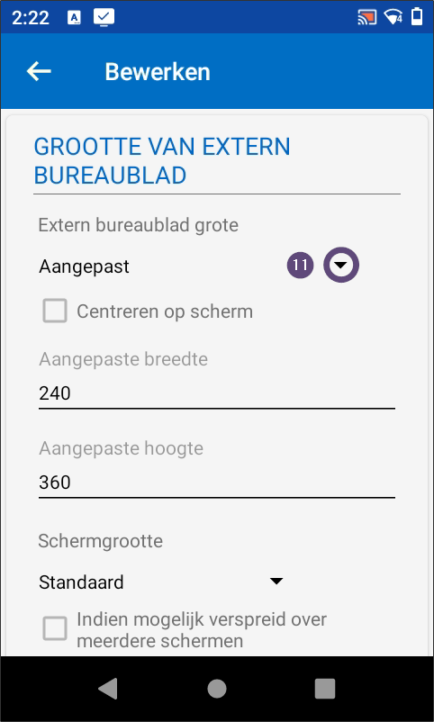

Een pop-up scherm verschijnt met verschillende gangbare resoluties. Scroll in deze lijst naar beneden tot de optie Aangepast verschijnt:

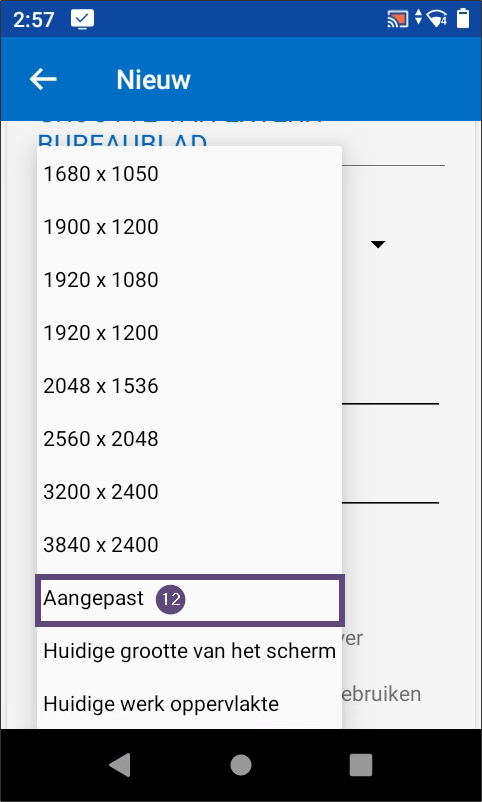

13. Druk op Aangepast om een eigen resolutie in te kunnen stellen. (nr. 12) 

14. Vul in het veld Aangepaste breedte de waarde 240 in. (nr. 13) 

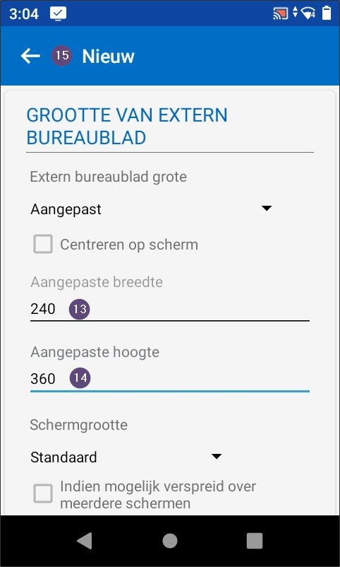

15. Vul in het veld Aangepaste hoogte de waarde 360 in. (nr. 14) 

Druk op de links wijzende pijl links bovenin het scherm om terug te keren naar het scherm Nieuw. (nr. 15) 

16. Scroll naar beneden naar de optie Lokale bronnen en druk hierop. (nr. 16)

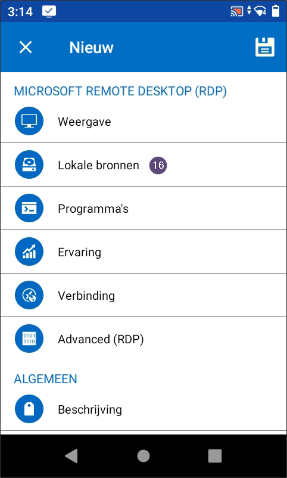

17. Scroll in het scherm helemaal naar beneden en zet het vinkje Klembord uit. (nr. 17)

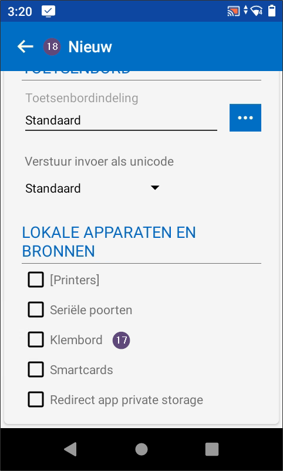

18. Druk op de links wijzende pijl links bovenin het scherm om terug te keren naar het scherm Nieuw. (nr. 18) 

19. Scroll naar beneden en druk op de optie Ervaring. (nr. 19)

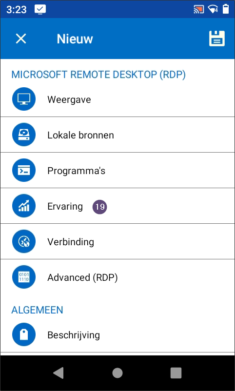

20. Controleer of het instellingen profiel ingesteld staat Standaard. (nr. 20)

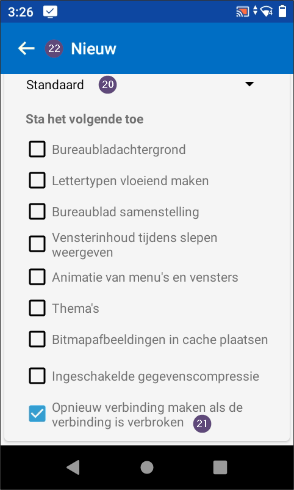

21. Zorg ervoor dat alle vinkjes onder Sta het volgende toe **uit** staan behalve het vinkje Opnieuw verbinding maken als de verbinding is verbroken. (nr. 21) 

22.  Druk op de links wijzende pijl links bovenin het scherm om terug te keren naar het scherm Nieuw. (nr. 22) 

23. Druk op de optie Verbinding om deze te openen. (nr. 23)

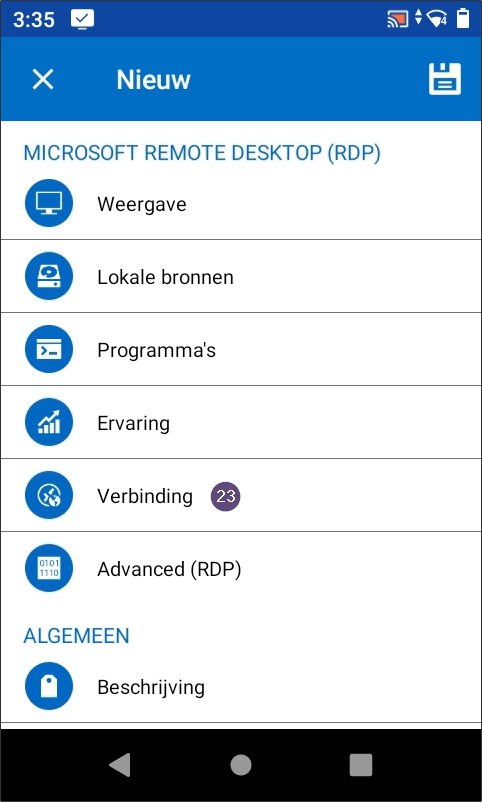

Scroll iets naar beneden.

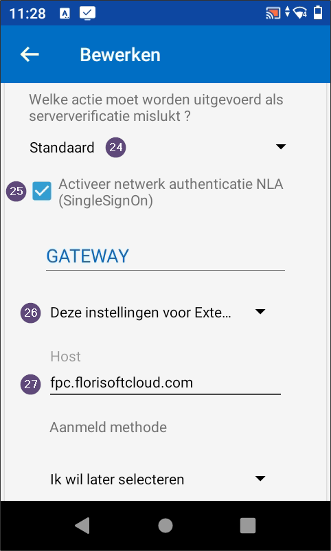

24. Zorg ervoor dat de waarde onder Welke actie moet worden uitgevoerd als serververificatie mislukt? ingesteld staat op Standaard. (nr. 24) 

25. Activeer het vinkje Activeer netwerk authenticatie NLA (SingleSignOn) (nr. 25) 

26. Kies onder GATEWAY voor de waarde Deze instellingen voor Extern bureaublad-gatewayserver gebruiken. (nr. 26) 

27. Vul in het veld Host de waarde fpc.florisoftcloud.com in. (nr. 27) 

Scroll verder naar beneden tot onderstaande instellingen zichtbaar worden. 

28. Klik op de knop REFERENTIES LIJST... (nr. 28) 

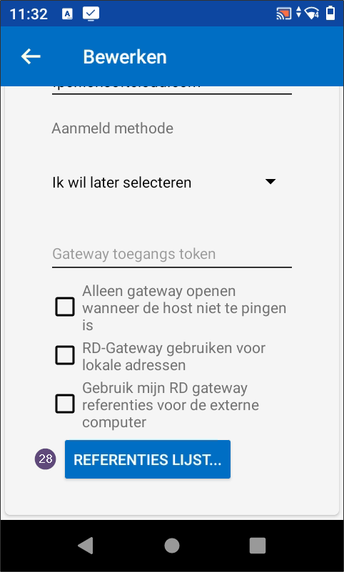

29. Kies voor de optie Gebruik aangepaste referenties. (nr. 29)

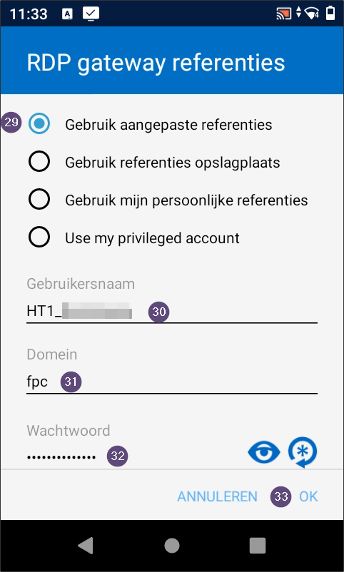

30. Vul bij Gebruikersnaam de gebruikersnaam van de PDA Windows gebruiker in. (nr. 30)

**Vervang het @-teken in de gebruikersnaam door een underscore (_) karakter.**

31. Vul in het veld Domein de domeinnaam in van de server. (nr. 31) 

32. Vul in het veld Wachtwoord het wachtwoord in van de PDA Windows gebruiker. (nr. 32) 

33. Klik rechtsonder in het scherm op OK. Het vorige scherm wordt zichtbaar. (nr. 33)

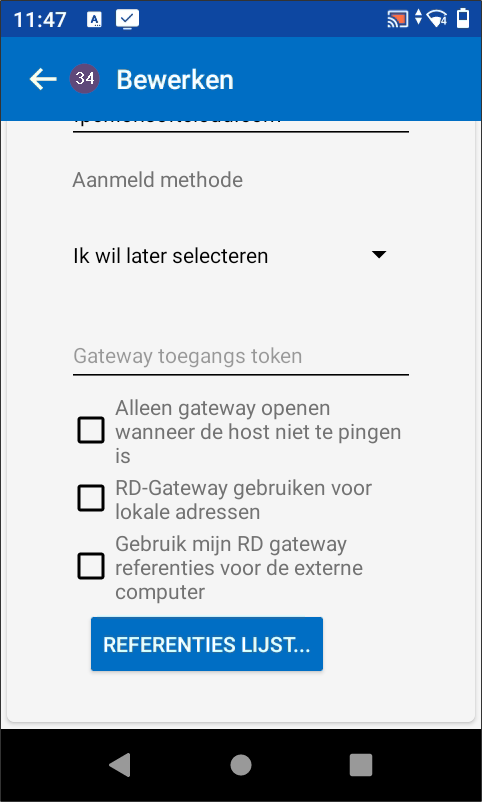

34. Druk op de pijl linksboven in het scherm om terug te keren naar het Bewerken scherm. (nr. 34) 

35. Druk op het diskette icoon rechtsboven in om de instellingen op te slaan. (nr. 35)

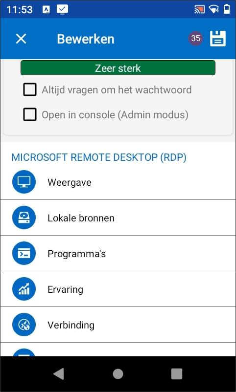

Het icoon van een draaiende cirkel verschijnt een aantal seconden in het scherm. Hierna keert de PDA terug naar het scherm Startpagina. 

Het nieuw aangemaakte rdp profiel verschijnt in het scherm.

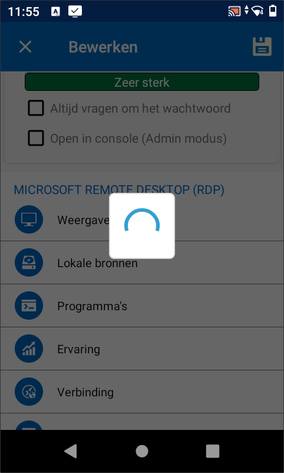

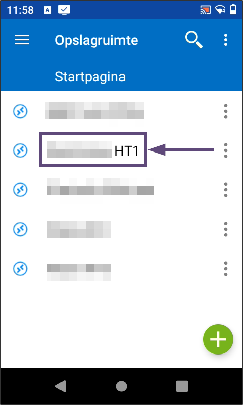

### 3.2 Verbinden met een Reset florisoftcloud server via RDP
Onderstaande stappen beschrijven het opzetten van een rdp verbinding met een Reset server binnen het florisoftcloud domein.

1. Start de Remote Desktop Manager app vanaf het startscherm van de PDA. (nr.1)

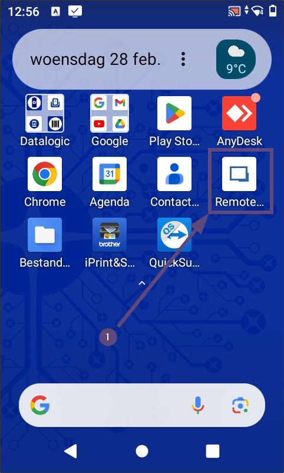

De Remote Desktop Manager app start.

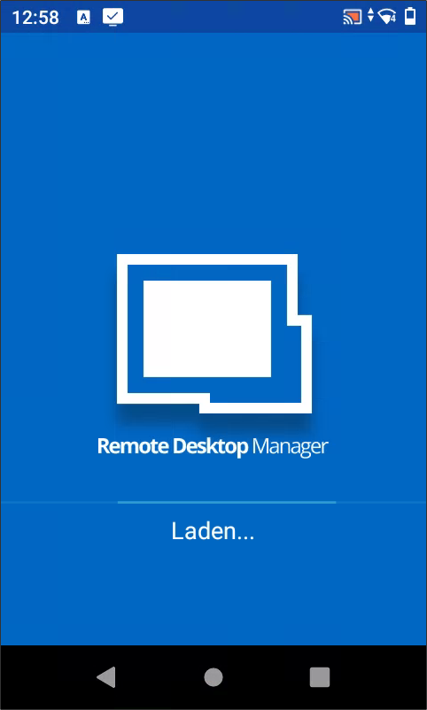

De Startpagina verschijnt na een aantal seconden.

2. Druk op de drie puntjes achter de naam van het betreffende rdp account. (nr. 2) Een klein popup menu verschijnt.

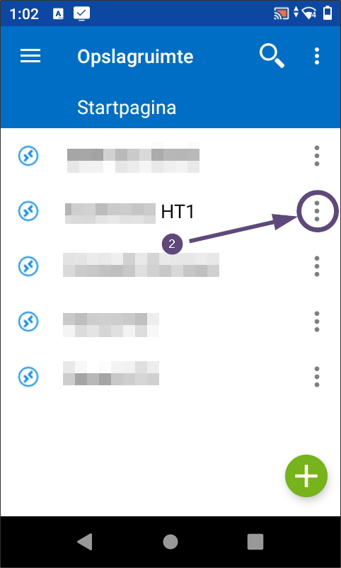

3. Druk op Openen. (no. 3)

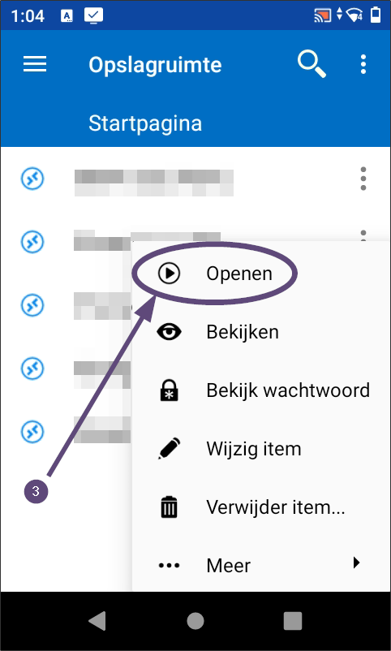

Een voortgangsindicator verschijnt terwijl de verbinding op de achtergrond tot stand wordt gebracht.

Het volgende scherm ziet er als volgt uit:

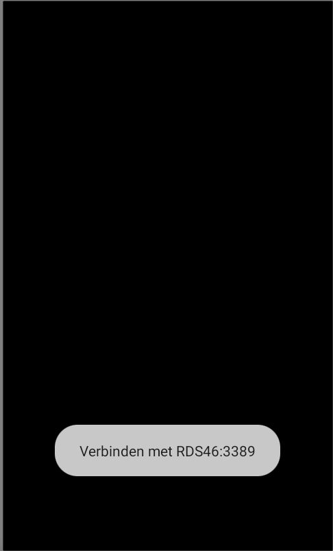

Na een aantal seconden is de verbinding tot stand gebracht. Een standaard Windows login scherm verschijnt. Dit scherm wordt automatisch opgevolgd door een splash (laad) scherm van Florisoft. 

Nadat Florisoft is gestart verschijnt de PDA software op het scherm

Alle beschikbare PDA modulen zijn verdeeld over de vier genummerde tabbladen: 1,2,3 en 4. 

Druk op het icoon van de module om deze te starten.

### 3.3 Instellen RDP verbinding Axxon florisoftcloud
In deze paragraaf worden de stappen beschreven voor het instellen van een rdp verbinding naar een Axxon server in het florisoftcloud domein. Hiervoor wordt gebruik gemaakt van de Remote Desktop Manager app.

1. Open de Remote Desktop Manager app door op het icoon te drukken. (nr. 1)

De Remote Desktop Manager app start. Wacht een paar seconden.

Het startscherm van de app verschijnt nadat het laden voltooid is.

2. Druk op het + icoon in de rechter benedenhoek van het scherm. (nr. 2)

3. Kies voor de RDP (Microsoft Remote Desktop) optie. (nr. 3)

Het scherm voor het toevoegen van een nieuw rdp profiel verschijnt. Zie onderstaand screenshot.

4. Vul in het veld Naam (nr. 4) een beschrijvende naam in voor de nieuwe verbinding. 

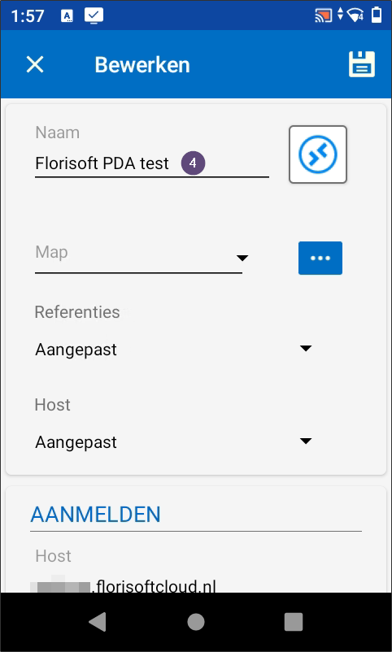

Scroll naar beneden naar het gedeelte AANMELDEN. 

5. Vul in het Host veld de servernaam in van de server waarmee verbonden gaat worden. (nr. 5)

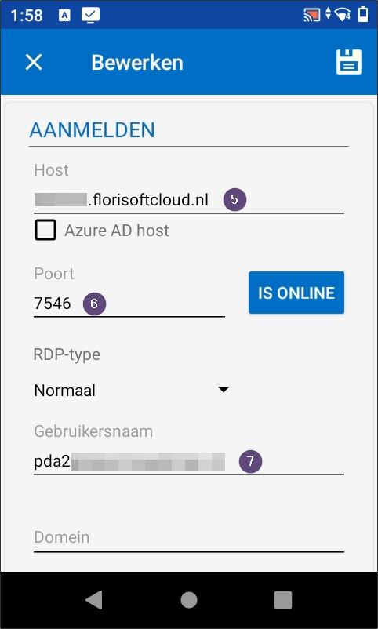

6. Vul in het veld Poort het juiste poortnummer (7546) in. (nr. 6) 

7. Vul in het veld Gebruikersnaam de gebruikersnaam in van de betreffende PDA. (nr. 7) 

Scoll naar beneden tot het Wachtwoord veld zichtbaar wordt. 

8. Vul in het veld Wachtwoord het wachtwoord in van de Windows PDA gebruiker. (nr. 8)

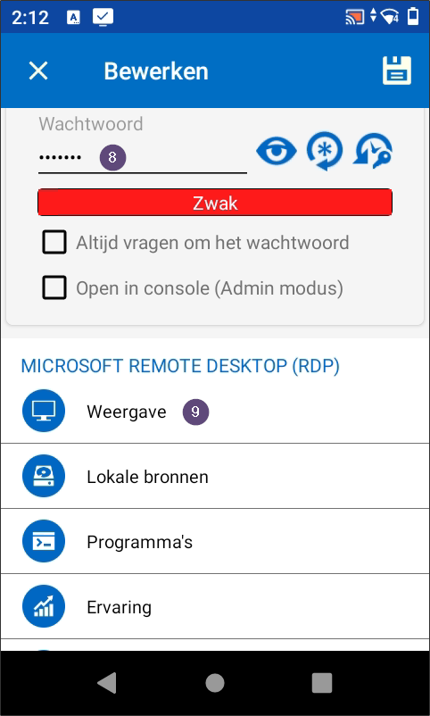

9. Druk op Weergave om de weergave instellingen te openen. (nr. 9) 

10. Druk op het zwarte pijltje rechts naast Standaard (nr. 10) om een aangepaste schermgrootte in te stellen voor de verbinding. 

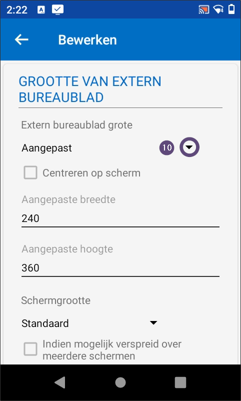

12. Een pop-up scherm verschijnt met verschillende gangbare resoluties. Scroll in deze lijst naar beneden tot de optie Aangepast verschijnt:

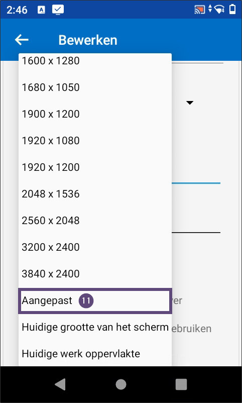

13. Druk op Aangepast om een eigen resolutie in te kunnen stellen. (nr. 11) 

14. Vul in het veld Aangepaste breedte de waarde 240 in. (nr. 12) 

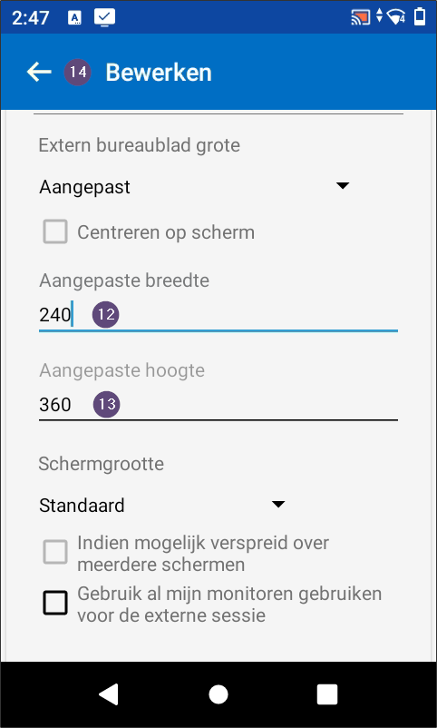

15. Vul in het veld Aangepaste hoogte de waarde 360 in. (nr. 13) 

Druk op de links wijzende pijl links bovenin het scherm om terug te keren naar het scherm Nieuw. (nr. 14) 

16. Scroll naar beneden naar de optie Lokale bronnen en druk hierop. (nr. 15)

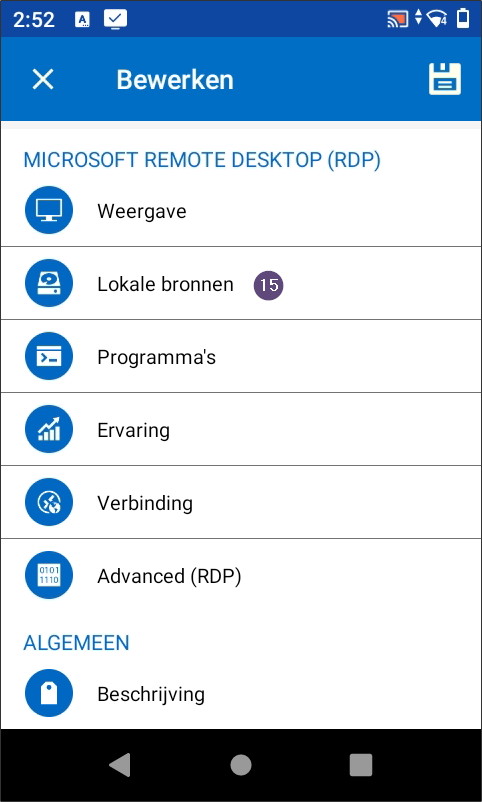

17. Scroll in het scherm helemaal naar beneden en zet het vinkje Klembord uit. (nr. 16)

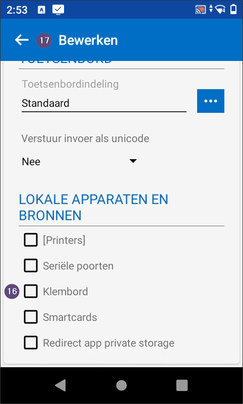

18. Druk op de links wijzende pijl links bovenin het scherm om terug te keren naar het scherm Nieuw. (nr. 17) 

19. Scroll naar beneden en druk op de optie Ervaring. (nr. 18)

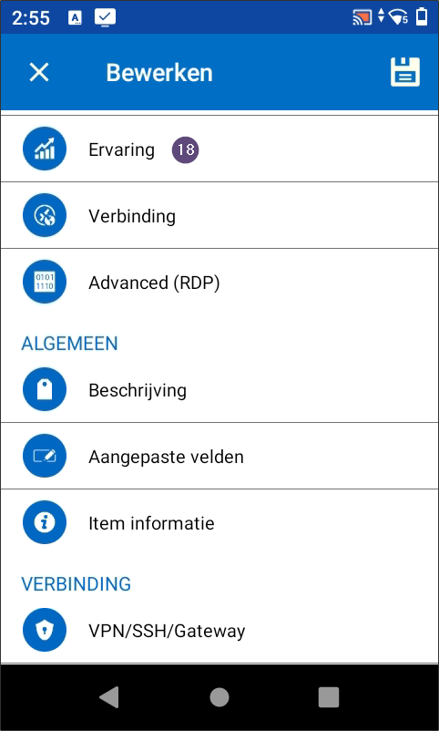

20. Controleer of het instellingen profiel ingesteld staat Standaard. (nr. 19)

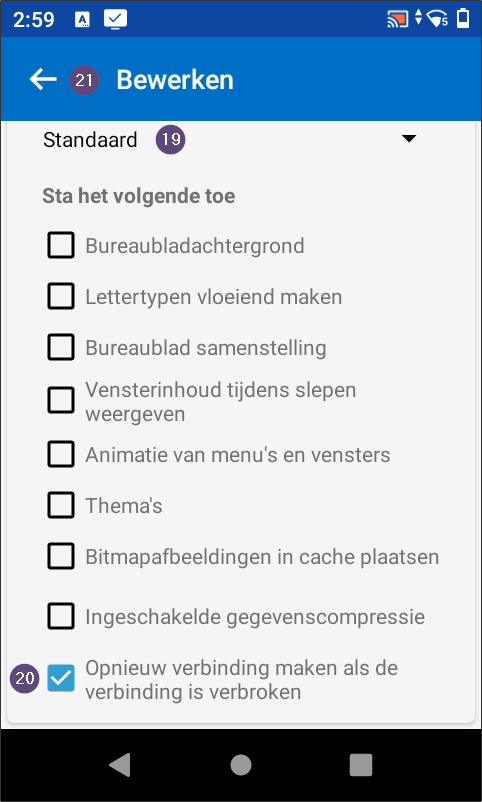

21. Zorg ervoor dat alle vinkjes onder Sta het volgende toe **uit** staan behalve het vinkje Opnieuw verbinding maken als de verbinding is verbroken. (nr. 20) 

22.  Druk op de links wijzende pijl links bovenin het scherm om terug te keren naar het scherm Nieuw. (nr. 21) 

23. Druk op de optie Verbinding om deze te openen. (nr. 22)

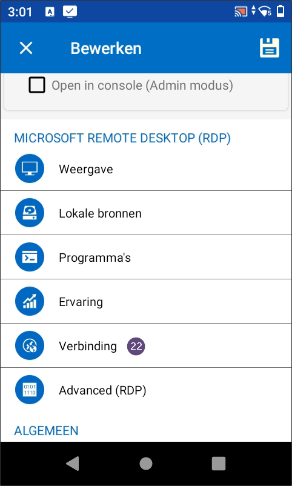

24. Zorg ervoor dat de waarde onder Welke actie moet worden uitgevoerd als serververificatie mislukt? ingesteld staat op Standaard. (nr. 23) 

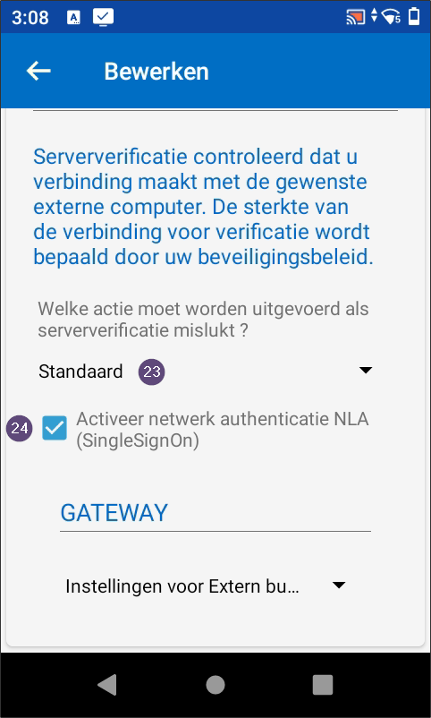

25. Activeer het vinkje Activeer netwerk authenticatie NLA (SingleSignOn) (nr. 24) 

26. Klik op de pijl linksboven in het scherm om terug te keren naar het Bewerken scherm. (nr. 25)

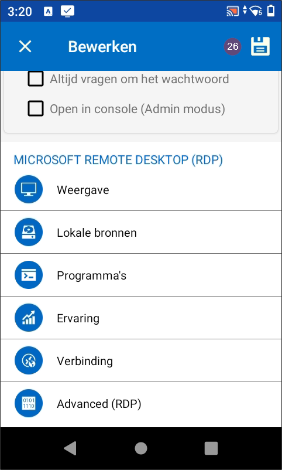

27. Druk op het diskette icoon om de instellingen op te slaan. (nr. 26)

Het nieuw aangemaakte RDP profiel verschijnt op de Startpagina.

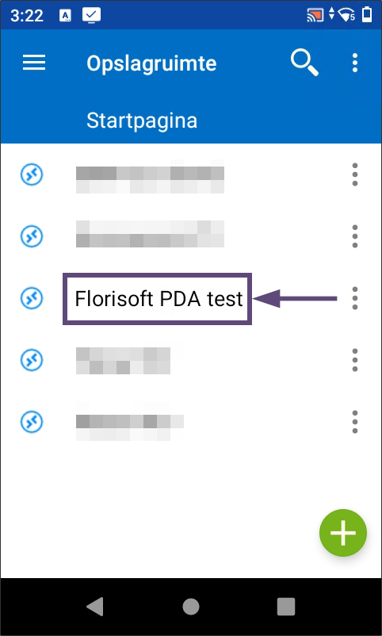

### 3.4 Verbinden met een Axxon florisoftcloud server via RDP
Onderstaande stappen beschrijven het opzetten van een rdp verbinding met een Axxon server binnen het florisoftcloud domein.

1. Start de Remote Desktop Manager app vanaf het startscherm van de PDA. (nr.1)

De Remote Desktop Manager app start.

De Startpagina verschijnt na een aantal seconden.

2. Druk op de drie puntjes achter de naam van het betreffende rdp account. (nr. 2) Een klein popup menu verschijnt.

3. Druk op Openen. (no. 3)

Een voortgangsindicator verschijnt terwijl de verbinding op de achtergrond tot stand wordt gebracht.

Het volgende scherm ziet er als volgt uit:

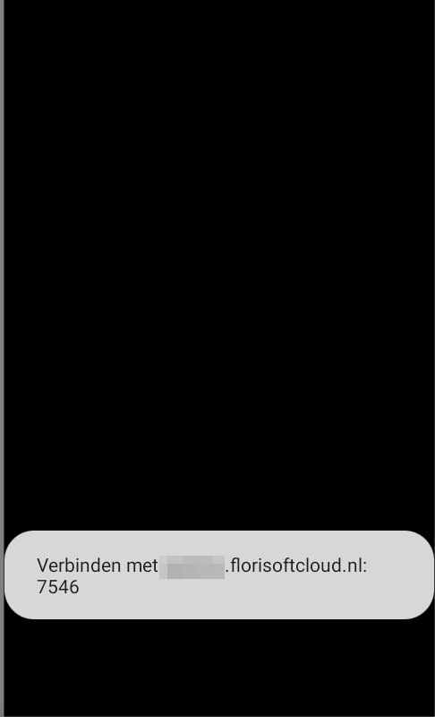

Na een aantal seconden is de verbinding tot stand gebracht. Een standaard Windows login scherm verschijnt. Dit scherm wordt automatisch opgevolgd door een splash (laad) scherm van Florisoft. 

Nadat Florisoft is gestart verschijnt de PDA software op het scherm

Alle beschikbare PDA modulen zijn verdeeld over de vier genummerde tabbladen: 1,2,3 en 4. 

Druk op het icoon van de module om deze te starten.

### 3.5 Instellen RDP verbinding BMP florisoftcloud
In deze paragraaf worden de stappen beschreven voor het instellen van een rdp verbinding naar een BMP server in het florisoftcloud domein. Hiervoor wordt gebruik gemaakt van de Remote Desktop Manager app.

1. Open de Remote Desktop Manager app door op het icoon te drukken. (nr. 1)

De Remote Desktop Manager app start. Wacht een paar seconden.

Het startscherm van de app verschijnt nadat het laden voltooid is.

2. Druk op het + icoon in de rechter benedenhoek van het scherm. (nr. 2)

3. Kies voor de RDP (Microsoft Remote Desktop) optie. (nr. 3)

Het scherm voor het toevoegen van een nieuw rdp profiel verschijnt. Zie onderstaand screenshot.

4. Vul in het veld Naam (nr. 4) een beschrijvende naam in voor de nieuwe verbinding. 

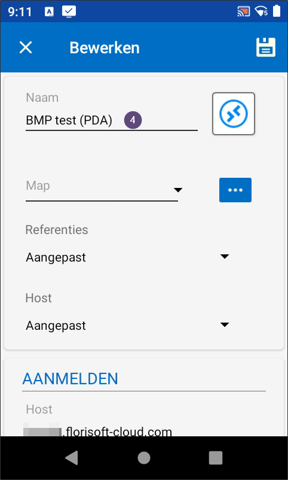

Scroll naar beneden naar het gedeelte AANMELDEN. 

5. Vul in het Host veld de servernaam in van de server waarmee verbonden gaat worden. (nr. 5)

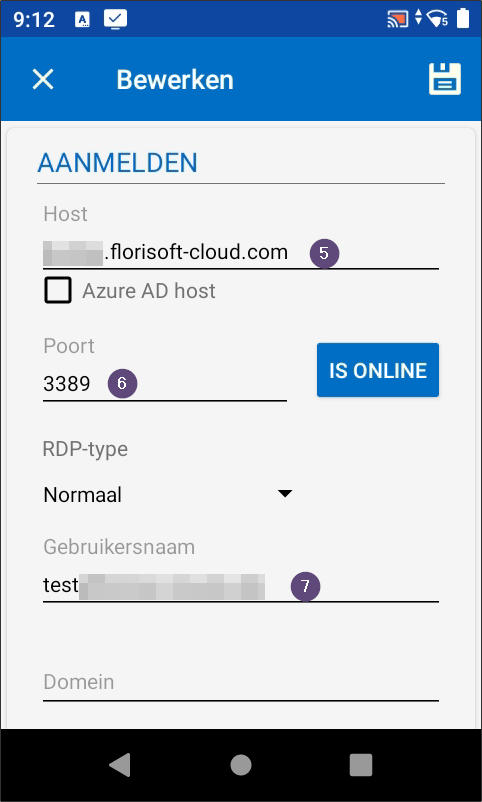

6. Vul in het veld Poort het juiste poortnummer (7546) in. (nr. 6) 

7. Vul in het veld Gebruikersnaam de gebruikersnaam in van de betreffende PDA. (nr. 7) 

Scoll naar beneden tot het Wachtwoord veld zichtbaar wordt. 

8. Vul in het veld Wachtwoord het wachtwoord in van de Windows PDA gebruiker. (nr. 8)

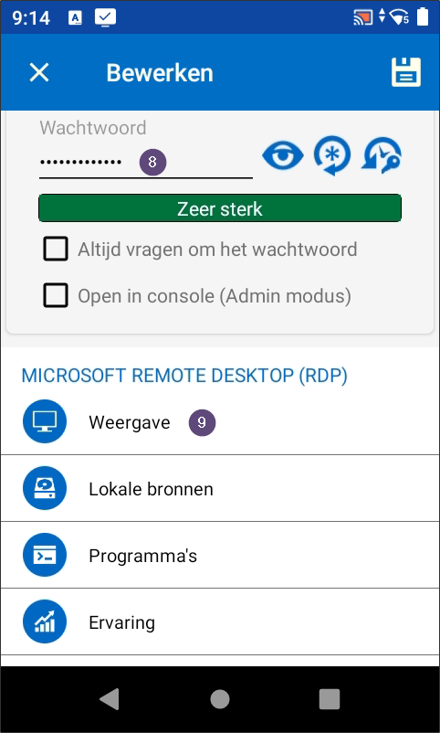

9. Druk op Weergave om de weergave instellingen te openen. (nr. 9) 

10. Druk op het zwarte pijltje rechts naast Standaard (nr. 10) om een aangepaste schermgrootte in te stellen voor de verbinding. 

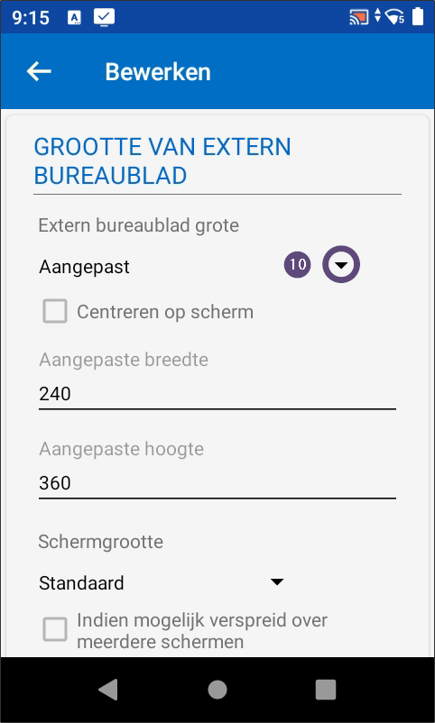

12. Een pop-up scherm verschijnt met verschillende gangbare resoluties. Scroll in deze lijst naar beneden tot de optie Aangepast verschijnt:

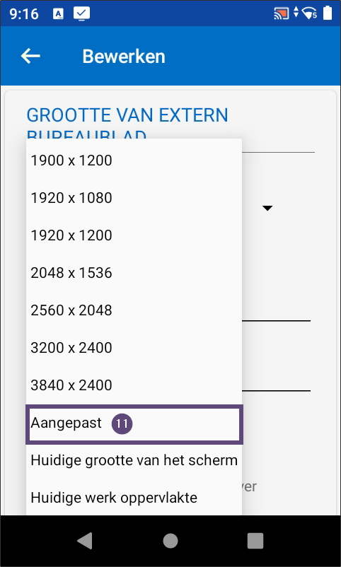

13. Druk op Aangepast om een eigen resolutie in te kunnen stellen. (nr. 11) 

14. Vul in het veld Aangepaste breedte de waarde 240 in. (nr. 12) 

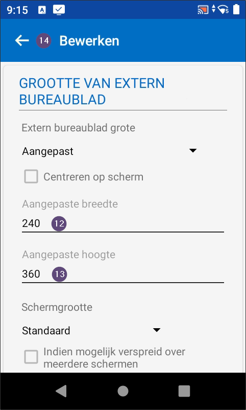

15. Vul in het veld Aangepaste hoogte de waarde 360 in. (nr. 13) 

Druk op de links wijzende pijl links bovenin het scherm om terug te keren naar het scherm Nieuw. (nr. 14) 

16. Scroll naar beneden naar de optie Lokale bronnen en druk hierop. (nr. 15)

17. Scroll in het scherm helemaal naar beneden en zet het vinkje Klembord uit. (nr. 16)

18. Druk op de links wijzende pijl links bovenin het scherm om terug te keren naar het scherm Nieuw. (nr. 17) 

19. Scroll naar beneden en druk op de optie Ervaring. (nr. 18)

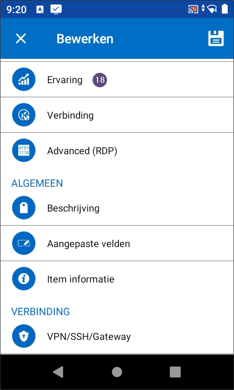

20. Controleer of het instellingen profiel ingesteld staat op LAN (> 10 Mbps met lage latentie). (nr. 19)

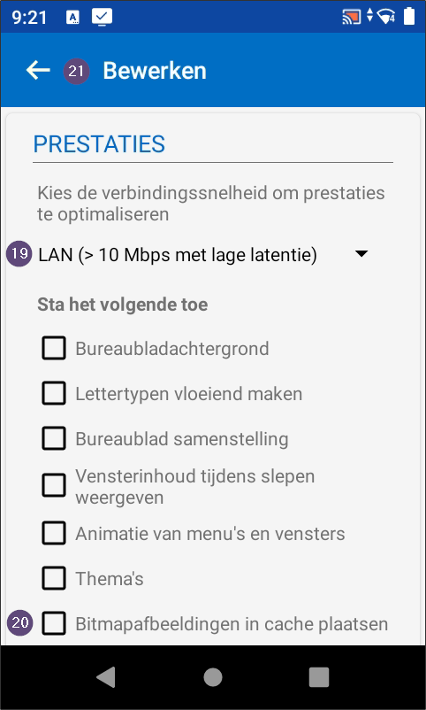

21. Zorg ervoor dat alle vinkjes onder Sta het volgende toe **uit** staan behalve het vinkje Opnieuw verbinding maken als de verbinding is verbroken. (nr. 20) 

22.  Druk op de links wijzende pijl links bovenin het scherm om terug te keren naar het scherm Nieuw. (nr. 21) 

23. Druk op de optie Verbinding om deze te openen. (nr. 22)

24. Zorg ervoor dat de waarde onder Welke actie moet worden uitgevoerd als serververificatie mislukt? ingesteld staat op Standaard. (nr. 23) 

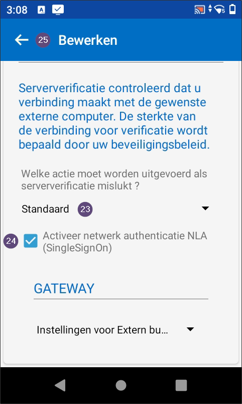

25. Activeer het vinkje Activeer netwerk authenticatie NLA (SingleSignOn) (nr. 24) 

26. Klik op de pijl linksboven in het scherm om terug te keren naar het Bewerken scherm. (nr. 25)

27. Druk op het diskette icoon om de instellingen op te slaan. (nr. 26)

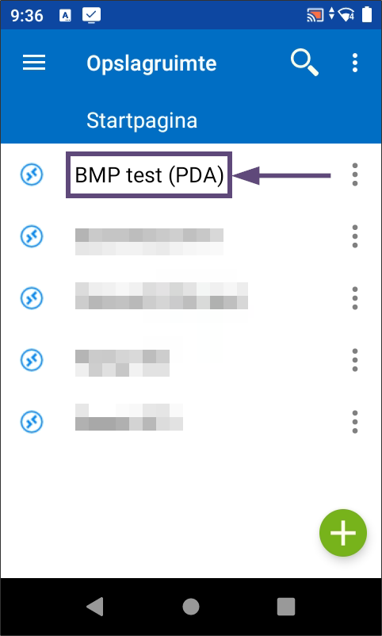

Er verschijnt een voortgangsindicator in het scherm. Na een aantal seconden staat het nieuw aangemaakte RDP profiel op de Startpagina.

### 3.6 Verbinden met een BMP server via RDP
Onderstaande stappen beschrijven het opzetten van een rdp verbinding met een BMP server binnen het florisoftcloud domein.

1. Start de Remote Desktop Manager app vanaf het startscherm van de PDA. (nr.1)

De Remote Desktop Manager app start.

De Startpagina verschijnt na een aantal seconden.

2. Druk op de drie puntjes achter de naam van het betreffende rdp account. (nr. 2) Een klein popup menu verschijnt.

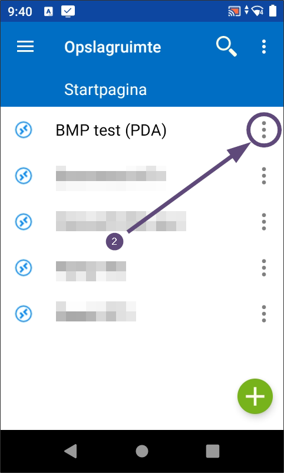

3. Druk op Openen. (no. 3)

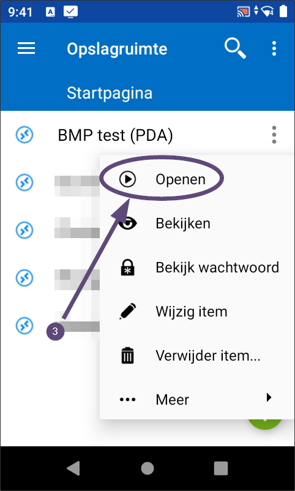

Een voortgangsindicator verschijnt terwijl de verbinding op de achtergrond tot stand wordt gebracht.

Het volgende scherm ziet er als volgt uit:

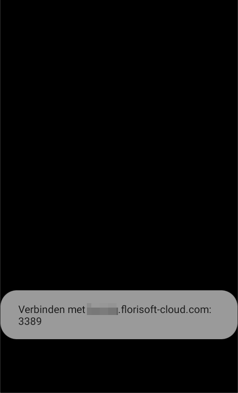

Na een aantal seconden is de verbinding tot stand gebracht. Een standaard Windows login scherm verschijnt. Dit scherm wordt automatisch opgevolgd door een splash (laad) scherm van Florisoft. 

Nadat Florisoft is gestart verschijnt de PDA software op het scherm

Alle beschikbare PDA modulen zijn verdeeld over de vier genummerde tabbladen: 1,2,3 en 4. 

Druk op het icoon van de module om deze te starten.

### 3.7 Configureren Datalogic scanner instellingen
Naast het instellen van een rdp profiel is het noodzakelijk om de scanner instellingen op het apparaat te configureren. Dit zorgt ervoor dat de scanner veelvoorkomende barcodes kan scannen. Volg onderstaande stappen om dit voor elkaar te krijgen.

>**Let op: de volgende screenshots in deze paragraaf kunnen afwijken van de schermen op het apparaat. De schermen verschillen per type apparaat.**

1. Open de Instellingen app door te drukken op het app icoon. (nr. 1)

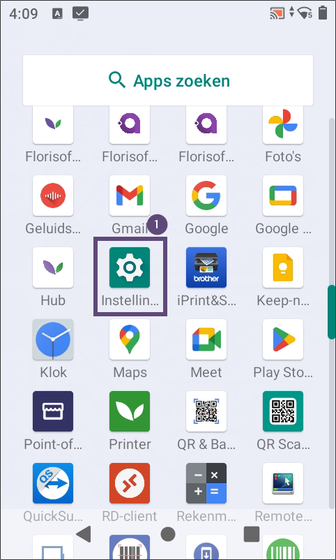

2. Scroll naar beneden en druk op de Datalogic Settings optie. (nr. 2)

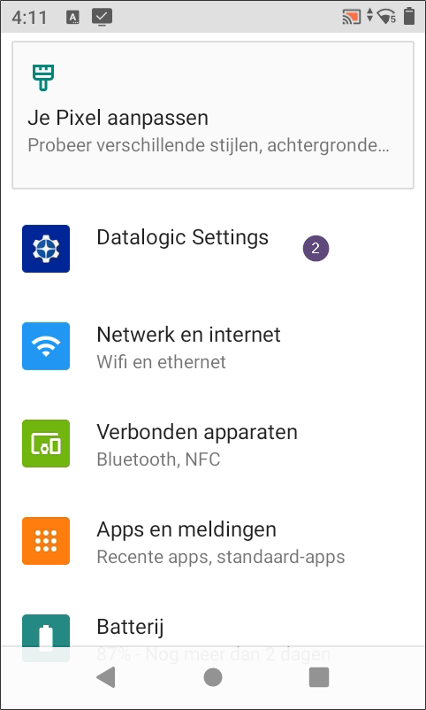

3. Druk op de Scanner Settings optie. (nr. 3)

4. Scroll naar beneden en druk op de optie Enable all symbologies optie. (nr. 4)

5. Druk op OK om het activeren van alle symbologies te bevestigen.

**In bovenstaand screenshot de optie Enable all symbologies option is uitgegrijst omdat de optie al eerder geactiveerd is.**

6. Druk op de optie Symbology settings in het Scanner Settings scherm. (nr. 5) 

7. Activeer de Send checksum switch in het venster Decorder parameters. (nr. 6)

8. Druk twee keer op de links wijzende pijl links onderin het scherm om terug te keren naar het Scanner Settings scherm. (nr. 7) 

9. Scroll naar beneden en druk op de Interleaved 2 of 5 optie. (nr. 8)

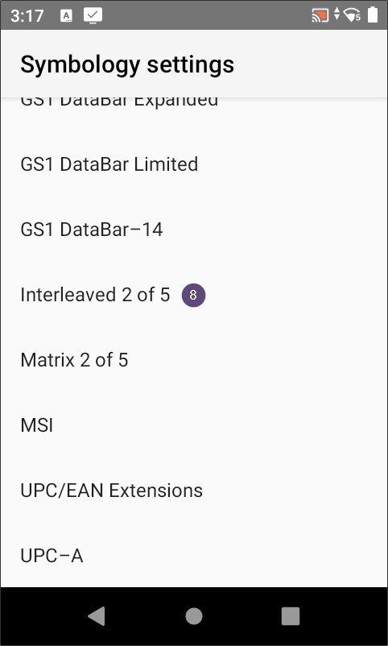

10. Geef het L1 length veld de waarde 4. Druk op OK om deze instelling te bevestigen. (nr's 9 en 10)

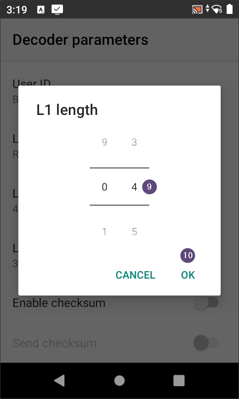

11. Geef het L2 length veld de waarde 40. Druk op OK om deze instelling te bevestigen. (nr's 11 en 12)

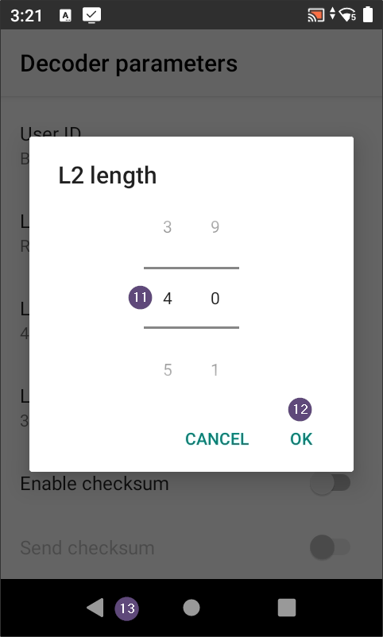

12. Druk twee keer op de links wijzende pijl links onderin het scherm om terug te keren naar het Scanner Settings scherm. (nr. 13) 

13. Scroll naar beneden in het Scanner Settings scherm en druk op de Commit optie. (nr. 14)

14. Druk op OK om de instellingen op te slaan. (nr. 15)

15. Druk meerdere keren op de linkswijzende pijl onderin het scherm om terug te keren naar het start scherm van het apparaat. (nr. 16)

>**Let op: de stappen vijftien tot en met eenentwintig zijn optioneel and dienen alleen geconfigureerd te worden wanneer problemen zich voor doen tijdens het scannen.**

15. Druk op de Formatting optie in het scherm Scanner Settings. (nr. 17)

14. Druk op de optie Standard Formatting in het Formatting scherm. (nr. 18)

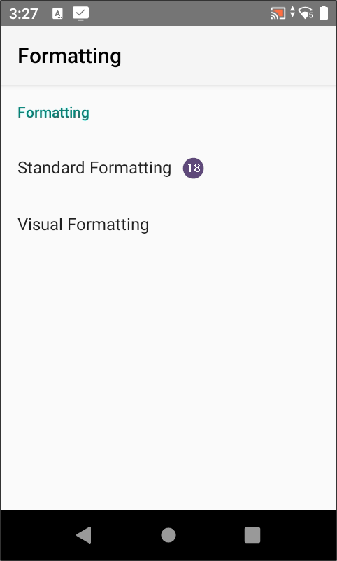

15. Druk op de Label suffix optie. (nr. 19)

16. Open de Add special dropdown lijst naast. (nr. 20)

17. Kies de [CR] optie. (nr 21) De [CR] optie is toegevoegd naast de bestaande [LF] optie.

18. Druk op OK to om de instellingen op te slaan. (nr. 22) 

19. Druk twee keer op de links wijzende pijl om terug te gaan het Scanner Settings scherm. (nr. 23) 

20. Scroll naar beneden en druk op de optie Commit om de instellingen op te slaan. (nr. 24)

21. Druk op OK om de instellingen op te slaan. (nr. 25)

22. Druk meerdere keren op de links wijzende pijl onderin het scherm om terug te keren naar het start scherm van het apparaat. (nr. 26) 

De scanner instellingen zijn geconfigureerd.

## 4. Zebra device
Dit hoofdstuk beschrijft de stappen voor het opzetten van een RDP verbinding op een Zebra apparaat. De uitleg is gebaseerd op het TC25 model. De stappen zijn ook van toepassing op andere Zebra apparaten.

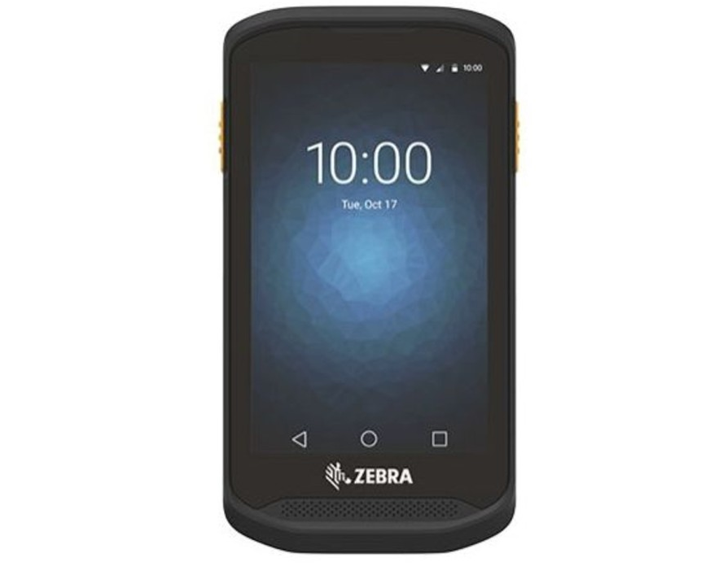

>**Let op: bovenstaande afbeelding kan afwijken van het fysieke apparaat van de gebruiker.**

**Voor Zebra appraten is het aan te bevelen om gebruik te maken van de Microsoft RD Client als rdp client voor het verbinden met Reset servers. Voor servers van andere leveranciers wordt Parallels Client aangeraden als rdp client voor een betere gebruikservaring.**

### 4.1 Instellen RDP verbinding Reset florisoftcloud
In deze paragraaf worden de stappen beschreven voor het instellen van een rdp verbinding naar een Reset server in het florisoftcloud domein. Hiervoor wordt gebruik gemaakt van de Remote Desktop Manager app.

1. Open de RD client app door te drukken op het icoon op het beginscherm van de PDA. (nr. 1)

Bij het eerste gebruik van de app start dient de gebruiker de licentieovereenkomst accepteren:

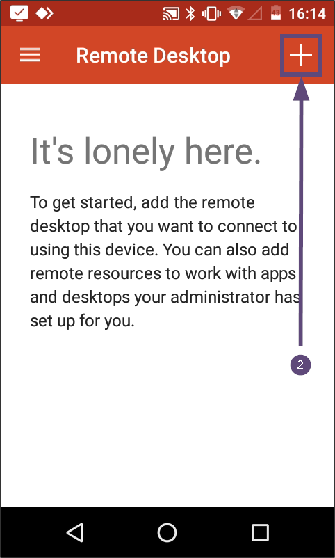

2. Druk op het de + icoon in de rechterboven hoek van het scherm om een nieuw rdp profiel aan te maken. (nr. 2)

3. Kies voor de Desktop optie. (nr. 3)

Een popup scherm met apparaten in hetzelfde netwerk verschijnt.

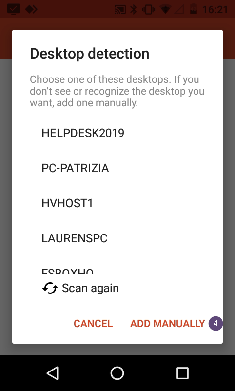

4. Kies voor de optie ADD MANUALLY (nr. 4) 

5. Vul in het veld Server address de naam in van de betreffende server. (nr. 5) 

De interne naam van de server is te vinden door met de **rechtermuisknop** te klikken op de start knop en kies voor de optie Systeem (of System) in het context menu.

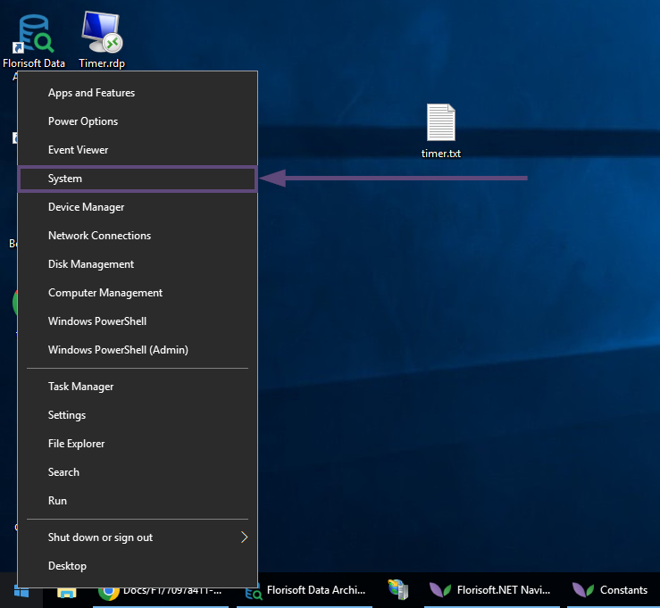

Een instellingen scherm opent waar de interne naam van de server te zien is.

6. Druk op de neerwaartse pijl aan de rechterkant van het Username veld. (nr. 6) Een popup scherm opent:

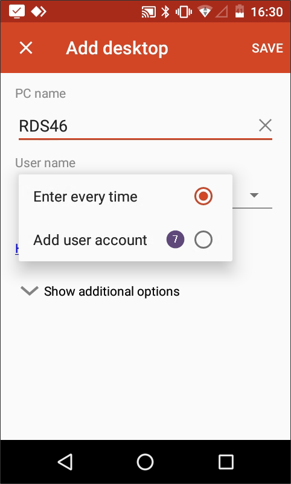

7. Kies voor de optie Add user account. (nr. 7)

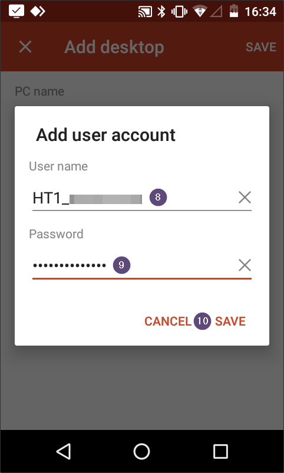

8. Vul de gebruikersnaam in van de PDA gebruiker in het veld User name. (nr. 8)

>**Let op: vervang het @-teken in de gebruikersnaam met een underscore (_) karakter.**

9. Vul in het veld Password het wachtwoord in van de PDA gebruiker. (nr. 9) 

10. Druk op de SAVE optie in de rechters onderin het Add user account pop up venster. (nr. 10) 

11. Druk op de naar beneden wijzende pijl voor Show additional options. (nr. 11)

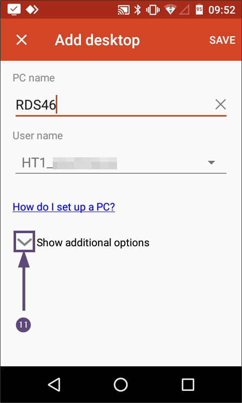

12. Vul een herkenbare naam in voor de nieuwe rdp verbinding in het veld Friendly name. (nr. 12) 

13. Druk op de naar beneden wijzende pijl aan de rechterkant van het Gateway veld. (nr.13)

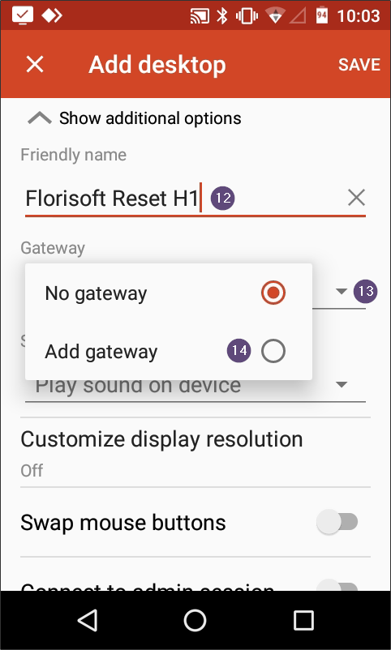

14. Kies voor de optie Add gateway. Het Add gateway scherm verschijnt. (nr 14) 

15. Vul de externe naam in van de gateway in het Server name veld. (nr. 15) Dit is meestal één van de onderstaande waarden:

Florisoft private cloud: fpc.florisoftcloud.com
Customer own private cloud: fspc.florisoftcloud.com

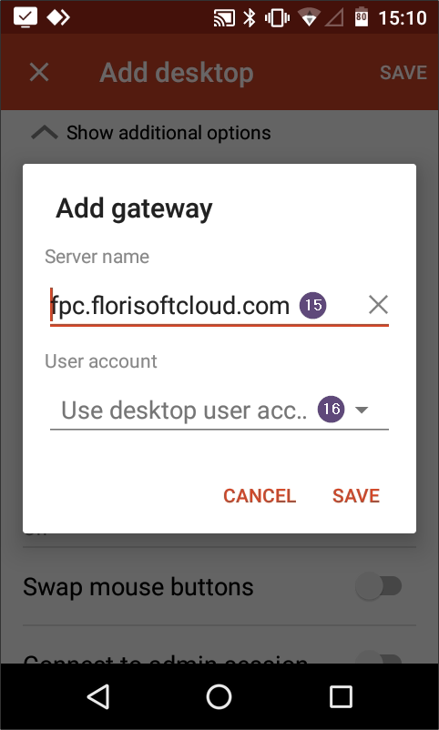

16. Druk op de pijl in het User account veld. (nr. 16)

17. Kies de eerder aangemaakte gebruiker in de lijst. (nr. 17) De gekozen gebruiker wordt zichtbaar in het veld User account. 

18. Druk op de SAVE optie in het Add gateway pop up scherm. (nr. 18)

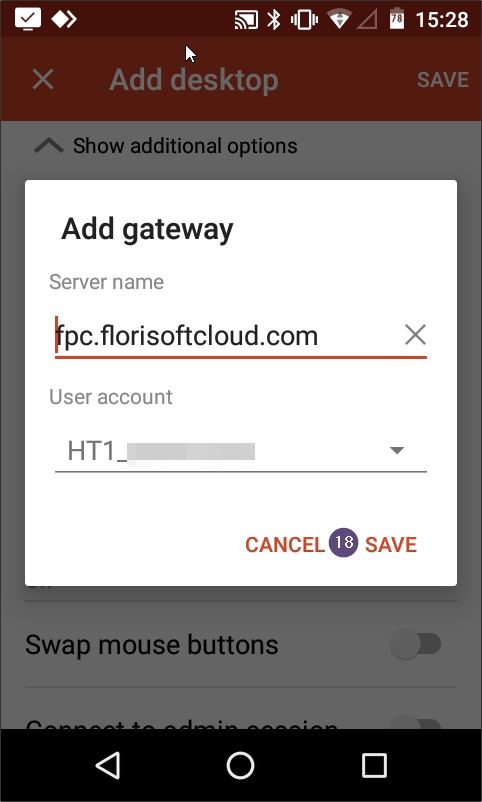

19. Druk op de Customize display resolution optie. (nr. 19)

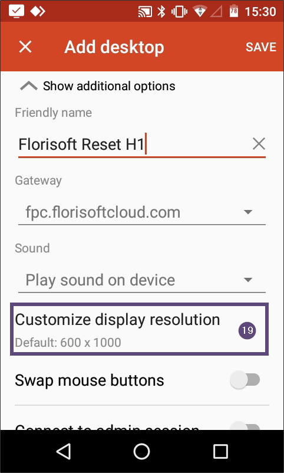

20. Activeer de switch aan de rechterkant van het Customize display resolution scherm om de custom resolutie opties te activeren. (nr. 20)

21. Druk op de + Custom optie om een custom resolutie toe te voegen. (nr. 21)

22. Druk op de pijl rechts van het Resolution veld. (nr. 22)

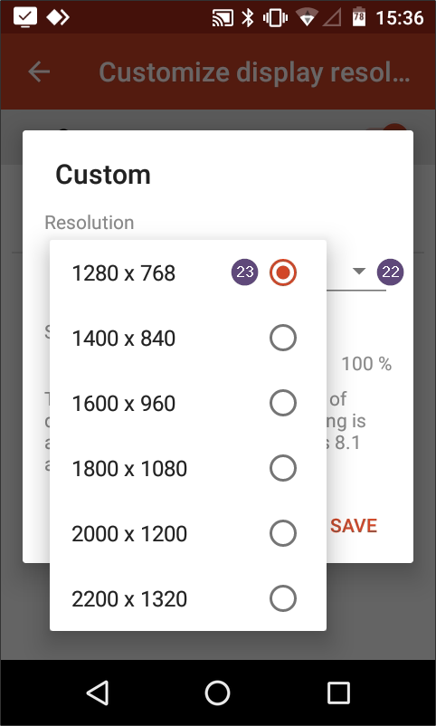

23. Kies voor de optie 1280 x 768. (nr. 23) 

24. Schuif de Scaling slider naar de waarde van 300 %. (nr. 24)

25. Druk op de SAVE optie om de instellingen op te slaan. (nr. 25)

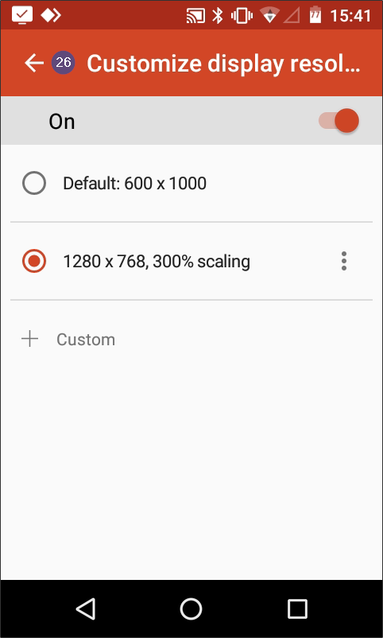

26. Druk op de links wijzende pijl in de linkerboven hoek van het scherm om terug te keren naar het vorige scherm. (nr.26) 

27. Druk op de SAVE optie rechts bovenin het scherm Add desktop om het nieuwe rdp profiel op te slaan. (nr. 27) 

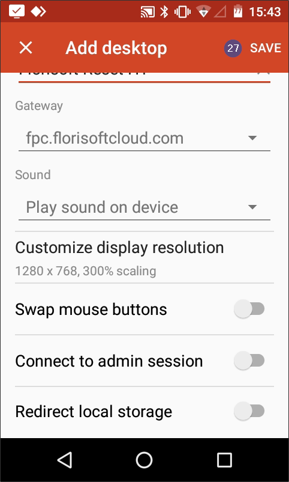

Een melding zoals onderstaand kan verschijnen. Druk op OK om verder te gaan. (nr. 28)

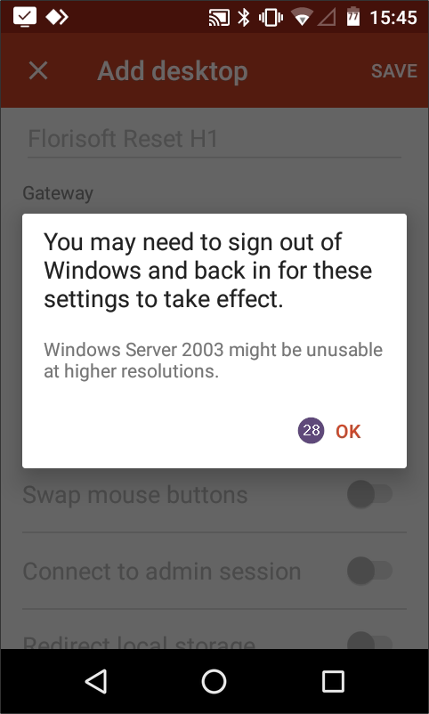

De nieuw aangemaakte rdp verbinding verschijnt in het Remote Desktop scherm. Zie onderstaand screenshot:

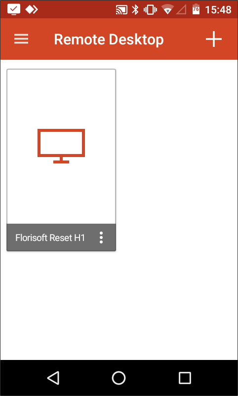

### 4.2 Verbinden met een Reset florisoftcloud server via RDP
Onderstaande stappen beschrijven het opzetten van een rdp verbinding met een Reset server binnen het florisoftcloud domein.

1. Druk op het icoon van de RD Client app om deze te starten. (nr. 1)

2. Druk op de betreffende gebruikersnaam om in te loggen. (nr. 2)

De verbinding wordt tot stand gebracht. Na een aantal seconden is het mogelijk dat onderstaand scherm zichtbaar wordt:

3. Zet het vinkje Never ask again for connections to this PC aan. (nr. 3) 

4. Druk op de optie CONNECT om de verder te gaan met het opzetten van de verbinding. (nr 4)

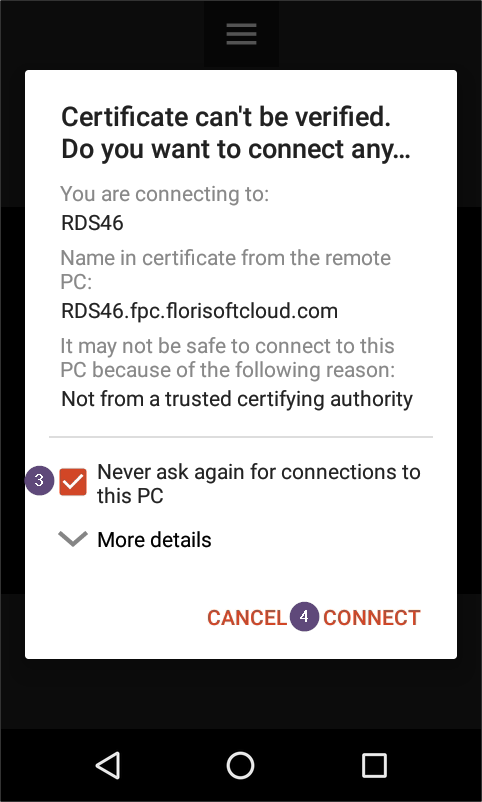

Na een aantal verschillende schermen start Florisoft in de PDA omgeving op tabblad 1:

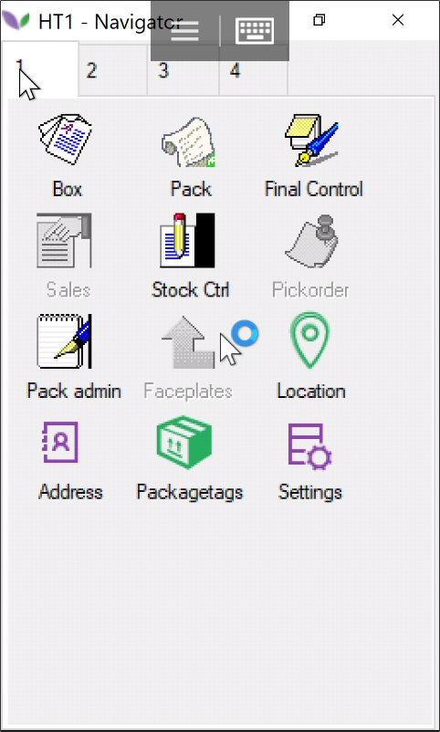

Standaard start RD Client rdp verbindingen in de muis modus om te navigeren. Volg onderstaande stappen om de touch modus te activeren: 

5. Druk op het hamburger menu bovenin het scherm. (nr. 5)

6. Druk op de Touch optie aan de rechterkant van het scherm. (nr. 6)

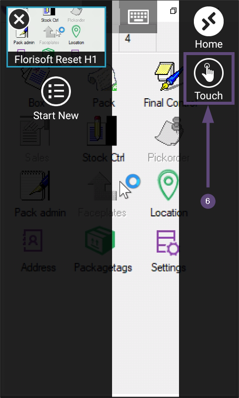

Het scherm keert terug naar Florisoft. Met de eerst volgende druk op het scherm verdwijnt de muisaanwijzer and is de touch modus geactiveerd.

Druk op de X in de rechterboven hoek van het scherm om de huidige gebruiker uit te loggen en terug te keren naar de RD Client app.

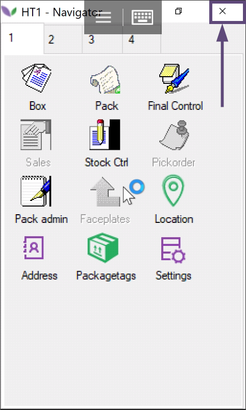

### 4.3 Instellen RDP verbinding Axxon florisoftcloud
In deze paragraaf worden de stappen beschreven voor het instellen van een rdp verbinding naar een Axxon server in het florisoftcloud domein. Hiervoor wordt gebruik gemaakt van de Parallels Client app.

1. Start de Parallels Client app (hierna Client app genoemd) door op het icoon van de app te drukken op het start scherm van de PDA. (nr. 1) De Client app start.

2. Druk op het + teken in de rechterbovenhoek van het Verbindingen scherm. (nr. 2)

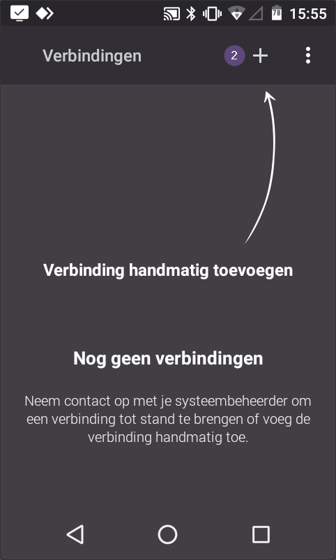

3. Druk op de optie MAAK IN PLAATS DAARVAN EEN RDP-VERBINDING. (nr. 3)

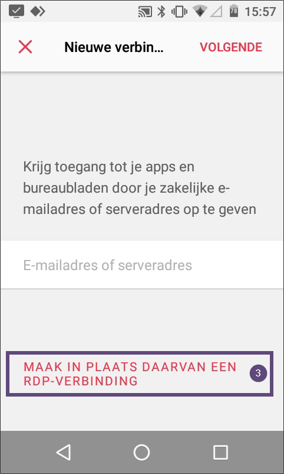

4. Vul in het veld Beschrijvende naam een naam in voor de nieuwe rdp verbinding. (nr. 4)

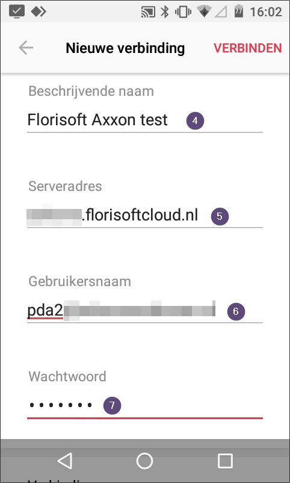

5. Vul in het veld Serveradres de naam in van de klantserver. (nr. 5) 

6. Vul in het veld Gebruikersnaam de gebruikersnaam van in van de PDA gebruiker. (nr. 6) 

7. Vul in het veld Wachtwoord het wachtwoord in van de PDA gebruiker. (nr. 7) 

Scroll verder naar beneden om de volgende instellingen in beeld te krijgen.

8. Druk op de naar beneden wijzende pijl aan de rechterkant van de Verbinding optie. (nr. 8)

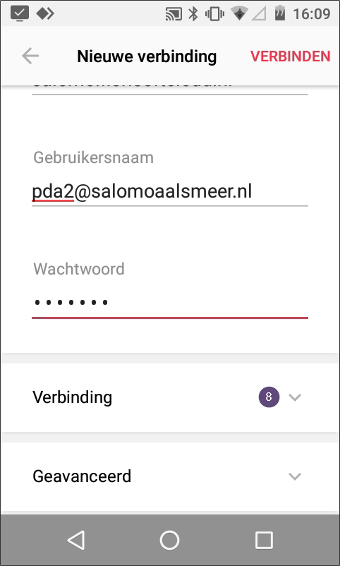

9. Druk op de Poort optie om de waarde te veranderen naar het correcte rdp poort nummer. (nr. 9)

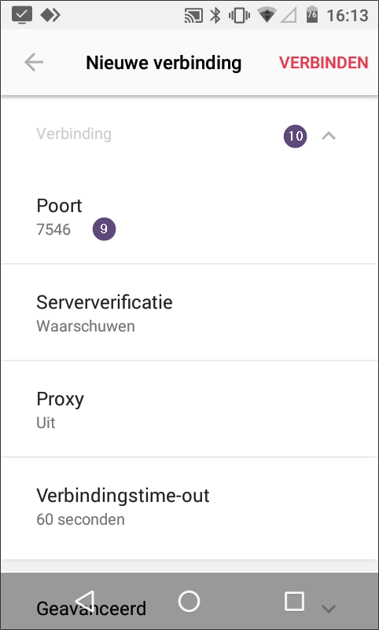

**Controleer de Florisoft debiteurkaart in de helpdesk om het correcte poortnummer terug te vinden. Zie onderstaand voorbeeld.**

10. Druk op de pijl rechts naast de Verbinding optie. (nr. 10) 

11. Druk op de pijl rechts naast de optie Geavanceerd. (nr. 11) 

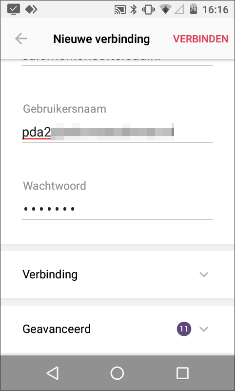

12. Druk op de optie Beeldscherm. (nr. 12)

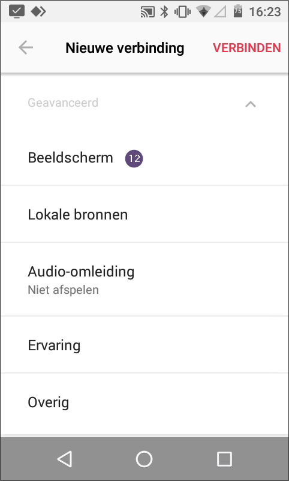

13. Druk op de optie Resolutie in het scherm Beeldscherm. (nr. 13)

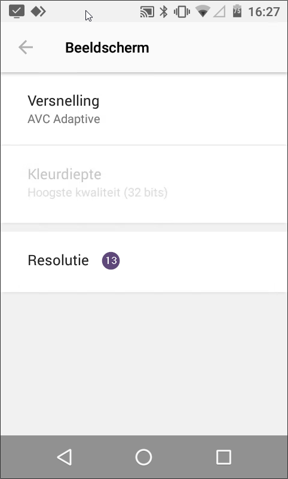

14. Druk op de Aangepast optie in het Resolutie scherm. (nr. 14)

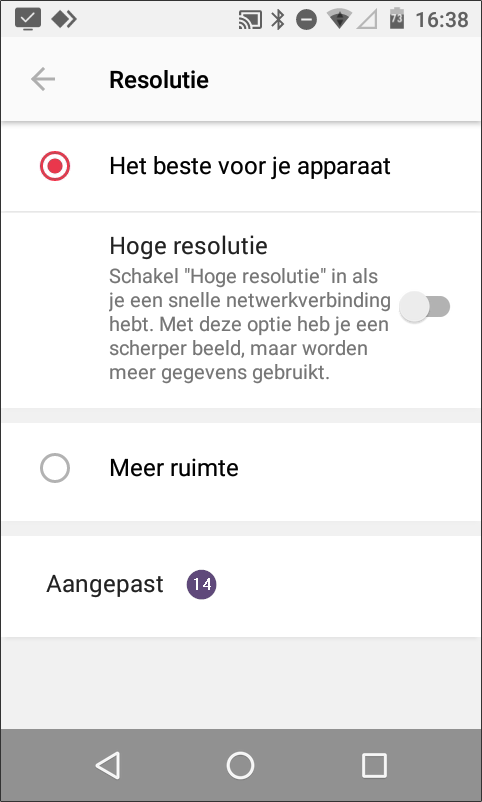

15. Kies voor de optie waar je zelf een Breedte en Hoogte kunt invullen. (nr. 15)

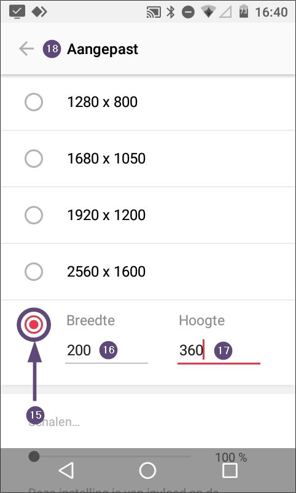

16. Vul in het veld Breedte een waarde in van 200 en bij Hoogte een waarde van 360. (nr. 16 en 17)

**De correcte waarden voor de Breedte en Hoogte velden in combinatie met de Schalen optie varieert per type apparaat. Veel voorkomende waarden zijn:**

**200 x 360, Schalen 100%**
**220 x 360, Scalen 100%**
**1280 x 768, Schalen 300%**

17. Druk op de links wijzende pijl bovenin het scherm Aangepast om terug te gaan naar het vorige scherm. (nr. 18)

18. Controleer of de correcte instelling geactiveerd staat onder Aangepast. (nr. 19)

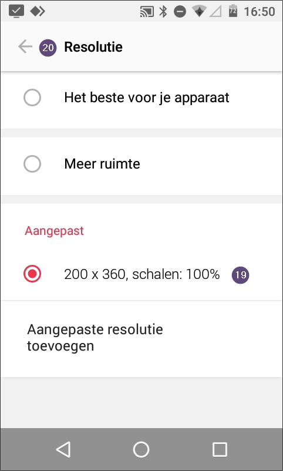

19. Druk op de pijl naar links in het scherm Resolutie om terug te keren naar het vorige scherm. (nr. 20)

20. Druk op de pijl naar links in het scherm Beeldscherm om terug te keren naar het vorige scherm. (nr. 21)

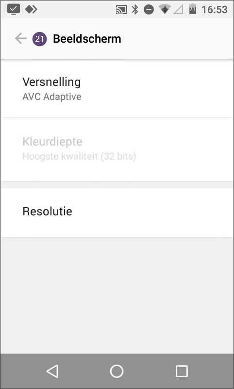

21. Druk op VERBINDEN in de rechterbovenhoek om het nieuwe rdp profiel aan te maken. (nr. 22)

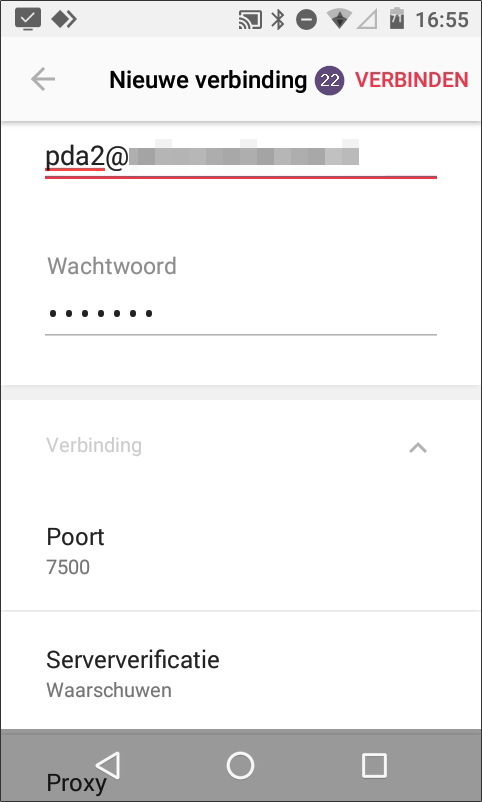

De nieuwe rdp verbinding verschijnt in het Verbindingen scherm:

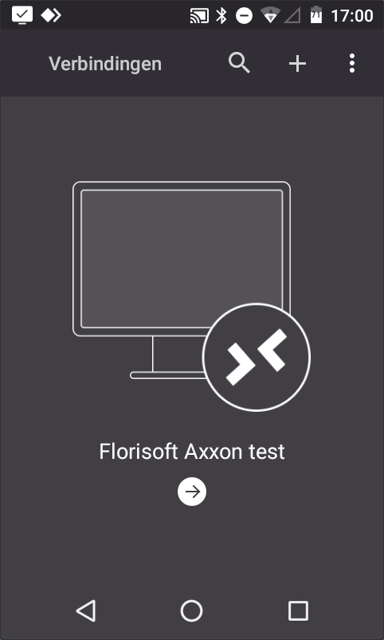

### 4.4 Verbinden met een Axxon florisoftcloud server via RDP
Onderstaande stappen beschrijven het opzetten van een rdp verbinding met een Axxon server binnen het florisoftcloud domein.

1. Start de Client app vanaf het startscherm van de PDA. (nr. 1)

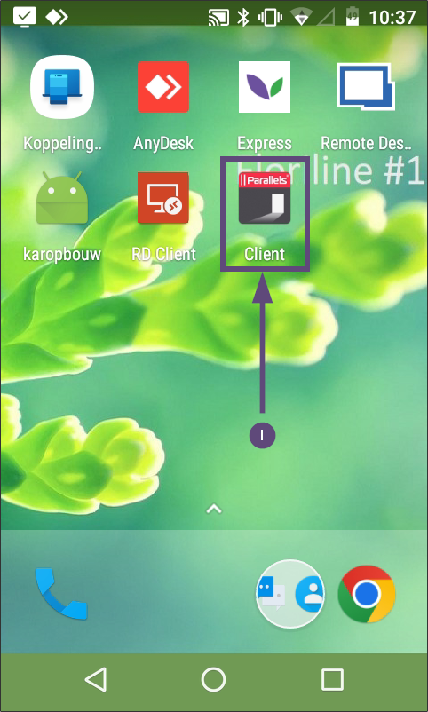

2. Druk op het icoon van de rdp verbinding in het scherm 

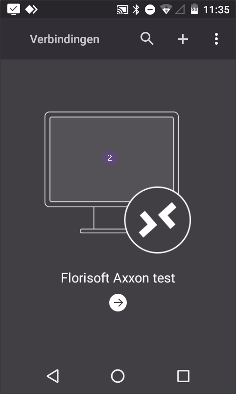

De rdp verbinding wordt tot stand gebracht. Na een aantal seconden start Florisoft automatisch op in de PDA omgeving.

### 4.5 Instellen RDP verbinding BMP florisoftcloud
In deze paragraaf worden de stappen beschreven voor het instellen van een rdp verbinding naar een BMP server in het florisoftcloud domein. Hiervoor wordt gebruik gemaakt van de Parallels Client app.

1. Open de Parallels Client app (hierna Client app) door op het icoon op het startscherm te drukken. (nr. 1)

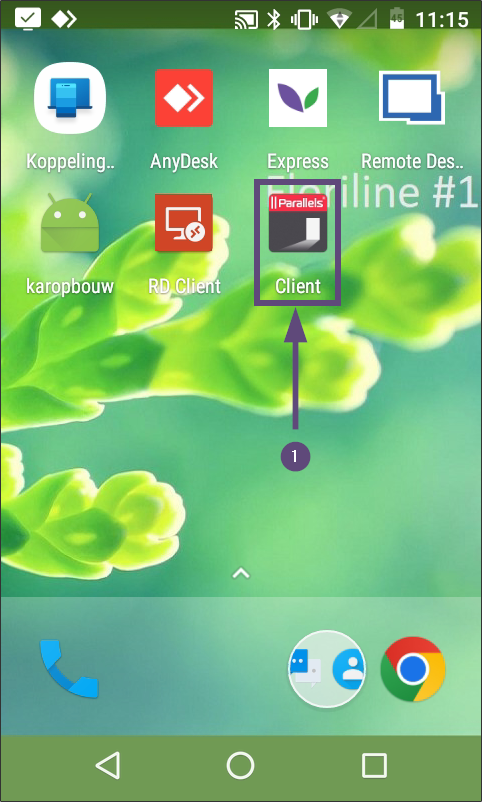

2. Druk op het + karakter in de rechterboven hoek van het Verbindingen scherm. (nr. 2)

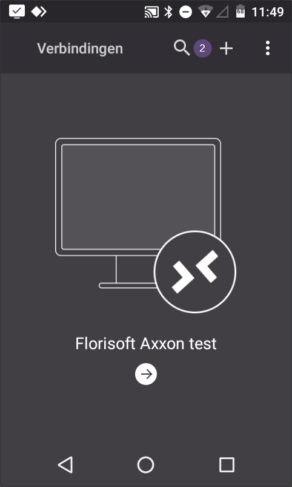

3. Druk op de optie MAAK IN PLAATS DAARVAN EEN RDP-VERBINDING. (nr. 3)

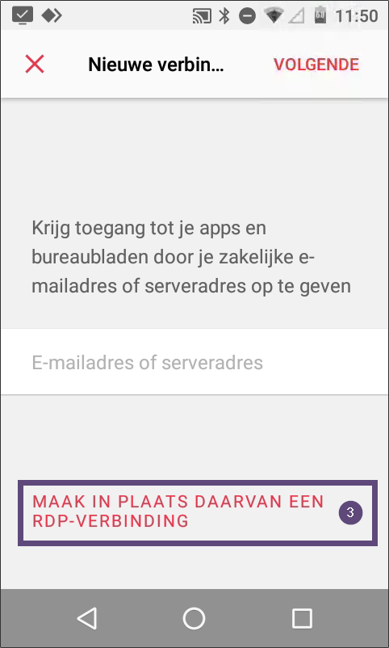

4. Vul een beschrijvende naam in voor de nieuwe rdp verbinding in het veld Beschrijvende naam. (nr. 4)

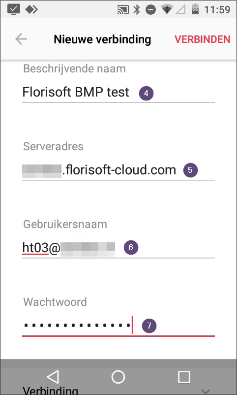

5. Vul in het veld Serveradres de externe naam in van de klantserver. (nr. 5)  

6. Vul in het veld Gebruikersnaam de gebruikersnaam in van de PDA gebruiker. (nr. 6) 

7. Vul in het veld Wachtwoord het wachtwoord in van de PDA gebruiker. (nr. 7) 

Scroll naar beneden voor de overige instellingen.

8. 

Press the down pointing arrow on the right side of the Advanced option. (no. 8)

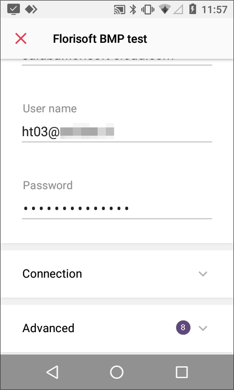

9. Press the Display option. (no. 9)

10. Press the Resolution option in the Display screen. (no. 10)

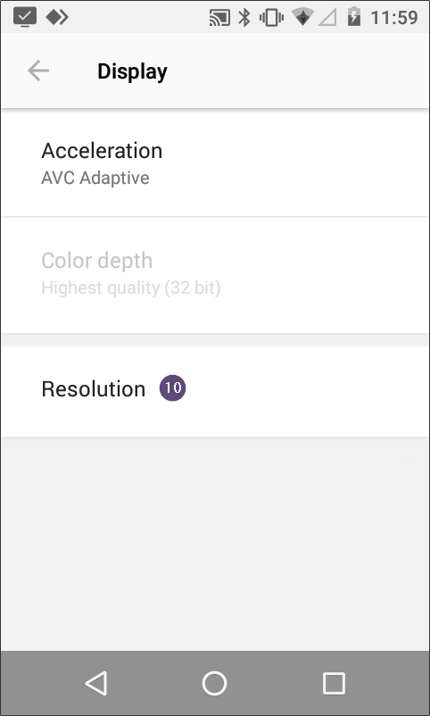

11. Press the Custom option in the Resolution screen. (no. 11)

12. Choose the Custom option and fill in a width and height. (no's 12 up and till 14)

**The values needed for the Width and Height fields in combination with the Scaling option may vary depending the device used. Often used values are:**

**200 x 360, Scaling 100%**
**220 x 360, Scaling 100%**
**1280 x 768, Scaliing 300%**

13. Press the left pointing arrow in the upper left corner of the Custom screen. (no. 15) 

14. Press the left pointing arrow in the upper left corner of the Resolution screen. (no. 16)

15. Press the left pointing arrow in the upper left corner of the Disply screen. (no. 17)

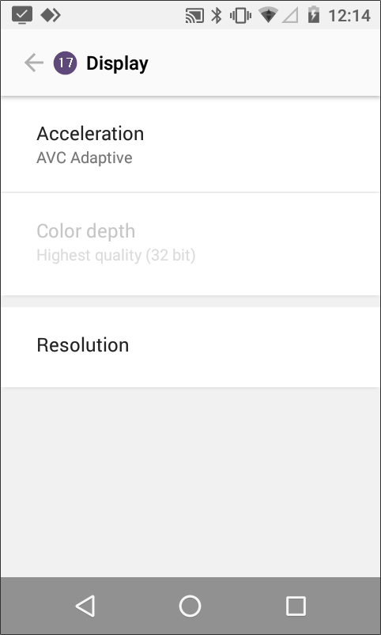

16. Press the SAVE option in the upper right corner of the screen. (no. 18)

The new connection is added to the Connections screen.

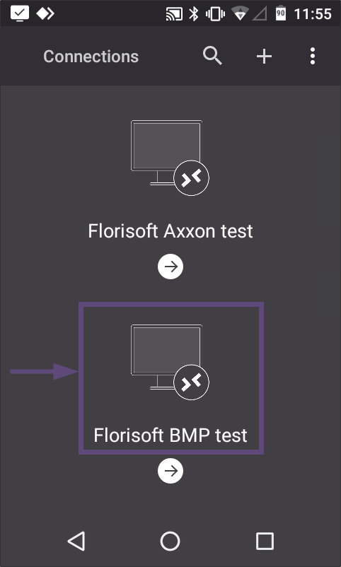

### 4.6 Connect via RDP to a BMP florisoftcloud server
Below you will find the steps for making an rdp connection to an Axxon server in the florisoftcloud domain using the Remote Desktop Manager app.

1. Start the Parallels Client app from the start screen of the PDA. (no. 1)

The Client app starts. Please wait a few seconds.

The Connections screen appears when the app is ready.

2. Press the icon of the concerning rdp connection in the Connections screen. (no. 2)

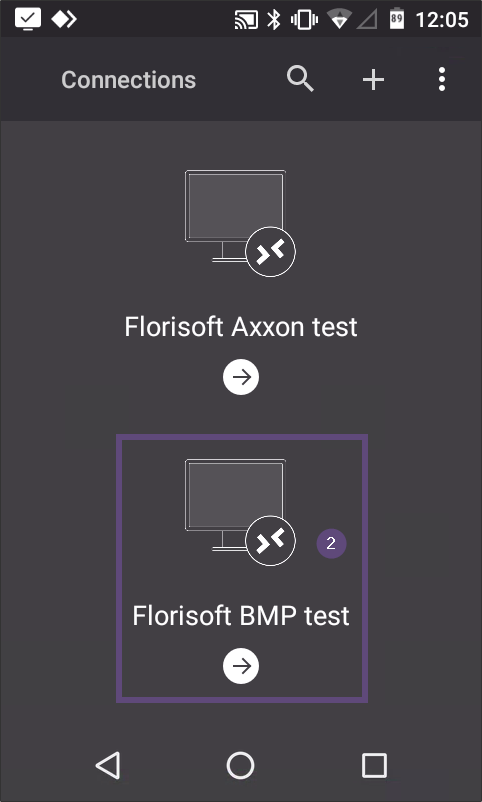

The rdp connection is being established.

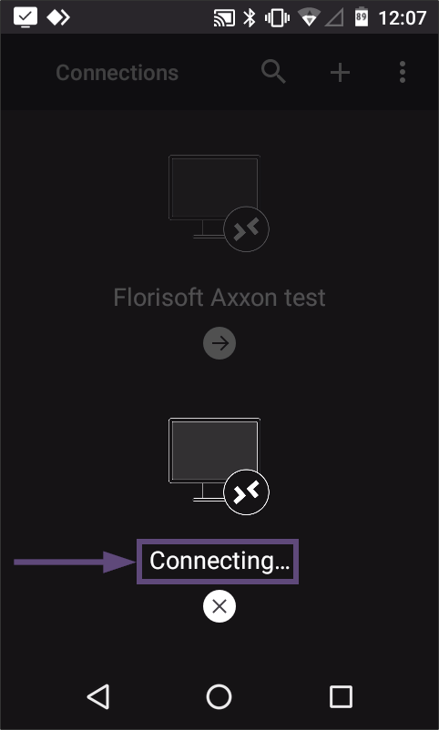

After a few seconds Florisoft starts and shows the PDA environment of the application.

From here you can use a specific PDA application by tapping its icon in one of the four available screens.

### 4.7 Configure Zebra device scanner settings
Beside setting up an rdp connection to a server it is neccesary to configure settings to let the scanner correctly scan different types of barcodes. Follow the steps below to get this done.

>**Pay attention: the screenshots in this section may differ from the ones you see. They differ per device.**

1. Press the DataWedge icon on the apps screen. (no. 1)

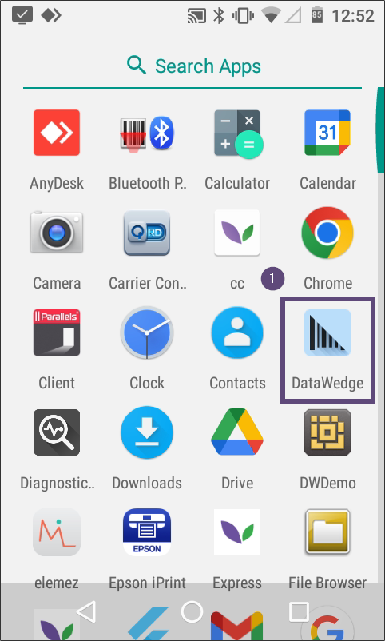

2. Press the Profile0 (default) option in the DataWedge Profiles screen. (no. 2)

3. Enable the Profile enabled checkmark. (no. 3)

4. Enable the Enabled checkmark in the Barcode input section. (no. 4)

Scroll downwards to see more settings.

5. Enable the Enabled checkmark in the Keystroke output section. (no. 5)

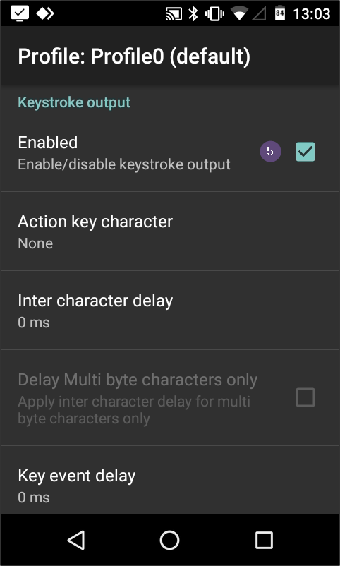

Scroll downwards to see more settings.

6. Enable the Remote Wedge checkmark in the IP output section. (no. 6)

Scroll back topwards.

7. Press the Basic data formatting option. (no. 7)

8. Enable the Enable checkmark in the Keystroke output section. (no. 8) 

9. Enable the Send data checkmark in the Keystroke output section. (no. 9)

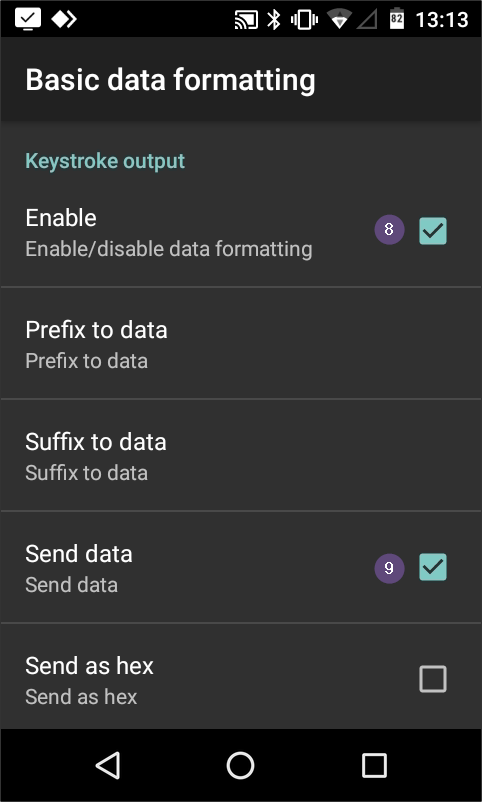

Scroll downwards to see more settings.

10. Enable the Send ENTER key checkmark. (no. 10) 

11. Press the left pointing arrow at the bottom of the screen to go back to the previous screen. (no. 11)

>**Pay attention: there are two Basic data formatting options per profile. So the steps seven up and till eleven must be done twice.**

After both Basic data formatting options are configurerd go further with the steps below:

12. Press the Configure scanner settings option in the Barcode input section. (no. 12)

13. Press the Decoders option. (no. 13)

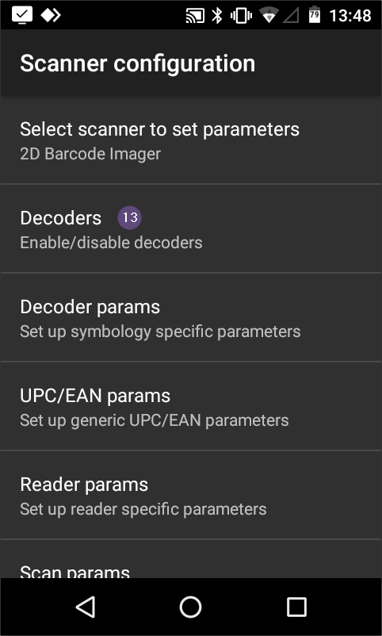

14. Be sure the following checkmarks are activated in the Decoders screen:

- Aztec
- Codabar
- Code128
- Code39
- Datamatrix
- EAN13
- EAN8
- GS1 DataBar
- GS1 DataBar Expanded
- Interleaved 2of5
- MAIL MARK
- Maxicode
- PDF417
- QRCode
- UPCA
- UPCE0

15. Press the left pointing arrow on the bottom of the screen to go back to the previous screen. (no. 14)

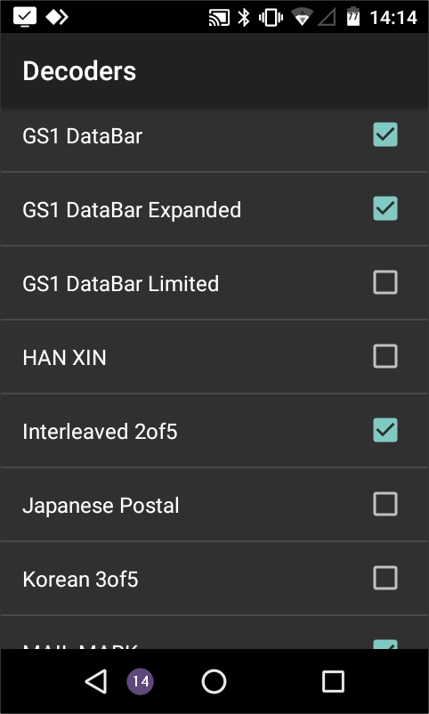

16. Press the Decoder params option in the Scanner configuration screen. (no. 15)

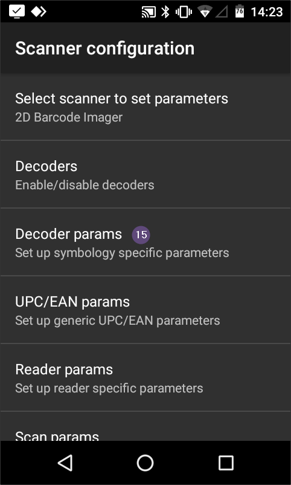

17. Scroll downward and press the Interleaved 2of5 option in the Decoder params screen. (no. 16)

18. Set the Length1 property to 4. Press OK in the bottom right of the screen to confirm the value. (no. 17)

19. Set the Length2 property to 50. Press OK in the bottom right of the screen to confirm the value. (no. 18)

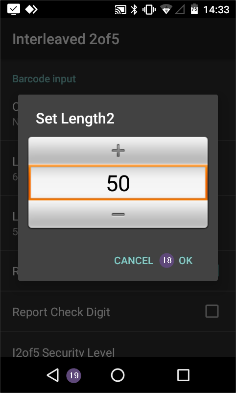

20. Press the left pointing arrow at the bottom of the screen multiple times untill the startscreen of the device becomes visible. (no. 19)

The scanner settings are now configured.