# Manual PDA configuration

## 1. Introduction

Welcome to the PDA configuration manual. This manual describes the steps neccesary to setup a remote desktop connection (RDP) to a server running Florisoft.

PDA's are widely used in combination with Florisoft for severval purposes like mobile selling, scanning barcodes at an entrance control location, sort/locate products in a warehouse and performing final checks on products to be supplied to customers.

To get this done, a connection between the PDA and the server must be made. In most cases this is done via a remote desktop connection. To get this working serveral settings on the PDA and the server need to be set up correctly.

Those settings depends on the type of device you are using in combination with the server. Below several types of devices are described in combination with several server setups.

After this introduction, the Skorpio X5 is the first device which is described in combination with several server set ups.

Thereafter the same explanation is written out for a Zebra TC25 PDA.

## 2. Setup environment settings
Due to security reasons it is desirable that a PDA user only has access to the Florisoft software. The rest of the server must be restricted so the user has less chance to damage other parts of the server.

To get this done certain settings need to be set on the (domain)user accounts of the PDA users.

1. Log into the environment (server) where the user accounts are defined. In most cases this will be a machine which acts as a domain controller.  

2. Open the concerning PDA user, eg. PDA01 or HT11 by double clicking on its name. The users' Properties windows open. See the screenshot below:  

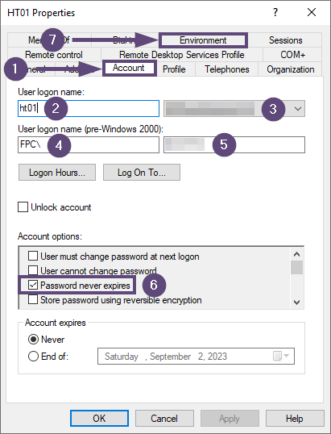

3. Navigate to the Account tab. (no. 1)  

4. Fill in the username in the User logon name: field. (no. 2)  

5. Select the concerning domain in the adjacent dropdown (no. 3)  

6. Fill in the correct domain in the User logon name (pre-Windows 2000): field (no. 4)

How to know the correct domain name? This depends on the type of cloud environment. See below for the most common cloud environments that are used in combination with Florisoft:

**Reset:** FPC\
**Reset (private cloud):** FSPC\
**Axxon:** FLORISOFTCLOUD\
**Auton:** FLORICLOUD\
**BMP:** FLORISOFT-CLOUD

7. Fill in the value [username_customercode] in the adjacent field. (no. 5)  

8. Check the Password never expires tick (no. 6) in the Account options section.  

9. Click the Environment tab (no. 7)  

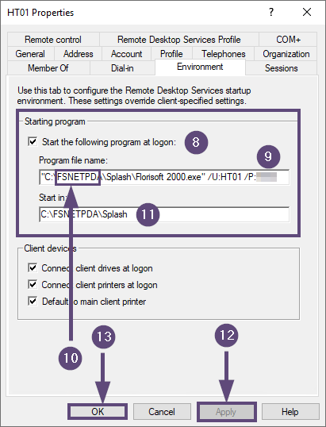

10. Tick the Start the following program at logon: checkmark. (no. 8)  

11. Fill in the correct path to the concerning florisoft 2000.exe in the Program file name: field (no. 9)

>**Pay attention: please add the /U: and /P: parameters after the closing double apostrophe behind florisoft 2000.exe. Give them the Florisoft username and password as values. This ensures that this Windows user is linked to a specific PDA user in Florisoft.**

The default way of working with PDA's in Florisoft is to give them their own client folder. In most cases the client folder for PDA's is called something like FSNETHT, FSNETPDA, or one of those names followed by a serial number like FSNETHT01, FSNETPDA02, etc. (no. 10)

12. Fill in the Start in field (no. 11) the same value as in the Program file name field (no. 9) but remove everyting after Splash\   

13. Click the Apply button (no. 12) to confirm the settings.  

14. Click the OK button (no. 13) to close the users properties window.

Repeat the steps two up and till fourteen for every PDA user which is available on the server.

>**Pay attention: sometimes it is neccesary to add some registry keys to the RDS as well as the domain controller to automaticlly start exe's like Florisoft. This can only be done by experienced IT personel. This only applies from Windows Server 2019 and upwards.**

## 3. Skorpio X5
The first device is the Skorpio X5. This PDA has a fysical keyboard available. See the image below for an example.

>**Pay attention: the image above can be slightly different then the actual device of the user.**

### 3.1 Preparing the device
[HIER UITLEG GEVEN OVER DE EERSTE CONFIGURATIE WANNEER DE PDA UIT DE DOOS GEHAALD WORDT.]

### 3.2 Setup RDP connection Reset florisoftcloud
Below you will find the steps required for setting up an rdp connection to a Reset server in the florisoftcloud domain using the Remote Desktop Manager app.

1. Open the Remote Desktop Mangager app by tapping its icon on the home screen of the PDA. (no. 1)

The Remote Desktop Manager app starts. Please wait a few seconds.

The Home screen appears when the app is ready.

2. Press the + button in the bottom right corner of the app screen. (no. 2)

3. Choose the RDP (Microsoft Remote Desktop) option (no. 3)

The screen for adding a new rdp profile appears. See the screenshot below.

4. Fill in a friendly name in the Name field (no. 4) for the rdp profile to be created.  

5. Scroll down to the LOGON section.  

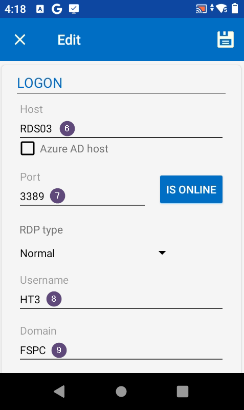

6. Fill the Host field with the value RDS03 (no. 6)  

7. Fill the correct port number (3389) in het the Port field (no. 7)  

8. At the Username field enter te username of the concerning PDA (no. 8)

>**Pay attention: do not add a domain (@[DOMAIN]) behind the username.**

9. Scoll down further till the password field appears.  

10. Enter the password for the concerning user in the password field (no. 9)

11. Press the Display section to open those settings (no. 10)  

12. Fill at the Custom width field the value 240 (no. 11)

13. Fill at the Custom width field the value 360 (no. 12)  

14. Press the left pointing arrow at the top of the screen to go back to the previous screen. (no. 13)  

15. Scroll down to the Local Resources section and press on it. (no. 14)

16. Scroll down to the bottom of the screen and uncheck the Clipboard checkmark under LOCAL DEVICES AND RESOURCES. (no. 15)

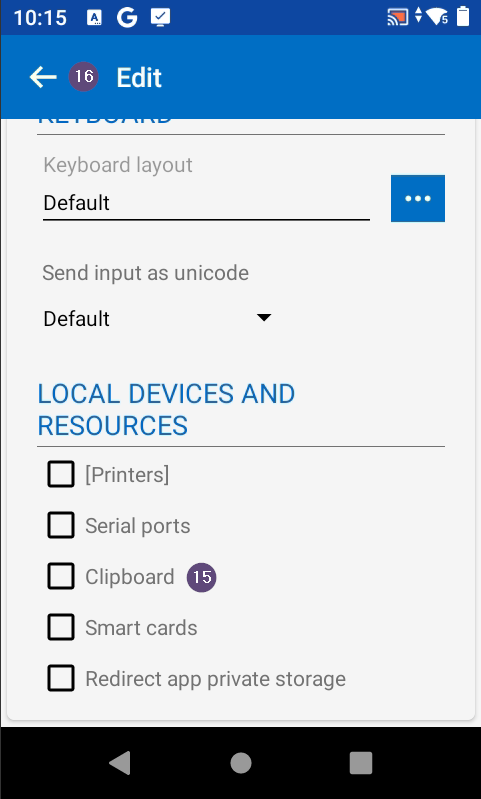

17. Press the left pointing arrow at the top of the screen to go back to the previous screen. (no. 16)  

18. Scroll down to the Experience section and press on it. (no. 17)

20. Check the settings profile at the top of the screen. (no. 18) Be sure that the profile is set to Default.

21. Be sure that all checkmarks under Allow the following are **unchecked** except the Reconnect if connection is dropped one. (no. 19)  

22.  Press the left pointing arrow at the top of the screen to go back to the previous screen. (no. 20)  

23. Press the Connection option (no. 21) to open the concerning settings.

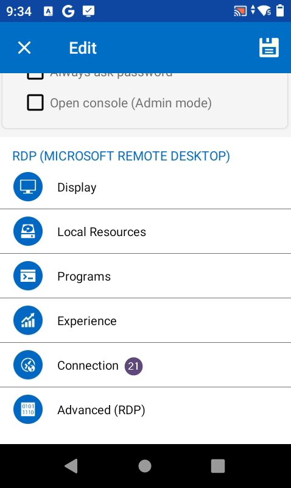

24. Check if Default (no. 22) is selected below the sentence If the actual verification does not meet minimum policy requirements.

25. Check the Ativate network level authentication NLA (SingleSignOn) tickbox (no. 23)  

26. Select the Use these RD Gateway server settings (no. 24) below GATEWAY  

27. At the Host field (no. 25) fill the RD gateway host to connect with. In most cases this host name has a format like CUSTOMERCODE.florisoftcloud.com.

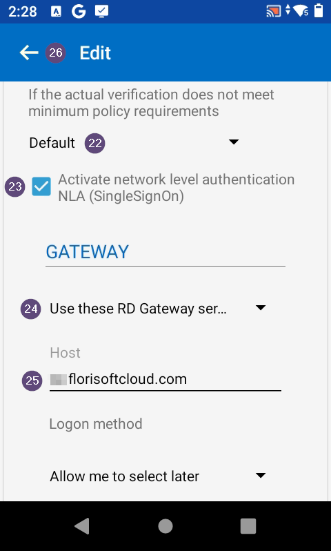

Scroll further down this screen to see the settings below.

28. Press the button CREDENTIALS... (no. 26) The screen below opens.

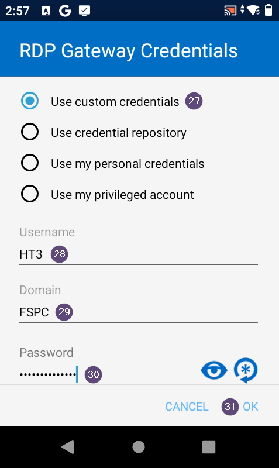

29. Be sure to check the Use custom credentials option (no. 27)  

30. Fill the Windows username of the PDA account in the Username field (no. 28)  

31. Fill FSPC (no. 29) in the Domain field.  

32. Fill in the concerning password which belongs to the username as entered in step 30 above.  

33. Press the OK button (no. 31) in the bottom right corner of the screen to save the settings and return to the previous screen.

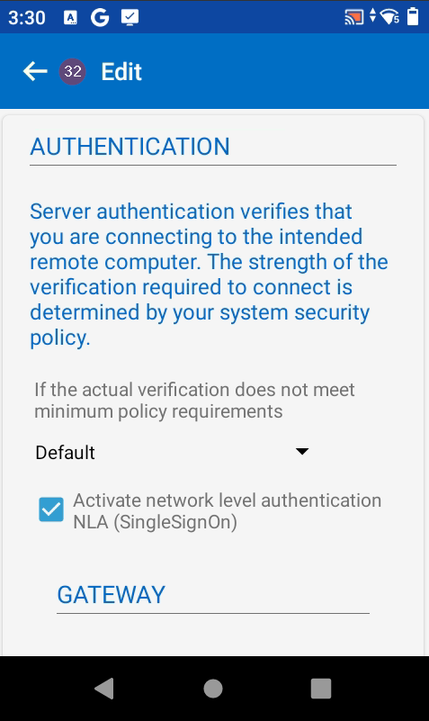

34. Press the left pointing arrow at the top of the screen to go back to the previous screen. (no. 32)  

35. Press the save icon in the upper right corner of the screen. (no. 33)

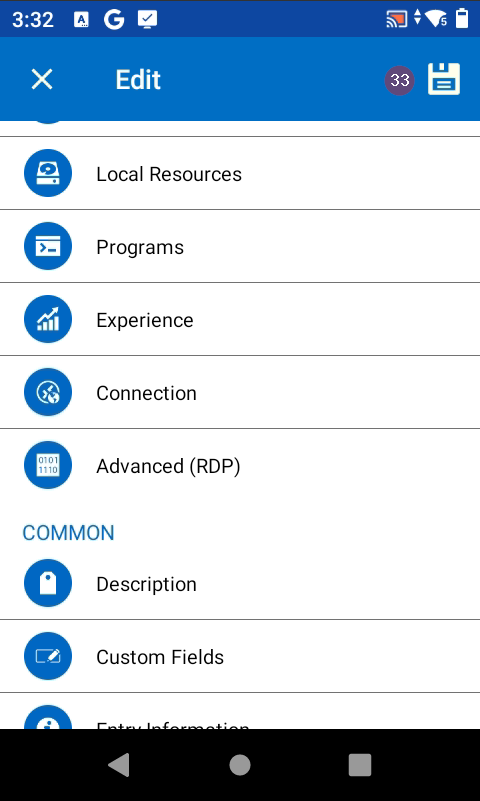

A small icon of a spinning circle appears when the settings are being saved. This may take a few seconds.

The PDA returns to the Home page where all defined rdp connections are visible.

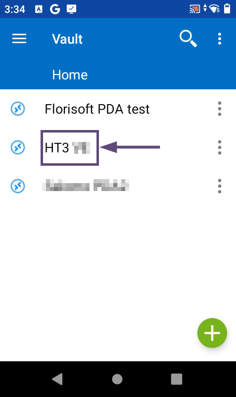

### 3.3 Connect via RDP to a Reset florisoftcloud server
Below you will find the steps for making an rdp connection to a Reset server in the florisoftcloud domain using the Remote Desktop Manager app.

1. Start the Remote Desktop Manager app from the start screen of the PDA. (no. 1)

The Remote Desktop Manager app starts. Please wait a few seconds.

The Home screen appears when the app is ready.

2. Press the three dots behind the name of the concerning rdp profile (no. 2) A small menu with a few options appears.

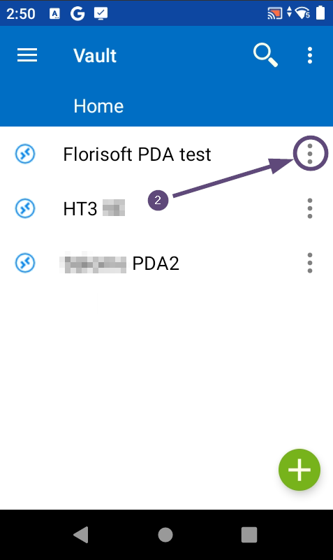

3. Press the Open option (no. 3)

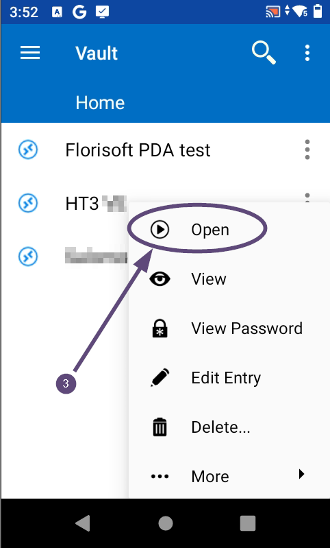

A rotating indicator appears on the screen while the connection to the server is being esthablished.

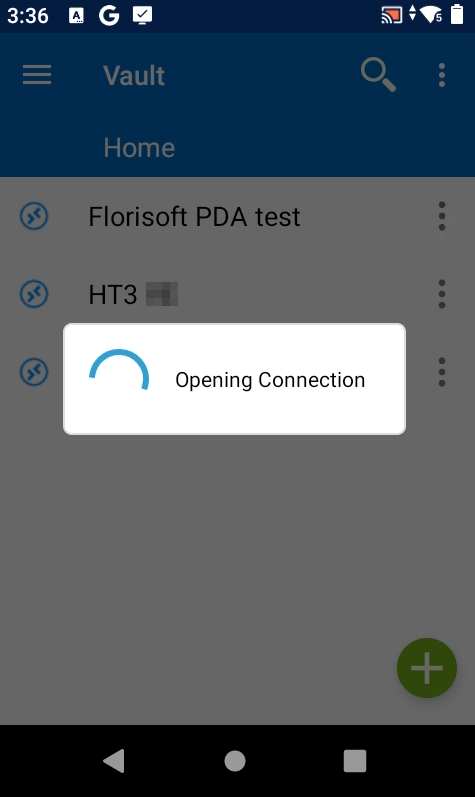

After a few seconds the connection is made. A Windows login screen becomes visible on the PDA.
This screen is followed by the splash (loading) screen of Florisoft. After this, the PDA software appears on the screen.

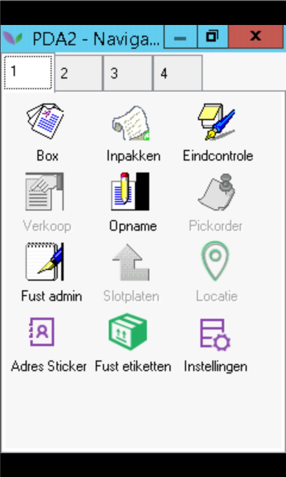

From here you can use a specific PDA application by tapping its icon in one of the four available screens.
    
### 3.4 Setup RDP connection Axxon florisoftcloud
Below you will find the steps required for setting up an rdp connection to a Axxon server in the florisoftcloud domain using the Remote Desktop Manager app.

1. Open the Remote Desktop Mangager app by tapping its icon on the home screen of the PDA. (no. 1)

The Remote Desktop Manager app starts. Please wait a few seconds.

The Home screen appears when the app is ready.

2. Press the + button in the bottom right corner of the app screen. (no. 2)

3. Choose the RDP (Microsoft Remote Desktop) option (no. 3)

The screen for adding a new rdp profile appears. See the screenshot below.

4. Fill in a friendly name in the Name field (no. 4) for the rdp profile to be created.

5. Scroll down to the LOGON section.

6. Fill the Host field with the hostname of the server to be connected to (no. 6)  

7. Fill the correct port number in het the Port field (no. 7)  

8. At the Username field enter te username of the concerning PDA (no. 8)  

9. Scoll down further till the password field appears.  

10. Enter the password for the concerning user in the password field (no. 9)

11. Press the Display section to open those settings (no. 10)  

12. Fill at the Custom width field the value 240 (no. 11)

13. Fill at the Custom width field the value 360 (no. 12)  

14. Scoll down further till the password field appears.  

15. Press the left pointing arrow at the top of the screen to go back to the previous screen. (no. 13)  

16. Scroll down to the Local Resources section and press on it. (no. 14)

17. Scroll down to the bottom of the screen and uncheck the Clipboard checkmark under LOCAL DEVICES AND RESOURCES. (no. 15)

18. Press the left pointing arrow at the top of the screen to go back to the previous screen. (no. 16)  

19. Scroll down to the Experience section and press on it. (no. 17)

20. Check the settings profile at the top of the screen. (no. 18) Be sure that the profile is set to Default.

21. Be sure that all checkmarks under Allow the following are **unchecked** except the Reconnect if connection is dropped one. (no. 19)  

22.  Press the left pointing arrow at the top of the screen to go back to the previous screen. (no. 20)  

23. Press the save icon in the upper right corner of the screen. (no. 21)

A small icon of a spinning circle appears when the settings are being saved. This takes a few seconds in total.

The PDA returns to the Home page where all defined rdp connections are visible.

### 3.5 Connect via RDP to an Axxon florisoftcloud server
Below you will find the steps for making an rdp connection to an Axxon server in the florisoftcloud domain using the Remote Desktop Manager app.

1. Start the Remote Desktop Manager app from the start screen of the PDA. (no. 1)

The Remote Desktop Manager app starts. Please wait a few seconds.

The Home screen appears when the app is ready.

2. Press the three dots behind the name of the concerning rdp profile. (no. 2) A small menu with a few options appears.

3. Press the Open option (no. 3)

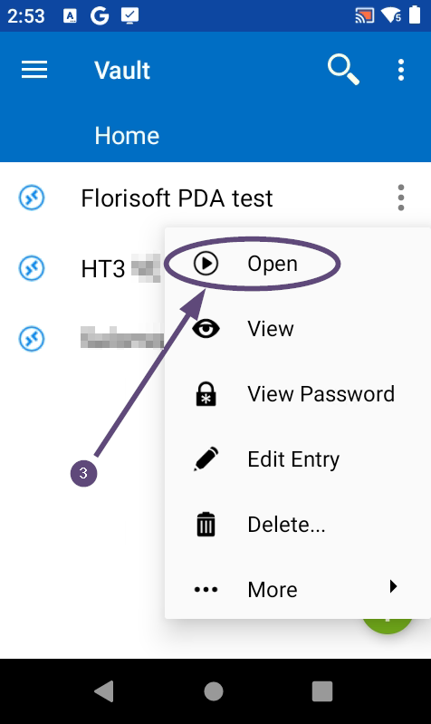

A rotating indicator appears on the screen while the connection to the server is being esthablished.

After a few seconds the connection is made. A Windows login screen becomes visible on the PDA.
This screen is followed by the splash (loading) screen of Florisoft. After this, the PDA software appears on the screen.

From here you can use a specific PDA application by tapping its icon in one of the four available screens.

### 3.6 Setup RDP connection BMP florisoftcloud
Below you will find the steps required for setting up an rdp connection to a BMP server in the florisoftcloud domain using the Remote Desktop Manager app.

1. Open the Remote Desktop Mangager app by tapping its icon on the home screen of the PDA. (no. 1)

The Remote Desktop Manager app starts. Please wait a few seconds.

The Home screen appears when the app is ready.

2. Press the + button in the bottom right corner of the app screen. (no. 2)

3. Choose the RDP (Microsoft Remote Desktop) option (no. 3)

The screen for adding a new rdp profile appears. See the screenshot below.

4. Fill in a friendly name in the Name field (no. 4) for the rdp profile to be created.

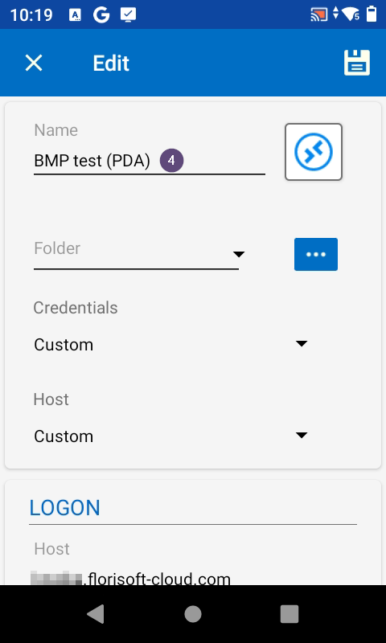

5. Scroll down to the LOGON section.

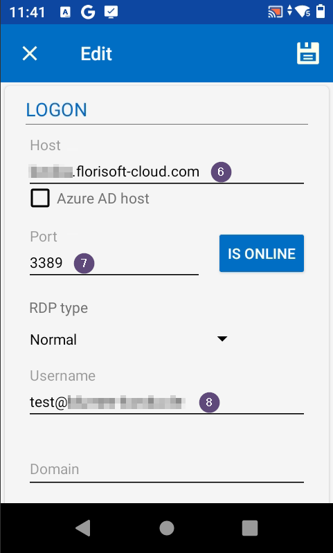

6. Fill the Host field with the hostname of the server to be connected to (no. 6)  

7. Fill the correct port number in het the Port field (no. 7)  

8. At the Username field enter te username of the concerning PDA (no. 8)  

9. Scoll down further till the password field appears.  

10. Enter the password for the concerning user in the password field (no. 9)

11. Press the Display section to open those settings (no. 10)  

12. Fill at the Custom width field the value 240 (no. 11)

13. Fill at the Custom width field the value 360 (no. 12)  

14. Scoll down further till the password field appears.  

15. Press the left pointing arrow at the top of the screen to go back to the previous screen. (no. 13)  

16. Scroll down to the Local Resources section and press on it. (no. 14)

17. Scroll down to the bottom of the screen and uncheck the Clipboard checkmark under LOCAL DEVICES AND RESOURCES. (no. 15)

18. Press the left pointing arrow at the top of the screen to go back to the previous screen. (no. 16)  

19. Scroll down to the Experience section and press on it. (no. 17)

20. Check the settings profile at the top of the screen. (no. 18) Be sure that the profile is set to Default.

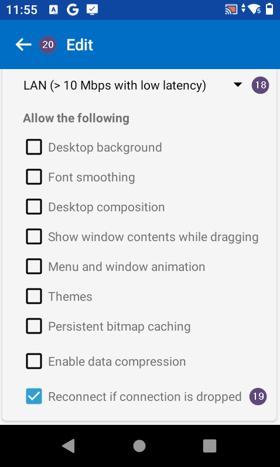

21. Be sure that all checkmarks under Allow the following are **unchecked** except the Reconnect if connection is dropped one. (no. 19)  

22.  Press the left pointing arrow at the top of the screen to go back to the previous screen. (no. 20)  

23. Press the save icon in the upper right corner of the screen. (no. 21)

A small icon of a spinning circle appears when the settings are being saved. This takes a few seconds in total.

The PDA returns to the Home page where all defined rdp connections are visible.

### 3.7 Connect via RDP to a BMP florisoftcloud server
Below you will find the steps for making an rdp connection to an Axxon server in the florisoftcloud domain using the Remote Desktop Manager app.

1. Start the Remote Desktop Manager app from the start screen of the PDA. (no. 1)

The Remote Desktop Manager app starts. Please wait a few seconds.

The Home screen appears when the app is ready.

2. Press the three dots behind the name of the concerning rdp profile. (no. 2) A small menu with a few options appears.

3. Press the Open option (no. 3)

A rotating indicator appears on the screen while the connection to the server is being esthablished.

After a few seconds the connection is made. A Windows login screen becomes visible on the PDA.
This screen is followed by the splash (loading) screen of Florisoft. After this, the PDA software appears on the screen.

From here you can use a specific PDA application by tapping its icon in one of the four available screens.

## 4. Zebra TC56
This chapter describes the steps involved for creating an RDP connection on a Zebra TC56 PDA.