# Manual PDA configuration

Welcome tot the PDA configuration manual. This manual describes the steps neccesary to setup a remote desktop connection (RDP) to a server running Florisoft.

PDA's are widely used in combination with Florisoft for severval purposes like mobile selling, scanning barcodes at an entrance control location, sort/locate products in a warehouse and performing final checks on products to be supplied to customers.

To get this done, a connection between the PDA and the server must be made. In most cases this is done via a remote desktop connection. To get this working serveral settings on the PDA and the server need to be set up correctly.

Those settings depends on the type of device you are using in combination with the server. Below several types of devices are described in combination with several server setups.

After this introduction, the Skorpio X5 is the first device which is described in combination with several server set ups.

Thereafter the same explanation is written out for a Zebra TC56 PDA.

## Setup environment settings
Due to security reasons it is desirable that a PDA user only has access to the Florisoft software. The rest of the server must be restricted so the user has less chance to damage something.

To get this done certain settings need to be set on the (domain)user accounts of the PDA users.

1. Log into the environment (server) where the user accounts are defined. In most cases this will be a machine which acts as a domain controller.  

2. Open the concerning PDA user, eg. PDA1 or HT1 by double clicking on its name. The users' Properties windows open. See the screenshot below:  

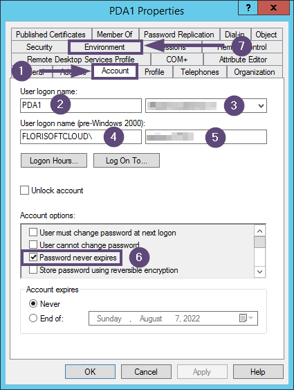

3. Navigate to the Account tab. (no. 1)  

4. Fill in the username in the User logon name: field. (no. 2)  

5. Select the concerning domain in the adjacent dropdown (no. 3)  

6. Fill in FLORISOFTCLOUD\ in the User logon name (pre-Windows 2000): field (no. 4)  

7. Fill in the value [machinename_username] in the adjacent field. (no. 5)  

8. Check the Password never expires tick (no. 6) in the Account options section.  

9. Click the Environment tab (no. 7)  

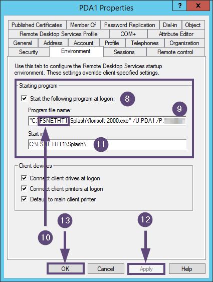

10. Tick the Start the following program at logon: checkmark. (no. 8)  

11. Fill in the correct path to the concerning florisoft 2000.exe in the Program file name: field (no. 9)

>**Pay attention: please add the /U: and /P: parameters after the closing double apostrophe behind florisoft 2000.exe. Give them the Florisoft username and password as values. This ensures that this Windows user is linked to a specific PDA user in Florisoft.**

The default way of working with PDA's in Florisoft is to give them their own client folder. In most cases the client folder for PDA's is called something like FSNETHT, FSNETPDA, or one of those names followed by a serial number like FSNETHT1, FSNETPDA2, etc. (no. 10)

12. Fill in the Start in field (no. 11) the same value as in the Program file name field (no. 9) but remove everyting after Splash\   

13. Click the Apply button (no. 12) to confirm the settings.  

14. Click the OK button (no. 13) to close the users properties window.

Repeat the steps two up and till fourteen for every PDA user which is available on the server.

>**Pay attention: starting with Windows Server 2019 and upwards, some registry keys need to be added to the RDS server as well as the domain controller to automaticlly start exe's like Florisoft. This can only be done by experienced IT personel.**

## Skorpio X5
The first device is the Skorpio X5. This PDA has a fysical keyboard available. See the image below for an example.

### Preparing the device

### Setup RDP connection Reset florisoftcloud
Below you will find the steps required for setting up an rdp connection to a Reset server in the florisoftcloud domain using the Remote Desktop Manager app.

1. 

### Setup RDP connection Axxon florisoftcloud
Below you will find the steps required for setting up an rdp connection to a Axxon server in the florisoftcloud domain using the Remote Desktop Manager app.

1. Open the Remote Desktop Mangager app by tapping its icon on the home screen of the PDA. (no. 1)

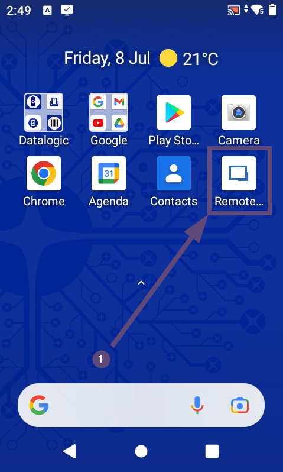

The Remote Desktop Manager app starts. Please wait a few seconds.

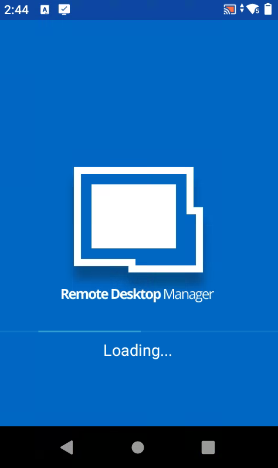

The Home screen appears when the app is ready.

2. Press the + button in the bottom right corner of the app screen. (no. 2)

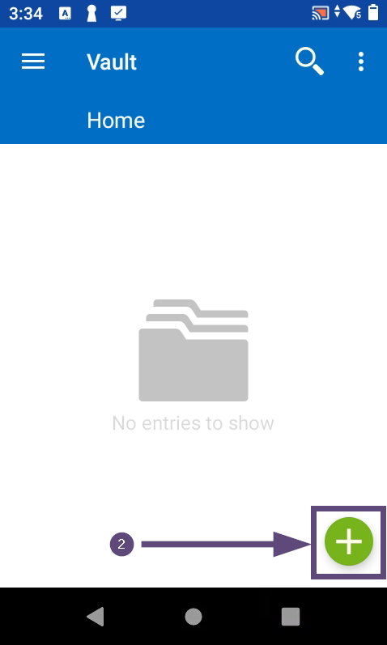

3. Choose the RDP (Microsoft Remote Desktop) option (no. 3)

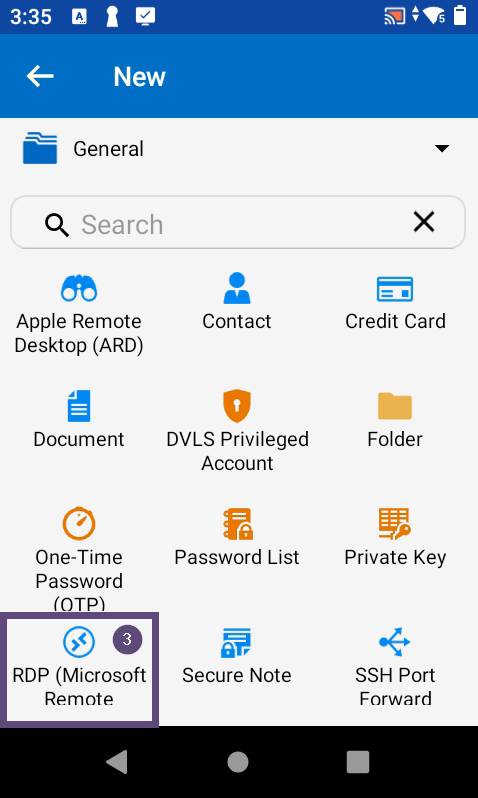

The screen for adding a new rdp profile appears. See the screenshot below.

4. Fill in a friendly name in the Name field (no. 4) for the rdp profile to be created.

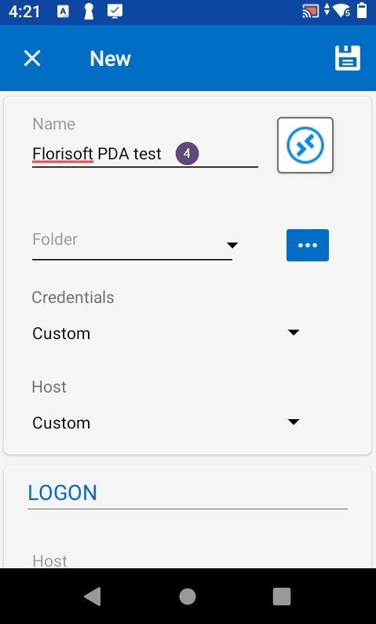

5. Scroll down to the LOGON section.  

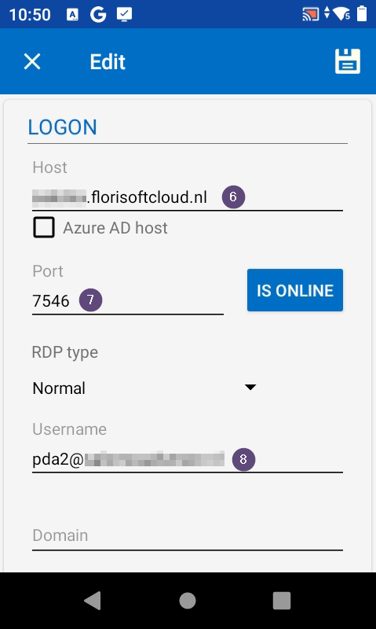

6. Fill the Host field with the hostname of the server to be connected to (no. 6)  

7. Fill the correct port number in het the Port field (no. 7)  

8. At the Username field enter te username of the concerning PDA (no. 8)  

9. Scoll down further till the password field appears.  

10. Enter the password for the concerning user in the password field (no. 9)

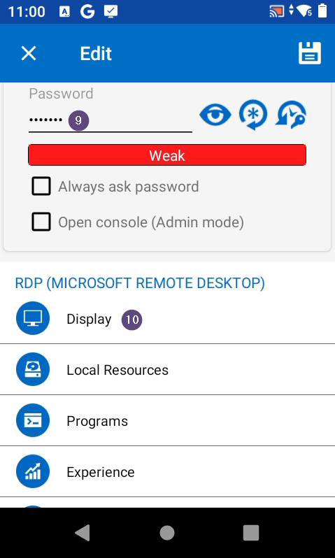

11. Press the Display section to open those settings (no. 10)  

12. Fill at the Custom width field the value 240 (no. 11)

13. Fill at the Custom width field the value 360 (no. 12)  

14. Scoll down further till the password field appears.  

15. Press the left pointing arrow at the top of the screen to go back to the previous screen. (no. 13)  

16. Scroll down to the Local Resources section and press on it. (no. 14)

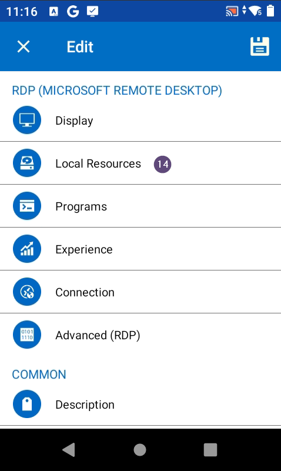

17. Scroll down to the bottom of the screen and uncheck the Clipboard checkmark under LOCAL DEVICES AND RESOURCES. (no. 15)  

18. Press the left pointing arrow at the top of the screen to go back to the previous screen. (no. 16)  

19. Scroll down to the Local Experience section and press on it. (no. 17)

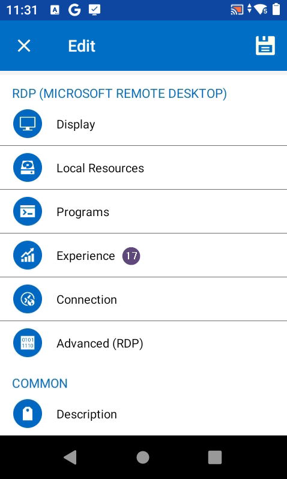

20. Check the settings profile at the top of the screen. (no. 18) Be sure that the profile is set to Default.

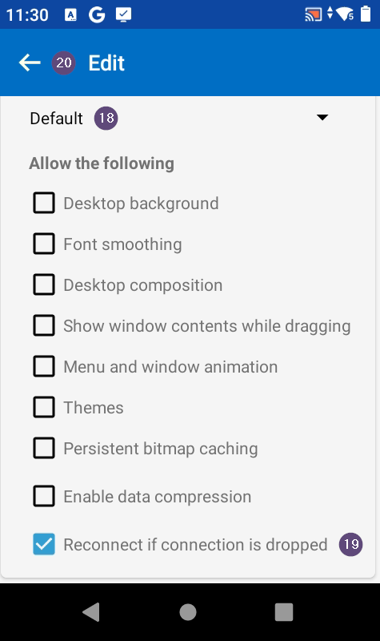

21. Be sure that all checkmarks under Allow the following are **unchecked** except the Reconnect if connection is dropped one. (no. 19)  

22.  Press the left pointing arrow at the top of the screen to go back to the previous screen. (no. 20)  

23. Press the save icon in the upper right corner of the screen. (no. 21)

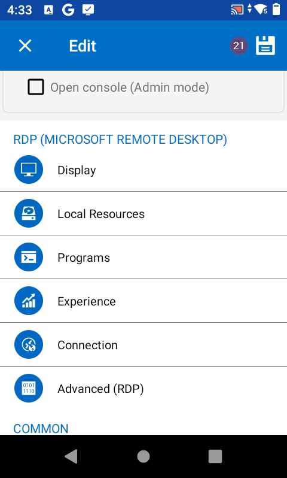

A small icon of a spinning circle appears when the settings are being saved. This takes a few seconds in total.

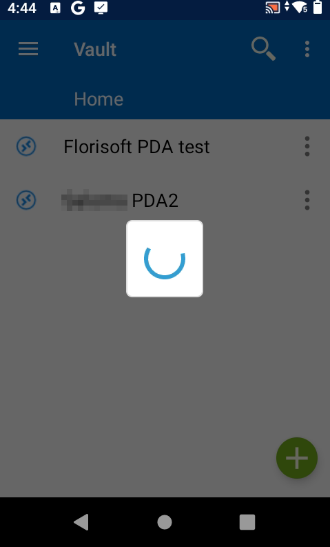

The PDA returns to the Home page where all defined rdp connections are visible.

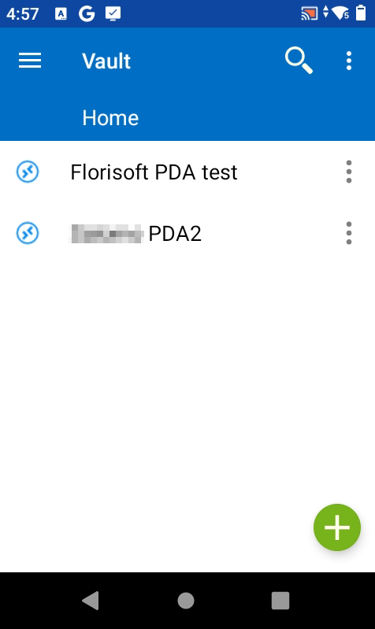

### Connect via RDP to an Axxon florisoftcloud server
Below you will find the steps for making an rdp connection to an Axxon server in the florisoftcloud domain using the Remote Desktop Manager app.

1. Start the Remote Desktop Manager app from the start screen of the PDA. (no. 1)

The Remote Desktop Manager app starts. Please wait a few seconds.

The Home screen appears when the app is ready.

2. Press the three dots behind the name of the concerning rdp profile. (no. 2) A small menu with a few options appears.

