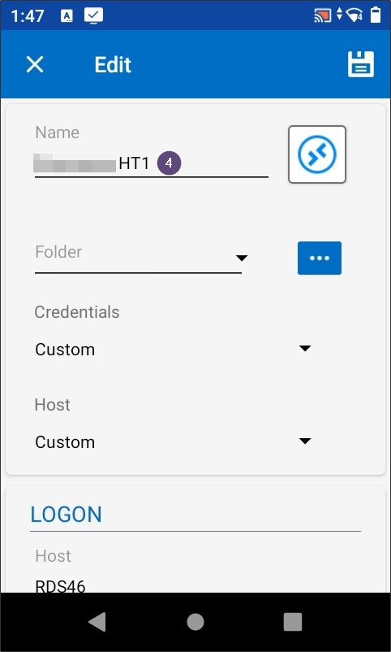
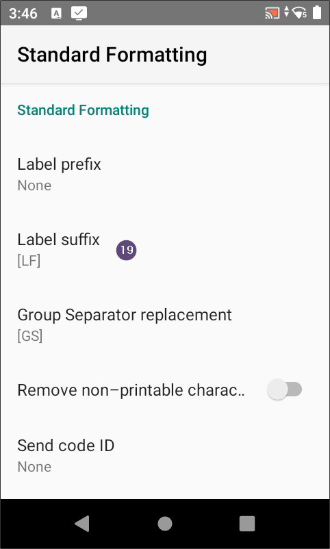
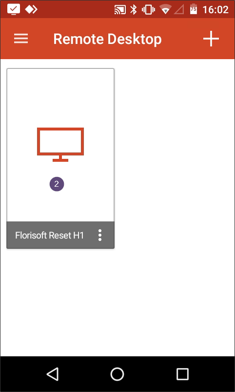

# Manual PDA configuration

## 1. Introduction

Welcome to the PDA configuration manual. This manual describes the steps neccesary to setup a remote desktop connection (RDP) to a server running Florisoft.

PDA's are widely used in combination with Florisoft for severval purposes like mobile selling, scanning barcodes at an entrance control location, sort/locate products in a warehouse and performing final checks on products to be supplied to customers.

To get this done, a connection between the PDA and the server must be made. In most cases this is done via a remote desktop connection. To get this working serveral settings on the PDA and the server need to be set up correctly.

Those settings depends on the type of device you are using in combination with the server. Below several types of devices are described in combination with several server setups.

After this introduction, the Skorpio X5 is the first device which is described in combination with several server set ups.

Thereafter the same explanation is written out for a Zebra TC25 PDA.

## 2. Setup environment settings
Due to security reasons it is desirable that a PDA user only has access to the Florisoft software. The rest of the server must be restricted so the user has less chance to damage other parts of the server.

To get this done certain settings need to be set on the (domain)user accounts of the PDA users.

1. Log into the environment (server) where the user accounts are defined. In most cases this will be a machine which acts as a domain controller.  

2. Open the concerning PDA user, eg. PDA01 or HT11 by double clicking on its name. The users' Properties windows open. See the screenshot below:  

3. Navigate to the Account tab. (no. 1)  

4. Fill in the username in the User logon name: field. (no. 2)  

5. Select the concerning domain in the adjacent dropdown. (no. 3)  

6. Fill in the correct domain in the User logon name (pre-Windows 2000): field (no. 4)

How to know the correct domain name? This depends on the type of cloud environment. See below for the most common cloud environments that are used in combination with Florisoft:

**Reset:** FPC\
**Reset (private cloud):** FSPC\
**Axxon:** FLORISOFTCLOUD\
**Auton:** FLORICLOUD\
**BMP:** FLORISOFT-CLOUD

7. Fill in the value [username_customercode] in the adjacent field. (no. 5)  

8. Check the Password never expires tick in the Account options section. (no. 6)   

9. Click the Environment tab. (no. 7)  

10. Tick the Start the following program at logon: checkmark. (no. 8)  

11. Fill in the correct path to the concerning florisoft 2000.exe in the Program file name: field. (no. 9)

>**Pay attention: please add the /U: and /P: parameters after the closing double apostrophe behind florisoft 2000.exe. Give them the Florisoft username and password as values. This ensures that this Windows user is linked to a specific PDA user in Florisoft.**

The default way of working with PDA's in Florisoft is to give them their own client folder. In most cases the client folder for PDA's is called something like FSNETHT, FSNETPDA, or one of those names followed by a serial number like FSNETHT01, FSNETPDA02, etc. (no. 10)

12. Fill in the Start in field (no. 11) the same value as in the Program file name field (no. 9) but remove everyting after Splash\.   

13. Click the Apply button (no. 12) to confirm the settings.  

14. Click the OK button (no. 13) to close the users properties window.

Repeat the steps two up and till fourteen for every PDA user which is available on the server.

>**Pay attention: sometimes it is neccesary to add some registry keys to the RDS as well as the domain controller to automaticlly start exe's like Florisoft. This can only be done by experienced IT personel. This only applies from Windows Server 2019 and upwards.**
>
>**Details: https://www.chicagotech.net/WordPress/2022/01/24/remote-desktop-services-starting-program-problem-on-windows-2016-and-2019-server/**

## 3. Skorpio X5
The first device is the Skorpio X5. This PDA has a fysical keyboard available. See the image below for an example.

>**Pay attention: the image above can be slightly different then the actual device of the user.**

### 3.1 Setup RDP connection Reset florisoftcloud
Below you will find the steps required for setting up an rdp connection to a Reset server in the florisoftcloud domain using the Remote Desktop Manager app.

1. Open the Remote Desktop Mangager app by tapping its icon on the home screen of the PDA. (no. 1)

The Remote Desktop Manager app starts. Please wait a few seconds.

The Home screen appears when the app is ready.

2. Press the + button in the bottom right corner of the app screen. (no. 2)

3. Choose the RDP (Microsoft Remote Desktop) option. (no. 3)

The screen for adding a new rdp profile appears. See the screenshot below.

4. Fill in a friendly name in the Name field (no. 4) for the rdp profile to be created. 

5. Scroll down to the LOGON section.  

6. Fill the Host field with the internal servername of the customers' server. Reset servers often do have a name following the pattern RDS[number]. (no. 5) 

The internal name of the sever can be found by **right** clikcing the start button and choose the option  System in the context menu.

A settings screen opens where you can find the internal name of the server.

7. Fill the correct port number (3389) in het the Port field. (no. 6)  

8. At the Username field enter te username of the concerning PDA. (no. 7)

>**Pay attention: replace the @ character in the username with an underscore (_) character. Do not add a domain behind the username.**

9. Fill in the domain name (fpc for florisoftcloud.com or fspc for private cloud environments) in the Domain field. (no. 8)

10. Scoll down further till the password field appears.  

10. Enter the password for the concerning user in the password field. (no. 9)

11. Press the Display section to open those settings. (no. 10)  

12. Fill at the Custom width field the value 240. (no. 11)

13. Fill at the Custom width field the value 360. (no. 12)  

14. Press the left pointing arrow at the top of the screen to go back to the previous screen. (no. 13)  

15. Scroll down to the Local Resources section and press on it. (no. 14)

16. Scroll down to the bottom of the screen and uncheck the Clipboard checkmark under LOCAL DEVICES AND RESOURCES. (no. 15)

17. Press the left pointing arrow at the top of the screen to go back to the previous screen. (no. 16)  

18. Scroll down to the Experience section and press on it. (no. 17)

20. Check the settings profile at the top of the screen. (no. 18) Be sure that the profile is set to Default.

21. Be sure that all checkmarks under Allow the following are **unchecked** except the Reconnect if connection is dropped one. (no. 19)  

22.  Press the left pointing arrow at the top of the screen to go back to the previous screen. (no. 20)  

23. Press the Connection option (no. 21) to open the concerning settings.

24. Check if Default (no. 22) is selected below the sentence If the actual verification does not meet minimum policy requirements.

25. Check the Ativate network level authentication NLA (SingleSignOn) tickbox. (no. 23)  

26. Select the Use these RD Gateway server settings (no. 24) below GATEWAY.  

27. At the Host field (no. 25) fill the RD gateway host to connect with. In most cases this host name has a format like CUSTOMERCODE.florisoftcloud.com.

Scroll further down this screen to see the settings below.

28. Press the button CREDENTIALS... (no. 26) The screen below opens.

29. Be sure to check the Use custom credentials option. (no. 27)  

30. Fill the Windows username of the PDA account in the Username field. (no. 28) 

**The @-character in the username must be replaced with an underscore character (_)**

31. Fill the internal domain name of the server in the Domain field. (no. 29)  

32. Fill in the concerning password which belongs to the username as entered in step 30 above.  

33. Press the OK button (no. 31) in the bottom right corner of the screen to save the settings and return to the previous screen.

34. Press the left pointing arrow at the top of the screen to go back to the previous screen. (no. 32)  

35. Press the save icon in the upper right corner of the screen. (no. 33)

A small icon of a spinning circle appears when the settings are being saved. This may take a few seconds.

The PDA returns to the Home page where all defined rdp connections are visible.

### 3.2 Connect via RDP to a Reset florisoftcloud server
Below you will find the steps for making an rdp connection to a Reset server in the florisoftcloud domain using the Remote Desktop Manager app.

1. Start the Remote Desktop Manager app from the start screen of the PDA. (no. 1)

The Remote Desktop Manager app starts. Please wait a few seconds.

The Home screen appears when the app is ready.

2. Press the three dots behind the name of the concerning rdp profile. (no. 2) A small menu with a few options appears.

3. Press the Open option. (no. 3)

A rotating indicator appears on the screen while the connection to the server is being esthablished.

The next screen is something similar as the screen below.

After a few seconds the connection is made. A Windows login screen becomes visible on the PDA. This screen is automaticly followed by the splash (loading) screen of Florisoft. After this, the PDA software appears on the screen.

From here you can use a specific PDA application by tapping its icon in one of the four available screens.
    
### 3.3 Setup RDP connection Axxon florisoftcloud
Below you will find the steps required for setting up an rdp connection to an Axxon server in the florisoftcloud domain using the Remote Desktop Manager app.

1. Open the Remote Desktop Mangager app by tapping its icon on the home screen of the PDA. (no. 1)

The Remote Desktop Manager app starts. Please wait a few seconds.

The Home screen appears when the app is ready.

2. Press the + button in the bottom right corner of the app screen. (no. 2)

3. Choose the RDP (Microsoft Remote Desktop) option. (no. 3)

The screen for adding a new rdp profile appears. See the screenshot below.

4. Fill in a friendly name in the Name field (no. 4) for the rdp profile to be created.

5. Scroll down to the LOGON section.

6. Fill the Host field with the hostname of the server to be connected to. (no. 6)  

7. Fill the correct port number in het the Port field. (no. 7)  

8. At the Username field enter te username of the concerning PDA. (no. 8)  

9. Scoll down further till the password field appears.  

10. Enter the password for the concerning user in the password field. (no. 9)

11. Press the Display section to open those settings. (no. 10)  

12. Fill at the Custom width field the value 240. (no. 11)

13. Fill at the Custom width field the value 360. (no. 12)  

14. Scoll down further till the password field appears.  

15. Press the left pointing arrow at the top of the screen to go back to the previous screen. (no. 13)  

16. Scroll down to the Local Resources section and press on it. (no. 14)

17. Scroll down to the bottom of the screen and uncheck the Clipboard checkmark under LOCAL DEVICES AND RESOURCES. (no. 15)

18. Press the left pointing arrow at the top of the screen to go back to the previous screen. (no. 16)  

19. Scroll down to the Experience section and press on it. (no. 17)

20. Check the settings profile at the top of the screen. (no. 18) Be sure that the profile is set to Default.

21. Be sure that all checkmarks under Allow the following are **unchecked** except the Reconnect if connection is dropped one. (no. 19)  

22.  Press the left pointing arrow at the top of the screen to go back to the previous screen. (no. 20)  

23. Press the save icon in the upper right corner of the screen. (no. 21)

A small icon of a spinning circle appears when the settings are being saved. This takes a few seconds in total.

The PDA returns to the Home page where all defined rdp connections are visible.

### 3.4 Connect via RDP to an Axxon florisoftcloud server
Below you will find the steps for making an rdp connection to an Axxon server in the florisoftcloud domain using the Remote Desktop Manager app.

1. Start the Remote Desktop Manager app from the start screen of the PDA. (no. 1)

The Remote Desktop Manager app starts. Please wait a few seconds.

The Home screen appears when the app is ready.

2. Press the three dots behind the name of the concerning rdp profile. (no. 2) A small menu with a few options appears.

3. Press the Open option. (no. 3)

A rotating indicator appears on the screen while the connection to the server is being esthablished.

After a few seconds the connection is made. A Windows login screen becomes visible on the PDA. This screen is followed by the splash (loading) screen of Florisoft. After this, the PDA software appears on the screen.

From here you can use a specific PDA application by tapping its icon in one of the four available screens.

### 3.5 Setup RDP connection BMP florisoftcloud
Below you will find the steps required for setting up an rdp connection to a BMP server in the florisoftcloud domain using the Remote Desktop Manager app.

1. Open the Remote Desktop Mangager app by tapping its icon on the home screen of the PDA. (no. 1)

The Remote Desktop Manager app starts. Please wait a few seconds.

The Home screen appears when the app is ready.

2. Press the + button in the bottom right corner of the app screen. (no. 2)

3. Choose the RDP (Microsoft Remote Desktop) option. (no. 3)

The screen for adding a new rdp profile appears. See the screenshot below.

4. Fill in a friendly name in the Name field (no. 4) for the rdp profile to be created.

5. Scroll down to the LOGON section.

6. Fill the Host field with the hostname of the server to be connected to. (no. 6)  

7. Fill the correct port number in het the Port field. (no. 7)  

8. At the Username field enter te username of the concerning PDA. (no. 8)  

9. Scoll down further till the password field appears.  

10. Enter the password for the concerning user in the password field. (no. 9)

11. Press the Display section to open those settings. (no. 10)  

12. Fill at the Custom width field the value 240. (no. 11)

13. Fill at the Custom width field the value 360. (no. 12)  

14. Scoll down further till the password field appears.  

15. Press the left pointing arrow at the top of the screen to go back to the previous screen. (no. 13)  

16. Scroll down to the Local Resources section and press on it. (no. 14)

17. Scroll down to the bottom of the screen and uncheck the Clipboard checkmark under LOCAL DEVICES AND RESOURCES. (no. 15)

18. Press the left pointing arrow at the top of the screen to go back to the previous screen. (no. 16)  

19. Scroll down to the Experience section and press on it. (no. 17)

20. Check the settings profile at the top of the screen. (no. 18) Be sure that the profile is set to Default.

21. Be sure that all checkmarks under Allow the following are **unchecked** except the Reconnect if connection is dropped one. (no. 19)  

22.  Press the left pointing arrow at the top of the screen to go back to the previous screen. (no. 20)  

23. Press the save icon in the upper right corner of the screen. (no. 21)

A small icon of a spinning circle appears when the settings are being saved. This takes a few seconds in total.

The PDA returns to the Home page where all defined rdp connections are visible.

### 3.6 Connect via RDP to a BMP florisoftcloud server
Below you will find the steps for making an rdp connection to an Axxon server in the florisoftcloud domain using the Remote Desktop Manager app.

1. Start the Remote Desktop Manager app from the start screen of the PDA. (no. 1)

The Remote Desktop Manager app starts. Please wait a few seconds.

The Home screen appears when the app is ready.

2. Press the three dots behind the name of the concerning rdp profile. (no. 2) A small menu with a few options appears.

3. Press the Open option. (no. 3)

A rotating indicator appears on the screen while the connection to the server is being esthablished.

After a few seconds the connection is made. A Windows login screen becomes visible on the PDA. This screen is followed by the splash (loading) screen of Florisoft. After this, the PDA software appears on the screen.

From here you can use a specific PDA application by tapping its icon in one of the four available screens.

### 3.7 Configure Datalogic device scanner settings
Beside setting up an rdp connection to a server it is neccesary to configure settings to let the scanner correctly scan different types of barcodes. Follow the steps below to get this done.

>**Pay attention: the screenshots in this section may differ from the ones you see. They differ per device.**

1. Open the Settings app by pressing the icon in the apps screen of the device. (no. 1)

2. Scroll downward and press the Datalogic Settings option. (no. 2)

3. Press the Scanner Settings option. (no. 3)

4. Scroll downward and press the Enable all symbologies option. (no. 4)

5. Press OK to confirm activating all symbologies.

**In the screenshot above the Enable all symbologies option is greyed out. This is because the option is already activated earlier.**

6. Press the Symbology settings option in the Scanner Settings screen. (no. 5)

7. Activate the Send checksum toggle in the Decoder parameters screen. (no. 6)

8. Press the left pointing arrow two times in the bottom left of the screen to return to the Scanner Settings screen. (no. 7)  

9. Scroll downward and press the Interleaved 2 of 5 option. (no. 8)

10. Set the L1 length to 4. Press OK to confirm the setting. (no's 9 and 10)

11. Set the L2 length to 40. Press OK to confirm the setting. (no's 11 and 12)

12. Press the left pointing arrow two times in the bottom left of the screen to return to the Scanner Settings screen. (no. 13)  

13. Scroll down to the bottom of the Scanner Settings screen and choose the Commit option to save the settings. (no. 14)

14. Press OK to confirm the settings. (no. 15)

15. Press the left pointing arrow in the bottom left part of the screen multiple times to return to the start screen of the device. (no. 16)

>**Pay attention: the steps fifteen up and till twentyone are optional and should only be configured when problems with entering occure during the scanning process.**

15. Press the Formatting option in the Scanner Settings screen. (no. 17)

14. Choose the Standard Formatting option in the Formatting screen. (no. 18)

15. Press the Label suffix option. (no. 19)

16. Press the down pointing arrow after the Add special drop down list. (no. 20)

17. Choose the [CR] option. (no. 21) The [CR] is added after the existing [LF] value.

18. Press OK to confirm the settings. (no. 22)  

19. Press two times the left pointing arrow to go back to the Scanner Settings screen. (no. 23)  

20. Scroll downward and press the Commit option in the Scanner Settings screen. (no. 24)

21. Press OK to save the settings. (no. 25)

22. Press the left pointing arrow in the bottom left part of the screen multiple times to return to the start screen of the device. (no. 26)

The scanner settings are now configured.

## 4. Zebra device
This chapter describes the steps involved for creating an RDP connection on a Zebra device PDA. The explanation below is based on the TC25 model. However, the same steps aply for other models.

>**Pay attention: the image above can be slightly different then the actual device of the user.**

**For Zebra devices it is recommended to use Microsoft RD Client as rdp client in combination with a Reset server. For servers from other suppliers Parallels Client is recommended as rdp client because of better user experience.**

### 4.1 Setup RDP connection Reset florisoftcloud
Below you will find the steps required for setting up an rdp connection to a Reset server in the florisoftcloud domain using the RD Client app.

1. Open the RD lient app by tapping its icon on the home screen of the PDA. (no. 1)

The first time the app starts you need to accept the terms of usage.
Thereafter the start screen of the app appears:

2. Press the + button in the top right corner of the screen to add a new rdp connection. (no. 2)

3. Choose the Desktop option. (no. 3)

A pop up screen with devices in the same network appears.

4. Choose the ADD MANUALLY option. (no. 4) 

5. Fill in the internal server name of the concerning server in the Server address field. (no. 5) 

The internal name of the sever can be found by **right** clikcing the start button and choose the option  System in the context menu.

A settings screen opens where you can find the internal name of the server.

6. Press the down pointing arrow on the right side of the Username field. (no. 6)
A small windows pops up:

7. Choose the Add user account option. (no. 7)

8. Fill in the username of the PDA user in the User name field. (no. 8)

>**Pay attenion: replace the @ character in the username with an underscore (_) character.**

9. Fill in the password of the PDA user in the Password field. (no. 9)  

10. Press the SAVE option in the bottom right corner of the Add user account pop up window. (no. 10)  

11. Press the down pointing arrow before Show additional options. (no. 11)

12. Fill in a friendly name for the rdp connection in the Friendly name field. (no. 12)  

13. Press the down pointing arrow on the right side of the Gateway field. (no. 13)

14. Choose the option Add gateway. (no. 14) The Add gateway screen pops up.  

15. Fill in the external name of the gateway at the Server name field. (no. 15) This is mostly one of the following two values:

Florisoft private cloud: fpc.florisoftcloud.com
Customer own private cloud: fspc.florisoftcloud.com

16. Press the down pointing arrow in the User account field. (no. 16)

17. Choose the previously created user in the list. (no. 17) The selected user becomes selected in the User account field.  

18. Press the SAVE option in the Add gateway pop up screen. (no. 18)

19. Press the Customize display resolution option. (no. 19)

20. Press the toggle switch on the right side of the Customize display resolution screen to activate the custom resolution options. (no. 20)

21. Press the + Custom option to add a custom resolution. (no. 21)

22. Press the down pointing arrow on the right side of the Resolution field. (no. 22)

23. Choose the 1280 x 768 option. (no. 23)  

24. Set the Scaling slider on the value of 300 %. (no. 24)

25. Press the SAVE option to save the settings. (no. 25)

26. Press the left pointing arrow in the top left of the screen to navigate back to the previous screen. (no. 26)  

27. Press the SAVE option in the upper right corner of the Add desktop screen. (no. 27)

A message like the one below may appear. Press OK to continue. (no. 28)

The newly added rdp connection shows up in the Remote Desktop screen. See the screenshot below:

### 4.2 Connect via RDP to a Reset florisoftcloud server
Below you will find the steps for making an rdp connection to a Reset server in the florisoftcloud domain using the RD Client app.

1. Start the RD Client app from the start screen of the PDA. (no. 1)

2. Press the user to be connected to. (no. 2)

The connection is being established. After a few seconds it is possible to see the screen below:

3. Check the Never ask again for connections to this PC checkbox. (no. 3)  

4. Press the CONNECT option to make the actual connection. (no. 4)

After a few different screens, Florisoft will start on tab 1:

By default RD Client starts the mouse mode to navigate through the remote software. Take the steps below to activate touch mode:

5. Press the hamburger menu at the top of the screen. (no. 5)

6. Pres the Touch option on the right side of the screen. (no. 6)

The screen returns to to the software. With the first next tap on the screen the mouse pointer disappears and touch mode is activated.

Press the X sign at the top right corner of the screen to sign out the current user and returning back to the RD Client app.

### 4.3 Setup RDP connection Axxon florisoftcloud
Below you will find the steps required for setting up an rdp connection to an Axxon server in the florisoftcloud domain using the Parallels Client app.

1. Start the Parallels Client (henceforth be known as Client) app by pressing its icon on the home screen of the PDA. (no. 1) The Client app starts.

2. Press the + sign in the upper right corner of the Connections screen. (no. 2)

3. Press the CREATE RDP CONNECTION INSTEAD option. (no. 3)

4. Fill in a friendly name for the connection in the Friendly name field. (no. 4)

5. Fill in the external server name for the customers' server in the Server address field. (no. 5)  

6. Fill in the username of the PDA user in the User name field. (no. 6)  

7. Fill in the password of the PDA user in the Password field. (no. 7)

Scroll further down to ge the extra settings

8. Press the down pointing arrow on the right side of the Connection option. (no. 8)

9. Press the Port option to change its value to the correct rdp port number.

**Check the debtor information card in the Florisoft helpdesk to find the correct port number. See the screenshot below for an example.**

10. Press the upward pointing arrow on the right side after Connection. (no. 10)

11. Press the down pointing arrow on the right side of Advanced. (no. 11)  

12. Press the Display option. (no. 12)

13. Press the Resolution option in the Display screen. (no. 13)

14. Press the Custom option in the Resolution screen. (no. 14)

15. Choose the option where you can enter custom Width and Height values. (no. 15)

16. Fill at the Width field a value of 200 and at Height field a value of 360. (no. 16 and 17)

**The values needed for the Width and Height fields in combination with the Scaling option may vary depending the device used. Often used values are:**

**200 x 360, Scaling 100%**
**220 x 360, Scaling 100%**
**1280 x 768, Scaliing 300%**

17. Press the left pointing arrow in the top left corner of the Custom screen to return to the previous screen. (no. 18)

18. Be sure to check if the just entered custom resolution is selected at the Custom part of the Resolution screen. (no. 19)

19. Press the left pointing arrow in the top left corner of the Resolution screen to return to the previous screen. (no. 20)

20. Press the left pointing arrow in the top left corner of the Display screen to return to the previous screen. (no. 21)

21. Press the SAVE option in the upper right corner of the screen. (no. 22)

The new rdp connection becomes visible in the Connections screen:

### 4.4 Connect via RDP to an Axxon florisoftcloud server
Below you will find the steps for making an rdp connection to an Axxon server in the florisoftcloud domain using the Parallels Client app.

1. Start the Client app from the start screen of the PDA. (no. 1)

2. Press the rdp connection icon in the Connections screen. (no. 2)

The rdp connection is being established. After a few seconds Florisoft starts and shows the PDA environment of the application.

### 4.5 Setup RDP connection BMP florisoftcloud
Below you will find the steps required for setting up an rdp connection to a BMP server in the florisoftcloud domain using the Paralells Client app.

1. Open the Parallels Client app by tapping its icon on the home screen of the PDA. (no. 1)

2. Press the + sign in the right corner of the Connections screen. (no. 2)

3. Press the CREATE RDP CONNECTION INSTEAD option. (no. 3)

4. Fill in a friendly name for the new rdp connection in the Friendly name field. (no. 4)

5. Fill in the external name of the server in the Server address field. (no. 5)  

6. Fill in the username of the PDA user in the User name field. (no. 6)  

7. Fill in the password of the PDA user in the Password field. (no. 7)  

Scroll further down the screen to see the other settings.

8. Press the down pointing arrow on the right side of the Advanced option. (no. 8)

9. Press the Display option. (no. 9)

10. Press the Resolution option in the Display screen. (no. 10)

11. Press the Custom option in the Resolution screen. (no. 11)

12. Choose the Custom option and fill in a width and height. (no's 12 up and till 14)

**The values needed for the Width and Height fields in combination with the Scaling option may vary depending the device used. Often used values are:**

**200 x 360, Scaling 100%**
**220 x 360, Scaling 100%**
**1280 x 768, Scaliing 300%**

13. Press the left pointing arrow in the upper left corner of the Custom screen. (no. 15)  

14. Press the left pointing arrow in the upper left corner of the Resolution screen. (no. 16)

15. Press the left pointing arrow in the upper left corner of the Disply screen. (no. 17)

16. Press the SAVE option in the upper right corner of the screen. (no. 18)

The new connection is added to the Connections screen.

### 4.6 Connect via RDP to a BMP florisoftcloud server
Below you will find the steps for making an rdp connection to an Axxon server in the florisoftcloud domain using the Remote Desktop Manager app.

1. Start the Parallels Client app from the start screen of the PDA. (no. 1)

The Client app starts. Please wait a few seconds.

The Connections screen appears when the app is ready.

2. Press the icon of the concerning rdp connection in the Connections screen. (no. 2)

The rdp connection is being established.

After a few seconds Florisoft starts and shows the PDA environment of the application.

From here you can use a specific PDA application by tapping its icon in one of the four available screens.

### 4.7 Configure Zebra device scanner settings
Beside setting up an rdp connection to a server it is neccesary to configure settings to let the scanner correctly scan different types of barcodes. Follow the steps below to get this done.

>**Pay attention: the screenshots in this section may differ from the ones you see. They differ per device.**

1. Press the DataWedge icon on the apps screen. (no. 1)

2. Press the Profile0 (default) option in the DataWedge Profiles screen. (no. 2)

3. Enable the Profile enabled checkmark. (no. 3)

4. Enable the Enabled checkmark in the Barcode input section. (no. 4)

Scroll downwards to see more settings.

5. Enable the Enabled checkmark in the Keystroke output section. (no. 5)

Scroll downwards to see more settings.

6. Enable the Remote Wedge checkmark in the IP output section. (no. 6)

Scroll back topwards.

7. Press the Basic data formatting option. (no. 7)

8. Enable the Enable checkmark in the Keystroke output section. (no. 8)  

9. Enable the Send data checkmark in the Keystroke output section. (no. 9)

Scroll downwards to see more settings.

10. Enable the Send ENTER key checkmark. (no. 10)  

11. Press the left pointing arrow at the bottom of the screen to go back to the previous screen. (no. 11)

>**Pay attention: there are two Basic data formatting options per profile. So the steps seven up and till eleven must be done twice.**

After both Basic data formatting options are configurerd go further with the steps below:

12. Press the Configure scanner settings option in the Barcode input section. (no. 12)

13. Press the Decoders option. (no. 13)

14. Be sure the following checkmarks are activated in the Decoders screen:

- Aztec
- Codabar
- Code128
- Code39
- Datamatrix
- EAN13
- EAN8
- GS1 DataBar
- GS1 DataBar Expanded
- Interleaved 2of5
- MAIL MARK
- Maxicode
- PDF417
- QRCode
- UPCA
- UPCE0

15. Press the left pointing arrow on the bottom of the screen to go back to the previous screen. (no. 14)

16. Press the Decoder params option in the Scanner configuration screen. (no. 15)

17. Scroll downward and press the Interleaved 2of5 option in the Decoder params screen. (no. 16)

18. Set the Length1 property to 4. Press OK in the bottom right of the screen to confirm the value. (no. 17)

19. Set the Length2 property to 50. Press OK in the bottom right of the screen to confirm the value. (no. 18)

20. Press the left pointing arrow at the bottom of the screen multiple times untill the startscreen of the device becomes visible. (no. 19)

The scanner settings are now configured.