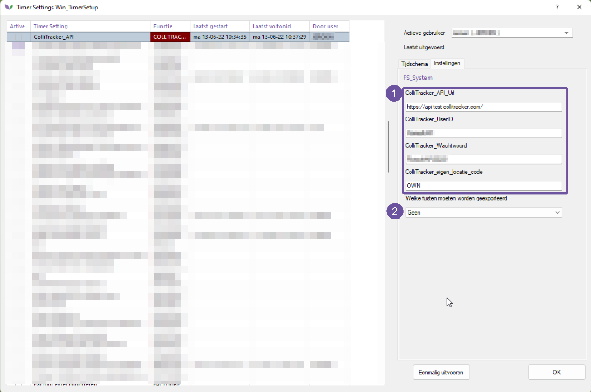

# Collitracker

**Deze handleiding betreft een extern systeem genaamd "Collitracker".**

-----

De module betreft een timer process die de gegevens exporteert. De koppeling voorziet alleen in gegevens richting Collitracker. Er komt geen informatie terug.

De informatie die uit Florisoft komt is afkomstig uit de fustadministratie. Om dit process in te richten dienen onderstaande velden te worden ingevoerd.

1- Deze gegevens dienen aangeleverd te worden.
2- Mogelijke opties bij te exporteren gegevens: alleen inkomend, alleen uitgaand of beide fust stromen exporteren naar Collitracker.