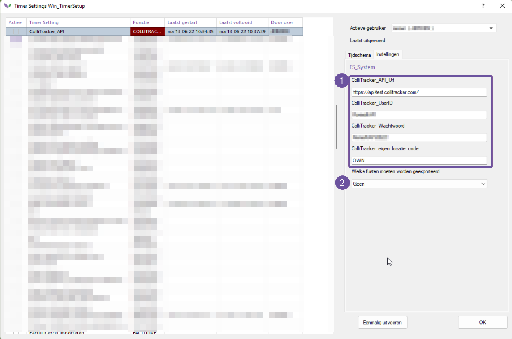

# Florisoft Manual Collitracker - M204

**This manual concerns an external system called "Collitracker".**

-----
The module is a timer process that exports the data. The link only provides data to Collitracker. No information is returned

The information that comes from Florisoft comes from the packaging administration. To set up this process, the fields below must be entered.

<b>Click here for the example image!</b>

1- This information must be supplied.
2- Possible options for data to be exported: only incoming, only outgoing or export both packaging flows to Collitracker.
