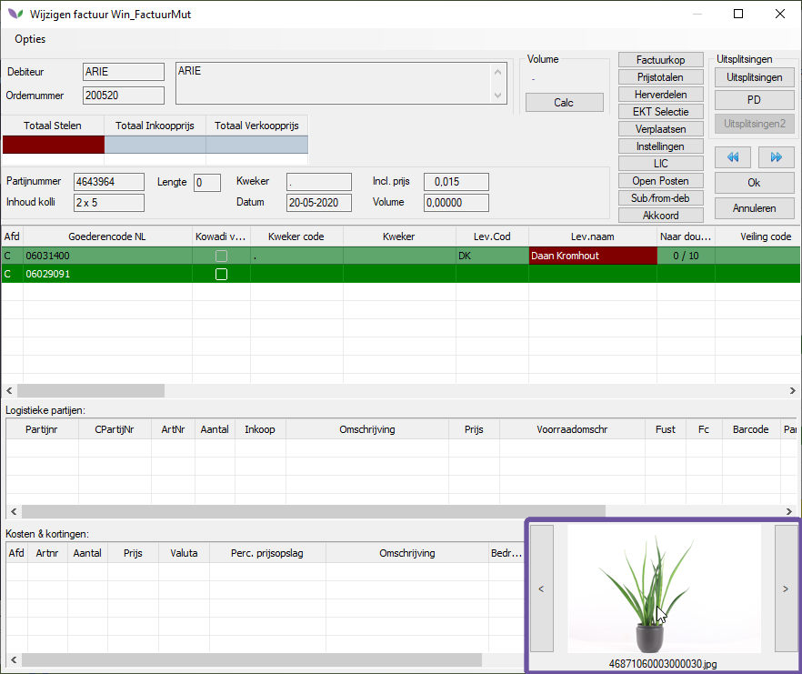
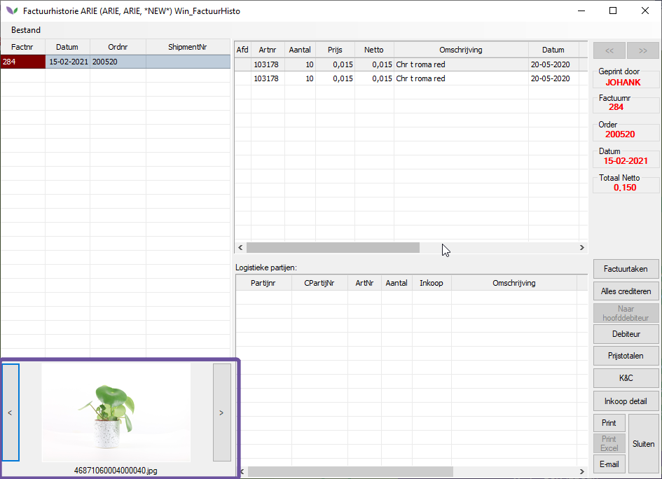

# Florishoot eindcontrole

Met de module Florishoot eindcontrole is het mogelijk om geautomatiseerd via een fotokast orderregels te eindcontroleren. Voordat de producten de vrachtwagen in gaan worden de producten gefotografeerd; eerst wordt de karbouwbarcode_245 (24 karakters lang) gescand. Dit is de barcode die ook op de pickordersticker kan worden afgedrukt. De lopende band geeft een seintje wanneer de foto moet worden gemaakt waarna er een foto wordt gemaakt. De foto's worden in een tijdelijke, instelbare map geplaatst. Middels een kopieer script worden deze lokale foto's naar een server share gekopieerd.

Er is een timer proces (Eindcontrole foto's verplaatsen) die het volgende uitvoert:
- Vanaf een bronlocatie (deze zal moeten worden ingesteld op de eerder genoemde server share) worden de foto's verplaatst maar een in te stellen definitieve locatie. In deze locatie worden de foto's opgeslagen in een mappen structuur: een map voor het debiteurnummer met daarin per order (factident) een map waarin alle foto's voor die order staan. Hierdoor werkt het zoeken snel.
- Per foto wordt een regel aangemaakt in de EindcontroleFoto tabel. Deze tabel wordt onder andere gebruikt om bij te houden welke foto al is afgedrukt op de paklijst.
- Het aantal eindgecontroleerd in de orderregel (EINDCHECK) wordt opgehoogd met aantal uit de barcode van de foto's

Het timer proces draait op de PC waarnaar de foto's door het eerder genoemde script zijn verplaatst.

In het factuur wijzigen scherm is, mits de module Florishoot eincontrole aan staat, een control zichtbaar waar de eindcontrole foto(s) van de orderregel getoond zullen worden, indien deze aanwezig zijn. Dit control is niet aan of uit te zetten; als de module Florishoot eincontrole aan staat, dan is het control zichtbaar.

Als vanuit het onderhoud facturen scherm de paklijst wordt afgedrukt, dan kan ook het aantal gefotografeerd worden afgedrukt. Het aantal zit in de paklijst.dbf in het veld AANTECFOTO (aantal van de eindcontrole foto's). Dit aantal wordt bepaald op basis van het aantal stelen van alle nog niet eerder afgedrukte regels in de EindcontroleFoto tabel. Na het printen wordt de regel gemarkeerd dat deze al is geprint en zal het aantal stelen van deze regel niet meer worden meegerekend.

Als de factuur wordt doorgeboekt en naar de factuur historie gaat, dan worden de foto's van de factuur verplaatst naar een nieuwe map en in een andere structuur op basis van het fact file id van de horder zodat de foto's ook nog zichtbaar zijn vanuit de factuur historie. In dit scherm is het zelfde foto control zichtbaar als in het factuur wijzigen scherm. Dit control is niet aan of uit te zetten; als de module Florishoot eincontrole aan staat, dan is het control zichtbaar.
