# (Technical) documentation KoWaDi client
(Technical) description about setting up and functioning of the KoWaDi client in Florisoft.

## Introduction
KoWaDi is an abbreviation which is used within the Dutch auction compnay for flowers and plants. It stands for Koppel-Wagen-distributie (Torque-Car-Distribution).

The most important function for auction buyers is the ability to automatically scan in a full cart at the entrance control. The result of this is an efficiency advantage because the reporting of a complete cart inside is quicker than scanning individual batches.

This document has been made to provide insight into the (technical) operation of KoWaDi in Florisoft. This is because there is little information to be found at the interface level of the KoWaDi client, different from the regular box monitor screen.

In the 2 chapters it is described which matters must be arranged in order to be able to scan KoWaDi barcodes in Florisoft. 

Chapter 1 describes the prepatory steps required to install KoWaDi to scan barcodes. Think of this of activating this function on the side of the auction (Royal Flora Holland account) and arranging an email address where the KoWaDi messages can be received on.

Chapter 2 described the different steps which play role at scanning the KoWaDi barcodes in Florisoft.

## Step 1: Prepatory activities KoWaDi client
This chapter describes the steps which are always necessary to take to get the scanned KoWaDi barcodes working in Florisoft.

1. Customer must agree on the modules below:

- Timer
- KoWaDi (Torque-Car-Distribution)

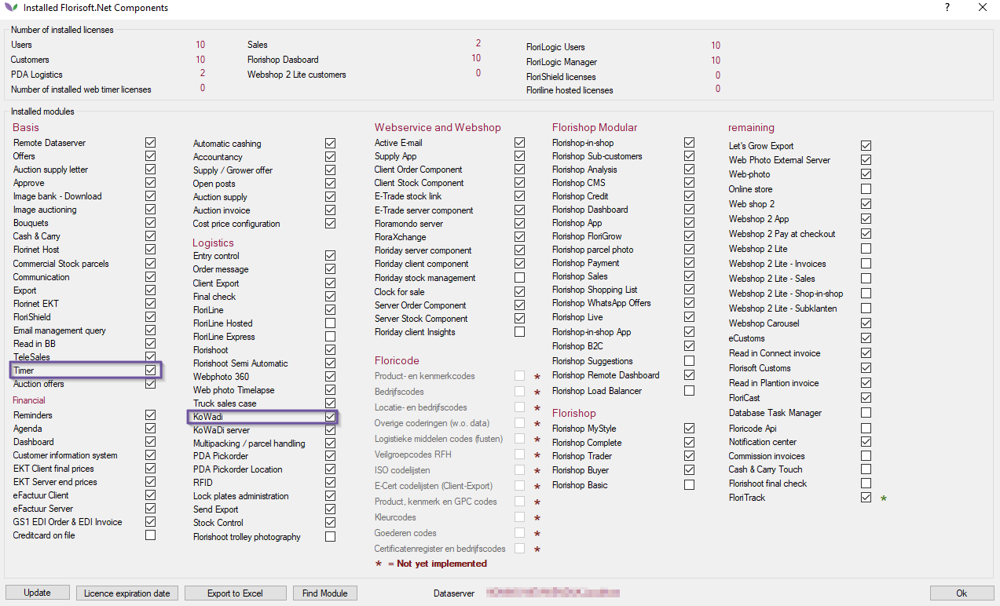

After an agreement, these modules can be activated through a license code.

2. The customer must now arrange an email account which is able to communicate with Florisoft through POP.

The information below is imporant in this regard and must be set by Florisoft:

- POP3 Server
- POP3 port number
- Optional: use of SSL
- Account name (also called username)
- Password

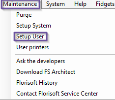

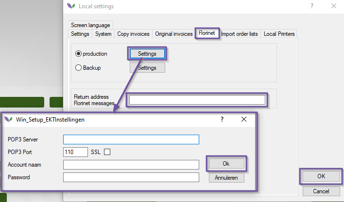

> Attention: the above e-mail information mus tbe entered on the TIMER user of Florisoft. To do this, go to the Maintenance -> Setup User and click the Florinet tab.
>
> Do not forget to fill in the field ccalled Return address Florinet messages. This field must contain the e-mail address for reading KoWaDi messages and therefore the e-mail address is created in this step.

3. The customer must enter the above e-mail address in the KoWaDi service of Royal Flora Holland.

## Step 2 The working of the KoWaDi client explained
This chapter describes the process associated with the scanning of the KoWaDi barcodes.

### Automatic reading of KoWaDi messages
KoWaDi messages  consist of XML files (plain text) with the attribute .XDELIV at the end of the file name. That is why the terms KoWaDi message and delivery message are used interchangeably. Both terms have the same meaning.

> **Note: The terms KoWaDi message and delivery message are used interchangeably and have the same meaning.**

The first step in being able to scan the KoWaDi messages consists of correctly setting the timer process EDI -> NET 440.

1. Set the timer process EDI -> NET 440 as follows:

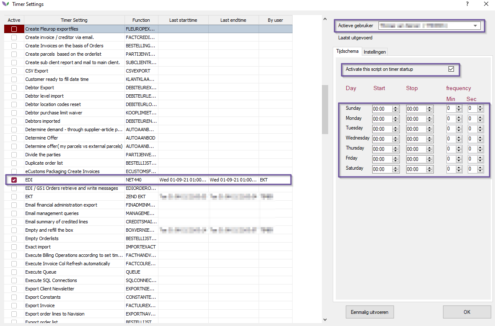

2. Restart TIMER user.

3. When popping the mailbox set from chapter one, in the status bar from Florisoft it must be visible that in addition to all other types there are also DELIVERY messaged be read in. See the screenshot below:

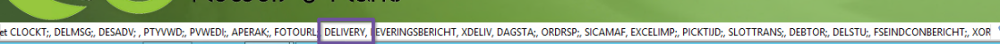

### Checking KoWaDi Posts
By default, the DELIVERY messages are downloaded to the folder. After reading these messages by the timer they are moved to the fodler.

See the screenshot below for an example of a DELIVERY message:

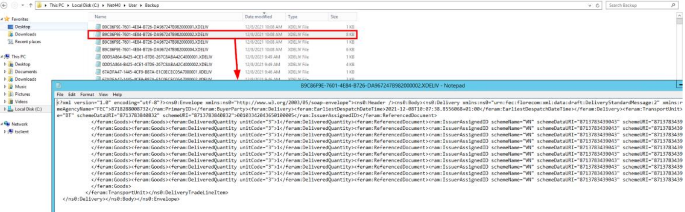

When KoWaDi messages are read in, the relevant data is read into the KOWADI table of the database.

### Explanation key segmens KoWaDi message.
Every auction carthas a unique KoWaDi barcode that is located on an iron plate on onse side of the cart.

The KoWaDi message contains a Transport Unit segment. This is the value of the KoWaDi barcode. See the screenshot below:

In addition to the TransportUnit, the goods on the cart are also visible in the feram:Goods segments:

Each feram:Goods segment represents a lot. An important part of the feram:Goods segments are the feram:ReferencedDocument segments. these contain a unique ID per party. 

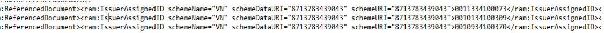

This ID is stored in the PTYBARCODE van de KOWADI table:

### Scanning KoWaDi barcodes in the box monitor

Below is a description about scanning KoWaDi barcodes in the box monitor. As an example the cart below with a number of parties. As an example the party TU DU RED PRINCESS.

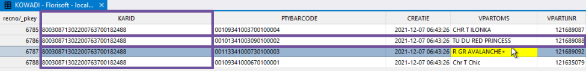

1. Cart enters the box.
2. KoWaDi barcode of the cart is scanned. Florisoft looks up the barcode in the field KOWADI.KARID.
3. Florisoft then looks at all unique PTYBARCODES that belong to a particular KARID (read: all parties on one cart)
4. Now Florisoft will check if the PTYBARCODES from the KOWADI table also appear in the VPARTY (VPARTIJ) table (VPARTIJ.BARCODE)

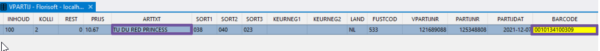

> **Note: the KOWADI.PTYBARCODE is not copied one-to-one in the VPARTIJ.BARCODE. In the KOWADI.PTYBARCODE, each value has a 0100001 (ascending with more recent rules).**
>
**When searching for the relevant barcode in the VPARTIJ.BARCODE, this sequence number is ignored. So the VPARTIJ.BARCODE is the same value as the KOWADI.PTYBARCODE minus the last seven characters. See below an example of the lot of TU DU RED PRINCESS:**
>
>**KOWADI table:**
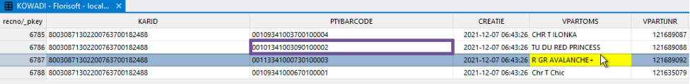
>**VPARTIJ table:**
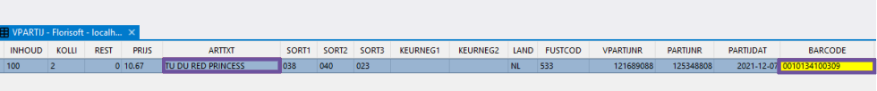

5. In the event of a match, Florisoft knows that this concerns a specific batch from the box monitor that can reported in.

In the KOWADI table it is determined which PTYBARCODES belong to a KARID. Because the KOWADI.PTYBARCODES should also appear in the VPARTIJ.BARCODE field, all lots on a cart are reported in at once when thee is a match between the VPARTIJ.BARCODE and KOWADI.PTYBARCODE.

Printing the stickers in the box monitor screen is the last step of the KoWaDi client. This ends this (technical) description.