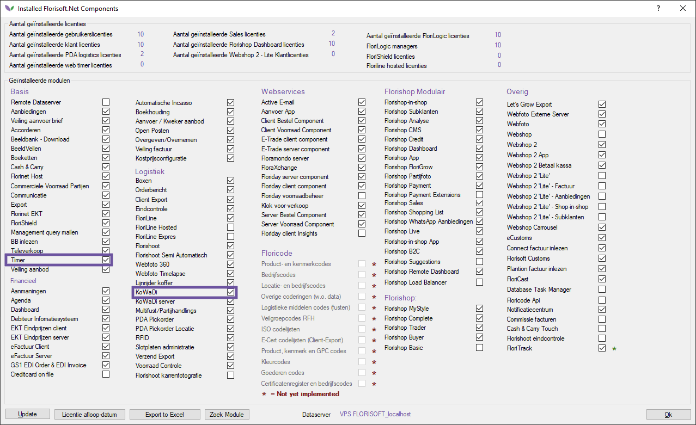
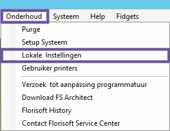
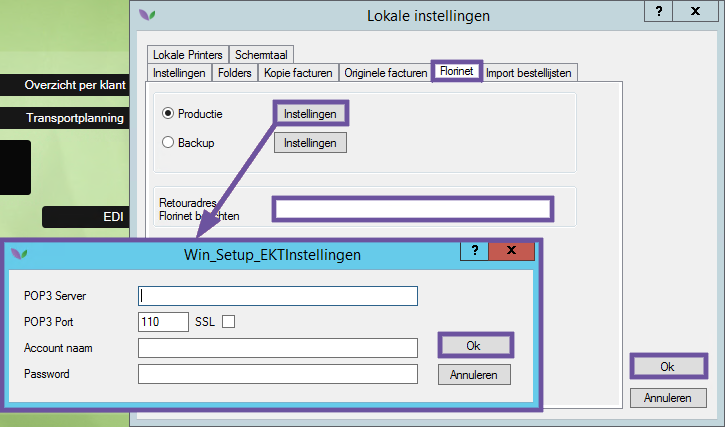
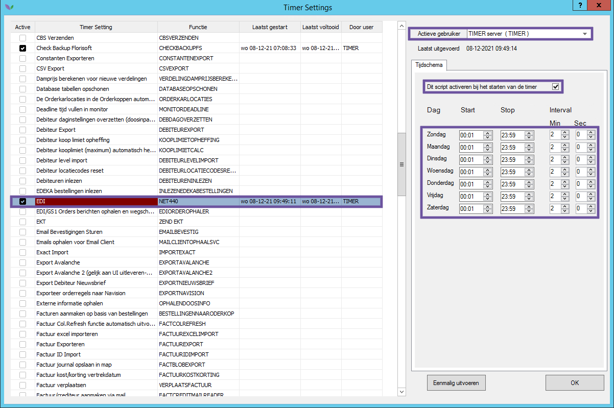
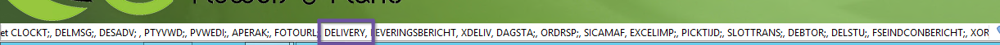
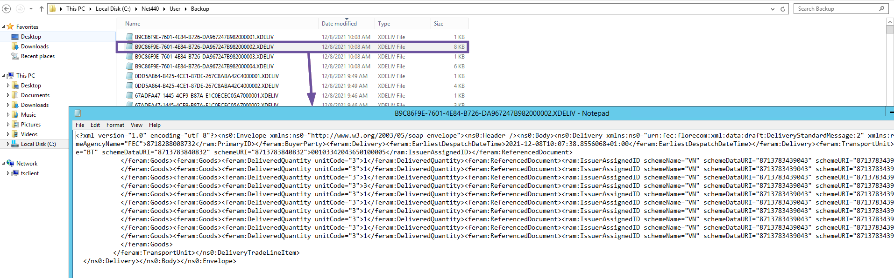
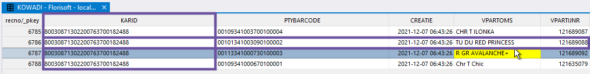
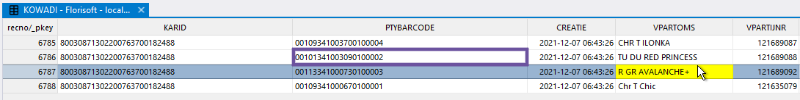

# (Technische) documentatie KoWaDi client

(Teschnische) beschrijving over het inrichten en functioneren van KoWaDi client in Florisoft.

## Inleiding
KoWaDi is een afkorting die wordt gebruikt binnen het Nederlandse veilingbedrijf voor bloemen en planten. Het staat voor Koppel-Wagen-Distributie.

De belangrijkste functie voor veilingkopers is het automatisch binnen kunnen scannen van een volledige kar bij de ingangscontrole. Dit levert een efficiëntie voordeel op omdat het binnen melden van een complete kar sneller verloopt dan het scannen van losse partijen.

Dit document is opgesteld om inzicht te geven in de (technische) werking van KoWaDi in Florisoft. Dit omdat er op interface niveau weinig terug te vinden is van KoWaDi client anders dan het reguliere box monitor scherm.

In een tweetal hoofdstukken wordt beschreven welke zaken geregeld dienen te worden om KoWaDi barcodes te kunnen scannen in Florisoft.

Hoofdstuk één beschrijft de voorbereidende stappen die benodigd zijn om KoWaDi barcodes te kunnen scannen. Denk hierbij aan het activeren van deze functie aan de kant van de veiling (Royal Flora Holland account) en het regelen van een e-mailadres waar de KoWaDi berichten op ontvangen kunnen worden.

Hoofdstuk twee laat de verschillende stappen zien die een rol spelen bij het scannen van KoWaDi barcodes in Florisoft.

## Stap 1: Voorbereidende werkzaamheden KoWaDi client
Dit hoofdstuk beschrijft de stappen die altijd benodigd zijn om het scannnen van KoWaDi barcodes in Florisoft werkend te maken.

1. Klant moet akkoord geven op onderstaande modulen:

- Timer
- KoWaDi

Na akkoord kunnen deze modulen geactiveerd worden middels een licentiecode

2. Klant moet een e-mail account regelen wat in staat is om te communiceren met Florisoft middels POP.

Onderstaande gegevens zijn hierbij van belang en dienen ingesteld te worden door Florisoft:

- POP3 Server
- POP3 poortnummer
- Optioneel: gebruik van SSL
- Accountnaam (ook wel gebruikersnaam)
- Wachtwoord

> Let op: bovenstaande e-mail gegevens dienen ingevuld te worden op de TIMER gebruiker van Florisoft. Ga hiervoor naar het menu Onderhoud -> Lokale instellingen en klik op het tabblad Florinet.
>
> Vergeet niet om het veld Retouradres Florinet berichten in te vullen. Dit veld moet het e-mailadres bevatten voor het inlezen van KoWaDi berichten en is dus het mailadres wat in deze stap aangemaakt wordt.

3. Klant moet bovenstaand e-mailadres invullen in de KoWaDi service van Royal Flora Holland.

## Stap 2: Werking van KoWaDi client uitgelegd
In dit hoofdstuk wordt het proces beschreven wat gelieerd is an het scannen van KoWaDi barcodes.

### Automatisch inlezen KoWaDi berichten
KoWaDi berichten bestaan uit XML bestanden (platte tekst) met als kenmerk .XDELIV aan het einde van de bestandsnaam. Daarom worden de termen KoWaDi bericht en delivery bericht door elkaar heen gebruikt. Beide begrippen hebben dezelfde betekenis.

> **Let op: de termen KoWaDi bericht en delivery bericht worden door elkaar heen gebruikt en hebben dezelfde betekenis.** 

De eerste stap bij bij het kunnen scannen van KoWaDi berichten bestaat uit het correct instellen van het timer proces EDI -> NET440.

1. Stel het timer proces EDI -> NET440 als volgt in:

2. Herstart de TIMER gebruiker.

3. Bij het poppen van de ingestelde mailbox uit hoofdstuk één moet in de statusbalk van Florisoft zichtbaar zijn dat er naast alle andere typen ook DELIVERY berichten ingelezen worden. Zie onderstaand screenshot:

### Controleren KoWaDi berichten
Standaard worden de DELIVERY berichten gedownload naar de map ...\Net440\User\In. Na het inlezen van deze berichten door de timer worden ze verplaatst naar de map ...\Net440\User\Backup.

Zie onderstaand screenshot voor een voorbeeld van een DELIVERY bericht:

Bij het inlezen van KoWaDi berichten wordt de betreffende data ingelezen in de KOWADI tabel van de database.

### Uitleg belangrijkste segmenten KoWaDi bericht
Iedere veilingkar heeft een unieke KoWaDi barcode die zich op een ijzeren plaat bevindt aan één van de zijkanten van de kar.

In het KoWaDi bericht bevindt zich een TransportUnit segment. Dit is de waarde van de KoWaDi barcode. Zie onderstaand screenshot:

Bij het inlezen van het bericht in Florisoft wordt deze waarde opeslagen in het veld KARID van de KOWADI tabel:

Naast de TransportUnit zijn ook de goederen op de kar zichtbaar in de feram:Goods segmenten:

Ieder feram:Goods segment staat voor een partij. Een belangrijk onderdeel van de feram:Goods segmenten zijn de feram:ReferencedDocument segmenten. Deze bevatten een uniek ID per partij. 

Dit ID wordt opgeslagen in het veld PTYBARCODE van de KOWADI tabel:

### Scannen van KoWaDi barcodes in de box monitor
Hieronder volgt een beschrijving over scannen van KoWaDi barcodes in de box monitor. Als voorbeeld onderstaande kar met een aantal partijen. Als voorbeeld partij de TU DU RED PRINCESS. 

1. Kar komt binnen in de box.
2. KoWaDi barcode van de kar wordt gescand.
Florisoft zoekt de barcode op in het veld KOWADI.KARID.
3. Florisoft kijkt vervolgens naar alle unieke PTYBARCODES die horen bij een bepaald KARID (lees: alle partijen op één kar)
4. Nu gaat FLorisoft controleren of de PTYBARCODES uit de KOWADI tabel ook voorkomen in de VPARTIJ tabel (VAPRTIJ.BARCODE)

.png)

> **Let op: de KOWADI.PTYBARCODE wordt niet één op één overgenomen in de VAPRTIJ.BARCODE. In de KOWADI.PTYBARCODE heeft iedere waarde een 0100001(oplopend bij recentere regels)**
>
>**Bij het zoeken van de betreffende barcode in de VPARTIJ.BARCODE wordt dit volgnummer genegeerd. De VPARTIJ.BARCODE is dus dezelfde waarde als de KOWADI.PTYBARCODE min de laatste zeven karakters. Zie hieronder het voorbeeld van de partij TU DU RED PRINCESS:**
>
>**KOWADI tabel:**
>
>**VPARTIJ tabel:**
.png)

5. Bij een match weet Florisoft dat dit een specifieke partij uit de box monitor betreft die binnen gemeld kan worden.

In de KOWADI tabel is bepaald welke PTYBARCODES horen bij een KARID. Omdat de KOWADI.PTYBARCODES als het goed is ook voorkomen in het VPARTIJ.BARCODE veld, worden alle partijen op een kar in één keer binnen gemeld wanneer er een match is tussen de VPARTIJ.BARCODE en KOWADI.PTYBARCODE.

Het printen van de stickers in het box monitor scherm is de laatste stap van de KoWaDi client. Hiermee eindigt deze (teschnische) beschrijving.