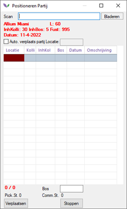
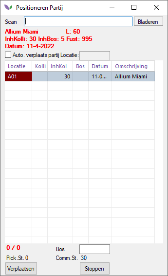
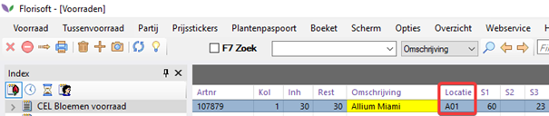
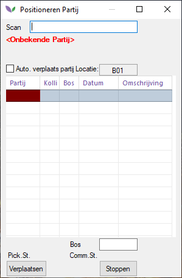
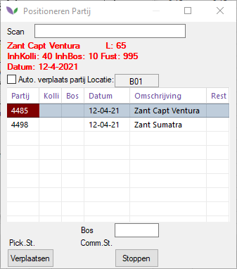
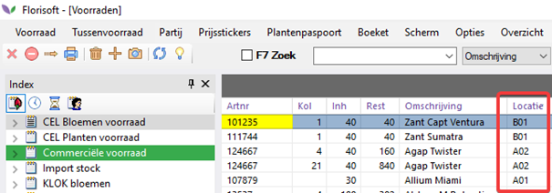
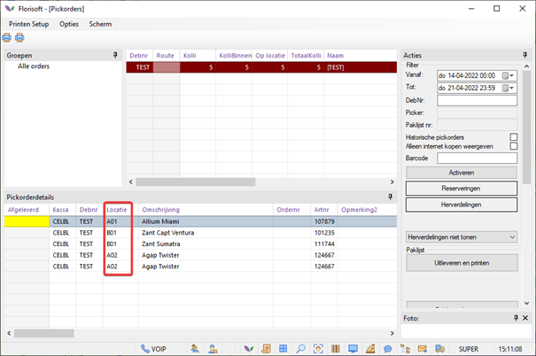
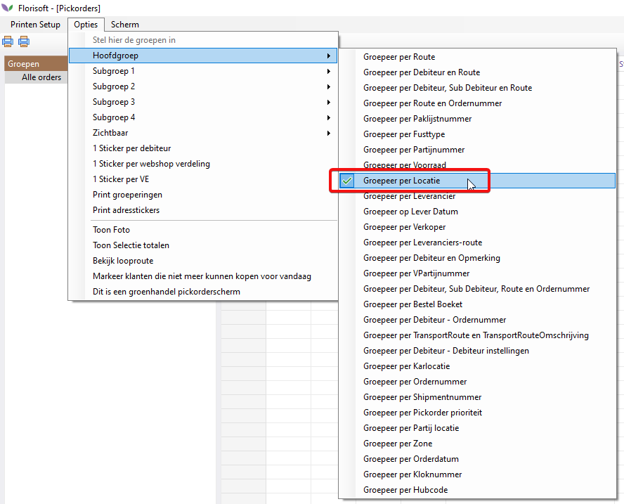
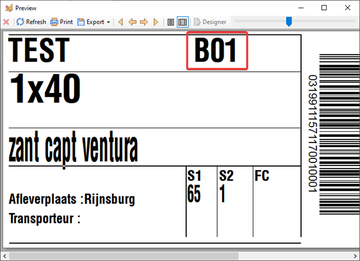
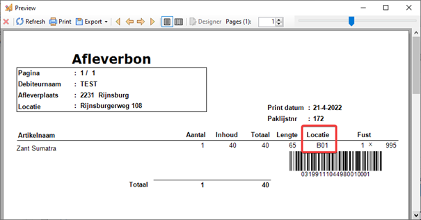

# PDA Pickorder locatie

## Inleiding:

Met de module PDA Pickorder Locatie kan elke medewerker partijen op locatie zetten waardoor zij uiteindelijk snel en gemakkelijk de producten kunnen vinden met orderpicken. Door een locatie toe te wijzen aan de partijen in de celvoorraad kunnen deze snel en efficiënt gevonden worden.

Je hebt hiervoor de module PDA Pickorder Locatie nodig. Op de PDA valt deze module onder de knop 'Locatie'.

## Inrichting:

Er zijn twee manieren om deze module te gebruiken:

1.	Eerst de locatie scannen, daarna de partij.
2.	Eerst de partij scannen, daarna de locatie. 

> _Dit wordt bepaald middels systeeminstelling PDALocatiePartijScan (vraag support om dit om te zetten indien nodig)_

**Partijen op locatie zetten:**

Mocht je de locatie willen scannen, dan adviseren we om elke kar of plek in de cel een barcode toe te wijzen en deze op stevige stickers af te drukken.

**Eerst partij scannen, daarna locatie.**
> _systeeminstelling: PDALocatiePartijScan staat op false_

1.	Open de PDA en druk op de knop 'Locatie'.

2.	Het positioneren partij scherm opent. In dit scherm kun je de partij gaan scannen. 
3.	We scannen in dit voorbeeld een Allium Miami.

4.	Wijs een locatie toe door bijvoorbeeld de sticker A01 te scannen en de locatie wordt gevuld met A01.

In de voorraad krijgt deze partij locatie A01. 

**Eerst locatie scannen, daarna partij.**
> _systeeminstelling: PDALocatiePartijScan op true_

1.	Open op de PDA de module 'Locatie'.
2.	Scan de locatie barcode of vul deze handmatig in het scanveld. In dit voorbeeld gebruiken we locatie B01.
3.	Scan de partij die je op locatie B01 wilt zetten. Bijvoorbeeld Zant Sumatra.

## Pickorders printen na toewijzen locaties

Verdeel een aantal partijen die op locatie staan naar een debiteur en open het 'Pickorders scherm'.

Net als in de voorraad kan in het Pickorders scherm kolom 'locatie' aangezet worden om te zien op welke locatie de partij staat die gepickt moet worden. 

Ook kunnen Pickorders gegroepeerd worden op locatie.

De locatie kan uiteraard ook op de pickorder paklijst of sticker geprint worden.

