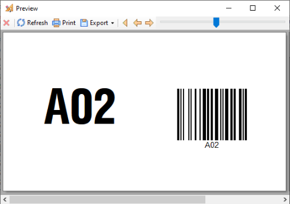
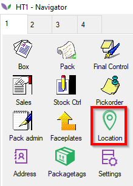
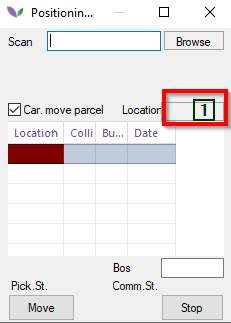
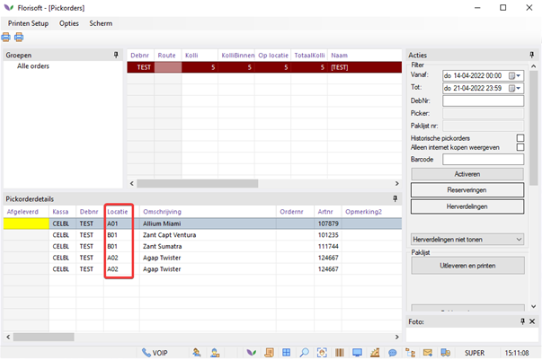
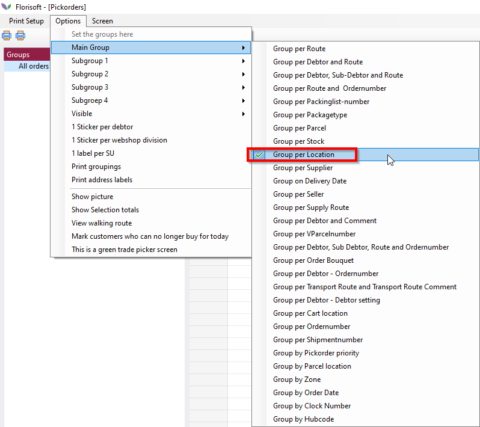

# PDA Pickorder location

## Introduction:

With the PDA Pickorder Location, every employee can place batches on location, so that they can eventually find the products quickly and easily with order picking. By assigning a location to the parcels in the cell stock, they can be found quikcly and efficiently.

You need the module: 'PDA Pickorder Location' for this. On the PDA, this module falls under the Location button.

## Design:

There are two ways to use this module:

1. Scan the location first, then the parcel.
2. Scan the parcel first, then the location.

> _This is determined by system setting PDALocationPartijScan (ask support to convert this if necessary)_

**Putting parcels on location**

If you want to scan the location, we advise you to assign a barcode to every cart or place in the cell and print it on sturdy stickers.

**Scan parcel first, then location**
> _System setting: PDALocationPartijScan is false_

1. Open the PDA and press the Location button.

2. The positioning parcel screen opens. In this screen you can start scanning the parcel.
3. In this example we scan an Allium Miami.

4. Assign a location by, for example, scanning the sticker A01 and the location is filled with A01.

In the stock, this parcel is given the location A01.

**Scan location first, then parcel**
> _System setting: PDALocatiePartijScan to true_

1. On the PDA, open the Location module
2. Scan the location barcode or entir it manuall in the scan field. In this example we use location B01.
3. Scan the parcel you want to place at location B01. For example, Allum Miami.

(At location "1" there should stand "B01")

## Print pickorders after assigning locations

Distribute a number of parcels that are on location to a debtor and open the Pickorders screen.

Just like in the stock, the'location' column can be switched on in the Pickorders screen to see where the parcel that needs to be picked up is located.

Pickorders can also be grouped by location.

The location can also be printed on the pick order packing list or sticker.

